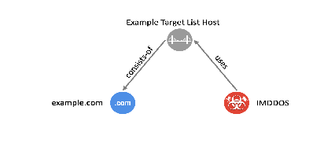

= image:images/oasis-logo.png[OASIS logo,width=306,height=63]
:xrefstyle: short
:stylesdir: css
:stylesheet: stix.css
:toc: macro
:toclevels: 4
:star: *
:bracket: [
:sectnums!:

STIX Best Practices Guide +
Version 1.0 

== *Introduction*

A best practice is defined as:

_“…a method or technique that has been generally accepted as superior to any alternatives because it produces results that are superior to those achieved by other means or because it has become a standard way of doing things._” _[1]_

The _STIX Version 2.1 OASIS Standard_ [2] defines the Structured Threat Information eXpression (STIX) language using normative statements. Examples of these normative statements are *MUST*, *SHOULD*, *MAY*, etc. The STIX specification *MUST* normative statements must be followed, for the organization or implementation to be STIX compliant. However, adhering to best practices for statements such as *SHOULD* or *MAY* is usually voluntary (although a trust group might require it). Additionally, there are many other issues, such as data quality and interoperability that should not be included in a specification but are extremely important when sharing information. This guide suggests best practices to use for STIX content, both for some non-*MUST* normative statements and for considerations beyond the specification.

There are two types of best practices as alluded to in the quote above: superior techniques as opposed to standard techniques. Sometimes a superior technique has been discovered and the best practice is a description of what to do and _why_. When a best practice describes a standard technique it often is an agreed-upon choice for something that could be done in a number of ways, _none of which is superior_. However, if all producers of content use the agreed-upon way, it supports interoperability.

This guide is organized as follows:

Section link:#general-best-practices-ideas[2] link:#general-best-practices-ideas[discusses] general ideas about interoperability best practices.

Section link:#best-practices-for-general-stix-concepts[3] explores general STIX best practices.

Section link:#heading=h.lnxbz9[4] examines best practices for common STIX types and properties.

Sections link:#best-practices-for-sdos-and-sros[5] and link:#best-practices-for-scos[6] detail best practices for different STIX object types.

Section link:#best-practices-for-patterns[7] covers indicator patterns.

Section link:#best-practices-for-vocabularies-and-enumerations[8] discusses best practices for open vocabularies and enumerations.

Section link:#best-practices-for-extensions[9] talks about best practices for STIX extensions.

Section 10 explores other best practices.

== *General Best Practices Ideas*
=== *Support Interoperability*

The driving force behind the STIX standard is to support interoperability. If most STIX producers and consumers follow agreed upon best practices, interoperability will be more likely.

The purpose of this supplemental document is to discuss guidelines that are inappropriate for inclusion in a specification but need to be considered. The STIX standard is defined independently of any specific storage or serialization method. Many of the best practices discussed in this document are suggestions for design and implementation of storage or serialization for tools that use STIX as their exchange language.

Another document, the _STIX 2.1 Interoperability Test Document_ [3] sets the stage for more effortless sharing of Cyber Threat Intelligence (CTI) information expressed in STIX. However, that document defines the _minimal_ policies that can be used to determine if a STIX implementation or serialization is recognized as being "`interoperable.`"

By following the combined guidelines from all three documents (The STIX standard, the STIX Interoperability Test Document, and this guide), STIX users can more freely share CTI information, by ignoring the underlying representation used by each producer and consumer.

=== *Use Common Object Repositories*

*Best Practice: Organizations should leverage common object repositories when preparing STIX content.*

Many CTI entities are commonly used and having numerous, duplicate STIX objects representing the same concept has always been considered wasteful and problematic. Several decisions made when writing the STIX specification were aimed at avoiding duplication, which include:

* specification defined instances of TLP data markings,
* kill chain phases referred to by their names, not as separate objects, and
* deterministic identifiers for STIX cyber-observable objects (SCOs).

Having a publicly available repository of common CTI objects has always been on the "`wish list`" of members of the Organization for the Advancement of Structured Information Standards (OASIS) Cyber Threat Information Technical Committee (CTI-TC).

MITRE currently maintains a repositoryfootnote:[https://github.com/mitre/cti] of STIX objects to represent both the ATT&CKfootnote:[https://attack.mitre.org/] and Common Attack Pattern Enumeration and Classification (CAPEC)footnote:[https://capec.mitre.org/] frameworks. This is an example of the case where organizations want to share their cyber threat intellectual property, as represented in STIX.

However, there are other STIX objects that are general enough that they should be hosted in a common repository, defined once, and reused by the broader STIX community. The Homeland Security Systems Engineering & Development Institute (HSSEDI), with support of OASIS, has stood up such a repositoryfootnote:[https://github.com/oasis-open/cti-stix-common-objects] to help foster consistency across STIX threat-sharing efforts. By using this repository, the amount of data transmitted over the wire is reduced because only identifier references need to be shared. Maintainers of such repositories should avoid containing the same object as other repositories, but if they do, they must be an exact copy with the same UUID.

Currently, the object types that are included in this repository are locations (e.g., countries) and identities (e.g., industry sectors). Vulnerability objects representing each Common Vulnerabilities and Exposures (CVE) are also found in the repository. Other types, like software (e.g., Microsoft Word – version x) or tools (e.g., Remote Desktop Protocol) could be added at a later time.

Other object types may not be practical to store in such a repository. For instance, there are over four billion different IPv4 addresses; however, using deterministic identifiers, which renders SCO identifiers uniquely, is an alternative to storing such object instances in a common repository.

=== *Avoid Deprecated and Reserved Terms*

*Best Practice: Deprecated constructs and reserved terms should be avoided when creating STIX content.*

The STIX 2.1 specification contains a few definitions that have been marked as deprecated. It is a best practice to avoid any construct that is deprecated.

*Best Practice: STIX Cyber-Observable Objects (SCOs) should be used instead of the Cyber Observable Container.*

With the introduction of STIX Cyber-Observable Objects (SCOs), the Cyber Observable Container from STIX 2.0 was deprecated, but remains in the STIX 2.1 specification for backwards-compatibility. It is a best practice to use SCOs and perhaps convert existing content in cyber observable containers to SCOs.

In STIX 2.0, cyber observables were local to an observed data object. However, SCOs are top-level objects, so they are globally referable. One immediate advantage of this approach is that it reduces possible duplication of cyber observable data. This allows for the population of common SCOs in repositories that are available to a trust group or the entire user community, or the use of deterministic ids, as discussed in Section link:#deterministic-identifiers[4.3].

*Best Practice: The STIX Extension Definition mechanism should be used instead of the custom objects, custom properties, and custom extensions mechanism.*

Custom properties, objects and extensions, described in Section 11 of the specification, have been deprecated, but remain in the STIX 2.1 specification for backwards-compatibility. The new Extension Definition facility is defined in Section 7.3 of the specification.

*Best Practice: Existing custom objects, custom properties, and custom extensions should be converted to use the new STIX Extension Definition mechanism.*

Because custom objects, custom properties, and custom extensions will no longer be supported in the next major release of the specification, it is best practice to convert the use of them to the STIX extensions as soon as possible. This might require the creation of an extension definition, which would need to be available to all consumers with whom this content will be shared. The extension definition could be stored in a common object repository so it is available for any consumer who receives such content.

=== *Restrict Allowed Content within Trust Groups*

*Best Practice: Trust groups can further restrict the allowed content that they consider valid.*

A trust group is a group of consumers and producers that have an agreement (perhaps legal) on how to share STIX content. Trust groups can further restrict the allowed content that they consider valid, beyond what is found in the specification to meet their sharing requirements. For instance, a trust group might determine that deprecated content is not accepted. This would be enforced within the trust group. Many such choices are suggested in this document.

== *Best Practices for General STIX Concepts*

=== *Versioning*

STIX objects might evolve over time—or contain incorrect or stale information—and need to be updated. One way to do this is to create a new version of an object. The version of an object is specified by three common properties: `id` , `modified` and `revoked`. Not all STIX objects have these properties, and as such _may_ not support versioningfootnote:[`id`, `modified` and `revoked` could be added as part of an extension]. An object can only be versioned by the object creator, as specified by the *created_by_ref* property. This is a strict restriction. Although others might notice that an object needs to be updated, they cannot create a new version. Options for this use case will be discussed later.

Object creators may not want to create a new version of an object if it has changed significantly – which is called a _material change_. A material change can be thought of as one that changes the meaning of the object. For instance, if an indicator’s *pattern* property was changed to match a completely different SCO, this would be a material change, and versioning is not appropriate. However, if extra text was added to the *description* property to describe the indicator more fully, it would make sense to just create a new version of the object. Trust groups should specify when versioning is appropriate or not.

*Best Practice: Discard non-current versions unless there is a need to be able to investigate the object’s history.*

The specification defines the current version of an object as the one with the most recent timestamp contained in the *modified* property of the various versions. The specification contains no guidance for what to do with non-current versions. The best practice would be to discard non-current versions, unless there is a need to be able to investigate the object’s history. This is a product design issue.

*Best Practice: If a consumer receives two objects that are different, but have the same identifier and modified timestamp, new objects should be created for both.*

If a consumer receives two objects that are different but have the same id and modified timestamp, the best practice could be to create new objects for both, perhaps with additional text in the *description* property describing the duplication issue. Reusing existing UUIDs is not permitted as per the specification, unless it is a new version of the object.

*Best Practice: When the content of an object is no longer valid, it should be revoked.*

When the content of an object is no longer valid, it is best practice for the object creator to revoke it.

*Best Practice: When a consumer receives a revoked version of an object, all versions of the object should be deleted.*

When a consumer receives a revoked version of an object, the best practice would be to delete any versions of the object. Of course, this may not be possible if the full history of all objects is retained. Once again, this is a product design issue.

*Best Practice: The "`derived-from`" relationship, Opinion object, or Note object should be used to update existing objects.*

If a producer/consumer determines that an object contains information that should be updated, there are four options from which to choose.

[arabic]
. Object creators have the option of creating a new version of the object if they determine a material change is not being made.
. Producers can create a new object with a new id that contains all of the correct information in the original object, plus any corrections or additions, and also introduce a relationship object between the original and new object of type "`derived-from`". Producers who are not the object creator of the original object cannot revoke it, according to the versioning rules in the specification.
. Producers who are not the object creator can use the Opinion object to comment on the content of the object. The *object_refs* property of the Opinion object should refer to the object that is being commented on.
. Producers who are not the object creator can enrich the content of an object via the use of the Note object. Once again, the *object_refs* property of the Note object should refer to the object that is being enriched.

=== *Anonymization*

*Best Practice: Create an anonymous Identity object rather than omitting the created_by_ref property.*

The specification states that object creators should use the *created_by_ref* property to indicate who the creator is; however, there are many situations where the object creator chooses to remain anonymous. One way to do this is to omit the *created_by_ref* property. Unfortunately, consumers might not trust content when they don’t have any knowledge of who created the object.

A best practice is to create an anonymous Identity object, which can then be used to populate the *created_by_ref* property. A trust group can maintain a mapping between the anonymized Identity and the true Identity of the object creator. Or, the Identity object might not be anonymized, but also not shared, but this is not a best practice. In both cases, a consumer can decide that a producer with that Identity reference is reliable, without needing to know their true identity.

=== *Handling Dangling References*

*Best Practice: Unless a reference refers to an object from a common repository, producers should attempt to avoid dangling references.*

A best practice mentioned in section 2.3, was to make use of commonly defined objects from a common object repository to avoid sharing redundant information. In other situations, including an object that has been created by the producer should be included, if possible. Of course, there is an obvious trade-off between avoiding dangling references and transmitting additional objects in the bundle.

*Best Practice: When a dangling reference is found, the producer of the content should be queried for the missing object.*

The specification states that objects can contain references to other objects that have not been shared (called a "`dangling`" reference). In this case, the consumer should query the same producer for the missing object, but there is no guarantee that it will be available. Contact information should be available in the producer’s identity object (see section 3.4).

=== *Defining and Using Identities*

*Best Practice: Identity objects that are not anonymized should include contact information.*

To support the resolving of dangling references, when appropriate, producers should use an Identity object that includes contact information.

*Best Practice: All SDOs/SROs created by an object creator should contain the identifier of the object creator’s Identity object in the created_by_ref property.*

Although the *created_by_ref* property is optional, it is a best practice to include it when creating an object. Anonymization can be handled using the methods described in section 3.2. The object creator is an important aspect of the versioning of STIX objects. Additionally, knowing the creator of an object could have an impact on the consumer’s confidence in the object.

=== *Data Marking*

*Best Practice: There is never a need to share a TLP Data Marking object.*

As stated in the specification, Traffic Light Protocol (TLP) object instances should not be shared. The specification requires that all implementations of STIX must be aware of the TLP instances defined within the specification. Because all products that use STIX must know of these instances, there is no need to ever share them, so a producer should not include a TLP data marking in their content.

*Best Practice: Ignore any TLP data marking object that is shared.*

If a TLP data marking is encountered by a consumer in shared content, it might be an exact copy of what is found in the specification, or a TLP data marking object with a different identifier, or other different property values. Because data markings cannot be altered and the TLP markings in the specification are canonical, any TLP marking found in shared content should be ignored. If possible, any object that refers to the unofficial TLP marking should be replaced by the identifier from the specification.

*Best Practice: Only provide data markings restricting the use of SCOs when necessary.*

Data markings can be associated with any STIX object. As described in Section 7.2 of the specification, data markings are useful to represent restrictions, permissions, and other guidance for how data can be used and shared. They can also be used to indicate the intellectual property of the object, i.e., copyright or terms of use information. These uses are not necessarily useful for many of the SCO types, although not prohibited. For instance, there is no intellectual property associated with an IP address. The existence of all IP addresses is known; therefore, it makes no sense to restrict the sharing of an IP address SCO. However, a producer may want to provide guidance related to the fact that it has observed an IP address. For this use case, it is a best practice to add a data marking to the Observed Data object rather than the IP Address object. Alternatively, other SCO types might contain information for which guidance on its use might be needed (e.g., an Email Message SCO).

=== *Bundles*

*Best Practice: STIX Bundle objects should be treated as transitory objects rather than permanent objects.*

As described in the specification document, a bundle is a container with no cyber threat intelligence semantics. It is a best practice to treat a bundle as a transitory object, therefore there is no rationale to implement them as a persistent object.

*Best Practice: All STIX 2.0 objects should be upgraded to STIX 2.1 objects.*

Bundles in STIX 2.1 are not version specific as they are in STIX 2.0. They may contain objects from different versions of STIX. How to persist objects of different versions is a product design issue, but it is a best practice to upgrade all STIX 2.0 objects to STIX 2.1 objects.footnote:[The stepper is an example of a reference implementation of the needed functionality – see https://github.com/oasis-open/cti-stix-elevator]

*Best Practice: Include Identity objects referred to by other objects in the bundle.*

As discussed in section 3.3, resolving a dangling reference can be possible by using the contact information of the producer of the bundle. Therefore, the producer’s Identity object should be contained in the bundle. Additionally, the bundle may include objects created by someone other than the producer, so the associated Identity objects should be included where possible. Trust groups can keep track of the producers of content in some way, which might obviate the need to always include the producer’s Identity object.

== *Best Practices for Common Types and Common Properties*
=== *External References*

*Best Practice: When possible, use consistent source names to identify external sources.*

The source name of an external reference is used to identify the system, registry, organization, etc., which is the source of the reference. Consistent names should be used, especially when the external source is a commonly known registry. Examples are: capec, veris, mitre-attack, cwe, and cve. Trust groups may agree on an additional fixed set of source names.

=== *Hashes*

*Best Practice: SHA-256 should be used by content producers when generating a hash.*

A hash in STIX is represented by the hashes type (Section 2.7 of the specification). It is a set of key/value pairs, where the key is the hash algorithm of the hash value. The hash algorithm value is selected from the open vocabulary hash-algorithm-ov. The inclusion of various hash algorithms supports SCOs, which capture observed data. Many of the included hash algorithms are no longer safe to use but may still be observed. However, when a hash is created by a content producer, it is a best practice to use a SHA-256 hash. A hash could be created by a producer for external references or artifacts.

=== *Deterministic Identifiers*

*Best Practice: Deterministic identifiers should be generated for SCOs using identifier contributing properties as defined in the specification to reduce the number of duplicate SCOs.*

In Section 2.9 of the specification, it is recommended that UUIDv5 identifiers be used for STIX SCOs to reduce the number of duplicate SCOs that consumers must retain. The specification provides default rules for generating this UUIDv5. It is a best practice to use the identifier contributing properties as defined in the specification.

Trust groups can use their own set of rules for generating UUIDv5 identifiers, assuming their content will not be shared outside the group. If it ever is, de-duplicating would be impaired.

The algorithm for computing deterministic identifiers in the specification makes use of the identifier contributing properties listed for each SCO type. Because other properties do not play any role in creating the identifier, it is possible for more than one SCO to have the same identifier yet contain different information. How to proceed in this situation is a product design issue.

*Best Practice: Deterministic identifiers are not always appropriate given the use case and the SCO type.*

Although using deterministic identifiers (UUIDv5) can be useful to avoid having many different objects for the same cyber observable, it is not always the appropriate choice for an SCO. For instance, there is probably no reason to use a UUIDv4 identifier for an ipv4-address SCO, however, it could make sense for an email-message SCO because most email-message SCOs would contain unique information. In other situations, it often depends upon the use case. An example is a File SCO. In certain use-cases, the SCO represents an actual file, in others it is a placeholder for a file name.

=== *Kill Chain Phases*

It was decided that there would not be STIX objects for specifying kill chains and kill chain phases. In general, they have no extra information other than their names, and there are not that many different ones that are commonly referred to. Trust groups can define kill chains of their own if the generally known onesfootnote:[e.g., https://www.lockheedmartin.com/en-us/capabilities/cyber/cyber-kill-chain.html[Lockheed Martin Cyber Kill Chain]™ and http://attack.mitre.org/[MITRE ATT&CK]®] are not sufficient.

=== *Timestamps*

*Best Practice: When specifying the modified time for an object, the number of digits of sub-seconds that should be provided is three.*

The specification of timestamps does not limit the number of digits of sub-seconds that can be provided, but it is generally assumed that the number should be between three and six digits. For the created and modified common properties, three digits are required but others are permitted. Because the modified date is used to determine the version of an object, it is a best practice to use exactly three digits.

Other timestamps, such as those associated with Observed Data, might need additional precision. However, having more than nanosecond precision could cause interoperability issues, which are discussed in the specification.

=== *Labels*

*Best Practice: Labels should only be used for content that cannot be represented using other STIX properties.*

Labels are used to share an aspect of a STIX object, but the terms used are not defined within the specification. Trust groups should agree on a fixed set of terms and their semantics. Labels can also be useful to mark STIX objects for a purpose internal to an organization or tool. For instance, how to display a STIX object in a tool’s interface might be the type of information that could be stored as a label.

Care should be taken when choosing label names. Using a prefix to identify a producer or trust group might help avoid name collisions. Labels could have multiple parts – e.g., foo:bar:baz, for related labels.

It is a best practice to use labels only for content that cannot be represented using the other properties defined in the specification. Additionally, using an extension might make more sense to express certain content. Lastly, data marking is the appropriate object type in STIX to use when representing issues such as shareability, ownership, sensitivity and other policies of the data.

=== *Spec Version*

*Best Practice: The spec_version property should be provided on SCOs.*

For the sake of completeness, it is a best practice to include the *spec_version* property in all newly created SCOs. It is optional because SCOs did not exist in STIX 2.0.

=== *Confidence*

*Best Practice: STIX content should leverage a confidence scale that is selected from Appendix A of the STIX specification.*

https://docs.oasis-open.org/cti/stix/v2.1/os/stix-v2.1-os.html#_1v6elyto0uqg[Appendix A of the specification] contains various commonly used confidence scales and their agreed upon conversion to a STIX Confidence Value. Trust groups should agree on the scale that is being used. It is best practice to choose one from Appendix A.

=== *Best Practices for Optional Common Properties*

*Best Practice: Each object should include a confidence score and external references to provide users of the information with valuable context.*

Table 1 summarizes the best practices for including optional common properties when creating a STIX object.

*Table 1: Optional Common Properties to Provide as a Best Practice*

[width="100%",cols="50%,50%",options="header",]
|===
|Property |Discussion
|confidence |Helpful for consumers to evaluate the usefulness of this object
|external_references |Supplement the object with relevant non-STIX formatted information
|===

== *Best Practices for SDOs and SROs*

=== *Best Practices for Optional Properties*

*Best Practice: Optional properties on STIX Domain Objects (SDOs) and STIX Relationship Objects (SROs) listed in Table 2 should be populated to make them more informative.*

In general, the more properties populated on a STIX object, the more informative it will be. For various SDO and SRO types, Table 2 suggests those optional properties (at a minimum) it is a best practice to populate, if possible. See the specification for a full set of the optional properties for each object type.

*Table 2: Optional Properties for each SDO to Provide as Best Practice*

[width="100%",cols="50%,50%",options="header",]
|===
|Type |Properties
|Campaign |*first_seen*, *objective*
|Course of Action |*description*
|Grouping |*description*, *name*
|Identity |*identity_class*, *sector*
|Incident |*description*
|Indicator |*indicator_type*, *kill_chain_phases*
|Infrastructure |*description*, *infrastructure_type*, *first_seen*, *kill_chain_phases*
|Intrusion Set |*first_seen*, *goals*, *primary_motivation*
|Malware |*capabilities*, *malware_types*, *operating_system_refs*, *sample_refs*
|Note |*authors*
|Observed Data |*first_observed*
|Opinion |*authors*, *explanation*
|Sighting |*first_seen*, *last_seen*, *where_sighted_refs*
|Threat Actor |*aliases*, *first_seen*, *goals*, *primary_motivation*, *threat_actor_type*
|===

=== *Attack Patterns*

*Best Practice: STIX content that references ATT&CK or CAPEC should leverage the authoritative Attack Pattern objects.*

There are several publicly available attack pattern registries. The two most well-known ones are ATT&CK, which describes the tactics and techniques used by adversaries to inform network defense based on cyber threat intelligence and CAPEC, which describes the common attributes and techniques used by adversaries to exploit weaknesses in applications. MITRE manages these registries and has provided the content of them as STIX objects. It is a best practice to use these instances, when referring to a CAPEC attack pattern or an ATT&CK technique.

=== *Campaigns, Threat Actors, Groupings and Intrusion Sets*

*Best Practice: The selection of the appropriate SDO to use should be made carefully.*

These STIX objects are used to share inferred cyber threat data. They are usually created as part of cyber analysis. The following describes some best practices on how to use these different object types.

For instance, during an analysis many different objects of interest may have been discovered while investigating a breach, but there they have no overarching story. However, the Grouping object is used to explicitly assert that they are associated with each other. If the named relationships between the objects in the grouping are not known, using a grouping object could be used as a way to avoid introducing many SROs.

If one object has many of the same named relationships to a set of target objects (a one-to-many relationship), creating one SRO whose target is a grouping object that contains the set of target objects of the named relationship can be used to avoid introducing many SROs.

Next, using this Grouping object, it might become possible to start developing the story behind them. What is the objective of all of this malicious activity? This is captured using the Campaign object.

One of the most important aspects of cyber threat intelligence is determining who is responsible for the malicious activity. This is expressed using the Threat Actor object. Sharing a threat actor and its related objects can make others aware of the attack patterns, malware, and campaigns that they use.

An intrusion set is a way to relate all of the adversarial behaviors and resources via one object. Unlike the Grouping object, the Intrusion Set objects give meaning and context to the set of objects. An Intrusion Set is a vetted collection of cyber threat information that enables the sharing of related knowledge.

=== *Incidents*

*Best Practice: Incident SDOs should include the core incident extension (extension-definition–ef765651-680c-498d-9894-99799f2fa126) to ensure robust incident reporting can be performed.*

The STIX Incident SDO was created as a stub and the inclusion of this extension definition allows it to be used to consistently transmit complex Incident information that can be meaningfully analyzed and aggregated at scale consistently.

All subsequent best practices for the Incident SDO are tied to the assumption that this extension is used.

*Best Practice: Create derivative Incident SDOs to support sharing only public details while maintaining non-sharable data internally.*

Many details of the incident response process are sensitive and not suitable for unfettered sharing. In these cases, a new Incident SDO can be authored with filtered information from the master Incident SDO, and then a Relationship from the new Incident to the master Incident should be created of type "`derived-from`".

*Best Practice: Use external_references to correlate STIX Incident SDOs with internal systems.*

Most incident tracking systems will not use STIX UUIDs and instead have their own identification scheme. These should be included in the *external_references* property of the Incident to allow for cross system correlation. Sharing this external_reference might be superfluous.

*Best Practice: Record failed security controls using Courses of Action SDOs connected to the Incident using Relationships.*

The Course of Action SDO can be used to define security controls that organizations can put in place based on industry standards and regulations. One key aspect in the analysis of security incidents across industries is to determine which controls have succeeded and failed.

As such, recording key controls that are relevant to an incident which failed, were successful or not present helps to enhance future actions. The most effective way to accomplish this in STIX is by employing Relationships with types such as "`for-prevention-of`" or "`for-mitigation-of`" and then adding a label indicates the success or failure of the control between a CoA and Incident that can be: "`failed`", "`successful`", or "`not-attempted`" depending on the environment per the core incident extension documentation.

The core incident extension’s documentation provides a list of additional common relationships for the Incident SDO and labels for relationships. It should be referred to for additional information.

*Best Practice: Record observed data within the attacker_activities property of an Incident.*

The *attacker_activities* property allows recording of the sequence, time span, outcome, goal, and attack pattern of attack activities along with the impacted infrastructure and technical observations made as part of this portion of the incident.

By recording this information within an Incident it becomes far easier to perform timeline analysis against high level attack characteristics across multiple incidents even with incomplete information. It also becomes easier to trace down the impact of a series of incidents across an organization or sector.

When possible, the usage of sequence information within attacker activities can be used to allow for fuzzy analysis and filtered sharing when specific timestamps are not available or should not be shared.

*Best Practice: Record defender_activities associated with incident response within an Incident.*

Recording key events in the *defender_activities* property allows a timeline to be shared between systems that are involved within the incident response process. Capturing these and sharing these in STIX can also ensure that an organization has complied with legally mandated reporting requirement timelines.

*Best Practice: When recording attacker and defender activities set the relevant timestamp fidelity properties(s).*

In general, incident response times are imprecise human entered values. It is very rare to have second level accuracy and in many cases events can only be accurately reported to the day they occurred. As such, providing a fidelity allows other analysts and systems to understand that the value is only accurate to a minute, hour, day or month.

Systems that have users enter dates and times should automatically populate this property based on the input method used. A tool which only supports entering individual dates should have a fidelity of "`day`".

This helps avoid confusion during later analysis, as without this present, some systems may determine based on sensor feed data that an incident response began before it was detected.

*Best Practice: Provide estimated recovery times for systems using the is_projection flag property of the defender_activities property.*

The defender activity sub-object includes the property is_projection. When set to true this indicates a future event, and is often used to communicate estimated recovery dates. This can be combined with the timestamp_fidelity property to allow a larger window for a projection. For example, recovery in this incident is projected by end of December 2023.

----
{
`type`: `incident`,
`name`: `Server Room Fire`,
`description`: `There was a fire in the server room.`,

`extension-definition–ef765651-680c-498d-9894-99799f2fa126`: {
`extension_type`: `property-extension`,
`investigation_status`: `open`",
`determination`: `successful-attempt`,
`defender_activities`: [
{ 
`activity_type`: `discovery`,
`description`: `The server room caught fire`
`timestamp`: `2023-10-15T06:00:00.000Z`,
`timestamp_fidelity`: `day`,
`impacted_refs`": `infrastructure–X`
},
{
`activity_type`: `recovery-completed`,
`description`: `Replacement equipment is expected to arrive and be installed by the end of December`,
`timestamp`: `2023-12-01T06:00:00.000Z`, +
`timestamp_fidelity`: `month`,
`impacted_refs`: `infrastructure–X`,
`is_projection`: true
} ] } }
----

*Best Practice: Record "`none`" for confidentiality, integrity, and physical impacts if there is no impact. Record 0 for availability_impact if there is no availability impact.*

Availability impact is an optional integer value, and the other three impact types allow zero or more impacts of each type to be recorded. If no value is present it only indicates that no information was provided, not that there was no impact. Recording zero for availability impact and "`none`" for the other impacts allows this to be communicated in an unambiguous manner.

If there was some impact, but it does not affect an information type of particular note then this can also be specified. The following example lists no physical impacts, integrity impacts or availability impacts, but a confidentiality impact that does not include PII.

----
{ 
`type`: `incident`,
`name`: `Financial Theft`,

`extension-definition–ef765651-680c-498d-9894-99799f2fa126`: {
`extension_type`: `property-extension`,
`investigation_status`: `closed`,
`determination`: `successful-attempt`,
`availability_impact`: 0,
`confidentiality_impacts`: [
{
`information_type`: `financial`,
`loss_type`: `confirmed-loss`
},
{ 
`information_type`: `pii`,
`loss_type`: `none`
}
],
`integrity_impacts`: [
{
`alteration`: `none`
}
],
`physical_impacts`: [
{
`impact_type`: `none`
} ] } }
----

=== *Infrastructure*

*Best Practice: The Infrastructure object should be used to describe systems, software services, and any associated physical or virtual resources that are part of the offensive or defensive activity of an attack.*

It is best practice to use an Infrastructure object to describe systems, software services, and any associated physical or virtual resources that are part of the offensive or defensive activity of an attack. Often such things can be described without the use of an Infrastructure object. For instance, a malware instance could be used by a server at particular IP address. It might be tempting to connect the malware instance to the IP address via a relationship of type "`uses.`" However, a best practice is to express this information through the use of an Infrastructure object. The following figure (from Appendix C of the specification) demonstrates the best practice for representing this content.

*Figure 1. Example Best Practice*

=== *Malware*

*Best Practice: Use consistent Malware SDOs to represent families.*

Malware can be used to represent both individual instances of malware as well as families of malware. To assist with graph analysis of STIX content, if your organization generates Malware SDOs to represent families it is best to ensure that the UUIDs of these SDOs are tracked and updated instead of authoring new Malware SDOs for the family each time a matching sample arrives.

This ensures that consumers of your content can consistently update their representation of this family based on the STIX ID instead of having to fall back to the optional name or alias fields.

*Best Practice: Create non-family Malware SDOs for samples that have relationships to their malware families instead of automatically updating the family’s SDO.*

The STIX Malware SDO can represent both individual instances of a malware as well as families. When a malware analysis is performed that indicates that a sample comes from a family it can be useful to create a new Malware SDO that includes the sample in the *sample_refs* property along with other relevant information.

A relationship of type "`variant-of`" should then be made from this new Malware SDO to the Malware SDO for the family as a whole. This allows samples to continue to be added to systems automatically without continuously re-authoring the Malware SDO for the family.

By using new Malware SDOs instead of inserting these entries into the family’s sample_refs it becomes easier to avoid race conditions when handling large scale processing, allows Opinions to be provided on if individual samples belong to a family instead of against the family as a whole, and makes it easier to track how samples from a family have changed over time.

=== *Malware Analysis*

*Best Practice: When recording anti-virus results Malware Analysis should record the result_name of the finding if present and a result of "`malicious`", "`suspicious`", or "`unknown`" as appropriate. Only tools that use known files lists should ever report "`benign`".*

Most anti-virus products assess if a file is believed to be malicious based on dynamic rules and heuristics. These methods cannot assert an application is safe only that the file does not appear to have malicious characteristics. As such, if a file is found to not be malicious it should be considered to be "`unknown`" not "`benign`".

Some tools do work using known file lists. These lists can include known safe files and should assert a file is "`benign`" when appropriate.

*Best Practice: Tools that perform static or dynamic analysis on malware to extract SCOs should record these results using analysis_sco_refs.*

Malware Analysis pipelines are represented by chains of Malware Analysis SDOs where each one inputs a value found in the *sample_ref property* and outputs a value found in the *analysis_sco_refs* property that can in turn be analyzed by other tools in the pipeline. By ensuring inputs and outputs are mapped consistently, useful tooling can be easily determined and analysis information can be easily determined.

*Best Practice: Use Malware Analysis when Indicators cannot be shared.*

In many cases static rules such as Yara are essential for static analysis pipelines, but the content of the rules themselves are not shareable. Since the Indicator SDO requires sharing the rule signature, using Malware Analysis instead is a valid option.

In these cases, the product should be listed as the name of the rules engine, for example "`yara`", and the result_name should be the name of the matching signature.

=== *Opinions and Notes*

*Best Practice: Opinions and Notes should not be used by the object creator.*

Opinions are useful only to assess the correctness of information _provided by others_. Because the object creator can make changes to a STIX object, either by versioning it or by revoking it and creating a new correct object, an opinion object should never be used by an object creator to make an assessment about an object they created.

As stated in the specification, opinions are subjective. Determining how to interpret them is therefore left to trust groups.

As discussed in Section link:#versioning[3.1], Note objects are used for non-object creators to enrich the information of a STIX object.

*Best Practice: Opinions should not be used for SCOs*

An SCO represents "`facts`", so relating it to an Opinion object doesn’t make sense. However, there can be use cases for a Note object to be related to an SCO.

*Best Practice: The authors property on a Note object should be used to indicate the individual or application that created the Note.*

Using the *authors* property to indicate the individual or application that created the note or opinion is a best practice, because the *created_by_ref* property may refer to the author’s organization.

=== *Observed Data*

Observed Data objects are defined with semantics to support the matching of STIX Indicator patterns. The actual implementation of an Observed Data object will probably be product dependent, but they must always comply with specification requirements. For example, the SCOs contained or referred to must always form a connected SCO graph.

A connected SCO graph must have at least one SCO, denoted as the "`root`" SCO, such that all other SCOs on the graph must be reachable from that root SCO using embedded relationships or SROs, ignoring the directionality of those relationships.

In addition, all SCOs and SROs in the graph must be referenced in the *object_refs* property of the Observed Data object. SCOs and SROs that are not part of the complete graph must not be referenced in the *object_refs* property. Observed Data objects must not be used as containers for multiple unrelated SCOs.

Matching Patterns to Observed Data objects will be discussed in more detail in Section link:#best-practices-for-patterns[7].

=== *Reports*

*Best Practice: Report objects should be used to share the details of the investigation of an attack.*

Often cyber security analysts perform an extensive investigation of a particular incident, campaign, etc., which is then published, often in a document. It is a best practice to use the Report object to share this information using STIX. The Report object is a comprehensive assessment, containing more information than just a Grouping or Intrusion Set.

=== *Vulnerability*

*Best Practice: Avoid duplicate Vulnerability objects to refer to a CVE.*

CVE is the standard registry for vulnerabilities and is managed by NIST and MITRE. Most vulnerability objects will refer to an already registered CVE via the *external_references* property. The CVE entryfootnote:[See http://cve.mitre.org or http://nvd.nist.gov] itself contains many links to additional information related to the vulnerability, so it is a best practice to not duplicate them as external references in the Vulnerability object. Vulnerabilities based on CVE entries can be defined in a common object repository, as described in Section link:#use-common-object-repositories[2.3].

*Best Practice: Vulnerabilities without a CVE reference should be fully described in the description property including any external references that are available.*

However, vulnerabilities can exist without being registered in CVE. For instance, a 0-day vulnerability can be represented in STIX, but without an external reference to a CVE entry. In these situations, a complete *description* property to describe the vulnerability or weakness is essential. If any external references are available, it is a best practice to include them.

=== *Relationships*

Standard relationship names defined in the specification should be used when possible. However, other relationship names are allowed. Trust groups should agree on a fixed set of relationship names and their semantics.

Several common relationship names are mentioned in the specification.

* `derived-from`
** Use if creating a new object from an existing one – _not for versioning_.
* `duplicate-of`
** A trust group should agree which is the duplicate – the source or the target. The name of this relationship implies if A is a `duplicate-of` B, then A is the extraneous object. However, this might be incorrect inference.
** *Best Practice: Duplicate objects should be merged into a single new object.*
+
A best practice might be to merge the information in the duplicates by creating a new object. Care needs to be taken because other objects might refer to the source or target object. Once again, this is a product design issue.
+
Assuming that the new object creator has not created the two original duplicates, a `derived-from` relationships could be created between the original objects and the new object.
+
If the original objects are owned by the same object creator, that creator could make a new version of one of the original objects that contains the union of the information from both original objects, and revoke the other.
* `related-to`
** Use this relationship type if the semantics of the relationship are not fully defined or known. It is a best practice to use this type sparingly. It is preferable to have trust groups define additional, more specific relationship types for the group’s uses.

=== *Sightings*

*Best Practice: SDOs that you observe should be represented with a Sightings object whereas SCOs that you observe should be represented in Observed Data.*

The only other type of SRO defined in the specification, beyond the generic Relationship object, is the Sighting object. The purpose of the Sighting object is not to indicate that an SCO has been seen. That fact should be represented using an Observed Data object. A Sighting object denotes the inference that some higher-level cyber threat object has been sighted.

For instance, an Indicator pattern that has been shared is used to discover that some locally observed SCO is malicious. A Sighting object states that the Indicator has been "`sighted`" – using the `sighting_of_ref` property. The Observed Data object that the pattern matches is found in the `observed_data_refs` property.

A more interesting example is to use a Sighting object to state that a threat actor has been "`sighted`" because of the existence of a particular file has been observed.

*Best Practice: Although the object sighted should be an SDO, the related SCO should be included whenever possible.*

Whenever possible (e.g., in cases where it doesn’t reveal sensitive or proprietary information) Sightings should include supporting Cyber Observable data via the *observed_data_refs* property. Such data can be valuable for various use cases, including to help consumers understand the context around the sighting and whether it’s something that they should care about or prioritize. For example, the sighting of a particular malware instance as a file on an endpoint may indicate that the malware is able to evade traditional anti-virus based defenses, whereas the sighting of the same malware instance as an email attachment would indicate a more traditional (and potentially less serious) propagation mechanism.

*Best Practice: Changes to certain properties should not be viewed as a material change to the Sighting object.*

Changes to properties that are expected to change regularly, for instance, `last_seen` and `count`, constitute non-material changes to a Sighting Object.

*Best Practice: A Sighting with count=0 can be used to indicate a window of time when an SDO was not seen.*

There are some specific cases where reporting the fact that a sighting was not seen can be useful. For example, if a provider has previously reported a sighting of an indicator but has not seen it in a day or week then reporting that it was not seen helps downstream systems to potentially clean up deployed rules that were updated based on active instances. This is especially important where downstream systems have limited space for active rules and they need to actively manage rules out. 

*Best Practice: Because sightings may enable others to act more quickly on cyber threat intelligence, a best practice is that organizations submit and produce Sightings as frequently as possible.*

The production of Sighting objects is largely dependent on the procedures and operational processes of the organization that is creating them and the trust group they belong to. In Table 3, we outline several possible frequencies for reporting Sightings, along with their pros and cons. 

*Table 3*. Pros and cons of sighting frequencies** **

[width="100%",cols="<34%,<33%,<33%",options="header",]
|===
|Frequency/Type |Pros |Cons
|Immediate/Daily  |May enable quicker response, especially to SDOs that may have shorter useful life spans such as Indicators  |Potentially high volume, depending on SDO  Some Sightings may be noise  Can impact usefulness with respect to correlation and reconstruction of sighted activity   
|Weekly  |Limits data size  Provides regular snapshot of current threats  |May not provide context for longer duration SDOs, such as Threat Actors and Campaigns 
|Monthly  |Balances short-term and long-term reporting  Provides historical context for longer duration SDOs, such as Campaigns and Threat Actors  |Time interval may be too long to be useful for SDOs with a limited lifespan, such as Indicators 
|Batch-based   (e.g., 100 sightings at a time)  |Reporting is more predictable  Effort is not expended on once-off sightings  |Waiting for a batch to fill may delay submission, negating the value of Sightings  One batch size may not suit all use cases 
|Fixed Frequency / Batch-based   (e.g., 100 sightings at a time OR at the end of the day, whichever comes first)  |Reporting is more predictable, less erratic  Submissions are not delayed (compared to pure batches)  |One batch size/frequency may not suit all use cases 
|===

== *Best Practices for SCOs*
=== *Best Practices for Optional Properties*

*Best Practice: Optional properties on SCOs should be populated to make them more informative.*

In general, the more properties populated on a STIX object, the more informative it will be. Most of the properties for each SCO type are optional. Some SCOs would be useless if few or none of the optional properties were populated. Therefore, it is important to populate as many properties as possible. In the following sections, certain properties will be explicitly mentioned as being important to populate as a best practice.

=== *Artifacts*

To specify the content of an artifact, two different properties are available; one, but not both, can be used. There are several factors involved to decide which method is better. It might make sense for a very large artifact to be shared by specifying its URL (which must be specified with the hash of the artifact found at that URL).

However, when sharing smaller artifacts, the use of the *payload_bin* property might be more reliable because the URL might not be available (e.g. 404 status) or the internet might not be accessible.

=== *Email Message*

Almost all of the properties of the Email Message SCO are optional. If possible, a best practice is to populate optional properties such as `date`, `from_ref`, `to_refs`, `subject`, and `body` (or `body_multipart` if the message is a multipart).

=== *Processes*

*Best Practice: Specifying only the parent_ref property is sufficient*

SCOs for processes have the properties `parent_ref` and `child_refs` to indicate their parent and child processes, respectively. However, the `child_refs` property is redundant. Therefore it is best practice to only populate the `parent_ref` property. This property is always known when a process is observed, and is sufficient to construct a tree of related processes. Additionally, it is difficult to maintain the correctness of both of these references because SCOs are not usually versioned.

=== *Software*

It is a best practice to populate either the *cpe* or *swid* property. To search for the appropriate Common Platform Enumeration (CPE), go to https://nvd.nist.gov/products/cpe/search.

Very common instances of Software objects could be defined within a common object repository (e.g., Microsoft Word version x); however, having an object in this repository for every CPE entry is not considered practical.

It might be possible for trust groups to agree to a subset of id contributing properties when creating the deterministic id for a software object. For instance, if it is agreed to use just *name*, *cpe* and *version*, it might be possible to avoid many duplicates. As with all deterministic ids, uniqueness cannot be guaranteed.

Often, information like the CPE (or SWID) for a Software object might not be available, but the *name* and *version* property should always be specified, if at all possible.

=== *User Account*

The properties *user_id* and *account_login* can be confusing. The *account_login* property should hold the username that is specified when logging in or is the username part of an email address. The *user_id* is usually an internal indicator for an account (e.g., a UID on a Unix system). Sometimes these properties have the same value. In this case, it is a best practice to populate both.

=== *Windows Registry Keys*

The *key* property of a registry key object must be the full name of the key, including the hive. The hive must not be abbreviated, and the whole key should be expressed with the case preserved, as a best practice.

== *Best Practices for Patterns*

Pattern expressions are the core aspect of Indicator objects. The specification defines a new pattern language with semantics for matching Observed Data objects. Refer to Section 9 of the specification for more details about STIX patterns.

Patterns using other languages, such as SNORT and YARA, are also allowed. For best practices for other languages, refer to their documentation. This section concerns only the STIX pattern language.

It should be kept in mind that the Conformance section of the STIX specification discusses various levels of conformance for patterns (see section 12.7). The level of conformance chosen by a trust group may render many of the best practices discussed in this section superfluous.

=== *Pattern Basics*

A STIX pattern is an expression that can match one or more Observed Data instances. It contains multiple observation expressions conjoined using various operators, including the Boolean AND and OR. Each observation expression matches one Observed Data instance at a time. Note that STIX patterns are expressed in terms of SCO properties, but do not match SCOs that are not referred to within an Observed Data instance.

Observable expressions are composed of comparison expressions conjoined using the Boolean AND and OR operators. Each individual comparison expression is used to match a single property of an SCO. The observable expression as a whole must be satisfied by a single SCO. The comparison expression itself has an operator to determine the kind of matching that takes place. The allowed operators are =, !=, >, <, >=, <=, IN, LIKE, MATCHES, ISSUBSET, ISSUPERSET, EXISTS.

The left-hand side of a comparison expression is an object path. An object path is composed of the SCO type name, followed by one or more property names. The right-hand side of a comparison expression is always a constant.footnote:[The EXISTS operator is unary, with one object path operand.]

As previously mentioned, all comparison expression operands of an AND observable expression must be limited to match the same type of SCO. Observable OR expressions can contain comparison expressions that match multiple SCO types; however, the matching semantics remain the same – it must match SCOs within one Observed Data object.

When Observed Data objects have a deprecated container of cyber observables, all matches needed to be found in the container objects (the *objects* property). With the introduction of SCOs as a top-level object, all matching SCOs must be referred to in the *object_refs* property.

For example:

----
{
`type`: `observed-data`,
`spec_version`: "`2.1`,
`id`: `observed-data–b67d30ff-02ac-498a-92f9-32f845f448cf`,
`created_by_ref`": "`identity–f431f809-377b-45e0-aa1c-6a4751cae5ff`,
`created`: `2016-04-06T19:58:16.000Z`,
`modified`: `2016-04-06T19:58:16.000Z`,
`first_observed`": "`2015-12-21T19:00:00Z`,
`last_observed`: `2015-12-21T19:00:00Z`,
`number_observed`: 50,
`object_refs`: [
`ipv4-address–efcd5e80-570d-4131-b213-62cb18eaa6a8`,
`domain-name–ecb120bf-2694-4902-a737-62b74539a41b`
]
}

{
`type`: `domain-name`,
`spec_version`: `2.1`,
`id`: `domain-name–ecb120bf-2694-4902-a737-62b74539a41b`,
`value`": "`example.com`,
`resolves_to_refs`: [`ipv4-addr–efcd5e80-570d-4131-b213-62cb18eaa6a8`]
}

{
`type`: `ipv4-addr`,
`spec_version`: `2.1`,
`id`: `ipv4-addr–efcd5e80-570d-4131-b213-62cb18eaa6a8`,
value`: `198.51.100.3`
}
----

would match this STIX pattern:

*[domain-name:value = '`example.com`' AND domain-name.resolves_to_refs[*].value = '`198.51.100.3`']*

Notice that the ipv4-addr SCO needed to be referred to within the *object_refs* property, otherwise this Observed Data object would not match the pattern even if the "`ipv4-addr–efcd5e80-570d-4131-b213-62cb18eaa6a8`" object existed.

If the ipv4-addr object was contained, instead, in a different Observed Data object, then the following pattern would match:

*[domain-name:value = '`example.com`'] AND [ip4-addr:value = '`198.51.100.3`'].*

However, this pattern does not indicate that the two observed data objects are related.

Observation Expressions can use a third operator – FOLLOWEDBY. This operator is similar to the AND operator, except the timestamp of the matching observation of the left operand needs to be less than the timestamp of the matching observation of the right operand.

=== *Hints on How to Write a STIX Pattern*

*Best Practice: STIX pattern expressions should be straightforward and not include more than a few observation expressions.*

A STIX pattern expression can be arbitrarily complex, but it is a best practice to keep it relatively straightforward, not including more than a few observation expressions. Look for opportunities to simplify the pattern.

==== *Pattern Simplification Tips*

Here are some ways patterns may be simplified.

* Drop redundant parentheses
* Apply commonly known Boolean simplifications to comparison expressions
* Apply Boolean simplifications to observation expressions:
** Drop redundant OR operands
** Reduce repetition by factoring out commonalities from ORs (does not work with ANDs)
** A OR (A AND B) = A
* Prefer IP address comparison expressions with ISSUBSET/ISSUPERSET and CIDR notation subnets, to long sequences of "`=`" comparisons to single IP addresses

==== *Pattern Style Tips*

These tips are intended to produce more understandable and correct patterns, without necessarily producing clearly "`simpler`" patterns.

===== *Write the Pattern Right the First Time*

* If the property is a list, use of the [] notation is needed.
** For example:
+
....
\[email-message:to\_refs\[\*\].value \= 'barney@abc.com' OR 

 email-message:to\_refs\[\*\].value \= 'wilma@abc.com'\]
....
** When checking for presence of a value in a list-valued property, use a single comparison expression with the "`*`" list index. It is possible to use integer indices but that would be unwieldy and imply either knowing the length of the list, or the order of values within it.
* For comparison expressions whose right-hand side contains a backslash (\), remember you need to escape the backslash (i.e., \\). In general, a JSON string must also escape a backslash. This leads to the need for four backslashes (\\\\) in pattern strings when in the context of JSON. Note, in Section 9 of the specification, which describes STIX patterns, the examples contain only two backslashes, because they are presented independent of the JSON context.
* An Observable Expression containing the OR operator is more natural for testing for the match of different values for the same property. See the following sections for more advice on OR expressions.
+
For example:
+
[ipv4-addr:value = '`219.90.112.203`' OR ipv4-addr:value = '`202.65.222.45`' OR
+
ipv4-addr:value = '`219.90.112.197`' OR ipv4-addr:value = '`202.65.220.64`']

===== *Observation Expression Splits and Merges*

The following describes how simple observation expressions may be merged or split, and a preference for which form should be used.

====== *_Split vs Merged Equivalence_*

Flexibility exists in how you express STIX criteria within a pattern when that pattern contains certain structure. For example, consider these two patterns:

{empty}[domain-name:value = '`example.com`' OR ip4-addr:value = '`198.51.100.3`'] +
[domain-name:value = '`example.com`'] OR [ip4-addr:value = '`198.51.100.3`']

A simple observation OR expression, whose operands are comparison expressions, may be split into separate observation expressions. Also, two or more OR’d simple observation expressions may be combined into a single observation expression.

This may not be intuitive since it appears as though the first pattern matches one observation, whereas the second matches two. What’s really happening is that the second pattern includes two sets of criteria. The STIX specification requires short-circuiting observation expression OR’s; therefore, the requirement is to find _one_ object that matches either set of criteria. This is the same thing expressed by the first pattern. Therefore, the two patterns are equivalent.

====== *_Split vs Merged Preference_*

If a simple observation expression contains comparison expression operands using different SCO types that are OR’d together, it is preferable to split the observation expression according to SCO type. For example, the observation expression:

{empty}[ipv4-addr:value = '`219.90.112.203`' OR ipv4-addr:value = '`202.65.222.45`' OR +
ipv4-addr:value = '`219.90.112.197`' OR domain-name:value = '`example.com`' OR +
domain-name:value = '`abc.com`' OR file:name = '`foo.dll`']

should be split into three, according to the SCO types:

{empty}[ipv4-addr:value = '`219.90.112.203`' OR ipv4-addr:value = '`202.65.222.45`' OR +
ipv4-addr:value = '`219.90.112.197`'] OR +
[domain-name:value = '`example.com`' OR domain-name:value = '`abc.com`'] OR +
[file:name = '`foo.dll`']

If a compound OR observation expression has operands whose comparison expressions are of homogenous and identical SCO type, they should be merged together. For example:

{empty}[file:name = '`foo.dll`' AND file:parent_directory_ref.path = '`C:\\Windows\\System32`'] OR +
[file:size = 12345]

Should be merged to:

{empty}[(file:name = '`foo.dll`' AND file:parent_directory_ref.path = '`C:\\Windows\\System32`') OR +
file:size = 12345]

*Best Practice: Simple observation expressions should be used to express SCO requirements and the criteria related to a single SCO type should be grouped together in the same observation expression.*

The implication is that it is a best practice to prefer a simple observation expression to express SCO requirements related to a single SCO type. Another best practice is to prefer to keep the criteria related to a single SCO type together in the same observation expression. This nicely organizes observation criteria, according to SCO type.

===== *IP Addresses and CIDR subnets*

If IP addresses are formatted in standard ways, their equivalences and differences will be more obvious to both human and machine.

* When using CIDR notation, zero out low-order bits
* Drop "`/32`" from IPv4 CIDR subnets and "`/128`" from IPv6 CIDR subnets and treat them as plain IP addresses
* Format IP address portions in standard ways, e.g., according to RFC 5952 for IPv6 addresses

=== *Conformance Levels Can Influence How to Write a Pattern*

As discussed above, there are three conformance levels defined in the STIX 2.1 specification. When it is possible to write a pattern in different ways, it is a best practice to write them using syntax from the lowest conformance level. For example, the OR operator need not be supported for level 1 compliance. However, for certain patterns the use of the IN comparison operator can be used instead to express the same pattern semantics. Therefore, to support interoperability, using the IN operator can make the pattern useful to more implementations.

== *Best Practices for Vocabularies and Enumerations*

=== *When to Add to an Open Vocabulary*

*Best Practice: When using properties that leverage open vocabularies, the predefined values should be used.*

Properties that contain values from open vocabularies do not have to contain values from the ones suggested in the specification. However, the use of other values can be an impediment to interoperability.

Trust groups should agree on a fixed set of terms and their semantics for extra suggested values of an open vocabulary.

It is a best practice to use the predefined values as much as possible and beyond that use only values agreed upon by your trust group.

It is not necessary to use the Extension facility (see Section 7.3 of the specification) to add extra suggested values to an open vocabulary.

== *Best Practices for Extensions*

The definition of the objects in the STIX specification may not be rich enough to express all of the information that a producer needs to share. For this purpose, the specification contains a mechanism called an Extension Definition object, which can be used to define other content.

*Best Practice: STIX Extensions should be defined as a JSON schema.*

An Extension Definition object contains information that can be used to discover the additional properties and/or objects that it defines. It should be emphasized that an extension definition object does not necessarily completely define the extension itself but provides properties that contain references to the information that fully document and formally describe it. It is a best practice to use a JSON schema to formally describe the extension.

*Best Practice: STIX Extensions should have a globally unique identifier, a description property that provides a detailed summary, an external reference to complete extension documentation, and a URL that points to the JSON schema.*

It is a best practice to create an Extension Definition as follows:

* A UUID that is used to uniquely specify the extension
* A description property to provide _summary_ information that conveys what the extension defines and how it is intended to be used
* An external reference to the complete documentation of the extension using the document style of the STIX specification, with examples
* A URL that points to the location of a JSON schema that defines the extension formally. This schema can then be used to enable automatic validation of extension uses

As stated in Section link:#avoid-deprecated-and-reserved-terms[2], there is a deprecated way to express additional content – custom properties, objects and extensions, which should be avoided except for backwards compatibility. Notice that the deprecated customization facility does not provide any way to discover the syntax and semantics behind the custom content and therefore is less useful to support interoperability.

=== *Naming properties and object types*

*Best Practice: When creating a STIX Extension, objects and properties should use unique names that follow the naming rules defined in the STIX specification.*

Because object and property names are usually scoped to a particular extension definition, the best practice is to follow the naming rules from the specification. If using the extension type toplevel-property-extension, property names could conflict if more than one such extension is in use for an object that uses the same property name. Additionally, future versions of STIX may use property names that are in conflict with such extensions. For this reason, it is best practice to use unique property names in this situation.

== *Other Best Practices*
=== *Using Relationships to Make Inferences*

The relationships explicitly mentioned in the specification provide a rich implicit ontology to make inferences, which can be used to answer questions or derive new information. It is a best practice to make use of this ontology and to share methodology at least within a trust group.

For example:

Is a Campaign targeting your industry sector or location?

The specification explicitly supports the "`Campaign _targets_ identity, location, vulnerability`" types of relationships, therefore collecting all such known relationships and determining if the targeted identity indicates your industry sector, or targeted location encompasses your location is an obvious way to answer this question.

However, there are many other "`targeting`" relationships discussed in the specification:

* Attack-pattern _targets_ identity, location, vulnerability +
* Intrusion-set _targets_ targets identity, location, vulnerability +
* Malware targets _targets_ identity, location, vulnerability +
* Threat-actor _targets_ identity, location, vulnerability +
* Tool targets _targets_ identity, location, vulnerability

If the campaign can be associated with one of these objects, it would enable other ways to answer this question.

For instance, the relationship "`Campaign _uses_ attack-pattern, infrastructure, malware, tool`", can be used in conjunction with one of the _targets_ relationships above to determine the answer to this question.

== *Closing Comments*

STIX 2.1 is a new standard. This document discusses best practices that were noticed during the writing of the standard document, and the initial implementations of a few practitioners. As the use of STIX 2.1 grows, the community of users will discover many additional best practices. Other best practices might be found to be useless or misguided, or a better best practice for the situation might be discovered. These best practices should be either removed from the document or be deprecated.

Therefore, this document should be considered an initial assessment of the best practices for expressing cyber threat information in STIX 2.1, and how to implement any applications that produce or consume said information. This document will be updated with best practices yet to be learned.

== *References*

[width="100%",cols="<50%,<50%",options="header",]
|===
|[1] |Wikipedia, "`Best practice,`" Wikipedia Foundation, 20 December 2020 (last edited). [Online]. Available: https://en.wikipedia.org/wiki/Best_practice. [Accessed 5 March 2021].
|[2] |Organization for the Advancement of Structured Information Standards (OASIS) , "`STIX Version 2.1 OASIS Standard,`" OASIS Open, 10 June 2021. [Online]. Available: https://docs.oasis-open.org/cti/stix/v2.1/os/stix-v2.1-os.html. [Accessed 4 April 2022].
|[3] |Organization for the Advancement of Structured Information Standards (OASIS), "`STIX™ 2.1 Interoperability Test Document Version 1.0 Committee Specification Draft 01`" Available: https://docs.oasis-open.org/cti/stix-2.1-interop/v1.0/stix-2.1-interop-v1.0.html. [Accessed 4 April 2022]
|===

== *List of Abbreviations*

[width="100%",cols="<50%,<50%",options="header",]
|===
|Abbreviation |Definition
|CAPEC |Common Attack Pattern Enumeration and Classification
|CISA |Cybersecurity and Infrastructure Security Agency
|CPE |Common Platform Enumeration
|CTI |Cyber Threat Intelligence
|CTI-TC |Cyber Threat Intelligence Technical Committee
|CTO |Chief Technology Officer
|CVE |Common Vulnerabilities and Exposures
|DHS |Department of Homeland Security
|FFRDC |Federally Funded Research And Development Center
|HSSEDI |Homeland Security Systems Engineering & Development Institute
|IP |Internet Protocol
|NIST |National Institute of Standards and Technology
|OASIS |Organization for the Advancement of Structured Information Standards
|SCO |STIX Cyber-observable Object
|SDO |STIX Domain Object
|SRO |STIX Relationship Object
|STIX |Structured Threat Information Expression
|TLP |Traffic Light Protocol
|===
