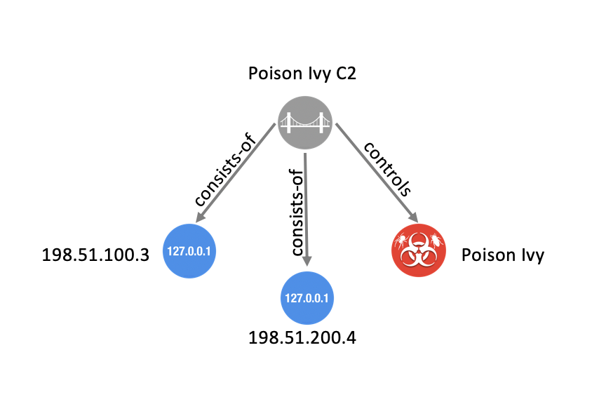
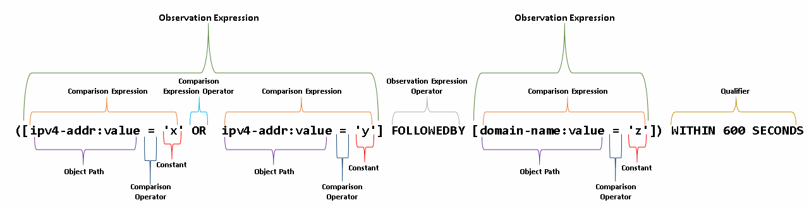
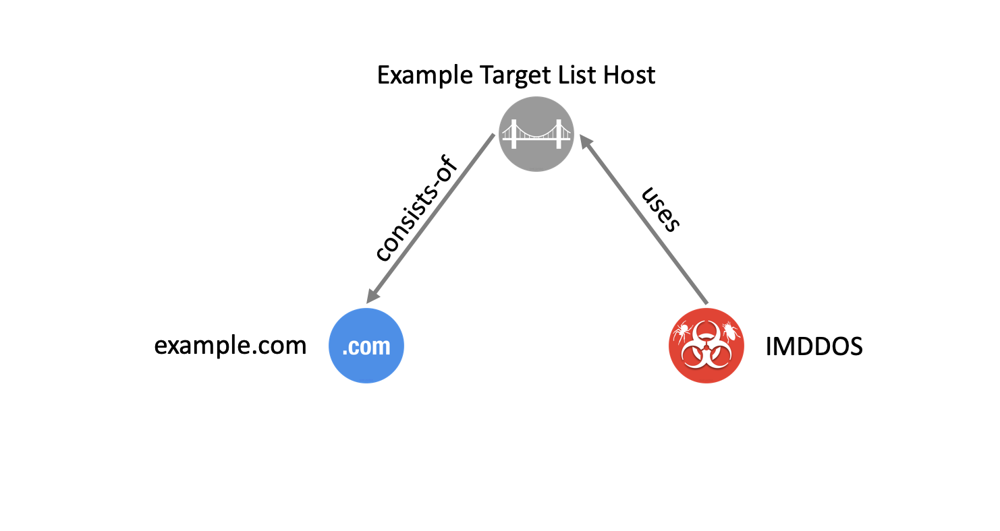

---

# STIX Version 2.1 Errata 01

## Oasis Standard incorporating Draft 01 of Errata 01

### 2 April 2025

#### This stage:

https://docs.oasis-open.org/cti/stix/v2.1/errata01/csd01/stix-v2.1-errata01-csd01-complete.md (Authoritative) \
https://docs.oasis-open.org/cti/stix/v2.1/errata01/csd01/stix-v2.1-errata01-csd01-complete.html \
https://docs.oasis-open.org/cti/stix/v2.1/errata01/csd01/stix-v2.1-errata01-csd01-complete.pdf

#### Previous stage:

https://docs.oasis-open.org/cti/stix/v2.1/os/stix-v2.1-os.docx (Authoritative) \
https://docs.oasis-open.org/cti/stix/v2.1/os/stix-v2.1-os.html \
https://docs.oasis-open.org/cti/stix/v2.1/os/stix-v2.1-os.pdf

#### Latest stage:

https://docs.oasis-open.org/cti/stix/v2.1/errata01/stix-v2.1-errata01-complete.md (Authoritative) \
https://docs.oasis-open.org/cti/stix/v2.1/errata01/stix-v2.1-errata01-complete.html \
https://docs.oasis-open.org/cti/stix/v2.1/errata01/stix-v2.1-errata01-complete.pdf

#### Technical Committee:

[OASIS Cyber Threat Intelligence (CTI) TC](https://www.oasis-open.org/committees/cti/)

#### Chairs:

Marlon Taylor (<marlon.taylor@cisa.dhs.gov>), [DHS Office of Cybersecurity and Communications](http://www.cisa.gov/)  
Alexandre Dulaunoy (<alexandre.dulaunoy@x.circl.lu>), [CIRCL](https://www.circl.lu/)

#### Editors:

Rich Piazza (<rpiazza@mitre.org>), [MITRE Corporation](http://www.mitre.org/)  
Emily Ratliff (<emily.ratliff@ibm.com>), [IBM](http://www.ibm.com/)  
Stephan Relitz (<stephan.relitz@peraton.com>), [Peraton](https://www.peraton.com/)  
Christian Studer (<christian.studer@circl.lu>), [CIRCL](https://www.circl.lu/)

#### Related work:

This specification replaces or supersedes:

- *STIX Version 2.1.* Edited by Bret Jordan, Rich Piazza, and Trey Darley. Latest stage: <https://docs.oasis-open.org/cti/stix/v2.1/stix-v2.1.html>.

This specification is related to:

- *TAXII Version 2.1.* Edited by Bret Jordan and Drew Varner. Latest stage: <https://docs.oasis-open.org/cti/taxii/v2.1/taxii-v2.1.html>.
- *STIX/TAXII 2.0 Interoperability Test Document: Part 1 Version 1.1.* Edited by Allan Thomson and Jason Keirstead. Latest stage: <https://docs.oasis-open.org/cti/stix-taxii-2-interop-p1/v1.1/stix-taxii-2-interop-p1-v1.1.html>.
- *STIX/TAXII 2.0 Interoperability Test Document: Part 2 Version 1.0.* Edited by Allan Thomson and Jason Keirstead. Latest stage: <https://docs.oasis-open.org/cti/stix-taxii-2-interop-p2/v1.0/stix-taxii-2-interop-p2-v1.0.html>.

#### Abstract:

Structured Threat Information Expression (STIX) is a language for expressing cyber threat and observable information. This document defines concepts that apply across all of STIX and defines the overall structure of the STIX language.

#### Status:

This document was last revised or approved by the membership of OASIS on the above date. The level of approval is also listed above. Check the "Latest stage" location noted above for possible later revisions of this document. Any other numbered Versions and other technical work produced by the Technical Committee (TC) are listed at <https://www.oasis-open.org/committees/tc_home.php?wg_abbrev=cti#technical>.

TC members should send comments on this document to the TC's email list. Others should send comments to the TC's public comment list, after subscribing to it by following the instructions at the "[Send A Comment](https://www.oasis-open.org/committees/comments/index.php?wg_abbrev=cti)" button on the TC's web page at <https://www.oasis-open.org/committees/cti/>.

This specification is provided under the [Non-Assertion](https://www.oasis-open.org/policies-guidelines/ipr#Non-Assertion-Mode) Mode of the [OASIS IPR Policy](https://www.oasis-open.org/policies-guidelines/ipr/), the mode chosen when the Technical Committee was established. For information on whether any patents have been disclosed that may be essential to implementing this specification, and any offers of patent licensing terms, please refer to the Intellectual Property Rights section of the TC's web page (<https://www.oasis-open.org/committees/cti/ipr.php>).

Note that any machine-readable content ([Computer Language Definitions](https://www.oasis-open.org/policies-guidelines/tc-process-2017-05-26#wpComponentsCompLang)) declared Normative for this Work Product is provided in separate plain text files. In the event of a discrepancy between any such plain text file and display content in the Work Product's prose narrative document(s), the content in the separate plain text file prevails.

#### Key words:

The key words "**MUST**", "**MUST NOT**", "**REQUIRED**", "**SHALL**", "**SHALL NOT**", "**SHOULD**", "**SHOULD NOT**", "**RECOMMENDED**", "**NOT RECOMMENDED**", "**MAY**", and "**OPTIONAL**" in this document are to be interpreted as described in BCP 14 \[[RFC2119](#rfc2119)\] \[[RFC8174](#rfc8174)\] when, and only when, they appear in all capitals, as shown here.

#### Citation format:

When referencing this specification the following citation format should be used:

**\[STI-v2.1-errata01\]**

_STIX Version 2.1 Errata 01_. Edited by Rich Piazza, Emily Ratliff, Stephan Relitz and Christian Studer. 02 April 2025. OASIS Committee Specification Draft 01. <https://docs.oasis-open.org/cti/stix/v2.1/stix-v2.1.html>. Latest stage: <https://docs.oasis-open.org/cti/stix/v2.1/stix-v2.1.html>.

---

## Notices

Copyright © OASIS Open 2025. All Rights Reserved.

All capitalized terms in the following text have the meanings assigned to them in the OASIS Intellectual Property Rights Policy (the "OASIS IPR Policy"). The full [Policy](https://www.oasis-open.org/policies-guidelines/ipr/) may be found at the OASIS website.

This document and translations of it may be copied and furnished to others, and derivative works that comment on or otherwise explain it or assist in its implementation may be prepared, copied, published, and distributed, in whole or in part, without restriction of any kind, provided that the above copyright notice and this section are included on all such copies and derivative works. However, this document itself may not be modified in any way, including by removing the copyright notice or references to OASIS, except as needed for the purpose of developing any document or deliverable produced by an OASIS Technical Committee (in which case the rules applicable to copyrights, as set forth in the OASIS IPR Policy, must be followed) or as required to translate it into languages other than English.

The limited permissions granted above are perpetual and will not be revoked by OASIS or its successors or assigns.

This document and the information contained herein is provided on an "AS IS" basis and OASIS DISCLAIMS ALL WARRANTIES, EXPRESS OR IMPLIED, INCLUDING BUT NOT LIMITED TO ANY WARRANTY THAT THE USE OF THE INFORMATION HEREIN WILL NOT INFRINGE ANY OWNERSHIP RIGHTS OR ANY IMPLIED WARRANTIES OF MERCHANTABILITY OR FITNESS FOR A PARTICULAR PURPOSE.

As stated in the OASIS IPR Policy, the following three paragraphs in brackets apply to OASIS Standards Final Deliverable documents (Committee Specification, Candidate OASIS Standard, OASIS Standard, or Approved Errata).

\[OASIS requests that any OASIS Party or any other party that believes it has patent claims that would necessarily be infringed by implementations of this OASIS Standards Final Deliverable, to notify OASIS TC Administrator and provide an indication of its willingness to grant patent licenses to such patent claims in a manner consistent with the IPR Mode of the OASIS Technical Committee that produced this deliverable.\]

\[OASIS invites any party to contact the OASIS TC Administrator if it is aware of a claim of ownership of any patent claims that would necessarily be infringed by implementations of this OASIS Standards Final Deliverable by a patent holder that is not willing to provide a license to such patent claims in a manner consistent with the IPR Mode of the OASIS Technical Committee that produced this OASIS Standards Final Deliverable. OASIS may include such claims on its website, but disclaims any obligation to do so.\]

\[OASIS takes no position regarding the validity or scope of any intellectual property or other rights that might be claimed to pertain to the implementation or use of the technology described in this OASIS Standards Final Deliverable or the extent to which any license under such rights might or might not be available; neither does it represent that it has made any effort to identify any such rights. Information on OASIS' procedures with respect to rights in any document or deliverable produced by an OASIS Technical Committee can be found on the OASIS website. Copies of claims of rights made available for publication and any assurances of licenses to be made available, or the result of an attempt made to obtain a general license or permission for the use of such proprietary rights by implementers or users of this OASIS Standards Final Deliverable, can be obtained from the OASIS TC Administrator. OASIS makes no representation that any information or list of intellectual property rights will at any time be complete, or that any claims in such list are, in fact, Essential Claims.\]

The name "OASIS" is a trademark of [OASIS](https://www.oasis-open.org/), the owner and developer of this specification, and should be used only to refer to the organization and its official outputs. OASIS welcomes reference to, and implementation and use of, specifications, while reserving the right to enforce its marks against misleading uses. Please see https://www.oasis-open.org/policies-guidelines/trademark/ for above guidance.

---

# Table of Contents

- 1. [Introduction](#introduction)
  - 1.1 [Document Conventions](#document-conventions)
  - 1.2 [Overview](#overview)
    - 1.2.1 [Graph-Based Model](#graph-based-model)
    - 1.2.2 [STIX Domain Objects](#overview-stix-domain-objects)
    - 1.2.3 [STIX Cyber-observable Objects](#overview-stix-cyber-observable-objects)
    - 1.2.4 [STIX Relationships](#stix-relationships)
    - 1.2.5 [STIX Cyber Observable Observed Data Relationships (Deprecated)](#stix-cyber-observable-observed-data-relationships)
    - 1.2.6 [STIX Patterning](#overview-stix-patterning)
    - 1.2.7 [STIX Common Properties](#stix-common-properties)
    - 1.2.8 [STIX Open Vocabularies and Enumerations](#stix-open-vocabularies-and-enumerations)
    - 1.2.9 [Reserved Names](#overview-reserved-names)
    - 1.2.10 [Serialization](#serialization)
    - 1.2.11 [Transporting STIX](#transporting-stix)
    - 1.2.12 [JSON Schemas](#json-schemas)
  - 1.3 [Changes From Earlier Version](#changes-from-earlier-version)
    - 1.3.1 [STIX 2.1 Errata 01 Changes from earlier version](#stix-21-errata-01-changes-from-earlier-version)
  - 1.4 [Glossary](#glossary)
- 2. [Common Data Types](#common-data-types)
  - 2.1 [Binary](#binary)
  - 2.2 [Boolean](#boolean)
  - 2.3 [Dictionary](#dictionary)
  - 2.4 [Enum](#enum)
  - 2.5 [External Reference](#external-reference)
    - 2.5.1 [Properties](#external-reference-properties)
    - 2.5.2 [Requirements](#external-reference-requirements)
  - 2.6 [Float](#float)
  - 2.7 [Hashes](#hashes)
  - 2.8 [Hexadecimal](#hexadecimal)
  - 2.9 [Identifier](#identifier)
  - 2.10 [Integer](#integer)
  - 2.11 [Kill Chain Phase](#kill-chain-phase)
  - 2.12 [List](#list)
  - 2.13 [Observable Container (deprecated)](#observable-container)
  - 2.14 [Open Vocabulary](#open-vocabulary)
  - 2.15 [String](#string)
  - 2.16 [Timestamp](#timestamp)
    - 2.16.1 [Requirements](#timestamp-requirements)
- 3. [STIX General Concepts](#stix-general-concepts)
  - 3.1 [Property Names and String Literals](#property-names-and-string-literals)
  - 3.2 [Common Properties](#common-properties)
  - 3.3 [Object IDs and References](#object-ids-and-references)
  - 3.4 [SCO Deterministic ID Creation](#sco-deterministic-id-creation)
  - 3.5 [Object Creator](#object-creator)
  - 3.6 [Versioning](#versioning)
    - 3.6.1 [Versioning Timestamps](#versioning-timestamps)
    - 3.6.2 [New Version or New Object?](#new-version-or-new-object)
  - 3.7 [Common Relationships](#common-relationships)
  - 3.8 [Reserved Names](#reserved-names)
  - 3.9 [Object Property Metadata](#object-property-metadata)
    - 3.9.1 [SCO String Encoding](#sco-string-encoding)
  - 3.10 [Predefined Object Extensions](#predefined-object-extensions)
- 4. [STIX Domain Objects](#stix-domain-objects)
  - 4.1 [Attack Pattern](#attack-pattern)
    - 4.1.1 [Properties](#attack-pattern-properties)
    - 4.1.2 [Relationships](#attack-pattern-relationships)
  - 4.2 [Campaign](#campaign)
    - 4.2.1 [Properties](#campaign-properties)
    - 4.2.2 [Relationships](#campaign-relationships)
  - 4.3 [Course of Action](#course-of-action)
    - 4.3.1 [Properties](#course-of-action-properties)
    - 4.3.2 [Relationships](#course-of-action-relationships)
  - 4.4 [Grouping](#grouping)
    - 4.4.1 [Properties](#grouping-properties)
    - 4.4.2 [Relationships](#grouping-relationships)
  - 4.5 [Identity](#identity)
    - 4.5.1 [Properties](#identity-properties)
    - 4.5.2 [Relationships](#identity-relationships)
  - 4.6 [Incident](#incident)
    - 4.6.1 [Properties](#incident-properties)
    - 4.6.2 [Relationships](#incident-relationships)
  - 4.7 [Indicator](#indicator)
    - 4.7.1 [Properties](#indicator-properties)
    - 4.7.2 [Relationships](#indicator-relationships)
  - 4.8 [Infrastructure](#infrastructure)
    - 4.8.1 [Properties](#infrastructure-properties)
    - 4.8.2 [Relationships](#infrastructure-relationships)
  - 4.9 [Intrusion Set](#intrusion-set)
    - 4.9.1 [Properties](#intrusion-set-properties)
    - 4.9.2 [Relationships](#intrusion-set-relationships)
  - 4.10 [Location](#location)
    - 4.10.1 [Properties](#location-properties)
    - 4.10.2 [Relationships](#location-relationships)
  - 4.11 [Malware](#malware)
    - 4.11.1 [Properties](#malware-properties)
    - 4.11.2 [Relationships](#malware-relationships)
  - 4.12 [Malware Analysis](#malware-analysis)
    - 4.12.1 [Properties](#malware-analysis-properties)
    - 4.12.2 [Relationships](#malware-analysis-relationships)
  - 4.13 [Note](#note)
    - 4.13.1 [Properties](#note-properties)
    - 4.13.2 [Relationships](#note-relationships)
  - 4.14 [Observed Data](#observed-data)
    - 4.14.1 [Properties](#observed-data-properties)
    - 4.14.2 [Relationships](#observed-data-relationships)
  - 4.15 [Opinion](#opinion)
    - 4.15.1 [Properties](#opinion-properties)
    - 4.15.2 [Relationships](#opinion-relationships)
  - 4.16 [Report](#report)
    - 4.16.1 [Properties](#report-properties)
    - 4.16.2 [Relationships](#report-relationships)
  - 4.17 [Threat Actor](#threat-actor)
    - 4.17.1 [Properties](#threat-actor-properties)
    - 4.17.2 [Relationships](#threat-actor-relationships)
  - 4.18 [Tool](#tool)
    - 4.18.1 [Properties](#tool-properties)
    - 4.18.2 [Relationships](#tool-relationships)
  - 4.19 [Vulnerability](#vulnerability)
    - 4.19.1 [Properties](#vulnerability-properties)
    - 4.19.2 [Relationships](#vulnerability-relationships)
- 5. [STIX Relationship Objects](#stix-relationship-objects)
  - 5.1 [Relationship](#relationship)
    - 5.1.1 [Specification-Defined Relationships Summary](#specification-defined-relationships-summary)
    - 5.1.2 [Properties](#relationship-properties)
    - 5.1.3 [Relationships](#relationship-relationships)
  - 5.2 [Sighting](#sighting)
    - 5.2.1 [Properties](#sighting-properties)
    - 5.2.2 [Relationships](#sighting-relationships)
- 6. [STIX Cyber-observable Objects](#stix-cyber-observable-objects)
  - 6.1 [Artifact Object](#artifact-object)
    - 6.1.1 [Properties](#artifact-object-properties)
  - 6.2 [Autonomous System (AS) Object](#autonomous-system-as-object)
    - 6.2.1 [Properties](#autonomous-system-as-object-properties)
  - 6.3 [Directory Object](#directory-object)
    - 6.3.1 [Properties](#directory-object-properties)
  - 6.4 [Domain Name Object](#domain-name-object)
    - 6.4.1 [Properties](#domain-name-object-properties)
    - 6.4.2 [Relationships](#domain-name-object-relationships)
  - 6.5 [Email Address Object](#email-address-object)
    - 6.5.1 [Properties](#email-address-object-properties)
  - 6.6 [Email Message Object](#email-message-object)
    - 6.6.1 [Properties](#email-message-object-properties)
    - 6.6.2 [Email MIME Component Type](#email-mime-component-type)
      - 6.6.2.1 [Properties](#email-mime-component-type-properties)
  - 6.7 [File Object](#file-object)
    - 6.7.1 [Properties](#file-object-properties)
    - 6.7.2 [Archive File Extension](#archive-file-extension)
      - 6.7.2.1 [Properties](#archive-file-extension-properties)
    - 6.7.3 [NTFS File Extension](#ntfs-file-extension)
      - 6.7.3.1 [Properties](#ntfs-file-extension-properties)
      - 6.7.3.2 [Alternate Data Stream Type](#alternate-data-stream-type)
    - 6.7.4 [PDF File Extension](#pdf-file-extension)
      - 6.7.4.1 [Properties](#pdf-file-extension-properties)
    - 6.7.5 [Raster Image File Extension](#raster-image-file-extension)
      - 6.7.5.1 [Properties](#raster-image-file-extension-properties)
    - 6.7.6 [Windows PE Binary File Extension](#windows-pe-binary-file-extension)
      - 6.7.6.1 [Properties](#windows-pe-binary-file-extension-properties)
      - 6.7.6.2 [Windows PE Optional Header Type](#windows-pe-optional-header-type)
      - 6.7.6.3 [Windows PE Section Type](#windows-pe-section-type)
  - 6.8 [IPv4 Address Object](#ipv4-address-object)
    - 6.8.1 [Properties](#ipv4-address-object-properties)
    - 6.8.2 [Relationships](#ipv4-address-object-relationships)
  - 6.9 [IPv6 Address Object](#ipv6-address-object)
    - 6.9.1 [Properties](#ipv6-address-object-properties)
    - 6.9.2 [Relationships](#ipv6-address-object-relationships)
  - 6.10 [MAC Address Object](#mac-address-object)
    - 6.10.1 [Properties](#mac-address-object-properties)
  - 6.11 [Mutex Object](#mutex-object)
    - 6.11.1 [Properties](#mutex-object-properties)
  - 6.12 [Network Traffic Object](#network-traffic-object)
    - 6.12.1 [Properties](#network-traffic-object-properties)
    - 6.12.2 [HTTP Request Extension](#http-request-extension)
      - 6.12.2.1 [Properties](#http-request-extension-properties)
    - 6.12.3 [ICMP Extension](#icmp-extension)
      - 6.12.3.1 [Properties](#icmp-extension-properties)
    - 6.12.4 [Network Socket Extension](#network-socket-extension)
      - 6.12.4.1 [Properties](#network-socket-extension-properties)
    - 6.12.5 [TCP Extension](#tcp-extension)
      - 6.12.5.1 [Properties](#tcp-extension-properties)
  - 6.13 [Process Object](#process-object)
    - 6.13.1 [Properties](#process-object-properties)
    - 6.13.2 [Windows Process Extension](#windows-process-extension)
      - 6.13.2.1 [Properties](#windows-process-extension-properties)
    - 6.13.3 [Windows Service Extension](#windows-service-extension)
      - 6.13.3.1 [Properties](#windows-service-extension-properties)
  - 6.14 [Software Object](#software-object)
    - 6.14.1 [Properties](#software-object-properties)
  - 6.15 [URL Object](#url-object)
    - 6.15.1 [Properties](#url-object-properties)
  - 6.16 [User Account Object](#user-account-object)
    - 6.16.1 [Properties](#user-account-object-properties)
    - 6.16.2 [UNIX Account Extension](#unix-account-extension)
      - 6.16.2.1 [Properties](#unix-account-extension-properties)
  - 6.17 [Windows Registry Key Object](#windows-registry-key-object)
    - 6.17.1 [Properties](#windows-registry-key-object-properties)
    - 6.17.2 [Windows Registry Value Type](#windows-registry-value-type)
      - 6.17.2.1 [Properties](#windows-registry-value-type-properties)
  - 6.18 [X.509 Certificate Object](#x509-certificate-object)
    - 6.18.1 [Properties](#x509-certificate-object-properties)
    - 6.18.2 [X.509 v3 Extensions Type](#x509-v3-extensions-type)
      - 6.18.2.1 [Properties](#x509-v3-extensions-type-properties)
- 7. [STIX Meta Objects](#stix-meta-objects)
  - 7.1 [Language Content](#language-content)
    - 7.1.1 [Properties](#language-content-properties)
    - 7.1.2 [Relationships](#language-content-relationships)
  - 7.2 [Data Markings](#data-markings)
    - 7.2.1 [Marking Definition](#marking-definition)
      - 7.2.1.1 [Properties](#marking-definition-properties)
      - 7.2.1.2 [Relationships](#marking-definition-relationships)
      - 7.2.1.3 [Statement Marking Object Type](#statement-marking-object-type)
      - 7.2.1.4 [TLP Marking Object Type](#tlp-marking-object-type)
    - 7.2.2 [Object Markings](#object-markings)
    - 7.2.3 [Granular Markings](#granular-markings)
      - 7.2.3.1 [Granular Marking Type](#granular-marking-type)
  - 7.3 [Extension Definition](#extension-definition)
    - 7.3.1 [Extension Definition Properties](#extension-definition-properties)
    - 7.3.2 [Requirements for STIX Extension Schemas](#requirements-for-stix-extension-schemas)
      - 7.3.2.1 [Requirements for Extension Properties](#requirements-for-extension-properties)
      - 7.3.2.2 [Requirements for Extension STIX Objects](#requirements-for-extension-stix-objects)
- 8. [STIX Bundle Object](#stix-bundle-object)
  - 8.1 [Properties](#stix-bundle-object-properties)
  - 8.2 [Relationships](#stix-bundle-object-relationships)
- 9. [STIX Patterning](#stix-patterning)
  - 9.1 [Definitions](#definitions)
  - 9.2 [Constants](#constants)
  - 9.3 [STIX Patterns](#stix-patterns)
  - 9.4 [Pattern Expressions](#pattern-expressions)
  - 9.5 [Observation Expressions](#observation-expressions)
    - 9.5.1 [Observation Expression Qualifiers](#observation-expression-qualifiers)
    - 9.5.2 [Observation Operators](#observation-operators)
    - 9.5.3 [Operator Precedence](#operator-precedence)
  - 9.6 [Comparison Expressions](#comparison-expressions)
    - 9.6.1 [Comparison Operators](#comparison-operators)
    - 9.6.2 [String Comparison](#string-comparison)
    - 9.6.3 [Binary Type Comparison](#binary-type-comparison)
    - 9.6.4 [Native Format Comparison](#native-format-comparison)
  - 9.7 [Object Path Syntax](#object-path-syntax)
    - 9.7.1 [Basic Object Properties](#basic-object-properties)
    - 9.7.2 [List Object Properties](#list-object-properties)
    - 9.7.3 [Dictionary Object Properties](#dictionary-object-properties)
    - 9.7.4 [Object Reference Properties](#object-reference-properties)
  - 9.8 [Examples](#examples)
- 10. [STIX Vocabularies](#stix-vocabularies)
  - 10.1 [Account Type Vocabulary](#account-type-vocabulary)
  - 10.2 [Attack Motivation Vocabulary](#attack-motivation-vocabulary)
  - 10.3 [Attack Resource Level Vocabulary](#attack-resource-level-vocabulary)
  - 10.4 [Encryption Algorithm Enumeration](#encryption-algorithm-enumeration)
  - 10.5 [Extension Type Enumeration](#extension-type-enumeration)
  - 10.6 [Grouping Context Vocabulary](#grouping-context-vocabulary)
  - 10.7 [Hashing Algorithm Vocabulary](#hashing-algorithm-vocabulary)
  - 10.8 [Identity Class Vocabulary](#identity-class-vocabulary)
  - 10.9 [Implementation Language Vocabulary](#implementation-language-vocabulary)
  - 10.10 [Indicator Type Vocabulary](#indicator-type-vocabulary)
  - 10.11 [Industry Sector Vocabulary](#industry-sector-vocabulary)
  - 10.12 [Infrastructure Type Vocabulary](#infrastructure-type-vocabulary)
  - 10.13 [Malware Capabilities Vocabulary](#malware-capabilities-vocabulary)
  - 10.14 [Malware Result Vocabulary](#malware-result-vocabulary)
  - 10.15 [Malware Type Vocabulary](#malware-type-vocabulary)
  - 10.16 [Network Socket Address Family Enumeration](#network-socket-address-family-enumeration)
  - 10.17 [Network Socket Type Enumeration](#network-socket-type-enumeration)
  - 10.18 [Opinion Enumeration](#opinion-enumeration)
  - 10.19 [Pattern Type Vocabulary](#pattern-type-vocabulary)
  - 10.20 [Processor Architecture Vocabulary](#processor-architecture-vocabulary)
  - 10.21 [Region Vocabulary](#region-vocabulary)
  - 10.22 [Report Type Vocabulary](#report-type-vocabulary)
  - 10.23 [Threat Actor Type Vocabulary](#threat-actor-type-vocabulary)
  - 10.24 [Threat Actor Role Vocabulary](#threat-actor-role-vocabulary)
  - 10.25 [Threat Actor Sophistication Vocabulary](#threat-actor-sophistication-vocabulary)
  - 10.26 [Tool Type Vocabulary](#tool-type-vocabulary)
  - 10.27 [Windows™ Integrity Level Enumeration](#windows-integrity-level-enumeration)
  - 10.28 [Windows™ PE Binary Vocabulary](#windows-pe-binary-vocabulary)
  - 10.29 [Windows™ Registry Datatype Enumeration](#windows-registry-datatype-enumeration)
  - 10.30 [Windows™ Service Start Type Enumeration](#windows-service-start-type-enumeration)
  - 10.31 [Windows™ Service Type Enumeration](#windows-service-type-enumeration)
  - 10.32 [Windows™ Service Status Enumeration](#windows-service-status-enumeration)
- 11. [Customizing STIX (Deprecated)](#customizing-stix)
  - 11.1 [Custom Properties (Deprecated)](#custom-properties)
    - 11.1.1 [Requirements (Deprecated)](#custom-properties-requirements)
  - 11.2 [Custom Objects (Deprecated)](#custom-objects)
    - 11.2.1 [Requirements (Deprecated)](#custom-objects-requirements)
  - 11.3 [Custom Object Extensions (Deprecated)](#custom-object-extensions)
    - 11.3.1 [Requirements (Deprecated)](#custom-object-extensions-requirements)
- 12. [Conformance](#conformance)
  - 12.1 [STIX Object Producers and Consumers](#stix-object-producers-and-consumers)
  - 12.2 [STIX Object Mandatory Features](#stix-object-mandatory-features)
    - 12.2.1 [Versioning](#conformance-versioning)
  - 12.3 [STIX Object Optional Features](#stix-object-optional-features)
    - 12.3.1 [Object-Level Data Markings](#object-level-data-markings)
    - 12.3.2 [Granular Data Markings](#granular-data-markings)
    - 12.3.3 [STIX Extensions](#stix-extensions)
  - 12.4 [STIX Patterning Conformance](#stix-patterning-conformance)
  - 12.5 [STIX Pattern Producer](#stix-pattern-producer)
  - 12.6 [STIX Pattern Consumer](#stix-pattern-consumer)
  - 12.7 [STIX Patterning Conformance Levels](#stix-patterning-conformance-levels)
    - 12.7.1 [Level 1: Basic Conformance](#level-1-basic-conformance)
    - 12.7.2 [Level 2: Basic Conformance plus Observation Operators](#level-2-basic-conformance-plus-observation-operators)
    - 12.7.3 [Level 3: Full Conformance](#level-3-full-conformance)
- Appendix A: [Confidence Scales](#confidence-scales)
- Appendix B: [Relationship Summary Table](#relationship-summary-table)
- Appendix C: [Additional Examples](#additional-examples)
  - C.1 [Infrastructure Additional Examples](#infrastructure-additional-examples)
    - C.1.1 [Malware & Target List Hosting Domain](#malware-target-list-hosting-domain)
    - C.1.2 [Malware Botnet Infrastructure](#malware-botnet-infrastructure)
    - C.1.3 [Related/Component Botnet Infrastructure](#related-component-botnet-infrastructure)
    - C.1.4 [Malware Instance Hosted on Compromised Domain](#malware-instance-hosted-on-compromised-domain)
  - C.2 [Extension Definition Additional Examples](#extension-definition-additional-examples)
    - C.2.1 [Create a new object type with a copyright marking definition](#create-a-new-object-type-with-a-copyright-marking-definition)
    - C.2.2 [Adding properties to an existing STIX object instance](#adding-properties-to-an-existing-stix-object-instance)
    - C.2.3 [Adding properties to an existing STIX relationship object instance](#adding-properties-to-an-existing-stix-relationship-object-instance)
    - C.2.4 [Adding properties to an existing STIX marking definition object instance](#adding-properties-to-an-existing-stix-marking-definition-object-instance)
    - C.2.5 [Adding properties to an existing STIX language content object instance](#adding-properties-to-an-existing-stix-language-content-object-instance)
- Appendix D: [IANA Considerations](#iana-considerations)
- Appendix E: [References](#references)
  - E.1 [Normative References](#normative-references)
  - E.2 [Informative References](#informative-references)
- Appendix F: [Acknowledgments](#acknowledgments)
- Appendix G: [Revision History](#revision-history)
- Appendix H: [Notices](#notices)

---

# 1. Introduction <a id='introduction'></a>

Structured Threat Information Expression (STIX) is a language and serialization format used to exchange cyber threat intelligence (CTI).
STIX enables organizations to share CTI with one another in a consistent and machine-readable manner, allowing security communities to better understand what computer-based attacks they are most likely to see and to anticipate and/or respond to those attacks faster and more effectively.
STIX is designed to improve many different capabilities, such as collaborative threat analysis, automated threat exchange, automated detection and response, and more.

The objects and features added for inclusion in STIX 2.1 represent an iterative approach to fulfilling basic consumer and producer requirements for CTI sharing.
Objects and properties not included in this version of STIX, but deemed necessary by the community, will be included in future releases.

## 1.1 Document Conventions <a id='document-conventions'></a>

The following color, font and font style conventions are used in this
document:

- The <span class="stixfont">Consolas</span> font is used for all type
  names, property names and literals.

  - type names are in red with a light red background –
    <span class="stixtype">threat-actor</span>

  - property names are in bold style – **created_at**

  - literals (values) are in blue with a blue background –
    <span class="stixliteral">malicious-activity</span>

  - All relationship types are string literals; therefore, they will
    also appear in blue with a blue background –
    <span class="stixrelationship">related-to</span>

- In an object’s property table, if a common property is being redefined
  in some way, then the background is dark grey.

- All examples in this document are expressed in JSON. They are in
  `mono` font, with straight quotes, black text and a light grey
  background, and using 2-space indentation. JSON examples in this
  document are representations of JSON objects \[[RFC8259](#rfc8259)\].
  They should not be interpreted as string literals. The ordering of
  object keys is insignificant. Whitespace before or after JSON
  structural characters in the examples are insignificant
  \[[RFC8259](#rfc8259)\].

- Parts of the example may be omitted for conciseness and clarity. These
  omitted parts are denoted with the ellipses (…​).

- The term "hyphen" is used throughout this document to refer to the
  ASCII hyphen or minus character, which in Unicode is "hyphen-minus",
  U+002D.

## 1.2 Overview <a id='overview'></a>

STIX is a schema that defines a taxonomy of cyber threat intelligence
that is represented by the following objects:

<table border="1" cellspacing="0" cellpadding="6">
  <tr>
    <th colspan="6" style="text-align:center; background-color:#004A7F; color:white;">STIX Objects</th>
    <th rowspan="3" style="background-color:#d3d3d3; text-align:center; vertical-align:middle;">STIX Bundle Object</th>
  </tr>
  <tr>
    <th colspan="3" style="text-align:center; background-color:#dbe9f4;">STIX Core Objects</th>
    <th colspan="3" style="text-align:center; background-color:#dbe9f4;">STIX Meta Objects (SMO)</th>
  </tr>
  <tr>
    <td>STIX Domain Objects (SDO)</td>
    <td>STIX Cyber-observable Objects (SCO)</td>
    <td>STIX Relationship Objects (SRO)</td>
    <td>Extension Definition Objects</td>
    <td>Language Content Objects</td>
    <td>Marking Definition Objects</td>
  </tr>
</table>

**STIX Core Objects**

Any SDO, SCO, or SRO.

**STIX Domain Objects**

Higher Level Intelligence Objects that represent behaviors and
constructs that threat analysts would typically create or work with
while understanding the threat landscape.

**STIX Cyber-observable Objects**

Objects that represent observed facts about a network or host that may
be used and related to higher level intelligence to form a more complete
understanding of the threat landscape.

**STIX Relationship Objects**

Objects that connect STIX Domain Objects together, STIX Cyber-observable
Objects together, and connect STIX Domain Objects and STIX
Cyber-observable Objects together to form a more complete understanding
of the threat landscape.

**STIX Meta Objects (SMO)**

A STIX Object that provides the necessary glue and associated metadata
to enrich or extend STIX Core Objects to support user and system
workflows.

**STIX Bundle Object**

An object that provides a wrapper mechanism for packaging arbitrary STIX
content together.

### 1.2.1 Graph-Based Model <a id='graph-based-model'></a>

STIX is a connected graph of nodes and edges.
STIX Domain Objects and STIX Cyber-observable Objects define the graph nodes and STIX relationships (including both external STIX Relationship Objects and embedded relationships) define the edges.
This graph-based language conforms to common analysis approaches and allows for flexible, modular, structured, and consistent representations of CTI.

### 1.2.2 STIX Domain Objects <a id='overview-stix-domain-objects'></a>

STIX defines a set of STIX Domain Objects (SDOs): Attack Pattern, Campaign, Course of Action, Grouping, Identity, Indicator, Infrastructure, Intrusion Set, Location, Malware, Malware Analysis, Note, Observed Data, Opinion, Report, Threat Actor, Tool, and Vulnerability.
Each of these objects corresponds to a concept commonly used in CTI.

STIX Domain Objects are defined in [section 4](#stix-domain-objects).

### 1.2.3 STIX Cyber-observable Objects <a id='overview-stix-cyber-observable-objects'></a>

STIX defines a set of STIX Cyber-observable Objects (SCOs) for characterizing host-based and network-based information.
SCOs are used by various STIX Domain Objects (SDOs) to provide supporting context.
The Observed Data SDO, for example, indicates that the raw data was observed at a particular time.

STIX Cyber-observable Objects (SCOs) document the facts concerning what happened on a network or host, and do not capture the who, when, or why.
By associating SCOs with STIX Domain Objects (SDOs), it is possible to convey a higher-level understanding of the threat landscape, and to potentially provide insight as to the who and the why particular intelligence may be relevant to an organization.
For example, information about a file that existed, a process that was observed running, or that network traffic occurred between two IPs can all be captured as SCOs.

STIX Cyber-observable Objects (SCOs) are defined in [section 6](#stix-cyber-observable-objects).

Previously, in STIX 2.0, Cyber-observable Objects could only exist as objects within an Observed Data object. It is still possible to represent Cyber-observable Objects in this way, but this method has been deprecated. See [section 2.13](#observable-container).

### 1.2.4 STIX Relationships <a id='stix-relationships'></a>

A relationship is a link between STIX Domain Objects (SDOs), STIX Cyber-observable Objects (SCOs), or between an SDO and a SCO that describes the way in which the objects are related.
Relationships can be represented using an external STIX Relationship Object (SRO) or, in some cases, through certain properties which store an identifier reference that comprises an embedded relationship, (for example the **created_by_ref** property).

The generic STIX Relationship Object (SRO) is one of two SROs and is used for most relationships in STIX.
This generic SRO contains a property called **relationship_type** to describe more specifically what the relationship represents.
This specification defines a set of known terms to use for the **relationship_type** property between SDOs of specific types.
For example, the Indicator SDO defines a relationship from itself to Malware via a **relationship_type** of <span class="stixliteral">indicates</span> to describe how the Indicator can be used to detect the presence of the corresponding Malware. In addition to the terms defined in the specification, STIX also allows for user-defined terms to be used as the relationship type.

Currently the only other SRO (besides a generic Relationship) is the Sighting SRO. The Sighting object is used to capture cases where an entity has "seen" an SDO, such as sighting an indicator. Sighting is a separate SRO because it contains additional properties such as **count** that are only applicable to Sighting relationships. Other SROs may be defined in future versions of STIX if new relationships are identified that also require additional properties not present on the generic Relationship object.

In addition to relationships created using the SROs (Relationship and Sighting), STIX also uses ID references to represent embedded relationships. Embedded relationships are simply ID reference properties on STIX Objects that contain the ID of a different STIX Object. Embedded relationships are used when the property is an inherent part of the object and not something that a third party might add or something that might require the inclusion of a confidence score. Because they represent an inherent linkage and have no other properties, an SRO is not needed to represent them. An embedded relationship can only be asserted by the creator of the object ("object creator") it is contained in.

For example, the entity that created a STIX Object is an inherent, factual part of that object and therefore that information is captured in an embedded relationship contained in the **created_by_ref** property rather than through the use of an SRO.

Embedded relationships (ID references) are described in [section 3.3](#object-ids-and-references) and STIX Relationship Objects (SROs) are defined in [section 5](#stix-relationship-objects).

### 1.2.5 STIX Cyber Observable Observed Data Relationships (Deprecated) <a id='stix-cyber-observable-observed-data-relationships'></a>

While refining STIX for the 2.1 specification, the CTI TC reached consensus that the STIX 2.0 Cyber Observable Container (see [section 2.13](#observable-container)) and the Observed Data object's graph within a graph model was insufficient to support critical CTI use cases. Consequently, in STIX 2.1, the Cyber Observable Container is deprecated, and implementers are encouraged to use STIX Relationship Objects (SROs) instead. Within the context of the (deprecated) Cyber Observable Container's graph within a graph model, an object relationship is a reference linking two (or more) related SCOs and these relationships are constrained to SCOs contained within the same Cyber Observable Container.

A Cyber Observable Container relationship should not be confused with STIX Relationship Objects (SROs) that are defined in [section 5](#stix-relationship-objects).

### 1.2.6 STIX Patterning <a id='overview-stix-patterning'></a>

The STIX Patterning language enables the detection of activity on networks and endpoints.
This language allows matching against time stamped cyber observable data collected by a threat intelligence platform or other similar system. STIX Patterning is currently only used by the STIX Indicator object, but it can be employed in other use cases.

Before undertaking work on STIX Patterning, a thorough effort to evaluate existing patterning languages (e.g., Snort or Yara) was performed. This effort identified that no existing patterning language solves or supports the STIX use cases. Extending other languages was ruled out as unfeasible, both from a technical perspective as well as taking into consideration that from a licensing/IPR perspective, extending an existing language under the auspices of OASIS would have been problematic.

STIX Patterning was primarily designed to support STIX Indicators. As such it is a mechanism for communicating how to find malicious code and/or threat actors active within a given network or endpoint.

This language release is focused on supporting a common set of use cases and therefore allows for the expression of an initial set of patterns that producers and consumers of STIX can utilize. As more complex patterns are deemed necessary, the STIX patterning language will be extended in future releases to improve its effectiveness as an automated detection/remediation method.

STIX Patterning is defined in [section 9](#stix-patterning).

### 1.2.7 STIX Common Properties <a id='stix-common-properties'></a>

STIX Domain Objects (SDOs) and Relationship Objects (SROs) all share a common set of properties which provide core capabilities such as versioning and data markings (representing how data can be shared and used).
All STIX Cyber-observable Objects (SCOs) likewise share a common set of properties that are applicable for all SCOs. Similarly, STIX Meta Objects (SMOs) use some but not all of the common properties.

### 1.2.8 STIX Open Vocabularies and Enumerations <a id='stix-open-vocabularies-and-enumerations'></a>

Some STIX properties are defined using open vocabularies or enumerations.
Enumerations and open vocabularies are defined in STIX in order to enhance interoperability by increasing the likelihood that different entities use the same exact string to represent the same concept.
If used consistently, open vocabularies make it less likely that one entity refers to the energy sector as "Energy" and another as "Energy Sector", thereby making comparison and correlation easier.

While using predefined values from STIX vocabularies is strongly encouraged, in some cases this may not be feasible.
To address this, producers are permitted to use values outside of the open vocabulary.
In the case of enumerations, producers are required to use only the values defined within the STIX specification.

STIX open vocabularies and enumerations are defined in [section 10](#stix-vocabularies). Properties that are defined as open vocabularies identify a suggested vocabulary from that section.
For example, the Threat Actor **sophistication** property, as defined in [section 4.17](#threat-actor), uses the Threat Actor Sophistication vocabulary as defined in [section 10.25](#threat-actor-sophistication-vocabulary).

### 1.2.9 Reserved Names <a id='overview-reserved-names'></a>

Reserved property names are marked with a type called <span class="stixtype">RESERVED</span> and a description text of "RESERVED FOR FUTURE USE". For more information please see [section 3.8](#reserved-names)

### 1.2.10 Serialization <a id='serialization'></a>

STIX is defined independent of any specific storage or serialization.
However, the mandatory-to-implement (MTI) serialization for STIX 2.1 is UTF-8 encoded JSON as defined in [RFC7493](#rfc7493) and [RFC8259](#rfc8259), which uses the JSON Object type described within when representing all STIX Objects.
In other words, all STIX-conformant tools have to implement support for JSON but can implement support for other serializations.

### 1.2.11 Transporting STIX <a id='transporting-stix'></a>

STIX 2.1 is transport-agnostic, i.e., the structures and serializations do not rely on any specific transport mechanism.
A companion CTI specification, [TAXII](#related-work), is designed specifically to transport STIX Objects.
STIX provides a Bundle (see [section 8](#stix-bundle-object)) as a container for STIX Objects to allow for transportation of bulk STIX data, especially over non-TAXII communication mechanisms.

### 1.2.12 JSON Schemas <a id='json-schemas'></a>

JSON schemas have been developed by members of the Cyber Threat Intelligence Technical Committee.
The JSON schemas are informative and serve as a best effort attempt to validate that STIX 2.1 content meets the structural requirements identified in this specification.
This specification is the normative description of STIX 2.1.

## 1.3 Changes From Earlier Version <a id='changes-from-earlier-version'></a>

This section lists all of the changes from the previous 2.1 version of STIX.

### 1.3.1 STIX 2.1 Errata 01 Changes From Earlier Version <a id='stix-21-errata-01-changes-from-earlier-version'></a>

STIX 2.1 Errata 01 differs from STIX 2.1 in the following ways:

- Updated Malware Embedded Relationships table with missing property in [section 4.11.2](#malware-relationships).
  - **operating_system_refs** is no longer missing in the table.
- Malware Analysis Relationships table fixed with the right relationship type between Malware Analysis and Malware in [section 4.12.2](#malware-analysis-relationships).
  - wrong <span class="stixliteral">analysis-of</span> is replaced with the right <span class="stixliteral">av-analysis-of</span> relationship type.
- Email Message property descriptions fixed in [section 6.6.1](#email-message-object-properties).
  - **from_ref**, **sender_ref**, **to_refs**, **cc_refs** and **bcc_refs** properties descriptions now mention the right <span class="stixtype">email-addr</span> type they are referencing.
- HTTP Request Extension examples fixed in [section 6.12.2.1](#http-request-extension-properties).
  - the **request_header** property is now a <span class="stixtype">list</span> of type <span class="stixtype">string</span> in the examples, as expected from the description.
- Observation Expression Qualifiers example fixed in [section 9.5.1](#observation-expression-qualifiers).
  - the example used to illustrate the use of *Observation Expression* <span class="stixliteral">WITHIN</span> *x* <span class="stixliteral">SECONDS</span> now has the right <span class="stixtype">windows-registry-key</span> Observable type.
- Updated Implementation Language Vocabulary in [section 10.9](#implementation-language-vocabulary).
  - <span class="stixliteral">rust</span> value was added.
- Updated Industry Sector Vocabulary in [section 10.11](#industry-sector-vocabulary).
  - <span class="stixliteral">egal</span> value was added.
- Fixed Infrastructure Type Vocabulary Summary in [section 10.12](#infrastructure-type-vocabulary).
  - missing <span class="stixliteral">control-system</span>, <span class="stixliteral">firewall</span>, <span class="stixliteral">routers-switches</span> and <span class="stixliteral">workstation</span> values were added to the Summary as they were already described in the Vocabulary table.
- Enhanced Malware Result Vocabulary in [section 10.14](#malware-result-vocabulary).
  - descriptions for every vocabulary values were improved with more descriptive definitions.
- Fixed Report Type Vocabulary in [section 10.22](#report-type-vocabulary).
  - missing <span class="stixliteral">incident</span> value was added.
- Updated Threat Actor Type Vocabulary in [section 10.23](#threat-actor-type-vocabulary).
  - <span class="stixliteral">private-sector</span> value was added.
- Fixed multiple Enumeration headers
  - Enumerations now have the right headers, to differenciate enumerations from vocabularies, including:
    - **Enumeration Name** is now used instead of **Vocabulary Name**
    - **Enumeration Summary** is now used instead of **Vocabulary Summary**
    - **Enumeration Value** is now used instead of **Vocabulary Value**
  - These changes apply on:
    - Encryption Algorithm Enumeration in [section 10.4](#encryption-algorithm-enumeration)
    - Extension Type Enumeration in [section 10.5](#extension-type-enumeration)
    - Network Socket Address Family Enumeration in [section 10.16](#network-socket-address-family-enumeration)
    - Network Socket Type Enumeration in [section 10.17](#network-socket-type-enumeration)
    - Opinion Enumeration in [section 10.18](#opinion-enumeration)
    - Windows™ Integrity Level Enumeration in [section 10.27](#windows-integrity-level-enumeration)
    - Windows™ Registry Datatype Enumeration in [section 10.29](#windows-registry-datatype-enumeration)
    - Windows™ Service Start Type Enumeration in [section 10.30](#windows-service-start-type-enumeration)
    - Windows™ Service Type Enumeration in [section 10.31](#windows-service-type-enumeration)
    - Windows™ Service Status Enumeration in [section 10.32](#windows-service-status-enumeration)
- Relationship Summary Table has been update in [Appendix B](#relationship-summary-table).
  - Duplicated relationship <span class="stixliteral">located-at</span> between <span class="stixtype">threat-actor</span> and <span class="stixtype">location</span> has been removed.
  - Misspelled relationship <span class="stixliteral">exfiltrates-to</span> between <span class="stixtype">malware</span> and <span class="stixtype">infrastructure</span> has been fixed.
  - Missing relationships have been added, including:
    - <span class="stixliteral">remediates</span> between <span class="stixtype">course-of-action</span> and <span class="stixtype">malware</span>
    - <span class="stixliteral">remediates</span> between <span class="stixtype">course-of-action</span> and <span class="stixtype">vulnerability</span>
    - <span class="stixliteral">uses</span> between <span class="stixtype">tool</span> and <span class="stixtype">infrastructure</span>
    - <span class="stixliteral">resolves-to</span> between <span class="stixtype">domain-name</span> and <span class="stixtype">domain-name</span>
    - <span class="stixliteral">resolves-to</span> between <span class="stixtype">domain-name</span> and <span class="stixtype">ipv4-addr</span>
    - <span class="stixliteral">resolves-to</span> between <span class="stixtype">domain-name</span> and <span class="stixtype">ipv6-addr</span>
    - <span class="stixliteral">resolves-to</span> between <span class="stixtype">ipv4-addr</span> and <span class="stixtype">mac-addr</span>
    - <span class="stixliteral">belongs-to</span> between <span class="stixtype">ipv6-addr</span> and <span class="stixtype">autonomous-system</span>
    - <span class="stixliteral">resolves-to</span> between <span class="stixtype">ipv4-addr</span> and <span class="stixtype">mac-addr</span>
    - <span class="stixliteral">belongs-to</span> between <span class="stixtype">ipv6-addr</span> and <span class="stixtype">autonomous-system</span>
- Fixed typos in Extension Definition Additional Examples
  - typos were fixed in titles for [section C.2.2](#adding-properties-to-an-existing-stix-object-instance) and [section C.2.3](#adding-properties-to-an-existing-stix-relationship-object-instance).
- Special characters were fixed in some participants names in [Appendix F](#acknowledgments).
- All SCO ids were updated in examples to agree with the `generate_id` method in *python-stix2* library.
- Included all changes based on ITU recommandations.
- Improved references through the document.
  - missing references to sections were added at different places.
  - some references were fixed to point to the right section.
  - in the description of STIX object properties whose value is either a vocabulary or an enumeration, a reference poiting to the given vocabulary or enumeration was added.

## 1.4 Glossary <a id='glossary'></a>

**AV** - Anti-Virus / Anti-Malware solution

**CAPEC** - Common Attack Pattern Enumeration and Classification

**Consumer** - Any entity that receives STIX content

**CTI** - Cyber Threat Intelligence

**Deprecated** - STIX features or properties that are in the process of
being replaced by newer ones.

**Embedded Relationship** - A link (an "edge" in a graph) between one
STIX Object and another represented as a property on one object
containing the ID of another object

**Entity** - Anything that has a separately identifiable existence
(e.g., organization, person, group, etc.)

**IEP** - FIRST (Forum of Incident Response and Security Teams)
Information Exchange Policy

**Instance** - A single occurrence of a STIX Object version#

**MTI** - Mandatory To Implement

**Object Creator** - The entity that created or updated a STIX Object
(see [section 3.5](#object-creator))

**Object Representation** - An instance of an object version that is
serialized as STIX

**Producer** - Any entity that distributes STIX content, including
object creators as well as those passing along existing content

**SCO** - STIX Cyber-observable Object

**SDO -** STIX Domain Object (a "node" in a graph)

**SMO** - STIX Meta Object

**SRO** - STIX Relationship Object (one mechanism to represent an "edge"
in a graph)

**STIX** - Structured Threat Information Expression

**STIX Content** - STIX documents, including STIX Objects, STIX Objects
grouped as bundles, etc.

**STIX Object** - A STIX Domain Object (SDO), STIX Cyber Observable
Object (SCO), STIX Relationship Object (SRO), or STIX Meta Object (SMO).

**STIX Relationship** - A link (an "edge" in a graph) between two STIX
Objects represented by either an SRO or an embedded relationship

**STIX Extension** - A set of mechanisms supporting adding new objects
and updating existing objects in a standard way.

**TAXII** - An application layer protocol for the communication of cyber
threat information

**TLP** - Traffic Light Protocol

**TTP** - Tactic, technique, or procedure; behaviors and resources that
attackers use to carry out their attacks

# 2. Common Data Types <a id='common-data-types'></a>

This section defines the common types used throughout STIX for all STIX Objects.
These types will be referenced by the "Type" column in other sections.
This section defines the names and permitted values of common types that are used in the STIX information model; it does not, however, define the meaning of any properties using these types.
These types may be further restricted elsewhere in the document.

The table below is a summary of the data types defined in this section.

| **<span class="stixtr">Type</span>** | **<span class="stixtr">Description</span>** |
|----|----|
| <span class="stixtype">binary</span> | A sequence of bytes. |
| <span class="stixtype">boolean</span> | A value of **<span class="stixliteral">true</span>** or **<span class="stixliteral">false</span>**. |
| <span class="stixtype">dictionary</span> | A set of key/value pairs. |
| <span class="stixtype">enum</span> | A value from a STIX Enumeration. |
| <span class="stixtype">external-reference</span> | A non-STIX identifier or reference to other related external content. |
| <span class="stixtype">float</span> | An IEEE 754 \[[IEEE 754-2008](#ieee-754-2008)\] double-precision number. |
| <span class="stixtype">hashes</span> | One or more cryptographic hashes. |
| <span class="stixtype">hex</span> | An array of octets as hexadecimal. |
| <span class="stixtype">identifier</span> | An identifier (ID) is for STIX Objects. |
| <span class="stixtype">integer</span> | A whole number. |
| <span class="stixtype">kill-chain-phase</span> | A name and a phase of a kill chain. |
| <span class="stixtype">list</span> | A sequence of values ordered based on how they appear in the list. The phrasing "<span class="stixtype">list</span> of type <span class="stixtype">\<type\></span>" is used to indicate that all values within the list **MUST** conform to the specified type. |
| <span class="stixtype">observable-container</span> | One or more STIX Cyber-observable Objects in the deprecated Cyber Observable Container. |
| <span class="stixtype">open-vocab</span> | A value from a STIX open (<span class="stixtype">open-vocab</span>) or suggested vocabulary. |
| <span class="stixtype">string</span> | A series of Unicode characters. |
| <span class="stixtype">timestamp</span> | A time value (date and time). |

## 2.1 Binary <a id='binary'></a>

**Type Name:** <span class="stixtype">binary</span>

The <span class="stixtype">binary</span> data type represents a sequence of bytes. In order to allow pattern matching on custom objects, for all properties that use the binary type, the property name **MUST** end with `_bin`.

The JSON MTI serialization represents this as a base64-­encoded string as specified in \[[RFC4648](#rfc4648)\]​. Other serializations **SHOULD** use a native binary type, if available.

## 2.2 Boolean <a id='boolean'></a>

**Type Name:** <span class="stixtype">boolean</span>

A <span class="stixtype">boolean</span> is a value of either true or false. Properties with this type **MUST** have a value of <span class="stixliteral">true</span> or <span class="stixliteral">false</span>.

The JSON MTI serialization uses the true and false (boolean) values from the JSON values \[[RFC8259](#rfc8259)\], which are a literal (unquoted) <span class="stixliteral">true</span> or <span class="stixliteral">false</span>.

**Example**

```JSON
{
  ...
  "summary": true,
  ...
}
```

## 2.3 Dictionary <a id='dictionary'></a>

**Type Name:** <span class="stixtype">dictionary</span>

A <span class="stixtype">dictionary</span> captures an arbitrary set of key/value pairs. Dictionary keys **MUST** be unique in each dictionary, **MUST** be in ASCII, and are limited to the characters a-z (lowercase ASCII), A-Z (uppercase ASCII), numerals 0-9, hyphen (-), and underscore (\_). Dictionary keys **MUST** be no longer than 250 ASCII characters in length and **SHOULD** be lowercase.

Empty dictionaries are prohibited in STIX and **MUST NOT** be used as a substitute for omitting the property if it is optional. If the property is required, the dictionary **MUST** be present and **MUST** have at least one key-value pair.

<span class="stixtype">dictionary</span> values **MUST** be valid property base types 

## 2.4 Enum <a id='enum'></a>

**Type Name:** <span class="stixtype">enum</span>

The <span class="stixtype">enum</span> type is a hardcoded list of terms that is represented as a <span class="stixtype">string</span>. For properties that use this type there is a defined list of values that is identified in the definition for said properties. The STIX Enumerations are defined in [section 10](#stix-vocabularies). Terms defined in an <span class="stixtype">enum</span> by the specification **MUST NOT** be expanded by implementations.

The JSON MTI serialization uses the JSON String type \[[RFC8259](#rfc8259)\] when representing <span class="stixtype">enum</span> enumeration.

## 2.5 External Reference <a id='external-reference'></a>

**Type Name:** <span class="stixtype">external-reference</span>

External references are used to describe pointers to information represented outside of STIX. For example, a Malware object could use an external reference to indicate an ID for that malware in an external database or a report could use references to represent source material.

The JSON MTI serialization uses the JSON Object type \[[RFC8259](#rfc8259)\] when representing <span class="stixtype">external-reference</span>.

### 2.5.1 Properties <a id='external-reference-properties'></a>

| **<span class="stixtr">Property Name</span>** | **<span class="stixtr">Type</span>** | **<span class="stixtr">Description</span>** |
|----|----|----|
| **source_name** (required) | <span class="stixtype">string</span> | The name of the source that the <span class="stixtype">external-reference</span> is defined within (system, registry, organization, etc.). |
| **description** (optional) | <span class="stixtype">string</span> | A human readable description. |
| **url** (optional) | <span class="stixtype">string</span> | A URL reference to an external resource \[[RFC3986](#rfc3986)\] |
| **hashes** (optional) | <span class="stixtype">hashes</span> | Specifies a dictionary of hashes for the contents of the **url**. This **SHOULD** be provided when the **url** property is present.<br><br>Dictionary keys **MUST** come from one of the entries listed in the [<span class="stixtype">hash-algorithm-ov</span>](#hashing-algorithm-vocabulary) open vocabulary.<br><br>As stated in [section 2.7](#hashes), to ensure interoperability, a SHA-256 hash **SHOULD** be included when possible. |
| **external_id** (optional) | <span class="stixtype">string</span> | An identifier for the external reference content. |

### 2.5.2 Requirements <a id='external-reference-requirements'></a>

- In addition to the **source_name** property, at least one of the **description**, **url** or **external_id** properties **MUST** be present.

**Examples**

An <span class="stixtype">external-reference</span> to a VERIS Community Database (VCDB) \[[VERIS](#veris)\] entry

```json
{
  ...
  "external_references": [
    {
      "source_name": "veris",
      "external_id": "0001AA7F-C601-424A-B2B8-BE6C9F5164E7",
      "url": "https://github.com/vz-risk/VCDB/blob/125307638178efddd3ecfe2c267ea434667a4eea/data/json/validated/0001AA7F-C601-424A-B2B8-BE6C9F5164E7.json",
      "hashes": {
        "SHA-256": "6db12788c37247f2316052e142f42f4b259d6561751e5f401a1ae2a6df9c674b"
      }
    }
  ],
  ...
}
```
\
An <span class="stixtype">external-reference</span> from the CAPEC™ \[[CAPEC](#capec)\] repository

```JSON
{
  ...
  "external_references": [
    {
      "source_name": "capec",
      "external_id": "CAPEC-550"
    }
  ],
  ...
}
```
\
An <span class="stixtype">external-reference</span> from the CAPEC repository with URL

```JSON
{
  ...
  "external_references": [
    {
      "source_name": "capec",
      "external_id": "CAPEC-550",
      "url": "http://capec.mitre.org/data/definitions/550.html"
    }
  ],
  ...
}
```
\
An <span class="stixtype">external-reference</span> to ACME Threat Intel’s report document

```JSON
{
  ...
  "external_references": [
    {
      "source_name": "ACME Threat Intel",
      "description": "Threat report",
      "url": "http://intelreport.mandiant.com/Mandiant_APT1_Report.pdf"
    }
  ],
  ...
}
```
\
An <span class="stixtype">external-reference</span> to a Bugzilla item

```JSON
{
  ...
  "external_references": [
    {
      "source_name": "ACME Bugzilla",
      "external_id": "1370",
      "url": "https://issues.oasis-open.org/browse/TAB-1370"
    }
  ],
  ...
}
```
\
An <span class="stixtype">external-reference</span> to an offline threat report (i.e., e-mailed, offline, etc.)

```JSON
{
  ...
  "external_references": [
    {
      "source_name": "ACME Threat Intel",
      "description": "Threat report"
    }
  ],
  ...
}
```

## 2.6 Float <a id='float'></a>

**Type Name:** <span class="stixtype">float</span>

The float data type represents an IEEE 754 \[[IEEE 754-2008](#ieee-754-2008)\] double-precision number (e.g., a number with a fractional part). However, because the values ±Infinity and NaN are not representable in JSON, they are not valid values in STIX.

In the JSON MTI serialization, floating point values are represented by the JSON Number type \[[RFC7493](#rfc7493)\].

**Example**

```JSON
{
  ...
  "distance": 8.321,
  ...
}
```

## 2.7 Hashes <a id='hashes'></a>

**Type Name:** <span class="stixtype">hashes</span>

The Hashes type represents one or more cryptographic hashes, as a special set of key/value pairs. Accordingly, the name of each hashing
algorithm **MUST** be specified as a key in the dictionary and **MUST** identify the name of the hashing algorithm used to generate the corresponding value. This name **SHOULD** come from one of the values defined in the [<span class="stixvocab">hash-algorithm-ov</span>](#hashing-algorithm-vocabulary) open vocabulary.

Dictionary keys **MUST** be unique in each <span class="stixtype">hashes</span> property, **MUST** be in ASCII, and are limited to the characters a-z (lowercase ASCII), A-Z (uppercase ASCII), numerals 0-9, hyphen (-), and underscore (\_). Dictionary keys **MUST** have a minimum length of 3 ASCII characters and **MUST** be no longer than 250 ASCII characters in length. The value **MUST** be a <span class="stixtype">string</span> in the appropriate format defined by the hash type indicated in the dictionary key.

To enhance compatibility, the SHA-256 hash **SHOULD** be used whenever possible.

**Example**

*SHA-256 and User-Defined Hash*

```JSON
{
  "SHA-256": "6db12788c37247f2316052e142f42f4b259d6561751e5f401a1ae2a6df9c674b",
  "x_foo_hash": "aaaabbbbccccddddeeeeffff0123457890"
}
```

## 2.8 Hexadecimal <a id='hexadecimal'></a>

**Type Name:** <span class="stixtype">hex</span>

The <span class="stixtype">hex</span> data type encodes an array of octets (8-bit bytes) as hexadecimal. The string **MUST** consist of an even number of hexadecimal characters, which are the digits '0' through '9' and the lower-case letters 'a' through 'f'. In order to allow pattern matching on custom objects, for all properties that use the **<span class="stixtype">hex</span>** type, the property name **MUST** end with '\_hex'.

**Example**

```JSON
{
  ...
    "src_flags_hex": "00000002"
  ...
}
```

## 2.9 Identifier <a id='identifier'></a>

**Type Name:** <span class="stixtype">identifier</span>

An <span class="stixtype">identifier</span> uniquely identifies a STIX Object and **MAY** do so in a deterministic way. A deterministic <span class="stixtype">identifier</span> means that the <span class="stixtype">identifier</span> generated by more than one producer for the exact same STIX Object using the same namespace, "ID Contributing Properties", and UUID method will have the exact same <span class="stixtype">identifier</span> value.

All <span class="stixtype">identifiers</span>, excluding those used in the deprecated Cyber Observable Container, **MUST** follow the form <span class="stixalt">*object-type*--*UUID*</span>, where *<span class="stixalt">object-type</span>* is the exact value (all type names are lowercase strings, by definition) from the <span class="stixtype">type</span> property of the object being identified or referenced and where the *<span class="stixalt">UUID</span>* **MUST** be an RFC 4122-compliant UUID \[[RFC4122](#rfc4122)\].

The *<span class="stixalt">UUID</span>* part of the <span class="stixtype">identifier</span> **MUST** be unique across all objects produced by a given producer regardless of the type identified by the *<span class="stixalt">object-type</span>* prefix. Meaning, a producer **MUST NOT** reuse the *<span class="stixalt">UUID</span>* portion of the <span class="stixtype">identifier</span> for objects of different types.

STIX Domain Objects, STIX Relationship Objects, STIX Meta Objects, and STIX Bundle Object **SHOULD** use UUIDv4 for the *<span class="stixalt">UUID</span>* portion of the <span class="stixtype">identifier</span>. Producers using something other than UUIDv4 need to be mindful of potential collisions and should use a namespace that guarantees uniqueness, however, they **MUST NOT** use a namespace of <span class="stixliteral">00abedb4-aa42-466c-9c01-fed23315a9b7</span> if generating a UUIDv5.

STIX Cyber-observable Objects **SHOULD** use UUIDv5 for the *<span class="stixalt">UUID</span>* portion of the <span class="stixtype">identifier</span> and the *<span class="stixalt">UUID</span>* portion of the UUIDv5-based <span class="stixtype">identifier</span> **SHOULD** be generated according to the following rules:
- The namespace **SHOULD** be <span class="stixliteral">00abedb4-aa42-466c-9c01-fed23315a9b7</span>. This defined namespace is necessary to support the goal of deduplication and semantic equivalence of some STIX objects in the community of producers.
- The value of the name portion **SHOULD** be the list of "ID Contributing Properties" (property-name and property value pairs) as defined on each SCO object and **SHOULD** be represented as a JSON object that is then serialized / stringified according to \[[RFC8785](#rfc8785)\] to ensure a canonical representation of the JSON data.
- If the contributing properties are all optional, and none are present on the SCO, then a UUIDv4 **MUST** be used.
- Producers not following these rules **MUST NOT** use a namespace of <span class="stixliteral">00abedb4-aa42-466c-9c01-fed23315a9b7</span> and **SHOULD** use UUIDv4 in cases where the id would not be unique.

STIX Cyber-observable Objects that are used in the deprecated Cyber Observable Container **MAY** use any <span class="stixtype">string</span> value for the <span class="stixtype">identifier</span>. For the deprecated Cyber Observable Container, it is common for implementers to use simple numerical strings for these <span class="stixtype">identifiers</span> (e.g., "0", "1", "2", etc.). See [section 2.13](#observable-container) for more information.

- These identifiers, when used inside the deprecated Cyber-observable Objects Container specify a local reference to a Cyber-observable Object. These references **MUST** be valid within the local scope of the Cyber Observable Container (<span class="stixtype">observable-container</span>) that holds both the source Cyber-observable Object and the Cyber-observable Object that it references.
- These identifiers **SHOULD** be a non-negative monotonically increasing integer, incrementing by 1 from a starting value of 0, and represented as a string within the JSON MTI serialization. However, implementers **MAY** elect to use an alternate key format if necessary.

Using Identifiers:  
Consumers of STIX Cyber Threat Intelligence that are processing the **objects** property of an <span class="stixtype">Observed-Data</span> object can assume that the <span class="stixtype">identifier</span> is an old deprecated Cyber Observable Container <span class="stixtype">identifier</span>. Consumers can also inspect the <span class="stixtype">identifier</span> to see if it contains an *<span class="stixalt">object-type</span>*, if not, they can assume that it is a deprecated Cyber Observable Container <span class="stixtype">identifier</span>. If it does have an *<span class="stixalt">object-type</span>* and it matches a SCO, then chances are it is a UUIDv5 deterministic <span class="stixtype">identifier</span>, but this can be verified by inspecting the *<span class="stixalt">UUID</span>* portion of the identifier. \[[RFC4122](#rfc4122)\] defines how one can distinguish between a UUIDv4 and UUIDv5 value.

> NOTE: Please see the security considerations section in [Appendix D](#iana-considerations) for information about using UUIDv5.

The JSON MTI serialization uses the JSON String type \[[RFC8259](#rfc8259)\] when representing <span class="stixtype">identifier</span>.

**​Examples**

```JSON
{
  ...
  "type": "indicator",
  "id": "indicator--e2e1a340-4415-4ba8-9671-f7343fbf0836",
  ...
}

{
  "type": "ipv4-addr",
  "id": "ipv4-addr--28bb3599-77cd-5a82-a950-b5bc3caf07c4",
  "value": "198.51.100.3"
}
```
\
*Deprecated Cyber Observable Container Identifiers*

```JSON
{
  "0": {
    "type": "ipv4-addr",
    "value": "198.51.100.2"
  },

  "1": {
    "type": "network-traffic",
    "dst_ref": "0"
  }
}
```

## 2.10 Integer <a id='integer'></a>

**Type Name:** <span class="stixtype">integer</span>

The integer data type represents a whole number. Unless otherwise specified, all integers **MUST** be capable of being represented as a signed 54-bit value (\[-(2\*\*53)+1, (2\*\*53)-1\]) as defined in \[[RFC7493](#rfc7493)\]. Additional restrictions **MAY** be placed on the type as described where it is used. The integer size is limited to a 54-bit value not a 64-bit value as per the RFC.

In the JSON MTI serialization, integers are represented by the JSON Number type \[[RFC7493](#rfc7493)\].

**Example**

```JSON
{
  ...
  "count": 8,
  ...
}
```

## 2.11 Kill Chain Phase <a id='kill-chain-phase'></a>

**Type Name:** <span class="stixtype">kill-chain-phase</span>

The <span class="stixtype">kill-chain-phase</span> represents a phase in a kill chain, which describes the various phases an attacker may undertake in order to achieve their objectives.

The JSON MTI serialization uses the JSON Object type \[[RFC8259](#rfc8259)\] when representing <span class="stixtype">kill-chain-phase</span>.

<table border="1" cellspacing="0" cellpadding="6">
  <tr>
    <th><span class="stixtr">Property Name</span></th>
    <th><span class="stixtr">Type</span></th>
    <th><span class="stixtr">Description</span></th>
  </tr>
  <tr>
    <td><strong>kill_chain_name</strong> (required)</td>
    <td><span class="stixtype">string</span></td>
    <td>The name of the kill chain. The value of this property <strong>SHOULD</strong> be all lowercase and <strong>SHOULD</strong> use hyphens instead of spaces or underscores as word separators.</td>
  </tr>
  <tr>
    <td><strong>phase_name</strong> (required)</td>
    <td><span class="stixtype">string</span></td>
    <td>The name of the phase in the kill chain. The value of this property <strong>SHOULD</strong> be all lowercase and <strong>SHOULD</strong> use hyphens instead of spaces or underscores as word separators.</td>
  </tr>
</table>

When referencing a kill chain, the **kill_chain_name** property **MUST** be the name of that kill chain.

**Examples**

Example specifying the "reconnaissance" phase from the Lockheed Martin Cyber Kill Chain

```JSON
{
  ...
  "kill_chain_phases": [
    {
      "kill_chain_name": "lockheed-martin-cyber-kill-chain",
      "phase_name": "reconnaissance"
    }
  ],
  ...
}
```
\
Example specifying the "pre-attack" phase from the "foo" kill-chain

```JSON
{
  ...
  "kill_chain_phases": [
    {
      "kill_chain_name": "foo",
      "phase_name": "pre-attack"
    }
  ],
  ...
}
```

## 2.12 List <a id='list'></a>

**Type Name:** <span class="stixtype">list</span>

The <span class="stixtype">list</span> type defines a sequence of values ordered based on how they appear in the list. The phrasing "<span class="stixtype">list</span> of type <span class="stixtype">\<type\></span>" is used to indicate that all values within the list **MUST** conform to the specified type. For instance, <span class="stixtype">list</span> of type <span class="stixtype">integer</span> means that all values of the list must be of the <span class="stixtype">integer</span> type. This specification does not specify the maximum number of allowed values in a <span class="stixtype">list</span>; however, every instance of a <span class="stixtype">list</span> **MUST** have at least one value. Specific STIX Object properties may define more restrictive upper and/or lower bounds for the length of the list.

Empty lists are prohibited in STIX and **MUST NOT** be used as a substitute for omitting the property if it is optional. If the property is required, the list **MUST** be present and **MUST** have at least one value.

The JSON MTI serialization uses the JSON Array type \[[RFC8259](#rfc8259)\], which is an ordered list of zero or more values.

**Example**

```JSON
{
  ...
  "observed_data_refs": [
    "observed-data--b67d30ff-02ac-498a-92f9-32f845f448cf",
    "observed-data--c96f4120-2b4b-47c3-b61f-eceaa54bd9c6",
    "observed-data--787710c9-1988-4a1b-9761-a2de5e19c62f"
  ],
  ...
}
```

## 2.13 Observable Container (deprecated) <a id='observable-container'></a>

**Type Name:** <span class="stixtype">observable-container</span>

Representing Cyber-observable Objects in an Observable Container has been deprecated and **SHOULD NOT** be used when creating new content. Existing Observable Data objects using Observable Containers may contain SCOs as defined in this specification, but also may contain Cyber-observable Objects as described in version 2.0 of STIX ([*STIX Version 2.0. Part 3: STIX Objects*](#related-work)).

The Observable Container type can contain one or more STIX Cyber-observable Objects as a special set of key/value pairs. The keys in the dictionary are the references used to refer to an object which is located in the observable container as a value to some key. The value of this "key" is a reference that can be used in the embedded relationship properties in other objects, which **MUST** be in the same container (such as the src_ref property on the Network Traffic object).

Resolving a reference is the process of identifying all of the objects in an observable container by their "key" reference value. References resolve to an object when the value of the property (e.g., src_ref) is an exact match with the key of another object that resides in the same container as the object that specifies the reference. All such references are local to the container and the referenced object **MUST** be provided within the same container. This specification does not address the implementation of reference resolution. Each key in the observable container dictionary is an identifier.

**STIX 2.0 Example**

*Network Traffic with Source/Destination IPv4 Addresses and AS*

```JSON
{
  "0": {
    "type": "ipv4-addr",
    "value": "1.2.3.4",
    "belongs_to_refs": ["3"]
  },
  "1": {
    "type": "ipv4-addr",
    "value": "2.3.4.5"
  },
  "2": {
    "type": "network-traffic",
    "src_ref": "0",
    "dst_ref": "1",
  }
  "3": {
    "type": "as"
    "number": 42
  }
}
```
\
*Email Message with Source/Destination Email Addresses*

```JSON
{
  "0": {
    "type": "email-addr",
    "value": "jdoe@example.com",
    "display_name": "John Doe"
  },
  "1": {
    "type": "email-addr",
    "value": "mary@example.com",
    "display_name": "Mary Smith"
  },
  "2": {
    "type": "email-message",
    "from_ref": "0",
    "to_refs": ["1"],
    "date": "1997-11-21T15:55:06Z",
    "subject": "Saying Hello"
  }
}
```

## 2.14 Open Vocabulary <a id='open-vocabulary'></a>

**Type Name:** <span class="stixtype">open-vocab</span>

The <span class="stixtype">open-vocab</span> type is represented as a <span class="stixtype">string</span>. For properties that use this type there will be a list of suggested values, known as the suggested vocabulary, that is identified in the definition for that property. The suggested vocabularies are defined in [section 10](#stix-vocabularies). The value of the property **SHOULD** be chosen from the suggested vocabulary, but **MAY** be any other <span class="stixtype">string</span> value. Values that are not from the suggested vocabulary **SHOULD** be all lowercase and **SHOULD** use hyphens instead of spaces or underscores as word separators.

A consumer that receives STIX content with one or more <span class="stixtype">open-vocab</span> terms not defined in the suggested vocabulary **MAY** ignore those values.

The JSON MTI serialization uses the JSON String type \[[RFC8259](#rfc8259)\] when representing <span class="stixtype">open-vocab</span>.

**Examples**

Example using value from the suggested vocabulary. In this example the Threat Actor **sophistication** property is an open vocabulary and we are using one of the suggested vocabulary values.

```JSON
{
  ...
  "sophistication": "intermediate",
  ...
}
```

Example using a user-defined value. In this example, for the same Threat Actor **sophistication** property, we are not using a value in the suggested vocabulary.

```JSON
{
  ...
  "sophistication": "pbx-advanced-activity",
  ...
}
```

## 2.15 String <a id='string'></a>

**Type Name:** <span class="stixtype">string</span>

The <span class="stixtype">string</span> data type represents a finite-length string of valid characters from the Unicode coded character set \[[ISO10646](#iso10646)\]. Unicode incorporates ASCII and the characters of many other international character sets.

The JSON MTI serialization uses the JSON String type \[[RFC8259](#rfc8259)\], which mandates the UTF-8 encoding for supporting Unicode.

**Example**

```JSON
{
  ...
  "name": "The Black Vine Cyberespionage Group",
  ...
}
```

## 2.16 Timestamp <a id='timestamp'></a>

**Type Name:** <span class="stixtype">timestamp</span>

The <span class="stixtype">timestamp</span> type defines how dates and times are represented in STIX.

The JSON MTI serialization uses the JSON String type \[[RFC8259](#rfc8259)\] when representing <span class="stixtype">timestamp</span>.

### 2.16.1 Requirements <a id='timestamp-requirements'></a>

- The <span class="stixtype">timestamp</span> property **MUST** be a valid RFC 3339-formatted timestamp \[[RFC3339](#rfc3339)\] using the format <span class="stixalt">YYYY-MM-DDTHH:mm:ss\[.s+\]Z</span> where the "s+" represents 1 or more sub-second values. The brackets denote that sub-second precision is optional, and that if no digits are provided, the decimal place **MUST NOT** be present.
- The timestamp **MUST** be represented in the UTC timezone and **MUST** use the "Z" designation to indicate this.

> NOTE: when using precisions greater than nanoseconds there may be implications for interoperability as they may be truncated when stored as a UNIX timestamp or floating point number due to the fundamental precision of those formats.

**Example**

```JSON
{
  ...
  "created": "2016-01-20T12:31:12.123Z",
  ...
}
```

# 3. STIX General Concepts <a id="stix-general-concepts"></a>

## 3.1 Property Names and String Literals <a id="property-names-and-string-literals"></a>

All type names, property names, and literals **MUST** be in lowercase, except when referencing canonical names defined in another standard (e.g., literal values from an IANA registry). Lowercase is defined by the locality conventions. Type names and property names **MUST** begin with a letter character (for example in ASCII that would be a through z). Words in property names **MUST** be separated with an underscore (`\_`), while words in type names and string enumerations **MUST** be separated with a hyphen (`-`). Dictionary key and hash algorithm names **MAY** have underscores (`_`) or hyphens (`-`). All type names, property names, object names, and vocabulary terms **MUST** be between three and 250 characters long.

Certain names of properties **MUST** have specific suffixes:

- If the value of the property contains an ID reference for embedded relationships it **MUST** end in `_ref`
- If the value of the property contains a list of embedded relationships it **MUST** end in `_refs`
- If the value of the property contains a binary value, it **MUST** end in `_bin`
- If the value of the property contains a hexadecimal value, it **MUST** end in `_hex`
- A property might contain a string with an alternative encoding. Some object types will define an additional optional property to specify this encoding. The name of the additional property **MUST** end in `_enc`. For example, the **name** property might contain text in an alternative encoding, and the **name_enc** property would be used to specify which encoding is used. The encoding property **MUST NOT** be present when the original property is not present.

In the JSON serialization all property names and string literals **MUST** be exactly the same, including case, as the names listed in the property tables in this specification. For example, the SDO common property **created_by_ref** must result in the JSON key name `"created_by_ref"`. Properties marked required in the property tables **MUST** be present in the JSON serialization.

Some properties may be designated as “deprecated.” These properties are in the process of being removed or replaced and implementers should consider using the newer designs.

## 3.2 Common Properties <a id="common-properties"></a>

This section defines the common properties that **MAY** exist on a STIX Object. While some STIX Objects use all of these common properties, not all object types do. Each type of STIX Object defines which common properties are required, which are optional, and which are not in use. A comparison summary table is provided below in this section. This information can also be found at the start of the properties table for each object.

| **<span class="stixtr">Property Name</span>** | **<span class="stixtr">Type</span>** | **<span class="stixtr">Description</span>** |
| --- | --- | --- |
| **type** | <span class="stixtype">string</span> | The **type** property identifies the type of STIX Object. The value of the **type** property **MUST** be the name of one of the types of STIX Objects defined in [section 4](#stix-domain-objects), [section 5](#stix-relationship-objects), [section 6](#stix-cyber-observable-objects), and [section 7](#stix-meta-objects) (e.g., <span class="stixliteral">indicator</span>) or the name of a Custom Object as defined by section [section 11.2](#custom-objects). |
| **spec_version** | <span class="stixtype">string</span> | The version of the STIX specification used to represent this object. The value of this property **MUST** be <span class="stixliteral">2.1</span> for STIX Objects defined according to this specification. Since SCOs are now top-level objects in STIX 2.1, the default value for SCOs is <span class="stixliteral">2.1</span>. |
| **id** | <span class="stixtype">identifier</span> | The **id** property uniquely identifies this object. For objects that support versioning, all objects with the same **id** are considered different versions of the same object and the version of the object is identified by its **modified** property. |
| **created_by_ref** | <span class="stixtype">identifier</span> | The **created_by_ref** property specifies the **id** property of the <span class="stixtype">identity</span> object that describes the entity that created this object. If this attribute is omitted, the source of this information is undefined. This may be used by object creators who wish to remain anonymous. |
| **created** | <span class="stixtype">timestamp</span> | The **created** property represents the time at which the object was originally created. The object creator can use the time it deems most appropriate as the time the object was created. The minimum precision **MUST** be milliseconds (three digits after the decimal place in seconds), but **MAY** be more precise. The **created** property **MUST NOT** be changed when creating a new version of the object. See [section 3.6](#versioning) for further definition of versioning. |
| **modified** | <span class="stixtype">timestamp</span> | The **modified** property is only used by STIX Objects that support versioning and represents the time that this particular version of the object was last modified. The object creator can use the time it deems most appropriate as the time this version of the object was modified. The minimum precision **MUST** be milliseconds (three digits after the decimal place in seconds), but **MAY** be more precise. If the **created** property is defined, then the value of the **modified** property for a given object version **MUST** be later than or equal to the value of the **created** property. Object creators **MUST** set the **modified** property when creating a new version of an object if the **created** property was set. See [section 3.6](#versioning) for further definition of versioning. |
| **revoked** | <span class="stixtype">boolean</span> | The **revoked** property is only used by STIX Objects that support versioning and indicates whether the object has been revoked. Revoked objects are no longer considered valid by the object creator. Revoking an object is permanent; future versions of the object with this **id** **MUST NOT** be created. The default value of this property is <span class="stixliteral">false</span>. See [section 3.6](#versioning) for further definition of versioning. |
| **labels** | <span style="white-space:nowrap"><span class="stixtype">list</span> of type <span class="stixtype">string</span></span> | The **labels** property specifies a set of terms used to describe this object. The terms are user-defined or trust-group defined and their meaning is outside the scope of this specification and **MAY** be ignored. Where an object has a specific property defined in the specification for characterizing subtypes of that object, the labels property **MUST NOT** be used for that purpose. For example, the Malware SDO has a property **malware_types** that contains a list of Malware subtypes (dropper, RAT, etc.). In this example, the labels property cannot be used to describe these Malware subtypes. |
| **confidence** | <span class="stixtype">integer</span> | The **confidence** property identifies the confidence that the creator has in the correctness of their data. The confidence value **MUST** be a number in the range of 0–100. [Appendix A](#confidence-scales) contains a table of normative mappings to other confidence scales that **MUST** be used when presenting the confidence value in one of those scales. If the confidence property is not present, then the confidence of the content is unspecified. |
| **lang** | <span class="stixtype">string</span> | The **lang** property identifies the language of the text content in this object. When present, it **MUST** be a language code conformant to \[[RFC5646](#rfc5646)\]. If the property is not present, then the language of the content is <span class="stixliteral">en</span> (English). This property **SHOULD** be present if the object type contains translatable text properties (e.g., name, description). The language of individual fields in this object **MAY** be overridden by the **lang** property in granular markings (see [section 7.2.3](#granular-markings)). |
| **external_references** | <span style="white-space:nowrap"><span class="stixtype">list</span> of type <span class="stixtype">external-reference</span></span> | The **external_references** property specifies a list of external references which refers to non-STIX information. This property is used to provide one or more URLs, descriptions, or IDs to records in other systems. |
| **object_marking_refs** | <span style="white-space:nowrap"><span class="stixtype">list</span> of type <span class="stixtype">identifier</span></span> | The **object_marking_refs** property specifies a list of **id** properties of <span class="stixtype">marking-definition</span> objects that apply to this object. In some cases, though uncommon, marking definitions themselves may be marked with sharing or handling guidance. In this case, this property **MUST NOT** contain any references to the same Marking Definition object (i.e., it cannot contain any circular references). See [section 7.2](#data-markings) for further definition of data markings. |
| **granular_markings** | <span style="white-space:nowrap"><span class="stixtype">list</span> of type <span class="stixtype">granular-marking</span></span> | The **granular_markings** property specifies a list of granular markings applied to this object. In some cases, though uncommon, marking definitions themselves may be marked with sharing or handling guidance. In this case, this property **MUST NOT** contain any references to the same Marking Definition object (i.e., it cannot contain any circular references). See [section 7.2](#data-markings) for further definition of data markings. |
| **defanged** | <span class="stixtype">boolean</span> | This property defines whether or not the data contained within the object has been defanged. The default value for this property is <span class="stixliteral">false</span>. This property **MUST NOT** be used on any STIX Objects other than SCOs. |
| **extensions** | <span class="stixtype">dictionary</span> | Specifies any extensions of the object, as a dictionary. Dictionary keys **SHOULD** be the id of a STIX Extension object or the name of a predefined object extension found in this specification, depending on the type of extension being used. The corresponding dictionary values **MUST** contain the contents of the extension instance. Each extension dictionary **MAY** contain the property **extension_type**. The value of this property **MUST** come from the [<span class="stixvocab">extension-type-enum</span>](#extension-type-enumeration) enumeration. If the **extension_type** property is not present, then this is a predefined extension which does not use the extension facility described in [section 7.3](#extension-definition). When this extension facility is used the **extension_type** property **MUST** be present. |

This table lists all common properties and how they are used for each type of STIX Object. The following table is informational, and the body of the spec is normative and the definitive reference.

<table border="1" cellspacing="0" cellpadding="6" width="100%">
  <tr>
    <th colspan="1" style="background-color:#004A7F;"/>
    <th colspan="3" style="text-align:center; background-color:#004A7F; color:white;">STIX Core Objects</th>
    <th colspan="3" style="text-align:center; background-color:#004A7F; color:white;">STIX Meta Object</th>
    <th colspan="1" style="background-color:#004A7F;"/>
  </tr>
  <tr>
    <th style="text-align:center; background-color:#004A7F; color:white;">Property Name</th>
    <th style="text-align:center; background-color:#004A7F; color:white;">SDOs</th>
    <th style="text-align:center; background-color:#004A7F; color:white;">SROs</th>
    <th style="text-align:center; background-color:#004A7F; color:white;">SCOs</th>
    <th style="text-align:center; background-color:#004A7F; color:white;">Extension</th>
    <th style="text-align:center; background-color:#004A7F; color:white;">Language</th>
    <th style="text-align:center; background-color:#004A7F; color:white;">Markings</th>
    <th style="text-align:center; background-color:#004A7F; color:white;">Bundle</th>
  </tr>
  <tr>
    <td><strong>type</strong></td>
    <td><span class="stixreq">Required</span></td>
    <td><span class="stixreq">Required</span></td>
    <td><span class="stixreq">Required</span></td>
    <td><span class="stixreq">Required</span></td>
    <td><span class="stixreq">Required</span></td>
    <td><span class="stixreq">Required</span></td>
    <td><span class="stixreq">Required</span></td>
  </tr>
  <tr>
    <td><strong>spec_version</strong></td>
    <td><span class="stixreq">Required</span></td>
    <td><span class="stixreq">Required</span></td>
    <td><span class="stixopt">Optional</span></td>
    <td><span class="stixreq">Required</span></td>
    <td><span class="stixreq">Required</span></td>
    <td><span class="stixreq">Required</span></td>
    <td><span class="stixna">N/A</span></td>
  </tr>
  <tr>
    <td><strong>id</strong></td>
    <td><span class="stixreq">Required</span></td>
    <td><span class="stixreq">Required</span></td>
    <td><span class="stixreq">Required</span></td>
    <td><span class="stixreq">Required</span></td>
    <td><span class="stixreq">Required</span></td>
    <td><span class="stixreq">Required</span></td>
    <td><span class="stixreq">Required</span></td>
  </tr>
  <tr>
    <td><strong>created_by_ref</strong></td>
    <td><span class="stixopt">Optional</span></td>
    <td><span class="stixopt">Optional</span></td>
    <td><span class="stixna">N/A</span></td>
    <td><span class="stixreq">Required</span></td>
    <td><span class="stixopt">Optional</span></td>
    <td><span class="stixopt">Optional</span></td>
    <td><span class="stixna">N/A</span></td>
  </tr>
  <tr>
    <td><strong>created</strong></td>
    <td><span class="stixreq">Required</span></td>
    <td><span class="stixreq">Required</span></td>
    <td><span class="stixna">N/A</span></td>
    <td><span class="stixreq">Required</span></td>
    <td><span class="stixreq">Required</span></td>
    <td><span class="stixreq">Required</span></td>
    <td><span class="stixna">N/A</span></td>
  </tr>
  <tr>
    <td><strong>modified</strong></td>
    <td><span class="stixreq">Required</span></td>
    <td><span class="stixreq">Required</span></td>
    <td><span class="stixna">N/A</span></td>
    <td><span class="stixreq">Required</span></td>
    <td><span class="stixreq">Required</span></td>
    <td><span class="stixna">N/A</span></td>
    <td><span class="stixna">N/A</span></td>
  </tr>
  <tr>
    <td><strong>revoked</strong></td>
    <td><span class="stixopt">Optional</span></td>
    <td><span class="stixopt">Optional</span></td>
    <td><span class="stixna">N/A</span></td>
    <td><span class="stixopt">Optional</span></td>
    <td><span class="stixopt">Optional</span></td>
    <td><span class="stixna">N/A</span></td>
    <td><span class="stixna">N/A</span></td>
  </tr>
  <tr>
    <td><strong>labels</strong></td>
    <td><span class="stixopt">Optional</span></td>
    <td><span class="stixopt">Optional</span></td>
    <td><span class="stixna">N/A</span></td>
    <td><span class="stixopt">Optional</span></td>
    <td><span class="stixopt">Optional</span></td>
    <td><span class="stixna">N/A</span></td>
    <td><span class="stixna">N/A</span></td>
  </tr>
  <tr>
    <td><strong>confidence</strong></td>
    <td><span class="stixopt">Optional</span></td>
    <td><span class="stixopt">Optional</span></td>
    <td><span class="stixna">N/A</span></td>
    <td><span class="stixna">N/A</span></td>
    <td><span class="stixopt">Optional</span></td>
    <td><span class="stixna">N/A</span></td>
    <td><span class="stixna">N/A</span></td>
  </tr>
  <tr>
    <td><strong>lang</strong></td>
    <td><span class="stixopt">Optional</span></td>
    <td><span class="stixopt">Optional</span></td>
    <td><span class="stixna">N/A</span></td>
    <td><span class="stixna">N/A</span></td>
    <td><span class="stixna">N/A</span></td>
    <td><span class="stixna">N/A</span></td>
    <td><span class="stixna">N/A</span></td>
  </tr>
  <tr>
    <td><strong>external_references</strong></td>
    <td><span class="stixopt">Optional</span></td>
    <td><span class="stixopt">Optional</span></td>
    <td><span class="stixna">N/A</span></td>
    <td><span class="stixopt">Optional</span></td>
    <td><span class="stixopt">Optional</span></td>
    <td><span class="stixopt">Optional</span></td>
    <td><span class="stixna">N/A</span></td>
  </tr>
  <tr>
    <td><strong>object_marking_refs</strong></td>
    <td><span class="stixopt">Optional</span></td>
    <td><span class="stixopt">Optional</span></td>
    <td><span class="stixopt">Optional</span></td>
    <td><span class="stixopt">Optional</span></td>
    <td><span class="stixopt">Optional</span></td>
    <td><span class="stixopt">Optional</span></td>
    <td><span class="stixna">N/A</span></td>
  </tr>
  <tr>
    <td><strong>granular_markings</strong></td>
    <td><span class="stixopt">Optional</span></td>
    <td><span class="stixopt">Optional</span></td>
    <td><span class="stixopt">Optional</span></td>
    <td><span class="stixopt">Optional</span></td>
    <td><span class="stixopt">Optional</span></td>
    <td><span class="stixopt">Optional</span></td>
    <td><span class="stixna">N/A</span></td>
  </tr>
  <tr>
    <td><strong>defanged</strong></td>
    <td><span class="stixna">N/A</span></td>
    <td><span class="stixna">N/A</span></td>
    <td><span class="stixopt">Optional</span></td>
    <td><span class="stixna">N/A</span></td>
    <td><span class="stixna">N/A</span></td>
    <td><span class="stixna">N/A</span></td>
    <td><span class="stixna">N/A</span></td>
  </tr>
  <tr>
    <td><strong>extensions</strong></td>
    <td><span class="stixopt">Optional</span></td>
    <td><span class="stixopt">Optional</span></td>
    <td><span class="stixopt">Optional</span></td>
    <td><span class="stixna">N/A</span></td>
    <td><span class="stixopt">Optional</span></td>
    <td><span class="stixopt">Optional</span></td>
    <td><span class="stixna">N/A</span></td>
  </tr>
</table>

## 3.3 Object IDs and References <a id="object-ids-and-references"></a>

All STIX Objects and the STIX Bundle Object have an **id** property that uniquely identifies each instance of the object. This **id** **MUST** meet the requirements of the <span class="stixtype">identifier</span> type (see [section 2.9](#identifier)]).

The <span class="stixtype">identifier</span> type is also used as an ID reference to define a relationship to other STIX Objects. Resolving an ID reference is the process of identifying and obtaining the actual object referred to by the ID reference property. ID references resolve to an object when the value of the ID reference property (e.g., **created_by_ref**) is an exact match with the **id** property of another object. If a consumer has access to multiple versions of an object, the consumer **SHOULD** interpret any references to that object as referring to the latest version as defined in [section 3.6](#versioning). ID references can refer to objects to which the consumer/producer may not currently have access; this specification does not address the implementation of ID reference resolution.

Some ID references (embedded relationships) may be restricted to a subset of object types, as specified in the description of the property that defines the relationship. For example, the **object_marking_refs** common property specifies that the only valid target of the relationship is one or more <span class="stixtype">marking-definition</span> objects.

## 3.4 SCO Deterministic ID Creation <a id="sco-deterministic-id-creation"></a>

To enable deterministic IDs for STIX Cyber-observable Objects (SCOs), each SCO defines a set of one or more properties named “ID Contributing Properties.” These properties **MAY** be used in the default calculation of the **id** when creating a SCO. In some cases, additional selection of extension properties that contribute to the ID may be described in the ID Contributing Properties section listed on each SCO. The default algorithm that creates the SCO ID based on those named properties is a UUIDv5 as defined in [section 2.9](#identifier), however, other algorithms for creating the SCO ID **MAY** be used.

Deterministic IDs (UUIDv5) in the example SCOs contained in this specification were computed using the algorithm defined in [section 2.9](#identifier). Every attempt was made for these IDs to be accurate. Certain IDs which were used in reference properties of the examples did not include the actual object, and therefore it was impossible to accurately compute the appropriate UUIDv5. In these cases, a UUIDv4 was generated.

## 3.5 Object Creator <a id="object-creator"></a>

The object creator is the entity (e.g., system, organization, instance of a tool) that generates the **id** property for a given object. Object creators are represented as Identity objects. Some STIX Objects allow this designation (see [section 3.2](#common-properties)). An embedded relationship to the Identity object representing the object creator **SHOULD** be captured in the **created_by_ref** property (or that property can be omitted, meaning the object creator is anonymous).

Entities that re-publish an object from another entity without making any changes to the object, and thus maintaining the original **id**, are not considered the object creator and **MUST NOT** change the **created_by_ref** property. An entity that accepts objects and republishes them with modifications, additions, or omissions **MUST** create a new **id** for the object. They are considered the object creator of the new object for purposes of versioning.

## 3.6 Versioning <a id="versioning"></a>

Versioning is the mechanism that object creators use to update and revoke the STIX Objects that they create. This section describes the versioning process and normative rules for performing versioning and revocation. STIX Objects that are versioned **MUST** use the property names **created_by_ref**, **created**, **modified**, and **revoked**. SCOs are not versioned and thus do not have the four versioning properties. See the properties table in [section 3.2](#common-properties) for full definitions and normative usage of those properties.

STIX Objects **MAY** be versioned in order to update, add, or remove information. A version of a STIX Object is identified uniquely by the combination of its **id** and **modified** properties. The first version of the object **MUST** have the same timestamp for the **created** and **modified** properties. More recent values of the **modified** property indicate later versions of the object. Implementations **MUST** consider the version of the STIX Object with the most recent **modified** value to be the most recent state of the object. For every new version of an object, the **modified** property **MUST** be updated to represent the time that the new version was created. If a consumer receives two objects that are different, but have the same **id** and **modified** timestamp, it is not defined how the consumer handles the objects. This specification does not address how implementations should handle versions of the object that are not current.

STIX Objects have a single *object creator*, the entity that generates the **id** for the object and creates the first version. The object creator **MAY** (but not necessarily will) be identified in the **created_by_ref** property of the object. Only the object creator is permitted to create new versions of a STIX Object. Producers other than the object creator **MUST NOT** create new versions of that object. If a producer other than the object creator wishes to create a new version, they **MUST** instead create a new object with a new **id**. They **SHOULD** additionally create a <span class="stixliteral">derived-from</span> Relationship object to relate their new object to the original object that it was derived from.

Every representation (each time the object version is serialized and shared) of a version of an object (identified by the object's **id** and **modified** properties) **MUST** always have the same set of properties and the same values for each property. If a property has the same value as the default, it **MAY** be omitted from a representation, and this does not represent a change to the object. In order to change the value of any property, or to add or remove properties, the **modified** property **MUST** be updated with the time of the change to indicate a new version.

Objects can also be revoked, which means that they are no longer considered valid by the object creator. As with issuing a new version, only the object creator is permitted to revoke a STIX Object. A value of <span class="stixliteral">true</span> in the **revoked** property indicates that an object (including the current version and all past versions) has been revoked. Revocation is permanent: once an object is marked as revoked, later versions of that object **MUST NOT** be created. Changing the **revoked** property to indicate that an object is revoked is an update to the object, and therefore its **modified** property **MUST** be updated at the same time. This specification does not address how implementations should handle revoked data.

It should be noted that if a producer versions a SCO (assigns value to these four properties) that no other producer would be allowed to create or modify the same SCO with an equivalent deterministic **id**, as that would conflict with the strict versioning rules defined in STIX2. Therefore, for interoperability and sharing, producers versioning SCOs **MUST NOT** use the default namespace for deterministic ID creation. Otherwise multiple different producers will conflict with each other if producing the same SCO intelligence.

### 3.6.1 Versioning Timestamps <a id="versioning-timestamps"></a>

There are two timestamp properties used to indicate when STIX Objects were created and modified: **created** and **modified**. The **created** property indicates the time the first version of the object was created. The **modified** property indicates the time the specific version of the object was created. The **modified** time **MUST NOT** be earlier than the **created** time. This specification does not address the specifics of how implementations should determine the value of the creation and modification times for use in the **created** and **modified** properties (e.g., one system might use when the object is first added to the local database as the creation time, while another might use the time when the object is first distributed as STIX).

### 3.6.2 New Version or New Object? <a id="new-version-or-new-object"></a>

Eventually an implementation will encounter a case where a decision must be made regarding whether a change is a new version of an existing object or is different enough that it is a new object. This is generally considered a data quality problem and therefore this specification does not provide any normative text.

However, to assist implementers and promote consistency across implementations, some rules of thumb are provided. Any time a change indicates a *material change* to the meaning of the object, a new object with a different **id** should be used. A material change is any change that the object creator believes substantively changes the meaning of the object. As an example, an object creator might consider changing a Threat Actor from one country to another is a material change. These decisions are always made by the object creator. The object creator should also think about relationships to the object when deciding if a change is material. If the change would invalidate the usefulness of relationships to the object, then the change is considered material and a new object **id** should be used.

**Examples**

*Example of a new version*

One object creator has decided that the previous name they used for an SDO is incorrect. They consider that change as an update to the object.

> NOTE: the IDs in the example below use a simplified format to help illustrate the changing IDs more clearly.

<table border="1" cellspacing="0" cellpadding="6">
  <tr>
    <th><span class="stixtr">Step&nbsp;#</span</th>
    <th><span class="stixtr">STIX Object</span></th>
    <th><span class="stixtr">Object Creator Action</span></th>
  </tr>
  <tr>
    <td>1</td>
    <td><pre class="nowrap"><code class="language-JSON">{
  "type": "example",
  "id": "example--1",
  "created": "2016-05-01T06:13:14.000Z",
  "modified": "2016-05-01T06:13:14.000Z",
  "name": "attention",
  "description": "this is the description"
}</code></pre></td>
    <td>Original object created.</td>
  </tr>
  <tr>
    <td>2</td>
    <td>N/A, STIX is not involved in this step</td>
    <td>Object creator changes the name in their internal database.</td>
  </tr>
  <tr>
    <td>3</td>
    <td><pre class="nowrap"><code class="language-JSON">{
  "type": "example",
  "id": "example--1",
  "created": "2016-05-01T06:13:14.000Z",
  "modified": "2016-05-08T03:43:44.000Z",
  "name": "Attention!",
  "description": "this is the description"
}</code></pre></td>
    <td>Object creator updates the <strong>modified</strong> property.</td>
  </tr>
</table>

*Example of a derived object*

One object creator has decided that the previous name they used for an SDO is incorrect. They consider that change fundamental to the meaning of the object and therefore revoke the object and issue a new one.

<table border="1" cellspacing="0" cellpadding="6">
  <tr>
    <th><span class="stixtr">Step&nbsp;#</span></th>
    <th><span class="stixtr">STIX Object</span></th>
    <th><span class="stixtr">Object Creator Action</span></th>
  </tr>
  <tr>
    <td>1</td>
    <td><pre class="nowrap"><code class="language-JSON">{
  "type": "example",
  "id": "example--2",
  "created": "2016-05-01T06:13:14.000Z",
  "modified": "2016-05-01T06:13:14.000Z",
  "name": "attention",
  "description": "this is the description"
}</code></pre></td>
    <td>Original object created (via new id and setting <strong>created</strong> and <strong>modified</strong> to the same value).</td>
  </tr>
  <tr>
    <td>2</td>
    <td>N/A, STIX is not involved in this step</td>
    <td>Object creator changes the name in their internal database.</td>
  </tr>
  <tr>
    <td>3</td>
    <td><pre class="nowrap"><code class="language-JSON">{
  "type": "example",
  "id": "example--2",
  "created": "2016-05-01T06:13:14.000Z",
  "modified": "2016-05-08T03:43:44.000Z",
  "name": "Attention!",
  "description": "this is the description",
  "revoked": true
}</code></pre></td>
    <td>Object creator revokes the existing object by setting <strong>revoked</strong> to <span class="stixliteral">true</span>. The <strong>modified</strong> property is updated.</td>
  </tr>
  <tr>
    <td>4</td>
    <td><pre class="nowrap"><code class="language-JSON">{
  "type": "example",
  "id": "example--3",
  "created": "2016-05-08T03:43:44.000Z",
  "modified": "2016-05-08T03:43:44.000Z",
  "name": "Something completely different",
  "description": "this is the description"
}</code></pre></td>
    <td>Object creator creates a new object (with a new <strong>id</strong> and setting <strong>created</strong> and <strong>modified</strong> to the same value).</td>
  </tr>
  <tr>
    <td>5</td>
    <td><pre class="nowrap"><code class="language-JSON">{
  "type": "relationship",
  "id": "relationship--4",
  "created": "2016-05-08T03:43:44.000Z",
  "modified": "2016-05-08T03:43:44.000Z",
  "relationship_type": "derived-from",
  "source_ref": "example--2",
  "target_ref": "example--3"
}</code></pre></td>
    <td>(Optional) Object creator creates a new Relationship object indicating that the new object is derived from the old object.</td>
  </tr>
</table>

*Examples of consumer workflow*

This section describes an example workflow where a consumer receives multiple updates to a particular object. (In this example, the STIX Objects have been truncated for brevity.)

<table border="1" cellspacing="0" cellpadding="6">
  <tr>
    <th><span class="stixtr">Step&nbsp;#</span></th>
    <th><span class="stixtr">STIX Object</span></th>
    <th><span class="stixtr">Object Creator Action</span></th>
  </tr>
  <tr>
    <td>1</td>
    <td><pre class="nowrap"><code class="language-JSON">{
  "type": "example",
  "id": "example--5",
  "created": "2016-05-01T06:13:14.000Z",
  "modified": "2016-05-01T06:13:14.000Z"
}</code></pre></td>
    <td>Consumer stores example object because this is the first time they have seen the object.</td>
  </tr>
  <tr>
    <td>2</td>
    <td><pre class="nowrap"><code class="language-JSON">{
  "type": "example",
  "id": "example--5",
  "created": "2016-05-01T06:13:14.000Z",
  "modified": "2016-05-08T03:43:44.000Z"
}</code></pre></td>
    <td>Consumer updates example object because the received <strong>modified</strong> property is later than the object that is currently stored.</td>
  </tr>
  <tr>
    <td>3</td>
    <td><pre class="nowrap"><code class="language-JSON">{
  "type": "example",
  "id": "example--5",
  "created": "2016-05-01T06:13:14.000Z",
  "modified": "2016-05-06T06:23:45.000Z"
}</code></pre></td>
    <td>Consumer ignores this object because they already have a newer version of the object.<br><br>Note: consumer might choose to store meta-information about received objects, including versions that were received out-of-order. The consumer also may choose to store a copy for reference.</td>
  </tr>
  <tr>
    <td>4</td>
    <td><pre class="nowrap"><code class="language-JSON">{
  "type": "example",
  "id": "example--5",
  "created": "2016-05-01T06:13:14.000Z",
  "modified": "2016-05-11T06:41:21.000Z",
  "revoked": true
}</code></pre></td>
    <td>Consumer receives revoked version and decides to delete example object but keeps some metadata regarding the object.</td>
  </tr>
  <tr>
    <td>5</td>
    <td><pre class="nowrap"><code class="language-JSON">{
  "type": "example",
  "id": "example--5",
  "created": "2016-05-01T06:13:14.000Z",
  "modified": "2016-05-10T17:28:54.000Z"
}</code></pre></td>
    <td>Consumer ignores this object because they already have a newer version of the object (the revoked version).</td>
  </tr>
</table>

*Example of object creator workflow*

This section describes an example workflow where an object creator publishes multiple updates to a particular object. This scenario assumes a human using a STIX implementation. (In this example, the STIX Objects have been truncated for brevity.)

<table border="1" cellspacing="0" cellpadding="6">
<tr>
    <th><span class="stixtr">Step&nbsp;#</span></th>
    <th><span class="stixtr">STIX Object</span></th>
    <th><span class="stixtr">Object Creator Action</span></th>
  </tr>
  <tr>
    <td>1</td>
    <td>N/A - STIX is not involved in this scenario.<br><br>(Tools <em>could</em> choose to create and track STIX versions for internal changes, but it is not required by the specification.)</td>
    <td>User clicks a create button in the user interface, creates an SDO, then clicks save. This action causes information to be stored in the product’s database.</td>
  </tr>
  <tr>
    <td>2</td>
    <td><pre class="nowrap"><code class="language-JSON">{
  "type": "example",
  "id": "example--6",
  "created": "2016-05-01T06:13:14.000Z",
  "modified": "2016-05-01T06:13:14.000Z"
}</code></pre></td>
    <td>The user clicks the "share" button, delivering the intelligence to sharing partners.</td>
  </tr>
  <tr>
    <td>3</td>
    <td>N/A - STIX is not involved in this scenario.<br><br>(Tools <em>could</em> choose to create and track STIX versions for internal changes, but it is not required by the specification.)</td>
    <td>The user performs additional analysis within the STIX implementation, performing multiple modifications and saving their work multiple times.</td>
  </tr>
  <tr>
    <td>4</td>
    <td><pre class="nowrap"><code class="language-JSON">{
  "type": "example",
  "id": "example--6",
  "created": "2016-05-01T06:13:14.000Z",
  "modified": "2016-05-03T16:33:51.000Z"
}</code></pre></td>
    <td>The user, happy with the status of their work, decides to provide an update to some properties of the previously published object (not shown).</td>
  </tr>
  <tr>
    <td>5</td>
    <td><pre class="nowrap"><code class="language-JSON">{
  "type": "example",
  "id": "example--6",
  "created": "2016-05-01T06:13:14.000Z",
  "modified": "2016-05-08T13:35:12.000Z",
  "revoked": true
}</code></pre></td>
    <td>The user receives lots of negative feedback regarding the quality of their work and decides to retract the object by pressing the "revoke" button.</td>
  </tr>
</table>

## 3.7 Common Relationships <a id='common-relationships'></a>

Each SDO and SCO has its own set of relationship types that are specified in the definition of that SDO or SCO. The following common relationship types are defined for all SDOs and SCOs. See <a href="#stix-relationships">STIX Relationships</a> for more information about relationships.

<table border="1" cellspacing="0" cellpadding="6">
  <tr>
    <th><span class="stixtr">Relationship&nbsp;Type</span></th>
    <th><span class="stixtr">Source</span></th>
    <th><span class="stixtr">Target</span></th>
    <th><span class="stixtr">Description</span></th>
  </tr>
  <tr>
    <td><span class="stixliteral">derived-from</span></td>
    <td><span class="stixtype">&lt;SDO or SCO of same type as target&gt;</span></td>
    <td><span class="stixtype">&lt;SDO or SCO of same type as source&gt;</span></td>
    <td>The information in the target object is based on information from the source object.<br><br><span class="stixliteral">derived-from</span> is an explicit relationship between two separate objects. It is not a substitute for the versioning process defined in <a href="#versioning">Section 3.6</a>.</td>
  </tr>
  <tr>
    <td><span class="stixliteral">duplicate-of</span></td>
    <td><span class="stixtype">&lt;SDO or SCO of same type as target&gt;</span></td>
    <td><span class="stixtype">&lt;SDO or SCO of same type as source&gt;</span></td>
    <td>The referenced source and target objects are semantically duplicates of each other.<br><br>This specification does not address whether the source or the target object is the duplicate object or what action, if any, a consumer should take when receiving an instance of this relationship.<br><br>As an example, a Campaign object from one organization could be marked as a <span class="stixliteral">duplicate-of</span> a Campaign object from another organization if they both described the same campaign.</td>
  </tr>
  <tr>
    <td><span class="stixliteral">related-to</span></td>
    <td><span class="stixtype">&lt;SDO or SCO of any type&gt;</span></td>
    <td><span class="stixtype">&lt;SDO or SCO of any type&gt;</span></td>
    <td>Asserts a non-specific relationship between two SDOs. This relationship can be used when none of the other predefined relationships are appropriate, and a user-defined one is not needed.<br><br>As an example, a Malware object describing a piece of malware could be marked as <span class="stixliteral">related-to</span> a Tool if they are commonly used together. That relationship is not common enough to standardize but may be useful to some analysts.</td>
  </tr>
</table>

## 3.8 Reserved Names <a id='reserved-names'></a>

This section defines property names that are reserved for future revisions of this document. The property names defined in this section and any property name that is marked as <span class="strixtype">RESERVED</span> **MUST NOT** be used for the name of any Custom Property or be present in any STIX content conforming to this version of the specification.

Properties that are currently reserved across all STIX Objects are:

- <span class="stixtype">severity</span>
- <span class="stixtype">username</span>
- <span class="stixtype">phone_number</span>
- <span class="stixtype">action</span>

## 3.9 Object Property Metadata <a id='object-property-metadata'></a>

### 3.9.1 SCO String Encoding <a id='sco-string-encoding'></a>

Capturing the observed encoding of a particular STIX Cyber-observable Object (SCO) string is useful for attribution, the creation of indicators, and related use cases.

Certain string properties in STIX Cyber-observable Objects may contain an additional sibling property with the same base name and a suffix of `_enc` that captures the name of the original observed encoding of the property value. All `_enc` properties **MUST** specify their encoding using the ccorresponding name from the IANA character set registry \[[CharacterSets](#character-sets)\]. If the preferred MIME name for a character set is defined, this value **MUST** be used; if it is not defined, then the Name value from the registry **MUST** be used instead.

**Example**

*File with Unicode representation of the filename and a corresponding encoding specification*

```JSON
{
  "type": "file",
  "id": "file-1389b98d-a3d3-5190-a996-716fd444059a",
  "hashes": {
    "SHA-256": "effb46bba03f6c8aea5c653f9cf984f170dcdd3bbbe2ff6843c3e5da0e698766"
  },
  "name": "quêry.dll",
  "name_enc": "windows-1252"
}
```

## 3.10 Predefined Object Extensions <a id='predefined-object-extensions'></a>

Predefined Object Extensions have a specific purpose in STIX Objects: defining coherent sets of properties beyond the base, e.g., HTTP request information for a Network Traffic object. Accordingly, each object may include one or more Predefined Object Extensions.

Each Predefined Object Extension can be defined at most once on a given STIX Object. Each extension is specified under the **extensions** property, which is of type <span class="stixtype">dictionary</span>. Note that this means that each extension is specified through a corresponding key in the <span class="stixtype">extensions</span> property. For example, when specified in a File object instance, the NTFS File Extension would be specified using the key value of <span class="stixtype">ntfs-ext</span>.

**Example**

*Basic File with NTFS Extension*

```JSON
{
  "type": "file",
  "spec_version": "2.1",
  "id": "file--1b40e321-ae73-5637-bd97-33c35a86b80d",
  "hashes": {
    "MD5": "3773a88f65a5e780c8dff9cdc3a056f3"
  },
  "size": 25537,
  "extensions": {
    "ntfs-ext": {
      "sid": "1234567"
    }
  }
}
```

# 4. STIX Domain Objects <a id="stix-domain-objects"></a>

This specification defines the set of STIX Domain Objects (SDOs), each of which corresponds to a unique concept commonly represented in CTI. Using SDOs, STIX Cyber-observable Objects (SCOs), and STIX Relationship Objects (SROs) as building blocks, individuals can create and share broad and comprehensive cyber threat intelligence.

Property information, relationship information, and examples are provided for each SDO defined below. Property information includes common properties as well as properties that are specific to each SDO. Relationship information includes embedded relationships (e.g., **created_by_ref**), common relationships (e.g., <span class="stixliteral">related-to</span>), and SDO-specific relationships. Forward relationships (i.e., relationships *from* the SDO to other SDOs or SCOs) are fully defined, while reverse relationships (i.e., relationships *to* the SDO from other SDOs or SCOs) are duplicated for convenience.

Some SDOs are similar and can be grouped together into categories. Attack Pattern, Malware, and Tool can all be considered types of tactics, techniques, and procedures (TTPs): they describe behaviors and resources that attackers use to carry out their attacks. Similarly, Campaign, Intrusion Set, and Threat Actor all describe information about why adversaries carry out attacks and how they organize themselves.

## 4.1 Attack Pattern <a id="attack-pattern"></a>


**Type Name:** <span class="stixtype">attack-pattern</span>

Attack Patterns are a type of TTP that describe ways that adversaries attempt to compromise targets. Attack Patterns are used to help categorize attacks, generalize specific attacks to the patterns that they follow, and provide detailed information about how attacks are performed. An example of an attack pattern is "spear phishing": a common type of attack where an attacker sends a carefully crafted e-mail message to a party with the intent of getting them to click a link or open an attachment to deliver malware. Attack Patterns can also be more specific; spear phishing as practiced by a particular threat actor (e.g., they might generally say that the target won a contest) can also be an Attack Pattern.

The Attack Pattern SDO contains textual descriptions of the pattern along with references to externally-defined taxonomies of attacks such as [CAPEC](#capec).

### 4.1.1 Properties <a id="attack-pattern-properties"></a>

<table border="1" cellspacing="0" cellpadding="6" width="100%">
  <tr>
    <th><span class='stixtr'>Required Common Properties</span></th>
  </tr>
  <tr>
    <td><strong>type</strong>, <strong>spec_version</strong>, <strong>id</strong>, <strong>created</strong>, <strong>modified</strong></td>
  </tr>
  <tr>
    <th><span class='stixtr'>Optional Common Properties</span></th>
  </tr>
  <tr>
    <td><strong>created_by_ref</strong>, <strong>revoked</strong>, <strong>labels</strong>, <strong>confidence</strong>, <strong>lang</strong>, <strong>external_references</strong>, <strong>object_marking_refs</strong>, <strong>granular_markings</strong>, <strong>extensions</strong></td>
  </tr>
  <tr>
    <th><span class='stixtr'>Not Applicable Common Properties</span></th>
  </tr>
  <tr>
    <td><strong>defanged</strong></td>
  </tr>
  <tr>
    <th><span class='stixtr'>Attack Pattern Specific Properties</span></th>
  </tr>
  <tr>
    <td><strong>name</strong>, <strong>description</strong>, <strong>aliases</strong>, <strong>kill_chain_phases</strong></td>
  </tr>
</table>

<table border="1" cellspacing="0" cellpadding="6">
  <tr>
    <th><span class='stixtr'>Property Name</span</th>
    <th><span class='stixtr'>Type</span</th>
    <th><span class='stixtr'>Description</span</th>
  </tr>
  <tr>
    <td><strong>type</strong> (required)</td>
    <td><span class="stixtype">string</span></td>
    <td>The value of this property <strong>MUST</strong> be <span class="stixliteral">attack-pattern</span>.</td>
  </tr>
  <tr>
    <td><strong>external_references</strong> (optional)</td>
    <td><span style="white-space: nowrap"><span class="stixtype">list</span> of type <span class="stixtype">external-reference</span></span></td>
    <td>A list of external references which refer to non-STIX information. This property <strong>MAY</strong> be used to provide one or more Attack Pattern identifiers, such as a CAPEC ID. When specifying a CAPEC ID, the <strong>source_name</strong> property of the external reference <strong>MUST</strong> be set to <span class="stixliteral">capec</span> and the <strong>external_id</strong> property <strong>MUST</strong> be formatted as <span class="stixliteral">CAPEC-[id]</span>.</td>
  </tr>
  <tr>
    <td><strong>name</strong> (required)</td>
    <td><span class="stixtype">string</span></td>
    <td>A name used to identify the Attack Pattern.</td>
  </tr>
  <tr>
    <td><strong>description</strong> (optional)</td>
    <td><span class="stixtype">string</span></td>
    <td>A description that provides more details and context about the Attack Pattern, potentially including its purpose and its key characteristics.</td>
  </tr>
  <tr>
    <td><strong>aliases</strong> (optional)</td>
    <td><span style="white-space: nowrap"><span class="stixtype">list</span> of type <span class="stixtype">string</span></span></td>
    <td>Alternative names used to identify this Attack Pattern.</td>
  </tr>
  <tr>
    <td><strong>kill_chain_phases</strong> (optional)</td>
    <td><span style="white-space: nowrap"><span class="stixtype">list</span> of type <span class="stixtype">kill-chain-phase</span></span></td>
    <td>The list of Kill Chain Phases for which this Attack Pattern is used.</td>
  </tr>
</table>

### 4.1.2 Relationships <a id="attack-pattern-relationships"></a>

These are the relationships explicitly defined between the Attack Pattern object and other STIX Objects. The first section lists the embedded relationships by property name along with their corresponding target. The rest of the table identifies the relationships that can be made from this object type to another object type by way of the Relationship object. The reverse relationships section illustrates the relationships targeting this object type from another object type. They are included here for convenience. For their definitions, please see the "Source" object.

Relationships are not restricted to those listed below. Relationships can be created between any objects using the related-to relationship type or, as with open vocabularies, user-defined names.

<table border="1" cellspacing="0" cellpadding="6" width="100%">
  <tr>
    <th colspan='2'><span class='stixtr'>Embedded Relationships</span></th>
  </tr>
  <tr>
    <td width="50%"><strong>created_by_ref</strong></td>
    <td width="50%"><span class="stixtype">identifier</span> (of type <span class="stixtype">identity</span>)</td>
  </tr>
  <tr>
    <td><strong>object_marking_refs</strong></td>
    <td><span class="stixtype">list</span> of type <span class="stixtype">identifier</span> (of type <span class="stixtype">marking-definition</span>)</td>
  </tr>
</table>

<table border="1" cellspacing="0" cellpadding="6" width="100%">
  <tr>
    <th><span class='stixtr'>Common Relationships</span></th>
  </tr>
  <tr>
    <td><span class="stixliteral">duplicate-of</span>, <span class="stixliteral">derived-from</span>, <span class="stixliteral">related-to</span></td>
  </tr>
</table>

<table border="1" cellspacing="0" cellpadding="6">
  <tr>
    <th width="20%"><span class='stixtr'>Source</span></th>
    <th width="20%""><span class='stixtr'>Relationship Type</span></th>
    <th width="20%"><span class='stixtr'>Target</span></th>
    <th><span class='stixtr'>Description</span></th>
  </tr>
  <tr>
    <td><span class='stixtype'>attack-pattern</span></td>
    <td><span class='stixliteral'>delivers</span></td>
    <td><span class='stixtype'>malware</span></td>
    <td>This Relationship describes that this Attack Pattern is used to deliver this malware instance (or family).</td>
  </tr>
  <tr>
    <td><span class='stixtype'>attack-pattern</span></td>
    <td><span class='stixliteral'>targets</span></td>
    <td><span class='stixtype'>identity</span>, <span class='stixtype'>location</span>, <span class='stixtype'>vulnerability</span></td>
    <td>This Relationship describes that this Attack Pattern typically targets the type of victim, location, or vulnerability represented by the related Identity, Location, or Vulnerability object.<br><br> For example, a <span class='stixliteral'>targets</span> Relationship linking an Attack Pattern for SQL injection to an Identity object representing domain administrators means that the form of SQL injection characterized by the Attack Pattern targets domain administrators in order to achieve its objectives.<br><br>Another example is a Relationship linking an Attack Pattern for SQL injection to a Vulnerability in blogging software means that the particular SQL injection attack exploits that vulnerability.</td>
  </tr>
  <tr>
    <td><span class='stixtype'>attack-pattern</span></td>
    <td><span class='stixliteral'>uses</span></td>
    <td><span class='stixtype'>malware</span>, <span class='stixtype'>tool</span></td>
    <td>This Relationship describes that the related Malware or Tool is used to perform the behavior identified in the Attack Pattern.<br><br>For example, a <span class='stixliteral'>uses</span> Relationship linking an Attack Pattern for a distributed denial of service (DDoS) to a Tool for Low Orbit Ion Cannon (LOIC) indicates that the tool can be used to perform those DDoS attacks.</td>
  </tr>
</table>

<table border="1" cellspacing="0" cellpadding="6" width="100%">
  <tr>
    <th colspan='4'><span class='stixtr'>Reverse Relationships</span></th>
  </tr>
  <tr>
    <td width="20%"><span class='stixtype'>indicator</span></td>
    <td width="20%""><span class='stixliteral'>indicates</span></td>
    <td width="20%"><span class='stixtype'>attack-pattern</span></td>
    <td>See forward relationship for definition.</td>
  </tr>
  <tr>
    <td><span class='stixtype'>course-of-action</span></td>
    <td><span class='stixliteral'>mitigates</span></td>
    <td><span class='stixtype'>attack-pattern</span></td>
    <td>See forward relationship for definition.</td>
  </tr>
  <tr>
    <td><span class='stixtype'>campaign</span>, <span class='stixtype'>intrusion-set</span>, <span class='stixtype'>malware</span>, <span class='stixtype'>threat-actor</span></td>
    <td><span class='stixliteral'>uses</span></td>
    <td><span class='stixtype'>attack-pattern</span></td>
    <td>See forward relationship for definition.</td>
  </tr>
</table>

**Examples**

*A generic attack pattern for spear phishing, referencing CAPEC*

```JSON
{
  "type": "attack-pattern",
  "spec_version": "2.1",
  "id": "attack-pattern--0c7b5b88-8ff7-4a4d-aa9d-feb398cd0061",
  "created": "2016-05-12T08:17:27.000Z",
  "modified": "2016-05-12T08:17:27.000Z",
  "name": "Spear Phishing",
  "description": "...",
  "external_references": [
    {
      "source_name": "capec",
      "external_id": "CAPEC-163"
    }
  ]
}
```
\
*A specific attack pattern for a particular form of spear phishing, referencing CAPEC*

```JSON
[
  {
    "type": "attack-pattern",
    "spec_version": "2.1",
    "id": "attack-pattern--7e33a43e-e34b-40ec-89da-36c9bb2cacd5",
    "created": "2016-05-12T08:17:27.000Z",
    "modified": "2016-05-12T08:17:27.000Z",
    "name": "Spear Phishing as Practiced by Adversary X",
    "description": "A particular form of spear phishing where the attacker claims that the target had won a contest, including personal details, to get them to click on a link.",
    "external_references": [
      {
        "source_name": "capec",
        "external_id": "CAPEC-163"
      }
    ]
  },
  {
    "type": "relationship",
    "spec_version": "2.1",
    "id": "relationship--57b56a43-b8b0-4cba-9deb-34e3e1faed9e",
    "created": "2016-05-12T08:17:27.000Z",
    "modified": "2016-05-12T08:17:27.000Z",
    "relationship_type": "uses",
    "source_ref": "intrusion-set--0c7e22ad-b099-4dc3-b0df-2ea3f49ae2e6",
    "target_ref": "attack-pattern--7e33a43e-e34b-40ec-89da-36c9bb2cacd5"
  },
  {
    "type": "intrusion-set",
    "spec_version": "2.1",
    "id": "intrusion-set--0c7e22ad-b099-4dc3-b0df-2ea3f49ae2e6",
    "created": "2016-05-12T08:17:27.000Z",
    "modified": "2016-05-12T08:17:27.000Z",
    "name": "Adversary X"
  }
]
```

## 4.2 Campaign <a id="campaign"></a>

**Type Name:** <span class="stixtype">campaign</span>

A Campaign is a grouping of adversarial behaviors that describes a set of malicious activities or attacks (sometimes called waves) that occur over a period of time against a specific set of targets. Campaigns usually have well defined objectives and may be part of an Intrusion Set.

Campaigns are often attributed to an intrusion set and threat actors. The threat actors may reuse known infrastructure from the intrusion set or may set up new infrastructure specific for conducting that campaign.

Campaigns can be characterized by their objectives and the incidents they cause, people or resources they target, and the resources (infrastructure, intelligence, Malware, Tools, etc.) they use.

For example, a Campaign could be used to describe a crime syndicate’s attack using a specific variant of malware and new C2 servers against the executives of ACME Bank during the summer of 2016 in order to gain secret information about an upcoming merger with another bank.

### 4.2.1 Properties <a id="campaign-properties"></a>

<table border="1" cellspacing="0" cellpadding="6" width="100%">
  <tr>
    <th><span class='stixtr'>Required Common Properties</span></th>
  </tr>
  <tr>
    <td><strong>type</strong>, <strong>spec_version</strong>, <strong>id</strong>, <strong>created</strong>, <strong>modified</strong></td>
  </tr>
  <tr>
    <th><span class='stixtr'>Optional Common Properties</span></th>
  </tr>
  <tr>
    <td><strong>created_by_ref</strong>, <strong>revoked</strong>, <strong>labels</strong>, <strong>confidence</strong>, <strong>lang</strong>, <strong>external_references</strong>, <strong>object_marking_refs</strong>, <strong>granular_markings</strong>, <strong>extensions</strong></td>
  </tr>
  <tr>
    <th><span class='stixtr'>Not Applicable Common Properties</span></th>
  </tr>
  <tr>
    <td><strong>defanged</strong></td>
  </tr>
  <tr>
    <th><span class='stixtr'>Campaign Specific Properties</span></th>
  </tr>
  <tr>
    <td><strong>name</strong>, <strong>description</strong>, <strong>aliases</strong>, <strong>first_seen</strong>, <strong>last_seen</strong>, <strong>objective</strong></td>
  </tr>
</table>

<table border="1" cellspacing="0" cellpadding="6">
  <tr>
    <th><span class='stixtr'>Property Name</span</th>
    <th><span class='stixtr'>Type</span</th>
    <th><span class='stixtr'>Description</span</th>
  </tr>
  <tr>
    <td><strong>type</strong> (required)</td>
    <td><span class="stixtype">string</span></td>
    <td>The value of this property <strong>MUST</strong> be <span class="stixliteral">campaign</span>.</td>
  </tr>
  <tr>
    <td><strong>name</strong> (required)</td>
    <td><span class="stixtype">string</span></td>
    <td>A name used to identify the Campaign.</td>
  </tr>
  <tr>
    <td><strong>description</strong> (optional)</td>
    <td><span class="stixtype">string</span></td>
    <td>A description that provides more details and context about the Campaign, potentially including its purpose and its key characteristics.</td>
  </tr>
  <tr>
    <td><strong>aliases</strong> (optional)</td>
    <td><span style="white-space: nowrap"><span class="stixtype">list</span> of type <span class="stixtype">string</span></span></td>
    <td>Alternative names used to identify this Campaign.</td>
  </tr>
  <tr>
    <td><strong>first_seen</strong> (optional)</td>
    <td><span class="stixtype">timestamp</span></td>
    <td>The time that this Campaign was first seen.<br><br>A summary property of data from sightings and other data that may or may not be available in STIX. If new sightings are received that are earlier than the first seen timestamp, the object may be updated to account for the new data.</td>
  </tr>
  <tr>
    <td><strong>last_seen</strong> (optional)</td>
    <td><span class="stixtype">timestamp</span></td>
    <td>The time that this Campaign was last seen.<br><br>A summary property of data from sightings and other data that may or may not be available in STIX. If new sightings are received that are later than the last seen timestamp, the object may be updated to account for the new data.<br><br>If this property and the <strong>first_seen</strong> property are both defined, then this property <strong>MUST</strong> be greater than or equal to the timestamp in the <strong>first_seen</strong> property.</td>
  </tr>
  <tr>
    <td><strong>objective</strong> (optional)</td>
    <td><span class="stixtype">string</span></td>
    <td>The Campaign’s primary goal, objective, desired outcome, or intended effect — what the Threat Actor or Intrusion Set hopes to accomplish with this Campaign.</td>
  </tr>
</table>

### 4.2.2 Relationships <a id="campaign-relationships"></a>

These are the relationships explicitly defined between the Campaign object and other STIX Objects. The first section lists the embedded relationships by property name along with their corresponding target. The rest of the table identifies the relationships that can be made from this object type to another object type by way of the Relationship object. The reverse relationships section illustrates the relationships targeting this object type from another object type. They are included here for convenience. For their definitions, please see the "Source" object.

Relationships are not restricted to those listed below. Relationships can be created between any objects using the related-to relationship type or, as with open vocabularies, user-defined names.

<table border="1" cellspacing="0" cellpadding="6" width="100%">
  <tr>
    <th colspan='2'><span class='stixtr'>Embedded Relationships</span></th>
  </tr>
  <tr>
    <td width="50%"><strong>created_by_ref</strong></td>
    <td width="50%"><span class="stixtype">identifier</span> (of type <span class="stixtype">identity</span>)</td>
  </tr>
  <tr>
    <td><strong>object_marking_refs</strong></td>
    <td><span class="stixtype">list</span> of type <span class="stixtype">identifier</span> (of type <span class="stixtype">marking-definition</span>)</td>
  </tr>
</table>

<table border="1" cellspacing="0" cellpadding="6" width="100%">
  <tr>
    <th><span class='stixtr'>Common Relationships</span></th>
  </tr>
  <tr>
    <td><span class="stixliteral">duplicate-of</span>, <span class="stixliteral">derived-from</span>, <span class="stixliteral">related-to</span></td>
  </tr>
</table>

<table border="1" cellspacing="0" cellpadding="6">
  <tr>
    <th width="20%"><span class='stixtr'>Source</span></th>
    <th width="20%""><span class='stixtr'>Relationship Type</span></th>
    <th width="20%"><span class='stixtr'>Target</span></th>
    <th><span class='stixtr'>Description</span></th>
  </tr>
  <tr>
    <td><span class='stixtype'>campaign</span></td>
    <td><span class='stixliteral'>attributed-to</span></td>
    <td><span class='stixtype'>intrusion-set</span>, <span class='stixtype'>threat-actor</span></td>
    <td>This Relationship describes that the Intrusion Set or Threat Actor that is involved in carrying out the Campaign.<br><br>For example, an <span class='stixliteral'>attributed-to</span> Relationship from the Glass Gazelle Campaign to the Urban Fowl Threat Actor means that the actor carried out or was involved in some of the activity described by the Campaign.</td>
  </tr>
  <tr>
    <td><span class='stixtype'>campaign</span></td>
    <td><span class='stixliteral'>compromises</span></td>
    <td><span class='stixtype'>infrastructure</span></td>
    <td>This Relationship describes that the Campaign compromises the related Infrastructure.</td>
  </tr>
  <tr>
    <td><span class='stixtype'>campaign</span></td>
    <td><span class='stixliteral'>originates-from</span></td>
    <td><span class='stixtype'>location</span></td>
    <td>This Relationship describes that the Campaign originates from the related Location.<br><br>For example, an <span class='stixliteral'>originates-from</span> Relationship from the Glass Gazelle Campaign to a Location representing North America means that Glass Gazelle appears to originate from or is located in North America.</td>
  </tr>
  <tr>
    <td><span class='stixtype'>campaign</span></td>
    <td><span class='stixliteral'>targets</span></td>
    <td><span class='stixtype'>identity</span>, <span class='stixtype'>location</span>, <span class='stixtype'>vulnerability</span></td>
    <td>This Relationship describes that the Campaign uses exploits of the related Vulnerability or targets the type of victims described by the related Identity or Location.<br><br>For example, a <span class='stixliteral'>targets</span> Relationship from the Glass Gazelle Campaign to a Vulnerability in a blogging platform indicates that attacks performed as part of Glass Gazelle often exploit that Vulnerability.<br><br>Similarly, a <span class='stixliteral'>targets</span> Relationship from the Glass Gazelle Campaign to an Identity describing the energy sector in the United States means that the Campaign typically carries out attacks against targets in that sector.</td>
  </tr>
  <tr>
    <td><span class='stixtype'>campaign</span></td>
    <td><span class='stixliteral'>uses</span></td>
    <td><span class='stixtype'>attack-pattern</span>, <span class='stixtype'>infrastructure</span>, <span class='stixtype'>malware</span>, <span class='stixtype'>tool</span></td>
    <td>This Relationship describes that attacks carried out as part of the Campaign typically use the related Attack Pattern, Infrastructure, Malware, or Tool.<br><br>For example, a <span class='stixliteral'>uses</span> Relationship from the Glass Gazelle Campaign to the xInject Malware indicates that xInject is often used during attacks attributed to that Campaign.<br><br>A campaign, threat actor, intrusion set, malware, or tool takes infrastructure and compromises and/or uses it for their own.</td>
  </tr>
</table>

<table border="1" cellspacing="0" cellpadding="6" width="100%">
  <tr>
    <th colspan='4'><span class='stixtr'>Reverse Relationships</span></th>
  </tr>
  <tr>
    <td width="20%"><span class='stixtype'>indicator</span></td>
    <td width="20%""><span class='stixliteral'>indicates</span></td>
    <td width="20%"><span class='stixtype'>campaign</span></td>
    <td>See forward relationship for definition.</td>
  </tr>
</table>

**Example**

```JSON
{
  "type": "campaign",
  "spec_version": "2.1",
  "id": "campaign--8e2e2d2b-17d4-4cbf-938f-98ee46b3cd3f",
  "created_by_ref": "identity--f431f809-377b-45e0-aa1c-6a4751cae5ff",
  "created": "2016-04-06T20:03:00.000Z",
  "modified": "2016-04-06T20:03:00.000Z",
  "name": "Green Group Attacks Against Finance",
  "description": "Campaign by Green Group against a series of targets in the financial services sector."
}
```

## 4.3 Course of Action <a id="course-of-action"></a>

**Type Name:** <span class='stixtype'>course-of-action</span>

> NOTE: The Course of Action object in STIX 2.1 is a stub. It is included to support basic use cases (such as sharing prose courses of action) but does not support the ability to represent automated courses of action or contain properties to represent metadata about courses of action. Future STIX 2 releases will expand it to include these capabilities.

A Course of Action is an action taken either to prevent an attack or to respond to an attack that is in progress. It may describe technical, automatable responses (applying patches, reconfiguring firewalls) but can also describe higher level actions like employee training or policy changes. For example, a course of action to mitigate a vulnerability could describe applying the patch that fixes it.

The Course of Action SDO contains a textual description of the action; a reserved **action** property also serves as a placeholder for future inclusion of machine automatable courses of action.

### 4.3.1 Properties <a id="course-of-action-properties"></a>

<table border="1" cellspacing="0" cellpadding="6" width="100%">
  <tr>
    <th><span class='stixtr'>Required Common Properties</span></th>
  </tr>
  <tr>
    <td><strong>type</strong>, <strong>spec_version</strong>, <strong>id</strong>, <strong>created</strong>, <strong>modified</strong></td>
  </tr>
  <tr>
    <th><span class='stixtr'>Optional Common Properties</span></th>
  </tr>
  <tr>
    <td><strong>created_by_ref</strong>, <strong>revoked</strong>, <strong>labels</strong>, <strong>confidence</strong>, <strong>lang</strong>, <strong>external_references</strong>, <strong>object_marking_refs</strong>, <strong>granular_markings</strong>, <strong>extensions</strong></td>
  </tr>
  <tr>
    <th><span class='stixtr'>Not Applicable Common Properties</span></th>
  </tr>
  <tr>
    <td><strong>defanged</strong></td>
  </tr>
  <tr>
    <th><span class='stixtr'>Course of Action Specific Properties</span></th>
  </tr>
  <tr>
    <td><strong>name</strong>, <strong>description</strong>, <strong>action</strong></td>
  </tr>
</table>

<table border="1" cellspacing="0" cellpadding="6">
  <tr>
    <th><span class='stixtr'>Property Name</span</th>
    <th><span class='stixtr'>Type</span</th>
    <th><span class='stixtr'>Description</span</th>
  </tr>
  <tr>
    <td><strong>type</strong> (required)</td>
    <td><span class="stixtype">string</span></td>
    <td>The value of this property <strong>MUST</strong> be <span class="stixliteral">course-of-action</span>.</td>
  </tr>
  <tr>
    <td><strong>name</strong> (required)</td>
    <td><span class="stixtype">string</span></td>
    <td>A name used to identify the Course of Action.</td>
  </tr>
  <tr>
    <td><strong>description</strong> (optional)</td>
    <td><span class="stixtype">string</span></td>
    <td>A description that provides more details and context about the Course of Action, potentially including its purpose and its key characteristics.</td>
  </tr>
  <tr>
    <td><strong>action</strong> (optional)</td>
    <td><span class="stixtype">RESERVED</span></td>
    <td>RESERVED - To capture structured/automated courses of action.</td>
  </tr>
</table>

### 4.3.2 Relationships <a id="course-of-action-relationships"></a>

These are the relationships explicitly defined between the Course of Action object and other STIX Objects. The first section lists the embedded relationships by property name along with their corresponding target. The rest of the table identifies the relationships that can be made from this object type to another object type by way of the Relationship object. The reverse relationships section illustrates the relationships targeting this object type from another object type. They are included here for convenience. For their definitions, please see the "Source" object.

Relationships are not restricted to those listed below. Relationships can be created between any objects using the <span class="stixliteral">related-to</span> relationship type or, as with open vocabularies, user-defined names.

<table border="1" cellspacing="0" cellpadding="6" width="100%">
  <tr>
    <th colspan='2'><span class='stixtr'>Embedded Relationships</span></th>
  </tr>
  <tr>
    <td width="50%"><strong>created_by_ref</strong></td>
    <td width="50%"><span class="stixtype">identifier</span> (of type <span class="stixtype">identity</span>)</td>
  </tr>
  <tr>
    <td><strong>object_marking_refs</strong></td>
    <td><span class="stixtype">list</span> of type <span class="stixtype">identifier</span> (of type <span class="stixtype">marking-definition</span>)</td>
  </tr>
</table>

<table border="1" cellspacing="0" cellpadding="6" width="100%">
  <tr>
    <th><span class='stixtr'>Common Relationships</span></th>
  </tr>
  <tr>
    <td><span class="stixliteral">duplicate-of</span>, <span class="stixliteral">derived-from</span>, <span class="stixliteral">related-to</span></td>
  </tr>
</table>

<table border="1" cellspacing="0" cellpadding="6">
  <tr>
    <th width="20%"><span class='stixtr'>Source</span></th>
    <th width="20%""><span class='stixtr'>Relationship Type</span></th>
    <th width="20%"><span class='stixtr'>Target</span></th>
    <th><span class='stixtr'>Description</span></th>
  </tr>
  <tr>
    <td><span class='stixtype'>course-of-action</span></td>
    <td><span class='stixliteral'>investigates</span></td>
    <td><span class='stixtype'>indicator</span></td>
    <td>This Relationship describes that the Course of Action can be used to investigate the Indicator.</td>
  </tr>
  <tr>
    <td><span class='stixtype'>course-of-action</span></td>
    <td><span class='stixliteral'>mitigates</span></td>
    <td><span class='stixtype'>attack-pattern</span>, <span class='stixtype'>indicator</span>, <span class='stixtype'>malware</span>, <span class='stixtype'>tool</span>, <span class='stixtype'>vulnerability</span></td>
    <td>This Relationship describes that the Course of Action can mitigate (e.g. respond to a threat) the related Attack Pattern, Indicator, Malware, Vulnerability, or Tool.<br><br> For example, a <span class='stixliteral'>mitigates</span> Relationship from a Course of Action object to a Malware object indicates that the course of action mitigates the malware.</td>
  </tr>
  <tr>
    <td><span class='stixtype'>course-of-action</span></td>
    <td><span class='stixliteral'>remediates</span></td>
    <td><span class='stixtype'>malware</span>, <span class='stixtype'>vulnerability</span></td>
    <td>This Relationship describes that the Course of Action can be used to remediate (e.g. clean up) the malware or vulnerability</td>
  </tr>
</table>

<table border="1" cellspacing="0" cellpadding="6" width="100%">
  <tr>
    <th colspan='4'><span class='stixtr'>Reverse Relationships</span></th>
  </tr>
  <tr>
    <td width="20%">—</td>
    <td width="20%"">—</td>
    <td width="20%">—</td>
    <td>—</td>
  </tr>
</table>

**Example**

```JSON
[
  {
    "type": "course-of-action",
    "spec_version": "2.1",
    "id": "course-of-action--8e2e2d2b-17d4-4cbf-938f-98ee46b3cd3f",
    "created_by_ref": "identity--f431f809-377b-45e0-aa1c-6a4751cae5ff",
    "created": "2016-04-06T20:03:48.000Z",
    "modified": "2016-04-06T20:03:48.000Z",
    "name": "Add TCP port 80 Filter Rule to the existing Block UDP 1434 Filter",
    "description": "This is how to add a filter rule to block inbound access to TCP port 80 to the existing UDP 1434 filter ..."
  },
  {
    "type": "relationship",
    "spec_version": "2.1",
    "id": "relationship--44298a74-ba52-4f0c-87a3-1824e67d7fad",
    "created_by_ref": "identity--f431f809-377b-45e0-aa1c-6a4751cae5ff",
    "created": "2016-04-06T20:07:10.000Z",
    "modified": "2016-04-06T20:07:10.000Z",
    "relationship_type": "mitigates",
    "source_ref": "course-of-action--8e2e2d2b-17d4-4cbf-938f-98ee46b3cd3f",
    "target_ref": "malware--31b940d4-6f7f-459a-80ea-9c1f17b5891b"
  },
  {
    "type": "malware",
    "spec_version": "2.1",
    "id": "malware--31b940d4-6f7f-459a-80ea-9c1f17b5891b",
    "created_by_ref": "identity--f431f809-377b-45e0-aa1c-6a4751cae5ff",
    "created": "2016-04-06T20:07:09.000Z",
    "modified": "2016-04-06T20:07:09.000Z",
    "name": "Poison Ivy",
    ...
  }
]
```

## 4.4 Grouping <a id="grouping"></a>

**Type Name:** <span class="stixtype">grouping</span>

A Grouping object explicitly asserts that the referenced STIX Objects have a shared context, unlike a STIX Bundle (which explicitly conveys no context). A Grouping object should not be confused with an intelligence product, which should be conveyed via a STIX Report.

A STIX Grouping object might represent a set of data that, in time, given sufficient analysis, would mature to convey an incident or threat report as a STIX Report object. For example, a Grouping could be used to characterize an ongoing investigation into a security event or incident. A Grouping object could also be used to assert that the referenced STIX Objects are related to an ongoing analysis process, such as when a threat analyst is collaborating with others in their trust community to examine a series of Campaigns and Indicators. The Grouping SDO contains a list of references to SDOs, SCOs, SROs, and SMOs, along with an explicit statement of the context shared by the content, a textual description, and the name of the grouping.

### 4.4.1 Properties <a id="grouping-properties"></a>

<table border="1" cellspacing="0" cellpadding="6" width="100%">
  <tr>
    <th><span class='stixtr'>Required Common Properties</span></th>
  </tr>
  <tr>
    <td><strong>type</strong>, <strong>spec_version</strong>, <strong>id</strong>, <strong>created</strong>, <strong>modified</strong></td>
  </tr>
  <tr>
    <th><span class='stixtr'>Optional Common Properties</span></th>
  </tr>
  <tr>
    <td><strong>created_by_ref</strong>, <strong>revoked</strong>, <strong>labels</strong>, <strong>confidence</strong>, <strong>lang</strong>, <strong>external_references</strong>, <strong>object_marking_refs</strong>, <strong>granular_markings</strong>, <strong>extensions</strong></td>
  </tr>
  <tr>
    <th><span class='stixtr'>Not Applicable Common Properties</span></th>
  </tr>
  <tr>
    <td><strong>defanged</strong></td>
  </tr>
  <tr>
    <th><span class='stixtr'>Grouping Specific Properties</span></th>
  </tr>
  <tr>
    <td><strong>name</strong>, <strong>description</strong>, <strong>context</strong>, <strong>object_refs</strong></td>
  </tr>
</table>

<table border="1" cellspacing="0" cellpadding="6">
  <tr>
    <th><span class='stixtr'>Property Name</span</th>
    <th><span class='stixtr'>Type</span</th>
    <th><span class='stixtr'>Description</span</th>
  </tr>
  <tr>
    <td><strong>type</strong> (required)</td>
    <td><span class="stixtype">string</span></td>
    <td>The value of this property <strong>MUST</strong> be <span class="stixliteral">grouping</span>.</td>
  </tr>
  <tr>
    <td><strong>name</strong> (required)</td>
    <td><span class="stixtype">string</span></td>
    <td>A name used to identify the Grouping.</td>
  </tr>
  <tr>
    <td><strong>description</strong> (optional)</td>
    <td><span class="stixtype">string</span></td>
    <td>A description that provides more details and context about the Grouping, potentially including its purpose and its key characteristics.</td>
  </tr>
  <tr>
    <td><strong>context</strong> (required)</td>
    <td><span class="stixtype">open-vocab</span></td>
    <td>A short descriptor of the particular context shared by the content referenced by the Grouping.<br><br>The value for this property <strong>SHOULD</strong> come from the <a href="#grouping-context-vocabulary"><span class="stixvocab">grouping-context-ov</span></a> open vocabulary.</td>
  </tr>
  <tr>
    <td><strong>object_refs</strong> (required)</td>
    <td><span style="white-space: nowrap"><span class="stixtype">list</span> of type <span class="stixtype">identifier</span></span></td>
    <td>Specifies the STIX Objects that are referred to by this Grouping.</td>
  </tr>
</table>

### 4.4.2 Relationships <a id="grouping-relationships"></a>

There are no relationships explicitly defined between the Grouping object and other STIX Objects, other than those defined as common relationships. The first section lists the embedded relationships by property name along with their corresponding target.

Relationships are not restricted to those listed below. Relationships can be created between any objects using the <span class="stixliteral">related-to</span> relationship type or, as with open vocabularies, user-defined names.

<table border="1" cellspacing="0" cellpadding="6" width="100%">
  <tr>
    <th colspan='2'><span class='stixtr'>Embedded Relationships</span></th>
  </tr>
  <tr>
    <td width="50%"><strong>created_by_ref</strong></td>
    <td width="50%"><span class="stixtype">identifier</span> (of type <span class="stixtype">identity</span>)</td>
  </tr>
  <tr>
    <td><strong>object_marking_refs</strong></td>
    <td><span class="stixtype">list</span> of type <span class="stixtype">identifier</span> (of type <span class="stixtype">marking-definition</span>)</td>
  </tr>
  <tr>
    <td><strong>object_refs</strong></td>
    <td><span class="stixtype">list</span> of type <span class="stixtype">identifier</span> (of type STIX Object)</td>
  </tr>
</table>

<table border="1" cellspacing="0" cellpadding="6" width="100%">
  <tr>
    <th><span class='stixtr'>Common Relationships</span></th>
  </tr>
  <tr>
    <td><span class="stixliteral">duplicate-of</span>, <span class="stixliteral">derived-from</span>, <span class="stixliteral">related-to</span></td>
  </tr>
</table>

<table border="1" cellspacing="0" cellpadding="6">
  <tr>
    <th width="20%"><span class='stixtr'>Source</span></th>
    <th width="20%""><span class='stixtr'>Relationship Type</span></th>
    <th width="20%"><span class='stixtr'>Target</span></th>
    <th><span class='stixtr'>Description</span></th>
  </tr>
  <tr>
    <td>—</td>
    <td>—</td>
    <td>—</td>
    <td>—</td>
  </tr>
</table>

**Example**

*A standalone Grouping; the consumer may or may not already have access to the referenced STIX Objects.*

```JSON
{
  "type": "grouping",
  "spec_version": "2.1",
  "id": "grouping--84e4d88f-44ea-4bcd-bbf3-b2c1c320bcb3",
  "created_by_ref": "identity--a463ffb3-1bd9-4d94-b02d-74e4f1658283",
  "created": "2015-12-21T19:59:11.000Z",
  "modified": "2015-12-21T19:59:11.000Z",
  "name": "The Black Vine Cyberespionage Group",
  "description": "A simple collection of Black Vine Cyberespionage Group attributed intel",
  "context": "suspicious-activity",
  "object_refs": [
    "indicator--26ffb872-1dd9-446e-b6f5-d58527e5b5d2",
    "campaign--83422c77-904c-4dc1-aff5-5c38f3a2c55c",
    "relationship--f82356ae-fe6c-437c-9c24-6b64314ae68a",
    "file--0203b5c8-f8b6-4ddb-9ad0-527d727f968b"
  ]
}
```

## 4.5 Identity <a id="identity"></a>

**Type Name:** <span class="stixtype">identity</span>

Identities can represent actual individuals, organizations, or groups (e.g., ACME, Inc.) as well as classes of individuals, organizations, systems or groups (e.g., the finance sector).

The Identity SDO can capture basic identifying information, contact information, and the sectors that the Identity belongs to. Identity is used in STIX to represent, among other things, targets of attacks, information sources, object creators, and threat actor identities.

### 4.5.1 Properties <a id="identity-properties"></a>

<table border="1" cellspacing="0" cellpadding="6" width="100%">
  <tr>
    <th><span class='stixtr'>Required Common Properties</span></th>
  </tr>
  <tr>
    <td><strong>type</strong>, <strong>spec_version</strong>, <strong>id</strong>, <strong>created</strong>, <strong>modified</strong></td>
  </tr>
  <tr>
    <th><span class='stixtr'>Optional Common Properties</span></th>
  </tr>
  <tr>
    <td><strong>created_by_ref</strong>, <strong>revoked</strong>, <strong>labels</strong>, <strong>confidence</strong>, <strong>lang</strong>, <strong>external_references</strong>, <strong>object_marking_refs</strong>, <strong>granular_markings</strong>, <strong>extensions</strong></td>
  </tr>
  <tr>
    <th><span class='stixtr'>Not Applicable Common Properties</span></th>
  </tr>
  <tr>
    <td><strong>defanged</strong></td>
  </tr>
  <tr>
    <th><span class='stixtr'>Identity Specific Properties</span></th>
  </tr>
  <tr>
    <td><strong>name</strong>, <strong>description</strong>, <strong>roles</strong>, <strong>identity_class</strong>, <strong>sectors</strong>, <strong>contact_information</strong></td>
  </tr>
</table>

<table border="1" cellspacing="0" cellpadding="6">
  <tr>
    <th><span class='stixtr'>Property Name</span</th>
    <th><span class='stixtr'>Type</span</th>
    <th><span class='stixtr'>Description</span</th>
  </tr>
  <tr>
    <td><strong>type</strong> (required)</td>
    <td><span class="stixtype">string</span></td>
    <td>The value of this property <strong>MUST</strong> be <span class="stixliteral">identity</span>.</td>
  </tr>
  <tr>
    <td><strong>name</strong> (required)</td>
    <td><span class="stixtype">string</span></td>
    <td>A name used to identify the Identity.  When referring to a specific entity (e.g., an individual or organization), this property <strong>SHOULD</strong> contain the canonical name of the specific entity.</td>
  </tr>
  <tr>
    <td><strong>description</strong> (optional)</td>
    <td><span class="stixtype">string</span></td>
    <td>A description that provides more details and context about the Identity, potentially including its purpose and its key characteristics.</td>
  </tr>
  <tr>
    <td><strong>roles</strong> (optional)</td>
    <td><span style="white-space: nowrap"><span class="stixtype">list</span> of type <span class="stixtype">string</span></span></td>
    <td>The list of roles that this Identity performs (e.g., CEO, Domain Administrators, Doctors, Hospital, or Retailer). No open vocabulary is yet defined for this property.</td>
  </tr>
  <tr>
    <td><strong>identity_class</strong> (optional)</td>
    <td><span class="stixtype">open-vocab</span></td>
    <td>The type of entity that this Identity describes, e.g., an individual or organization.<br><br>The value for this property <strong>SHOULD</strong> come from the <a href="#identity-class-vocabulary"><span class="stixvocab">identity-class-ov</span></a> open vocabulary.</td>
  </tr>
  <tr>
    <td><strong>sectors</strong> (optional)</td>
    <td><span style="white-space: nowrap"><span class="stixtype">list</span> of type <span class="stixtype">open-vocab</span></span></td>
    <td>The list of industry sectors that this Identity belongs to.<br><br>The value for this property <strong>SHOULD</strong> come from the <a href="#industry-sector-vocabulary"><span class="stixvocab">industry-sector-ov</span></a> open vocabulary.</td>
  </tr>
  <tr>
    <td><strong>contact_information</strong> (optional)</td>
    <td><span class="stixtype">string</span></td>
    <td>The contact information (e-mail, phone number, etc.) for this Identity. No format for this information is currently defined by this specification.</td>
  </tr>
</table>

### 4.5.2 Relationships <a id="identity-relationships"></a>

These are the relationships explicitly defined between the Identity object and other STIX Objects. The first section lists the embedded relationships by property name along with their corresponding target. The rest of the table identifies the relationships that can be made from this object type to another object type by way of the Relationship object. The reverse relationships section illustrates the relationships targeting this object type from another object type. They are included here for convenience. For their definitions, please see the "Source" object.

Relationships are not restricted to those listed below. Relationships can be created between any objects using the <span class="stixliteral">related-to</span> relationship type or, as with open vocabularies, user-defined names.

<table border="1" cellspacing="0" cellpadding="6" width="100%">
  <tr>
    <th colspan='2'><span class='stixtr'>Embedded Relationships</span></th>
  </tr>
  <tr>
    <td width="50%"><strong>created_by_ref</strong></td>
    <td width="50%"><span class="stixtype">identifier</span> (of type <span class="stixtype">identity</span>)</td>
  </tr>
  <tr>
    <td><strong>object_marking_refs</strong></td>
    <td><span class="stixtype">list</span> of type <span class="stixtype">identifier</span> (of type <span class="stixtype">marking-definition</span>)</td>
  </tr>
</table>

<table border="1" cellspacing="0" cellpadding="6" width="100%">
  <tr>
    <th><span class='stixtr'>Common Relationships</span></th>
  </tr>
  <tr>
    <td><span class="stixliteral">duplicate-of</span>, <span class="stixliteral">derived-from</span>, <span class="stixliteral">related-to</span></td>
  </tr>
</table>

<table border="1" cellspacing="0" cellpadding="6">
  <tr>
    <th width="20%"><span class='stixtr'>Source</span></th>
    <th width="20%""><span class='stixtr'>Relationship Type</span></th>
    <th width="20%"><span class='stixtr'>Target</span></th>
    <th><span class='stixtr'>Description</span></th>
  </tr>
  <tr>
    <td><span class='stixtype'>identity</span></td>
    <td><span class='stixliteral'>located-at</span></td>
    <td><span class='stixtype'>location</span></td>
    <td>This Relationship describes that the Identity is located at or in the related Location.<br><br>For example, a located-at relationship from the ACME Corporation to a Location representing the United States means that ACME Corporation is located in the United States.</td>
  </tr>
</table>

<table border="1" cellspacing="0" cellpadding="6" width="100%">
  <tr>
    <th colspan='4'><span class='stixtr'>Reverse Relationships</span></th>
  </tr>
  <tr>
    <td width="20%"><span class='stixtype'>attack-pattern</span>, <span class='stixtype'>campaign</span>, <span class='stixtype'>intrusion-set</span>, <span class='stixtype'>malware</span>, <span class='stixtype'>threat-actor</span>, <span class='stixtype'>tool</td>
    <td width="20%""><span class='stixliteral'>targets</span></td>
    <td width="20%"><span class='stixtype'>identity</span></td>
    <td>See forward relationship for definition.</td>
  </tr>
  <tr>
    <td><span class='stixtype'>threat-actor</span></td>
    <td><span class='stixliteral'>attributed-to</span>, <span class='stixliteral'>impersonates</span></td>
    <td><span class='stixtype'>identity</span></td>
    <td>See forward relationship for definition.</td>
  </tr>
</table>

**Examples**

*An Identity for an individual named John Smith*

```JSON
{
  "type": "identity",
  "spec_version": "2.1",
  "id": "identity--023d105b-752e-4e3c-941c-7d3f3cb15e9e",
  "created_by_ref": "identity--f431f809-377b-45e0-aa1c-6a4751cae5ff",
  "created": "2016-04-06T20:03:00.000Z",
  "modified": "2016-04-06T20:03:00.000Z",
  "name": "John Smith",
  "identity_class": "individual"
}
```
\
*An Identity for a company named ACME Widget, Inc.*

```JSON
{
  "type": "identity",
  "spec_version": "2.1",
  "id": "identity--e5f1b90a-d9b6-40ab-81a9-8a29df4b6b65",
  "created_by_ref": "identity--f431f809-377b-45e0-aa1c-6a4751cae5ff",
  "created": "2016-04-06T20:03:00.000Z",
  "modified": "2016-04-06T20:03:00.000Z",
  "name": "ACME Widget, Inc.",
  "identity_class": "organization"
}
```

## 4.6 Incident <a id="incident"></a>

**Type Name:** <span class="stixtype">incident</span>

> NOTE: The Incident object in STIX 2.1 is a stub. It is included to support basic use cases but does not contain properties to represent metadata about incidents. Future STIX 2 releases will expand it to include these capabilities. It is suggested that it is used as an extension point for an Incident object defined using the extension facility described in [section 7.3](#extension-definition).

### 4.6.1 Properties <a id="incident-properties"></a>

<table border="1" cellspacing="0" cellpadding="6" width="100%">
  <tr>
    <th><span class='stixtr'>Required Common Properties</span></th>
  </tr>
  <tr>
    <td><strong>type</strong>, <strong>spec_version</strong>, <strong>id</strong>, <strong>created</strong>, <strong>modified</strong></td>
  </tr>
  <tr>
    <th><span class='stixtr'>Optional Common Properties</span></th>
  </tr>
  <tr>
    <td><strong>created_by_ref</strong>, <strong>revoked</strong>, <strong>labels</strong>, <strong>confidence</strong>, <strong>lang</strong>, <strong>external_references</strong>, <strong>object_marking_refs</strong>, <strong>granular_markings</strong>, <strong>extensions</strong></td>
  </tr>
  <tr>
    <th><span class='stixtr'>Not Applicable Common Properties</span></th>
  </tr>
  <tr>
    <td><strong>defanged</strong></td>
  </tr>
  <tr>
    <th><span class='stixtr'>Incident Specific Properties</span></th>
  </tr>
  <tr>
    <td><strong>name</strong>, <strong>description</strong></td>
  </tr>
</table>

<table border="1" cellspacing="0" cellpadding="6">
  <tr>
    <th><span class='stixtr'>Property Name</span</th>
    <th><span class='stixtr'>Type</span</th>
    <th><span class='stixtr'>Description</span</th>
  </tr>
  <tr>
    <td><strong>type</strong> (required)</td>
    <td><span class="stixtype">string</span></td>
    <td>The value of this property <strong>MUST</strong> be <span class="stixliteral">incident</span>.</td>
  </tr>
  <tr>
    <td><strong>name</strong> (required)</td>
    <td><span class="stixtype">string</span></td>
    <td>A name used to identify the Incident.</td>
  </tr>
  <tr>
    <td><strong>description</strong> (optional)</td>
    <td><span class="stixtype">string</span></td>
    <td>A description that provides more details and context about the Incident, potentially including its purpose and its key characteristics.</td>
  </tr>
</table>

### 4.6.2 Relationships <a id="incident-relationships"></a>

These are the relationships explicitly defined between the Incident object and other STIX Objects. The first section lists the embedded relationships by property name along with their corresponding target. The rest of the table identifies the relationships that can be made from this object type to another object type by way of the Relationship object. The reverse relationships section illustrates the relationships targeting this object type from another object type. They are included here for convenience. For their definitions, please see the "Source" object.

Relationships are not restricted to those listed below. Relationships can be created between any objects using the <span class="stixliteral">related-to</span> relationship type or, as with open vocabularies, user-defined names.

This table is left intentionally blank and will be fleshed out in a future release.

<table border="1" cellspacing="0" cellpadding="6" width="100%">
  <tr>
    <th colspan='2'><span class='stixtr'>Embedded Relationships</span></th>
  </tr>
  <tr>
    <td width="50%"><strong>created_by_ref</strong></td>
    <td width="50%"><span class="stixtype">identifier</span> (of type <span class="stixtype">identity</span>)</td>
  </tr>
  <tr>
    <td><strong>object_marking_refs</strong></td>
    <td><span class="stixtype">list</span> of type <span class="stixtype">identifier</span> (of type <span class="stixtype">marking-definition</span>)</td>
  </tr>
</table>

<table border="1" cellspacing="0" cellpadding="6" width="100%">
  <tr>
    <th><span class='stixtr'>Common Relationships</span></th>
  </tr>
  <tr>
    <td><span class="stixliteral">duplicate-of</span>, <span class="stixliteral">derived-from</span>, <span class="stixliteral">related-to</span></td>
  </tr>
</table>

<table border="1" cellspacing="0" cellpadding="6">
  <tr>
    <th width="20%"><span class='stixtr'>Source</span></th>
    <th width="20%""><span class='stixtr'>Relationship Type</span></th>
    <th width="20%"><span class='stixtr'>Target</span></th>
    <th><span class='stixtr'>Description</span></th>
  </tr>
  <tr>
    <td>—</td>
    <td>—</td>
    <td>—</td>
    <td>—</td>
  </tr>
</table>

**Example**

```JSON
{
  "type": "incident",
  "spec_version": "2.1",
  "id": "incident--8e2e2d2b-17d4-4cbf-938f-98ee46b3cd3f",
  "created_by_ref": "identity--f431f809-377b-45e0-aa1c-6a4751cae5ff",
  "created": "2016-04-06T20:03:48.000Z",
  "modified": "2016-04-06T20:03:48.000Z",
  "name": "Incident 43",
  "description": "This incident addresses APT 28 ..."
}
```

## 4.7 Indicator <a id="indicator"></a>

**Type Name:** <span class="stixtype">indicator</span>

Indicators contain a pattern that can be used to detect suspicious or malicious cyber activity. For example, an Indicator may be used to represent a set of malicious domains and use the STIX Patterning Language (see [section 9](#stix-patterning)) to specify these domains.

The Indicator SDO contains a simple textual description, the Kill Chain Phases that it detects behavior in, a time window for when the Indicator is valid or useful, and a required **pattern** property to capture a structured detection pattern. Conforming STIX implementations **MUST** support the STIX Patterning Language as defined in [section 9](#stix-patterning).

Relationships from the Indicator can describe the malicious or suspicious behavior that it directly detects (Malware, Tool, and Attack Pattern). In addition, it may also imply the presence of a Campaigns, Intrusion Sets, and Threat Actors, etc.

### 4.7.1 Properties <a id="indicator-properties"></a>

<table border="1" cellspacing="0" cellpadding="6" width="100%">
  <tr>
    <th><span class='stixtr'>Required Common Properties</span></th>
  </tr>
  <tr>
    <td><strong>type</strong>, <strong>spec_version</strong>, <strong>id</strong>, <strong>created</strong>, <strong>modified</strong></td>
  </tr>
  <tr>
    <th><span class='stixtr'>Optional Common Properties</span></th>
  </tr>
  <tr>
    <td><strong>created_by_ref</strong>, <strong>revoked</strong>, <strong>labels</strong>, <strong>confidence</strong>, <strong>lang</strong>, <strong>external_references</strong>, <strong>object_marking_refs</strong>, <strong>granular_markings</strong>, <strong>extensions</strong></td>
  </tr>
  <tr>
    <th><span class='stixtr'>Not Applicable Common Properties</span></th>
  </tr>
  <tr>
    <td><strong>defanged</strong></td>
  </tr>
  <tr>
    <th><span class='stixtr'>Indicator Specific Properties</span></th>
  </tr>
  <tr>
    <td><strong>name</strong>, <strong>description</strong>, <strong>indicator_types</strong>, <strong>pattern</strong>, <strong>pattern_type</strong>, <strong>pattern_version</strong>, <strong>valid_from</strong>, <strong>valid_until</strong>, <strong>kill_chain_phases</strong></td>
  </tr>
</table>

<table border="1" cellspacing="0" cellpadding="6">
  <tr>
    <th><span class='stixtr'>Property Name</span</th>
    <th><span class='stixtr'>Type</span</th>
    <th><span class='stixtr'>Description</span</th>
  </tr>
  <tr>
    <td><strong>type</strong> (required)</td>
    <td><span class="stixtype">string</span></td>
    <td>The value of this property <strong>MUST</strong> be <span class="stixliteral">indicator</span>.</td>
  </tr>
  <tr>
    <td><strong>name</strong> (optional)</td>
    <td><span class="stixtype">string</span></td>
    <td>A name used to identify the Indicator.<br><br>Producers <strong>SHOULD</strong> provide this property to help products and analysts understand what this Indicator actually does.</td>
  </tr>
  <tr>
    <td><strong>description</strong> (optional)</td>
    <td><span class="stixtype">string</span></td>
    <td>A description that provides more details and context about the Indicator, potentially including its purpose and its key characteristics.<br><br>Producers <strong>SHOULD</strong> provide this property to help products and analysts understand what this Indicator actually does.</td>
  </tr>
  <tr>
    <td><strong>indicator_types</strong> (optional)</td>
    <td><span style="white-space: nowrap"><span class="stixtype">list</span> of type <span class="stixtype">open-vocab</span></span></td>
    <td>A set of categorizations for this indicator.<br><br>The values for this property SHOULD come from the <a href="#indicator-type-vocabulary"><span class="stixvocab">indicator-type-ov</span></a> open vocabulary.</td>
  </tr>
  <tr>
    <td><strong>pattern</strong> (required)</td>
    <td><span class="stixtype">string</span></td>
    <td>The detection pattern for this Indicator <strong>MAY</strong> be expressed as a STIX Pattern as specified in <a href="#stix-patterning">section 9</a> or another appropriate language such as SNORT, YARA, etc.</td>
  </tr>
  <tr>
    <td><strong>pattern_type</strong> (required)</td>
    <td><span class="stixtype">open-vocab</span></td>
    <td>The pattern language used in this indicator.<br><br>The value for this property <strong>SHOULD</strong> come from the <a href="#pattern-type-vocabulary"><span class="stixvocab">pattern-type-ov</span></a> open vocabulary.<br><br>The value of this property MUST match the type of pattern data included in the pattern property.</td>
  </tr>
  <tr>
    <td><strong>pattern_version</strong> (optional)</td>
    <td><span class="stixtype">string</span></td>
    <td>The version of the pattern language that is used for the data in the <strong>pattern</strong> property which <strong>MUST</strong> match the type of pattern data included in the <strong>pattern</strong> property.<br><br>For patterns that do not have a formal specification, the build or code version that the pattern is known to work with <strong>SHOULD</strong> be used.<br><br>For the STIX Pattern language, the default value is determined by the specification version of the object.<br><br>For other languages, the default value <strong>SHOULD</strong> be the latest version of the patterning language at the time of this object’s creation.</td>
  </tr>
  <tr>
    <td><strong>valid_from</strong> (required)</td>
    <td><span class="stixtype">timestamp</span></td>
    <td>The time from which this Indicator is considered a valid indicator of the behaviors it is related or represents.</td>
  </tr>
  <tr>
    <td><strong>valid_until</strong> (optional)</td>
    <td><span class="stixtype">timestamp</span></td>
    <td>The time at which this Indicator should no longer be considered a valid indicator of the behaviors it is related to or represents.<br><br>If the <strong>valid_until</strong> property is omitted, then there is no constraint on the latest time for which the Indicator is valid.<br><br>This <strong>MUST</strong> be greater than the timestamp in the <strong>valid_from</strong> property.</td>
  </tr>
  <tr>
    <td><strong>kill_chain_phases</strong> (optional)</td>
    <td><span style="white-space: nowrap"><span class="stixtype">list</span> of type <span class="stixtype">kill-chain-phase</span></span></td>
    <td>The kill chain phase(s) to which this Indicator corresponds.</td>
  </tr>
</table>

### 4.7.2 Relationships <a id="indicator-relationships"></a>

These are the relationships explicitly defined between the Indicator object and other STIX Objects. The first section lists the embedded relationships by property name along with their corresponding target. The rest of the table identifies the relationships that can be made from this object type to another object type by way of the Relationship object. The reverse relationships section illustrates the relationships targeting this object type from another object type. They are included here for convenience. For their definitions, please see the "Source" object.

Relationships are not restricted to those listed below. Relationships can be created between any objects using the related-to relationship type or, as with open vocabularies, user-defined names.

<table border="1" cellspacing="0" cellpadding="6" width="100%">
  <tr>
    <th colspan='2'><span class='stixtr'>Embedded Relationships</span></th>
  </tr>
  <tr>
    <td width="50%"><strong>created_by_ref</strong></td>
    <td width="50%"><span class="stixtype">identifier</span> (of type <span class="stixtype">identity</span>)</td>
  </tr>
  <tr>
    <td><strong>object_marking_refs</strong></td>
    <td><span class="stixtype">list</span> of type <span class="stixtype">identifier</span> (of type <span class="stixtype">marking-definition</span>)</td>
  </tr>
</table>

<table border="1" cellspacing="0" cellpadding="6" width="100%">
  <tr>
    <th><span class='stixtr'>Common Relationships</span></th>
  </tr>
  <tr>
    <td><span class="stixliteral">duplicate-of</span>, <span class="stixliteral">derived-from</span>, <span class="stixliteral">related-to</span></td>
  </tr>
</table>

<table border="1" cellspacing="0" cellpadding="6">
  <tr>
    <th width="20%"><span class='stixtr'>Source</span></th>
    <th width="20%""><span class='stixtr'>Relationship Type</span></th>
    <th width="20%"><span class='stixtr'>Target</span></th>
    <th><span class='stixtr'>Description</span></th>
  </tr>
  <tr>
    <td><span class='stixtype'>indicator</span></td>
    <td><span class='stixliteral'>indicates</span></td>
    <td><span class='stixtype'>attack-pattern</span>, <span class='stixtype'>campaign</span>, <span class='stixtype'>infrastructure</span>, <span class='stixtype'>intrusion-set</span>, <span class='stixtype'>malware</span>, <span class='stixtype'>threat-actor</span>, <span class='stixtype'>tool</span></td>
    <td>This Relationship describes that the Indicator can detect evidence of the related Attack Pattern, Campaign, Infrastructure, Intrusion Set, Malware, Threat Actor, or Tool. This evidence may not be direct: for example, the Indicator may detect secondary evidence of the Campaign, such as malware or behavior commonly used by that Campaign.<br><br>For example, an <span class='stixliteral'>indicates</span> Relationship from an Indicator to a Campaign object representing Glass Gazelle means that the Indicator is capable of detecting evidence of Glass Gazelle, such as command and control IPs commonly used by that Campaign.</td>
  </tr>
  <tr>
    <td><span class='stixtype'>indicator</span></td>
    <td><span class='stixliteral'>based-on</span></td>
    <td><span class='stixtype'>observed-data</span></td>
    <td>This relationship describes that the indicator was created based on information from an <span class='stixtype'>observed-data</span> object.<br><br>For example, an indicator may be created based upon the observation of a spearphishing email or created based upon analysis performed on a piece of malware or adversary infrastructure.</td>
  </tr>
</table>

<table border="1" cellspacing="0" cellpadding="6" width="100%">
  <tr>
    <th colspan='4'><span class='stixtr'>Reverse Relationships</span></th>
  </tr>
  <tr>
    <td width="20%"><span class='stixtype'>course-of-action</td>
    <td width="20%""><span class='stixliteral'>investigates</span>, <span class='stixliteral'>mitigates</span></td>
    <td width="20%"><span class='stixtype'>indicastor</span></td>
    <td>See forward relationship for definition.</td>
  </tr>
</table>

**Example**

*Indicator itself, with context*

```JSON
[
  {
    "type": "indicator",
    "spec_version": "2.1",
    "id": "indicator--8e2e2d2b-17d4-4cbf-938f-98ee46b3cd3f",
    "created_by_ref": "identity--f431f809-377b-45e0-aa1c-6a4751cae5ff",
    "created": "2016-04-06T20:03:48.000Z",
    "modified": "2016-04-06T20:03:48.000Z",
    "indicator_types": ["malicious-activity"],
    "name": "Poison Ivy Malware",
    "description": "This file is part of Poison Ivy",
    "pattern": "[ file:hashes.'SHA-256' = '4bac27393bdd9777ce02453256c5577cd02275510b2227f473d03f533924f877' ]",
    "pattern_type": "stix",
    "valid_from": "2016-01-01T00:00:00Z"
  },
  {
    "type": "relationship",
    "spec_version": "2.1",
    "id": "relationship--44298a74-ba52-4f0c-87a3-1824e67d7fad",
    "created_by_ref": "identity--f431f809-377b-45e0-aa1c-6a4751cae5ff",
    "created": "2016-04-06T20:06:37.000Z",
    "modified": "2016-04-06T20:06:37.000Z",
    "relationship_type": "indicates",
    "source_ref": "indicator--8e2e2d2b-17d4-4cbf-938f-98ee46b3cd3f",
    "target_ref": "malware--31b940d4-6f7f-459a-80ea-9c1f17b5891b"
  },
  {
    "type": "malware",
    "spec_version": "2.1",
    "id": "malware--31b940d4-6f7f-459a-80ea-9c1f17b5891b",
    "is_family": true,
    "created": "2016-04-06T20:07:09.000Z",
    "modified": "2016-04-06T20:07:09.000Z",
    "created_by_ref": "identity--f431f809-377b-45e0-aa1c-6a4751cae5ff",
    "name": "Poison Ivy",
    "malware_types": ["trojan"]
  }
]
```

## 4.8 Infrastructure <a id="infrastructure"></a>

**Type Name:** <span class="stixtype">infrastructure</span>

The Infrastructure SDO represents a type of TTP and describes any systems, software services and any associated physical or virtual resources intended to support some purpose (e.g., C2 servers used as part of an attack, device or server that are part of defense, database servers targeted by an attack, etc.).
While elements of an attack can be represented by other SDOs or SCOs, the Infrastructure SDO represents a named group of related data that constitutes the infrastructure.

### 4.8.1 Properties <a id="infrastructure-properties"></a>

<table border="1" cellspacing="0" cellpadding="6" width="100%">
  <tr>
    <th><span class="stixtr">Required Common Properties</span></th>
  </tr>
  <tr>
    <td><strong>type</strong>, <strong>spec_version</strong>, <strong>id</strong>, <strong>created</strong>, <strong>modified</strong></td>
  </tr>
  <tr>
    <th><span class="stixtr">Optional Common Properties></span></th>
  </tr>
  <tr>
    <td><strong>created_by_ref</strong>, <strong>revoked</strong>, <strong>labels</strong>, <strong>confidence</strong>, <strong>lang</strong>, <strong>external_references</strong>, <strong>object_marking_refs</strong>, <strong>granular_markings</strong>, <strong>extensions</strong></td>
  </tr>
  <tr>
    <th><span class="stixtr">Not Applicable Common Properties</span></th>
  </tr>
  <tr>
    <td><strong>defanged</strong></td>
  </tr>
  <tr>
    <th><span class="stixtr">Infrastructure Specific Properties</span></th>
  </tr>
  <tr>
    <td><strong>name</strong>, <strong>description</strong>, <strong>infrastructure_types</strong>, <strong>aliases</strong>, <strong>kill_chain_phases</strong>, <strong>first_seen</strong>, <strong>last_seen</strong></td>
  </tr>
</table>

<table border="1" cellspacing="0" cellpadding="6">
  <tr>
    <th><span class="stixtr">Property Name</span></th>
    <th><span class="stixtr">Type</span></th>
    <th><span class="stixtr">Description</span></th>
  </tr>
  <tr>
    <td><strong>type</strong> (required)</td>
    <td><span class="stixtype">string</span></td>
    <td>The value of this property <strong>MUST</strong> be <span class="stixliteral">infrastructure</span>.</td>
  </tr>
  <tr>
    <td><strong>name</strong> (required)</td>
    <td><span class="stixtype">string</span></td>
    <td>A name or characterizing text used to identify the Infrastructure.</td>
  </tr>
  <tr>
    <td><strong>description</strong> (optional)</td>
    <td><span class="stixtype">string</span></td>
    <td>A description that provides more details and context about the Infrastructure, potentially including its purpose, how it is being used, how it relates to other intelligence activities captured in related objects, and its key characteristics.</td>
  </tr>
  <tr>
    <td><strong>infrastructure_types</strong> (optional)</td>
    <td><span style="white-space: nowrap"><span class="stixtype">list</span> of type <span class="stixtype">open-vocab</span></span></td>
    <td>The type of infrastructure being described.<br><br>The values for this property <strong>SHOULD</strong> come from the <a href="#infrastructure-type-vocabulary"><span class="stixvocab">infrastructure-type-ov</span></a> open vocabulary.</td>
  </tr>
  <tr>
    <td><strong>aliases</strong> (optional)</td>
    <td><span style="white-space: nowrap"><span class="stixtype">list</span> of type <span class="stixtype">string</span></span></td>
    <td>Alternative names used to identify this Infrastructure.</td>
  </tr>
  <tr>
    <td><strong>kill_chain_phases</strong> (optional)</td>
    <td><span style="white-space: nowrap"><span class="stixtype">list</span> of type <span class="stixtype">kill-chain-phase</span></span></td>
    <td>The list of Kill Chain Phases for which this Infrastructure is used.</td>
  </tr>
  <tr>
    <td><strong>first_seen</strong> (optional)</td>
    <td><span class="stixtype">timestamp</span></td>
    <td>The time that this Infrastructure was first seen performing malicious activities.</td>
  </tr>
  <tr>
    <td><strong>last_seen</strong> (optional)</td>
    <td><span class="stixtype">timestamp</span></td>
    <td>The time that this Infrastructure was last seen performing malicious activities.<br><br>If this property and the <strong>first_seen</strong> property are both defined, then this property <strong>MUST</strong> be greater than or equal to the timestamp in the <strong>first_seen</strong> property.</td>
  </tr>
</table>

### 4.8.2 Relationships <a id="infrastructure-relationships"></a>

These are the relationships explicitly defined between the Infrastructure object and other STIX Objects. The first section lists the embedded relationships by property name along with their corresponding target. The rest of the table identifies the relationships that can be made from this object type to another object type by way of the Relationship object. The reverse relationships section illustrates the relationships targeting this object type from another object type. They are included here for convenience. For their definitions, please see the "Source" object.

Relationships are not restricted to those listed below. Relationships can be created between any objects using the related-to relationship type or, as with open vocabularies, user-defined names.

<table border="1" cellspacing="0" cellpadding="6" width="100%">
  <tr>
    <th colspan='2'><span class='stixtr'>Embedded Relationships</span></th>
  </tr>
  <tr>
    <td width="50%"><strong>created_by_ref</strong></td>
    <td width="50%"><span class="stixtype">identifier</span> (of type <span class="stixtype">identity</span>)</td>
  </tr>
  <tr>
    <td><strong>object_marking_refs</strong></td>
    <td><span class="stixtype">list</span> of type <span class="stixtype">identifier</span> (of type <span class="stixtype">marking-definition</span>)</td>
  </tr>
</table>

<table border="1" cellspacing="0" cellpadding="6" width="100%">
  <tr>
    <th><span class='stixtr'>Common Relationships</span></th>
  </tr>
  <tr>
    <td><span class="stixliteral">duplicate-of</span>, <span class="stixliteral">derived-from</span>, <span class="stixliteral">related-to</span></td>
  </tr>
</table>

<table border="1" cellspacing="0" cellpadding="6">
  <tr>
    <th width="20%"><span class='stixtr'>Source</span></th>
    <th width="20%""><span class='stixtr'>Relationship Type</span></th>
    <th width="20%"><span class='stixtr'>Target</span></th>
    <th><span class='stixtr'>Description</span></th>
  </tr>
  <tr>
    <td><span class="stixtype">infrastructure</span></td>
    <td><span class="stixliteral">communicates-with</span></td>
    <td><span class="stixtype">infrastructure</span>, <span class="stixtype">ipv4-addr</span>, <span class="stixtype">ipv6-addr</span>, <span class="stixtype">domain-name</span>, <span class="stixtype">url</span></td>
    <td>This Relationship documents that this infrastructure instance communicates with the defined network addressable resource.<br><br>For example, a botnet could communicate with a crypto-currency mining pool. This does not mean that the pool is a part of this infrastructure.</td>
  </tr>
  <tr>
    <td><span class="stixtype">infrastructure</span></td>
    <td><span class="stixliteral">consists-of</span></td>
    <td><span class="stixtype">infrastructure</span>, <span class="stixtype">observed-data</span>, <span class="stixtype">&ltAll <em>STIX Cyber-observable Objects</em>&gt</span></td>
    <td>This Relationship documents the objects that are used to make up an infrastructure instance, such as <span class="stixtype">ipv4-addr</span>, <span class="stixtype">ipv6-addr</span>, <span class="stixtype">domain-name</span>, <span class="stixtype">url</span>. An infrastructure instance consists of zero or more objects.<br><br>While not all SCO types will make sense as infrastructure, allowing any type of SCO prevents artificially restricting what could be used.</td>
  </tr>
  <tr>
    <td><span class="stixtype">infrastructure</span></td>
    <td><span class="stixliteral">controls</span></td>
    <td><span class="stixtype">infrastructure</span>, <span class="stixtype">malware</span></td>
    <td>This Relationship describes that this infrastructure controls some other infrastructure or a malware instance (or family).</td>
  </tr>
  <tr>
    <td><span class="stixtype">infrastructure</span></td>
    <td><span class="stixliteral">delivers</span></td>
    <td><span class="stixtype">malware</span></td>
    <td>This Relationship describes that this infrastructure is used to actively deliver a malware instance (or family).</td>
  </tr>
  <tr>
    <td><span class="stixtype">infrastructure</span></td>
    <td><span class="stixliteral">has</span></td>
    <td><span class="stixtype">vulnerability</span></td>
    <td>This Relationship describes that this specific Infrastructure has this specific Vulnerability.<br><br>For example, a web server may not have been patched and currently is impacted by a CVE.</td>
  </tr>
  <tr>
    <td><span class="stixtype">infrastructure</span></td>
    <td><span class="stixliteral">hosts</span></td>
    <td><span class="stixtype">tool</span>, <span class="stixtype">malware</span></td>
    <td>This Relationship describes that this infrastructure has a tool running on it or is used to passively host the tool / malware.<br><br>For example, an SSH server may be hosted on a piece of infrastructure.</td>
  </tr>
  <tr>
    <td><span class="stixtype">infrastructure</span></td>
    <td><span class="stixliteral">located-at</span></td>
    <td><span class="stixtype">location</span></td>
    <td>This Relationship describes that the infrastructure originates from the related location.<br><br>For example, a <span class="stixliteral">located-at</span> relationship from the Red Orca C2 infrastructure to a Location representing North America means that the Red Orca C2 Infrastructure appears to originate from or is located in North America.</td>
  </tr>
  <tr>
    <td><span class="stixtype">infrastructure</span></td>
    <td><span class="stixliteral">uses</span></td>
    <td><span class="stixtype">infrastructure</span></td>
    <td>This Relationship describes that this infrastructure uses this other infrastructure to achieve its objectives.</td>
  </tr>
</table>

<table border="1" cellspacing="0" cellpadding="6" width="100%">
  <tr>
    <th colspan='4'><span class='stixtr'>Reverse Relationships</span></th>
  </tr>
  <tr>
    <td width="20%"><span class="stixtype">campaign</span>, <span class="stixtype">intrusion-set</span>, <span class="stixtype">threat-actor</span></td>
    <td width="20%"><span class="stixliteral">compromises</span></td>
    <td width="20%"><span class="stixtype">infrastructure</span></td>
    <td>See forward relationship for definition.</td>
  </tr>
  <tr>
    <td><span class="stixtype">malware</span></td>
    <td><span class="stixliteral">beacons-to</span>, <span class="stixliteral">exfiltrates-to</span></td>
    <td><span class="stixtype">infrastructure</span></td>
    <td>See forward relationship for definition.</td>
  </tr>
  <tr>
    <td><span class="stixtype">intrusion-set</span>, <span class="stixtype">threat-actor</span></td>
    <td><span class="stixliteral">hosts</span></td>
    <td><span class="stixtype">infrastructure</span></td>
    <td>See forward relationship for definition.</td>
  </tr>
  <tr>
    <td><span class="stixtype">indicator</span></td>
    <td><span class="stixliteral">indicates</span></td>
    <td><span class="stixtype">infrastructure</span></td>
    <td>See forward relationship for definition.</td>
  </tr>
  <tr>
    <td><span class="stixtype">intrusion-set</span>, <span class="stixtype">threat-actor</span></td>
    <td><span class="stixliteral">owns</span></td>
    <td><span class="stixtype">infrastructure</span></td>
    <td>See forward relationship for definition.</td>
  </tr>
  <tr>
    <td><span class="stixtype">malware</span>, <span class="stixtype">tool</span></td>
    <td><span class="stixliteral">targets</span></td>
    <td><span class="stixtype">infrastructure</span></td>
    <td>See forward relationship for definition.</td>
  </tr>
  <tr>
    <td><span class="stixtype">campaign</span>, <span class="stixtype">intrusion-set</span>, <span class="stixtype">malware</span>, <span class="stixtype">threat-actor</span>, <span class="stixtype">tool</span></td>
    <td><span class="stixliteral">uses</span></td>
    <td><span class="stixtype">infrastructure</span></td>
    <td>See forward relationship for definition.</td>
  </tr>
</table>

**Example (additional example can be found in [Appendix C](#additional-examples))**

*Malware C2 Infrastructure*



```JSON
[
  {
    "type":"infrastructure",
    "spec_version": "2.1",
    "id":"infrastructure--38c47d93-d984-4fd9-b87b-d69d0841628d",
    "created":"2016-05-07T11:22:30.000Z",
    "modified":"2016-05-07T11:22:30.000Z",
    "name":"Poison Ivy C2",
    "infrastructure_types": ["command-and-control"]
  },
  {
    "type": "relationship",
    "spec_version": "2.1",
    "id": "relationship--7aebe2f0-28d6-48a2-9c3e-b0aaa60266ed",
    "created": "2016-05-09T08:17:27.000Z",
    "modified": "2016-05-09T08:17:27.000Z",
    "relationship_type": "controls",
    "source_ref": "infrastructure--38c47d93-d984-4fd9-b87b-d69d0841628d",
    "target_ref": "malware--16f4f3f9-1b68-4abb-bb66-7639d49f1e30"
  },
  {
    "type": "malware",
    "spec_version": "2.1",
    "id": "malware--16f4f3f9-1b68-4abb-bb66-7639d49f1e30",
    "created": "2016-05-08T14:31:09.000Z",
    "modified": "2016-05-08T14:31:09.000Z",
    "is_family": true,
    "malware_types":[
      "remote-access-trojan"
    ],
    "name": "Poison Ivy"
  },
  {
    "type": "relationship",
    "spec_version": "2.1",
    "id": "relationship--7aebe2f0-28d6-48a2-9c3e-b0aaa60266ef",
    "created": "2016-05-09T08:17:27.000Z",
    "modified": "2016-05-09T08:17:27.000Z",
    "relationship_type": "consists-of",
    "source_ref": "infrastructure--38c47d93-d984-4fd9-b87b-d69d0841628d",
    "target_ref": "ipv4-addr--28bb3599-77cd-5a82-a950-b5bc3caf07c4"
  },
  {
    "type": "relationship",
    "spec_version": "2.1",
    "id": "relationship--b82b2819-3b86-4bd5-afb3-fa36cfbc3f18",
    "created": "2016-05-09T08:17:27.000Z",
    "modified": "2016-05-09T08:17:27.000Z",
    "relationship_type": "consists-of",
    "source_ref": "infrastructure--38c47d93-d984-4fd9-b87b-d69d0841628d",
    "target_ref": "ipv4-addr--84445275-e371-444b-baea-ac7d07a180fd"
  },
  {
    "type": "ipv4-addr",
    "spec_version": "2.1",
    "id": "ipv4-addr--28bb3599-77cd-5a82-a950-b5bc3caf07c4",
    "value": "198.51.100.3"
  },
  {
    "type": "ipv4-addr",
    "spec_version": "2.1",
    "id": "ipv4-addr--055987b7-7d94-5326-8e20-c3dad8241976",
    "value": "198.52.200.4"
  }
]
```

## 4.9 Intrusion Set <a id="intrusion-set"></a>

**Type Name:** <span class="stixtype">intrusion-set</span>

An Intrusion Set is a grouped set of adversarial behaviors and resources with common properties that is believed to be orchestrated by a single organization. An Intrusion Set may capture multiple Campaigns or other activities that are all tied together by shared attributes indicating a commonly known or unknown Threat Actor. New activity can be attributed to an Intrusion Set even if the Threat Actors behind the attack are not known. Threat Actors can move from supporting one Intrusion Set to supporting another, or they may support multiple Intrusion Sets.

Where a Campaign is a set of attacks over a period of time against a specific set of targets to achieve some objective, an Intrusion Set is the entire attack package and may be used over a very long period of time in multiple Campaigns to achieve potentially multiple purposes.

While sometimes an Intrusion Set is not active, or changes focus, it is usually difficult to know if it has truly disappeared or ended. Analysts may have varying level of fidelity on attributing an Intrusion Set back to Threat Actors.

### 4.9.1 Properties <a id="intrusion-set-properties"></a>

<table border="1" cellspacing="0" cellpadding="6" width="100%">
  <tr>
    <th><span class="stixtr">Required Common Properties</span></th>
  </tr>
  <tr>
    <td><strong>type</strong>, <strong>spec_version</strong>, <strong>id</strong>, <strong>created</strong>, <strong>modified</strong></td>
  </tr>
  <tr>
    <th><span class="stixtr">Optional Common Properties></span></th>
  </tr>
  <tr>
    <td><strong>created_by_ref</strong>, <strong>revoked</strong>, <strong>labels</strong>, <strong>confidence</strong>, <strong>lang</strong>, <strong>external_references</strong>, <strong>object_marking_refs</strong>, <strong>granular_markings</strong>, <strong>extensions</strong></td>
  </tr>
  <tr>
    <th><span class="stixtr">Not Applicable Common Properties</span></th>
  </tr>
  <tr>
    <td><strong>defanged</strong></td>
  </tr>
  <tr>
    <th><span class="stixtr">Intrusion Set Specific Properties</span></th>
  </tr>
  <tr>
    <td><strong>name</strong>, <strong>description</strong>, <strong>aliases</strong>, <strong>first_seen</strong>, <strong>last_seen</strong>, <strong>goals</strong>, <strong>resource_level</strong>, <strong>primary_motivation</strong>, <strong>secondary_motivations</strong></td>
  </tr>
</table>

<table border="1" cellspacing="0" cellpadding="6">
  <tr>
    <th><span class="stixtr">Property Name</span></th>
    <th><span class="stixtr">Type</span></th>
    <th><span class="stixtr">Description</span></th>
  </tr>
  <tr>
    <td><strong>type</strong> (required)</td>
    <td><span class="stixtype">string</span></td>
    <td>The value of this property <strong>MUST</strong> be <span class="stixliteral">intrusion-set</span>.</td>
  </tr>
  <tr>
    <td><strong>name</strong> (required)</td>
    <td><span class="stixtype">string</span></td>
    <td>A name or characterizing text used to identify the Intrusion Set.</td>
  </tr>
  <tr>
    <td><strong>description</strong> (optional)</td>
    <td><span class="stixtype">string</span></td>
    <td>A description that provides more details and context about the Intrusion Set, potentially including its purpose and its key characteristics.</td>
  </tr>
  <tr>
    <td><strong>aliases</strong> (optional)</td>
    <td><span style="white-space: nowrap"><span class="stixtype">list</span> of type <span class="stixtype">string</span></span></td>
    <td>Alternative names used to identify this Intrusion Set.</td>
  </tr>
  <tr>
    <td><strong>first_seen</strong> (optional)</td>
    <td><span class="stixtype">timestamp</span></td>
    <td>The time that this Intrusion Set was first seen.<br><br>A summary property of data from sightings and other data that may or may not be available in STIX. If new sightings are received that are earlier than the first seen timestamp, the object may be updated to account for the new data.</td>
  </tr>
  <tr>
    <td><strong>last_seen</strong> (optional)</td>
    <td><span class="stixtype">timestamp</span></td>
    <td>The time that this Intrusion Set was last seen.<br><br>This property is a summary property of data from sightings and other data that may or may not be available in STIX. If new sightings are received that are later than the last seen timestamp, the object may be updated to account for the new data.<br><br>If this property and the <strong>first_seen</strong> property are both defined, then this property <strong>MUST</strong> be greater than or equal to the timestamp in the <strong>first_seen</strong> property.</td>
  </tr>
  <tr>
    <td><strong>goals</strong> (optional)</td>
    <td><span style="white-space: nowrap"><span class="stixtype">list</span> of type <span class="stixtype">string</span></span></td>
    <td>The high-level goals of this Intrusion Set, namely, <em>what</em> are they trying to do. For example, they may be motivated by personal gain, but their goal is to steal credit card numbers. To do this, they may execute specific Campaigns that have detailed objectives like compromising point of sale systems at a large retailer.<br><br>Another example: to gain information about latest merger and IPO information from ACME Bank.</td>
  </tr>
  <tr>
    <td><strong>resource_level</strong> (optional)</td>
    <td><span class="stixtype">open-vocab</span></td>
    <td>This property specifies the organizational level at which this Intrusion Set typically works, which in turn determines the resources available to this Intrusion Set for use in an attack.<br><br>The value for this property <strong>SHOULD</strong> come from the <a href="#attack-resource-level-vocabulary"><span class="stixvocab">attack-resource-level-ov</span></a> open vocabulary.</td>
  </tr>
  <tr>
    <td><strong>primary_motivation</strong> (optional)</td>
    <td><span class="stixtype">open-vocab</span></td>
    <td>The primary reason, motivation, or purpose behind this Intrusion Set. The motivation is <em>why</em> the Intrusion Set wishes to achieve the goal (what they are trying to achieve).<br><br>The value for this property <strong>SHOULD</strong> come from the <a href="#attack-motivation-vocabulary"><span class="stixvocab">attack-motivation-ov</span></a> open vocabulary.</td>
  </tr>
  <tr>
    <td><strong>secondary_motivations</strong> (optional)</td>
    <td><span style="white-space: nowrap"><span class="stixtype">list</span> of type <span class="stixtype">open-vocab</span></span></td>
    <td>The secondary reasons, motivations, or purposes behind this Intrusion Set. These motivations can exist as an equal or near-equal cause to the primary motivation. However, it does not replace or necessarily magnify the primary motivation, but it might indicate additional context. The position in the list has no significance.<br><br>The values for this property <strong>SHOULD</strong> come from the <a href="#attack-motivation-vocabulary"><span class="stixvocab">attack-motivation-ov</span></a> open vocabulary.</td>
  </tr>
</table>

### 4.9.2 Relationships <a id="intrusion-set-relationships"></a>

These are the relationships explicitly defined between the Intrusion Set object and other STIX Objects. The first section lists the embedded relationships by property name along with their corresponding target. The rest of the table identifies the relationships that can be made from this object type to another object type by way of the Relationship object. The reverse relationships section illustrates the relationships targeting this object type from another object type. They are included here for convenience. For their definitions, please see the "Source" object.

Relationships are not restricted to those listed below. Relationships can be created between any objects using the <span class="stixliteral">related-to</span> relationship type or, as with open vocabularies, user-defined names.

<table border="1" cellspacing="0" cellpadding="6" width="100%">
  <tr>
    <th colspan='2'><span class='stixtr'>Embedded Relationships</span></th>
  </tr>
  <tr>
    <td width="50%"><strong>created_by_ref</strong></td>
    <td width="50%"><span class="stixtype">identifier</span> (of type <span class="stixtype">identity</span>)</td>
  </tr>
  <tr>
    <td><strong>object_marking_refs</strong></td>
    <td><span class="stixtype">list</span> of type <span class="stixtype">identifier</span> (of type <span class="stixtype">marking-definition</span>)</td>
  </tr>
</table>

<table border="1" cellspacing="0" cellpadding="6" width="100%">
  <tr>
    <th><span class='stixtr'>Common Relationships</span></th>
  </tr>
  <tr>
    <td><span class="stixliteral">duplicate-of</span>, <span class="stixliteral">derived-from</span>, <span class="stixliteral">related-to</span></td>
  </tr>
</table>

<table border="1" cellspacing="0" cellpadding="6">
  <tr>
    <th width="20%"><span class='stixtr'>Source</span></th>
    <th width="20%""><span class='stixtr'>Relationship Type</span></th>
    <th width="20%"><span class='stixtr'>Target</span></th>
    <th><span class='stixtr'>Description</span></th>
  </tr>
  <tr>
    <td><span class="stixtype">intrusion-set</span></td>
    <td><span class="stixliteral">attributed-to</span></td>
    <td><span class="stixtype">threat-actor</span></td>
    <td>This Relationship describes that the related Threat Actor is involved in carrying out the Intrusion Set.<br><br>For example, an <span class="stixliteral">attributed-to</span> Relationship from the Red Orca Intrusion Set to the Urban Fowl Threat Actor means that the actor carried out or was involved in some of the activity described by the Intrusion Set.</td>
  </tr>
  <tr>
    <td><span class="stixtype">intrusion-set</span></td>
    <td><span class="stixliteral">compromises</span></td>
    <td><span class="stixtype">infrastructure</span></td>
    <td>This Relationship describes that the Intrusion Set compromises the related Infrastructure.</td>
  </tr>
  <tr>
    <td><span class="stixtype">intrusion-set</span></td>
    <td><span class="stixliteral">hosts</span>, <span class="stixliteral">owns</span></td>
    <td><span class="stixtype">infrastructure</span></td>
    <td>This Relationship describes that the Intrusion Set hosts or owns the related Infrastructure (e.g. an actor that rents botnets to other threat actors).</td>
  </tr>
  <tr>
    <td><span class="stixtype">intrusion-set</span></td>
    <td><span class="stixliteral">originates-from</span></td>
    <td><span class="stixtype">location</span></td>
    <td>This Relationship describes that the Intrusion Set originates from the related location and <strong>SHOULD NOT</strong> be used to define attribution.<br><br>For example, an <span class="stixliteral">originates-from</span> relationship from the Red Orca Intrusion Set to a Location representing North America means that the Red Orca Intrusion Set appears to originate from or is located in North America.</td>
  </tr>
  <tr>
    <td><span class="stixtype">intrusion-set</span></td>
    <td><span class="stixliteral">targets</span></td>
    <td><span class="stixtype">identity</span>, <span class="stixtype">location</span>, <span class="stixtype">vulnerability</span></td>
    <td>This Relationship describes that the Intrusion Set uses exploits of the related Vulnerability or targets the type of victims described by the related Identity or Location.<br><br>For example, a <span class="stixliteral">targets</span> Relationship from the Red Orca Intrusion Set to a Vulnerability in a blogging platform indicates that attacks performed as part of Red Orca often exploit that Vulnerability.<br><br>Similarly, a <span class="stixliteral">targets</span> Relationship from the Red Orca Intrusion Set to an Identity describing the energy sector in the United States means that the Intrusion Set typically carries out attacks against targets in that sector.</td>
  </tr>
  <tr>
    <td><span class="stixtype">intrusion-set</span></td>
    <td><span class="stixliteral">uses</span></td>
    <td><span class="stixtype">attack-pattern</span>, <span class="stixtype">infrastructure</span>, <span class="stixtype">malware</span>, <span class="stixtype">tool</span></td>
    <td>This Relationship describes that attacks carried out as part of the Intrusion Set typically use the related Attack Pattern, Infrastructure, Malware, or Tool.<br><br>For example, a <span class="stixliteral">uses</span> Relationship from the Red Orca Intrusion Set to the xInject Malware indicates that xInject is often used during attacks attributed to that Intrusion Set.</td>
  </tr>
</table>

<table border="1" cellspacing="0" cellpadding="6" width="100%">
  <tr>
    <th colspan='4'><span class='stixtr'>Reverse Relationships</span></th>
  </tr>
  <tr>
    <td width="20%"><span class="stixtype">campaign</span></td>
    <td width="20%"><span class="stixliteral">attributed-to</span></td>
    <td width="20%"><span class="stixtype">intrusion-set</span></td>
    <td>See forward relationship for definition.</td>
  </tr>
  <tr>
    <td><span class="stixtype">malware</span></td>
    <td><span class="stixliteral">authored-by</span></td>
    <td><span class="stixtype">intrusion-set</span></td>
    <td>See forward relationship for definition.</td>
  </tr>
  <tr>
    <td><span class="stixtype">indicator</span></td>
    <td><span class="stixliteral">indicates</span></td>
    <td><span class="stixtype">intrusion-set</span></td>
    <td>See forward relationship for definition.</td>
  </tr>
</table>

**​Example**

```JSON
{
  "type": "intrusion-set",
  "spec_version": "2.1",
  "id": "intrusion-set--4e78f46f-a023-4e5f-bc24-71b3ca22ec29",
  "created_by_ref": "identity--f431f809-377b-45e0-aa1c-6a4751cae5ff",
  "created": "2016-04-06T20:03:48.000Z",
  "modified": "2016-04-06T20:03:48.000Z",
  "name": "Bobcat Breakin",
  "description": "Incidents usually feature a shared TTP of a bobcat being released within the building containing network access, scaring users to leave their computers without locking them first. Still determining where the threat actors are getting the bobcats.",
  "aliases": ["Zookeeper"],
  "goals": ["acquisition-theft", "harassment", "damage"]
}
```

## 4.10 Location <a id="location"></a>

**Type Name:** <span class="stixtype">location</span>

A Location represents a geographic location. The location may be described as any, some or all of the following: region (e.g., North America), civic address (e.g. New York, US), latitude and longitude.

Locations are primarily used to give context to other SDOs. For example, a Location could be used in a relationship to describe that the Bourgeois Swallow intrusion set originates from Eastern Europe.

The Location SDO can be related to an Identity or Intrusion Set to indicate that the identity or intrusion set is located in that location. It can also be related from a malware or attack pattern to indicate that they target victims in that location. The Location object describes geographic areas, not governments, even in cases where that area might have a government. For example, a Location representing the United States describes the United States as a geographic area, not the federal government of the United States.

At least one of the following properties/sets of properties **MUST** be provided:

* **region**
* **country**
* **latitude** and **longitude**

When a combination of properties is provided (e.g. a **region** and a **latitude** and **longitude**) the more precise properties are what the location describes. In other words, if a location contains both a region of <span class="stixliteral">northern-america</span> and a country of <span class="stixliteral">us</span>, then the location describes the United States, not all of North America. In cases where a latitude and longitude are specified without a precision, the location describes the most precise other value.

If precision is specified, then the datum for **latitude** and **longitude** **MUST** be [WGS 84](#wgs84). Organizations specifying a designated location using **latitude** and **longitude** **SHOULD** specify the precision which is appropriate for the scope of the location being identified. The scope is defined by the boundary as outlined by the precision around the coordinates.

### 4.10.1 Properties <a id="location-properties"></a>

<table border="1" cellspacing="0" cellpadding="6" width="100%">
  <tr>
    <th><span class="stixtr">Required Common Properties</span></th>
  </tr>
  <tr>
    <td><strong>type</strong>, <strong>spec_version</strong>, <strong>id</strong>, <strong>created</strong>, <strong>modified</strong></td>
  </tr>
  <tr>
    <th><span class="stixtr">Optional Common Properties></span></th>
  </tr>
  <tr>
    <td><strong>created_by_ref</strong>, <strong>revoked</strong>, <strong>labels</strong>, <strong>confidence</strong>, <strong>lang</strong>, <strong>external_references</strong>, <strong>object_marking_refs</strong>, <strong>granular_markings</strong>, <strong>extensions</strong></td>
  </tr>
  <tr>
    <th><span class="stixtr">Not Applicable Common Properties</span></th>
  </tr>
  <tr>
    <td><strong>defanged</strong></td>
  </tr>
  <tr>
    <th><span class="stixtr">Location Specific Properties</span></th>
  </tr>
  <tr>
    <td><strong>name</strong>, <strong>description</strong>, <strong>latitude</strong>, <strong>longitude</strong>, <strong>precision</strong>, <strong>region</strong>, <strong>country</strong>, <strong>administrative_area</strong>, <strong>city</strong>, <strong>street_address</strong>, <strong>postal_code</strong></td>
  </tr>
</table>

<table border="1" cellspacing="0" cellpadding="6">
  <tr>
    <th><span class="stixtr">Property Name</span></th>
    <th><span class="stixtr">Type</span></th>
    <th><span class="stixtr">Description</span></th>
  </tr>
  <tr>
    <td><strong>type</strong> (required)</td>
    <td><span class="stixtype">string</span></td>
    <td>The value of this property <strong>MUST</strong> be <span class="stixliteral">location</span>.</td>
  </tr>
  <tr>
    <td><strong>name</strong> (optional)</td>
    <td><span class="stixtype">string</span></td>
    <td>A name used to identify the Location.</td>
  </tr>
  <tr>
    <td><strong>description</strong> (optional)</td>
    <td><span class="stixtype">string</span></td>
    <td>A textual description of the Location.</td>
  </tr>
  <tr>
    <td><strong>latitude</strong> (optional)</td>
    <td><span class="stixtype">float</span></td>
    <td>The latitude of the Location in decimal degrees. Positive numbers describe latitudes north of the equator, and negative numbers describe latitudes south of the equator. The value of this property <strong>MUST</strong> be between -90.0 and 90.0, inclusive.<br><br>If the <strong>longitude</strong> property is present, this property <strong>MUST</strong> be present.</td>
  </tr>
  <tr>
    <td><strong>longitude</strong> (optional)</td>
    <td><span class="stixtype">float</span></td>
    <td>The longitude of the Location in decimal degrees. Positive numbers describe longitudes east of the prime meridian and negative numbers describe longitudes west of the prime meridian. The value of this property <strong>MUST</strong> be between -180.0 and 180.0, inclusive.<br><br>If the <strong>latitude</strong> property is present, this property <strong>MUST</strong> be present.</td>
  </tr>
  <tr>
    <td><strong>precision</strong> (optional)</td>
    <td><span class="stixtype">float</span></td>
    <td>Defines the precision of the coordinates specified by the <strong>latitude</strong> and <strong>longitude</strong> properties. This is measured in meters. The actual Location may be anywhere up to <strong>precision</strong> meters from the defined point.<br><br>If this property is not present, then the precision is unspecified.<br><br>If this property is present, the <strong>latitude</strong> and <strong>longitude</strong> properties <strong>MUST</strong> be present.</td>
  </tr>
  <tr>
    <td><strong>region</strong> (optional)</td>
    <td><span style="white-space: nowrap;"><span class="stixtype">open-vocab</span></span></td>
    <td>The region that this Location describes.<br><br>The value for this property <strong>SHOULD</strong> come from the <a href="#region-vocabulary"><span class="stixvocab">region-ov</span></a> open vocabulary.</td>
  </tr>
  <tr>
    <td><strong>country</strong> (optional)</td>
    <td><span class="stixtype">string</span></td>
    <td>The country that this Location describes. This property <strong>SHOULD</strong> contain a valid ISO 3166-1 ALPHA-2 Code [<a href="#iso3166-1">ISO3166-1</a>].</td>
  </tr>
  <tr>
    <td><strong>administrative_area</strong> (optional)</td>
    <td><span class="stixtype">string</span></td>
    <td>The state, province, or other sub-national administrative area that this Location describes.<br><br>This property SHOULD contain a valid ISO 3166-2 Code [<a href="#iso3166-2">ISO3166-2</a>].</td>
  </tr>
  <tr>
    <td><strong>city</strong> (optional)</td>
    <td><span class="stixtype">string</span></td>
    <td>The city that this Location describes.</td>
  </tr>
  <tr>
    <td><strong>street_address</strong> (optional)</td>
    <td><span class="stixtype">string</span></td>
    <td>The street address that this Location describes. This property includes all aspects or parts of the street address. For example, some addresses may have multiple lines including a mailstop or apartment number.</td>
  </tr>
  <tr>
    <td><strong>postal_code</strong> (optional)</td>
    <td><span class="stixtype">string</span></td>
    <td>The postal code for the Location.</td>
  </tr>
</table>

### 4.10.2 Relationships <a id="location-relationships"></a>

These are the relationships explicitly defined between the Location object and other STIX Objects. The first section lists the embedded relationships by property name along with their corresponding target. The rest of the table identifies the relationships that can be made from this object type to another object type by way of the Relationship object. The reverse relationships section illustrates the relationships targeting this object type from another object type. They are included here for convenience. For their definitions, please see the "Source" object.

Relationships are not restricted to those listed below. Relationships can be created between any objects using the related-to relationship type or, as with open vocabularies, user-defined names.

<table border="1" cellspacing="0" cellpadding="6" width="100%">
  <tr>
    <th colspan='2'><span class='stixtr'>Embedded Relationships</span></th>
  </tr>
  <tr>
    <td width="50%"><strong>created_by_ref</strong></td>
    <td width="50%"><span class="stixtype">identifier</span> (of type <span class="stixtype">identity</span>)</td>
  </tr>
  <tr>
    <td><strong>object_marking_refs</strong></td>
    <td><span class="stixtype">list</span> of type <span class="stixtype">identifier</span> (of type <span class="stixtype">marking-definition</span>)</td>
  </tr>
</table>

<table border="1" cellspacing="0" cellpadding="6" width="100%">
  <tr>
    <th><span class='stixtr'>Common Relationships</span></th>
  </tr>
  <tr>
    <td><span class="stixliteral">duplicate-of</span>, <span class="stixliteral">derived-from</span>, <span class="stixliteral">related-to</span></td>
  </tr>
</table>

<table border="1" cellspacing="0" cellpadding="6" width="100%">
  <tr>
    <th width="20%"><span class='stixtr'>Source</span></th>
    <th width="20%""><span class='stixtr'>Relationship Type</span></th>
    <th width="20%"><span class='stixtr'>Target</span></th>
    <th><span class='stixtr'>Description</span></th>
  </tr>
  <tr>
    <td>—</td>
    <td>—</td>
    <td>—</td>
    <td>—</td>
  </tr>
</table>

<table border="1" cellspacing="0" cellpadding="6" width="100%">
  <tr>
    <th colspan='4'><span class='stixtr'>Reverse Relationships</span></th>
  </tr>
  <tr>
    <td width="20%"><span class="stixtype">identity</span>, <span class="stixtype">infrastructure</span>, <span class="stixtype">threat-actor</span></td>
    <td width="20%"><span class="stixliteral">located-at</span></td>
    <td width="20%"><span class="stixtype">location</span></td>
    <td>See forward relationship for definition.</td>
  </tr>
  <tr>
    <td><span class="stixtype">campaign</span>, <span class="stixtype">intrusion-set</span>, <span class="stixtype">malware</span></td>
    <td><span class="stixliteral">originates-from</span></td>
    <td><span class="stixtype">location</span></td>
    <td>See forward relationship for definition.</td>
  </tr>
  <tr>
    <td><span class="stixtype">attack-pattern</span>, <span class="stixtype">campaign</span>, <span class="stixtype">intrusion-set</span>, <span class="stixtype">malware</span>, <span class="stixtype">threat-actor</span>, <span class="stixtype">tool</span></td>
    <td><span class="stixliteral">targets</span></td>
    <td><span class="stixtype">location</span></td>
    <td>See forward relationship for definition.</td>
  </tr>
</table>

**Example**

```JSON
  [
    {
    "type": "location",
    "spec_version": "2.1",
    "id": "location--a6e9345f-5a15-4c29-8bb3-7dcc5d168d64",
    "created_by_ref": "identity--f431f809-377b-45e0-aa1c-6a4751cae5ff",
    "created": "2016-04-06T20:03:00.000Z",
    "modified": "2016-04-06T20:03:00.000Z",
    "region": "northern-america"
  }
  {
    "type": "location",
    "spec_version": "2.1",
    "id": "location--a6e9345f-5a15-4c29-8bb3-7dcc5d168d64",
    "created_by_ref": "identity--f431f809-377b-45e0-aa1c-6a4751cae5ff",
    "created": "2016-04-06T20:03:00.000Z",
    "modified": "2016-04-06T20:03:00.000Z",
    "region": "south-eastern-asia",
    "country": "th",
    "administrative_area": "Tak",
    "postal_code": "63170"
  }
  {
    "type": "location",
    "spec_version": "2.1",
    "id": "location--a6e9345f-5a15-4c29-8bb3-7dcc5d168d64",
    "created_by_ref": "identity--f431f809-377b-45e0-aa1c-6a4751cae5ff",
    "created": "2016-04-06T20:03:00.000Z",
    "modified": "2016-04-06T20:03:00.000Z",
    "latitude": "48.8566",
    "longitude": "2.3522"
  }
]
```

## 4.11 Malware <a id="malware"></a>

**Type Name:** <span class="stixtype">malware</span>

Malware is a type of TTP that represents malicious code. It generally refers to a program that is inserted into a system, usually covertly. The intent is to compromise the confidentiality, integrity, or availability of the victim's data, applications, or operating system (OS) or otherwise annoy or disrupt the victim.

The Malware SDO characterizes, identifies, and categorizes malware instances and families from data that may be derived from analysis. This SDO captures detailed information about how the malware works and what it does. This SDO captures contextual data relevant to sharing Malware data without requiring the full analysis provided by the Malware Analysis SDO.

The Indicator SDO provides intelligence producers with the ability to define, using the STIX Pattern Grammar in a standard way to identify and detect behaviors associated with malicious activities. Although the Malware SDO provides vital intelligence on a specific instance or malware family, it does not provide a standard grammar that the Indicator SDO provides to identify those properties in security detection systems designed to process the STIX Pattern grammar. We strongly encourage the use of STIX Indicators for the detection of actual malware, due to its use of the STIX Patterning language and the clear semantics that it provides.

To minimize the risk of a consumer compromising their system in parsing malware samples, producers **SHOULD** consider sharing defanged content (archive and password-protected samples) instead of raw, base64-encoded malware samples.

### 4.11.1 Properties <a id="malware-properties"></a>

<table border="1" cellspacing="0" cellpadding="6" width="100%">
  <tr>
    <th><span class="stixtr">Required Common Properties</span></th>
  </tr>
  <tr>
    <td><strong>type</strong>, <strong>spec_version</strong>, <strong>id</strong>, <strong>created</strong>, <strong>modified</strong></td>
  </tr>
  <tr>
    <th><span class="stixtr">Optional Common Properties></span></th>
  </tr>
  <tr>
    <td><strong>created_by_ref</strong>, <strong>revoked</strong>, <strong>labels</strong>, <strong>confidence</strong>, <strong>lang</strong>, <strong>external_references</strong>, <strong>object_marking_refs</strong>, <strong>granular_markings</strong>, <strong>extensions</strong></td>
  </tr>
  <tr>
    <th><span class="stixtr">Not Applicable Common Properties</span></th>
  </tr>
  <tr>
    <td><strong>defanged</strong></td>
  </tr>
  <tr>
    <th><span class="stixtr">Malware Specific Properties</span></th>
  </tr>
  <tr>
    <td><strong>name</strong>, <strong>description</strong>, <strong>malware_types</strong>, <strong>is_family</strong>, <strong>aliases</strong>, <strong>kill_chain_phases</strong>, <strong>first_seen</strong>, <strong>last_seen</strong>, <strong>operating_system_refs</strong>, <strong>architecture_execution_envs</strong>, <strong>implementation_languages</strong>, <strong>capabilities</strong>, <strong>sample_refs</strong></td>
  </tr>
</table>

<table border="1" cellspacing="0" cellpadding="6">
  <tr>
    <th><span class="stixtr">Property Name</span></th>
    <th><span class="stixtr">Type</span></th>
    <th><span class="stixtr">Description</span></th>
  </tr>
  <tr>
    <td><strong>type</strong> (required)</td>
    <td><span class="stixtype">string</span></td>
    <td>The value of this property <strong>MUST</strong> be <span class="stixliteral">malware</span>.</td>
  </tr>
  <tr>
    <td><strong>name</strong> (optional)</td>
    <td><span class="stixtype">string</span></td>
    <td>A name used to identify the Malware instance or family, as specified by the producer of the SDO. For a malware family the name <strong>MUST</strong> be defined. If a name for a malware instance is not available, the SHA-256 hash value or sample’s filename <strong>MAY</strong> be used instead.</td>
  </tr>
  <tr>
    <td><strong>description</strong> (optional)</td>
    <td><span class="stixtype">string</span></td>
    <td>A description that provides more details and context about the Malware instance or family, potentially including its purpose and its key characteristics.</td>
  </tr>
  <tr>
    <td><strong>malware_types</strong> (optional)</td>
    <td><span style="white-space: nowrap;"><span class="stixtype">list</span> of type <span class="stixtype">open-vocab</span></span></td>
    <td>A set of categorizations for the malware being described.<br><br>The values for this property <strong>SHOULD</strong> come from the <a href="malware-type-vocabulary"><span class="stixvocab">malware-type-ov</span></a> open vocabulary.</td>
  </tr>
  <tr>
    <td><strong>is_family</strong> (optional)</td>
    <td><span class="stixtype">boolean</span></td>
    <td>Whether the object represents a malware family (if <span class="stixliteral">true</span>) or a malware instance (if <span class="stixliteral">false</span>).</td>
  </tr>
  <tr>
    <td><strong>aliases</strong> (optional)</td>
    <td><span style="white-space: nowrap;"><span class="stixtype">list</span> of type <span class="stixtype">string</span></span></td>
    <td>Alternative names used to identify this malware or malware family.</td>
  </tr>
  <tr>
    <td><strong>kill_chain_phases</strong> (optional)</td>
    <td><span style="white-space: nowrap;"><span class="stixtype">list</span> of type <span class="stixtype">kill-chain-phase</span></span></td>
    <td>The list of Kill Chain Phases for which this malware can be used.</td>
  </tr>
  <tr>
    <td><strong>first_seen</strong> (optional)</td>
    <td><span class="stixtype">timestamp</span></td>
    <td>The time that the malware instance or family was first seen.<br><br>This property is a summary property of data from sightings and other data that may or may not be available in STIX. If new sightings are received that are earlier than the first seen timestamp, the object may be updated to account for the new data.</td>
  </tr>
  <tr>
    <td><strong>last_seen</strong> (optional)</td>
    <td><span class="stixtype">timestamp</span></td>
    <td>The time that the malware family or malware instance was last seen.<br><br>This property is a summary property of data from sightings and other data that may or may not be available in STIX. If new sightings are received that are later than the <strong>last_seen</strong> timestamp, the object may be updated to account for the new data.<br><br>If this property and the <strong>first_seen</strong> property are both defined, then this property <strong>MUST</strong> be greater than or equal to the timestamp in the <strong>first_seen</strong> property.</td>
  </tr>
  <tr>
    <td><strong>operating_system_refs</strong> (optional)</td>
    <td><span style="white-space: nowrap;"><span class="stixtype">list</span> of type <span class="stixtype">identifier</span></td>
    <td>The operating systems that the malware family or malware instance is executable on. This applies to virtualized operating systems as well as those running on bare metal.<br><br>The value of this property <strong>MUST</strong> be the <span class="stixtype">identifier</span> for a SCO <span class="stixtype">software</span> object.</td>
  </tr>
  <tr>
    <td><strong>architecture_execution_envs</strong> (optional)</td>
    <td><span style="white-space: nowrap;"><span class="stixtype">list</span> of type <span class="stixtype">open-vocab</span></td>
    <td>The processor architectures (e.g., x86, ARM, etc.) that the malware instance or family is executable on.<br><br>The values for this property <strong>SHOULD</strong> come from the <a href="#processor-architecture-vocabulary"><span class="stixvocab">processor-architecture-ov</span></a> open vocabulary.</td>
  </tr>
  <tr>
    <td><strong>implementation_languages</strong> (optional)</td>
    <td><span style="white-space: nowrap;"><span class="stixtype">list</span> of type <span class="stixtype">open-vocab</span></td>
    <td>The programming language(s) used to implement the malware instance or family.<br><br>The values for this property <strong>SHOULD</strong> come from the <a href="#implementation-language-vocabulary"><span class="stixvocab">implementation-language-ov</span></a> open vocabulary.</td>
  </tr>
  <tr>
    <td><strong>capabilities</strong> (optional)</td>
    <td><span style="white-space: nowrap;"><span class="stixtype">list</span> of type <span class="stixtype">open-vocab</span></td>
    <td>Any of the capabilities identified for the malware instance or family.<br><br>The values for this property <strong>SHOULD</strong> come from the <a href="#malware-capabilities-vocabulary"><span class="stixvocab">malware-capabilities-ov</span></a> open vocabulary.</td>
  </tr>
  <tr>
    <td><strong>sample_refs</strong> (optional)</td>
    <td><span style="white-space: nowrap;"><span class="stixtype">list</span> of type <span class="stixtype">identifier</span></td>
    <td>The <strong>sample_refs</strong> property specifies a list of <span class="stixtype">identifiers</span> of the SCO <span class="stixtype">file</span> or <span class="stixtype">artifact</span> objects associated with this malware instance(s) or family.<br><br>If <strong>is_family</strong> is <span class="stixliteral">false</span>, then all samples listed in <strong>sample_refs MUST</strong> refer to the same binary data.</td>
  </tr>
</table>

### 4.11.2 Relationships <a id="malware-relationships"></a>

These are the relationships explicitly defined between the Malware object and other STIX Objects. The first section lists the embedded relationships by property name along with their corresponding target. The rest of the table identifies the relationships that can be made from this object type to another object type by way of the Relationship object. The reverse relationships section illustrates the relationships targeting this object type from another object type. They are included here for convenience. For their definitions, please see the "Source" object.

Relationships are not restricted to those listed below. Relationships can be created between any objects using the <span class="stixliteral">related-to</span> relationship type or, as with open vocabularies, user-defined names.

<table border="1" cellspacing="0" cellpadding="6" width="100%">
  <tr>
    <th colspan='2'><span class='stixtr'>Embedded Relationships</span></th>
  </tr>
  <tr>
    <td width="50%"><strong>created_by_ref</strong></td>
    <td width="50%"><span class="stixtype">identifier</span> (of type <span class="stixtype">identity</span>)</td>
  </tr>
  <tr>
    <td><strong>object_marking_refs</strong></td>
    <td><span class="stixtype">list</span> of type <span class="stixtype">identifier</span> (of type <span class="stixtype">marking-definition</span>)</td>
  </tr>
  <tr>
    <td><strong>operating_system_refs</strong></td>
    <td><span class="stixtype">list</span> of type <span class="stixtype">identifier</span> (of type <span class="stixtype">software</span>)</td>
  <tr>
    <td><strong>sample_refs</strong></td>
    <td><span class="stixtype">list</span> of type <span class="stixtype">identifier</span> (of type <span class="stixtype">file</span> or <span class="stixtype">artifact</span>)</td>
</table>

<table border="1" cellspacing="0" cellpadding="6" width="100%">
  <tr>
    <th><span class='stixtr'>Common Relationships</span></th>
  </tr>
  <tr>
    <td><span class="stixliteral">duplicate-of</span>, <span class="stixliteral">derived-from</span>, <span class="stixliteral">related-to</span></td>
  </tr>
</table>

<table border="1" cellspacing="0" cellpadding="6">
  <tr>
    <th width="20%"><span class='stixtr'>Source</span></th>
    <th width="20%""><span class='stixtr'>Relationship Type</span></th>
    <th width="20%"><span class='stixtr'>Target</span></th>
    <th><span class='stixtr'>Description</span></th>
  </tr>
  <tr>
    <td><span class="stixtype">malware</span></td>
    <td><span class="stixliteral">authored-by</span></td>
    <td><span class="stixtype">threat-actor</span>, <span class="stixtype">intrusion-set</span></td>
    <td>This Relationship describes that the malware instance or family was developed by the related threat actor or intrusion set.</td>
  </tr>
  <tr>
    <td><span class="stixtype">malware</span></td>
    <td><span class="stixliteral">beacons-to</span>, <span class="stixliteral">exfiltrates-to</span></td>
    <td><span class="stixtype">infrastructure</span></td>
    <td>This Relationship describes that the malware instance or family beacons to or exfiltrates data to the related Infrastructure.</td>
  </tr>
  <tr>
    <td><span class="stixtype">malware</span></td>
    <td><span class="stixliteral">communicates-with</span></td>
    <td><span class="stixtype">ipv4-addr</span>, <span class="stixtype">ipv6-addr</span>, <span class="stixtype">domain-name</span>, <span class="stixtype">url</span></td>
    <td>This Relationship documents that this malware instance (or family) communicates with (beacons to, connects to, or exfiltrated data to) the defined network addressable resource.</td>
  </tr>
  <tr>
    <td><span class="stixtype">malware</span></td>
    <td><span class="stixliteral">controls</span></td>
    <td><span class="stixtype">malware</span></td>
    <td>This Relationship documents that this malware instance (or family) can control other malware which may be resident on the same system on which it is executing.<br><br>Note that this is not meant to imply or state that the malware instance or family drops other malware (which is covered by the <span class="stixliteral">drops</span> relationship).
Rather, it is meant to state that the malware instance or family is able to subvert or control other malware to achieve its goals.</td>
  </tr>
  <tr>
    <td><span class="stixtype">malware</span></td>
    <td><span class="stixliteral">downloads</span>, <span class="stixliteral">drops</span></td>
    <td><span class="stixtype">malware</span>, <span class="stixtype">tool</span>, <span class="stixtype">file</span></td>
    <td>These Relationships document that this malware instance (or family) downloads or drops another malware instance, tool or file. This is especially common with "first-stage" malware instances such as downloaders and droppers.</td>
  </tr>
  <tr>
    <td><span class="stixtype">malware</span></td>
    <td><span class="stixliteral">exploits</span></td>
    <td><span class="stixtype">vulnerability</span></td>
    <td>This Relationship documents that this malware instance or family exploits or attempts to exploit a particular vulnerability.<br><br>For example, an <span class="stixliteral">exploits</span> Relationship linking a malware instance or family representing a downloader to a Vulnerability for CVE-2016-0001 means that the malware instance or family exploits that vulnerability.</td>
  </tr>
  <tr>
    <td><span class="stixtype">malware</span></td>
    <td><span class="stixliteral">originates-from</span></td>
    <td><span class="stixtype">location</span></td>
    <td>This Relationship documents that this malware instance or family originates from a particular location.</td>
  </tr>
  <tr>
    <td><span class="stixtype">malware</span></td>
    <td><span class="stixliteral">targets</span></td>
    <td><span class="stixtype">identity</span>, <span class="stixtype">infrastructure</span>, <span class="stixtype">location</span>, <span class="stixtype">vulnerability</span></td>
    <td>This Relationship documents that a malware instance or family is being used to target an Identity, Infrastructure, or Location. For malware families, this can be used to capture the full set of identities, infrastructures, or locations targeted by the family.<br><br>Similarly, a <span class="stixliteral">targets</span> Relationship linking a malware instance or family representing a downloader to an Identity representing the energy sector means that downloader is typically used against targets in the energy sector.</td>
  </tr>
  <tr>
    <td><span class="stixtype">malware</span></td>
    <td><span class="stixliteral">uses</span></td>
    <td><span class="stixtype">attack-pattern</span>, <span class="stixtype">infrastructure</span>, <span class="stixtype">malware</span>, <span class="stixtype">tool</span></td>
    <td>This Relationship documents that this malware instance or family uses the attack pattern, infrastructure, malware, or tool to achieve its objectives.<br><br>For example, a <span class="stixliteral">uses</span> Relationship from the jay-sm17h Threat Actor to the xInject Malware indicates that xInject is often used by jay-sm17h.</td>
  </tr>
  <tr>
    <td><span class="stixtype">malware</span></td>
    <td><span class="stixliteral">variant-of</span></td>
    <td><span class="stixtype">malware</span></td>
    <td>This Relationship is used to document that one malware instance or family is a variant of another malware instance or family.<br><br>Only the following uses of this relationship are valid:<br><br>Malware instance → Malware family: a Malware instance is a variant of a Malware family. For example, a particular Zeus version 2 sample is a variant of the broader Zeus family.<br><br>Malware family → Malware family: a Malware family is a variant of another Malware family. For example, the Gameover Zeus family is a variant of the broader Zeus family.<br><br>Malware instance → Malware instance: a Malware instance is a variant of another Malware instance. For example, a particular Cryptolocker instance that is based on an another Cryptolocker instance with minor changes.<br><br>Malware family → Malware instance: this relationship <strong>MUST NOT</strong> be used as it is not semantically valid.</td>
  </tr>
</table>

<table border="1" cellspacing="0" cellpadding="6" width="100%">
  <tr>
    <th colspan='4'><span class='stixtr'>Reverse Relationships</span></th>
  </tr>
  <tr>
    <td width="20%"><span class="stixtype">attack-pattern</span>, <span class="stixtype">infrastructure</span>, <span class="stixtype">tool</span></td>
    <td width="20%"><span class="stixliteral">delivers</span></td>
    <td width="20%"><span class="stixtype">malware</span></td>
    <td>See forward relationship for definition.</td>
  </tr>
  <tr>
    <td><span class="stixtype">indicator</span></td>
    <td><span class="stixliteral">indicates</span></td>
    <td><span class="stixtype">malware</span></td>
    <td>See forward relationship for definition.</td>
  </tr>
  <tr>
    <td><span class="stixtype">course-of-action</span></td>
    <td><span class="stixliteral">mitigates</span>, <span class="stixliteral">remediates</span></td>
    <td><span class="stixtype">malware</span></td>
    <td>See forward relationship for definition.</td>
  </tr>
  <tr>
    <td><span class="stixtype">attack-pattern</span>, <span class="stixtype">campaign</span>, <span class="stixtype">intrusion-set</span>, <span class="stixtype">threat-actor</span></td>
    <td><span class="stixliteral">uses</span></td>
    <td><span class="stixtype">malware</span></td>
    <td>See forward relationship for definition.</td>
  </tr>
  <tr>
    <td><span class="stixtype">tool</span></td>
    <td><span class="stixliteral">drops</span></td>
    <td><span class="stixtype">malware</span></td>
    <td>See forward relationship for definition.</td>
  </tr>
  <tr>
    <td><span class="stixtype">infrastructure</span></td>
    <td><span class="stixliteral">controls</span></td>
    <td><span class="stixtype">malware</span></td>
    <td>See forward relationship for definition.</td>
  </tr>
  <tr>
    <td><span class="stixtype">malware-analysis</span></td>
    <td><span class="stixliteral">characterizes</span>, <span class="stixliteral">av-analysis-of</span>, <span class="stixliteral">static-analysis-of</span>, <span class="stixliteral">dynamic-analysis-of</span></td>
    <td><span class="stixtype">malware</span></td>
    <td>See forward relationship for definition.</td>
  </tr>
</table>

**Example**

```JSON
{
  "type": "malware",
  "spec_version": "2.1",
  "id": "malware--0c7b5b88-8ff7-4a4d-aa9d-feb398cd0061",
  "created": "2016-05-12T08:17:27.000Z",
  "modified": "2016-05-12T08:17:27.000Z",
  "name": "Cryptolocker",
  "description": "A variant of the cryptolocker family",
  "malware_types": ["ransomware"],
  "is_family": false
}
```

## 4.12 Malware Analysis <a id="malware-analysis"></a>

**Type Name:** <span class="stixtype">malware-analysis</span>

Malware Analysis captures the metadata and results of a particular static or dynamic analysis performed on a malware instance or family.
One of **result** or **analysis_sco_refs** properties **MUST** be provided.

### 4.12.1 Properties <a id="malware-analysis-properties"></a>

<table border="1" cellspacing="0" cellpadding="6" width="100%">
  <tr>
    <th><span class="stixtr">Required Common Properties</span></th>
  </tr>
  <tr>
    <td><strong>type</strong>, <strong>spec_version</strong>, <strong>id</strong>, <strong>created</strong>, <strong>modified</strong></td>
  </tr>
  <tr>
    <th><span class="stixtr">Optional Common Properties></span></th>
  </tr>
  <tr>
    <td><strong>created_by_ref</strong>, <strong>revoked</strong>, <strong>labels</strong>, <strong>confidence</strong>, <strong>lang</strong>, <strong>external_references</strong>, <strong>object_marking_refs</strong>, <strong>granular_markings</strong>, <strong>extensions</strong></td>
  </tr>
  <tr>
    <th><span class="stixtr">Not Applicable Common Properties</span></th>
  </tr>
  <tr>
    <td><strong>defanged</strong></td>
  </tr>
  <tr>
    <th><span class="stixtr">Malware Analysis Specific Properties</span></th>
  </tr>
  <tr>
    <td><strong>product</strong>, <strong>version</strong>, <strong>host_vm_ref</strong>, <strong>operating_system_ref</strong>, <strong>installed_software_refs</strong>, <strong>configuration_version</strong>, <strong>modules</strong>, <strong>analysis_engine_version</strong>, <strong>analysis_definition_version</strong>, <strong>submitted</strong>, <strong>analysis_started</strong>, <strong>analysis_ended</strong>, <strong>result_name</strong>, <strong>result</strong>, <strong>analysis_sco_refs</strong>, <strong>sample_ref</strong></td>
  </tr>
</table>

<table border="1" cellspacing="0" cellpadding="6">
  <tr>
    <th><span class="stixtr">Property Name</span></th>
    <th><span class="stixtr">Type</span></th>
    <th><span class="stixtr">Description</span></th>
  </tr>
  <tr>
    <td><strong>type</strong> (required)</td>
    <td><span class="stixtype">string</span></td>
    <td>The value of this property <strong>MUST</strong> be <span class="stixliteral">malware-analysis</span>.</td>
  </tr>
  <tr>
    <td><strong>product</strong> (required)</td>
    <td><span class="stixtype">string</span></td>
    <td>The name of the analysis engine or product that was used. Product names <strong>SHOULD</strong> be all lowercase with words separated by a dash "-".<br><br>For cases where the name of a product cannot be specified, a value of "anonymized" <strong>MUST</strong> be used.</td>
  </tr>
  <tr>
    <td><strong>version</strong> (optional)</td>
    <td><span class="stixtype">string</span></td>
    <td>The version of the analysis product that was used to perform the analysis.</td>
  </tr>
  <tr>
    <td><strong>host_vm_ref</strong> (optional)</td>
    <td><span class="stixtype">identifier</span></td>
    <td>A description of the virtual machine environment used to host the guest operating system (if applicable) that was used for the dynamic analysis of the malware instance or family.<br><br>If this value is not included in conjunction with the <strong>operating_system_ref</strong> property, this means that the dynamic analysis may have been performed on bare metal (i.e. without virtualization) or the information was redacted.<br><br>The value of this property <strong>MUST</strong> be the <span class="stixtype">identifier</span> for a SCO <span class="stixtype">software</span> object.</td>
  </tr>
  <tr>
    <td><strong>operating_system_ref</strong> (optional)</td>
    <td><span class="stixtype">identifier</span></td>
    <td>The operating system used for the dynamic analysis of the malware instance or family. This applies to virtualized operating systems as well as those running on bare metal.<br><br>The value of this property <strong>MUST</strong> be the <span class="stixtype">identifier</span> for a SCO <span class="stixtype">software</span> object.</td>
  </tr>
  <tr>
    <td><strong>installed_software_refs</strong> (optional)</td>
    <td><span style="white-space: nowrap;"><span class="stixtype">list</span> of type <span class="stixtype">identifier</span></span></td>
    <td>Any non-standard software installed on the operating system (specified through the <span class="stixliteral">operating-system</span> value) used for the dynamic analysis of the malware instance or family.<br><br>The value of this property <strong>MUST</strong> be the <span class="stixtype">identifier</span> for a SCO <span class="stixtype">software</span> object.</td>
  </tr>
  <tr>
    <td><strong>configuration_version</strong> (optional)</td>
    <td><span class="stixtype">string</span></td>
    <td>The named configuration of additional product configuration parameters for this analysis run.<br><br>For example, when a product is configured to do full depth analysis of Window™ PE files. This configuration may have a named version and that named version can be captured in this property. This will ensure additional runs can be configured in the same way.</td>
  </tr>
  <tr>
    <td><strong>modules</strong> (optional)</td>
    <td><span style="white-space: nowrap;"><span class="stixtype">list</span> of type <span class="stixtype">string</span></span></td>
    <td>The specific analysis modules that were used and configured in the product during this analysis run.<br><br>For example, configuring a product to support analysis of Dridex.</td>
  </tr>
  <tr>
    <td><strong>analysis_engine_version</strong> (optional)</td>
    <td><span class="stixtype">string</span></td>
    <td>The version of the analysis engine or product (including AV engines) that was used to perform the analysis.</td>
  </tr>
  <tr>
    <td><strong>analysis_definition_version</strong> (optional)</td>
    <td><span class="stixtype">string</span></td>
    <td>The version of the analysis definitions used by the analysis tool (including AV tools).</td>
  </tr>
  <tr>
    <td><strong>submitted</strong> (optional)</td>
    <td><span class="stixtype">timestamp</span></td>
    <td>The date and time that the malware was first submitted for scanning or analysis. This value will stay constant while the scanned date can change. For example, when Malware was submitted to a virus analysis tool.</td>
  </tr>
  <tr>
    <td><strong>analysis_started</strong> (optional)</td>
    <td><span class="stixtype">timestamp</span></td>
    <td>The date and time that the malware analysis was initiated.</td>
  </tr>
  <tr>
    <td><strong>analysis_ended</strong> (optional)</td>
    <td><span class="stixtype">timestamp</span></td>
    <td>The date and time that the malware analysis ended.</td>
  </tr>
  <tr>
    <td><strong>result_name</strong> (optional)</td>
    <td><span class="stixtype">string</span></td>
    <td>The classification result or name assigned to the malware instance by the scanner tool.</td>
  </tr>
  <tr>
    <td><strong>result</strong> (optional)</td>
    <td><span class="stixtype">open-vocab</span></td>
    <td>The classification result as determined by the scanner or tool analysis process.<br><br>The value for this property <strong>SHOULD</strong> come from the <a href="#malware-result-vocabulary"><span class="stixvocab">malware-result-ov</span></a> open vocabulary.</td>
  </tr>
  <tr>
    <td><strong>analysis_sco_refs</strong> (optional)</td>
    <td><span style="white-space: nowrap;"><span class="stixtype">list</span> of type <span class="stixtype">identifier</span></span></td>
    <td>This property contains the references to the STIX Cyber-observable Objects that were captured during the analysis process.</td>
  </tr>
  <tr>
    <td><strong>sample_ref</strong> (optional)</td>
    <td><span class="stixtype">identifier</span></td>
    <td>This property contains the reference to the SCO file, network traffic or artifact object that this malware analysis was performed against.<br><br>Caution should be observed when creating an SRO between Malware and Malware Analysis objects when the Malware <strong>sample_refs</strong> property does not contain the SCO that is included in the Malware Analysis <strong>sample_ref</strong> property.<br><br>Note, this property can also contain a reference to an SCO which is not associated with Malware (i.e., some SCO which was scanned and found to be benign.)</td>
  </tr>
</table>

### 4.12.2 Relationships <a id="malware-analysis-relationships"></a>

These are the relationships explicitly defined between the Malware Analysis object and other STIX Objects. The first section lists the embedded relationships by property name along with their corresponding target. The rest of the table identifies the relationships that can be made from this object type to another object type by way of the Relationship object. The reverse relationships section illustrates the relationships targeting this object type from another object type. They are included here for convenience. For their definitions, please see the "Source" object.

Relationships are not restricted to those listed below. Relationships can be created between any objects using the <span class="stixliteral">related-to</span> relationship type or, as with open vocabularies, user-defined names.

<table border="1" cellspacing="0" cellpadding="6" width="100%">
  <tr>
    <th colspan='2'><span class='stixtr'>Embedded Relationships</span></th>
  </tr>
  <tr>
    <td width="50%"><strong>created_by_ref</strong></td>
    <td width="50%"><span class="stixtype">identifier</span> (of type <span class="stixtype">identity</span>)</td>
  </tr>
  <tr>
    <td><strong>object_marking_refs</strong></td>
    <td><span class="stixtype">list</span> of type <span class="stixtype">identifier</span> (of type <span class="stixtype">marking-definition</span>)</td>
  </tr>
  <tr>
    <td><strong>host_vm_ref</strong></td>
    <td><span class="stixtype">identifier</span> (of type <span class="stixtype">software</span>)</td>
  </tr>
  <tr>
    <td><strong>operating_system_ref</strong></td>
    <td><span class="stixtype">identifier</span> (of type <span class="stixtype">software</span>)</td>
  </tr>
  <tr>
    <td><strong>installed_software_refs</strong></td>
    <td><span class="stixtype">list</span> of type <span class="stixtype">identifier</span> (of type <span class="stixtype">software</span>)</td>
  </tr>
  <tr>
    <td><strong>analysis_sco_refs</strong></td>
    <td><span class="stixtype">list</span> of type <span class="stixtype">identifier</span> (of type STIX Object)</td>
  </tr>
  <tr>
    <td><strong>sample_ref</strong></td>
    <td><span class="stixtype">identifier</span> (of type <span class="stixtype">file</span>, <span class="stixtype">network-traffic</span>, and <span class="stixtype">artifact</span>)</td>
  </tr>
</table>

<table border="1" cellspacing="0" cellpadding="6" width="100%">
  <tr>
    <th><span class="stixtr"><strong>Common Relationships</strong></span></th>
  </tr>
  <tr>
    <td><span class="stixliteral">duplicate-of</span>, <span class="stixliteral">derived-from</span>, <span class="stixliteral">related-to</span></td>
  </tr>
</table>

<table border="1" cellspacing="0" cellpadding="6" width="100%">
  <tr>
    <th width="20%"><span class="stixtr"><strong>Source</strong></span></th>
    <th width="20%"><span class="stixtr"><strong>Relationship Type</strong></span></th>
    <th width="20%"><span class="stixtr"><strong>Target</strong></span></th>
    <th><span class="stixtr"><strong>Description</strong></span></th>
  </tr>
  <tr>
    <td><span class="stixtype">malware-analysis</span></td>
    <td><span class="stixliteral">characterizes</span></td>
    <td><span class="stixtype">malware</span></td>
    <td>This Relationship describes that the malware analysis describes the related malware.</td>
  </tr>
  <tr>
    <td><span class="stixtype">malware-analysis</span></td>
    <td><span class="stixliteral">av-analysis-of</span></td>
    <td><span class="stixtype">malware</span></td>
    <td>This Relationship describes that the malware analysis is results for the related malware.</td>
  </tr>
  <tr>
    <td><span class="stixtype">malware-analysis</span></td>
    <td><span class="stixliteral">static-analysis-of</span></td>
    <td><span class="stixtype">malware</span></td>
    <td>This Relationship describes that the malware analysis is static analysis results for the related malware.</td>
  </tr>
  <tr>
    <td><span class="stixtype">malware-analysis</span></td>
    <td><span class="stixliteral">dynamic-analysis-of</span></td>
    <td><span class="stixtype">malware</span></td>
    <td>This Relationship describes that the malware analysis is dynamic analysis results for the related malware.</td>
  </tr>
</table>

<table border="1" cellspacing="0" cellpadding="6" width="100%">
  <tr>
    <th colspan='4'><span class='stixtr'>Reverse Relationships</span></th>
  </tr>
  <tr>
    <td width="20%">—</span></td>
    <td width="20%">—</span></td>
    <td width="20%">—</span></td>
    <td>—</td>
  </tr>
</table>

**Example**

```JSON
[
  {
    "type": "malware",
    "spec_version": "2.1",
    "id": "malware--8bcf14e9-2ba2-44ef-9e32-fbbc9d2608b2",
    "created": "2020-01-16T18:52:24.277Z",
    "modified": "2020-01-16T18:52:24.277Z",
    "name": "a92e5b2bae.exe",
    "malware_types": [
      "unknown"
    ],
    "is_family": false,
    "sample_refs": [
      "file--ba8965d8-e4ec-5f9c-a4df-1c460994ca58"
    ]
  }
  {
    "type": "malware-analysis",
    "spec_version": "2.1",
    "id": "malware-analysis--d25167b7-fed0-4068-9ccd-a73dd2c5b07c",
    "created": "2020-01-16T18:52:24.277Z",
    "modified": "2020-01-16T18:52:24.277Z",
    "product": "microsoft",
    "analysis_engine_version": "5.1.0",
    "analysis_definition_version": "053514-0062",
    "analysis_started": "2012-02-11T08:36:14Z",
    "analysis_ended": "2012-02-11T08:36:14Z",
    "result": "malicious"
  }
  {
    "type": "relationship",
    "spec_version": "2.1",
    "id": "relationship--014841f8-eb38-4673-9904-70f67c92dd8b",
    "created": "2020-01-16T18:52:24.277Z",
    "modified": "2020-01-16T18:52:24.277Z",
    "relationship_type": "av-analysis-of",
    "source_ref": "malware-analysis--d25167b7-fed0-4068-9ccd-a73dd2c5b07c",
    "target_ref": "malware--8bcf14e9-2ba2-44ef-9e32-fbbc9d2608b2"
  }
  {
    "type": "file",
    "id": "file--ba8965d8-e4ec-5f9c-a4df-1c460994ca58",
    "spec_version": "2.1",
    "hashes": {
      "MD5": "a92e5b2bae0b4b3a3d81c85610b95cd4",
      "SHA-1": "5374e08903744ceeaedd8f5e1bfc06b2c4688e76"
    },
    "size": 77312,
    "name": "a92e5b2bae.exe",
    "parent_directory_ref": "directory--ab82f84a-5afc-5ea7-8d98-9fcbc277eda6"
  }
  {
    "type": "directory",
    "id": "directory--ab82f84a-5afc-5ea7-8d98-9fcbc277eda6",
    "spec_version": "2.1",
    "path": "C:\\"
  }
]
```

## 4.13 Note <a id="note"></a>

**Type Name:** <span class="stixtype">note</span>

A Note is intended to convey informative text to provide further context and/or to provide additional analysis not contained in the STIX Objects, Marking Definition objects, or Language Content objects which the Note relates to. Notes can be created by anyone (not just the original object creator).

For example, an analyst may add a Note to a Campaign object created by another organization indicating that they've seen posts related to that Campaign on a hacker forum.

Because Notes are typically (though not always) created by human analysts and are comprised of human-oriented text, they contain an additional property to capture the analyst(s) that created the Note. This is distinct from the **created_by_ref** property, which is meant to capture the organization that created the object.

### 4.13.1 Properties <a id="note-properties"></a>

<table border="1" cellspacing="0" cellpadding="6" width="100%">
  <tr>
    <th><span class="stixtr">Required Common Properties</span></th>
  </tr>
  <tr>
    <td><strong>type</strong>, <strong>spec_version</strong>, <strong>id</strong>, <strong>created</strong>, <strong>modified</strong></td>
  </tr>
  <tr>
    <th><span class="stixtr">Optional Common Properties></span></th>
  </tr>
  <tr>
    <td><strong>created_by_ref</strong>, <strong>revoked</strong>, <strong>labels</strong>, <strong>confidence</strong>, <strong>lang</strong>, <strong>external_references</strong>, <strong>object_marking_refs</strong>, <strong>granular_markings</strong>, <strong>extensions</strong></td>
  </tr>
  <tr>
    <th><span class="stixtr">Not Applicable Common Properties</span></th>
  </tr>
  <tr>
    <td><strong>defanged</strong></td>
  </tr>
  <tr>
    <th><span class="stixtr">Note Specific Properties</span></th>
  </tr>
  <tr>
    <td><strong>abstract</strong>, <strong>content</strong>, <strong>authors</strong>, <strong>object_refs</strong></td>
  </tr>
</table>

<table border="1" cellspacing="0" cellpadding="6" width="100%">
  <tr>
    <th><span class="stixtr">Property Name</span></th>
    <th><span class="stixtr">Type</span></th>
    <th><span class="stixtr">Description</span></th>
  </tr>
  <tr>
    <td><strong>type</strong> (required)</td>
    <td><span class="stixtype">string</span></td>
    <td>The value of this property <strong>MUST</strong> be <span class="stixliteral">note</span>.</td>
  </tr>
  <tr>
    <td><strong>abstract</strong> (optional)</td>
    <td><span class="stixtype">string</span></td>
    <td>A brief summary of the note content.</td>
  </tr>
  <tr>
    <td><strong>content</strong> (required)</td>
    <td><span class="stixtype">string</span></td>
    <td>The content of the note.</td>
  </tr>
  <tr>
    <td><strong>authors</strong> (optional)</td>
    <td><span class="stixtype">list</span> of type <span class="stixtype">string</span></td>
    <td>The name of the author(s) of this note (e.g., the analyst(s) that created it).</td>
  </tr>
  <tr>
    <td><strong>object_refs</strong> (required)</td>
    <td><span class="stixtype">list</span> of type <span class="stixtype">identifier</span></td>
    <td>The STIX Objects that the note is being applied to.</td>
  </tr>
</table>

### 4.13.2 Relationships <a id="note-relationships"></a>

There are no relationships explicitly defined between the Note object and other STIX Objects, other than the embedded relationships listed below.
These embedded relationships are listed by property name along with their corresponding target.

<table border="1" cellspacing="0" cellpadding="6" width="100%">
  <tr>
    <th colspan='2'><span class='stixtr'>Embedded Relationships</span></th>
  </tr>
  <tr>
    <td width="50%"><strong>created_by_ref</strong></td>
    <td width="50%"><span class="stixtype">identifier</span> (of type <span class="stixtype">identity</span>)</td>
  </tr>
  <tr>
    <td><strong>object_marking_refs</strong></td>
    <td><span class="stixtype">list</span> of type <span class="stixtype">identifier</span> (of type <span class="stixtype">marking-definition</span>)</td>
  </tr>
  <tr>
    <td><strong>object_refs</strong></td>
    <td><span class="stixtype">list</span> of type <span class="stixtype">identifier</span> (of type STIX Object)</td>
  </tr>
</table>

**Example**

*A generic Note defining additional context and shows an optional external reference to a ticketing system.*

```JSON
{
  "type": "note",
  "spec_version": "2.1",
  "id": "note--0c7b5b88-8ff7-4a4d-aa9d-feb398cd0061",
  "created": "2016-05-12T08:17:27.000Z",
  "modified": "2016-05-12T08:17:27.000Z",
  "external_references": [
    {
      "source_name": "job-tracker",
      "external_id": "job-id-1234"
    }
  ],
  "abstract": "Tracking Team Note#1",
  "content": "This note indicates the various steps taken by the threat analyst team to investigate this specific campaign. Step 1) Do a scan 2) Review scanned results for identified hosts not known by external intel…etc.",
  "authors": ["John Doe"],
  "object_refs": ["campaign--8e2e2d2b-17d4-4cbf-938f-98ee46b3cd3f"]
}
```

## 4.14 Observed Data <a id="observed-data"></a>

**Type Name:** <span class="stixtype">observed-data</span>

Observed Data conveys information about cyber security related entities such as files, systems, and networks using the STIX Cyber-observable Objects (SCOs). For example, Observed Data can capture information about an IP address, a network connection, a file, or a registry key. Observed Data is not an intelligence assertion, it is simply the raw information without any context for what it means.

Observed Data can capture that a piece of information was seen one or more times. Meaning, it can capture both a single observation of a single entity (file, network connection) as well as the aggregation of multiple observations of an entity. When the **number_observed** property is 1 the Observed Data represents a single entity. When the **number_observed** property is greater than 1, the Observed Data represents several instances of an entity potentially collected over a period of time. If a time window is known, that can be captured using the **first_observed** and **last_observed** properties. When used to collect aggregate data, it is likely that some properties in the SCO (e.g., timestamp properties) will be omitted because they would differ for each of the individual observations.

Observed Data may be used by itself (without relationships) to convey raw data collected from any source including analyst reports, sandboxes, and network and host-based detection tools. An intelligence producer conveying Observed Data **SHOULD** include as much context (e.g. SCOs) as possible that supports the use of the observed data set in systems expecting to utilize the Observed Data for improved security. This includes all SCOs that matched on an Indicator pattern and are represented in the collected observed event (or events) being conveyed in the Observed Data object. For example, a firewall could emit a single Observed Data instance containing a single Network Traffic object for each connection it sees. The firewall could also aggregate data and instead send out an Observed Data instance every ten minutes with an IP address and an appropriate **number_observed** value to indicate the number of times that IP address was observed in that window. A sandbox could emit an Observed Data instance containing a file hash that it discovered.

Observed Data may also be related to other SDOs to represent raw data that is relevant to those objects. For example, the Sighting Relationship object, can relate an Indicator, Malware, or other SDO to a specific Observed Data to represent the raw information that led to the creation of the Sighting (e.g., what was actually seen that suggested that a particular instance of malware was active).

To support backwards compatibility, related SCOs can still be specified using the **objects** properties, either the **objects** property or the **object_refs** property **MUST** be provided, but both **MUST NOT** be present at the same time.

### 4.14.1 Properties <a id="observed-data-properties"></a>

<table border="1" cellspacing="0" cellpadding="6" width="100%">
  <tr>
    <th><span class="stixtr">Required Common Properties</span></th>
  </tr>
  <tr>
    <td><strong>type</strong>, <strong>spec_version</strong>, <strong>id</strong>, <strong>created</strong>, <strong>modified</strong></td>
  </tr>
  <tr>
    <th><span class="stixtr">Optional Common Properties></span></th>
  </tr>
  <tr>
    <td><strong>created_by_ref</strong>, <strong>revoked</strong>, <strong>labels</strong>, <strong>confidence</strong>, <strong>lang</strong>, <strong>external_references</strong>, <strong>object_marking_refs</strong>, <strong>granular_markings</strong>, <strong>extensions</strong></td>
  </tr>
  <tr>
    <th><span class="stixtr">Not Applicable Common Properties</span></th>
  </tr>
  <tr>
    <td><strong>defanged</strong></td>
  </tr>
  <tr>
    <th><span class="stixtr">Observed Data Specific Properties</span></th>
  </tr>
  <tr>
    <td><strong>first_observed</strong>, <strong>last_observed</strong>, <strong>number_observed</strong>, <strong>objects</strong>, <strong>object_refs</strong></td>
  </tr>
</table>

<table border="1" cellspacing="0" cellpadding="6">
  <tr>
    <th><span class="stixtr">Property Name</span></th>
    <th><span class="stixtr">Type</span></th>
    <th><span class="stixtr">Description</span></th>
  </tr>
  <tr>
    <td><strong>type</strong> (required)</td>
    <td><span class="stixtype">string</span></td>
    <td>The value of this property <strong>MUST</strong> be <span class="stixliteral">observed-data</span>.</td>
  </tr>
  <tr>
    <td><strong>first_observed</strong> (required)</td>
    <td><span class="stixtype">timestamp</span></td>
    <td>The beginning of the time window during which the data was seen.</td>
  </tr>
  <tr>
    <td><strong>last_observed</strong> (required)</td>
    <td><span class="stixtype">timestamp</span></td>
    <td>The end of the time window during which the data was seen.<br><br>This <strong>MUST</strong> be greater than or equal to the timestamp in the <strong>first_observed</strong> property.</td>
  </tr>
  <tr>
    <td><strong>number_observed</strong> (required)</td>
    <td><span class="stixtype">integer</span></td>
    <td>The number of times that each Cyber-observable object represented in the <strong>objects</strong> or <strong>object_refs</strong> property was seen. If present, this <strong>MUST</strong> be an integer between 1 and 999,999,999 inclusive.<br><br>If the <strong>number_observed</strong> property is greater than 1, the data contained in the <strong>objects</strong> or <strong>object_refs</strong> property was seen multiple times. In these cases, object creators <strong>MAY</strong> omit properties of the SCO (such as timestamps) that are specific to a single instance of that observed data.</td>
  </tr>
  <tr>
    <td><strong>objects</strong> (optional - deprecated)</td>
    <td><span style="white-space: nowrap;"><span class="stixtype">observable-container</span></span></td>
    <td>A dictionary of SCO representing the observation. The dictionary <strong>MUST</strong> contain at least one object.<br><br>The cyber observable content <strong>MAY</strong> include multiple objects if those objects are related as part of a single observation. Multiple objects not related to each other via cyber observable Relationships <strong>MUST NOT</strong> be contained within the same Observed Data instance.<br><br>This property <strong>MUST NOT</strong> be present if <strong>object_refs</strong> is provided.<br><br>For example, a Network Traffic object and two IPv4 Address objects related via the <strong>src_ref</strong> and <strong>dst_ref</strong> properties can be contained in the same Observed Data because they are all related and used to characterize that single entity.<br><br>NOTE: this property is now deprecated in favor of object_refs and will be removed in a future version.</td>
  </tr>
  <tr>
    <td><strong>object_refs</strong> (optional)</td>
    <td><span style="white-space: nowrap;"><span class="stixtype">list</span> of type <span class="stixtype">identifier</span></span></td>
    <td>A list of SCOs and SROs representing the observation. The <strong>object_refs MUST</strong> contain at least one SCO reference if defined.<br><br>The <strong>object_refs MAY</strong> include multiple SCOs and their corresponding SROs, if those SCOs are related as part of a single observation.<br><br>For example, a Network Traffic object and two IPv4 Address objects related via the <strong>src_ref</strong> and <strong>dst_ref</strong> properties can be contained in the same Observed Data because they are all related and used to characterize that single entity.<br><br>This property <strong>MUST NOT</strong> be present if <strong>objects</strong> is provided.</td>
  </tr>
</table>

### 4.14.2 Relationships <a id="observed-data-relationships"></a>

There are no forward relationships explicitly defined between the Observed Data object and other STIX Objects, other than those defined as common relationships. The first section lists the embedded relationships by property name along with their corresponding target. The reverse relationships section illustrates the relationships targeting this object type from another object type. They are included here for convenience. For their definitions, please see the "Source" object.

In addition to the relationships created using the generic Relationship object, Observed Data is also a direct target of the Sighting SRO. Sightings represent a relationship between some intelligence entity that was seen (e.g., an Indicator or Malware instance), where it was seen, and what evidence was actually seen. The evidence (or raw data) in that relationship is captured as Observed Data.

Relationships are not restricted to those listed below. Relationships can be created between any objects using the <span class="stixliteral">related-to</span> relationship type or, as with open vocabularies, user-defined names.

<table border="1" cellspacing="0" cellpadding="6" width="100%">
  <tr>
    <th colspan='2'><span class='stixtr'>Embedded Relationships</span></th>
  </tr>
  <tr>
    <td width="50%"><strong>created_by_ref</strong></td>
    <td width="50%"><span class="stixtype">identifier</span> (of type <span class="stixtype">identity</span>)</td>
  </tr>
  <tr>
    <td><strong>object_marking_refs</strong></td>
    <td><span class="stixtype">list</span> of type <span class="stixtype">identifier</span> (of type <span class="stixtype">marking-definition</span>)</td>
  </tr>
  <tr>
    <td><strong>object_refs</strong></td>
    <td><span class="stixtype">list</span> of type <span class="stixtype">identifier</span> (of type SCO or SRO)</td>
  </tr>
</table>

<table border="1" cellspacing="0" cellpadding="6" width="100%">
  <tr>
    <th><span class='stixtr'>Common Relationships</span></th>
  </tr>
  <tr>
    <td><span class="stixliteral">duplicate-of</span>, <span class="stixliteral">derived-from</span>, <span class="stixliteral">related-to</span></td>
  </tr>
</table>

<table border="1" cellspacing="0" cellpadding="6" width="100%">
  <tr>
    <th width="20%"><span class='stixtr'>Source</span></th>
    <th width="20%""><span class='stixtr'>Relationship Type</span></th>
    <th width="20%"><span class='stixtr'>Target</span></th>
    <th><span class='stixtr'>Description</span></th>
  </tr>
  <tr>
    <td>—</td>
    <td>—</td>
    <td>—</td>
    <td>—</td>
  </tr>
</table>

<table border="1" cellspacing="0" cellpadding="6" width="100%">
  <tr>
    <th colspan='4'><span class='stixtr'>Reverse Relationships</span></th>
  </tr>
  <tr>
    <td width="20%"><span class="stixtype">indicator</span></td>
    <td width="20%"><span class="stixliteral">based-on</span></td>
    <td width="20%"><span class="stixtype">observed-data</span></td>
    <td>See forward relationship for definition.</td>
  </tr>
  <tr>
    <td><span class="stixtype">infrastructure</span></td>
    <td><span class="stixliteral">consists-of</span></td>
    <td><span class="stixtype">observed-data</span></td>
    <td>See forward relationship for definition</td>
  </tr>
</table>

**Example**

*Observed Data that references two SCOs*

```JSON
{
  "type": "observed-data",
  "spec_version": "2.1",
  "id": "observed-data--b67d30ff-02ac-498a-92f9-32f845f448cf",
  "created_by_ref": "identity--f431f809-377b-45e0-aa1c-6a4751cae5ff",
  "created": "2016-04-06T19:58:16.000Z",
  "modified": "2016-04-06T19:58:16.000Z",
  "first_observed": "2015-12-21T19:00:00Z",
  "last_observed": "2015-12-21T19:00:00Z",
  "number_observed": 50,
  "object_refs": [
    "ipv4-addr--28bb3599-77cd-5a82-a950-b5bc3caf07c4",
    "domain-name--bedb4899-d24b-5401-bc86-8f6b4cc18ec7"
  ]
}
{
  "type": "domain-name",
  "spec_version": "2.1",
  "id": "domain-name--bedb4899-d24b-5401-bc86-8f6b4cc18ec7",
  "value": "example.com",
  "resolves_to_refs": ["ipv4-addr--28bb3599-77cd-5a82-a950-b5bc3caf07c4"]
}
{
  "type": "ipv4-addr",
  "spec_version": "2.1",
  "id": "ipv4-addr--28bb3599-77cd-5a82-a950-b5bc3caf07c4",
  "value": "198.51.100.3"
}
```

## 4.15 Opinion <a id="opinion"></a>

**Type Name**: <span class="stixtype">opinion</span>

An Opinion is an assessment of the correctness of the information in a STIX Object produced by a different entity. The primary property is the **opinion** property, which captures the level of agreement or disagreement using a fixed scale. That fixed scale also supports a numeric mapping to allow for consistent statistical operations across opinions.

For example, an analyst from a consuming organization might say that they "strongly disagree" with a Campaign object and provide an explanation about why. In a more automated workflow, a SOC operator might give an Indicator "one star" in their TIP (expressing "strongly disagree") because it is considered to be a false positive within their environment. Opinions are subjective, and the specification does not address how best to interpret them. Sharing communities are encouraged to provide clear guidelines to their constituents regarding best practice for the use of Opinion objects within the community.

Because Opinions are typically (though not always) created by human analysts and are comprised of human-oriented text, they contain an additional property to capture the analyst(s) that created the Opinion. This is distinct from the **created_by_ref** property, which is meant to capture the organization that created the object.

### 4.15.1 Properties <a id="opinion-properties"></a>

<table border="1" cellspacing="0" cellpadding="6" width="100%">
  <tr>
    <th><span class="stixtr">Required Common Properties</span></th>
  </tr>
  <tr>
    <td><strong>type</strong>, <strong>spec_version</strong>, <strong>id</strong>, <strong>created</strong>, <strong>modified</strong></td>
  </tr>
  <tr>
    <th><span class="stixtr">Optional Common Properties></span></th>
  </tr>
  <tr>
    <td><strong>created_by_ref</strong>, <strong>revoked</strong>, <strong>labels</strong>, <strong>confidence</strong>, <strong>lang</strong>, <strong>external_references</strong>, <strong>object_marking_refs</strong>, <strong>granular_markings</strong>, <strong>extensions</strong></td>
  </tr>
  <tr>
    <th><span class="stixtr">Not Applicable Common Properties</span></th>
  </tr>
  <tr>
    <td><strong>defanged</strong></td>
  </tr>
  <tr>
    <th><span class="stixtr">Opinion Specific Properties</span></th>
  </tr>
  <tr>
    <td><strong>explanation</strong>, <strong>authors</strong>, <strong>opinion</strong>, <strong>object_refs</strong></td>
  </tr>
</table>

<table border="1" cellspacing="0" cellpadding="6">
  <tr>
    <th><span class="stixtr">Property Name</span></th>
    <th><span class="stixtr">Type</span></th>
    <th><span class="stixtr">Description</span></th>
  </tr>
  <tr>
    <td><strong>type</strong> (required)</td>
    <td><span class="stixtype">string</span></td>
    <td>The value of this property <strong>MUST</strong> be <span class="stixliteral">opinion</span>.</td>
  </tr>
  <tr>
    <td><strong>explanation</strong> (optional)</td>
    <td><span class="stixtype">string</span></td>
    <td>An explanation of why the producer has this Opinion. For example, if an Opinion of strongly-disagree is given, the explanation can contain an explanation of why the Opinion producer disagrees and what evidence they have for their disagreement.</td>
  </tr>
  <tr>
    <td><strong>authors</strong> (optional)</td>
    <td><span style="white-space: nowrap;"><span class="stixtype">list</span> of type <span class="stixtype">string</span></span></td>
    <td>The name of the author(s) of this Opinion (e.g., the analyst(s) that created it).</td>
  </tr>
  <tr>
    <td><strong>opinion</strong> (required)</td>
    <td><span class="stixtype">enum</span></td>
    <td>The opinion that the producer has about all of the STIX Object(s) listed in the <strong>object_refs</strong> property.<br><br>The values of this property <strong>MUST</strong> come from the <a href="#opinion-enumeration"><span class="stixvocab">opinion-enum</span></a> enumeration.</td>
  </tr>
  <tr>
    <td><strong>object_refs</strong> (required)</td>
    <td><span style="white-space: nowrap;"><span class="stixtype">list</span> of type <span class="stixtype">identifier</span></span></td>
    <td>The STIX Objects that the Opinion is being applied to.</td>
  </tr>
</table>

### 4.15.2 Relationships <a id="opinion-relationships"></a>

There are no relationships explicitly defined between the Opinion object and other STIX Objects, other than those defined as common relationships. The first section lists the embedded relationships by property name along with their corresponding target.

Relationships are not restricted to those listed below. Relationships can be created between any objects using the <span class="stixliteral">related-to</span> relationship name or, as with open vocabularies, user-defined names.

<table border="1" cellspacing="0" cellpadding="6" width="100%">
  <tr>
    <th colspan='2'><span class='stixtr'>Embedded Relationships</span></th>
  </tr>
  <tr>
    <td width="50%"><strong>created_by_ref</strong></td>
    <td width="50%"><span class="stixtype">identifier</span> (of type <span class="stixtype">identity</span>)</td>
  </tr>
  <tr>
    <td><strong>object_marking_refs</strong></td>
    <td><span class="stixtype">list</span> of type <span class="stixtype">identifier</span> (of type <span class="stixtype">marking-definition</span>)</td>
  </tr>
  <tr>
    <td><strong>object_refs</strong></td>
    <td><span class="stixtype">list</span> of type <span class="stixtype">identifier</span> (of type any STIX Object type)</td>
  </tr>
</table>

<table border="1" cellspacing="0" cellpadding="6" width="100%">
  <tr>
    <th><span class='stixtr'>Common Relationships</span></th>
  </tr>
  <tr>
    <td><span class="stixliteral">duplicate-of</span>, <span class="stixliteral">derived-from</span>, <span class="stixliteral">related-to</span></td>
  </tr>
</table>

<table border="1" cellspacing="0" cellpadding="6" width="100%">
  <tr>
    <th width="20%"><span class='stixtr'>Source</span></th>
    <th width="20%""><span class='stixtr'>Relationship Type</span></th>
    <th width="20%"><span class='stixtr'>Target</span></th>
    <th><span class='stixtr'>Description</span></th>
  </tr>
  <tr>
    <td>—</td>
    <td>—</td>
    <td>—</td>
    <td>—</td>
  </tr>
</table>

**Example**

```JSON
{
  "type": "opinion",
  "spec_version": "2.1",
  "id": "opinion--b01efc25-77b4-4003-b18b-f6e24b5cd9f7",
  "created_by_ref": "identity--f431f809-377b-45e0-aa1c-6a4751cae5ff",
  "created": "2016-05-12T08:17:27.000Z",
  "modified": "2016-05-12T08:17:27.000Z",
  "object_refs": ["relationship--16d2358f-3b0d-4c88-b047-0da2f7ed4471"],
  "opinion": "strongly-disagree",
  "explanation": "This doesn't seem like it is feasible. We've seen how PandaCat has attacked Spanish infrastructure over the last 3 years, so this change in targeting seems too great to be viable. The methods used are more commonly associated with the FlameDragonCrew."
}
```

## 4.16 Report <a id="report"></a>

**Type Name:** <span class="stixtype">report</span>

Reports are collections of threat intelligence focused on one or more topics, such as a description of a threat actor, malware, or attack technique, including context and related details. They are used to group related threat intelligence together so that it can be published as a comprehensive cyber threat story.

The Report SDO contains a list of references to STIX Objects (the CTI objects included in the report) along with a textual description and the name of the report.

For example, a threat report produced by ACME Defense Corp. discussing the Glass Gazelle campaign should be represented using Report. The Report itself would contain the narrative of the report while the Campaign SDO and any related SDOs (e.g., Indicators for the Campaign, Malware it uses, and the associated Relationships) would be referenced in the report contents.

### 4.16.1 Properties <a id="report-properties"></a>

<table border="1" cellspacing="0" cellpadding="6" width="100%">
  <tr>
    <th><span class="stixtr">Required Common Properties</span></th>
  </tr>
  <tr>
    <td><strong>type</strong>, <strong>spec_version</strong>, <strong>id</strong>, <strong>created</strong>, <strong>modified</strong></td>
  </tr>
  <tr>
    <th><span class="stixtr">Optional Common Properties></span></th>
  </tr>
  <tr>
    <td><strong>created_by_ref</strong>, <strong>revoked</strong>, <strong>labels</strong>, <strong>confidence</strong>, <strong>lang</strong>, <strong>external_references</strong>, <strong>object_marking_refs</strong>, <strong>granular_markings</strong>, <strong>extensions</strong></td>
  </tr>
  <tr>
    <th><span class="stixtr">Not Applicable Common Properties</span></th>
  </tr>
  <tr>
    <td><strong>defanged</strong></td>
  </tr>
  <tr>
    <th><span class="stixtr">Report Specific Properties</span></th>
  </tr>
  <tr>
    <td><strong>name</strong>, <strong>description</strong>, <strong>report_types</strong>, <strong>published</strong>, <strong>object_refs</strong></td>
  </tr>
</table>

<table border="1" cellspacing="0" cellpadding="6">
  <tr>
    <th><span class="stixtr">Property Name</span></th>
    <th><span class="stixtr">Type</span></th>
    <th><span class="stixtr">Description</span></th>
  </tr>
  <tr>
    <td><strong>type</strong> (required)</td>
    <td><span class="stixtype">string</span></td>
    <td>The value of this property <strong>MUST</strong> be <span class="stixliteral">report</span>.</td>
  </tr>
  <tr>
    <td><strong>name</strong> (required)</td>
    <td><span class="stixtype">string</span></td>
    <td>A name or characterizing text used to identify the Report.</td>
  </tr>
  <tr>
    <td><strong>description</strong> (optional)</td>
    <td><span class="stixtype">string</span></td>
    <td>A description that provides more details and context about the Report, potentially including its purpose and its key characteristics.</td>
  </tr>
  <tr>
    <td><strong>report_types</strong> (optional)</td>
    <td><span style="white-space: nowrap;"><span class="stixtype">list</span> of type <span class="stixtype">open-vocab</span></span></td>
    <td>The primary type(s) of content found in this report.<br><br>The values for this property <strong>SHOULD</strong> come from the <a href="#report-type-vocabulary"><span class="stixvocab">report-type-ov</span></a> open vocabulary.</td>
  </tr>
  <tr>
    <td><strong>published</strong> (required)</td>
    <td><span class="stixtype">timestamp</span></td>
    <td>The date that this Report object was officially published by the creator of this report.<br><br>The publication date (public release, legal release, etc.) may be different than the date the report was created or shared internally (the date in the <strong>created</strong> property).</td>
  </tr>
  <tr>
    <td><strong>object_refs</strong> (required)</td>
    <td><span style="white-space: nowrap;"><span class="stixtype">list</span> of type <span class="stixtype">identifier</span></span></td>
    <td>Specifies the STIX Objects that are referred to by this Report.</td>
  </tr>
</table>

### 4.16.2 Relationships <a id="report-relationships"></a>

There are no relationships explicitly defined between the Report object and other STIX Objects, other than those defined as common relationships. The first section lists the embedded relationships by property name along with their corresponding target.

Relationships are not restricted to those listed below. Relationships can be created between any objects using the <span class="stixliteral">related-to</span> relationship name or, as with open vocabularies, user-defined names.

<table border="1" cellspacing="0" cellpadding="6" width="100%">
  <tr>
    <th colspan='2'><span class='stixtr'>Embedded Relationships</span></th>
  </tr>
  <tr>
    <td width="50%"><strong>created_by_ref</strong></td>
    <td width="50%"><span class="stixtype">identifier</span> (of type <span class="stixtype">identity</span>)</td>
  </tr>
  <tr>
    <td><strong>object_marking_refs</strong></td>
    <td><span class="stixtype">list</span> of type <span class="stixtype">identifier</span> (of type <span class="stixtype">marking-definition</span>)</td>
  </tr>
  <tr>
    <td><strong>object_refs</strong></td>
    <td><span class="stixtype">list</span> of type <span class="stixtype">identifier</span> (of type any STIX Object type)</td>
  </tr>
</table>

<table border="1" cellspacing="0" cellpadding="6" width="100%">
  <tr>
    <th><span class='stixtr'>Common Relationships</span></th>
  </tr>
  <tr>
    <td><span class="stixliteral">duplicate-of</span>, <span class="stixliteral">derived-from</span>, <span class="stixliteral">related-to</span></td>
  </tr>
</table>

<table border="1" cellspacing="0" cellpadding="6" width="100%">
  <tr>
    <th width="20%"><span class='stixtr'>Source</span></th>
    <th width="20%""><span class='stixtr'>Relationship Type</span></th>
    <th width="20%"><span class='stixtr'>Target</span></th>
    <th><span class='stixtr'>Description</span></th>
  </tr>
  <tr>
    <td>—</td>
    <td>—</td>
    <td>—</td>
    <td>—</td>
  </tr>
</table>

**Examples**

*A standalone Report; the consumer may or may not already have access to the referenced STIX Objects.*

```JSON
{
  "type": "report",
  "spec_version": "2.1",
  "id": "report--84e4d88f-44ea-4bcd-bbf3-b2c1c320bcb3",
  "created_by_ref": "identity--a463ffb3-1bd9-4d94-b02d-74e4f1658283",
  "created": "2015-12-21T19:59:11.000Z",
  "modified": "2015-12-21T19:59:11.000Z",
  "name": "The Black Vine Cyberespionage Group",
  "description": "A simple report with an indicator and campaign",
  "published": "2016-01-20T17:00:00.000Z",
  "report_types": ["campaign"],
  "object_refs": [
    "indicator--26ffb872-1dd9-446e-b6f5-d58527e5b5d2",
    "campaign--83422c77-904c-4dc1-aff5-5c38f3a2c55c",
    "relationship--f82356ae-fe6c-437c-9c24-6b64314ae68a"
  ]
}
```
\
*A Bundle with a Report and the STIX Objects that are referred to by the Report*

```JSON
{
  "type": "bundle",
  "id": "bundle--44af6c39-c09b-49c5-9de2-394224b04982",
  "objects": [
    {
      "type": "identity",
      "spec_version": "2.1",
      "id": "identity--a463ffb3-1bd9-4d94-b02d-74e4f1658283",
      "created": "2015-01-21T19:59:17.000Z",
      "modified": "2015-01-21T19:59:17.000Z",
      "name": "Acme Cybersecurity Solutions"
    },
    {
      "type": "report",
      "spec_version": "2.1",
      "id": "report--84e4d88f-44ea-4bcd-bbf3-b2c1c320bcbd",
      "created_by_ref": "identity--a463ffb3-1bd9-4d94-b02d-74e4f1658283",
      "created": "2015-12-21T19:59:11.000Z",
      "modified": "2016-05-21T19:59:11.000Z",
      "name": "The Black Vine Cyberespionage Group",
      "description": "A simple report with an indicator and campaign",
      "published": "2016-01-20T17:00:00.000Z",
      "report_types": ["campaign"],
      "object_refs": [
        "indicator--26ffb872-1dd9-446e-b6f5-d58527e5b5d2",
        "campaign--83422c77-904c-4dc1-aff5-5c38f3a2c55c",
        "relationship--f82356ae-fe6c-437c-9c24-6b64314ae68a"
      ]
    },
    {
      "type": "indicator",
      "spec_version": "2.1",
      "id": "indicator--26ffb872-1dd9-446e-b6f5-d58527e5b5d2",
      "created": "2015-12-21T19:59:17.000Z",
      "modified": "2016-05-21T19:59:17.000Z",
      "name": "Some indicator",
      "indicator_types": ["malicious-activity"],
      "pattern": "[ file:hashes.MD5 = '3773a88f65a5e780c8dff9cdc3a056f3' ]",
      "valid_from": "2015-12-21T19:59:17Z",
      "created_by_ref": "identity--a463ffb3-1bd9-4d94-b02d-74e4f1658283"
    },
    {
      "type": "campaign",
      "spec_version": "2.1",
      "id": "campaign--83422c77-904c-4dc1-aff5-5c38f3a2c55c",
      "created_by_ref": "identity--a463ffb3-1bd9-4d94-b02d-74e4f1658283",
      "created": "2015-12-21T19:59:17.000Z",
      "modified": "2016-05-21T19:59:17.000Z",
      "name": "Some Campaign"
    },
    {
      "type": "relationship",
      "spec_version": "2.1",
      "id": "relationship--f82356ae-fe6c-437c-9c24-6b64314ae68a",
      "created_by_ref": "identity--a463ffb3-1bd9-4d94-b02d-74e4f1658283",
      "created": "2015-12-21T19:59:17.000Z",
      "modified": "2015-12-21T19:59:17.000Z",
      "source_ref": "indicator--26ffb872-1dd9-446e-b6f5-d58527e5b5d2",
      "target_ref": "campaign--83422c77-904c-4dc1-aff5-5c38f3a2c55c",
      "relationship_type": "indicates"
    }
  ]
}
```

## 4.17 Threat Actor <a id="threat-actor"></a>

**Type Name:** <span class="stixtype">threat-actor</span>

Threat Actors are actual individuals, groups, or organizations believed to be operating with malicious intent. A Threat Actor is not an Intrusion Set but may support or be affiliated with various Intrusion Sets, groups, or organizations over time.

Threat Actors leverage their resources, and possibly the resources of an Intrusion Set, to conduct attacks and run Campaigns against targets.

Threat Actors can be characterized by their motives, capabilities, goals, sophistication level, past activities, resources they have access to, and their role in the organization.

### 4.17.1 Properties <a id="threat-actor-properties"></a>

<table border="1" cellspacing="0" cellpadding="6" width="100%">
  <tr>
    <th><span class="stixtr">Required Common Properties</span></th>
  </tr>
  <tr>
    <td><strong>type</strong>, <strong>spec_version</strong>, <strong>id</strong>, <strong>created</strong>, <strong>modified</strong></td>
  </tr>
  <tr>
    <th><span class="stixtr">Optional Common Properties></span></th>
  </tr>
  <tr>
    <td><strong>created_by_ref</strong>, <strong>revoked</strong>, <strong>labels</strong>, <strong>confidence</strong>, <strong>lang</strong>, <strong>external_references</strong>, <strong>object_marking_refs</strong>, <strong>granular_markings</strong>, <strong>extensions</strong></td>
  </tr>
  <tr>
    <th><span class="stixtr">Not Applicable Common Properties</span></th>
  </tr>
  <tr>
    <td><strong>defanged</strong></td>
  </tr>
  <tr>
    <th><span class="stixtr">Threat Actor Specific Properties</span></th>
  </tr>
  <tr>
    <td><strong>name</strong>, <strong>description</strong>, <strong>threat_actor_types</strong>, <strong>aliases</strong>, <strong>first_seen</strong>, <strong>last_seen</strong>, <strong>roles</strong>, <strong>goals</strong>, <strong>sophistication</strong>, <strong>resource_level</strong>, <strong>primary_motivation</strong>, <strong>secondary_motivations</strong>, <strong>personal_motivations</strong></td>
  </tr>
</table>

<table border="1" cellspacing="0" cellpadding="6">
  <tr>
    <th><span class="stixtr">Property Name</span></th>
    <th><span class="stixtr">Type</span></th>
    <th><span class="stixtr">Description</span></th>
  </tr>
  <tr>
    <td><strong>type</strong> (required)</td>
    <td><span class="stixtype">string</span></td>
    <td>The value of this property <strong>MUST</strong> be <span class="stixliteral">threat-actor</span>.</td>
  </tr>
  <tr>
    <td><strong>name</strong> (required)</td>
    <td><span class="stixtype">string</span></td>
    <td>A name or characterizing text used to identify the Threat Actor or Threat Actor group.</td>
  </tr>
  <tr>
    <td><strong>description</strong> (optional)</td>
    <td><span class="stixtype">string</span></td>
    <td>A description that provides more details and context about the Threat Actor, potentially including its purpose and its key characteristics.</td>
  </tr>
  <tr>
    <td><strong>threat_actor_types</strong> (optional)</td>
    <td><span style="white-space: nowrap;"><span class="stixtype">list</span> of type <span class="stixtype">open-vocab</span></span></td>
    <td>The type(s) of this threat actor.<br><br>The values for this property <strong>SHOULD</strong> come from the <a href="#threat-actor-type-vocabulary"><span class="stixvocab">threat-actor-type-ov</span></a> open vocabulary.</td>
  </tr>
  <tr>
    <td><strong>aliases</strong> (optional)</td>
    <td><span style="white-space: nowrap;"><span class="stixtype">list</span> of type <span class="stixtype">string</span></span></td>
    <td>A list of other names that this Threat Actor is believed to use.</td>
  </tr>
  <tr>
    <td><strong>first_seen</strong> (optional)</td>
    <td><span class="stixtype">timestamp</span></td>
    <td>The time that this Threat Actor was first seen.<br><br>This property is a summary property of data from sightings and other data that may or may not be available in STIX. If new sightings are received that are earlier than the first seen timestamp, the object may be updated to account for the new data.</td>
  </tr>
  <tr>
    <td><strong>last_seen</strong> (optional)</td>
    <td><span class="stixtype">timestamp</span></td>
    <td>The time that this Threat Actor was last seen.<br><br>This property is a summary property of data from sightings and other data that may or may not be available in STIX. If new sightings are received that are later than the last seen timestamp, the object may be updated to account for the new data. If this property and the <strong>first_seen</strong> property are both defined, then this property <strong>MUST</strong> be greater than or equal to the timestamp in the <strong>first_seen</strong> property.</td>
  </tr>
  <tr>
    <td><strong>roles</strong> (optional)</td>
    <td><span style="white-space: nowrap;"><span class="stixtype">list</span> of type <span class="stixtype">open-vocab</span></span></td>
    <td>A list of roles the Threat Actor plays.<br><br>The values for this property <strong>SHOULD</strong> come from the <a href="#threat-actor-role-vocabulary"><span class="stixvocab">threat-actor-role-ov</span></a> open vocabulary.</td>
  </tr>
  <tr>
    <td><strong>goals</strong> (optional)</td>
    <td><span style="white-space: nowrap;"><span class="stixtype">list</span> of type <span class="stixtype">string</span></span></td>
    <td>The high-level goals of this Threat Actor, namely, *what* are they trying to do. For example, they may be motivated by personal gain, but their goal is to steal credit card numbers. To do this, they may execute specific Campaigns that have detailed objectives like compromising point of sale systems at a large retailer.</td>
  </tr>
  <tr>
    <td><strong>sophistication</strong> (optional)</td>
    <td><span class="stixtype">open-vocab</span></td>
    <td>The skill, specific knowledge, special training, or expertise a Threat Actor must have to perform the attack.<br><br>The value for this property <strong>SHOULD</strong> come from the <a href="#threat-actor-sophistication-vocabulary"><span class="stixvocab">threat-actor-sophistication-ov</span></a> open vocabulary.</td>
  </tr>
  <tr>
    <td><strong>resource_level</strong> (optional)</td>
    <td><span class="stixtype">open-vocab</span></td>
    <td>The organizational level at which this Threat Actor typically works, which in turn determines the resources available to this Threat Actor for use in an attack. This attribute is linked to the <strong>sophistication</strong> property — a specific resource level implies that the Threat Actor has access to at least a specific sophistication level.<br><br>The value for this property <strong>SHOULD</strong> come from the <a href="#attack-resource-level-vocabulary"><span class="stixvocab">attack-resource-level-ov</span></a> open vocabulary.</td>
  </tr>
  <tr>
    <td><strong>primary_motivation</strong> (optional)</td>
    <td><span class="stixtype">open-vocab</span></td>
    <td>The primary reason, motivation, or purpose behind this Threat Actor. The motivation is *why* the Threat Actor wishes to achieve the goal (what they are trying to achieve).<br><br>The value for this property <strong>SHOULD</strong> come from the <a href="#attack-motivation-vocabulary"><span class="stixvocab">attack-motivation-ov</span></a> open vocabulary.</td>
  </tr>
  <tr>
    <td><strong>secondary_motivations</strong> (optional)</td>
    <td><span style="white-space: nowrap;"><span class="stixtype">list</span> of type <span class="stixtype">open-vocab</span></span></td>
    <td>This property specifies the secondary reasons, motivations, or purposes behind this Threat Actor.<br><br>These motivations can exist as an equal or near-equal cause to the primary motivation. However, it does not replace or necessarily magnify the primary motivation, but it might indicate additional context. The position in the list has no significance.<br><br>The value for this property <strong>SHOULD</strong> come from the <a href="#attack-motivation-vocabulary"><span class="stixvocab">attack-motivation-ov</span></a> open vocabulary.</td>
  </tr>
  <tr>
    <td><strong>personal_motivations</strong> (optional)</td>
    <td><span style="white-space: nowrap;"><span class="stixtype">list</span> of type <span class="stixtype">open-vocab</span></span></td>
    <td>The personal reasons, motivations, or purposes of the Threat Actor regardless of organizational goals.<br><br>Personal motivation, which is independent of the organization's goals, describes what impels an individual to carry out an attack. Personal motivation may align with the organization's motivation — as is common with activists — but more often it supports personal goals. For example, an individual analyst may join a Data Miner corporation because his or her skills may align with the corporation's objectives. But the analyst most likely performs his or her daily work toward those objectives for personal reward in the form of a paycheck. The motivation of personal reward may be even stronger for Threat Actors who commit illegal acts, as it is more difficult for someone to cross that line purely for altruistic reasons. The position in the list has no significance.<br><br>The values for this property <strong>SHOULD</strong> come from the <a href="#attack-motivation-vocabulary"><span class="stixvocab">attack-motivation-ov</span></a> open vocabulary.</td>
  </tr>
</table>

### 4.17.2 Relationships <a id="threat-actor-relationships"></a>

These are the relationships explicitly defined between the Threat Actor object and other STIX Objects. The first section lists the embedded relationships by property name along with their corresponding target. The rest of the table identifies the relationships that can be made from this object type to another object type by way of the Relationship object. The reverse relationships section illustrates the relationships targeting this object type from another object type. They are included here for convenience. For their definitions, please see the "Source" object.

Relationships are not restricted to those listed below. Relationships can be created between any objects using the <span class="stixliteral">related-to</span> relationship type or, as with open vocabularies, user-defined names.

<table border="1" cellspacing="0" cellpadding="6" width="100%">
  <tr>
    <th colspan='2'><span class='stixtr'>Embedded Relationships</span></th>
  </tr>
  <tr>
    <td width="50%"><strong>created_by_ref</strong></td>
    <td width="50%"><span class="stixtype">identifier</span> (of type <span class="stixtype">identity</span>)</td>
  </tr>
  <tr>
    <td><strong>object_marking_refs</strong></td>
    <td><span class="stixtype">list</span> of type <span class="stixtype">identifier</span> (of type <span class="stixtype">marking-definition</span>)</td>
  </tr>
</table>

<table border="1" cellspacing="0" cellpadding="6" width="100%">
  <tr>
    <th><span class='stixtr'>Common Relationships</span></th>
  </tr>
  <tr>
    <td><span class="stixliteral">duplicate-of</span>, <span class="stixliteral">derived-from</span>, <span class="stixliteral">related-to</span></td>
  </tr>
</table>

<table border="1" cellspacing="0" cellpadding="6">
  <tr>
    <th width="20%"><span class='stixtr'>Source</span></th>
    <th width="20%""><span class='stixtr'>Relationship Type</span></th>
    <th width="20%"><span class='stixtr'>Target</span></th>
    <th><span class='stixtr'>Description</span></th>
  </tr>
  <tr>
    <td><span class="stixtype">threat-actor</span></td>
    <td><span class="stixliteral">attributed-to</span></td>
    <td><span class="stixtype">identity</span></td>
    <td>This Relationship describes that the Threat Actor's real identity is the related Identity.<br><br>For example, an <span class="stixliteral">attributed-to</span> Relationship from the jay-sm17h Threat Actor to the John Smith Identity means that the actor known as jay-sm17h is John Smith.</td>
  </tr>
  <tr>
    <td><span class="stixtype">threat-actor</span></td>
    <td><span class="stixliteral">compromises</span></td>
    <td><span class="stixtype">infrastructure</span></td>
    <td>This Relationship describes that the Threat Actor compromises the related Infrastructure.</td>
  </tr>
  <tr>
    <td><span class="stixtype">threat-actor</span></td>
    <td><span class="stixliteral">hosts</span>, <span class="stixliteral">owns</span></td>
    <td><span class="stixtype">infrastructure</span></td>
    <td>This Relationship describes that the Threat Actor hosts or owns the related Infrastructure (e.g. an actor that rents botnets to other threat actors).</td>
  </tr>
  <tr>
    <td><span class="stixtype">threat-actor</span></td>
    <td><span class="stixliteral">impersonates</span></td>
    <td><span class="stixtype">identity</span></td>
    <td>This Relationship describes that the Threat Actor impersonates the related Identity.<br><br>For example, an <span class="stixliteral">impersonates</span> Relationship from the gh0st Threat Actor to the ACME Corp. Identity means that the actor known as gh0st impersonates ACME Corp.</td>
  </tr>
  <tr>
    <td><span class="stixtype">threat-actor</span></td>
    <td><span class="stixliteral">located-at</span></td>
    <td><span class="stixtype">location</span></td>
    <td>This Relationship describes that the Threat Actor is located at or in the related Location.<br><br>For example, a <span class="stixliteral">located-at</span> relationship from the gh0st Threat Actor to a Location representing the United States means that ACME Corporation is located in the United States.</td>
  </tr>
  <tr>
    <td><span class="stixtype">threat-actor</span></td>
    <td><span class="stixliteral">targets</span></td>
    <td><span class="stixtype">identity</span>, <span class="stixtype">location</span>, <span class="stixtype">vulnerability</span></td>
    <td>This Relationship describes that the Threat Actor uses exploits of the related Vulnerability or targets the type of victims described by the related Identity or Location.<br><br>For example, a <span class="stixliteral">targets</span> Relationship from the jay-sm17h Threat Actor to a Vulnerability in a blogging platform indicates that attacks performed by John Smith often exploit that Vulnerability.<br><br>Similarly, a <span class="stixliteral">targets</span> Relationship from the jay-sm17h Threat Actor to an Identity describing the energy sector in the United States means that John Smith often carries out attacks against targets in that sector.</td>
  </tr>
  <tr>
    <td><span class="stixtype">threat-actor</span></td>
    <td><span class="stixliteral">uses</span></td>
    <td><span class="stixtype">attack-pattern</span>, <span class="stixtype">infrastructure</span>, <span class="stixtype">malware</span>, <span class="stixtype">tool</span></td>
    <td>This Relationship describes that attacks carried out as part of the Threat Actor typically use the related Attack Pattern, Infrastructure, Malware, or Tool.<br><br>For example, a <span class="stixliteral">uses</span> Relationship from the jay-sm17h Threat Actor to the xInject Malware indicates that xInject is often used by John Smith.<br><br>A campaign, threat actor, intrusion set, malware, or tool takes infrastructure and compromises and/or uses it for their own.</td>
  </tr>
</table>

<table border="1" cellspacing="0" cellpadding="6" width="100%">
  <tr>
    <th colspan='4'><span class='stixtr'>Reverse Relationships</span></th>
  </tr>
  <tr>
    <td width="20%"><span class="stixtype">campaign</span>, <span class="stixtype">intrusion-set</span></td>
    <td width="20%"><span class="stixliteral">attributed-to</span></td>
    <td width="20%"><span class="stixtype">threat-actor</span></td>
    <td>See forward relationship for definition.</td>
  </tr>
  <tr>
    <td><span class="stixtype">malware</span></td>
    <td><span class="stixliteral">authored-by</span></td>
    <td><span class="stixtype">threat-actor</span></td>
    <td>See forward relationship for definition.</td>
  </tr>
  <tr>
    <td><span class="stixtype">indicator</span></td>
    <td><span class="stixliteral">indicates</span></td>
    <td><span class="stixtype">threat-actor</span></td>
    <td>See forward relationship for definition.</td>
  </tr>
</table>

**Example**

```JSON
{
  "type": "threat-actor",
  "spec_version": "2.1",
  "id": "threat-actor--8e2e2d2b-17d4-4cbf-938f-98ee46b3cd3f",
  "created_by_ref": "identity--f431f809-377b-45e0-aa1c-6a4751cae5ff",
  "created": "2016-04-06T20:03:48.000Z",
  "modified": "2016-04-06T20:03:48.000Z",
  "threat_actor_types": [ "crime-syndicate"],
  "name": "Evil Org",
  "description": "The Evil Org threat actor group",
  "aliases": ["Syndicate 1", "Evil Syndicate 99"],
  "roles": ["director"],
  "goals": ["Steal bank money", "Steal credit cards"],
  "sophistication": "advanced",
  "resource_level": "team",
  "primary_motivation": "organizational-gain"
}
```

## 4.18 Tool <a id="tool"></a>

**Type Name:** <span class="stixtype">tool</span>

Tools are legitimate software that can be used by threat actors to perform attacks. Knowing how and when threat actors use such tools can be important for understanding how campaigns are executed. Unlike malware, these tools or software packages are often found on a system and have legitimate purposes for power users, system administrators, network administrators, or even normal users. Remote access tools (e.g., RDP) and network scanning tools (e.g., Nmap) are examples of Tools that may be used by a Threat Actor during an attack.

The Tool SDO characterizes the properties of these software tools and can be used as a basis for making an assertion about how a Threat Actor uses them during an attack. It contains properties to name and describe the tool, a list of Kill Chain Phases the tool can be used to carry out, and the version of the tool.

This SDO **MUST NOT** be used to characterize malware. Further, Tool **MUST NOT** be used to characterize tools used as part of a course of action in response to an attack.

### 4.18.1 Properties <a id="tool-properties"></a>

<table border="1" cellspacing="0" cellpadding="6" width="100%">
  <tr>
    <th><span class="stixtr">Required Common Properties</span></th>
  </tr>
  <tr>
    <td><strong>type</strong>, <strong>spec_version</strong>, <strong>id</strong>, <strong>created</strong>, <strong>modified</strong></td>
  </tr>
  <tr>
    <th><span class="stixtr">Optional Common Properties></span></th>
  </tr>
  <tr>
    <td><strong>created_by_ref</strong>, <strong>revoked</strong>, <strong>labels</strong>, <strong>confidence</strong>, <strong>lang</strong>, <strong>external_references</strong>, <strong>object_marking_refs</strong>, <strong>granular_markings</strong>, <strong>extensions</strong></td>
  </tr>
  <tr>
    <th><span class="stixtr">Not Applicable Common Properties</span></th>
  </tr>
  <tr>
    <td><strong>defanged</strong></td>
  </tr>
  <tr>
    <th><span class="stixtr">Tool Specific Properties</span></th>
  </tr>
  <tr>
    <td><strong>name</strong>, <strong>description</strong>, <strong>tool_types</strong>, <strong>aliases</strong>, <strong>kill_chain_phases</strong>, <strong>tool_version</strong></td>
  </tr>
</table>

<table border="1" cellspacing="0" cellpadding="6">
  <tr>
    <th><span class="stixtr">Property Name</span></th>
    <th><span class="stixtr">Type</span></th>
    <th><span class="stixtr">Description</span></th>
  </tr>
  <tr>
    <td><strong>type</strong> (required)</td>
    <td><span class="stixtype">string</span></td>
    <td>The value of this property <strong>MUST</strong> be <span class="stixliteral">tool</span>.</td>
  </tr>
  <tr>
    <td><strong>name</strong> (required)</td>
    <td><span class="stixtype">string</span></td>
    <td>A name or characterizing text used to identify the Tool.</td>
  </tr>
  <tr>
    <td><strong>description</strong> (optional)</td>
    <td><span class="stixtype">string</span></td>
    <td>A description that provides more details and context about the Tool, potentially including its purpose and its key characteristics.</td>
  </tr>
  <tr>
    <td><strong>tool_types</strong> (optional)</td>
    <td><span style="white-space: nowrap;"><span class="stixtype">list</span> of type <span class="stixtype">open-vocab</span></span></td>
    <td>The kind(s) of tool(s) being described.<br><br>The values for this property <strong>SHOULD</strong> come from the <a href="#tool-type-vocabulary"><span class="stixvocab">tool-type-ov</span></a> open vocabulary.</td>
  </tr>
  <tr>
    <td><strong>aliases</strong> (optional)</td>
    <td><span style="white-space: nowrap;"><span class="stixtype">list</span> of type <span class="stixtype">string</span></span></td>
    <td>Alternative names used to identify this Tool.</td>
  </tr>
  <tr>
    <td><strong>kill_chain_phases</strong> (optional)</td>
    <td><span style="white-space: nowrap;"><span class="stixtype">list</span> of type <span class="stixtype">kill-chain-phase</span></span></td>
    <td>The list of kill chain phases for which this Tool can be used.</td>
  </tr>
  <tr>
    <td><strong>tool_version</strong> (optional)</td>
    <td><span class="stixtype">string</span></td>
    <td>The version identifier associated with the Tool.</td>
  </tr>
</table>

### 4.18.2 Relationships <a id="tool-relationships"></a>

These are the relationships explicitly defined between the Tool object and other STIX Objects. The first section lists the embedded relationships by property name along with their corresponding target. The rest of the table identifies the relationships that can be made from this object type to another object type by way of the Relationship object. The reverse relationships section illustrates the relationships targeting this object type from another object type. They are included here for convenience. For their definitions, please see the "Source" object.

Relationships are not restricted to those listed below. Relationships can be created between any objects using the <span class="stixliteral">related-to</span> relationship type or, as with open vocabularies, user-defined names.

<table border="1" cellspacing="0" cellpadding="6" width="100%">
  <tr>
    <th colspan='2'><span class='stixtr'>Embedded Relationships</span></th>
  </tr>
  <tr>
    <td width="50%"><strong>created_by_ref</strong></td>
    <td width="50%"><span class="stixtype">identifier</span> (of type <span class="stixtype">identity</span>)</td>
  </tr>
  <tr>
    <td><strong>object_marking_refs</strong></td>
    <td><span class="stixtype">list</span> of type <span class="stixtype">identifier</span> (of type <span class="stixtype">marking-definition</span>)</td>
  </tr>
</table>

<table border="1" cellspacing="0" cellpadding="6" width="100%">
  <tr>
    <th><span class='stixtr'>Common Relationships</span></th>
  </tr>
  <tr>
    <td><span class="stixliteral">duplicate-of</span>, <span class="stixliteral">derived-from</span>, <span class="stixliteral">related-to</span></td>
  </tr>
</table>

<table border="1" cellspacing="0" cellpadding="6">
  <tr>
    <th width="20%"><span class='stixtr'>Source</span></th>
    <th width="20%""><span class='stixtr'>Relationship Type</span></th>
    <th width="20%"><span class='stixtr'>Target</span></th>
    <th><span class='stixtr'>Description</span></th>
  </tr>
  <tr>
    <td><span class="stixtype">tool</span></td>
    <td><span class="stixliteral">delivers</span></td>
    <td><span class="stixtype">malware</span></td>
    <td>This Relationship describes that this Tool is used to deliver a malware instance (or family).</td>
  </tr>
  <tr>
    <td><span class="stixtype">tool</span></td>
    <td><span class="stixliteral">drops</span></td>
    <td><span class="stixtype">malware</span></td>
    <td>This Relationship documents that this Tool drops a malware instance (or family).</td>
  </tr>
  <tr>
    <td><span class="stixtype">tool</span></td>
    <td><span class="stixliteral">has</span></td>
    <td><span class="stixtype">vulnerability</span></td>
    <td>This Relationship describes that this specific Tool has this specific Vulnerability.<br><br>For example, a tool may not have been patched and currently is impacted by a CVE.</td>
  </tr>
  <tr>
    <td><span class="stixtype">tool</span></td>
    <td><span class="stixliteral">targets</span></td>
    <td><span class="stixtype">identity</span>, <span class="stixtype">infrastructure</span>, <span class="stixtype">location</span>, <span class="stixtype">vulnerability</span></td>
    <td>This Relationship documents that this Tool is being used to target this Identity, Infrastructure, Location, or exploit the Vulnerability.<br><br>For example, a <span class="stixliteral">targets</span> Relationship linking an exploit Tool to a Vulnerability for CVE-2016-0001 means that the tool exploits that vulnerability.<br><br>Similarly, a <span class="stixliteral">targets</span> Relationship linking a DDoS Tool to an Identity representing the energy sector means that Tool is typically used against targets in the energy sector.</td>
  </tr>
  <tr>
    <td><span class="stixtype">tool</span></td>
    <td><span class="stixliteral">uses</span></td>
    <td><span class="stixtype">infrastructure</span></td>
    <td>This Relationship describes that this Tool uses the related Infrastructure.</td>
  </tr>
</table>

<table border="1" cellspacing="0" cellpadding="6" width="100%">
  <tr>
    <th colspan='4'><span class='stixtr'>Reverse Relationships</span></th>
  </tr>
  <tr>
    <td width="20%"><span class="stixtype">infrastructure</span></td>
    <td width="20%"><span class="stixliteral">hosts</span></td>
    <td width="20%"><span class="stixtype">tool</span></td>
    <td>See forward relationship for definition.</td>
  </tr>
  <tr>
    <td><span class="stixtype">malware</span></td>
    <td><span class="stixliteral">downloads</span>, <span class="stixliteral">drops</span></td>
    <td><span class="stixtype">tool</span></td>
    <td>See forward relationship for definition</td>
  </tr>
  <tr>
    <td><span class="stixtype">indicator</span></td>
    <td><span class="stixliteral">indicates</span></td>
    <td><span class="stixtype">tool</span></td>
    <td>See forward relationship for definition</td>
  </tr>
  <tr>
    <td><span class="stixtype">course-of-action</span></td>
    <td><span class="stixliteral">mitigates</span></td>
    <td><span class="stixtype">tool</span></td>
    <td>See forward relationship for definition</td>
  </tr>
  <tr>
    <td><span class="stixtype">attack-pattern</span>, <span class="stixtype">campaign</span>, <span class="stixtype">intrusion-set</span>, <span class="stixtype">malware</span>, <span class="stixtype">threat-actor</span></td>
    <td><span class="stixliteral">uses</span></td>
    <td><span class="stixtype">tool</span></td>
    <td>See forward relationship for definition</td>
  </tr>
</table>

**Example**

```JSON
{
  "type": "tool",
  "spec_version": "2.1",
  "id": "tool--8e2e2d2b-17d4-4cbf-938f-98ee46b3cd3f",
  "created_by_ref": "identity--f431f809-377b-45e0-aa1c-6a4751cae5ff",
  "created": "2016-04-06T20:03:48.000Z",
  "modified": "2016-04-06T20:03:48.000Z",
  "tool_types": [ "remote-access"],
  "name": "VNC"
}
```

## 4.19 Vulnerability <a id="vulnerability"></a>

**Type Name:** <span class="stixtype">vulnerability</span>

A Vulnerability is a weakness or defect in the requirements, designs, or implementations of the computational logic (e.g., code) found in software and some hardware components (e.g., firmware) that can be directly exploited to negatively impact the confidentiality, integrity, or availability of that system.

CVE is a list of information security vulnerabilities and exposures that provides common names for publicly known problems \[[CVE](#cve)\]. For example, if a piece of malware exploits CVE-2015-12345, a Malware object could be linked to a Vulnerability object that references CVE-2015-12345.

The Vulnerability SDO is primarily used to link to external definitions of vulnerabilities or to describe 0-day vulnerabilities that do not yet have an external definition. Typically, other SDOs assert relationships to Vulnerability objects when a specific vulnerability is targeted and exploited as part of malicious cyber activity. As such, Vulnerability objects can be used as a linkage to the asset management and compliance process.

### 4.19.1 Properties <a id="vulnerability-properties"></a>

<table border="1" cellspacing="0" cellpadding="6" width="100%">
  <tr>
    <th><span class="stixtr">Required Common Properties</span></th>
  </tr>
  <tr>
    <td><strong>type</strong>, <strong>spec_version</strong>, <strong>id</strong>, <strong>created</strong>, <strong>modified</strong></td>
  </tr>
  <tr>
    <th><span class="stixtr">Optional Common Properties></span></th>
  </tr>
  <tr>
    <td><strong>created_by_ref</strong>, <strong>revoked</strong>, <strong>labels</strong>, <strong>confidence</strong>, <strong>lang</strong>, <strong>external_references</strong>, <strong>object_marking_refs</strong>, <strong>granular_markings</strong>, <strong>extensions</strong></td>
  </tr>
  <tr>
    <th><span class="stixtr">Not Applicable Common Properties</span></th>
  </tr>
  <tr>
    <td><strong>defanged</strong></td>
  </tr>
  <tr>
    <th><span class="stixtr">Vulnerability Specific Properties</span></th>
  </tr>
  <tr>
    <td><strong>name</strong>, <strong>description</strong></td>
  </tr>
</table>

<table border="1" cellspacing="0" cellpadding="6">
  <tr>
    <th><span class="stixtr">Property Name</span></th>
    <th><span class="stixtr">Type</span></th>
    <th><span class="stixtr">Description</span></th>
  </tr>
  <tr>
    <td><strong>type</strong> (required)</td>
    <td><span class="stixtype">string</span></td>
    <td>The value of this property <strong>MUST</strong> be <span class="stixliteral">vulnerability</span>.</td>
  </tr>
  <tr>
    <td><strong>external_references</strong> (optional)</td>
    <td><span style="white-space: nowrap;"><span class="stixtype">list</span> of type <span class="stixtype">external-reference</span></span></td>
    <td>A list of external references which refer to non-STIX information. This property <strong>MAY</strong> be used to provide one or more Vulnerability identifiers, such as a CVE ID [<a href="#cve">CVE</a>]. When specifying a CVE ID, the <strong>source_name</strong> property of the external reference <strong>MUST</strong> be set to <span class="stixliteral">cve</span> and the <strong>external_id</strong> property <strong>MUST</strong> be the exact CVE identifier.</td>
  </tr>
  <tr>
    <td><strong>name</strong> (required)</td>
    <td><span class="stixtype">string</span></td>
    <td>A name or characterizing text used to identify the Vulnerability.</td>
  </tr>
  <tr>
    <td><strong>description</strong> (optional)</td>
    <td><span class="stixtype">string</span></td>
    <td>A description that provides more details and context about the Vulnerability, potentially including its purpose and its key characteristics.</td>
  </tr>
</table>

### 4.19.2 Relationships <a id="vulnerability-relationships"></a>

These are the relationships explicitly defined between the Vulnerability object and other STIX Objects. The first section lists the embedded relationships by property name along with their corresponding target. The rest of the table identifies the relationships that can be made from this object type to another object type by way of the Relationship object. The reverse relationships section illustrates the relationships targeting this object type from another object type. They are included here for convenience. For their definitions, please see the "Source" object.

Relationships are not restricted to those listed below. Relationships can be created between any objects using the <span class="stixliteral">related-to</span> relationship type or, as with open vocabularies, user-defined names.

<table border="1" cellspacing="0" cellpadding="6" width="100%">
  <tr>
    <th colspan='2'><span class='stixtr'>Embedded Relationships</span></th>
  </tr>
  <tr>
    <td width="50%"><strong>created_by_ref</strong></td>
    <td width="50%"><span class="stixtype">identifier</span> (of type <span class="stixtype">identity</span>)</td>
  </tr>
  <tr>
    <td><strong>object_marking_refs</strong></td>
    <td><span class="stixtype">list</span> of type <span class="stixtype">identifier</span> (of type <span class="stixtype">marking-definition</span>)</td>
  </tr>
</table>

<table border="1" cellspacing="0" cellpadding="6" width="100%">
  <tr>
    <th><span class='stixtr'>Common Relationships</span></th>
  </tr>
  <tr>
    <td><span class="stixliteral">duplicate-of</span>, <span class="stixliteral">derived-from</span>, <span class="stixliteral">related-to</span></td>
  </tr>
</table>

<table border="1" cellspacing="0" cellpadding="6" width="100%">
  <tr>
    <th width="20%"><span class='stixtr'>Source</span></th>
    <th width="20%""><span class='stixtr'>Relationship Type</span></th>
    <th width="20%"><span class='stixtr'>Target</span></th>
    <th><span class='stixtr'>Description</span></th>
  </tr>
  <tr>
    <td>—</td>
    <td>—</td>
    <td>—</td>
    <td>—</td>
  </tr>
</table>

<table border="1" cellspacing="0" cellpadding="6" width="100%">
  <tr>
    <th colspan='4'><span class='stixtr'>Reverse Relationships</span></th>
  </tr>
  <tr>
    <td width="20%"><span class="stixtype">attack-pattern</span>, <span class="stixtype">campaign</span>, <span class="stixtype">intrusion-set</span>, <span class="stixtype">malware</span>, <span class="stixtype">threat-actor</span>, <span class="stixtype">tool</span></td>
    <td width="20%"><span class="stixliteral">targets</span></td>
    <td width="20%"><span class="stixtype">vulnerability</span></td>
    <td>See forward relationship for definition.</td>
  </tr>
  <tr>
    <td><span class="stixtype">malware</span></td>
    <td><span class="stixliteral">exploits</span></td>
    <td><span class="stixtype">vulnerability</span></td>
    <td>See forward relationship for definition.</td>
  </tr>
  <tr>
    <td><span class="stixtype">course-of-action</span></td>
    <td><span class="stixliteral">mitigates</span>, <span class="stixliteral">remediates</span></td>
    <td><span class="stixtype">vulnerability</span></td>
    <td>See forward relationship for definition.</td>
  </tr>
  <tr>
    <td><span class="stixtype">infrastructure</span></td>
    <td><span class="stixliteral">has</span></td>
    <td><span class="stixtype">vulnerability</span></td>
    <td>See forward relationship for definition.</td>
  </tr>
</table>

**Example**

```JSON
{
  "type": "vulnerability",
  "spec_version": "2.1",
  "id": "vulnerability--0c7b5b88-8ff7-4a4d-aa9d-feb398cd0061",
  "created": "2016-05-12T08:17:27.000Z",
  "modified": "2016-05-12T08:17:27.000Z",
  "created_by_ref": "identity--f431f809-377b-45e0-aa1c-6a4751cae5ff",
  "name": "CVE-2016-1234",
  "external_references": [
    {
      "source_name": "cve",
      "external_id": "CVE-2016-1234"
    }
  ]
}
```

# 5. STIX Relationship Objects <a id="stix-relationship-objects"></a>

STIX Relationship Objects (SROs) represent types of relationships used to describe CTI. The Generic Relationship SRO is used to describe many varied types of relationships, while the specific Sighting SRO contains additional properties to represent Sighting relationships.

Property information, relationship information, and examples are provided for each SRO defined below. Property information includes common properties as well as properties that are specific to each SRO. Because SROs cannot be the source or target of other SROs, relationship information is included but only to describe embedded relationships (e.g., **created_by_ref**).

## 5.1 Relationship <a id="relationship"></a>

**Type Name:** <span class="stixtype">relationship</span>

The Relationship object is used to link together two SDOs or SCOs in order to describe how they are related to each other. If SDOs and SCOs are considered "nodes" or "vertices" in the graph, the Relationship Objects (SROs) represent "edges".

STIX defines many relationship types to link together SDOs and SCOs. These relationships are contained in the "Relationships" table under each SDO and SCO definition. Relationship types defined in the specification **SHOULD** be used to ensure consistency. An example of a specification-defined relationship is that an <span class="stixtype">indicator</span> <span class="stixliteral">indicates</span> a <span class="stixtype">campaign</span>. That relationship type is listed in the Relationships section of the Indicator SDO definition.

STIX also allows relationships from any SDO or SCO to any SDO or SCO that have not been defined in this specification. These relationships **MAY** use the <span class="stixliteral">related-to</span> relationship type or **MAY** use a user-defined relationship type. As an example, a user might want to link <span class="stixtype">malware</span> directly to a <span class="stixtype">tool</span>. They can do so using <span class="stixliteral">related-to</span> to say that the Malware is related to the Tool but not describe how, or they could use <span class="stixliteral">delivered-by</span> (a user-defined name they determined) to indicate more detail.

Note that some relationships in STIX may seem like "shortcuts". For example, an Indicator doesn't really detect a Campaign: it detects activity (Attack Patterns, Malware, Infrastructure, etc.) that are often used by that campaign. While some analysts might want all of the source data and think that shortcuts are misleading, in many cases it's helpful to provide just the key points (shortcuts) and leave out the low-level details. In other cases, the low-level analysis may not be known or sharable, while the high-level analysis is. For these reasons, relationships that might appear to be "shortcuts" are not excluded from STIX.

### 5.1.1 Specification-Defined Relationships Summary <a id="specification-defined-relationships-summary"></a>

A relationship summary table for all specification-defined relationships can be found in [Appendix B](#relationship-summary-table) of this document. The relationship summary table is provided as a convenience. If there is a discrepancy between the table and the relationships defined with each of the SDOs, then the relationships defined with the SDOs **MUST** be viewed as authoritative.​

### 5.1.2 Properties <a id="relationship-properties"></a>

<table border="1" cellspacing="0" cellpadding="6" width="100%">
  <tr>
    <th><span class="stixtr">Required Common Properties</span></th>
  </tr>
  <tr>
    <td><strong>type</strong>, <strong>spec_version</strong>, <strong>id</strong>, <strong>created</strong>, <strong>modified</strong></td>
  </tr>
  <tr>
    <th><span class="stixtr">Optional Common Properties></span></th>
  </tr>
  <tr>
    <td><strong>created_by_ref</strong>, <strong>revoked</strong>, <strong>labels</strong>, <strong>confidence</strong>, <strong>lang</strong>, <strong>external_references</strong>, <strong>object_marking_refs</strong>, <strong>granular_markings</strong>, <strong>extensions</strong></td>
  </tr>
  <tr>
    <th><span class="stixtr">Not Applicable Common Properties</span></th>
  </tr>
  <tr>
    <td><strong>defanged</strong></td>
  </tr>
  <tr>
    <th><span class="stixtr">Relationship Specific Properties</span></th>
  </tr>
  <tr>
    <td><strong>relationship_type</strong>, <strong>description</strong>, <strong>source_ref</strong>, <strong>target_ref</strong>, <strong>start_time</strong>, <strong>stop_time</strong></td>
  </tr>
</table>

<table border="1" cellspacing="0" cellpadding="6">
  <tr>
    <th><span class="stixtr">Property Name</span></th>
    <th><span class="stixtr">Type</span></th>
    <th><span class="stixtr">Description</span></th>
  </tr>
  <tr>
    <td><strong>type</strong> (required)</td>
    <td><span class="stixtype">string</span></td>
    <td>The value of this property <strong>MUST</strong> be <span class="stixliteral">relationship</span>.</td>
  </tr>
  <tr>
    <td><strong>relationship_type</strong> (required)</td>
    <td><span class="stixtype">string</span></td>
    <td>The name used to identify the type of Relationship. This value <strong>SHOULD</strong> be an exact value listed in the relationships for the source and target SDO, but <strong>MAY</strong> be any string. The value of this property <strong>MUST</strong> be in ASCII and is limited to characters a-z (lowercase ASCII), 0-9, and hyphen (-).</td>
  </tr>
  <tr>
    <td><strong>description</strong> (optional)</td>
    <td><span class="stixtype">string</span></td>
    <td>A description that provides more details and context about the Relationship, potentially including its purpose and its key characteristics.</td>
  </tr>
  <tr>
    <td><strong>source_ref</strong> (required)</td>
    <td><span class="stixtype">identifier</span></td>
    <td>The <strong>id</strong> of the source (from) object. The value <strong>MUST</strong> be an ID reference to an SDO or SCO (i.e., it cannot point to an SRO, Bundle, Language Content, or Marking Definition).</td>
  </tr>
  <tr>
    <td><strong>target_ref</strong> (required)</td>
    <td><span class="stixtype">identifier</span></td>
    <td>The <strong>id</strong> of the target (to) object. The value <strong>MUST</strong> be an ID reference to an SDO or SCO (i.e., it cannot point to an SRO, Bundle, Language Content, or Marking Definition).</td>
  </tr>
  <tr>
    <td><strong>start_time</strong> (optional)</td>
    <td><span class="stixtype">timestamp</span></td>
    <td>This optional timestamp represents the earliest time at which the Relationship between the objects exists. If this property is a future timestamp, at the time the <strong>start_time</strong> property is defined, then this represents an estimate by the producer of the intelligence of the earliest time at which relationship will be asserted to be true.<br><br>If it is not specified, then the earliest time at which the relationship between the objects exists is not defined.</td>
  </tr>
  <tr>
    <td><strong>stop_time</strong> (optional)</td>
    <td><span class="stixtype">timestamp</span></td>
    <td>The latest time at which the Relationship between the objects exists. If this property is a future timestamp, at the time the <strong>stop_time</strong> property is defined, then this represents an estimate by the producer of the intelligence of the latest time at which relationship will be asserted to be true.<br><br>If <strong>start_time</strong> and <strong>stop_time</strong> are both defined, then <strong>stop_time MUST</strong> be later than the <strong>start_time</strong> value.<br><br>If <strong>stop_time</strong> is not specified, then the latest time at which the relationship between the objects exists is either not known, not disclosed, or has no defined stop time.</td>
  </tr>
</table>

### 5.1.3 Relationships <a id="relationship-relationships"></a>

There are no relationships explicitly defined between the Relationship object and other STIX Objects, other than the embedded relationships listed below. These embedded relationships are listed by property name along with their corresponding target.

The only type of relationship that can point to a Relationship Object is the embedded relationship on the Note, Opinion, and Language Content Objects.

<table border="1" cellspacing="0" cellpadding="6" width="100%">
  <tr>
    <th colspan='2'><span class='stixtr'>Embedded Relationships</span></th>
  </tr>
  <tr>
    <td width="50%"><strong>created_by_ref</strong></td>
    <td width="50%"><span class="stixtype">identifier</span> (of type <span class="stixtype">identity</span>)</td>
  </tr>
  <tr>
    <td><strong>object_marking_refs</strong></td>
    <td><span class="stixtype">list</span> of type <span class="stixtype">identifier</span> (of type <span class="stixtype">marking-definition</span>)</td>
  </tr>
</table>

## 5.2 Sighting <a id="sighting"></a>


**Type Name:** <span class="stixtype">sighting</span>

A Sighting denotes the belief that something in CTI (e.g., an indicator, malware, tool, threat actor, etc.) was seen. Sightings are used to track who and what are being targeted, how attacks are carried out, and to track trends in attack behavior.

The Sighting relationship object is a special type of SRO; it is a relationship that contains extra properties not present on the Generic Relationship object. These extra properties are included to represent data specific to sighting relationships (e.g., **count**, representing how many times something was seen), but for other purposes a Sighting can be thought of as a Relationship with a name of "sighting-of". Sighting is captured as a relationship because you cannot have a sighting unless you have something that has been sighted. Sighting does not make sense without the relationship to what was sighted.

Sighting relationships relate three aspects of the sighting:
- What was sighted, such as the Indicator, Malware, Campaign, or other SDO (**sighting_of_ref**)
- Who sighted it and/or where it was sighted, represented as an Identity (**where_sighted_refs**)
- What was actually seen on systems and networks, represented as Observed Data (**observed_data_refs**)

What was sighted is required; a sighting does not make sense unless you say what you saw. Who sighted it, where it was sighted, and what was actually seen are optional. In many cases it is not necessary to provide that level of detail in order to provide value.

Sightings are used whenever any SDO has been "seen". In some cases, the object creator wishes to convey very little information about the sighting; the details might be sensitive, but the fact that they saw a malware instance or threat actor could still be very useful. In other cases, providing the details may be helpful or even necessary; saying exactly which of the 1000 IP addresses in an indicator were sighted is helpful when tracking which of those IPs is still malicious.

Sighting is distinct from Observed Data in that Sighting is an intelligence assertion ("I saw this threat actor") while Observed Data is simply information ("I saw this file"). When you combine them by including the linked Observed Data (**observed_data_refs**) from a Sighting, you can say "I saw this file, and that makes me think I saw this threat actor".

### 5.2.1 Properties <a id="sighting-properties"></a>

<table border="1" cellspacing="0" cellpadding="6" width="100%">
  <tr>
    <th><span class="stixtr">Required Common Properties</span></th>
  </tr>
  <tr>
    <td><strong>type</strong>, <strong>spec_version</strong>, <strong>id</strong>, <strong>created</strong>, <strong>modified</strong></td>
  </tr>
  <tr>
    <th><span class="stixtr">Optional Common Properties></span></th>
  </tr>
  <tr>
    <td><strong>created_by_ref</strong>, <strong>revoked</strong>, <strong>labels</strong>, <strong>confidence</strong>, <strong>lang</strong>, <strong>external_references</strong>, <strong>object_marking_refs</strong>, <strong>granular_markings</strong>, <strong>extensions</strong></td>
  </tr>
  <tr>
    <th><span class="stixtr">Not Applicable Common Properties</span></th>
  </tr>
  <tr>
    <td><strong>defanged</strong></td>
  </tr>
  <tr>
    <th><span class="stixtr">Sighting Specific Properties</span></th>
  </tr>
  <tr>
    <td><strong>description</strong>, <strong>first_seen</strong>, <strong>last_seen</strong>, <strong>count</strong>, <strong>sighting_of_ref</strong>, <strong>observed_data_refs</strong>, <strong>where_sighted_refs</strong>, <strong>summary</strong></td>
  </tr>
</table>

<table border="1" cellspacing="0" cellpadding="6">
  <tr>
    <th><span class="stixtr">Property Name</span></th>
    <th><span class="stixtr">Type</span></th>
    <th><span class="stixtr">Description</span></th>
  </tr>
  <tr>
    <td><strong>type</strong> (required)</td>
    <td><span class="stixtype">string</span></td>
    <td>The value of this property <strong>MUST</strong> be <span class="stixliteral">sighting</span>.</td>
  </tr>
  <tr>
    <td><strong>description</strong> (optional)</td>
    <td><span class="stixtype">string</span></td>
    <td>A description that provides more details and context about the Sighting.</td>
  </tr>
  <tr>
    <td><strong>first_seen</strong> (optional)</td>
    <td><span class="stixtype">timestamp</span></td>
    <td>The beginning of the time window during which the SDO referenced by the <strong>sighting_of_ref</strong> property was sighted.</td>
  </tr>
  <tr>
    <td><strong>last_seen</strong> (optional)</td>
    <td><span class="stixtype">timestamp</span></td>
    <td>The end of the time window during which the SDO referenced by the <strong>sighting_of_ref</strong> property was sighted.<br><br>If this property and the <strong>first_seen</strong> property are both defined, then this property <strong>MUST</strong> be greater than or equal to the timestamp in the <strong>first_seen</strong> property.</td>
  </tr>
  <tr>
    <td><strong>count</strong> (optional)</td>
    <td><span class="stixtype">integer</span></td>
    <td>If present, this <strong>MUST</strong> be an integer between 0 and 999,999,999 inclusive and represents the number of times the SDO referenced by the <strong>sighting_of_ref</strong> property was sighted.<br><br>Observed Data has a similar property called <strong>number_observed</strong>, which refers to the number of times the data was observed. These counts refer to different concepts and are distinct.<br><br>For example, a single sighting of a DDoS bot might have many millions of observations of the network traffic that it generates. Thus, the Sighting <strong>count</strong> would be 1 (the bot was observed once) but the Observed Data <strong>number_observed</strong> would be much higher.<br><br>As another example, a sighting with a count of 0 can be used to express that an indicator was not seen at all.</td>
  </tr>
  <tr>
    <td><strong>sighting_of_ref</strong> (required)</td>
    <td><span class="stixtype">identifier</span></td>
    <td>An ID reference to the SDO that was sighted (e.g., Indicator or Malware).<br><br>For example, if this is a Sighting of an Indicator, that Indicator’s ID would be the value of this property.<br><br>This property <strong>MUST</strong> reference only an SDO.</td>
  </tr>
  <tr>
    <td><strong>observed_data_refs</strong> (optional)</td>
    <td><span style="white-space: nowrap;"><span class="stixtype">list</span> of type <span class="stixtype">identifier</span></span></td>
    <td>A list of ID references to the Observed Data objects that contain the raw cyber data for this Sighting.<br><br>For example, a Sighting of an Indicator with an IP address could include the Observed Data for the network connection that the Indicator was used to detect.<br><br>This property <strong>MUST</strong> reference only Observed Data SDOs.</td>
  </tr>
  <tr>
    <td><strong>where_sighted_refs</strong> (optional)</td>
    <td><span style="white-space: nowrap;"><span class="stixtype">list</span> of type <span class="stixtype">identifier</span></span></td>
    <td>A list of ID references to the Identity or Location objects describing the entities or types of entities that saw the sighting.<br><br>Omitting the <strong>where_sighted_refs</strong> property does not imply that the sighting was seen by the object creator. To indicate that the sighting was seen by the object creator, an Identity representing the object creator should be listed in <strong>where_sighted_refs</strong>.<br><br>This property <strong>MUST</strong> reference only Identity or Location SDOs.</td>
  </tr>
  <tr>
    <td><strong>summary</strong> (optional)</td>
    <td><span class="stixtype">string</span></td>
    <td>The <strong>summary</strong> property indicates whether the Sighting should be considered summary data. Summary data is an aggregation of previous Sightings reports and should not be considered primary source data. Default value is <span class="stixliteral">false</span>.</td>
  </tr>
</table>

### 5.2.2 Relationships <a id="sighting-relationships"></a>

There are no relationships explicitly defined between the Sighting object and other STIX Objects, other than the embedded relationships listed below. These embedded relationships are listed by property name along with their corresponding target.

The only type of relationship that can point to a Sighting Object is the embedded relationship on the Note, Opinion, and Language Content Objects.

<table border="1" cellspacing="0" cellpadding="6" width="100%">
  <tr>
    <th colspan='2'><span class='stixtr'>Embedded Relationships</span></th>
  </tr>
  <tr>
    <td width="50%"><strong>created_by_ref</strong></td>
    <td width="50%"><span class="stixtype">identifier</span> (of type <span class="stixtype">identity</span>)</td>
  </tr>
  <tr>
    <td><strong>object_marking_refs</strong></td>
    <td><span class="stixtype">list</span> of type <span class="stixtype">identifier</span> (of type <span class="stixtype">marking-definition</span>)</td>
  </tr>
  <tr>
    <td><strong>sighting_of_ref</strong></td>
    <td><span class="stixtype">identifier</span> (of type SDO)</td>
  </tr>
  <tr>
    <td><strong>observed_data_refs</strong></td>
    <td><span class="stixtype">list</span> of type <span class="stixtype">identifier</span> (of type <span class="stixtype">observed-data</span>)</td>
  </tr>
  <tr>
    <td><strong>where_sighted_refs</strong></td>
    <td><span class="stixtype">list</span> of type <span class="stixtype">identifier</span> (of type <span class="stixtype">identity</span>)</td>
  </tr>
</table>

**Examples**

*Sighting of Indicator, without Observed Data*

```JSON
{
  "type": "sighting",
  "spec_version": "2.1",
  "id": "sighting--ee20065d-2555-424f-ad9e-0f8428623c75",
  "created_by_ref": "identity--f431f809-377b-45e0-aa1c-6a4751cae5ff",
  "created": "2016-04-06T20:08:31.000Z",
  "modified": "2016-04-06T20:08:31.000Z",
  "sighting_of_ref": "indicator--8e2e2d2b-17d4-4cbf-938f-98ee46b3cd3f"
}
```
\
*Sighting of Indicator, with Observed Data (what exactly was seen) and where it was seen*

```JSON
[
  {
    "type": "sighting",
    "spec_version": "2.1",
    "id": "sighting--ee20065d-2555-424f-ad9e-0f8428623c75",
    "created_by_ref": "identity--f431f809-377b-45e0-aa1c-6a4751cae5ff",
    "created": "2016-04-06T20:08:31.000Z",
    "modified": "2016-04-06T20:08:31.000Z",
    "first_seen": "2015-12-21T19:00:00Z",
    "last_seen": "2015-12-21T19:00:00Z",
    "count": 50,
    "sighting_of_ref": "indicator--8e2e2d2b-17d4-4cbf-938f-98ee46b3cd3f",
    "observed_data_refs": ["observed-data--b67d30ff-02ac-498a-92f9-32f845f448cf"],
    "where_sighted_refs": ["identity--b67d30ff-02ac-498a-92f9-32f845f448ff"]
  },
  {
    "type": "observed-data",
    "spec_version": "2.1",
    "id": "observed-data--b67d30ff-02ac-498a-92f9-32f845f448cf",
    "created_by_ref": "identity--f431f809-377b-45e0-aa1c-6a4751cae5ff",
    "created": "2016-04-06T19:58:16.000Z",
    "modified": "2016-04-06T19:58:16.000Z",
    "first_observed": "2015-12-21T19:00:00Z",
    "last_observed": "2016-04-06T19:58:16Z",
    "number_observed": 50,
    "object_refs": [
      "file--30038539-3eb6-44bc-a59e-d0d3fe84695a"
    ]
  }
]
```

# 6. STIX Cyber-observable Objects <a id="stix-cyber-observable-objects"></a>

## 6.1 Artifact Object <a id="artifact-object"></a>

**Type Name:** <span class="stixtype">artifact</span>

The Artifact object permits capturing an array of bytes (8-bits)..., as a base64-encoded string, or linking to a file-like payload.

One of **payload_bin** or **url** **MUST** be provided. It is incumbent on sharing communities to ensure that the URL is accessible for downstream consumers.

### 6.1.1 Properties <a id="artifact-object-properties"></a>

<table border="1" cellspacing="0" cellpadding="6" width="100%">
  <tr>
    <th><span class='stixtr'>Required Common Properties</span></th>
  </tr>
  <tr>
    <td><strong>type</strong>, <strong>id</strong></td>
  </tr>
  <tr>
    <th><span class='stixtr'>Optional Common Properties</span></th>
  </tr>
  <tr>
    <td><strong>spec_version</strong>, <strong>object_marking_refs</strong>, <strong>granular_markings</strong>, <strong>defanged</strong>, <strong>extensions</strong></td>
  </tr>
  <tr>
    <th><span class='stixtr'>Not Applicable Common Properties</span></th>
  </tr>
  <tr>
    <td><strong>created_by_ref</strong>, <strong>revoked</strong>, <strong>labels</strong>, <strong>confidence</strong>, <strong>lang</strong>, <strong>external_references</strong></td>
  </tr>
  <tr>
    <th><span class='stixtr'>Artifact Object Specific Properties</span></th>
  </tr>
  <tr>
    <td><strong>mime_type</strong>, <strong>payload_bin</strong>, <strong>url</strong>, <strong>hashes</strong>, <strong>encryption_algorithm</strong>, <strong>decryption_key</strong></td>
  </tr>
  <tr>
    <th><span class='stixtr'>ID Contributing Properties</span></th>
  </tr>
  <tr>
    <td><strong>hashes</strong>, <strong>payload_bin</strong><br><br>If the <strong>hashes</strong> property is present, include only one hash. The selected hash <strong>SHOULD</strong> come from this ordered list (based on the following order of preference) [ MD5, SHA-1, SHA-256, SHA-512 ].</td>
  </tr>
</table>

<table border="1" cellspacing="0" cellpadding="6" width="100%">
  <tr>
    <th><span class='stixtr'>Property Name</span></th>
    <th><span class='stixtr'>Type</span></th>
    <th><span class='stixtr'>Description</span></th>
  </tr>
  <tr>
    <td><strong>type</strong> (required)</td>
    <td><span class="stixtype">string</span></td>
    <td>The value of this property <strong>MUST</strong> be <span class="stixliteral">artifact</span>.</td>
  </tr>
  <tr>
    <td><strong>mime_type</strong> (optional)</td>
    <td><span class="stixtype">string</span></td>
    <td>Whenever feasible, this value <strong>SHOULD</strong> be one of the values defined in the Template column in the IANA media type registry [<a href="#media-types">Media Types</a>]. Maintaining a comprehensive universal catalog of all extant file types is obviously not possible. When specifying a MIME Type not included in the IANA registry, implementers should use their best judgement so as to facilitate interoperability.</td>
  </tr>
  <tr>
    <td><strong>payload_bin</strong> (optional)</td>
    <td><span class="stixtype">binary</span></td>
    <td>Specifies the binary data contained in the artifact as a base64-encoded string.<br><br>This property <strong>MUST NOT</strong> be present if <strong>url</strong> is provided.</td>
  </tr>
  <tr>
    <td><strong>url</strong> (optional)</td>
    <td><span class="stixtype">string</span></td>
    <td>The value of this property <strong>MUST</strong> be a valid URL that resolves to the unencoded content.<br><br>This property <strong>MUST NOT</strong> be present if <strong>payload_bin</strong> is provided.</td>
  </tr>
  <tr>
    <td><strong>hashes</strong> (optional)</td>
    <td><span class="stixtype">hashes</span></td>
    <td>Specifies a dictionary of hashes for the contents of the <strong>url</strong> or the <strong>payload_bin</strong>.<br><br>This property <strong>MUST</strong> be present when the <strong>url</strong> property is present.<br><br>Dictionary keys <strong>MUST</strong> come from the <a href="#hashing-algorithm-vocabulary"><span class="stixvocab">hash-algorithm-ov</span></a> open vocabulary.</td>
  </tr>
  <tr>
    <td><strong>encryption_algorithm</strong> (optional)</td>
    <td><span class="stixtype">enum</span></td>
    <td>If the artifact is encrypted, specifies the type of encryption algorithm the binary data (either via <strong>payload_bin</strong> or <strong>url</strong>) is encoded in.<br><br>The value of this property <strong>MUST</strong> come from the <a href="#encryption-algorithm-enumeration"><span class="stixvocab">encryption-algorithm-enum</span></a> enumeration.<br><br>If both <strong>mime_type</strong> and <strong>encryption_algorithm</strong> are included, this signifies that the artifact represents an encrypted archive.</td>
  </tr>
  <tr>
    <td><strong>decryption_key</strong> (optional)</td>
    <td><span class="stixtype">string</span></td>
    <td>Specifies the decryption key for the encrypted binary data (either via <strong>payload_bin</strong> or <strong>url</strong>). For example, this may be useful in cases of sharing malware samples, which are often encoded in an encrypted archive.<br><br>This property <strong>MUST NOT</strong> be present when the <strong>encryption_algorithm</strong> property is absent.</td>
  </tr>
</table>

**Examples**

*Basic Image Artifact*

```JSON
{
  "type": "artifact",
  "spec_version": "2.1",
  "id": "artifact--a785c567-cc53-52a1-abeb-026bb7ddf8ba",
  "mime_type": "image/jpeg",
  "payload_bin": "VBORw0KGgoAAAANSUhEUgAAADI== ..."
}
```
\
*Encrypted Zip Archive Artifact*

```JSON
{
  "type": "artifact",
  "spec_version": "2.1",
  "id": "artifact--6be1fbcb-fd03-5ec3-b05f-4329746e9d2b",
  "mime_type": "application/zip",
  "payload_bin": "ZX7HIBWPQA99NSUhEUgAAADI== ...",
  "encryption_algorithm": "mime-type-indicated",
  "decryption_key": "My voice is my passport"
}
```

## 6.2 Autonomous System (AS) Object <a id="autonomous-system-as-object"></a>

**Type Name:** <span class="stixtype">autonomous-system</span>

This object represents the properties of an Autonomous System (AS).

### 6.2.1 Properties <a id="autonomous-system-as-object-properties"></a>

<table border="1" cellspacing="0" cellpadding="6" width="100%">
  <tr>
    <th><span class='stixtr'>Required Common Properties</span></th>
  </tr>
  <tr>
    <td><strong>type</strong>, <strong>id</strong></td>
  </tr>
  <tr>
    <th><span class='stixtr'>Optional Common Properties</span></th>
  </tr>
  <tr>
    <td><strong>spec_version</strong>, <strong>object_marking_refs</strong>, <strong>granular_markings</strong>, <strong>defanged</strong>, <strong>extensions</strong></td>
  </tr>
  <tr>
    <th><span class='stixtr'>Not Applicable Common Properties</span></th>
  </tr>
  <tr>
    <td><strong>created_by_ref</strong>, <strong>revoked</strong>, <strong>labels</strong>, <strong>confidence</strong>, <strong>lang</strong>, <strong>external_references</strong></td>
  </tr>
  <tr>
    <th><span class='stixtr'>AS Object Specific Properties</span></th>
  </tr>
  <tr>
    <td><strong>number</strong>, <strong>name</strong>, <strong>rir</strong></td>
  </tr>
  <tr>
    <th><span class='stixtr'>ID Contributing Properties</span></th>
  </tr>
  <tr>
    <td><strong>number</strong></td>
  </tr>
</table>

<table border="1" cellspacing="0" cellpadding="6" width="100%">
  <tr>
    <th><span class='stixtr'>Property Name</span></th>
    <th><span class='stixtr'>Type</span></th>
    <th><span class='stixtr'>Description</span></th>
  </tr>
  <tr>
    <td><strong>type</strong> (required)</td>
    <td><span class="stixtype">string</span></td>
    <td>The value of this property <strong>MUST</strong> be <span class="stixliteral">autonomous-system</span>.</td>
  </tr>
  <tr>
    <td><strong>number</strong> (required)</td>
    <td><span class="stixtype">integer</span></td>
    <td>Specifies the number assigned to the AS. Such assignments are typically performed by a Regional Internet Registry (RIR).</td>
  </tr>
  <tr>
    <td><strong>name</strong> (optional)</td>
    <td><span class="stixtype">string</span></td>
    <td>Specifies the name of the AS.</td>
  </tr>
  <tr>
    <td><strong>rir</strong> (optional)</td>
    <td><span class="stixtype">string</span></td>
    <td>Specifies the name of the Regional Internet Registry (RIR) that assigned the number to the AS.</td>
  </tr>
</table>

**Example**

*Basic AS object*

```JSON
{
  "type": "autonomous-system",
  "spec_version": "2.1",
  "id": "autonomous-system--3aa27478-50b5-5ab8-9da9-cdc12b657fff",
  "number": 15139,
  "name": "Slime Industries",
  "rir": "ARIN"
}
```

## 6.3 Directory Object <a id="directory-object"></a>

**Type Name:** <span class="stixtype">directory</span>

The Directory object represents the properties common to a file system directory.

### 6.3.1 Properties <a id="directory-object-properties"></a>

<table border="1" cellspacing="0" cellpadding="6" width="100%">
  <tr>
    <th><span class='stixtr'>Required Common Properties</span></th>
  </tr>
  <tr>
    <td><strong>type</strong>, <strong>id</strong></td>
  </tr>
  <tr>
    <th><span class='stixtr'>Optional Common Properties</span></th>
  </tr>
  <tr>
    <td><strong>spec_version</strong>, <strong>object_marking_refs</strong>, <strong>granular_markings</strong>, <strong>defanged</strong>, <strong>extensions</strong></td>
  </tr>
  <tr>
    <th><span class='stixtr'>Not Applicable Common Properties</span></th>
  </tr>
  <tr>
    <td><strong>created_by_ref</strong>, <strong>revoked</strong>, <strong>labels</strong>, <strong>confidence</strong>, <strong>lang</strong>, <strong>external_references</strong></td>
  </tr>
  <tr>
    <th><span class='stixtr'>Directory Object Specific Properties</span></th>
  </tr>
  <tr>
    <td><strong>path</strong>, <strong>path_enc</strong>, <strong>ctime</strong>, <strong>mtime</strong>, <strong>atime</strong>, <strong>contains_refs</strong></td>
  </tr>
  <tr>
    <th><span class='stixtr'>ID Contributing Properties</span></th>
  </tr>
  <tr>
    <td><strong>path</strong></td>
  </tr>
</table>

<table border="1" cellspacing="0" cellpadding="6" width="100%">
  <tr>
    <th><span class='stixtr'>Property Name</span></th>
    <th><span class='stixtr'>Type</span></th>
    <th><span class='stixtr'>Description</span></th>
  </tr>
  <tr>
    <td><strong>type</strong> (required)</td>
    <td><span class="stixtype">string</span></td>
    <td>The value of this property <strong>MUST</strong> be <span class="stixliteral">directory</span>.</td>
  </tr>
  <tr>
    <td><strong>path</strong> (required)</td>
    <td><span class="stixtype">string</span></td>
    <td>Specifies the path, as originally observed, to the directory on the file system.</td>
  </tr>
  <tr>
    <td><strong>path_enc</strong> (optional)</td>
    <td><span class="stixtype">string</span></td>
    <td>Specifies the observed encoding for the path. The value <strong>MUST</strong> be specified if the path is stored in a non-Unicode encoding. This value <strong>MUST</strong> be specified using the corresponding name from the 2013-12-20 revision of the IANA character set registry [<a href="#character-sets">Character Sets</a>]. If the preferred MIME name for a character set is defined, this value <strong>MUST</strong> be used; if it is not defined, then the Name value from the registry <strong>MUST</strong> be used instead.</td>
  </tr>
  <tr>
    <td><strong>ctime</strong> (optional)</td>
    <td><span class="stixtype">timestamp</span></td>
    <td>Specifies the date/time the directory was created.</td>
  </tr>
  <tr>
    <td><strong>mtime</strong> (optional)</td>
    <td><span class="stixtype">timestamp</span></td>
    <td>Specifies the date/time the directory was last written to/modified.</td>
  </tr>
  <tr>
    <td><strong>atime</strong> (optional)</td>
    <td><span class="stixtype">timestamp</span></td>
    <td>Specifies the date/time the directory was last accessed.</td>
  </tr>
  <tr>
    <td><strong>contains_refs</strong> (optional)</td>
    <td><span style="white-space: nowrap"><span class="stixtype">list</span> of type <span class="stixtype">identifier</span></span></td>
    <td>Specifies a list of references to other File and/or Directory objects contained within the directory.<br><br>The objects referenced in this list <strong>MUST</strong> be of type <span class="stixtype">file</span> or <span class="stixtype">directory</span>.</td>
  </tr>
</table>

**Example**

*Basic directory*

```JSON
{
  "type": "directory",
  "spec_version": "2.1",
  "id": "directory--0a58d0c1-59e6-5afd-8252-dcd3f13e5622",
  "path": "C:\\Windows\\System32"
}
```

## 6.4 Domain Name Object <a id="domain-name-object"></a>

**Type Name:** <span class="stixtype">domain-name</span>

The Domain Name object represents the properties of a network domain name.

### 6.4.1 Properties <a id="domain-name-object-properties"></a>

<table border="1" cellspacing="0" cellpadding="6" width="100%">
  <tr>
    <th><span class='stixtr'>Required Common Properties</span></th>
  </tr>
  <tr>
    <td><strong>type</strong>, <strong>id</strong></td>
  </tr>
  <tr>
    <th><span class='stixtr'>Optional Common Properties</span></th>
  </tr>
  <tr>
    <td><strong>spec_version</strong>, <strong>object_marking_refs</strong>, <strong>granular_markings</strong>, <strong>defanged</strong>, <strong>extensions</strong></td>
  </tr>
  <tr>
    <th><span class='stixtr'>Not Applicable Common Properties</span></th>
  </tr>
  <tr>
    <td><strong>created_by_ref</strong>, <strong>revoked</strong>, <strong>labels</strong>, <strong>confidence</strong>, <strong>lang</strong>, <strong>external_references</strong></td>
  </tr>
  <tr>
    <th><span class='stixtr'>Domain Name Object Specific Properties</span></th>
  </tr>
  <tr>
    <td><strong>value</strong>, <strong>resolves_to_refs</strong></td>
  </tr>
  <tr>
    <th><span class='stixtr'>ID Contributing Properties</span></th>
  </tr>
  <tr>
    <td><strong>value</strong></td>
  </tr>
</table>

<table border="1" cellspacing="0" cellpadding="6" width="100%">
  <tr>
    <th><span class='stixtr'>Property Name</span></th>
    <th><span class='stixtr'>Type</span></th>
    <th><span class='stixtr'>Description</span></th>
  </tr>
  <tr>
    <td><strong>type</strong> (required)</td>
    <td><span class="stixtype">string</span></td>
    <td>The value of this property <strong>MUST</strong> be <span class="stixliteral">domain-name</span>.</td>
  </tr>
  <tr>
    <td><strong>value</strong> (required)</td>
    <td><span class="stixtype">string</span></td>
    <td>Specifies the value of the domain name. The value of this property <strong>MUST</strong> conform to [<a href="#rfc1034">RFC1034</a>], and each domain and sub-domain contained within the domain name <strong>MUST</strong> conform to [<a href="#rfc5890">RFC5890</a>].</td>
  </tr>
  <tr>
    <td><strong>resolves_to_refs</strong> (optional)</td>
    <td><span style="white-space: nowrap"><span class="stixtype">list</span> of type <span class="stixtype">identifier</span></span></td>
    <td>Specifies a list of references to one or more IP addresses or domain names that the domain name resolves to.<br><br>The objects referenced in this list <strong>MUST</strong> be of type <span class="stixtype">ipv4-addr</span> or <span class="stixtype">ipv6-addr</span> or <span class="stixtype">domain-name</span> (for cases such as CNAME records).</td>
  </tr>
</table>

### 6.4.2 Relationships <a id="domain-name-object-relationships"></a>

These are the relationships explicitly defined between the Domain Name object and other STIX Objects. The table identifies the relationships that can be made from this object type to another object type by way of the Relationship object.

<table border="1" cellspacing="0" cellpadding="6" width="100%">
  <tr>
    <th width="20%"><span class='stixtr'>Source</span></th>
    <th width="20%""><span class='stixtr'>Relationship Type</span></th>
    <th width="20%"><span class='stixtr'>Target</span></th>
    <th><span class='stixtr'>Description</span></th>
  </tr>
  <tr>
    <td><span class="stixtype">domain-name</span></td>
    <td><span class="stixliteral">resolves-to</span></td>
    <td><span class="stixtype">domain-name</span>, <span class="stixtype">ipv4-addr</span>, <span class="stixtype">ipv6-addr</span></td>
    <td>This Relationship describes that this Domain Name resolves to one or more IP addresses or domain names.</td>
  </tr>
</table>

**Example**

*Basic FQDN*

```JSON
[
  {
    "type": "domain-name",
    "spec_version": "2.1",
    "id": "domain-name--bedb4899-d24b-5401-bc86-8f6b4cc18ec7",
    "value": "example.com",
    "resolves_to_refs": ["ipv4-addr--28bb3599-77cd-5a82-a950-b5bc3caf07c4"]
  },
  {
    "type": "ipv4-addr",
    "spec_version": "2.1",
    "id": "ipv4-addr--28bb3599-77cd-5a82-a950-b5bc3caf07c4",
    "value": "198.51.100.3"
  }
]
```

## 6.5 Email Address Object <a id="email-address-object"></a>

**Type Name:** <span class="stixtype">email-addr</span>

The Email Address object represents a single email address.

### 6.5.1 Properties <a id="email-address-object-properties"></a>

<table border="1" cellspacing="0" cellpadding="6" width="100%">
  <tr>
    <th><span class='stixtr'>Required Common Properties</span></th>
  </tr>
  <tr>
    <td><strong>type</strong>, <strong>id</strong></td>
  </tr>
  <tr>
    <th><span class='stixtr'>Optional Common Properties</span></th>
  </tr>
  <tr>
    <td><strong>spec_version</strong>, <strong>object_marking_refs</strong>, <strong>granular_markings</strong>, <strong>defanged</strong>, <strong>extensions</strong></td>
  </tr>
  <tr>
    <th><span class='stixtr'>Not Applicable Common Properties</span></th>
  </tr>
  <tr>
    <td><strong>created_by_ref</strong>, <strong>revoked</strong>, <strong>labels</strong>, <strong>confidence</strong>, <strong>lang</strong>, <strong>external_references</strong></td>
  </tr>
  <tr>
    <th><span class='stixtr'>Email Address Object Specific Properties</span></th>
  </tr>
  <tr>
    <td><strong>value</strong>, <strong>display_name</strong>, <strong>belongs_to_ref</strong></td>
  </tr>
  <tr>
    <th><span class='stixtr'>ID Contributing Properties</span></th>
  </tr>
  <tr>
    <td><strong>value</strong></td>
  </tr>
</table>

<table border="1" cellspacing="0" cellpadding="6" width="100%">
  <tr>
    <th><span class='stixtr'>Property Name</span></th>
    <th><span class='stixtr'>Type</span></th>
    <th><span class='stixtr'>Description</span></th>
  </tr>
  <tr>
    <td><strong>type</strong> (required)</td>
    <td><span class="stixtype">string</span></td>
    <td>The value of this property <strong>MUST</strong> be <span class="stixliteral">email-addr</span>.</td>
  </tr>
  <tr>
    <td><strong>value</strong> (required)</td>
    <td><span class="stixtype">string</span></td>
    <td>Specifies the value of the email address. This <strong>MUST NOT</strong> include the display name.<br><br>This property corresponds to the addr-spec construction in section 3.4 of [<a href="#rfc5322">RFC5322</a>], for example, <span class="stixliteral">jane.smith@example.com</span>.</td>
  </tr>
  <tr>
    <td><strong>display_name</strong> (optional)</td>
    <td><span class="stixtype">string</span></td>
    <td>Specifies a single email display name, i.e., the name that is displayed to the human user of a mail application.<br><br>This property corresponds to the display-name construction in section 3.4 of [<a href="#rfc5322">RFC5322</a>], for example, <span class="stixliteral">Jane Smith.</span></td>
  </tr>
  <tr>
    <td><strong>belongs_to_ref</strong> (optional)</td>
    <td><span class="stixtype">identifier</span></td>
    <td>Specifies the user account that the email address belongs to, as a reference to a User Account object.<br><br>The object referenced in this property <strong>MUST</strong> be of type <span class="stixtype">user-account</span>.</td>
  </tr>
</table>

**Example**

*Basic Email Address*

```JSON
{
  "type": "email-addr",
  "spec_version": "2.1",
  "id": "email-addr--7165e2a9-671f-585d-b1e1-ca59c671d934",
  "value": "john@example.com",
  "display_name": "John Doe"
}
```

## 6.6 Email Message Object <a id="email-message-object"></a>

**Type Name:** <span class="stixtype">email-message</span>

The Email Message object represents an instance of an email message, corresponding to the internet message format described in \[[RFC5322](#rfc5322)\] and related RFCs.

Header field values that have been encoded as described in section 2 of \[[RFC2047](#rfc2047)\] **MUST** be decoded before inclusion in Email Message object properties. For example, <span class="stixalt">this is some text</span> **MUST** be used instead of <span class="stixalt">=?iso-8859-1?q?this=20is=20some=20text?=</span>. Any characters in the encoded value which cannot be decoded into Unicode **SHOULD** be replaced with the 'REPLACEMENT CHARACTER' (U+FFFD). If it is necessary to capture the header value as observed, this can be achieved by referencing an Artifact object through the **raw_email_ref** property.

### 6.6.1 Properties <a id="email-message-object-properties"></a>

<table border="1" cellspacing="0" cellpadding="6" width="100%">
  <tr>
    <th><span class='stixtr'>Required Common Properties</span></th>
  </tr>
  <tr>
    <td><strong>type</strong>, <strong>id</strong></td>
  </tr>
  <tr>
    <th><span class='stixtr'>Optional Common Properties</span></th>
  </tr>
  <tr>
    <td><strong>spec_version</strong>, <strong>object_marking_refs</strong>, <strong>granular_markings</strong>, <strong>defanged</strong>, <strong>extensions</strong></td>
  </tr>
  <tr>
    <th><span class='stixtr'>Not Applicable Common Properties</span></th>
  </tr>
  <tr>
    <td><strong>created_by_ref</strong>, <strong>revoked</strong>, <strong>labels</strong>, <strong>confidence</strong>, <strong>lang</strong>, <strong>external_references</strong></td>
  </tr>
  <tr>
    <th><span class='stixtr'>Email Message Object Specific Properties</span></th>
  </tr>
  <tr>
    <td><strong>is_multipart</strong>, <strong>date</strong>, <strong>content_type</strong>, <strong>from_ref</strong>, <strong>sender_ref</strong>, <strong>to_refs</strong>, <strong>cc_refs</strong>, <strong>bcc_refs</strong>, <strong>subject</strong>, <strong>received_lines</strong>, <strong>additional_header_fields</strong>, <strong>body</strong>, <strong>body_multipart</strong>, <strong>raw_email_ref</strong></td>
  </tr>
  <tr>
    <th><span class='stixtr'>ID Contributing Properties</span></th>
  </tr>
  <tr>
    <td><strong>from_ref</strong>, <strong>subject</strong>, <strong>body</strong></td>
  </tr>
</table>

<table border="1" cellspacing="0" cellpadding="6" width="100%">
  <tr>
    <th><span class='stixtr'>Property Name</span></th>
    <th><span class='stixtr'>Type</span></th>
    <th><span class='stixtr'>Description</span></th>
  </tr>
  <tr>
    <td><strong>type</strong> (required)</td>
    <td><span class="stixtype">string</span></td>
    <td>The value of this property <strong>MUST</strong> be <span class="stixliteral">email-message</span>.</td>
  </tr>
  <tr>
    <td><strong>is_multipart</strong> (required)</td>
    <td><span class="stixtype">boolean</span></td>
    <td>Indicates whether the email body contains multiple MIME parts.</td>
  </tr>
  <tr>
    <td><strong>date</strong> (optional)</td>
    <td><span class="stixtype">timestamp</span></td>
    <td>Specifies the date/time that the email message was sent.</td>
  </tr>
  <tr>
    <td><strong>content_type</strong> (optional)</td>
    <td><span class="stixtype">string</span></td>
    <td>Specifies the value of the "Content-Type" header of the email message.</td>
  </tr>
  <tr>
    <td><strong>from_ref</strong> (optional)</td>
    <td><span class="stixtype">identifier</span></td>
    <td>Specifies the value of the "From:" header of the email message. The "From:" field specifies the author of the message, that is, the mailbox(es) of the person or system responsible for the writing of the message.<br><br>The object referenced in this property <strong>MUST</strong> be of type <span class="stixtype">email-addr</span>.</td>
  </tr>
  <tr>
    <td><strong>sender_ref</strong> (optional)</td>
    <td><span class="stixtype">identifier</span></td>
    <td>Specifies the value of the "Sender" field of the email message. The "Sender:" field specifies the mailbox of the agent responsible for the actual transmission of the message.<br><br>The object referenced in this property <strong>MUST</strong> be of type <span class="stixtype">email-addr</span>.</td>
  </tr>
  <tr>
    <td><strong>to_refs</strong> (optional)</td>
    <td><span style="white-space: nowrap"><span class="stixtype">list</span> of type <span class="stixtype">identifier</span></span></td>
    <td>Specifies the mailboxes that are "To:" recipients of the email message.<br><br>The objects referenced in this list <strong>MUST</strong> be of type <span class="stixtype">email-addr</span>.</td>
  </tr>
  <tr>
    <td><strong>cc_refs</strong> (optional)</td>
    <td><span style="white-space: nowrap"><span class="stixtype">list</span> of type <span class="stixtype">identifier</span></span></td>
    <td>Specifies the mailboxes that are "CC:" recipients of the email message.<br><br>The objects referenced in this list <strong>MUST</strong> be of type <span class="stixtype">email-addr</span>.</td>
  </tr>
  <tr>
    <td><strong>bcc_refs</strong> (optional)</td>
    <td><span style="white-space: nowrap"><span class="stixtype">list</span> of type <span class="stixtype">identifier</span></span></td>
    <td>Specifies the mailboxes that are "BCC:" recipients of the email message.<br><br>As per [<a href="#rfc5322">RFC5322</a>], the absence of this property should not be interpreted as semantically equivalent to an absent BCC header on the message being characterized.<br><br>The objects referenced in this list <strong>MUST</strong> be of type <span class="stixtype">email-addr</span>.</td>
  </tr>
  <tr>
    <td><strong>message_id</strong> (optional)</td>
    <td><span class="stixtype">string</span></td>
    <td>Specifies the Message-ID field of the email message.</td>
  </tr>
  <tr>
    <td><strong>subject</strong> (optional)</td>
    <td><span class="stixtype">string</span></td>
    <td>Specifies the subject of the email message.</td>
  </tr>
  <tr>
    <td><strong>received_lines</strong> (optional)</td>
    <td><span style="white-space: nowrap"><span class="stixtype">list</span> of type <span class="stixtype">string</span></span></td>
    <td>Specifies one or more "Received" header fields that may be included in the email headers.<br><br>List values <strong>MUST</strong> appear in the same order as present in the email message.</td>
  </tr>
  <tr>
    <td><strong>additional_header_fields</strong> (optional)</td>
    <td><span class="stixtype">dictionary</span></td>
    <td>Specifies any other header fields (except for <strong>date</strong>, <strong>received_lines</strong>, <strong>content_type</strong>, <strong>from_ref</strong>, <strong>sender_ref</strong>, <strong>to_refs</strong>, <strong>cc_refs</strong>, <strong>bcc_refs</strong>, and <strong>subject</strong>) found in the email message, as a dictionary.<br><br>Each key/value pair in the dictionary represents the name/value of a single header field or names/values of a header field that occurs more than once. Each dictionary key <strong>SHOULD</strong> be a case-preserved version of the header field name. The corresponding value for each dictionary key <strong>MUST</strong> always be a <span class="stixtype">list</span> of type <span class="stixtype">string</span> to support when a header field is repeated.</td>
  </tr>
  <tr>
    <td><strong>body</strong> (optional)</td>
    <td><span class="stixtype">string</span></td>
    <td>Specifies a <span class="stixtype">string</span> containing the email body. This property <strong>MUST NOT</strong> be used if <strong>is_multipart</strong> is true.</td>
  </tr>
  <tr>
    <td><strong>body_multipart</strong> (optional)</td>
    <td><span style="white-space: nowrap"><span class="stixtype">list</span> of type <span class="stixtype">email-mime-part-type</span></span></td>
    <td>Specifies a list of the MIME parts that make up the email body. This property <strong>MUST NOT</strong> be used if <strong>is_multipart</strong> is false.</td>
  </tr>
  <tr>
    <td><strong>raw_email_ref</strong> (optional)</td>
    <td><span class="stixtype">identifier</span></td>
    <td>Specifies the raw binary contents of the email message, including both the headers and body, as a reference to an Artifact object.<br><br>The object referenced in this property <strong>MUST</strong> be of type <span class="stixtype">artifact</span>.</td>
  </tr>
</table>

### 6.6.2 Email MIME Component Type <a id="email-mime-component-type"></a>

**Type Name:** <span class="stixtype">email-mime-part-type</span>

Specifies one component of a multi-part email body.

There is no property to capture the value of the "Content-Transfer-Encoding" header field, since the body <strong>MUST</strong> be decoded before being represented in the <strong>body</strong> property.

One of <strong>body</strong> OR <strong>body_raw_ref MUST</strong> be included.

#### Properties <a id="email-mime-component-type-properties"></a>

<table border="1" cellspacing="0" cellpadding="6">
  <tr>
    <th><span class="stixtr">Property Name</span></th>
    <th><span class="stixtr">Type</span></th>
    <th><span class="stixtr">Description</span></th>
  </tr>
  <tr>
    <td><strong>body</strong> (optional)</td>
    <td><span class="stixtype">string</span></td>
    <td>Specifies the contents of the MIME part if the <strong>content_type</strong> is not provided or starts with <span class="stixliteral">text/</span> (e.g., in the case of plain text or HTML email).<br><br>For inclusion in this property, the contents <strong>MUST</strong> be decoded to Unicode. Note that the charset provided in <strong>content_type</strong> is for informational usage and not for decoding of this property.</td>
  </tr>
  <tr>
    <td><strong>body_raw_ref</strong> (optional)</td>
    <td><span class="stixtype">identifier</span></td>
    <td>Specifies the contents of non-textual MIME parts, that is those whose <strong>content_type</strong> does not start with <span class="stixliteral">text/</span>, as a reference to an Artifact object or File object.<br><br>The object referenced in this property <strong>MUST</strong> be of type <span class="stixtype">artifact</span> or <span class="stixtype">file</span>. For use cases where conveying the actual data contained in the MIME part is of primary importance, <span class="stixtype">artifact</span> <strong>SHOULD</strong> be used. Otherwise, for use cases where conveying metadata about the file-like properties of the MIME part is of primary importance, <span class="stixtype">file</span> <strong>SHOULD</strong> be used.</td>
  </tr>
  <tr>
    <td><strong>content_type</strong> (optional)</td>
    <td><span class="stixtype">string</span></td>
    <td>Specifies the value of the "Content-Type" header field of the MIME part.<br><br>Any additional "Content-Type" header field parameters such as <span class="stixliteral">charset</span> <strong>SHOULD</strong> be included in this property.<br><br>Example:<br><blockquote>text/html; charset=UTF-8</blockquote></td>
  </tr>
  <tr>
    <td><strong>content_disposition</strong> (optional)</td>
    <td><span class="stixtype">string</span></td>
    <td>Specifies the value of the "Content-Disposition" header field of the MIME part.</td>
  </tr>
</table>

**Examples**

*Simple Email Message*

```JSON
[
  {
    "type": "email-message",
    "spec_version": "2.1",
    "id": "email-message--92fa1bfd-2c62-5a30-8b7c-5b91ea73cf29",
    "from_ref": "email-addr--6deb37bd-12b7-54ae-805f-5f7146f3d171",
    "to_refs": ["email-addr--2aeeb98c-9db4-525e-874d-221fdfe9f76e"],
    "is_multipart": false,
    "date": "1997-11-21T15:55:06.000Z",
    "subject": "Saying Hello"
  },
  {
    "type": "email-addr",
    "spec_version": "2.1",
    "id": "email-addr--6deb37bd-12b7-54ae-805f-5f7146f3d171",
    "value": "jdoe@example.com",
    "display_name": "John Doe"
  },
  {
    "type": "email-addr",
    "spec_version": "2.1",
    "id": "email-addr--2aeeb98c-9db4-525e-874d-221fdfe9f76e",
    "value": "mary@example.com",
    "display_name": "Mary Smith"
  }
]
```
\
*Simple Email Message with Additional Header Properties*

```JSON
[
  {
    "type": "email-message",
    "spec_version": "2.1",
    "id": "email-message--0c57a381-2a17-5e61-8754-5ef96efb286c",
    "from_ref": "email-addr--9b7e29b3-fd8d-562e-b3f0-8fc8134f5dda",
    "to_refs": ["email-addr--3734e66b-c4e8-5d0b-bca9-befdd5699746"],
    "is_multipart": false,
    "date": "2004-04-19T12:22:23.000Z",
    "subject": "Did you see this?",
    "additional_header_fields": {
      "Reply-To": [
        "steve@example.com",
        "jane@example.com"
      ]
    }
  },
  {
    "type": "email-addr",
    "spec_version": "2.1",
    "id": "email-addr--9b7e29b3-fd8d-562e-b3f0-8fc8134f5dda",
    "value": "joe@example.com",
    "display_name": "Joe Smith"
  },
  {
    "type": "email-addr",
    "spec_version": "2.1",
    "id": "email-addr--3734e66b-c4e8-5d0b-bca9-befdd5699746",
    "value": "bob@example.com",
    "display_name": "Bob Smith"
  }
]
```
\
​*Complex MIME Email Message*

```JSON
[
  {
    "type": "email-message",
    "spec_version": "2.1",
    "id": "email-message--d7d69ead-3347-5772-815a-7766dc29c72c",
    "is_multipart": true,
    "received_lines": [
      "from mail.example.com ([198.51.100.3]) by smtp.gmail.com with ESMTPSA id q23sm23309939wme.17.2016.07.19.07.20.32 (version=TLS1_2 cipher=ECDHE-RSA-AES128-GCM-SHA256 bits=128/128); Tue, 19 Jul 2016 07:20:40 -0700 (PDT)"
    ],
    "content_type": "multipart/mixed",
    "date": "2016-06-19T14:20:40.000Z",
    "from_ref": "email-addr--6deb37bd-12b7-54ae-805f-5f7146f3d171",
    "to_refs": ["email-addr--3734e66b-c4e8-5d0b-bca9-befdd5699746"],
    "cc_refs": ["email-addr--2aeeb98c-9db4-525e-874d-221fdfe9f76e"],
    "subject": "Check out this picture of a cat!",
    "additional_header_fields": {
      "Content-Disposition": "inline",
      "X-Mailer": "Mutt/1.5.23",
      "X-Originating-IP": "198.51.100.3"
    },
    "body_multipart": [
      {
        "content_type": "text/plain; charset=utf-8",
        "content_disposition": "inline",
        "body": "Cats are funny!"
      },
      {
        "content_type": "image/png",
        "content_disposition": "attachment; filename=\"tabby.png\"",
        "body_raw_ref": "artifact--0682152c-646a-513b-bc07-e516494ed178"
      },
      {
        "content_type": "application/zip",
        "content_disposition": "attachment; filename=\"tabby_pics.zip\"",
        "body_raw_ref": "file--cfebcece-2336-51b0-baf1-d94daae5e1d1"
      }
    ]
  },
  {
    "type": "email-addr",
    "spec_version": "2.1",
    "id": "email-addr--6deb37bd-12b7-54ae-805f-5f7146f3d171",
    "value": "jdoe@example.com",
    "display_name": "John Doe"
  },
  {
    "type": "email-addr",
    "spec_version": "2.1",
    "id": "email-addr--3734e66b-c4e8-5d0b-bca9-befdd5699746",
    "value": "bob@example.com",
    "display_name": "Bob Smith"
  },
  {
    "type": "email-addr",
    "spec_version": "2.1",
    "id": "email-addr--2aeeb98c-9db4-525e-874d-221fdfe9f76e",
    "value": "mary@example.com",
    "display_name": "Mary Smith"
  },
  {
    "type": "artifact",
    "spec_version": "2.1",
    "id": "artifact--0682152c-646a-513b-bc07-e516494ed178"
    "mime_type": "image/jpeg",
    "payload_bin": "VBORw0KGgoAAAANSUhEUgAAADI== ...",
    "hashes": {
      "SHA-256": "effb46bba03f6c8aea5c653f9cf984f170dcdd3bbbe2ff6843c3e5da0e698766"
    }
  },
  {
    "type": "file",
    "spec_version": "2.1",
    "id": "file--cfebcece-2336-51b0-baf1-d94daae5e1d1",
    "name": "tabby_pics.zip",
    "magic_number_hex": "504B0304",
    "hashes": {
      "SHA-256": "fe90a7e910cb3a4739bed9180e807e93fa70c90f25a8915476f5e4bfbac681db"
    }
  }
]
```

## 6.7 File Object <a id="file-object"></a>

**Type Name:** <span class="stixtype">file</span>

The File object represents the properties of a file. A File object **MUST** contain at least one of **hashes** or **name**.

### 6.7.1 Properties <a id="file-object-properties"></a>

<table border="1" cellspacing="0" cellpadding="6" width="100%">
  <tr>
    <th><span class='stixtr'>Required Common Properties</span></th>
  </tr>
  <tr>
    <td><strong>type</strong>, <strong>id</strong></td>
  </tr>
  <tr>
    <th><span class='stixtr'>Optional Common Properties</span></th>
  </tr>
  <tr>
    <td><strong>spec_version</strong>, <strong>object_marking_refs</strong>, <strong>granular_markings</strong>, <strong>defanged</strong>, <strong>extensions</strong></td>
  </tr>
  <tr>
    <th><span class='stixtr'>Not Applicable Common Properties</span></th>
  </tr>
  <tr>
    <td><strong>created_by_ref</strong>, <strong>revoked</strong>, <strong>labels</strong>, <strong>confidence</strong>, <strong>lang</strong>, <strong>external_references</strong></td>
  </tr>
  <tr>
    <th><span class='stixtr'>File Object Specific Properties</span></th>
  </tr>
  <tr>
    <td><strong>hashes</strong>, <strong>size</strong>, <strong>name</strong>, <strong>name_enc</strong>, <strong>magic_number_hex</strong>, <strong>mime_type</strong>, <strong>ctime</strong>, <strong>mtime</strong>, <strong>atime</strong>, <strong>parent_directory_ref</strong>, <strong>contains_refs</strong>, <strong>content_ref</strong></td>
  </tr>
  <tr>
    <th><span class='stixtr'>ID Contributing Properties</span></th>
  </tr>
  <tr>
    <td><strong>hashes</strong>, <strong>name</strong>, <strong>extensions</strong>, <strong>parent_directory_ref</strong><br><br>If the <strong>hashes</strong> property is present, include only one hash. The selected hash <strong>SHOULD</strong> come from this ordered list (based on the following order of preference) [ MD5, SHA-1, SHA-256, SHA-512 ].</td>
  </tr>
</table>

<table border="1" cellspacing="0" cellpadding="6" width="100%">
  <tr>
    <th><span class='stixtr'>Property Name</span></th>
    <th><span class='stixtr'>Type</span></th>
    <th><span class='stixtr'>Description</span></th>
  </tr>
  <tr>
    <td><strong>type</strong> (required)</td>
    <td><span class="stixtype">string</span></td>
    <td>The value of this property <strong>MUST</strong> be <span class="stixliteral">file</span>.</td>
  </tr>
  <tr>
    <td><strong>extensions</strong> (optional)</td>
    <td><span class="stixtype">dictionary</span></td>
    <td>The File object defines the following extensions. In addition to these, producers <strong>MAY</strong> create their own.<br><br><span class="stixtype">ntfs-ext</span>, <span class="stixtype">raster-image-ext</span>, <span class="stixtype">pdf-ext</span>, <span class="stixtype">archive-ext</span>, <span class="stixtype">windows-pebinary-ext</span><br><br>Dictionary keys <strong>MUST</strong> use the specification defined name (examples above) or be the id of a STIX Extension object, depending on the type of extension being used.<br><br>The corresponding dictionary values <strong>MUST</strong> contain the contents of the extension instance.</td>
  </tr>
  <tr>
    <td><strong>hashes</strong> (optional)</td>
    <td><span class="stixtype">hashes</span></td>
    <td>Specifies a dictionary of hashes for the file.<br><br>(When used with the Archive File Extension, this refers to the hash of the <strong>entire</strong> archive file, <strong>not</strong> its contents.)<br><br>Dictionary keys <strong>MUST</strong> come from the <a href="#hashing-algorithm-vocabulary"><span class="stixvocab">hash-algorithm-ov</span></a> open vocabulary.</td>
  </tr>
  <tr>
    <td><strong>size</strong> (optional)</td>
    <td><span class="stixtype">integer</span></td>
    <td>Specifies the size of the file, in bytes. The value of this property <strong>MUST NOT</strong> be negative.</td>
  </tr>
  <tr>
    <td><strong>name</strong> (optional)</td>
    <td><span class="stixtype">string</span></td>
    <td>Specifies the name of the file.</td>
  </tr>
  <tr>
    <td><strong>name_enc</strong> (optional)</td>
    <td><span class="stixtype">string</span></td>
    <td>Specifies the observed encoding for the name of the file. This value <strong>MUST</strong> be specified using the corresponding name from the 2013-12-20 revision of the IANA character set registry [<a href="#character-sets">Character Sets</a>]. If the value from the Preferred MIME Name column for a character set is defined, this value <strong>MUST</strong> be used; if it is not defined, then the value from the Name column in the registry <strong>MUST</strong> be used instead.<br><br>This property allows for the capture of the original text encoding for the file name, which may be forensically relevant; for example, a file on an NTFS volume whose name was created using the windows-1251 encoding, commonly used for languages based on Cyrillic script.</td>
  </tr>
  <tr>
    <td><strong>magic_number_hex</strong> (optional)</td>
    <td><span class="stixtype">hex</span></td>
    <td>Specifies the hexadecimal constant ("magic number") associated with a specific file format that corresponds to the file, if applicable.</td>
  </tr>
  <tr>
    <td><strong>mime_type</strong> (optional)</td>
    <td><span class="stixtype">string</span></td>
    <td>Specifies the MIME type name specified for the file, e.g., <span class="stixliteral">application/msword</span>.<br><br>Whenever feasible, this value <strong>SHOULD</strong> be one of the values defined in the Template column in the IANA media type registry [<a href="#media-types">Media Types</a>].<br><br>Maintaining a comprehensive universal catalog of all extant file types is obviously not possible. When specifying a MIME Type not included in the IANA registry, implementers should use their best judgement so as to facilitate interoperability.</td>
  </tr>
  <tr>
    <td><strong>ctime</strong> (optional)</td>
    <td><span class="stixtype">timestamp</span></td>
    <td>Specifies the date/time the file was created.</td>
  </tr>
  <tr>
    <td><strong>mtime</strong> (optional)</td>
    <td><span class="stixtype">timestamp</span></td>
    <td>Specifies the date/time the file was last written to/modified.</td>
  </tr>
  <tr>
    <td><strong>atime</strong> (optional)</td>
    <td><span class="stixtype">timestamp</span></td>
    <td>Specifies the date/time the file was last accessed.</td>
  </tr>
  <tr>
    <td><strong>parent_directory_ref</strong> (optional)</td>
    <td><span class="stixtype">identifier</span></td>
    <td>Specifies the parent directory of the file, as a reference to a Directory object.<br><br>The object referenced in this property <strong>MUST</strong> be of type <span class="stixtype">directory</span>.</td>
  </tr>
  <tr>
    <td><strong>contains_refs</strong> (optional)</td>
    <td><span style="white-space: nowrap"><span class="stixtype">list</span> of type <span class="stixtype">identifier</span></span></td>
    <td>Specifies a list of references to other Cyber-observable Objects contained within the file, such as another file that is appended to the end of the file, or an IP address that is contained somewhere in the file.<br><br>This is intended for use cases other than those targeted by the Archive extension.</td>
  </tr>
  <tr>
    <td><strong>content_ref</strong> (optional)</td>
    <td><span class="stixtype">identifier</span></td>
    <td>Specifies the content of the file, represented as an Artifact object.<br><br>The object referenced in this property <strong>MUST</strong> be of type <span class="stixtype">artifact</span>.</td>
  </tr>
</table>

**Examples**

*Basic file with file system properties without observed encoding*

```JSON
{
  "type": "file",
  "spec_version": "2.1",
  "id": "file--949eb97a-da1e-5292-8959-03c4249dc9f3",
  "hashes": {
    "SHA-256": "fe90a7e910cb3a4739bed9180e807e93fa70c90f25a8915476f5e4bfbac681db"
  },
  "size": 25536,
  "name": "foo.dll"
}
```
\
*Basic file with file system properties with observed encoding*

```JSON
{
  "type": "file",
  "spec_version": "2.1",
  "id": "file--7d1e3a18-89e7-5bc5-be36-9879f5b7f5c8",
  "hashes": {
    "SHA-256": "841a8921140aba50671ebb0770fecc4ee308c4952cfeff8de154ab14eeef4649"
  },
  "name": "quêry.dll",
  "name_enc": "windows-1252"
}
```

In this example, the file name would have originally appeared using the bytes 71 75 **ea** 72 79 2e 64 6c 6c. Representing it in UTF-8, as required for JSON, would use the bytes 71 75 **c3 aa** 72 79 2e 64 6c 6c.

*Basic file with parent directory*

```JSON
[
  {
    "type": "directory",
    "spec_version": "2.1",
    "id": "directory--0a58d0c1-59e6-5afd-8252-dcd3f13e5622",
    "path": "C:\\Windows\\System32"
  },
  {
    "type": "file",
    "spec_version": "2.1",
    "id": "file--39643577-13b7-5f21-9584-df7e7c33f357",
    "hashes": {
      "SHA-256": "ceafbfd424be2ca4a5f0402cae090dda2fb0526cf521b60b60077c0f622b285a"
    },
    "parent_directory_ref": "directory--0a58d0c1-59e6-5afd-8252-dcd3f13e5622",
    "name": "qwerty.dll"
  }
]
```

### 6.7.2 Archive File Extension <a id="archive-file-extension"></a>

**Type Name**: <span class="stixtype">archive-ext</span>

The Archive File extension specifies a default extension for capturing properties specific to archive files. The key for this extension when used in the **extensions** dictionary **MUST** be <span class="stixliteral">archive-ext</span>. Note that this predefined extension does not use the extension facility described in [section 7.3](#extension-definition).

#### Properties <a id="archive-file-extension-properties"></a>

<table border="1" cellspacing="0" cellpadding="6">
  <tr>
    <th><span class="stixtr">Property Name</span></th>
    <th><span class="stixtr">Type</span></th>
    <th><span class="stixtr">Description</span></th>
  </tr>
  <tr>
    <td><strong>contains_refs</strong> (required)</td>
    <td><span style="white-space: nowrap;"><span class="stixtype">list</span> of type <span class="stixtype">identifier</span></span></td>
    <td>This property specifies the files that are contained in the archive. It <strong>MUST</strong> contain references to one or more File objects.<br><br>The objects referenced in this list <strong>MUST</strong> be of type <span class="stixtype">file</span> or <span class="stixtype">directory</span>.</td>
  </tr>
  <tr>
    <td><strong>comment</strong> (optional)</td>
    <td><span class="stixtype">string</span></td>
    <td>Specifies a comment included as part of the archive file.</td>
</table>

**Example**

*Basic unencrypted ZIP Archive*

```JSON
[
  {
    "type": "file",
    "spec_version": "2.1",
    "id": "file--70221dbf-52fd-5377-9619-c0ce6b3ffc8c",
    "hashes": {
      "SHA-256": "ceafbfd424be2ca4a5f0402cae090dda2fb0526cf521b60b60077c0f622b285a"
    }
  }
  {
    "type": "file",
    "spec_version": "2.1",
    "id": "file--c0e2b1c9-232d-5b64-8b74-b6aee5bb9c47",
    "hashes": {
      "SHA-256": "19c549ec2628b989382f6b280cbd7bb836a0b461332c0fe53511ce7d584b89d3"
    }
  }
  {
    "type": "file",
    "spec_version": "2.1",
    "id": "file--5d0833b7-065e-571f-8bf2-657cb9569570",
    "hashes": {
      "SHA-256": "0969de02ecf8a5f003e3f6d063d848c8a193aada092623f8ce408c15bcb5f038"
    }
  }
  {
    "type": "file",
    "spec_version": "2.1",
    "id": "file--9a1f834d-2506-5367-baec-7aa63996ac43",
    "name": "foo.zip",
    "hashes": {
      "SHA-256": "35a01331e9ad96f751278b891b6ea09699806faedfa237d40513d92ad1b7100f"
    },
    "mime_type": "application/zip",
    "extensions": {
      "archive-ext": {
        "contains_refs": [
          "file--70221dbf-52fd-5377-9619-c0ce6b3ffc8c",
          "file--c0e2b1c9-232d-5b64-8b74-b6aee5bb9c47",
          "file--5d0833b7-065e-571f-8bf2-657cb9569570"
        ]
      }
    }
  }
]
```

### 6.7.3 NTFS File Extension <a id="ntfs-file-extension"></a>

**Type Name**: <span class="stixtype">ntfs-ext</span>

The NTFS File extension specifies a set of properties specific to files stored on NTFS file systems. The key for this extension when used in the **extensions** dictionary **MUST** be <span class="stixliteral">ntfs-ext</span>. Note that this predefined extension does not use the extension facility described in [section 7.3](#extension-definition).

An object using the NTFS File Extension **MUST** contain at least one property from this extension.

#### Properties <a id="ntfs-file-extension-properties"></a>

<table border="1" cellspacing="0" cellpadding="6">
  <tr>
    <th><span class="stixtr">Property Name</span></th>
    <th><span class="stixtr">Type</span></th>
    <th><span class="stixtr">Description</span></th>
  </tr>
  <tr>
    <td><strong>sid</strong> (optional)</td>
    <td><span class="stixtype">string</span></td>
    <td>Specifies the security ID (SID) value assigned to the file.</td>
  </tr>
  <tr>
    <td><strong>alternate_data_streams</strong> (optional)</td>
    <td><span class="stixtype">list</span> of type <span style="white-space: nowrap;"><span class="stixtype">alternate-data-stream-type</span></span></td>
    <td>Specifies a list of NTFS alternate data streams that exist for the file.</td>
</table>

#### Alternate Data Stream Type <a id="alternate-data-stream-type"></a>

**Type Name**: <span class="stixtype">alternate-data-stream-type</span>

The Alternate Data Stream type represents an NTFS alternate data stream.

##### Properties <a id="alternate-data-stream-type-properties"></a>

<table border="1" cellspacing="0" cellpadding="6">
  <tr>
    <th><span class="stixtr">Property Name</span></th>
    <th><span class="stixtr">Type</span></th>
    <th><span class="stixtr">Description</span></th>
  </tr>
  <tr>
    <td><strong>name</strong> (required)</td>
    <td><span class="stixtype">string</span></td>
    <td>Specifies the name of the alternate data stream.</td>
  </tr>
  <tr>
    <td><strong>hashes</strong> (optional)</td>
    <td><span class="stixtype">hashes</span></td>
    <td>Specifies a dictionary of hashes for the data contained in the alternate data stream.<br><br>Dictionary keys <strong>MUST</strong> come from the <a href="#hashing-algorithm-vocabulary"><span class="stixvocab">hash-algorithm-ov</span></a> open vocabulary.</td>
  </tr>
  <tr>
    <td><strong>size</strong> (optional)</td>
    <td><span class="stixtype">integer</span></td>
    <td>Specifies the size of the alternate data stream, in bytes. The value of this property <strong>MUST NOT</strong> be negative.</td>
  </tr>
</table>

**Example**

*NTFS File with a single alternate data stream*

```JSON
{
  "type": "file",
  "spec_version": "2.1",
  "id": "file--ba04c974-3cef-5f42-adc7-084d467874e2",
  "hashes": {
    "SHA-256": "35a01331e9ad96f751278b891b6ea09699806faedfa237d40513d92ad1b7100f"
  },
  "extensions": {
    "ntfs-ext": {
      "alternate_data_streams": [
        {
          "name": "second.stream",
          "size": 25536
        }
      ]
    }
  }
}
```

### 6.7.4 PDF File Extension <a id="pdf-file-extension"></a>

**Type Name**: <span class="stixtype">pdf-ext</span>

The PDF file extension specifies a default extension for capturing properties specific to PDF files. The key for this extension when used in the extensions dictionary **MUST** be <span class="stixliteral">pdf-ext</span>. Note that this predefined extension does not use the extension facility described in [section 7.3](#extension-definition).

An object using the PDF File Extension **MUST** contain at least one property from this extension.

#### Properties <a id="pdf-file-extension-properties"></a>

<table border="1" cellspacing="0" cellpadding="6">
  <tr>
    <th><span class="stixtr">Property Name</span></th>
    <th><span class="stixtr">Type</span></th>
    <th><span class="stixtr">Description</span></th>
  </tr>
  <tr>
    <td><strong>version</strong> (optional)</td>
    <td><span class="stixtype">string</span></td>
    <td>Specifies the decimal version number of the string from the PDF header that specifies the version of the PDF specification to which the PDF file conforms. E.g <span class="stixalt">1.4</span></td>
  </tr>
  <tr>
    <td><strong>is_optimized</strong> (optional)</td>
    <td><span class="stixtype">boolean</span></td>
    <td>Specifies whether the PDF file has been optimized.</td>
  </tr>
  <tr>
    <td><strong>document_info_dict</strong> (optional)</td>
    <td><span class="stixtype">dictionary</span></td>
    <td>Specifies details of the PDF document information dictionary (DID), which includes properties like the document creation date and producer, as a dictionary. Each key in the dictionary <strong>SHOULD</strong> be a case-preserved version of the corresponding entry in the document information dictionary without the prepended forward slash, e.g., Title. The corresponding value for the key <strong>MUST</strong> be the value specified for the document information dictionary entry, as a <span class="stixtype">string</span>.</td>
  </tr>
  <tr>
    <td><strong>pdfid0</strong> (optional)</td>
    <td><span class="stixtype">string</span></td>
    <td>Specifies the first file identifier found for the PDF file.</td>
  </tr>
  <tr>
    <td><strong>pdfid1</strong> (optional)</td>
    <td><span class="stixtype">string</span></td>
    <td>Specifies the second file identifier found for the PDF file.</td>
  </tr>
</table>

**Example**

*Basic PDF file*

```JSON
{
  "type": "file",
  "spec_version": "2.1",
  "id": "file--965aa96f-d90a-506a-8317-d38d44b235f9",
  "name": "example.pdf",
  "extensions": {
    "pdf-ext": {
      "version": "1.7",
      "document_info_dict": {
        "Title": "Sample document",
        "Author": "Adobe Systems Incorporated",
        "Creator": "Adobe FrameMaker 5.5.3 for Power Macintosh",
        "Producer": "Acrobat Distiller 3.01 for Power Macintosh",
        "CreationDate": "20070412090123-02"
      },
      "pdfid0": "DFCE52BD827ECF765649852119D",
      "pdfid1": "57A1E0F9ED2AE523E313C"
    }
  }
}
```

### 6.7.5 Raster Image File Extension <a id="raster-image-file-extension"></a>

**Type Name**: <span class="stixtype">raster-image-ext</span>

The Raster Image file extension specifies a default extension for capturing properties specific to raster image files. The key for this extension when used in the **extensions** dictionary **MUST** be <span class="stixliteral">raster-image-ext</span>. Note that this predefined extension does not use the extension facility described in [section 7.3](#extension-definition).

An object using the Raster Image File Extension **MUST** contain at least one property from this extension.

#### Properties <a id="raster-image-file-extension-properties"></a>

<table border="1" cellspacing="0" cellpadding="6">
  <tr>
    <th><span class="stixtr">Property Name</span></th>
    <th><span class="stixtr">Type</span></th>
    <th><span class="stixtr">Description</span></th>
  </tr>
  <tr>
    <td><strong>image_height</strong> (optional)</td>
    <td><span class="stixtype">integer</span></td>
    <td>Specifies the height of the image in the image file, in pixels.</td>
  </tr>
  <tr>
    <td><strong>image_width</strong> (optional)</td>
    <td><span class="stixtype">integer</span></td>
    <td>Specifies the width of the image in the image file, in pixels.</td>
  </tr>
  <tr>
    <td><strong>bits_per_pixel</strong> (optional)</td>
    <td><span class="stixtype">integer</span></td>
    <td>Specifies the sum of bits used for each color channel in the image file, and thus the total number of pixels used for expressing the color depth of the image.</td>
  </tr>
  <tr>
    <td><strong>exif_tags</strong> (optional)</td>
    <td><span class="stixtype">dictionary</span></td>
    <td>Specifies the set of EXIF tags found in the image file, as a dictionary. Each key/value pair in the dictionary represents the name/value of a single EXIF tag. Accordingly, each dictionary key <strong>MUST</strong> be a case-preserved version of the EXIF tag name, e.g., <span class="stixliteral">XResolution</span>. Each dictionary value <strong>MUST</strong> be either an <span class="stixtype">integer</span> (for int* EXIF datatypes) or a <span class="stixtype">string</span> (for all other EXIF datatypes).</td>
  </tr>
</table>

**Example**

*Simple Image File with EXIF Data*

```JSON
{
  "type": "file",
  "spec_version": "2.1",
  "id": "file--66772174-3442-5e0d-b577-4bd7be55fb87",
  "name": "picture.jpg",
  "hashes": {
    "SHA-256": "4bac27393bdd9777ce02453256c5577cd02275510b2227f473d03f533924f877"
  },
  "extensions": {
    "raster-image-ext": {
      "exif_tags": {
        "Make": "Nikon",
        "Model": "D7000",
        "XResolution": 4928,
        "YResolution": 3264
      }
    }
  }
}
```

### 6.7.6 Windows™ PE Binary File Extension <a id="windows-pe-binary-file-extension"></a>

**Type Name:**: <span class="stixtype">windows-pebinary-ext</span>

The Windows™ PE Binary File extension specifies a default extension for capturing properties specific to Windows portable executable (PE) files. The key for this extension when used in the **extensions** dictionary **MUST** be <span class="stixliteral">windows-pebinary-ext</span>. Note that this predefined extension does not use the extension facility described in [section 7.3](#extension-definition).

An object using the Windows™ PE Binary File Extension **MUST** contain at least one property other than the required **pe_type** property from this extension.

#### Properties <a id="windows-pe-binary-file-extension-properties"></a>

<table border="1" cellspacing="0" cellpadding="6">
  <tr>
    <th><span class="stixtr">Property Name</span></th>
    <th><span class="stixtr">Type</span></th>
    <th><span class="stixtr">Description</span></th>
  </tr>
  <tr>
    <td><strong>pe_type</strong> (required)</td>
    <td><span class="stixtype">open-vocab</span></td>
    <td>Specifies the type of the PE binary. This is an open vocabulary and values <strong>SHOULD</strong> come from the <a href="#windows-pe-binary-vocabulary"><span class="stixvocab">windows-pebinary-type-ov</span></a> open vocabulary.</td>
  </tr>
  <tr>
    <td><strong>imphash</strong> (optional)</td>
    <td><span class="stixtype">string</span></td>
    <td>Specifies the special import hash, or 'imphash', calculated for the PE Binary based on its imported libraries and functions.</td>
  </tr>
  <tr>
    <td><strong>machine_hex</strong> (optional)</td>
    <td><span class="stixtype">hex</span></td>
    <td>Specifies the type of target machine.</td>
  </tr>
  <tr>
    <td><strong>number_of_sections</strong> (optional)</td>
    <td><span class="stixtype">integer</span></td>
    <td>Specifies the number of sections in the PE binary, as a non-negative integer.</td>
  </tr>
  <tr>
    <td><strong>time_date_stamp</strong> (optional)</td>
    <td><span class="stixtype">timestamp</span></td>
    <td>Specifies the time when the PE binary was created. The timestamp value <strong>MUST</strong> be precise to the second.</td>
  </tr>
  <tr>
    <td><strong>pointer_to_symbol_table_hex</strong> (optional)</td>
    <td><span class="stixtype">hex</span></td>
    <td>Specifies the file offset of the COFF symbol table.</td>
  </tr>
  <tr>
    <td><strong>number_of_symbols</strong> (optional)</td>
    <td><span class="stixtype">integer</span></td>
    <td>Specifies the number of entries in the symbol table of the PE binary, as a non-negative integer.</td>
  </tr>
  <tr>
    <td><strong>size_of_optional_header</strong> (optional)</td>
    <td><span class="stixtype">integer</span></td>
    <td>Specifies the size of the optional header of the PE binary. The value of this property <strong>MUST NOT</strong> be negative.</td>
  </tr>
  <tr>
    <td><strong>characteristics_hex</strong> (optional)</td>
    <td><span class="stixtype">hex</span></td>
    <td>Specifies the flags that indicate the file’s characteristics.</td>
  </tr>
  <tr>
    <td><strong>file_header_hashes</strong> (optional)</td>
    <td><span class="stixtype">hashes</span></td>
    <td>Specifies any hashes that were computed for the file header.<br><br>Dictionary keys <strong>MUST</strong> come from the <a href="#hashing-algorithm-vocabulary"><span class="stixvocab">hash-algorithm-ov</span></a> open vocabulary.</td>
  </tr>
  <tr>
    <td><strong>optional_header</strong> (optional)</td>
    <td><span style="white-space: nowrap;"><span class="stixtype">windows-pe-optional-header-type</span></span></td>
    <td>Specifies the PE optional header of the PE binary. When used, at least one property from the <span class="stixtype">windows-pe-optional-header-type</span> <strong>MUST</strong> be included.</td>
  </tr>
  <tr>
    <td><strong>sections</strong> (optional)</td>
    <td><span class="stixtype">list</span> of type <span style="white-space: nowrap;"><span class="stixtype">windows-pe-section-type</span></span></td>
    <td>Specifies metadata about the sections in the PE file.</td>
  </tr>
</table>

#### Windows™ PE Optional Header Type <a id="windows-pe-optional-header-type"></a>

**Type Name:** <span class="stixtype">windows-pe-optional-header-type</span>

The Windows PE Optional Header type represents the properties of the PE optional header. An object using the Windows PE Optional Header Type **MUST** contain at least one property from this type.

##### Properties <a id="windows-pe-optional-header-properties"></a>

<table border="1" cellspacing="0" cellpadding="6">
  <tr>
    <th><span class="stixtr">Property Name</span></th>
    <th><span class="stixtr">Type</span></th>
    <th><span class="stixtr">Description</span></th>
  </tr>
  <tr>
    <td><strong>magic_hex</strong> (optional)</td>
    <td><span class="stixtype">hex</span></td>
    <td>Specifies the hex value that indicates the type of the PE binary.</td>
  </tr>
  <tr>
    <td><strong>major_linker_version</strong> (optional)</td>
    <td><span class="stixtype">integer</span></td>
    <td>Specifies the linker major version number.</td>
  </tr>
  <tr>
    <td><strong>minor_linker_version</strong> (optional)</td>
    <td><span class="stixtype">integer</span></td>
    <td>Specifies the linker minor version number.</td>
  </tr>
  <tr>
    <td><strong>size_of_code</strong> (optional)</td>
    <td><span class="stixtype">integer</span></td>
    <td>Specifies the size of the code (text) section. If there are multiple such sections, this refers to the sum of the sizes of each section. The value of this property <strong>MUST NOT</strong> be negative.</td>
  </tr>
  <tr>
    <td><strong>size_of_initialized_data</strong> (optional)</td>
    <td><span class="stixtype">integer</span></td>
    <td>Specifies the size of the initialized data section. If there are multiple such sections, this refers to the sum of the sizes of each section. The value of this property <strong>MUST NOT</strong> be negative.</td>
  </tr>
  <tr>
    <td><strong>size_of_uninitialized_data</strong> (optional)</td>
    <td><span class="stixtype">integer</span></td>
    <td>Specifies the size of the uninitialized data section. If there are multiple such sections, this refers to the sum of the sizes of each section. The value of this property <strong>MUST NOT</strong> be negative.</td>
  </tr>
  <tr>
    <td><strong>address_of_entry_point</strong> (optional)</td>
    <td><span class="stixtype">integer</span></td>
    <td>Specifies the address of the entry point relative to the image base when the executable is loaded into memory.</td>
  </tr>
  <tr>
    <td><strong>base_of_code</strong> (optional)</td>
    <td><span class="stixtype">integer</span></td>
    <td>Specifies the address that is relative to the image base of the beginning-of-code section when it is loaded into memory.</td>
  </tr>
  <tr>
    <td><strong>base_of_data</strong> (optional)</td>
    <td><span class="stixtype">integer</span></td>
    <td>Specifies the address that is relative to the image base of the beginning-of-data section when it is loaded into memory.</td>
  </tr>
  <tr>
    <td><strong>image_base</strong> (optional)</td>
    <td><span class="stixtype">integer</span></td>
    <td>Specifies the preferred address of the first byte of the image when loaded into memory.</td>
  </tr>
  <tr>
    <td><strong>section_alignment</strong> (optional)</td>
    <td><span class="stixtype">integer</span></td>
    <td>Specifies the alignment (in bytes) of PE sections when they are loaded into memory.</td>
  </tr>
  <tr>
    <td><strong>file_alignment</strong> (optional)</td>
    <td><span class="stixtype">integer</span></td>
    <td>Specifies the factor (in bytes) that is used to align the raw data of sections in the image file.</td>
  </tr>
  <tr>
    <td><strong>major_os_version</strong> (optional)</td>
    <td><span class="stixtype">integer</span></td>
    <td>Specifies the major version number of the required operating system.</td>
  </tr>
  <tr>
    <td><strong>minor_os_version</strong> (optional)</td>
    <td><span class="stixtype">integer</span></td>
    <td>Specifies the minor version number of the required operating system.</td>
  </tr>
  <tr>
    <td><strong>major_image_version</strong> (optional)</td>
    <td><span class="stixtype">integer</span></td>
    <td>Specifies the major version number of the image.</td>
  </tr>
  <tr>
    <td><strong>minor_image_version</strong> (optional)</td>
    <td><span class="stixtype">integer</span></td>
    <td>Specifies the minor version number of the image.</td>
  </tr>
  <tr>
    <td><strong>major_subsystem_version</strong> (optional)</td>
    <td><span class="stixtype">integer</span></td>
    <td>Specifies the major version number of the subsystem.</td>
  </tr>
  <tr>
    <td><strong>minor_subsystem_version</strong> (optional)</td>
    <td><span class="stixtype">integer</span></td>
    <td>Specifies the minor version number of the subsystem.</td>
  </tr>
  <tr>
    <td><strong>win32_version_value_hex</strong> (optional)</td>
    <td><span class="stixtype">hex</span></td>
    <td>Specifies the reserved win32 version value.</td>
  </tr>
  <tr>
    <td><strong>size_of_image</strong> (optional)</td>
    <td><span class="stixtype">integer</span></td>
    <td>Specifies the size of the image in bytes, including all headers, as the image is loaded in memory. The value of this property <strong>MUST NOT</strong> be negative.</td>
  </tr>
  <tr>
    <td><strong>size_of_headers</strong> (optional)</td>
    <td><span class="stixtype">integer</span></td>
    <td>Specifies the combined size of the MS-DOS, PE header, and section headers, rounded up to a multiple of the value specified in the file_alignment header. The value of this property <strong>MUST NOT</strong> be negative.</td>
  </tr>
  <tr>
    <td><strong>checksum_hex</strong> (optional)</td>
    <td><span class="stixtype">hex</span></td>
    <td>Specifies the checksum of the PE binary.</td>
  </tr>
  <tr>
    <td><strong>subsystem_hex</strong> (optional)</td>
    <td><span class="stixtype">hex</span></td>
    <td>Specifies the subsystem (e.g., GUI, device driver, etc.) that is required to run this image.</td>
  </tr>
  <tr>
    <td><strong>dll_characteristics_hex</strong> (optional)</td>
    <td><span class="stixtype">hex</span></td>
    <td>Specifies the flags that characterize the PE binary.</td>
  </tr>
  <tr>
    <td><strong>size_of_stack_reserve</strong> (optional)</td>
    <td><span class="stixtype">integer</span></td>
    <td>Specifies the size of the stack to reserve, in bytes. The value of this property <strong>MUST NOT</strong> be negative.</td>
  </tr>
  <tr>
    <td><strong>size_of_stack_commit</strong> (optional)</td>
    <td><span class="stixtype">integer</span></td>
    <td>Specifies the size of the stack to commit, in bytes. The value of this property <strong>MUST NOT</strong> be negative.</td>
  </tr>
  <tr>
    <td><strong>size_of_heap_reserve</strong> (optional)</td>
    <td><span class="stixtype">integer</span></td>
    <td>Specifies the size of the local heap space to reserve, in bytes. The value of this property <strong>MUST NOT</strong> be negative.</td>
  </tr>
  <tr>
    <td><strong>size_of_heap_commit</strong> (optional)</td>
    <td><span class="stixtype">integer</span></td>
    <td>Specifies the size of the local heap space to commit, in bytes. The value of this property <strong>MUST NOT</strong> be negative.</td>
  </tr>
  <tr>
    <td><strong>loader_flags_hex</strong> (optional)</td>
    <td><span class="stixtype">hex</span></td>
    <td>Specifies the reserved loader flags.</td>
  </tr>
  <tr>
    <td><strong>number_of_rva_and_sizes</strong> (optional)</td>
    <td><span class="stixtype">integer</span></td>
    <td>Specifies the number of data-directory entries in the remainder of the optional header.</td>
  </tr>
  <tr>
    <td><strong>hashes</strong> (optional)</td>
    <td><span class="stixtype">hashes</span></td>
    <td>Specifies any hashes that were computed for the optional header.<br><br>Dictionary keys <strong>MUST</strong> come from the <a href="#hashing-algorithm-vocabulary"><span class="stixvocab">hash-algorithm-ov</span></a> open vocabulary.</td>
  </tr>
</table>

#### Windows™ PE Section Type <a id="windows-pe-section-type"></a>

**Type Name:** <span class="stixtype">windows-pe-section-type</span>

The Windows PE Section type specifies metadata about a PE file section.

##### Properties <a id="windows-pe-section-properties"></a>

<table border="1" cellspacing="0" cellpadding="6">
  <tr>
    <th><span class="stixtr">Property Name</span></th>
    <th><span class="stixtr">Type</span></th>
    <th><span class="stixtr">Description</span></th>
  </tr>
  <tr>
    <td><strong>name</strong> (required)</td>
    <td><span class="stixtype">string</span></td>
    <td>Specifies the name of the section.</td>
  </tr>
  <tr>
    <td><strong>size</strong> (optional)</td>
    <td><span class="stixtype">integer</span></td>
    <td>Specifies the size of the section, in bytes. The value of this property <strong>MUST NOT</strong> be negative.</td>
  </tr>
  <tr>
    <td><strong>entropy</strong> (optional)</td>
    <td><span class="stixtype">float</span></td>
    <td>Specifies the calculated entropy for the section, as calculated using the Shannon algorithm [<a href="#shannon-entropy">Shannon Entropy</a>]. The size of each input character is defined as a byte, resulting in a possible range of 0 through 8.</td>
  </tr>
  <tr>
    <td><strong>hashes</strong> (optional)</td>
    <td><span class="stixtype">hashes</span></td>
    <td>Specifies any hashes computed over the section.<br><br>Dictionary keys <strong>MUST</strong> come from the <a href="#hashing-algorithm-vocabulary"><span class="stixvocab">hash-algorithm-ov</span></a> open vocabulary.</td>
  </tr>
</table>

**Example**

*Typical EXE File*

```JSON
{
  "type": "file",
  "spec_version": "2.1",
  "id": "file--9af228db-9a04-5787-ad43-ccadc137a0e2",
  "name": "example.exe",
  "extensions": {
    "windows-pebinary-ext": {
      "pe_type": "exe",
      "machine_hex": "014c",
      "number_of_sections": 4,
      "time_date_stamp": "2016-01-22T12:31:12Z",
      "pointer_to_symbol_table_hex": "74726144",
      "number_of_symbols": 4542568,
      "size_of_optional_header": 224,
      "characteristics_hex": "818f",
      "optional_header": {
        "magic_hex": "010b",
        "major_linker_version": 2,
        "minor_linker_version": 25,
        "size_of_code": 512,
        "size_of_initialized_data": 283648,
        "size_of_uninitialized_data": 0,
        "address_of_entry_point": 4096,
        "base_of_code": 4096,
        "base_of_data": 8192,
        "image_base": 14548992,
        "section_alignment": 4096,
        "file_alignment": 4096,
        "major_os_version": 1,
        "minor_os_version": 0,
        "major_image_version": 0,
        "minor_image_version": 0,
        "major_subsystem_version": 4,
        "minor_subsystem_version": 0,
        "win32_version_value_hex": "00",
        "size_of_image": 299008,
        "size_of_headers": 4096,
        "checksum_hex": "00",
        "subsystem_hex": "03",
        "dll_characteristics_hex": "00",
        "size_of_stack_reserve": 100000,
        "size_of_stack_commit": 8192,
        "size_of_heap_reserve": 100000,
        "size_of_heap_commit": 4096,
        "loader_flags_hex": "abdbffde",
        "number_of_rva_and_sizes": 3758087646
      },
      "sections": [
        {
          "name": "CODE",
          "entropy": 0.061089
        },
        {
          "name": "DATA",
          "entropy": 7.980693
        },
        {
          "name": "NicolasB",
          "entropy": 0.607433
        },
        {
          "name": ".idata",
          "entropy": 0.607433
        }
      ]
    }
  }
}
```

## 6.8 IPv4 Address Object <a id="ipv4-address-object"></a>

**Type Name:** <span class="stixtype">ipv4-addr</span>

The IPv4 Address object represents one or more IPv4 addresses expressed using CIDR notation.

### 6.8.1 Properties <a id="ipv4-address-object-properties"></a>

<table border="1" cellspacing="0" cellpadding="6" width="100%">
  <tr>
    <th><span class='stixtr'>Required Common Properties</span></th>
  </tr>
  <tr>
    <td><strong>type</strong>, <strong>id</strong></td>
  </tr>
  <tr>
    <th><span class='stixtr'>Optional Common Properties</span></th>
  </tr>
  <tr>
    <td><strong>spec_version</strong>, <strong>object_marking_refs</strong>, <strong>granular_markings</strong>, <strong>defanged</strong>, <strong>extensions</strong></td>
  </tr>
  <tr>
    <th><span class='stixtr'>Not Applicable Common Properties</span></th>
  </tr>
  <tr>
    <td><strong>created_by_ref</strong>, <strong>revoked</strong>, <strong>labels</strong>, <strong>confidence</strong>, <strong>lang</strong>, <strong>external_references</strong></td>
  </tr>
  <tr>
    <th><span class='stixtr'>IPv4 Address Object Specific Properties</span></th>
  </tr>
  <tr>
    <td><strong>value</strong>, <strong>resolves_to_refs</strong>, <strong>belongs_to_refs</strong></td>
  </tr>
  <tr>
    <th><span class='stixtr'>ID Contributing Properties</span></th>
  </tr>
  <tr>
    <td><strong>value</strong></td>
  </tr>
</table>

<table border="1" cellspacing="0" cellpadding="6" width="100%">
  <tr>
    <th><span class='stixtr'>Property Name</span></th>
    <th><span class='stixtr'>Type</span></th>
    <th><span class='stixtr'>Description</span></th>
  </tr>
  <tr>
    <td><strong>type</strong> (required)</td>
    <td><span class="stixtype">string</span></td>
    <td>The value of this property <strong>MUST</strong> be <span class="stixtype">ipv4-addr</span>.</td>
  </tr>
  <tr>
    <td><strong>value</strong> (required)</td>
    <td><span class="stixtype">string</span></td>
    <td> Specifies the values of one or more IPv4 addresses expressed using CIDR notation.<br><br>If a given IPv4 Address object represents a single IPv4 address, the CIDR /32 suffix <strong>MAY</strong> be omitted.<br><br>Example:<br><blockquote><p>10.2.4.5/24</p></blockquote></td>
  </tr>
  <tr>
    <td><strong>resolves_to_refs</strong> (optional)</td>
    <td><span style="white-space: nowrap"><span class="stixtype">list</span> of type <span class="stixtype">identifier</span></span></td>
    <td>Specifies a list of references to one or more Layer 2 Media Access Control (MAC) addresses that the IPv4 address resolves to.<br><br>The objects referenced in this list <strong>MUST</strong> be of type <span class="stixtype">mac-addr</span></td>
  </tr>
  <tr>
    <td><strong>belongs_to_refs</strong> (optional)</td>
    <td><span style="white-space: nowrap"><span class="stixtype">list</span> of type <span class="stixtype">identifier</span></span></td>
    <td>Specifies a list of references to one or more autonomous systems (AS) that the IPv4 address belongs to.<br><br>The objects referenced in this list <strong>MUST</strong> be of type <span class="stixtype">autonomous-system</span></td>
  </tr>
</table>

### 6.8.2 Relationships <a id="ipv4-address-object-relationships"></a>

These are the relationships explicitly defined between the IPv4 Address object and other STIX Objects. The table identifies the relationships that can be made from this object type to another object type by way of the Relationship object.

<table border="1" cellspacing="0" cellpadding="6">
  <tr>
    <th width="20%"><span class='stixtr'>Source</span></th>
    <th width="20%""><span class='stixtr'>Relationship Type</span></th>
    <th width="20%"><span class='stixtr'>Target</span></th>
    <th><span class='stixtr'>Description</span></th>
  </tr>
  <tr>
    <td><span class="stixtype">ipv4-addr</span></td>
    <td><span class="stixliteral">resolves-to</span></td>
    <td><span class="stixtype">mac-addr</span></td>
    <td>This Relationship describes that this IPv4 Address resolves to one or more Layer 2 Media Access Control (MAC) addresses.</td>
  </tr>
  <tr>
    <td><span class="stixtype">ipv4-addr</span></td>
    <td><span class="stixliteral">belongs-to</span></td>
    <td><span class="stixtype">autonomous-system</span></td>
    <td>This Relationship describes that this IPv4 Address belongs to one or more autonomous systems (AS).</td>
</table>

**Examples**

*IPv4 Single Address*

```JSON
{
  "type": "ipv4-addr",
  "spec_version": "2.1",
  "id": "ipv4-addr--28bb3599-77cd-5a82-a950-b5bc3caf07c4",
  "value": "198.51.100.3"
}
```
\
*IPv4 CIDR Block*

```JSON
{
  "type": "ipv4-addr",
  "spec_version": "2.1",
  "id": "ipv4-addr--1ea47840-aa39-5aa8-b4a2-cd203eb6662a",
  "value": "198.51.100.0/24"
}
```

## 6.9 IPv6 Address Object <a id="ipv6-address-object"></a>

**Type Name:** <span class="stixtype">ipv6-addr</span>

The IPv6 Address object represents one or more IPv6 addresses expressed using CIDR notation.

### 6.9.1 Properties <a id="ipv6-address-object-properties"></a>

<table border="1" cellspacing="0" cellpadding="6" width="100%">
  <tr>
    <th><span class='stixtr'>Required Common Properties</span></th>
  </tr>
  <tr>
    <td><strong>type</strong>, <strong>id</strong></td>
  </tr>
  <tr>
    <th><span class='stixtr'>Optional Common Properties</span></th>
  </tr>
  <tr>
    <td><strong>spec_version</strong>, <strong>object_marking_refs</strong>, <strong>granular_markings</strong>, <strong>defanged</strong>, <strong>extensions</strong></td>
  </tr>
  <tr>
    <th><span class='stixtr'>Not Applicable Common Properties</span></th>
  </tr>
  <tr>
    <td><strong>created_by_ref</strong>, <strong>revoked</strong>, <strong>labels</strong>, <strong>confidence</strong>, <strong>lang</strong>, <strong>external_references</strong></td>
  </tr>
  <tr>
    <th><span class='stixtr'>IPv6 Address Object Specific Properties</span></th>
  </tr>
  <tr>
    <td><strong>value</strong>, <strong>resolves_to_refs</strong>, <strong>belongs_to_refs</strong></td>
  </tr>
  <tr>
    <th><span class='stixtr'>ID Contributing Properties</span></th>
  </tr>
  <tr>
    <td><strong>value</strong></td>
  </tr>
</table>

<table border="1" cellspacing="0" cellpadding="6" width="100%">
  <tr>
    <th><span class='stixtr'>Property Name</span></th>
    <th><span class='stixtr'>Type</span></th>
    <th><span class='stixtr'>Description</span></th>
  </tr>
  <tr>
    <td><strong>type</strong> (required)</td>
    <td><span class="stixtype">string</span></td>
    <td>The value of this property <strong>MUST</strong> be <span class="stixtype">ipv6-addr</span>.</td>
  </tr>
  <tr>
    <td><strong>value</strong> (required)</td>
    <td><span class="stixtype">string</span></td>
    <td> Specifies the values of one or more IPv6 addresses expressed using CIDR notation.<br><br>If a given IPv6 Address object represents a single IPv6 address, the CIDR /128 suffix <strong>MAY</strong> be omitted.</td>
  </tr>
  <tr>
    <td><strong>resolves_to_refs</strong> (optional)</td>
    <td><span style="white-space: nowrap"><span class="stixtype">list</span> of type <span class="stixtype">identifier</span></span></td>
    <td>Specifies a list of references to one or more Layer 2 Media Access Control (MAC) addresses that the IPv4 address resolves to.<br><br>The objects referenced in this list <strong>MUST</strong> be of type <span class="stixtype">mac-addr</span></td>
  </tr>
  <tr>
    <td><strong>belongs_to_refs</strong> (optional)</td>
    <td><span style="white-space: nowrap"><span class="stixtype">list</span> of type <span class="stixtype">identifier</span></span></td>
    <td>Specifies a list of references to one or more autonomous systems (AS) that the IPv6 address belongs to.<br><br>The objects referenced in this list <strong>MUST</strong> be of type <span class="stixtype">autonomous-system</span></td>
  </tr>
</table>

### 6.9.2 Relationships <a id="ipv6-address-object-relationships"></a>

These are the relationships explicitly defined between the IPv6 Address object and other STIX Objects. The table identifies the relationships that can be made from this object type to another object type by way of the Relationship object.

<table border="1" cellspacing="0" cellpadding="6">
  <tr>
    <th width="20%"><span class='stixtr'>Source</span></th>
    <th width="20%""><span class='stixtr'>Relationship Type</span></th>
    <th width="20%"><span class='stixtr'>Target</span></th>
    <th><span class='stixtr'>Description</span></th>
  </tr>
  <tr>
    <td><span class="stixtype">ipv6-addr</span></td>
    <td><span class="stixliteral">resolves-to</span></td>
    <td><span class="stixtype">mac-addr</span></td>
    <td>This Relationship describes that this IPv6 Address resolves to one or more Layer 2 Media Access Control (MAC) addresses.</td>
  </tr>
  <tr>
    <td><span class="stixtype">ipv6-addr</span></td>
    <td><span class="stixliteral">belongs-to</span></td>
    <td><span class="stixtype">autonomous-system</span></td>
    <td>This Relationship describes that this IPv6 Address belongs to one or more autonomous systems (AS).</td>
</table>

**Examples**

*IPv6 Single Address*

```JSON
{
  "type": "ipv6-addr",
  "spec_version": "2.1",
  "id": "ipv6-addr--85a85a8c-ee99-5722-946d-3c3a3270fc6f",
  "value": "2001:0db8:85a3:0000:0000:8a2e:0370:7334"
}
```
\
*IPv6 CIDR block*

```JSON
{
  "type": "ipv6-addr",
  "spec_version": "2.1",
  "id": "ipv6-addr--084d3b4c-7785-568a-a569-0c61c95754ab",
  "value": "2001:0db8::/96"
}
```

## 6.10 MAC Address Object <a id="mac-address-object"></a>

**Type Name:** <span class="stixtype">mac-addr</span>

The MAC Address object represents a single Media Access Control (MAC) address.

### 6.10.1 Properties <a id="mac-address-object-properties"></a>

<table border="1" cellspacing="0" cellpadding="6" width="100%">
  <tr>
    <th><span class='stixtr'>Required Common Properties</span></th>
  </tr>
  <tr>
    <td><strong>type</strong>, <strong>id</strong></td>
  </tr>
  <tr>
    <th><span class='stixtr'>Optional Common Properties</span></th>
  </tr>
  <tr>
    <td><strong>spec_version</strong>, <strong>object_marking_refs</strong>, <strong>granular_markings</strong>, <strong>defanged</strong>, <strong>extensions</strong></td>
  </tr>
  <tr>
    <th><span class='stixtr'>Not Applicable Common Properties</span></th>
  </tr>
  <tr>
    <td><strong>created_by_ref</strong>, <strong>revoked</strong>, <strong>labels</strong>, <strong>confidence</strong>, <strong>lang</strong>, <strong>external_references</strong></td>
  </tr>
  <tr>
    <th><span class='stixtr'>MAC Address Object Specific Properties</span></th>
  </tr>
  <tr>
    <td><strong>value</strong></td>
  </tr>
  <tr>
    <th><span class='stixtr'>ID Contributing Properties</span></th>
  </tr>
  <tr>
    <td><strong>value</strong></td>
  </tr>
</table>

<table border="1" cellspacing="0" cellpadding="6" width="100%">
  <tr>
    <th><span class='stixtr'>Property Name</span></th>
    <th><span class='stixtr'>Type</span></th>
    <th><span class='stixtr'>Description</span></th>
  </tr>
  <tr>
    <td><strong>type</strong> (required)</td>
    <td><span class="stixtype">string</span></td>
    <td>The value of this property <strong>MUST</strong> be <span class="stixliteral">mac-addr</span>.</td>
  </tr>
  <tr>
    <td><strong>value</strong> (required)</td>
    <td><span class="stixtype">string</span></td>
    <td>Specifies the value of a single MAC address.<br><br>The MAC address value MUST be represented as a single colon-delimited, lowercase MAC-48 address, which MUST include leading zeros for each octet.<br><br>Example:<br><blockquote>00:00:ab:cd:ef:01</blockquote></td>
  </tr>
</table>

**Example**

*Typical MAC address*

```JSON
{
  "type": "mac-addr",
  "spec_version": "2.1",
  "id": "mac-addr--757b1725-9903-54f5-a855-1240691d7659",
  "value": "d2:fb:49:24:37:18"
}
```

## 6.11 Mutex Object <a id="mutex-object"></a>

**Type Name:** <span class="stixtype">mutex</span>

The Mutex object represents the properties of a mutual exclusion (mutex) object.

### 6.11.1 Properties <a id="mutex-object-properties"></a>

<table border="1" cellspacing="0" cellpadding="6" width="100%">
  <tr>
    <th><span class='stixtr'>Required Common Properties</span></th>
  </tr>
  <tr>
    <td><strong>type</strong>, <strong>id</strong></td>
  </tr>
  <tr>
    <th><span class='stixtr'>Optional Common Properties</span></th>
  </tr>
  <tr>
    <td><strong>spec_version</strong>, <strong>object_marking_refs</strong>, <strong>granular_markings</strong>, <strong>defanged</strong>, <strong>extensions</strong></td>
  </tr>
  <tr>
    <th><span class='stixtr'>Not Applicable Common Properties</span></th>
  </tr>
  <tr>
    <td><strong>created_by_ref</strong>, <strong>revoked</strong>, <strong>labels</strong>, <strong>confidence</strong>, <strong>lang</strong>, <strong>external_references</strong></td>
  </tr>
  <tr>
    <th><span class='stixtr'>Mutex Object Specific Properties</span></th>
  </tr>
  <tr>
    <td><strong>name</strong></td>
  </tr>
  <tr>
    <th><span class='stixtr'>ID Contributing Properties</span></th>
  </tr>
  <tr>
    <td><strong>name</strong></td>
  </tr>
</table>

<table border="1" cellspacing="0" cellpadding="6" width="100%">
  <tr>
    <th><span class='stixtr'>Property Name</span></th>
    <th><span class='stixtr'>Type</span></th>
    <th><span class='stixtr'>Description</span></th>
  </tr>
  <tr>
    <td><strong>type</strong> (required)</td>
    <td><span class="stixtype">string</span></td>
    <td>The value of this property <strong>MUST</strong> be <span class="stixliteral">mutex</span>.</td>
  </tr>
  <tr>
    <td><strong>name</strong> (required)</td>
    <td><span class="stixtype">string</span></td>
    <td>Specifies the name of the mutex object.</td>
  </tr>
</table>

**Example**

*Malware mutex*

```JSON
{
  "type": "mutex",
  "spec_version": "2.1",
  "id": "mutex--f93fe911-e545-5239-b9b0-597840d0c871",
  "name": "__CLEANSWEEP__"
}
```

## 6.12 Network Traffic Object <a id="network-traffic-object"></a>

**Type Name:** <span class="stixtype">network-traffic</span>

The Network Traffic object represents arbitrary network traffic that originates from a source and is addressed to a destination. The network traffic **MAY** or **MAY NOT** constitute a valid unicast, multicast, or broadcast network connection. This **MAY** also include traffic that is not established, such as a SYN flood.

To allow for use cases where a source or destination address may be sensitive and not suitable for sharing, such as addresses that are internal to an organization's network, the source and destination properties (**src_ref** and **dst_ref**, respectively) are defined as optional in the properties table below. However, a Network Traffic object **MUST** contain the **protocols** property and at least one of the **src_ref** or **dst_ref** properties and **SHOULD** contain the **src_port** and **dst_port** properties.

### 6.12.1 Properties <a id="network-traffic-object-properties"></a>

<table border="1" cellspacing="0" cellpadding="6" width="100%">
  <tr>
    <th><span class='stixtr'>Required Common Properties</span></th>
  </tr>
  <tr>
    <td><strong>type</strong>, <strong>id</strong></td>
  </tr>
  <tr>
    <th><span class='stixtr'>Optional Common Properties</span></th>
  </tr>
  <tr>
    <td><strong>spec_version</strong>, <strong>object_marking_refs</strong>, <strong>granular_markings</strong>, <strong>defanged</strong>, <strong>extensions</strong></td>
  </tr>
  <tr>
    <th><span class='stixtr'>Not Applicable Common Properties</span></th>
  </tr>
  <tr>
    <td><strong>created_by_ref</strong>, <strong>revoked</strong>, <strong>labels</strong>, <strong>confidence</strong>, <strong>lang</strong>, <strong>external_references</strong></td>
  </tr>
  <tr>
    <th><span class='stixtr'>Network Traffic Specific Properties</span></th>
  </tr>
  <tr>
    <td><strong>start</strong>, <strong>end</strong>, <strong>is_active</strong>, <strong>src_ref</strong>, <strong>dst_ref</strong>, <strong>src_port</strong>, <strong>dst_port</strong>, <strong>protocols</strong>, <strong>src_byte_count</strong>, <strong>dst_byte_count</strong>, <strong>src_packets</strong>, <strong>dst_packets</strong>, <strong>ipfix</strong>, <strong>src_payload_ref</strong>, <strong>dst_payload_ref</strong>, <strong>encapsulates_refs</strong>, <strong>encapsulated_by_ref</strong></td>
  </tr>
  <tr>
    <th><span class='stixtr'>ID Contributing Properties</span></th>
  </tr>
  <tr>
    <td><strong>start</strong>, <strong>end</strong>, <strong>src_ref</strong>, <strong>dst_ref</strong>, <strong>src_port</strong>, <strong>dst_port</strong>, <strong>protocols</strong>, <strong>extensions</strong></td>
  </tr>
</table>

<table border="1" cellspacing="0" cellpadding="6" width="100%">
  <tr>
    <th><span class='stixtr'>Property Name</span></th>
    <th><span class='stixtr'>Type</span></th>
    <th><span class='stixtr'>Description</span></th>
  </tr>
  <tr>
    <td><strong>type</strong> (required)</td>
    <td><span class="stixtype">string</span></td>
    <td>The value of this property <strong>MUST</strong> be <span class="stixliteral">network-traffic</span>.</td>
  </tr>
  <tr>
    <td><strong>extensions</strong> (optional)</td>
    <td><span class="stixtype">dictionary</span></td>
    <td>The Network Traffic object defines the following extensions. In addition to these, producers <strong>MAY</strong> create their own.<br><br><span class="stixtype">http-request-ext</span>, <span class="stixtype">tcp-ext</span>, <span class="stixtype">icmp-ext</span>, <span class="stixtype">socket-ext</span><br><br>Dictionary keys <strong>MUST</strong> use the specification defined name (examples above) or be the id of a STIX Extension object, depending on the type of extension being used.<br><br>The corresponding dictionary values <strong>MUST</strong> contain the contents of the extension instance.</td>
  </tr>
  <tr>
    <td><strong>start</strong> (optional)</td>
    <td><span class="stixtype">timestamp</span></td>
    <td>Specifies the date/time the network traffic was initiated, if known.</td>
  </tr>
  <tr>
    <td><strong>end</strong> (optional)</td>
    <td><span class="stixtype">timestamp</span></td>
    <td>Specifies the date/time the network traffic ended, if known.<br><br>If the <strong>is_active</strong> property is true, then the <strong>end</strong> property <strong>MUST NOT</strong> be included.<br><br>If this property and the <strong>start</strong> property are both defined, then this property <strong>MUST</strong> be greater than or equal to the timestamp in the <strong>start</strong> property.</td>
  </tr>
  <tr>
    <td><strong>is_active</strong> (optional)</td>
    <td><span class="stixtype">boolean</span></td>
    <td>Indicates whether the network traffic is still ongoing.<br><br>If the <strong>end</strong> property is provided, this property <strong>MUST</strong> be <span class="stixliteral">false</span>.</td>
  </tr>
  <tr>
    <td><strong>src_ref</strong> (optional)</td>
    <td><span class="stixtype">identifier</span></td>
    <td>Specifies the source of the network traffic, as a reference to a Cyber-observable Object.<br><br>The object referenced <strong>MUST</strong> be of type <span class="stixtype">ipv4-addr</span>, <span class="stixtype">ipv6-addr</span>, <span class="stixtype">mac-addr</span>, or <span class="stixtype">domain-name</span> (for cases where the IP address for a domain name is unknown).</td>
  </tr>
  <tr>
    <td><strong>dst_ref</strong> (optional)</td>
    <td><span class="stixtype">identifier</span></td>
    <td>Specifies the destination of the network traffic, as a reference to a Cyber-observable Object.<br><br>The object referenced <strong>MUST</strong> be of type <span class="stixtype">ipv4-addr</span>, <span class="stixtype">ipv6-addr</span>, <span class="stixtype">mac-addr</span>, or <span class="stixtype">domain-name</span> (for cases where the IP address for a domain name is unknown).</td>
  </tr>
  <tr>
    <td><strong>src_port</strong> (optional)</td>
    <td><span class="stixtype">integer</span></td>
    <td>Specifies the source port used in the network traffic, as an integer. The port value <strong>MUST</strong> be in the range of 0 - 65535.</td>
  </tr>
  <tr>
    <td><strong>dst_port</strong> (optional)</td>
    <td><span class="stixtype">integer</span></td>
    <td>Specifies the destination port used in the network traffic, as an integer. The port value <strong>MUST</strong> be in the range of 0 - 65535.</td>
  </tr>
  <tr>
    <td><strong>protocols</strong> (required)</td>
    <td><span style="white-space: nowrap"><span class="stixtype">list</span> of type <span class="stixtype">string</span></span></td>
    <td>Specifies the protocols observed in the network traffic, along with their corresponding state.<br><br>Protocols <strong>MUST</strong> be listed in low to high order, from outer to inner in terms of packet encapsulation. That is, the protocols in the outer level of the packet, such as IP, <strong>MUST</strong> be listed first.<br><br>The protocol names <strong>SHOULD</strong> come from the service names defined in the Service Name column of the IANA Service Name and Port Number Registry [<a href="#port-numbers">Port Numbers</a>]. In cases where there is variance in the name of a network protocol not included in the IANA Registry, content producers should exercise their best judgement, and it is recommended that lowercase names be used for consistency with the IANA registry.<br><br>If the protocol extension is present, the corresponding protocol value for that extension <strong>SHOULD</strong> be listed in this property.<br><br>Examples:<br><blockquote>ipv4, tcp, http<br>ipv4, udp<br>ipv6, tcp, http<br>ipv6, tcp, ssl, https</blockquote></td>
  </tr>
  <tr>
    <td><strong>src_byte_count</strong> (optional)</td>
    <td><span class="stixtype">integer</span></td>
    <td>Specifies the number of bytes, as a positive integer, sent from the source to the destination.</td>
  </tr>
  <tr>
    <td><strong>dst_byte_count</strong> (optional)</td>
    <td><span class="stixtype">integer</span></td>
    <td>Specifies the number of bytes, as a positive integer, sent from the destination to the source.</td>
  </tr>
  <tr>
    <td><strong>src_packets</strong> (optional)</td>
    <td><span class="stixtype">integer</span></td>
    <td>Specifies the number of packets, as a positive integer, sent from the source to the destination.</td>
  </tr>
  <tr>
    <td><strong>dst_packets</strong> (optional)</td>
    <td><span class="stixtype">integer</span></td>
    <td>Specifies the number of packets, as a positive integer, sent from the destination to the source.</td>
  </tr>
  <tr>
    <td><strong>ipfix</strong> (optional)</td>
    <td><span class="stixtype">dictionary</span></td>
    <td>Specifies any IP Flow Information Export [<a href="#ipfix">IPFIX</a>] data for the traffic, as a dictionary. Each key/value pair in the dictionary represents the name/value of a single IPFIX element. Accordingly, each dictionary key <strong>SHOULD</strong> be a case-preserved version of the IPFIX element name, e.g., octetDeltaCount. Each dictionary value <strong>MUST</strong> be either an <span class="stixtype">integer</span> or a <span class="stixtype">string</span>, as well as a valid IPFIX property.</td>
  </tr>
  <tr>
    <td><strong>src_payload_ref</strong> (optional)</td>
    <td><span class="stixtype">identifier</span></td>
    <td>Specifies the bytes sent from the source to the destination.<br><br>The object referenced in this property <strong>MUST</strong> be of type <span class="stixtype">artifact</span>.</td>
  </tr>
  <tr>
    <td><strong>dst_payload_ref</strong> (optional)</td>
    <td><span class="stixtype">identifier</span></td>
    <td>Specifies the bytes sent from the destination to the source.<br><br>The object referenced in this property <strong>MUST</strong> be of type <span class="stixtype">artifact</span>.</td>
  </tr>
  <tr>
    <td><strong>encapsulates_refs</strong> (optional)</td>
    <td><span style="white-space: nowrap"><span class="stixtype">list</span> of type <span class="stixtype">identifier</span></span></td>
    <td>Links to other <span class="stixtype">network-traffic</span> objects encapsulated by this <span class="stixtype">network-traffic</span> object.<br><br>The objects referenced in this property <strong>MUST</strong> be of type <span class="stixtype">network-traffic</span>.</td>
  </tr>
  <tr>
    <td><strong>encapsulated_by_ref</strong> (optional)</td>
    <td><span class="stixtype">identifier</span></td>
    <td>Links to another <span class="stixtype">network-traffic</span> object which encapsulates this object.<br><br>The objects referenced in this property <strong>MUST</strong> be of type <span class="stixtype">network-traffic</span>.</td>
  </tr>
</table>

**Examples**

*Basic TCP Network Traffic*

```JSON
[
  {
    "type": "ipv4-addr",
    "spec_version": "2.1",
    "id": "ipv4-addr--9cf4a8ec-7640-5f40-a006-79942896168b",
    "value": "198.51.100.2"
  },
  {
    "type": "ipv4-addr",
    "spec_version": "2.1",
    "id": "ipv4-addr--28bb3599-77cd-5a82-a950-b5bc3caf07c4",
    "value": "198.51.100.3"
  },
  {
    "type": "network-traffic",
    "spec_version": "2.1",
    "id": "network-traffic--6e0cb830-0305-57d4-8536-7be874d42005",
    "src_ref": "ipv4-addr--9cf4a8ec-7640-5f40-a006-79942896168b",
    "dst_ref": "ipv4-addr--28bb3599-77cd-5a82-a950-b5bc3caf07c4",
    "protocols": [
      "tcp"
    ]
  }
]
```
\
*Basic HTTP Network Traffic*

```JSON
[
  {
    "type": "domain-name",
    "spec_version": "2.1",
    "id": "domain-name--bedb4899-d24b-5401-bc86-8f6b4cc18ec7",
    "value": "example.com"
  },
  {
    "type": "network-traffic",
    "spec_version": "2.1",
    "id": "network-traffic--c695ada6-5d5d-5446-a661-935874e1d058",
    "dst_ref": "domain-name--bedb4899-d24b-5401-bc86-8f6b4cc18ec7",
    "protocols": [
      "ipv4",
      "tcp",
      "http"
    ]
  }
]
```
\
*Network Traffic with Netflow Data*

```JSON
[
  {
    "type": "ipv4-addr",
    "spec_version": "2.1",
    "id": "ipv4-addr--ad74bc22-43d2-52ed-890e-7d382f58e1eb",
    "value": "203.0.113.1"
  },
  {
    "type": "ipv4-addr",
    "spec_version": "2.1",
    "id": "ipv4-addr--826fe3cb-56b0-5620-9d30-4c17ed7b24e3",
    "value": "203.0.113.5"
  },
  {
    "type": "network-traffic",
    "spec_version": "2.1",
    "id": "network-traffic--44eb3012-751d-5c12-b9ba-1506e42e26ef",
    "src_ref": "ipv4-addr--ad74bc22-43d2-52ed-890e-7d382f58e1eb",
    "dst_ref": "ipv4-addr--826fe3cb-56b0-5620-9d30-4c17ed7b24e3",
    "protocols": [
      "ipv4",
      "tcp"
    ],
    "src_byte_count": 147600,
    "src_packets": 100,
    "ipfix": {
      "minimumIpTotalLength": 32,
      "maximumIpTotalLength": 2556
    }
  }
]
```
\
*Basic Tunneled Network Traffic*

```JSON
[
  {
    "type": "ipv4-addr",
    "spec_version": "2.1",
    "id": "ipv4-addr--9cf4a8ec-7640-5f40-a006-79942896168b",
    "value": "198.51.100.2"
  },
  {
    "type": "ipv4-addr",
    "spec_version": "2.1",
    "id": "ipv4-addr--ad74bc22-43d2-52ed-890e-7d382f58e1eb",
    "value": "203.0.113.1"
  },
  {
    "type": "ipv4-addr",
    "spec_version": "2.1",
    "id": "ipv4-addr--a2935766-2522-5939-9513-cc3536f212a3",
    "value": "203.0.113.2"
  },
  {
    "type": "network-traffic",
    "spec_version": "2.1",
    "id": "network-traffic--372c0c73-777a-50de-bc3a-92cc72fcf7dd",
    "src_ref": "ipv4-addr--9cf4a8ec-7640-5f40-a006-79942896168b",
    "dst_ref": "ipv4-addr--ad74bc22-43d2-52ed-890e-7d382f58e1eb",
    "src_port": 2487,
    "dst_port": 1723,
    "protocols": [
      "ipv4",
      "pptp"
    ],
    "src_byte_count": 35779,
    "dst_byte_count": 935750,
    "encapsulates_refs": [
      "network-traffic--8dce0dc4-f5ea-5313-8e6c-03646d419b6a"
    ]
  },
  {
    "type": "network-traffic",
    "spec_version": "2.1",
    "id": "network-traffic--8dce0dc4-f5ea-5313-8e6c-03646d419b6a",
    "src_ref": "ipv4-addr--9cf4a8ec-7640-5f40-a006-79942896168b",
    "dst_ref": "ipv4-addr--a2935766-2522-5939-9513-cc3536f212a3",
    "src_port": 24678,
    "dst_port": 80,
    "protocols": [
      "ipv4",
      "tcp",
      "http"
    ],
    "src_packets": 14356,
    "dst_packets": 14356,
    "encapsulated_by_ref": "network-traffic--372c0c73-777a-50de-bc3a-92cc72fcf7dd"
  }
]
```
\
*Web traffic tunneled over DNS*

```JSON
[
  {
    "type": "ipv4-addr",
    "spec_version": "2.1",
    "id": "ipv4-addr--ad74bc22-43d2-52ed-890e-7d382f58e1eb",
    "value": "203.0.113.1"
  },
  {
    "type": "ipv4-addr",
    "spec_version": "2.1",
    "id": "ipv4-addr--13cba85b-1780-5517-b600-7b6546cfd760",
    "value": "198.51.100.34"
  },
  {
    "type": "ipv4-addr",
    "spec_version": "2.1",
    "id": "ipv4-addr--23476ffc-8715-5eee-bd37-2f204b7db486",
    "value": "198.51.100.54"
  },
  {
    "type": "network-traffic",
    "spec_version": "2.1",
    "id": "network-traffic--fc1686c0-b36e-5041-9ce4-c8df9cf10d6d",
    "src_ref": "ipv4-addr--ad74bc22-43d2-52ed-890e-7d382f58e1eb",
    "dst_ref": "ipv4-addr--13cba85b-1780-5517-b600-7b6546cfd760",
    "src_port": 2487,
    "dst_port": 53,
    "protocols": [
      "ipv4",
      "udp",
      "dns"
    ],
    "src_byte_count": 35779,
    "dst_byte_count": 935750,
    "encapsulates_refs": [
      "network-traffic--27ed09d5-f85a-5a8e-8590-49a91d7e510e"
    ]
  },
  {
    "type": "network-traffic",
    "spec_version": "2.1",
    "id": "network-traffic--27ed09d5-f85a-5a8e-8590-49a91d7e510e",
    "src_ref": "ipv4-addr--13cba85b-1780-5517-b600-7b6546cfd760",
    "dst_ref": "ipv4-addr--23476ffc-8715-5eee-bd37-2f204b7db486",
    "src_port": 24678,
    "dst_port": 443,
    "protocols": [
      "ipv4",
      "tcp",
      "ssl",
      "http"
    ],
    "src_packets": 14356,
    "dst_packets": 14356,
    "encapsulated_by_ref": "network-traffic--fc1686c0-b36e-5041-9ce4-c8df9cf10d6d"
  }
]
```

### 6.12.2 HTTP Request Extension <a id="http-request-extension"></a>

**Type Name:** <span class="stixtype">http-request-ext</span>

The HTTP request extension specifies a default extension for capturing network traffic properties specific to HTTP requests. The key for this extension when used in the **extensions** dictionary **MUST** be <span class="stixliteral">http-request-ext</span>. Note that this predefined extension does not use the extension facility described in [section 7.3](#extension-definition). The corresponding protocol value for this extension is <span class="stixliteral">http</span>.

#### Properties <a id="http-request-extension-properties"></a>

<table border="1" cellspacing="0" cellpadding="6">
  <tr>
    <th><span class="stixtr">Property Name</span></th>
    <th><span class="stixtr">Type</span></th>
    <th><span class="stixtr">Description</span></th>
  </tr>
  <tr>
    <td><strong>request_method</strong> (required)</td>
    <td><span class="stixtype">string</span></td>
    <td>Specifies the HTTP method portion of the HTTP request line, as a lowercase string.</td>
  </tr>
  <tr>
    <td><strong>request_value</strong> (required)</td>
    <td><span class="stixtype">string</span></td>
    <td>Specifies the value (typically a resource path) portion of the HTTP request line.</td>
  </tr>
  <tr>
    <td><strong>request_version</strong> (optional)</td>
    <td><span class="stixtype">string</span></td>
    <td>Specifies the HTTP version portion of the HTTP request line, as a lowercase string.</td>
  </tr>
  <tr>
    <td><strong>request_header</strong> (optional)</td>
    <td><span class="stixtype">dictionary</span></td>
    <td>Specifies all of the HTTP header fields that may be found in the HTTP client request, as a dictionary.<br><br>Each key in the dictionary <strong>MUST</strong> be the name of the header field and <strong>SHOULD</strong> preserve case, e.g., <span class="stixalt">User-Agent</span>. The corresponding value for each dictionary key <strong>MUST</strong> always be a <span class="stixtype">list</span> of type <span class="stixtype">string</span> to support when a header field is repeated.</td>
  </tr>
  <tr>
    <td><strong>message_body_length</strong> (optional)</td>
    <td><span class="stixtype">integer</span></td>
    <td>Specifies the length of the HTTP message body, if included, in bytes.</td>
  </tr>
  <tr>
    <td><strong>message_body_data_ref</strong> (optional)</td>
    <td><span class="stixtype">identifier</span></td>
    <td>Specifies the data contained in the HTTP message body, if included.<br><br>The object referenced in this property <strong>MUST</strong> be of type <span class="stixtype">artifact</span>.</td>
  </tr>
</table>

**Example**

*Basic HTTP Request*

```JSON
[
  {
    "type": "ipv4-addr",
    "spec_version": "2.1",
    "id": "ipv4-addr--165070a8-c561-58a8-8659-fce2f255c2c0",
    "value": "198.51.100.53"

  },
  {
    "type": "network-traffic",
    "spec_version": "2.1",
    "id": "network-traffic--fdd6dbda-a206-52fe-b19b-64d908748850",
    "dst_ref": "ipv4-addr--165070a8-c561-58a8-8659-fce2f255c2c0",
    "protocols": [
      "tcp",
      "http"
    ],
    "extensions": {
      "http-request-ext": {
        "request_method": "get",
        "request_value": "/download.html",
        "request_version": "http/1.1",
        "request_header": {
          "Accept-Encoding": ["gzip,deflate"],
          "User-Agent": ["Mozilla/5.0 (Windows; U; Windows NT 5.1; en-US; rv:1.6) Gecko/20040113"],
          "Host": ["www.example.com"]
        }
      }
    }
  }
]
```

### 6.12.3 ICMP Extension <a id="icmp-extension"></a>

**Type Name:** <span class="stixtype">icmp-ext</span>

The ICMP extension specifies a default extension for capturing network traffic properties specific to ICMP. The key for this extension when used in the <strong>extensions</strong> dictionary <strong>MUST</strong> be <span class="stixliteral">icmp-ext</span>. Note that this predefined extension does not use the extension facility described in [section 7.3](#extension-definition). The corresponding protocol value for this extension is <span class="stixliteral">icmp</span>.

#### Properties <a id="icmp-extension-properties"></a>

<table border="1" cellspacing="0" cellpadding="6" width="100%">
  <tr>
    <th><span class="stixtr">Property Name</span></th>
    <th><span class="stixtr">Type</span></th>
    <th><span class="stixtr">Description</span></th>
  </tr>
  <tr>
    <td><strong>icmp_type_hex</strong> (required)</td>
    <td><span class="stixtype">hex</span></td>
    <td>Specifies the ICMP type byte.</td>
  </tr>
  <tr>
    <td><strong>icmp_code_hex</strong> (required)</td>
    <td><span class="stixtype">hex</span></td>
    <td>Specifies the ICMP code byte.</td>
  </tr>
</table>

**Example**

*Basic ICMP Traffic*

```JSON
[
  {
    "type": "ipv4-addr",
    "spec_version": "2.1",
    "id": "ipv4-addr--4b8ed646-46df-5a9c-b5a6-b3ae128f35a6",
    "value": "198.51.100.9"
  },
  {
    "type": "ipv4-addr",
    "spec_version": "2.1",
    "id": "ipv4-addr--826fe3cb-56b0-5620-9d30-4c17ed7b24e3",
    "value": "203.0.113.5"
  },
  {
    "type": "network-traffic",
    "spec_version": "2.1",
    "id": "network-traffic--4f156a67-4efc-58fb-b0a7-f2612927a37d",
    "src_ref": "ipv4-addr--4b8ed646-46df-5a9c-b5a6-b3ae128f35a6",
    "dst_ref": "ipv4-addr--826fe3cb-56b0-5620-9d30-4c17ed7b24e3",
    "protocols": [
      "icmp"
    ],
    "extensions": {
      "icmp-ext": {
        "icmp_type_hex": "08",
        "icmp_code_hex": "00"
      }
    }
  }
]
```

### 6.12.4 Network Socket Extension <a id="network-socket-extension"></a>

**Type Name:** <span class="stixtype">socket-ext</span>

The Network Socket extension specifies a default extension for capturing network traffic properties associated with network sockets. The key for this extension when used in the extensions dictionary MUST be <span class="stixliteral">socket-ext</span>. Note that this predefined extension does not use the extension facility described in [section 7.3](#extension-definition).

#### Properties <a id="network-socket-extension-properties"></a>

<table border="1" cellspacing="0" cellpadding="6" width="100%">
  <tr>
    <th><span class="stixtr">Property Name</span></th>
    <th><span class="stixtr">Type</span></th>
    <th><span class="stixtr">Description</span></th>
  </tr>
  <tr>
    <td><strong>address_family</strong> (required)</td>
    <td><span class="stixtype">enum</span></td>
    <td>Specifies the address family (AF_*) that the socket is configured for.<br><br>The values of this property <strong>MUST</strong> come from the <a href="#network-socket-address-family-enumeration"><span class="stixvocab">network-socket-address-family-enum</span></a> enumeration.</td>
  </tr>
  <tr>
    <td><strong>is_blocking</strong> (optional)</td>
    <td><span class="stixtype">boolean</span></td>
    <td>Specifies whether the socket is in blocking mode.</td>
  </tr>
  <tr>
    <td><strong>is_listening</strong> (optional)</td>
    <td><span class="stixtype">boolean</span></td>
    <td>Specifies whether the socket is in listening mode.</td>
  </tr>
  <tr>
    <td><strong>options</strong> (optional)</td>
    <td><span class="stixtype">dictionary</span></td>
    <td>Specifies any options (e.g., SO_*) that may be used by the socket, as a dictionary. Each key in the dictionary <strong>SHOULD</strong> be a case-preserved version of the option name, e.g., <span class="stixalt">SO_ACCEPTCONN</span>. Each key value in the dictionary <strong>MUST</strong> be the value for the corresponding options key. Each dictionary value <strong>MUST</strong> be an <span class="stixtype">integer</span>. For <span class="stixalt">SO_RCVTIMEO</span>, <span class="stixalt">SO_SNDTIMEO</span> and <span class="stixalt">SO_LINGER</span> the value represents the number of milliseconds. If the <span class="stixalt">SO_LINGER</span> key is present, it indicates that the <span class="stixalt">SO_LINGER</span> option is active.</td>
  </tr>
  <tr>
    <td><strong>socket_type</strong> (optional)</td>
    <td><span class="stixtype">enum</span></td>
    <td>Specifies the type of the socket.<br><br>The values of this property <strong>MUST</strong> come from the <a href="#network-socket-type-enumeration"><span class="stixvocab">network-socket-type-enum</span></a> enumeration.</td>
  </tr>
  <tr>
    <td><strong>socket_descriptor</strong> (optional)</td>
    <td><span class="stixtype">integer</span></td>
    <td>Specifies the socket file descriptor value associated with the socket, as a non-negative integer.</td>
  </tr>
  <tr>
    <td><strong>socket_handle</strong> (optional)</td>
    <td><span class="stixtype">integer</span></td>
    <td>Specifies the handle or inode value associated with the socket.</td>
  </tr>
</table>

**Examples**

*Basic Stream Socket*

```JSON
[
  {
    "type": "ipv4-addr",
    "spec_version": "2.1",
    "id": "ipv4-addr--9cf4a8ec-7640-5f40-a006-79942896168b",
    "value": "198.51.100.2"
  },
  {
    "type": "network-traffic",
    "spec_version": "2.1",
    "id": "network-traffic--59d8852c-0c68-5e0c-8ae2-f3c46bd7b1df",
    "src_ref": "ipv4-addr--9cf4a8ec-7640-5f40-a006-79942896168b",
    "src_port": 223,
    "protocols": [
      "ip",
      "tcp"
    ],
    "extensions": {
      "socket-ext": {
        "is_listening": true,
        "address_family": "AF_INET",
        "socket_type": "SOCK_STREAM"
      }
    }
  }
]
```

### 6.12.5 TCP Extension <a id="tcp-extension"></a>

**Type Name:** <span class="stixtype">tcp-ext</span>

The TCP extension specifies a default extension for capturing network traffic properties specific to TCP. The key for this extension when used in the **extensions** dictionary **MUST** be <span class="stixliteral">tcp-ext</span>. Note that this predefined extension does not use the extension facility described in [section 7.3](#extension-definition). The corresponding protocol value for this extension is <span class="stixliteral">tcp</span>.

An object using the TCP Extension **MUST** contain at least one property from this extension.

#### Properties <a id="tcp-extension-properties"></a>

<table border="1" cellspacing="0" cellpadding="6" width="100%">
  <tr>
    <th><span class="stixtr">Property Name</span></th>
    <th><span class="stixtr">Type</span></th>
    <th><span class="stixtr">Description</span></th>
  </tr>
  <tr>
    <td><strong>src_flags_hex</strong> (optional)</td>
    <td><span class="stixtype">hex</span></td>
    <td>Specifies the source TCP flags, as the union of all TCP flags observed between the start of the traffic (as defined by the <strong>start</strong> property) and the end of the traffic (as defined by the <strong>end</strong> property).<br><br>If the start and end times of the traffic are not specified, this property <strong>SHOULD</strong> be interpreted as the union of all TCP flags observed over the entirety of the network traffic being reported upon.</td>
  </tr>
  <tr>
    <td><strong>dst_flags_hex</strong> (optional)</td>
    <td><span class="stixtype">hex</span></td>
    <td>Specifies the destination TCP flags, as the union of all TCP flags observed between the start of the traffic (as defined by the <strong>start</strong> property) and the end of the traffic (as defined by the <strong>end</strong> property).<br><br>If the start and end times of the traffic are not specified, this property <strong>SHOULD</strong> be interpreted as the union of all TCP flags observed over the entirety of the network traffic being reported upon.</td>
  </tr>
</table>

**Example**

*Basic TCP Traffic*

```JSON
[
  {
    "type": "ipv4-addr",
    "spec_version": "2.1",
    "id": "ipv4-addr--f85034be-e4ad-5153-aa6b-79c450eb25b3",
    "value": "198.51.100.5"
  },
  {
    "type": "ipv4-addr",
    "spec_version": "2.1",
    "id": "ipv4-addr--72073c96-1246-5058-8e5c-6ca59d656dee",
    "value": "198.51.100.6"
  },
  {
    "type": "network-traffic",
    "spec_version": "2.1",
    "id": "network-traffic--47b27c77-4272-563f-91ca-87e2a4afd6ef",
    "src_ref": "ipv4-addr--f85034be-e4ad-5153-aa6b-79c450eb25b3",
    "dst_ref": "ipv4-addr--72073c96-1246-5058-8e5c-6ca59d656dee",
    "src_port": 3372,
    "dst_port": 80,
    "protocols": [
      "tcp"
    ],
    "extensions": {
      "tcp-ext": {
        "src_flags_hex": "00000002"
      }
    }
  }
]
```

## 6.13 Process Object <a id="process-object"></a>

**Type Name:** <span class="stixtype">process</span>

The Process object represents common properties of an instance of a computer program as executed on an operating system. A Process object **MUST** contain at least one property (other than **type**) from this object (or one of its extensions).

### 6.13.1 Properties <a id="process-object-properties"></a>

<table border="1" cellspacing="0" cellpadding="6" width="100%">
  <tr>
    <th><span class='stixtr'>Required Common Properties</span></th>
  </tr>
  <tr>
    <td><strong>type</strong>, <strong>id</strong></td>
  </tr>
  <tr>
    <th><span class='stixtr'>Optional Common Properties</span></th>
  </tr>
  <tr>
    <td><strong>spec_version</strong>, <strong>object_marking_refs</strong>, <strong>granular_markings</strong>, <strong>defanged</strong>, <strong>extensions</strong></td>
  </tr>
  <tr>
    <th><span class='stixtr'>Not Applicable Common Properties</span></th>
  </tr>
  <tr>
    <td><strong>created_by_ref</strong>, <strong>revoked</strong>, <strong>labels</strong>, <strong>confidence</strong>, <strong>lang</strong>, <strong>external_references</strong></td>
  </tr>
  <tr>
    <th><span class='stixtr'>Process Object Specific Properties</span></th>
  </tr>
  <tr>
    <td><strong>is_hidden</strong>, <strong>pid</strong>, <strong>created_time</strong>, <strong>cwd</strong>, <strong>command_line</strong>, <strong>environment_variables</strong>, <strong>opened_connection_refs</strong>, <strong>creator_user_ref</strong>, <strong>image_ref</strong>, <strong>parent_ref</strong>, <strong>child_refs</strong></td>
  </tr>
  <tr>
    <th><span class='stixtr'>ID Contributing Properties</span></th>
  </tr>
  <tr>
    <td><em>Since all properties on this object are optional, please use a UUIDv4 for the ID of this object.</em></td>
  </tr>
</table>

<table border="1" cellspacing="0" cellpadding="6" width="100%">
  <tr>
    <th><span class='stixtr'>Property Name</span></th>
    <th><span class='stixtr'>Type</span></th>
    <th><span class='stixtr'>Description</span></th>
  </tr>
  <tr>
    <td><strong>type</strong> (required)</td>
    <td><span class="stixtype">string</span></td>
    <td>The value of this property <strong>MUST</strong> be <span class="stixliteral">process</span>.</td>
  </tr>
  <tr>
    <td><strong>extensions</strong> (optional)</td>
    <td><span class="stixtype">dictionary</span></td>
    <td>The Process object defines the following extensions. In addition to these, producers <strong>MAY</strong> create their own.<br><br><span class="stixtype">windows-process-ext</span>, <span class="stixtype">windows-service-ext</span><br><br>Dictionary keys <strong>MUST</strong> use the specification defined name (examples above) or be the id of a STIX Extension object, depending on the type of extension being used.<br><br>The corresponding dictionary values <strong>MUST</strong> contain the contents of the extension instance.</td>
  </tr>
  <tr>
    <td><strong>is_hidden</strong> (optional)</td>
    <td><span class="stixtype">boolean</span></td>
    <td>Specifies whether the process is hidden.</td>
  </tr>
  <tr>
    <td><strong>pid</strong> (optional)</td>
    <td><span class="stixtype">integer</span></td>
    <td>Specifies the Process ID, or PID, of the process.</td>
  </tr>
  <tr>
    <td><strong>created_time</strong> (optional)</td>
    <td><span class="stixtype">timestamp</span></td>
    <td>Specifies the date/time at which the process was created.</td>
  </tr>
  <tr>
    <td><strong>cwd</strong> (optional)</td>
    <td><span class="stixtype">string</span></td>
    <td>Specifies the current working directory of the process.</td>
  </tr>
  <tr>
    <td><strong>command_line</strong> (optional)</td>
    <td><span class="stixtype">string</span></td>
    <td>Specifies the full command line used in executing the process, including the process name (which may be specified individually via the image_ref.name property) and any arguments.</td>
  </tr>
  <tr>
    <td><strong>environment_variables</strong> (optional)</td>
    <td><span class="stixtype">dictionary</span></td>
    <td>Specifies the list of environment variables associated with the process as a dictionary. Each key in the dictionary <strong>MUST</strong> be a case preserved version of the name of the environment variable, and each corresponding value <strong>MUST</strong> be the environment variable value as a <span class="stixtype">string</span>.</td>
  </tr>
  <tr>
    <td><strong>opened_connection_refs</strong> (optional)</td>
    <td><span style="white-space: nowrap"><span class="stixtype">list</span> of type <span class="stixtype">identifier</span></span></td>
    <td>Specifies the list of network connections opened by the process, as a reference to one or more Network Traffic objects.<br><br>The objects referenced in this list <strong>MUST</strong> be of type <span class="stixtype">network-traffic</span>.</td>
  </tr>
  <tr>
    <td><strong>creator_user_ref</strong> (optional)</td>
    <td><span class="stixtype">identifier</span></td>
    <td>Specifies the user that created the process, as a reference to a User Account object.<br><br>The object referenced in this property <strong>MUST</strong> be of type <span class="stixtype">user-account</span>.</td>
  </tr>
  <tr>
    <td><strong>image_ref</strong> (optional)</td>
    <td><span class="stixtype">identifier</span></td>
    <td>Specifies the executable binary that was executed as the process image, as a reference to a File object.<br><br>The object referenced in this property <strong>MUST</strong> be of type <span class="stixtype">file</span>.</td>
  </tr>
  <tr>
    <td><strong>parent_ref</strong> (optional)</td>
    <td><span class="stixtype">identifier</span></td>
    <td>Specifies the other process that spawned (i.e. is the parent of) this one, as a reference to a Process object.<br><br>The object referenced in this property <strong>MUST</strong> be of type <span class="stixtype">process</span>.</td>
  </tr>
  <tr>
    <td><strong>child_refs</strong> (optional)</td>
    <td><span style="white-space: nowrap"><span class="stixtype">list</span> of type <span class="stixtype">identifier</span></span></td>
    <td>Specifies the other processes that were spawned by (i.e. children of) this process, as a reference to one or more other Process objects.<br><br>The objects referenced in this list <strong>MUST</strong> be of type <span class="stixtype">process</span>.</td>
  </tr>
</table>

**Example**

*Basic Process*

```JSON
[
  {
    "type": "file",
    "spec_version": "2.1",
    "id": "file--3eb55c0e-fe96-588b-a7ab-10f55f7ec596",
    "name": "gedit-bin",
    "hashes": {
      "SHA-256": "aec070645fe53ee3b3763059376134f058cc337247c978add178b6ccdfb0019f"
    }
  },
  {
    "type": "process",
    "spec_version": "2.1",
    "id": "process--8fac80fe-a220-4ba9-8ffe-4f43ce8edff8",
    "pid": 1221,
    "created_time": "2016-01-20T14:11:25.55Z",
    "command_line": "./gedit-bin --new-window",
    "image_ref": "file--e04f22d1-be2c-59de-add8-10f61d15fe20"
  }
]
```

### 6.13.2 Windows™ Process Extension <a id="windows-process-extension"></a>

**Type Name:** <span class="stixtype">windows-process-ext</span>

The Windows Process extension specifies a default extension for capturing properties specific to Windows processes. The key for this extension when used in the extensions dictionary **MUST** be <span class="stixliteral">windows-process-ext</span>. Note that this predefined extension does not use the extension facility described in [section 7.3](#extension-definition).

An object using the Windows Process Extension **MUST** contain at least one property from this extension.

#### Properties <a id="windows-process-extension-properties"></a>

<table border="1" cellspacing="0" cellpadding="6">
  <tr>
    <th><span class="stixtr">Property Name</span></th>
    <th><span class="stixtr">Type</span></th>
    <th><span class="stixtr">Description</span></th>
  </tr>
  <tr>
    <td><strong>aslr_enabled</strong> (optional)</td>
    <td><span class="stixtype">boolean</span></td>
    <td>Specifies whether Address Space Layout Randomization (ASLR) is enabled for the process.</td>
  </tr>
  <tr>
    <td><strong>dep_enabled</strong> (optional)</td>
    <td><span class="stixtype">boolean</span></td>
    <td>Specifies whether Data Execution Prevention (DEP) is enabled for the process.</td>
  </tr>
  <tr>
    <td><strong>priority</strong> (optional)</td>
    <td><span class="stixtype">string</span></td>
    <td>Specifies the current priority class of the process in Windows. This value <strong>SHOULD</strong> be a string that ends in <span class="stixliteral">_CLASS</span>.</td>
  </tr>
  <tr>
    <td><strong>owner_sid</strong> (optional)</td>
    <td><span class="stixtype">string</span></td>
    <td>Specifies the Security ID (SID) value of the owner of the process.</td>
  </tr>
  <tr>
    <td><strong>windows_title</strong> (optional)</td>
    <td><span class="stixtype">string</span></td>
    <td>Specifies the title of the main window of the process.</td>
  </tr>
  <tr>
    <td><strong>startup_info</strong> (optional)</td>
    <td><span class="stixtype">dictionary</span></td>
    <td>Specifies the STARTUP_INFO struct used by the process, as a dictionary. Each name/value pair in the struct <strong>MUST</strong> be represented as a key/value pair in the dictionary, where each key <strong>MUST</strong> be a case-preserved version of the original name. For example, given a name of "lpDesktop" the corresponding key would be lpDesktop.</td>
  </tr>
  <tr>
    <td><strong>integrity_level</strong> (optional)</td>
    <td><span class="stixtype">enum</span></td>
    <td>Specifies the Windows integrity level, or trustworthiness, of the process.<br><br>The values of this property <strong>MUST</strong> come from the <a href="#windows-integrity-level-enumeration"><span class="stixvocab">windows-integrity-level-enum</span></a> enumeration.</td>
  </tr>
</table>

**Example**

*Basic Windows Process*

```JSON
{
  "type": "process",
  "spec_version": "2.1",
  "id": "process--65a99d8a-e5b2-44bb-8311-963a580ee9a1",
  "pid": 314,
  "extensions": {
    "windows-process-ext": {
      "aslr_enabled": true,
      "dep_enabled": true,
      "priority": "HIGH_PRIORITY_CLASS",
      "owner_sid": "S-1-5-21-186985262-1144665072-74031268-1309"
    }
  }
}
```

### 6.13.3 Windows™ Service Extension <a id="windows-service-extension"></a>

**Type Name:** <span class="stixtype">windows-service-ext</span>

The Windows Service extension specifies a default extension for capturing properties specific to Windows services. The key for this extension when used in the **extensions** dictionary **MUST** be <span class="stixliteral">windows-service-ext</span>. Note that this predefined extension does not use the extension facility described in [section 7.3](#extension-definition).

As all properties of this extension are optional, at least one of the properties defined below **MUST** be included when using this extension.

#### Properties <a id="windows-service-extension-properties"></a>

<table border="1" cellspacing="0" cellpadding="6">
  <tr>
    <th><span class="stixtr">Property Name</span></th>
    <th><span class="stixtr">Type</span></th>
    <th><span class="stixtr">Description</span></th>
  </tr>
  <tr>
    <td><strong>service_name</strong> (optional)</td>
    <td><span class="stixtype">string</span></td>
    <td>Specifies the name of the service.</td>
  </tr>
  <tr>
    <td><strong>descriptions</strong> (optional)</td>
    <td><span class="stixtype">list</span> of type <span class="stixtype">string</span></td>
    <td>Specifies the descriptions defined for the service.</td>
  </tr>
  <tr>
    <td><strong>display_name</strong> (optional)</td>
    <td><span class="stixtype">string</span></td>
    <td>Specifies the display name of the service in Windows GUI controls.</td>
  </tr>
  <tr>
    <td><strong>group_name</strong> (optional)</td>
    <td><span class="stixtype">string</span></td>
    <td>Specifies the name of the load ordering group of which the service is a member.</td>
  </tr>
  <tr>
    <td><strong>start_type</strong> (optional)</td>
    <td><span class="stixtype">enum</span></td>
    <td>Specifies the start options defined for the service.<br><br>The values of this property <strong>MUST</strong> come from the <a href="#windows-service-start-type-enumeration"><span class="stixvocab">windows-service-start-type-enum</span></a> enumeration.</td>
  </tr>
  <tr>
    <td><strong>service_dll_refs</strong> (optional)</td>
    <td><span class="stixtype">list</span> of type <span class="stixtype">identifier</span></td>
    <td>Specifies the DLLs loaded by the service, as a reference to one or more File objects.<br><br>The objects referenced in this property <strong>MUST</strong> be of type <span class="stixtype">file</span>.</td>
  </tr>
  <tr>
    <td><strong>service_type</strong> (optional)</td>
    <td><span class="stixtype">enum</span></td>
    <td>Specifies the type of the service.<br><br>The values of this property <strong>MUST</strong> come from the <a href="#windows-service-type-enumeration"><span class="stixvocab">windows-service-type-enum</span></a> enumeration.</td>
  </tr>
  <tr>
    <td><strong>service_status</strong> (optional)</td>
    <td><span class="stixtype">enum</span></td>
    <td>Specifies the current status of the service.<br><br>The values of this property <strong>MUST</strong> come from the <a href="#windows-service-status-enumeration"><span class="stixvocab">windows-service-status-enum</span></a> enumeration.</td>
  </tr>
</table>

**Examples**

*Basic Windows Service*

```JSON
[
  {
    "type": "file",
    "spec_version": "2.1",
    "id": "file--ca7d6a8a-b79e-5c3b-b736-8d48adcf0c97",
    "hashes": {
      "SHA-256": "bf07a7fbb825fc0aae7bf4a1177b2b31fcf8a3feeaf7092761e18c859ee52a9c"
    },
    "name": "sirvizio.exe"
  }
  {
    "type": "process",
    "spec_version": "2.1",
    "id": "process--ab1ff083-dc96-4896-8c8d-4e623f6e145e",
    "pid": 2217,
    "command_line": "C:\\Windows\\System32\\sirvizio.exe /s",
    "image_ref": "file--3916128d-69af-5525-be7a-99fac2383a59",
    "extensions": {
      "windows-service-ext": {
        "service_name": "sirvizio",
        "display_name": "Sirvizio",
        "start_type": "SERVICE_AUTO_START",
        "service_type": "SERVICE_WIN32_OWN_PROCESS",
        "service_status": "SERVICE_RUNNING"
      }
    }
  }
]
```

## 6.14 Software Object <a id="software-object"></a>

**Type Name:** <span class="stixtype">software</span>

The Software object represents high-level properties associated with software, including software products.

### 6.14.1 Properties <a id="software-object-properties"></a>

<table border="1" cellspacing="0" cellpadding="6" width="100%">
  <tr>
    <th><span class='stixtr'>Required Common Properties</span></th>
  </tr>
  <tr>
    <td><strong>type</strong>, <strong>id</strong></td>
  </tr>
  <tr>
    <th><span class='stixtr'>Optional Common Properties</span></th>
  </tr>
  <tr>
    <td><strong>spec_version</strong>, <strong>object_marking_refs</strong>, <strong>granular_markings</strong>, <strong>defanged</strong>, <strong>extensions</strong></td>
  </tr>
  <tr>
    <th><span class='stixtr'>Not Applicable Common Properties</span></th>
  </tr>
  <tr>
    <td><strong>created_by_ref</strong>, <strong>revoked</strong>, <strong>labels</strong>, <strong>confidence</strong>, <strong>lang</strong>, <strong>external_references</strong></td>
  </tr>
  <tr>
    <th><span class='stixtr'>Software Object Specific Properties</span></th>
  </tr>
  <tr>
    <td><strong>name</strong>, <strong>cpe</strong>, <strong>swid</strong>, <strong>languages</strong>, <strong>vendor</strong>, <strong>version</strong></td>
  </tr>
  <tr>
    <th><span class='stixtr'>ID Contributing Properties</span></th>
  </tr>
  <tr>
    <td><strong>name</strong>, <strong>cpe</strong>, <strong>swid</strong>, <strong>vendor</strong>, <strong>version</strong></td>
  </tr>
</table>

<table border="1" cellspacing="0" cellpadding="6" width="100%">
  <tr>
    <th><span class='stixtr'>Property Name</span></th>
    <th><span class='stixtr'>Type</span></th>
    <th><span class='stixtr'>Description</span></th>
  </tr>
  <tr>
    <td><strong>type</strong> (required)</td>
    <td><span class="stixtype">string</span></td>
    <td>The value of this property <strong>MUST</strong> be <span class="stixliteral">software</span>.</td>
  </tr>
  <tr>
    <td><strong>name</strong> (required)</td>
    <td><span class="stixtype">string</span></td>
    <td>Specifies the name of the software.</td>
  </tr>
  <tr>
    <td><strong>cpe</strong> (optional)</td>
    <td><span class="stixtype">string</span></td>
    <td>Specifies the Common Platform Enumeration (CPE) entry for the software, if available. The value for this property MUST be a CPE v2.3 entry from the official NVD CPE Dictionary [<a href="#nvd">NVD</a>].<br><br>While the CPE dictionary does not contain entries for <em>all</em> software, whenever it <em>does</em> contain an identifier for a given instance of software, this property <strong>SHOULD</strong> be present.</td>
  </tr>
  <tr>
    <td><strong>swid</strong> (optional)</td>
    <td><span class="stixtype">string</span></td>
    <td>Specifies the Software Identification (SWID) Tags [<a href="#swid">SWID</a>] entry for the software, if available. The tag attribute, tagId, a globally unique identifier, <strong>SHOULD</strong> be used as a proxy identifier of the tagged product.</td>
  </tr>
  <tr>
    <td><strong>languages</strong> (optional)</td>
    <td><span style="white-space: nowrap"><span class="stixtype">list</span> of type <span class="stixtype">string</span></span></td>
    <td>Specifies the languages supported by the software. The value of each list member <strong>MUST</strong> be a language code conformant to [<a href="#rfc5646">RFC5646</a>].</td>
  </tr>
  <tr>
    <td><strong>vendor</strong> (optional)</td>
    <td><span class="stixtype">string</span></td>
    <td>Specifies the name of the vendor of the software.</td>
  </tr>
  <tr>
    <td><strong>version</strong> (optional)</td>
    <td><span class="stixtype">string</span></td>
    <td>Specifies the version of the software.</td>
  </tr>
</table>

**Example**

*Typical Software Instance*

```JSON
{
  "type": "software",
  "spec_version": "2.1",
  "id": "software--710b0b41-d4d0-5d6c-a400-fc9254554ffc",
  "name": "Word",
  "cpe": "cpe:2.3:a:microsoft:word:2000:*:*:*:*:*:*:*",
  "version": "2002",
  "vendor": "Microsoft"
}
```

## 6.15 URL Object <a id="url-object"></a>

**Type Name:** <span class="stixtype">url</span>

The URL object represents the properties of a uniform resource locator (URL).

### 6.15.1 Properties <a id="url-object-properties"></a>

<table border="1" cellspacing="0" cellpadding="6" width="100%">
  <tr>
    <th><span class='stixtr'>Required Common Properties</span></th>
  </tr>
  <tr>
    <td><strong>type</strong>, <strong>id</strong></td>
  </tr>
  <tr>
    <th><span class='stixtr'>Optional Common Properties</span></th>
  </tr>
  <tr>
    <td><strong>spec_version</strong>, <strong>object_marking_refs</strong>, <strong>granular_markings</strong>, <strong>defanged</strong>, <strong>extensions</strong></td>
  </tr>
  <tr>
    <th><span class='stixtr'>Not Applicable Common Properties</span></th>
  </tr>
  <tr>
    <td><strong>created_by_ref</strong>, <strong>revoked</strong>, <strong>labels</strong>, <strong>confidence</strong>, <strong>lang</strong>, <strong>external_references</strong></td>
  </tr>
  <tr>
    <th><span class='stixtr'>URL Object Specific Properties</span></th>
  </tr>
  <tr>
    <td><strong>value</strong></td>
  </tr>
  <tr>
    <th><span class='stixtr'>ID Contributing Properties</span></th>
  </tr>
  <tr>
    <td><strong>value</strong></td>
  </tr>
</table>

<table border="1" cellspacing="0" cellpadding="6" width="100%">
  <tr>
    <th><span class='stixtr'>Property Name</span></th>
    <th><span class='stixtr'>Type</span></th>
    <th><span class='stixtr'>Description</span></th>
  </tr>
  <tr>
    <td><strong>type</strong> (required)</td>
    <td><span class="stixtype">string</span></td>
    <td>The value of this property <strong>MUST</strong> be <span class="stixliteral">url</span>.</td>
  </tr>
  <tr>
    <td><strong>value</strong> (required)</td>
    <td><span class="stixtype">string</span></td>
    <td>Specifies the value of the URL. The value of this property <strong>MUST</strong> conform to [<a href="#rfc3986">RFC3986</a>], more specifically section 1.1.3 with reference to the definition for "Uniform Resource Locator".</td>
  </tr>
</table>

**Example**

*Typical URL*

```JSON
{
  "type": "url",
  "spec_version": "2.1",
  "id": "url--47c3cf9a-5027-5bf0-997a-017c7edc7c55",
  "value": "https://example.com/research/index.html"
}
```

## 6.16 User Account Object <a id="user-account-object"></a>

**Type Name:** <span class="stixtype">user-account</span>

The User Account object represents an instance of any type of user account, including but not limited to operating system, device, messaging service, and social media platform accounts.
As all properties of this object are optional, at least one of the properties defined below **MUST** be included when using this object.

### 6.16.1 Properties <a id="user-account-object-properties"></a>

<table border="1" cellspacing="0" cellpadding="6" width="100%">
  <tr>
    <th><span class='stixtr'>Required Common Properties</span></th>
  </tr>
  <tr>
    <td><strong>type</strong>, <strong>id</strong></td>
  </tr>
  <tr>
    <th><span class='stixtr'>Optional Common Properties</span></th>
  </tr>
  <tr>
    <td><strong>spec_version</strong>, <strong>object_marking_refs</strong>, <strong>granular_markings</strong>, <strong>defanged</strong>, <strong>extensions</strong></td>
  </tr>
  <tr>
    <th><span class='stixtr'>Not Applicable Common Properties</span></th>
  </tr>
  <tr>
    <td><strong>created_by_ref</strong>, <strong>revoked</strong>, <strong>labels</strong>, <strong>confidence</strong>, <strong>lang</strong>, <strong>external_references</strong></td>
  </tr>
  <tr>
    <th><span class='stixtr'>User Account Object Specific Properties</span></th>
  </tr>
  <tr>
    <td><strong>user_id</strong>, <strong>credential</strong>, <strong>account_login</strong>, <strong>account_type</strong>, <strong>display_name</strong>, <strong>is_service_account</strong>, <strong>is_privileged</strong>, <strong>can_escalate_privs</strong>, <strong>is_disabled</strong>, <strong>account_created</strong>, <strong>account_expires</strong>, <strong>credential_last_changed</strong>, <strong>account_first_login</strong>, <strong>account_last_login</strong></td>
  </tr>
  <tr>
    <th><span class='stixtr'>ID Contributing Properties</span></th>
  </tr>
  <tr>
    <td><strong>account_type</strong>, <strong>user_id</strong>, <strong>account_login</strong></td>
  </tr>
</table>

<table border="1" cellspacing="0" cellpadding="6" width="100%">
  <tr>
    <th><span class='stixtr'>Property Name</span></th>
    <th><span class='stixtr'>Type</span></th>
    <th><span class='stixtr'>Description</span></th>
  </tr>
  <tr>
    <td><strong>type</strong> (required)</td>
    <td><span class="stixtype">string</span></td>
    <td>The value of this property <strong>MUST</strong> be <span class="stixliteral">user-account</span>.</td>
  </tr>
  <tr>
    <td><strong>extensions</strong> (optional)</td>
    <td><span class="stixtype">dictionary</span></td>
    <td>The User Account object defines the following extensions. In addition to these, producers <strong>MAY</strong> create their own.<br><br><span class="stixtype">unix-account-ext</span><br><br>Dictionary keys <strong>MUST</strong> use the specification defined name (examples above) or be the id of a STIX Extension object, depending on the type of extension being used.<br><br>The corresponding dictionary values <strong>MUST</strong> contain the contents of the extension instance.</td>
  </tr>
  <tr>
    <td><strong>user_id</strong> (optional)</td>
    <td><span class="stixtype">string</span></td>
    <td>Specifies the identifier of the account. The format of the identifier depends on the system the user account is maintained in, and may be a numeric ID, a GUID, an account name, an email address, etc. The <strong>user_id</strong> property should be populated with whatever field is the unique identifier for the system the account is a member of. For example, on UNIX systems it would be populated with the UID.</td>
  </tr>
  <tr>
    <td><strong>credential</strong> (optional)</td>
    <td><span class="stixtype">string</span></td>
    <td>Specifies a cleartext credential. This is <strong>only</strong> intended to be used in capturing metadata from malware analysis (e.g., a hard-coded domain administrator password that the malware attempts to use for lateral movement) and <strong>SHOULD NOT</strong> be used for sharing of PII.</td>
  </tr>
  <tr>
    <td><strong>account_login</strong> (optional)</td>
    <td><span class="stixtype">string</span></td>
    <td>Specifies the account login string, used in cases where the <strong>user_id</strong> property specifies something other than what a user would type when they login.<br><br>For example, in the case of a Unix account with user_id 0, the account_login might be "root".</td>
  </tr>
  <tr>
    <td><strong>account_type</strong> (optional)</td>
    <td><span style="white-space: nowrap;"><span class="stixtype">open-vocab</span></span></td>
    <td>Specifies the type of the account.<br><br>This is an open vocabulary and values <strong>SHOULD</strong> come from the <a href="#account-type-vocabulary"><span class="stixvocab">account-type-ov</span></a> open vocabulary.</td>
  </tr>
  <tr>
    <td><strong>display_name</strong> (optional)</td>
    <td><span class="stixtype">string</span></td>
    <td>Specifies the display name of the account, to be shown in user interfaces, if applicable.<br><br>On Unix, this is equivalent to the GECOS field.</td>
  </tr>
  <tr>
    <td><strong>is_service_account</strong> (optional)</td>
    <td><span class="stixtype">boolean</span></td>
    <td>Indicates that the account is associated with a network service or system process (daemon), not a specific individual.</td>
  </tr>
  <tr>
    <td><strong>is_privileged</strong> (optional)</td>
    <td><span class="stixtype">boolean</span></td>
    <td>Specifies that the account has elevated privileges (i.e., in the case of root on Unix or the Windows Administrator account).</td>
  </tr>
  <tr>
    <td><strong>can_escalate_privs</strong> (optional)</td>
    <td><span class="stixtype">boolean</span></td>
    <td>Specifies that the account has the ability to escalate privileges (i.e., in the case of sudo on Unix or a Windows Domain Admin account)</td>
  </tr>
  <tr>
    <td><strong>is_disabled</strong> (optional)</td>
    <td><span class="stixtype">boolean</span></td>
    <td>Specifies if the account is disabled.</td>
  </tr>
  <tr>
    <td><strong>account_created</strong> (optional)</td>
    <td><span class="stixtype">timestamp</span></td>
    <td>Specifies when the account was created.</td>
  </tr>
  <tr>
    <td><strong>account_expires</strong> (optional)</td>
    <td><span class="stixtype">timestamp</span></td>
    <td>Specifies the expiration date of the account.</td>
  </tr>
  <tr>
    <td><strong>credential_last_changed</strong> (optional)</td>
    <td><span class="stixtype">timestamp</span></td>
    <td>Specifies when the account credential was last changed.</td>
  </tr>
  <tr>
    <td><strong>account_first_login</strong> (optional)</td>
    <td><span class="stixtype">timestamp</span></td>
    <td>Specifies when the account was first accessed.</td>
  </tr>
  <tr>
    <td><strong>account_last_login</strong> (optional)</td>
    <td><span class="stixtype">timestamp</span></td>
    <td>Specifies when the account was last accessed.</td>
  </tr>
</table>

**Examples**

*Basic Unix Account*

```JSON
{
  "type": "user-account",
  "spec_version": "2.1",
  "id": "user-account--f94d689e-707d-58c3-b803-c720bb6ed096",
  "user_id": "1001",
  "account_login": "jdoe",
  "account_type": "unix",
  "display_name": "John Doe",
  "is_service_account": false,
  "is_privileged": false,
  "can_escalate_privs": true,
  "account_created": "2016-01-20T12:31:12Z",
  "credential_last_changed": "2016-01-20T14:27:43Z",
  "account_first_login": "2016-01-20T14:26:07Z",
  "account_last_login": "2016-07-22T16:08:28Z"
}
```
\
*Basic Twitter Account*

```JSON
{
  "type": "user-account",
  "spec_version": "2.1",
  "id": "user-account--f223e803-846b-591a-aefa-545e938f8a56",
  "user_id": "thegrugq_ebooks",
  "account_login": "thegrugq_ebooks",
  "account_type": "twitter",
  "display_name": "the grugq"
}
```

### 6.16.2 UNIX™ Account Extension <a id=unix-account-extension></a>

**Type Name:** <span class="stixtype">unix-account-ext</span>

The UNIX account extension specifies a default extension for capturing the additional information for an account on a UNIX system. The key for this extension when used in the **extensions** dictionary **MUST** be <span class="stixliteral">unix-account-ext</span>. Note that this predefined extension does not use the extension facility described in [Section 7.3](#extension-definition).

An object using the UNIX Account Extension **MUST** contain at least one property from this extension.

#### Properties <a id="unix-account-extension-properties"></a>

<table border="1" cellspacing="0" cellpadding="6" width="100%">
  <tr>
    <th><span class="stixtr">Property Name</span></th>
    <th><span class="stixtr">Type</span></th>
    <th><span class="stixtr">Description</span></th>
  </tr>
  <tr>
    <td><strong>gid</strong> (optional)</td>
    <td><span class="stixtype">integer</span></td>
    <td>Specifies the primary group ID of the account.</td>
  </tr>
  <tr>
    <td><strong>groups</strong> (optional)</td>
    <td><span class="stixtype">list</span> of type <span class="stixtype">string</span></td>
    <td>Specifies a list of names of groups that the account is a member of.</td>
  </tr>
  <tr>
    <td><strong>home_dir</strong> (optional)</td>
    <td><span class="stixtype">string</span></td>
    <td>Specifies the home directory of the account.</td>
  </tr>
  <tr>
    <td><strong>shell</strong> (optional)</td>
    <td><span class="stixtype">string</span></td>
    <td>Specifies the account’s command shell.</td>
  </tr>
</table>

**Example**

*Basic UNIX Account*

```JSON
{
  "type": "user-account",
  "spec_version": "2.1",
  "id": "user-account--f94d689e-707d-58c3-b803-c720bb6ed096",
  "user_id": "1001",
  "account_login": "jdoe",
  "account_type": "unix",
  "display_name": "John Doe",
  "is_service_account": false,
  "is_privileged": false,
  "can_escalate_privs": true,
  "extensions": {
    "unix-account-ext": {
      "gid": 1001,
      "groups": ["wheel"],
      "home_dir": "/home/jdoe",
      "shell": "/bin/bash"
    }
  }
}
```

## 6.17 Windows™ Registry Key Object <a id="windows-registry-key-object"></a>

**Type Name:** <span class="stixtype">windows-registry-key</span>

The Registry Key object represents the properties of a Windows registry key. As all properties of this object are optional, at least one of the properties defined below **MUST** be included when using this object.

### 6.17.1 Properties <a id="windows-registry-key-object-properties"></a>

<table border="1" cellspacing="0" cellpadding="6" width="100%">
  <tr>
    <th><span class='stixtr'>Required Common Properties</span></th>
  </tr>
  <tr>
    <td><strong>type</strong>, <strong>id</strong></td>
  </tr>
  <tr>
    <th><span class='stixtr'>Optional Common Properties</span></th>
  </tr>
  <tr>
    <td><strong>spec_version</strong>, <strong>object_marking_refs</strong>, <strong>granular_markings</strong>, <strong>defanged</strong>, <strong>extensions</strong></td>
  </tr>
  <tr>
    <th><span class='stixtr'>Not Applicable Common Properties</span></th>
  </tr>
  <tr>
    <td><strong>created_by_ref</strong>, <strong>revoked</strong>, <strong>labels</strong>, <strong>confidence</strong>, <strong>lang</strong>, <strong>external_references</strong></td>
  </tr>
  <tr>
    <th><span class='stixtr'>Windows^TM^ Registry Key Object Specific Properties</span></th>
  </tr>
  <tr>
    <td><strong>key</strong>, <strong>values</strong>, <strong>modified_time</strong>, <strong>creator_user_ref</strong>, <strong>number_of_subkeys</strong></td>
  </tr>
  <tr>
    <th><span class='stixtr'>ID Contributing Properties</span></th>
  </tr>
  <tr>
    <td><strong>key</strong>, <strong>values</strong> <em>(all items defined in the <strong>values</strong> property <strong>MUST</strong> be included)</em></td>
  </tr>
</table>

<table border="1" cellspacing="0" cellpadding="6" width="100%">
  <tr>
    <th><span class='stixtr'>Property Name</span></th>
    <th><span class='stixtr'>Type</span></th>
    <th><span class='stixtr'>Description</span></th>
  </tr>
  <tr>
    <td><strong>type</strong> (required)</td>
    <td><span class="stixtype">string</span></td>
    <td>The value of this property <strong>MUST</strong> be <span class="stixliteral">windows-registry-key</span>.</td>
  </tr>
  <tr>
    <td><strong>key</strong> (optional)</td>
    <td><span class="stixtype">string</span></td>
    <td>Specifies the full registry key including the hive.</td>
  </tr>
  <tr>
    <td><strong>values</strong> (optional)</td>
    <td><span class="stixtype">list</span> of type <span style="white-space: nowrap"><span class="stixtype">windows-registry-value-type</span></span></td>
    <td>Specifies the values found under the registry key.<br><br>The value of the key, including the hive portion, <strong>SHOULD</strong> be case-preserved. The hive portion of the key <strong>MUST</strong> be fully expanded and not truncated; e.g., HKEY_LOCAL_MACHINE must be used instead of HKLM.</td>
  </tr>
  <tr>
    <td><strong>modified_time</strong> (optional)</td>
    <td><span class="stixtype">timestamp</span></td>
    <td>Specifies the last date/time that the registry key was modified.</td>
  </tr>
  <tr>
    <td><strong>creator_user_ref</strong> (optional)</td>
    <td><span class="stixtype">identifier</span></td>
    <td>Specifies a reference to the user account that created the registry key.<br><br>The object referenced in this property MUST be of type <span class="stixtype">user-account</span>.</td>
  </tr>
  <tr>
    <td><strong>number_of_subkeys</strong> (optional)</td>
    <td><span class="stixtype">integer</span></td>
    <td>Specifies the number of subkeys contained under the registry key.</td>
  </tr>
</table>

### 6.17.2 Windows™ Registry Value Type <a id="windows-registry-value-type"></a>

**Type Name:** <span class="stixtype">windows-registry-value-type</span>

The Windows Registry Value type captures the properties of a Windows Registry Key Value. As all properties of this type are optional, at least one of the properties defined below **MUST** be included when using this type.

#### Properties <a id="windows-registry-value-type-properties"></a>

<table border="1" cellspacing="0" cellpadding="6" width="100%">
  <tr>
    <th><span class="stixtr">Property Name</span></th>
    <th><span class="stixtr">Type</span></th>
    <th><span class="stixtr">Description</span></th>
  </tr>
  <tr>
    <td><strong>name</strong> (optional)</td>
    <td><span class="stixtype">string</span></td>
    <td>Specifies the name of the registry value. For specifying the default value in a registry key, an empty string <strong>MUST</strong> be used.</td>
  </tr>
  <tr>
    <td><strong>data</strong> (optional)</td>
    <td><span class="stixtype">string</span></td>
    <td>Specifies the data contained in the registry value.</td>
  </tr>
  <tr>
    <td><strong>data_type</strong> (optional)</td>
    <td><span class="stixtype">enum</span></td>
    <td>Specifies the registry (REG_*) data type used in the registry value.<br><br>The values of this property <strong>MUST</strong> come from the <a href="#windows-registry-datatype-enumeration"><span class="stixvocab">windows-registry-datatype-enum</span></a> enumeration.</td>
  </tr>
</table>

**Examples**

*Simple registry key*

```JSON
{
  "type": "windows-registry-key",
  "spec_version": "2.1",
  "id": "windows-registry-key--1884b770-b679-522a-a9c7-45fadaaec7bb",
  "key": "HKEY_LOCAL_MACHINE\\System\\Foo\\Bar"
}
```
\
*Registry key with values*

```JSON
{
  "type": "windows-registry-key",
  "spec_version": "2.1",
  "id": "windows-registry-key--f6a11ddf-fa2b-54c8-97ab-e7f28413095a",
  "key": "hkey_local_machine\\system\\bar\\foo",
  "values": [
    {
      "name": "Foo",
      "data": "qwerty",
      "data_type": "REG_SZ"
    },
    {
      "name": "Bar",
      "data": "42",
      "data_type": "REG_DWORD"
    }
  ]
}
```

## 6.18 X.509 Certificate Object <a id="x509-certificate-object"></a>

**Type Name:** <span class="stixtype">x509-certificate</span>

The X.509 Certificate object represents the properties of an X.509 certificate, as defined by ITU recommendation X.509 [<a href="#x509">X509</a>]. An X.509 Certificate object **MUST** contain at least one object specific property (other than **type**) from this object.

### 6.18.1 Properties <a id="x509-certificate-object-properties"></a>

<table border="1" cellspacing="0" cellpadding="6" width="100%">
  <tr>
    <th><span class='stixtr'>Required Common Properties</span></th>
  </tr>
  <tr>
    <td><strong>type</strong>, <strong>id</strong></td>
  </tr>
  <tr>
    <th><span class='stixtr'>Optional Common Properties</span></th>
  </tr>
  <tr>
    <td><strong>spec_version</strong>, <strong>object_marking_refs</strong>, <strong>granular_markings</strong>, <strong>defanged</strong>, <strong>extensions</strong></td>
  </tr>
  <tr>
    <th><span class='stixtr'>Not Applicable Common Properties</span></th>
  </tr>
  <tr>
    <td><strong>created_by_ref</strong>, <strong>revoked</strong>, <strong>labels</strong>, <strong>confidence</strong>, <strong>lang</strong>, <strong>external_references</strong></td>
  </tr>
  <tr>
    <th><span class='stixtr'>X.509 Certificate Object Specific Properties</span></th>
  </tr>
  <tr>
    <td><strong>is_self_signed</strong>, <strong>hashes</strong>, <strong>version</strong>, <strong>serial_number</strong>, <strong>signature_algorithm</strong>, <strong>issuer</strong>, <strong>validity_not_before</strong>, <strong>validity_not_after</strong>, <strong>subject</strong>, <strong>subject_public_key_algorithm</strong>, <strong>subject_public_key_modulus</strong>, <strong>subject_public_key_exponent</strong>, <strong>x509_v3_extensions</strong></td>
  </tr>
  <tr>
    <th><span class='stixtr'>ID Contributing Properties</span></th>
  </tr>
  <tr>
    <td><strong>hashes</strong>, <strong>serial_number</strong><br><br>If the <strong>hashes</strong> property is present, include only one hash. The selected hash <strong>SHOULD</strong> come from this ordered list (based on the following order of preference) [ MD5, SHA-1, SHA-256, SHA-512 ].</td>
  </tr>
</table>

<table border="1" cellspacing="0" cellpadding="6" width="100%">
  <tr>
    <th><span class='stixtr'>Property Name</span></th>
    <th><span class='stixtr'>Type</span></th>
    <th><span class='stixtr'>Description</span></th>
  </tr>
  <tr>
    <td><strong>type</strong> (required)</td>
    <td><span class="stixtype">string</span></td>
    <td>The value of this property <strong>MUST</strong> be <span class="stixliteral">x509-certificate</span>.</td>
  </tr>
  <tr>
    <td><strong>is_self_signed</strong> (optional)</td>
    <td><span class="stixtype">boolean</span></td>
    <td>Specifies whether the certificate is self-signed, i.e., whether it is signed by the same entity whose identity it certifies.</td>
  </tr>
  <tr>
    <td><strong>hashes</strong> (optional)</td>
    <td><span class="stixtype">hashes</span></td>
    <td>Specifies any hashes that were calculated for the entire contents of the certificate.<br><br>Dictionary keys <strong>MUST</strong> come from the <a href="#hashing-algorithm-vocabulary"><span class="stixvocab">hash-algorithm-ov</span></a> open vocabulary.</td>
  </tr>
  <tr>
    <td><strong>version</strong> (optional)</td>
    <td><span class="stixtype">string</span></td>
    <td>Specifies the version of the encoded certificate.</td>
  </tr>
  <tr>
    <td><strong>serial_number</strong> (optional)</td>
    <td><span class="stixtype">string</span></td>
    <td>Specifies the unique identifier for the certificate, as issued by a specific Certificate Authority.</td>
  </tr>
  <tr>
    <td><strong>signature_algorithm</strong> (optional)</td>
    <td><span class="stixtype">string</span></td>
    <td>Specifies the name of the algorithm used to sign the certificate.</td>
  </tr>
  <tr>
    <td><strong>issuer</strong> (optional)</td>
    <td><span class="stixtype">string</span></td>
    <td>Specifies the name of the Certificate Authority that issued the certificate.</td>
  </tr>
  <tr>
    <td><strong>validity_not_before</strong> (optional)</td>
    <td><span class="stixtype">timestamp</span></td>
    <td>Specifies the date on which the certificate validity period begins.</td>
  </tr>
  <tr>
    <td><strong>validity_not_after</strong> (optional)</td>
    <td><span class="stixtype">timestamp</span></td>
    <td>Specifies the date on which the certificate validity period ends.</td>
  </tr>
  <tr>
    <td><strong>subject</strong> (optional)</td>
    <td><span class="stixtype">string</span></td>
    <td>Specifies the name of the entity associated with the public key stored in the subject public key field of the certificate.</td>
  </tr>
  <tr>
    <td><strong>subject_public_key_algorithm</strong> (optional)</td>
    <td><span class="stixtype">string</span></td>
    <td>Specifies the name of the algorithm with which to encrypt data being sent to the subject.</td>
  </tr>
  <tr>
    <td><strong>subject_public_key_modulus</strong> (optional)</td>
    <td><span class="stixtype">string</span></td>
    <td>Specifies the modulus portion of the subject's public RSA key.</td>
  </tr>
  <tr>
    <td><strong>subject_public_key_exponent</strong> (optional)</td>
    <td><span class="stixtype">integer</span></td>
    <td>Specifies the exponent portion of the subject's public RSA key, as an integer.</td>
  </tr>
  <tr>
    <td><strong>x509_v3_extensions</strong> (optional)</td>
    <td><span style="white-space: nowrap;"><span class="stixtype">x509-v3-extensions-type</span></span></td>
    <td>Specifies any standard X.509 v3 extensions that may be used in the certificate.</td>
  </tr>
</table>

### 6.18.2 X.509 v3 Extensions Type <a id="x509-v3-extensions-type"></a>

**Type Name:** <span class="stixtype">x509-v3-extensions-type</span>

The X.509 v3 Extensions type captures properties associated with X.509 v3 extensions, which serve as a mechanism for specifying additional information such as alternative subject names. An object using the X.509 v3 Extensions type **MUST** contain at least one property from this type.

Note that the use of the term "extensions" in this context refers to the X.509 v3 Extensions type and is not a STIX Cyber Observables extension. Therefore, it is a type that describes X.509 extensions.

#### Properties <a id="x509-v3-extensions-type-properties"></a>

<table border="1" cellspacing="0" cellpadding="6" width="100%">
  <tr>
    <th><span class='stixtr'>Property Name</span></th>
    <th><span class='stixtr'>Type</span></th>
    <th><span class='stixtr'>Description</span></th>
  </tr>
  <tr>
    <td><strong>basic_constraints</strong> (optional)</td>
    <td><span class="stixtype">string</span></td>
    <td>Specifies a multi-valued extension which indicates whether a certificate is a CA certificate. The first (mandatory) name is CA followed by TRUE or FALSE. If CA is TRUE, then an optional pathlen name followed by a non-negative value can be included. Also equivalent to the object ID (OID) value of 2.5.29.19.</td>
  </tr>
  <tr>
    <td><strong>name_constraints</strong> (optional)</td>
    <td><span class="stixtype">string</span></td>
    <td>Specifies a namespace within which all subject names in subsequent certificates in a certification path <strong>MUST</strong> be located. Also equivalent to the object ID (OID) value of 2.5.29.30.</td>
  </tr>
  <tr>
    <td><strong>policy_constraints</strong> (optional)</td>
    <td><span class="stixtype">string</span></td>
    <td>Specifies any constraints on path validation for certificates issued to CAs. Also equivalent to the object ID (OID) value of 2.5.29.36.</td>
  </tr>
  <tr>
    <td><strong>key_usage</strong> (optional)</td>
    <td><span class="stixtype">string</span></td>
    <td>Specifies a multi-valued extension consisting of a list of names of the permitted key usages. Also equivalent to the object ID (OID) value of 2.5.29.15.</td>
  </tr>
  <tr>
    <td><strong>extended_key_usage</strong> (optional)</td>
    <td><span class="stixtype">string</span></td>
    <td>Specifies a list of usages indicating purposes for which the certificate public key can be used for. Also equivalent to the object ID (OID) value of 2.5.29.37.</td>
  </tr>
  <tr>
    <td><strong>subject_key_identifier</strong> (optional)</td>
    <td><span class="stixtype">string</span></td>
    <td>Specifies the identifier that provides a means of identifying certificates that contain a particular public key. Also equivalent to the object ID (OID) value of 2.5.29.14.</td>
  </tr>
  <tr>
    <td><strong>authority_key_identifier</strong> (optional)</td>
    <td><span class="stixtype">string</span></td>
    <td>Specifies the identifier that provides a means of identifying the public key corresponding to the private key used to sign a certificate. Also equivalent to the object ID (OID) value of 2.5.29.35.</td>
  </tr>
  <tr>
    <td><strong>subject_alternative_name</strong> (optional)</td>
    <td><span class="stixtype">string</span></td>
    <td>Specifies the additional identities to be bound to the subject of the certificate. Also equivalent to the object ID (OID) value of 2.5.29.17.</td>
  </tr>
  <tr>
    <td><strong>issuer_alternative_name</strong> (optional)</td>
    <td><span class="stixtype">string</span></td>
    <td>Specifies the additional identities to be bound to the issuer of the certificate. Also equivalent to the object ID (OID) value of 2.5.29.18.</td>
  </tr>
  <tr>
    <td><strong>subject_directory_attributes</strong> (optional)</td>
    <td><span class="stixtype">string</span></td>
    <td>Specifies the identification attributes (e.g., nationality) of the subject. Also equivalent to the object ID (OID) value of 2.5.29.9.</td>
  </tr>
  <tr>
    <td><strong>crl_distribution_points</strong> (optional)</td>
    <td><span class="stixtype">string</span></td>
    <td>Specifies how CRL information is obtained. Also equivalent to the object ID (OID) value of 2.5.29.31.</td>
  </tr>
  <tr>
    <td><strong>inhibit_any_policy</strong> (optional)</td>
    <td><span class="stixtype">string</span></td>
    <td>Specifies the number of additional certificates that may appear in the path before anyPolicy is no longer permitted. Also equivalent to the object ID (OID) value of 2.5.29.54.</td>
  </tr>
  <tr>
    <td><strong>private_key_usage_period_not_before</strong> (optional)</td>
    <td><span class="stixtype">timestamp</span></td>
    <td>Specifies the date on which the validity period begins for the private key, if it is different from the validity period of the certificate.</td>
  </tr>
  <tr>
    <td><strong>private_key_usage_period_not_after</strong> (optional)</td>
    <td><span class="stixtype">timestamp</span></td>
    <td>Specifies the date on which the validity period ends for the private key, if it is different from the validity period of the certificate.</td>
  </tr>
  <tr>
    <td><strong>certificate_policies</strong> (optional)</td>
    <td><span class="stixtype">string</span></td>
    <td>Specifies a sequence of one or more policy information terms, each of which consists of an object identifier (OID) and optional qualifiers. Also equivalent to the object ID (OID) value of 2.5.29.32.</td>
  </tr>
  <tr>
    <td><strong>policy_mappings</strong> (optional)</td>
    <td><span class="stixtype">string</span></td>
    <td>Specifies one or more pairs of OIDs; each pair includes an issuerDomainPolicy and a subjectDomainPolicy. The pairing indicates whether the issuing CA considers its issuerDomainPolicy equivalent to the subject CA’s subjectDomainPolicy. Also equivalent to the object ID (OID) value of 2.5.29.33.</td>
  </tr>
</table>

**Examples**

*Basic X.509 certificate*

```JSon
{
  "type": "x509-certificate",
  "spec_version": "2.1",
  "id": "x509-certificate--bf86f034-2390-54d7-8426-d08433db3fbe",
  "issuer": "C=ZA, ST=Western Cape, L=Cape Town, O=Thawte Consulting cc, OU=Certification Services Division, CN=Thawte Server CA/emailAddress=server-certs@thawte.com",
  "validity_not_before": "2016-03-12T12:00:00Z",
  "validity_not_after": "2016-08-21T12:00:00Z",
  "subject": "C=US, ST=Maryland, L=Pasadena, O=Brent Baccala, OU=FreeSoft, CN=www.freesoft.org/emailAddress=baccala@freesoft.org",
  "serial_number": "36:f7:d4:32:f4:ab:70:ea:d3:ce:98:6e:ea:99:93:49:32:0a:b7:06"
}
```
\
*X.509 Certificate w/ V3 Extensions*

```JSon
{
  "type":"x509-certificate",
  "spec_version": "2.1",
  "id": "x509-certificate--5adb038a-160d-5d1c-826e-bde4926a0d2d",
  "issuer":"C=ZA, ST=Western Cape, L=Cape Town, O=Thawte Consulting cc, OU=Certification Services Division, CN=Thawte Server CA/emailAddress=server-certs@thawte.com",
  "validity_not_before":"2016-03-12T12:00:00Z",
  "validity_not_after":"2016-08-21T12:00:00Z",
  "subject":"C=US, ST=Maryland, L=Pasadena, O=Brent Baccala, OU=FreeSoft, CN=www.freesoft.org/emailAddress=baccala@freesoft.org",
  "serial_number": "02:08:87:83:f2:13:58:1f:79:52:1e:66:90:0a:02:24:c9:6b:c7:dc",
  "x509_v3_extensions":{
    "basic_constraints":"critical,CA:TRUE, pathlen:0",
    "name_constraints":"permitted;IP:192.168.0.0/255.255.0.0",
    "policy_constraints":"requireExplicitPolicy:3",
    "key_usage":"critical, keyCertSign",
    "extended_key_usage":"critical,codeSigning,1.2.3.4",
    "subject_key_identifier":"hash",
    "authority_key_identifier":"keyid,issuer",
    "subject_alternative_name":"email:my@other.address,RID:1.2.3.4",
    "issuer_alternative_name":"issuer:copy",
    "crl_distribution_points":"URI:http://myhost.com/myca.crl",
    "inhibit_any_policy":"2",
    "private_key_usage_period_not_before":"2016-03-12T12:00:00Z",
    "private_key_usage_period_not_after":"2018-03-12T12:00:00Z",
    "certificate_policies":"1.2.4.5, 1.1.3.4"
  }
}
```

# 7. STIX Meta Objects <a id="stix-meta-objects"></a>

## 7.1 Language Content <a id="language-content"></a>

The Language Content object represents text content for STIX Objects represented in languages other than that of the original object. Language content may be a translation of the original object by a third-party, a first-source translation by the original publisher, or additional official language content provided at the time of creation.

Language Content contains two important sets of properties:
- The **object_ref** and **object_modified** properties specify the target object that the language content applies to.
  - For example, to provide additional language content for a Campaign, the **object_ref** property should be set to the **id** of the Campaign and the **object_modified** property set to its modified time. Most relationships in STIX are not specific to a particular version of a STIX object, but because language content provides the translation of specific text, the **object_modified** property is necessary to provide that specificity.
- The **content** property is a <span class="stixtype">dictionary</span> which maps to properties in the target object in order to provide a translation of them.

### 7.1.1 Properties <a id="language-content-properties"></a>

<table border="1" cellspacing="0" cellpadding="6" width="100%">
  <tr>
    <th><span class="stixtr">Required Common Properties</span></th>
  </tr>
  <tr>
    <td><strong>type</strong>, <strong>spec_version</strong>, <strong>id</strong>, <strong>created</strong>, <strong>modified</strong></td>
  </tr>
  <tr>
    <th><span class="stixtr">Optional Common Properties></span></th>
  </tr>
  <tr>
    <td><strong>created_by_ref</strong>, <strong>revoked</strong>, <strong>labels</strong>, <strong>confidence</strong>, <strong>external_references</strong>, <strong>object_marking_refs</strong>, <strong>granular_marking_refs</strong>, <strong>extensions</strong></td>
  </tr>
  <tr>
    <th><span class="stixtr">Not Applicable Common Properties</span></th>
  </tr>
  <tr>
    <td><strong>lang</strong>, <strong>defanged</strong></td>
  </tr>
  <tr>
    <th><span class="stixtr">Language Content Specific Properties</span></th>
  </tr>
  <tr>
    <td><strong>object_ref</strong>, <strong>object_modified</strong>, <strong>contents</strong></td>
  </tr>
</table>

<table border="1" cellspacing="0" cellpadding="6">
  <tr>
    <th><span class="stixtr">Property Name</span></th>
    <th><span class="stixtr">Type</span></th>
    <th><span class="stixtr">Description</span></th>
  </tr>
  <tr>
    <td><strong>type</strong> (required)</td>
    <td><span class="stixtype">string</span></td>
    <td>The <strong>type</strong> property identifies the type of object. The value of this property <strong>MUST</strong> be <span class="stixliteral">language-content</span>.</td>
  </tr>
  <tr>
    <td><strong>object_ref</strong> (required)</td>
    <td><span class="stixtype">identifier</span></td>
    <td>The <strong>object_ref</strong> property identifies the <strong>id</strong> of the object that this Language Content applies to. It <strong>MUST</strong> be the identifier for a STIX Object.</td>
  </tr>
  <tr>
    <td><strong>object_modified</strong> (optional)</td>
    <td><span class="stixtype">timestamp</span></td>
    <td>The <strong>object_modified</strong> property identifies the <strong>modified</strong> time of the object that this Language Content applies to. It <strong>MUST</strong> be an exact match for the <strong>modified</strong> time of the STIX Object being referenced.</td>
  </tr>
  <tr>
    <td><strong>contents</strong> (required)</td>
    <td><span class="stixtype">dictionary</span></td>
    <td>
      The <strong>contents</strong> property contains the actual Language Content (translation).<br><br>
      The keys in the dictionary <strong>MUST</strong> be RFC 5646 language codes for which language content is being provided [<a href="#rfc5646">RFC5646</a>]. The values each consist of a dictionary that mirrors the properties in the target object (identified by <strong>object_ref</strong> and <strong>object_modified</strong>). For example, to provide a translation of the <strong>name</strong> property on the target object the key in the dictionary would be <strong>name</strong>.<br><br>
      For each key in the nested dictionary:<br>
      <ul>
        <li>If the original property is a string, the corresponding property in the language content object <strong>MUST</strong> contain a string with the content for that property in the language of the top-level key.</li>
        <li>If the original property is a list, the corresponding property in the translation object must also be a list. Each item in this list recursively maps to the item at the same position in the list contained in the target object. The lists <strong>MUST</strong> have the same length.</li>
        <li>In the event that translations are only provided for some list items, the untranslated list items <strong>MUST</strong> be represented by an empty string (""). This indicates to a consumer of the Language Content object that they should interpolate the translated list items in the Language Content object with the corresponding (untranslated) list items from the original object as indicated by the <strong>object_ref</strong> property.</li>
        <li>If the original property is an object (including dictionaries), the corresponding location in the translation object must also be an object. Each key/value field in this object recursively maps to the object with the same key in the original.</li>
      </ul>
      The translation object <strong>MAY</strong> contain only a subset of the translatable fields of the original. Keys that point to non-translatable properties in the target or to properties that do not exist in the target object <strong>MUST</strong> be ignored.
    </td>
  </tr>
</table>

### 7.1.2 Relationships <a id="language-content-relationships"></a>

There are no relationships explicitly defined between the Language Content object and other STIX Objects, other than the embedded relationships listed below. These embedded relationships are listed by property name along with their corresponding target.

Note that the **object_ref** relationship has a companion property, **object_modified**, that identifies the version of the object that the language content is being provided for.

<table border="1" cellspacing="0" cellpadding="6" width="100%">
  <tr>
    <th colspan='2'><span class='stixtr'>Embedded Relationships</span></th>
  </tr>
  <tr>
    <td width="50%"><strong>created_by_ref</strong></td>
    <td width="50%"><span class="stixtype">identifier</span> (of type <span class="stixtype">identity</span>)</td>
  </tr>
  <tr>
    <td><strong>object_marking_refs</strong></td>
    <td><span class="stixtype">list</span> of type <span class="stixtype">identifier</span> (of type <span class="stixtype">marking-definition</span>)</td>
  </tr>
  <tr>
    <td><strong>object_ref</strong></td>
    <td><span class="stixtype">identifier</span> (of type STIX Object)</td>
  </tr>
</table>

**Examples**

*Translation of a campaign*

```JSON
[
  {
    "type": "campaign",
    "id": "campaign--12a111f0-b824-4baf-a224-83b80237a094",
    "lang": "en",
    "spec_version": "2.1",
    "created": "2017-02-08T21:31:22.007Z",
    "modified": "2017-02-08T21:31:22.007Z",
    "name": "Bank Attack",
    "description": "More information about bank attack"
  },
  {
    "type": "language-content",
    "id": "language-content--b86bd89f-98bb-4fa9-8cb2-9ad421da981d",
    "spec_version": "2.1",
    "created": "2017-02-08T21:31:22.007Z",
    "modified": "2017-02-08T21:31:22.007Z",
    "object_ref": "campaign--12a111f0-b824-4baf-a224-83b80237a094",
    "object_modified": "2017-02-08T21:31:22.007Z",
    "contents": {
      "de": {
        "name": "Bank Angriff",
        "description": "Weitere Informationen über Banküberfall"
      },
      "fr": {
        "name": "Attaque Bank",
        "description": "Plus d'informations sur la crise bancaire"
      }
    }
  }
]
```
\
*The threat actor defined here, is from the example in [section4.17](#threat-actor)*

```JSON
{
  "type": "language-content",
  "id": "language-content--0911f616-727f-48cb-a4c5-9420299562a4",
  "spec_version": "2.1",
  "created": "2019-06-08T21:31:22.007Z",
  "modified": "2019-07-08T21:31:22.007Z",
  "object_ref": "threat-actor--8e2e2d2b-17d4-4cbf-938f-98ee46b3cd3f",
  "contents": {
    "de": {
      "goals": ["Bankgeld stehlen", "Kreditkarten stehlen"]
    },
    "fr": {
      "goals": ["Voler de l'argent en banque", ""]
    }
  }
}
```

## 7.2 Data Markings <a id="data-markings"></a>

Data markings represent restrictions, permissions, and other guidance for how data can be used and shared. For example, data may be shared with the restriction that it must not be re-shared, or that it must be encrypted at rest. In STIX, data markings are specified using the <span class="stixtype">marking-definition</span> object. These definitions are applied to complete STIX Objects using object markings and to individual properties of STIX Objects via granular markings.

Multiple markings can be added to the same object, including both object and granular markings. Some types of marking definitions or trust groups have rules about which markings override other markings or which markings can be additive to other markings. This specification does not define rules for how multiple markings applied to the same object or property should be interpreted.

Granular data markings are also used to mark individual fields on an object with which language their text content is in. For example, granular markings can be used to indicate that while the rest of the object is in English, the **description** field is in Japanese. This mechanism does not use the marking-definition object to represent language, rather a separate **lang** field that can also be applied via granular markings.

### 7.2.1 Marking Definition <a id="marking-definition"></a>

**Type Name:** <span class="stixtype">marking-definition</span>

The <span class="stixtype">marking-definition</span> object represents a specific marking. Data markings typically represent handling or sharing requirements for data and are applied in the **object_marking_refs** and **granular_markings** properties on STIX Objects, which reference a list of IDs for <span class="stixtype">marking-definition</span> objects.

Two marking definition types are defined in this specification: TLP, to capture TLP markings, and Statement, to capture text marking statements. In addition, it is expected that the FIRST Information Exchange Policy (IEP) will be included in a future version once a machine-usable specification for it has been defined.

Unlike other STIX Objects, Marking Definition objects cannot be versioned because it would allow for indirect changes to the markings on a STIX Object. For example, if a Statement marking is changed from "Reuse Allowed" to "Reuse Prohibited", all STIX Objects marked with that Statement marking would effectively have an updated marking without being updated themselves. Instead, a new Statement marking with the new text should be created and the marked objects updated to point to the new marking.

The JSON MTI serialization uses the JSON Object type \[[RFC8259](#rfc8259)\] when representing <span class="stixtype">marking-definition</span>.

#### Properties <a id="marking-definition-properties"></a>

<table border="1" cellspacing="0" cellpadding="6" width="100%">
  <tr>
    <th><span class="stixtr">Required Common Properties</span></th>
  </tr>
  <tr>
    <td><strong>type</strong>, <strong>spec_version</strong>, <strong>id</strong>, <strong>created</strong></td>
  </tr>
  <tr>
    <th><span class="stixtr">Optional Common Properties></span></th>
  </tr>
  <tr>
    <td><strong>created_by_ref</strong>, <strong>external_references</strong>, <strong>object_marking_refs</strong>, <strong>granular_marking_refs</strong>, <strong>extensions</strong></td>
  </tr>
  <tr>
    <th><span class="stixtr">Not Applicable Common Properties</span></th>
  </tr>
  <tr>
    <td><strong>modified</strong>, <strong>revoked</strong>, <strong>labels</strong>, <strong>confidence</strong>, <strong>lang</strong>, <strong>defanged</strong></td>
  </tr>
  <tr>
    <th><span class="stixtr">Marking Definition Specific Properties</span></th>
  </tr>
  <tr>
    <td><strong>name</strong>, <strong>definition_type</strong>, <strong>definition</strong></td>
  </tr>
</table>

<table border="1" cellspacing="0" cellpadding="6">
  <tr>
    <th><span class="stixtr">Property Name</span></th>
    <th><span class="stixtr">Type</span></th>
    <th><span class="stixtr">Description</span></th>
  </tr>
  <tr>
    <td><strong>type</strong> (required)</td>
    <td><span class="stixtype">string</span></td>
    <td>The <strong>type</strong> property identifies the type of object. The value of this property <strong>MUST</strong> be <span class="stixliteral">marking-definition</span>.</td>
  </tr>
  <tr>
    <td><strong>name</strong> (optional)</td>
    <td><span class="stixtype">string</span></td>
    <td>A name used to identify the Marking Definition.</td>
  </tr>
  <tr>
    <td><strong>definition_type</strong> (optional - deprecated)</td>
    <td><span class="stixtype">open-vocab</span></td>
    <td>
      The <strong>definition_type</strong> property identifies the type of Marking Definition. The value of the <strong>definition_type</strong> property <strong>SHOULD</strong> be one of the types defined in the subsections below: <span class="stixliteral">statement</span> or <span class="stixliteral">tlp</span> (see <a href="#statement-marking-object-type">section 7.2.1.3</a> and <a href="#tlp-marking-object-type">section 7.2.1.4</a>).<br><br>
      Any new marking definitions <strong>SHOULD</strong> be specified using the extension facility described in <a href="#extension-definition">section 7.3</a>.<br><br>
      If the <strong>extensions</strong> property is not present, this property <strong>MUST</strong> be present.
    </td>
  </tr>
  <tr>
    <td><strong>definition</strong> (optional - deprecated)</td>
    <td><span style="white-space: nowrap;">&lt;marking object&gt;</span></td>
    <td>
      The <strong>definition</strong> property contains the marking object itself (e.g., the TLP marking as defined in <a href="#tlp-marking-object-type">section 7.2.1.4</a>, the Statement marking as defined in <a href="#statement-marking-object-type">section 7.2.1.3</a>).<br><br>
      Any new marking definitions <strong>SHOULD</strong> be specified using the extension facility described in <a href="#extension-definition">section 7.3</a>.<br><br>
      If the <strong>extensions</strong> property is not present, this property <strong>MUST</strong> be present.
    </td>
  </tr>
</table>

#### Relationships <a id="marking-definition-relationships"></a>

There are no relationships explicitly defined between the Marking Definition object and other STIX Objects, other than the embedded relationships listed below. These embedded relationships are listed by property name along with their corresponding target.

<table border="1" cellspacing="0" cellpadding="6" width="100%">
  <tr>
    <th colspan='2'><span class='stixtr'>Embedded Relationships</span></th>
  </tr>
  <tr>
    <td width="50%"><strong>created_by_ref</strong></td>
    <td width="50%"><span class="stixtype">identifier</span> (of type <span class="stixtype">identity</span>)</td>
  </tr>
  <tr>
    <td><strong>object_marking_refs</strong></td>
    <td><span class="stixtype">list</span> of type <span class="stixtype">identifier</span> (of type <span class="stixtype">marking-definition</span>)</td>
  </tr>
</table>

#### Statement Marking Object Type <a id="statement-marking-object-type"></a>

The Statement marking type defines the representation of a textual marking statement (e.g., copyright, terms of use, etc.) in a definition. The value of the **definition_type** property **MUST** be <span class="stixliteral">statement</span> when using this marking type. Statement markings are generally not machine-readable, and this specification does not define any behavior or actions based on their values.

Content may be marked with multiple statements of use. In other words, the same content can be marked both with a statement saying "Copyright 2019" and a statement saying, "Terms of use are …​" and both statements apply.

<table border="1" cellspacing="0" cellpadding="6" width="100%">
  <tr>
    <th><span class="stixtr">Property Name</span></th>
    <th><span class="stixtr">Type</span></th>
    <th><span class="stixtr">Description</span></th>
  </tr>
  <tr>
    <td><strong>statement</strong> (required)</td>
    <td><span class="stixtype">string</span></td>
    <td>A Statement (e.g., copyright, terms of use) applied to the content marked by this marking definition.</td>
  </tr>
</table>

**Example**

```JSON
{
  "type": "marking-definition",
  "spec_version": "2.1",
  "id": "marking-definition--4a0042fe-8b88-40fe-9600-dfa128ce6fbd",
  "created": "2016-08-01T00:00:00.000Z",
  "definition_type": "statement",
  "definition": {
    "statement": "Copyright 2019, Example Corp"
  }
}
```

#### TLP Marking Object Type <a id="tlp-marking-object-type"></a>

The TLP marking type defines how you would represent a Traffic Light Protocol (TLP) marking in a definition property. The value of the **definition_type** property **MUST** be <span class="stixliteral">tlp</span> when using this marking type.

<table border="1" cellspacing="0" cellpadding="6" width="100%">
  <tr>
    <th><span class="stixtr">Property Name</span></th>
    <th><span class="stixtr">Type</span></th>
    <th><span class="stixtr">Description</span></th>
  </tr>
  <tr>
    <td><strong>tlp</strong> (required)</td>
    <td><span class="stixtype">string</span></td>
    <td>The TLP level [<a href="#tlp">TLP</a>] of the content marked by this marking definition, as defined in this section.</td>
  </tr>
</table>

The following standard marking definitions **MUST** be used to reference or represent TLP markings. Other instances of <span class="stixtype">tlp-marking</span> **MUST NOT** be used or created (the only instances of TLP marking definitions permitted are those defined here).

<table border="1" cellspacing="0" cellpadding="6" width="100%">
  <tr>
    <td><span class="stixliteral">white</span></td>
    <td><pre class="nowrap"><code class="language-JSON">{
  "type": "marking-definition",
  "spec_version": "2.1",
  "id": "marking-definition--613f2e26-407d-48c7-9eca-b8e91df99dc9",
  "created": "2017-01-20T00:00:00.000Z",
  "definition_type": "tlp",
  "name": "TLP:WHITE",
  "definition": {
    "tlp": "white"
  }
}</code></pre></td>
  </tr>
  <tr>
    <td><span class="stixliteral">green</span></td>
    <td><pre class="nowrap"><code class="language-JSON">{
  "type": "marking-definition",
  "spec_version": "2.1",
  "id": "marking-definition--34098fce-860f-48ae-8e50-ebd3cc5e41da",
  "created": "2017-01-20T00:00:00.000Z",
  "definition_type": "tlp",
  "name": "TLP:GREEN",
  "definition": {
    "tlp": "green"
  }
}</code></pre></td>
  </tr>
  <tr>
    <td><span class="stixliteral">amber</span></td>
    <td><pre class="nowrap"><code class="language-JSON">{
  "type": "marking-definition",
  "spec_version": "2.1",
  "id": "marking-definition--f88d31f6-486f-44da-b317-01333bde0b82",
  "created": "2017-01-20T00:00:00.000Z",
  "definition_type": "tlp",
  "name": "TLP:AMBER",
  "definition": {
    "tlp": "amber"
  }
}</code></pre></td>
  </tr>
  <tr>
    <td><span class="stixliteral">red</span></td>
    <td><pre class="nowrap"><code class="language-JSON">{
  "type": "marking-definition",
  "spec_version": "2.1",
  "id": "marking-definition--5e57c739-391a-4eb3-b6be-7d15ca92d5ed",
  "created": "2017-01-20T00:00:00.000Z",
  "definition_type": "tlp",
  "name": "TLP:RED",
  "definition": {
    "tlp": "red"
  }
}</code></pre></td>
  </tr>
</table>

### 7.2.2 Object Markings <a id="object-markings"></a>

Object Markings apply data markings to an entire STIX Object and all of its contents. Object Markings are specified as embedded relationships in the **object_marking_refs** property, which is an optional list of IDs for Marking Definition objects. The referenced markings apply to that STIX Object or Marking Definition and all of its contents. Changes to the **object_marking_refs** property (and therefore the markings applied to the object) are treated the same as changes to any other properties on the object and follow the same rules for versioning.

**Example**

*This example marks the Indicator and all its properties with the Marking Definition referenced by the ID.*

```JSON
{
  "type": "indicator",
  "spec_version": "2.1",
  "id": "indicator--b346b4b3-f4b7-4235-b659-f985f65f0009",
  ...
  "object_marking_refs": ["marking-definition--34098fce-860f-48ae-8e50-ebd3cc5e41da"],
  ...
}
```

### 7.2.3 Granular Markings <a id="granular-markings"></a>

Whereas object markings apply to an entire STIX Object or Marking Definition and all its properties, granular markings allow both data markings and language markings to be applied to individual portions of STIX Objects and Marking Definitions. Granular markings are specified in the **granular_markings** property, which is a list of <span class="stixtype">granular-marking</span> instances. Each of those instances contains a list of selectors to indicate what is marked and either a reference to the <span class="stixtype">marking-definition</span> object to be applied or a language code to be applied. Granular markings can be used, for example, to indicate that the **name** property of an <span class="stixtype">indicator</span> should be handled as TLP:GREEN, the **description** property as TLP:AMBER, and the **pattern** property as TLP:RED.

The **granular_markings** property can also be used for language markings. To support applying both data markings and language markings to an object, the <span class="stixtype">granular-marking</span> type has a choice of two properties in addition to the selector: the lang property is used to apply language markings, and the **marking_ref** property is used to apply data markings. Because each granular marking instance applies to either a language or a marking, one and only one of these properties **MUST** be present on each instance of a granular marking.

#### Granular Marking Type <a id="granular-marking-type"></a>

The <span class="stixtype">granular-marking</span> type defines how the <span class="stixtype">marking-definition</span> object referenced by the **marking_ref** property or a language specified by the **lang** property applies to a set of content identified by the list of selectors in the **selectors** property.

<table border="1" cellspacing="0" cellpadding="6">
  <tr>
    <th><span class="stixtr">Property Name</span></th>
    <th><span class="stixtr">Type</span></th>
    <th><span class="stixtr">Description</span></th>
  </tr>
  <tr>
    <td><strong>lang</strong> (optional)</td>
    <td><span class="stixtype">string</span></td>
    <td>
      The <strong>lang</strong> property identifies the language of the text identified by this marking. The value of the <strong>lang</strong> property, if present, <strong>MUST</strong> be an <a href="#rfc5646">RFC5646</a> language code.<br><br>
      If the <strong>marking_ref</strong> property is not present, this property <strong>MUST</strong> be present. If the <strong>marking_ref</strong> property is present, this property <strong>MUST NOT</strong> be present.
    </td>
  </tr>
  <tr>
    <td><strong>marking_ref</strong> (optional)</td>
    <td><span class="stixtype">identifier</span></td>
    <td>
      The <strong>marking_ref</strong> property specifies the ID of the <span class="stixtype">marking-definition</span> object that describes the marking.<br><br>
      If the <strong>lang</strong> property is not present, this property <strong>MUST</strong> be present. If the <strong>lang</strong> property is present, this property <strong>MUST NOT</strong> be present.
    </td>
  </tr>
  <tr>
    <td><strong>selectors</strong> (required)</td>
    <td><span style="white-space: nowrap;"><span class="stixtype">list</span> of type <span class="stixtype">string</span></span></td>
    <td>
      The <strong>selectors</strong> property specifies a list of selectors for content contained within the STIX Object in which this property appears. Selectors <strong>MUST</strong> conform to the syntax defined below.<br><br>The <span class="stixtype">marking-definition</span> referenced in the <strong>marking_ref</strong> property is applied to the content selected by the selectors in this list.<br><br>The <a href="#rfc5646">RFC5646</a> language code specified by the <strong>lang</strong> property is applied to the content selected by the selectors in this list.
    </td>
  </tr>
</table>

**Selector Syntax**

Selectors contained in the **selectors** list are strings that consist of multiple components that **MUST** be separated by the . character. Each component **MUST** be one of:
- A property name or dictionary key, e.g., <span class="stixliteral">description</span>, or;
- A zero-based list index, specified as a non-negative integer in square brackets, e.g., <span class="stixliteral">[4]</span>

Selectors denote path traversals: the root of each selector is the STIX Object that the **granular_markings** property appears in. Starting from that root, for each component in the selector, properties and list items are traversed. When the complete list has been traversed, the value of the content is considered selected.

Selectors **MUST** refer to properties or list items that are actually present on the marked object.

As an example, consider the following STIX Object:

```JSON
{
  "id": "vulnerability--ee916c28-c7a4-4d0d-ad56-a8d357f89fef",
  "spec_version": "2.1",
  "created": "2016-02-14T00:00:00.000Z",
  "modified": "2016-02-14T00:00:00.000Z",
  "type": "vulnerability",
  "name": "CVE-2014-0160",
  "description": "The (1) TLS...",
  "external_references": [
    {
      "source_name": "cve",
      "external_id": "CVE-2014-0160"
    }
  ],
  "labels": ["heartbleed", "has-logo"]
}
```
\
Valid selectors:
- <span class="stixliteral">description</span> selects the **description** property ("The (1) TLS…​").
- <span class="stixliteral">external_references.[0].source_name</span> selects the **source_name** property of the first value of the **external_references** list ("cve").
- <span class="stixliteral">labels.[0]</span> selects the first item contained within the **labels** list ("heartbleed").
- <span class="stixliteral">labels</span> selects the list contained in the **labels** property. Due to the recursive nature of the selector, that includes all items in the list (["heartbleed", "has-logo"]).
- <span class="stixliteral">external_references</span> selects the list contained in the **external_references** property. Due to the recursive nature of the selector, that includes all list items and all properties of those list items.

Invalid selectors:
- <span class="stixliteral">pattern</span> and <span class="stixliteral">external_references.[3]</span> are invalid selectors because they refer to content not present in that object.
- <span class="stixliteral">description.[0]</span> is an invalid selector because the <span class="stixliteral">description</span> property is a string and not a list.
- <span class="stixliteral">labels.name</span> is an invalid selector because <span class="stixliteral">labels</span> property is a list and not an object.

This syntax is inspired by JSONPath \[[Goessner 2007](#goessner-2007)\] and is in fact a strict subset of allowable JSONPath expressions (with the exception that the '$' to indicate the root is implicit). Care should be taken when passing selectors to JSONPath evaluators to ensure that the root of the query is the individual STIX Object. It is expected, however, that selectors can be easily evaluated in programming languages that implement list and key/value mapping types (dictionaries, hashmaps, etc.) without resorting to an external library.

**Examples**

*This example marks the **description** and **labels** properties with the <span class="stixtype">marking-definition</span> referenced in the **granular_markings** property however the **name** property uses the object marking.*

```JSON
{
  ...
  "granular_markings": [
    {
      "marking_ref": "marking-definition--089a6ecb-cc15-43cc-9494-767639779123",
      "selectors": ["description", "labels"]
    }
  ],
  "object_marking_refs": ["marking-definition--79e2fa14-02c6-40d7-aa4b-ebf281dd78ef"],
  "description": "Some description",
  "name": "Some name",
  "labels": ["first", "second"]
}
```
\
*​​This example marks the default language for this object as English (in this case, the **name** property) and the **description** as German.*

```JSON
{
  "type": "campaign",
  "spec_version": "2.1",
  "id": "campaign--12a111f0-b824-4baf-a224-83b80237a094",
  "lang": "en",
  "created": "2017-02-08T21:31:22.007Z",
  "modified": "2017-02-08T21:31:22.007Z",
  "name": "Bank Attack",
  "description": "Weitere Informationen über Banküberfall",
  "granular_markings": [
    {
      "selectors": ["description"],
      "lang": "de"
    }
  ]
}
```

## 7.3 Extension Definition <a id="extension-definition"></a>

The STIX Extension Definition object allows producers of threat intelligence to extend existing STIX objects or to create entirely new STIX objects in a standardized way. This object contains detailed information about the extension and any additional properties and or objects that it defines. This extension mechanism **MUST NOT** be used to redefine existing standardized objects or properties.

If a producer does not include the STIX Extension Definition object with the STIX objects that use it, consumers should refer to [section 3.3](#object-ids-and-references) for information in resolving references.

There are three ways to extend STIX using STIX Extensions.
- Define one or more new STIX Object types.
- Define additional properties for an existing STIX Object type as a nested property extension. This is typically done to represent a sub-component or module of one or more STIX Object types.
- Define additional properties for an existing STIX Object type at the object’s top-level. This can be done to represent properties that form an inherent part of the definition of an object type.

When defining a new STIX Object (e.g., SDO, SCO, or SRO) all common properties associated with that type of object (SDO, SCO, SRO) **MUST** be included in the schema or definition of that new STIX Object type. Extensions that create new STIX objects **MUST** follow all conformance requirements for that object type (SDO, SCO, SRO) including all of the requirements for the common properties associated with that object type.

When defining a STIX extension using the nested property extension mechanism the extensions property (as defined in [section 3.2](#common-properties)) **MUST** include the extension definition’s UUID that defines the extension definition object and the **extension_type** property.

**IMPORTANT NOTE**: Producers using top-level property extensions should be mindful that another producer could also define a top-level property extension using the same property names but for different purposes causing name conflicts when both extensions are used in the same environment. This standard does not define any name conflict resolution for new STIX Objects or for top-level properties created by this extension mechanism. However, producers **SHOULD** follow industry best practices such as using unique property names that are guaranteed to avoid duplicates across all organizations to avoid naming conflicts.

**IMPORTANT NOTE**: Producers using STIX extensions should be mindful that future versions of the STIX specification **MAY** define objects and or properties that conflict with existing non-standardized extensions. In these cases the meaning as defined in the STIX specification will override any and all conflicting extensions.

Specific extensions, as with specific Custom Properties, **MAY NOT** be supported across implementations. A consumer that receives STIX content containing a STIX extension that it does not understand **MAY** refuse to process the content or **MAY** ignore that extension and continue processing the content.

The three uses of this extension facility **MAY** be combined into a single Extension Definition object when appropriate.

The following example highlights where this may be useful.

**Hybrid Extension Example**

An intelligence producer has a monitoring network of sensors that collect a variety of cybersecurity telemetry from each sensor where those sensors have unique data not currently defined in STIX 2.1. The producer wishes to create an extension that other downstream consumers can receive both the high-level summarization object but also the individual categorized telemetry from each sensor.
- A new SDO representing the statistical summarization object.
- A list of new properties to be added to the standard Observed Data object representing additional meta-data information associated with the telemetry.
- A new SCO representing a new cyber observable data type.

In this case, the producer creates a single extension that contains the following extension types:
```
"extension_types": [ "new-sdo", "new-sco", "property-extension" ]
```
\
Therefore, producers **MAY** use the hybrid extension mechanism when they wish to define a single extension that encompasses new SDO and/or sub-component or top-level property extension properties in a related extension.

Producers **SHOULD NOT** use the hybrid extension mechanism if the extensions are not related to each other. If the extensions are independent features then a producer **SHOULD** consider creating separate extension definitions.

### 7.3.1 Extension Definition Properties <a id="extension-definition-properties"></a>

<table border="1" cellspacing="0" cellpadding="6" width="100%">
  <tr>
    <th><span class="stixtr">Required Common Properties</span></th>
  </tr>
  <tr>
    <td><strong>type</strong>, <strong>spec_version</strong>, <strong>id</strong>, <strong>created</strong>, <strong>modified</strong>, <strong>created_by_ref</strong></td>
  </tr>
  <tr>
    <th><span class="stixtr">Optional Common Properties></span></th>
  </tr>
  <tr>
    <td><strong>revoked</strong>, <strong>labels</strong>, <strong>external_references</strong>, <strong>object_marking_refs</strong>, <strong>granular_marking_refs</strong></td>
  </tr>
  <tr>
    <th><span class="stixtr">Not Applicable Common Properties</span></th>
  </tr>
  <tr>
    <td><strong>confidence</strong>, <strong>lang</strong>, <strong>defanged</strong>, <strong>extensions</strong></td>
  </tr>
  <tr>
    <th><span class="stixtr"> Specific Properties</span></th>
  </tr>
  <tr>
    <td><strong>name</strong>, <strong>description</strong>, <strong> schema</strong>, <strong>version</strong>, <strong>extension_types</strong>, <strong>extension_properties</strong></td>
  </tr>
</table>

<table border="1" cellspacing="0" cellpadding="6">
  <tr>
    <th><span class="stixtr">Property Name</span></th>
    <th><span class="stixtr">Type</span></th>
    <th><span class="stixtr">Description</span></th>
  </tr>
  <tr>
    <td><strong>type</strong> (required)</td>
    <td><span class="stixtype">string</span></td>
    <td>The value of this property <strong>MUST</strong> be <span class="stixliteral">extension-definition</span>.</td>
  </tr>
  <tr>
    <td><strong>name</strong> (required)</td>
    <td><span class="stixtype">string</span></td>
    <td>A name used for display purposes during execution, development, or debugging.</td>
  </tr>
  <tr>
    <td><strong>description</strong> (optional)</td>
    <td><span class="stixtype">string</span></td>
    <td>A detailed explanation of what data the extension conveys and how it is intended to be used.<br><br>While the description property is optional this property <strong>SHOULD</strong> be populated.<br><br>Note that the <strong>schema</strong> property is the normative definition of the extension, and this property, if present, is for documentation purposes only.</td>
  </tr>
  <tr>
    <td><strong>schema</strong> (required)</td>
    <td><span class="stixtype">string</span></td>
    <td>
      The normative definition of the extension, either as a URL or as plain text explaining the definition.<br><br>A URL <strong>SHOULD</strong> point to a JSON schema or a location that contains information about the schema.<br><br><strong>NOTE</strong>: It is recommended that an external reference be provided to the comprehensive documentation of the extension-definition.
    </td>
  </tr>
  <tr>
    <td><strong>version</strong> (required)</td>
    <td><span class="stixtype">string</span></td>
    <td>
      The version of this extension. Producers of STIX extensions are encouraged to follow standard semantic versioning procedures where the version number follows the pattern, MAJOR.MINOR.PATCH. This will allow consumers to distinguish between the three different levels of compatibility typically identified by such versioning strings.<br><br>As with all STIX Objects, changing a STIX extension definition could involve STIX versioning. See <a href="#new-version-or-new-object">section 3.6.2</a> for more information on versioning an object versus creating a new one.
    </td>
  </tr>
  <tr>
    <td><strong>extension_types</strong> (required)</td>
    <td><span style="white-space: nowrap">list of type enum</span></td>
    <td>This property specifies one or more extension types contained within this extension.<br><br>The values for this property <strong>MUST</strong> come from the <a href="#extension-type-enumeration"><span class="stixvocab">extension-type-enum</span></a> enumeration.<br><br>When this property includes <span class="stixliteral">toplevel-property-extension</span> then the <strong>extension_properties</strong> property <strong>SHOULD</strong> include one or more property names.
    </td>
  </tr>
  <tr>
    <td><strong>extension_properties</strong> (optional)</td>
    <td><span style="white-space: nowrap">list of type string</span></td>
    <td>
      This property contains the list of new property names that are added to an object by an extension.<br><br>
      This property <strong>MUST</strong> only be used when the <strong>extension_types</strong> property includes a value of <span class="stixliteral">toplevel-property-extension</span>. In other words, when new properties are being added at the top-level of an existing object.
    </td>
  </tr>
</table>

### 7.3.2 Requirements for STIX Extension Schemas <a id="requirements-for-stix-extension-schemas"></a>

The requirements listed below apply to the extension schema referred to by the **schema** property. These requirements are not for the Extension Definition object itself.

#### Requirements for Extension Properties <a id="requirements-for-extension-properties"></a>

- A STIX Object **MAY** have any number of Extensions containing one or more properties.
- Extension property names **MUST** be in ASCII and **MUST** only contain the characters a–z (lowercase ASCII), 0–9, and underscore (_).
- Extension property names **MUST** have a minimum length of 3 ASCII characters.
- Extension property names **MUST** be no longer than 250 ASCII characters in length.
- Extension properties **SHOULD** only be used when there are no existing properties defined by the STIX specification that fulfils that need.

#### Requirements for Extension STIX Objects <a id="requirements-for-extension-stix-objects"></a>
- Producers **MAY** include any number of STIX Extensions in STIX content.
- Extension STIX Objects **MUST** support the Common Properties as defined in [section 3.2](#common-properties).
  - Common property names **MUST NOT** be reused to represent the custom properties in the object.
- An Extension STIX Object **MUST** have one or more properties.
- The property names used in Extension STIX Object **MUST** be in ASCII and **MUST** only contain the characters a-z (lowercase ASCII), 0-9, and underscore (_).
- The name of a property of a Extension STIX Object **MUST** have a minimum length of 3 ASCII characters.
- The name of a property of a Extension STIX Object **MUST** be no longer than 250 ASCII characters in length.
- The **type** property in an Extension STIX Object **MUST** be in ASCII and **MUST** only contain the characters a-z (lowercase ASCII), 0-9, and hyphen (-).
- The **type** property **MUST NOT** contain a hyphen (-) character immediately following another hyphen (-) character.
- Extension STIX Object names **MUST** have a minimum length of 3 ASCII characters.
- Extension STIX Object names **MUST** be no longer than 250 ASCII characters in length.
- The value of the **id** property in a Extension STIX Object **MUST** use the same format as the <span class="stixtype">identifier</span> type, namely, [object-type]--[UUID].
- Extension STIX Objects **SHOULD** only be used when there is no existing STIX Object defined by the STIX specification that fulfils that need.

**Examples** (additional examples can be found in [Appendix C](#additional-examples))

*Create a new object type*

This is an example of a new SDO object type being created with the STIX Extension mechanism.

```JSON
[
  {
    "id": "extension-definition--9c59fd79-4215-4ba2-920d-3e4f320e1e62",
    "type": "extension-definition",
    "spec_version": "2.1",
    "name": "New SDO 1",
    "description": "This schema creates a new object type called my-favorite-sdo-1",
    "created": "2014-02-20T09:16:08.989000Z",
    "modified": "2014-02-20T09:16:08.989000Z",
    "created_by_ref": "identity--11b76a96-5d2b-45e0-8a5a-f6994f370731",
    "schema": "https://www.example.com/schema-my-favorite-sdo-1/v1/",
    "version": "1.2.1",
    "extension_types": [ "new-sdo" ]
  },
  {
    "type": "my-favorite-sdo",
    "spec_version": "2.1",
    "id": "my-favorite-sdo--ac97aae4-83f1-46ca-a351-7aeb76678189",
    "created": "2014-02-20T09:16:08.989000Z",
    "modified": "2014-02-20T09:16:08.989000Z",
    "name": "This is the name of my favorite",
    "some_property_name1": "value1",
    "some_property_name2": "value2",
    "extensions": {
      "extension-definition--9c59fd79-4215-4ba2-920d-3e4f320e1e62" : {
        "extension_type" : "new-sdo"
      }
    }
  }
]
```

*Adding properties to an existing STIX object instance*

This example adds the properties **rank** and **toxicity** to the <span class="stixtype">indicator</span> object.

```JSON
[
  {
    "id": "extension-definition--d83fce45-ef58-4c6c-a3f4-1fbc32e98c6e",
    "type": "extension-definition",
    "spec_version": "2.1",
    "name": "Extension Foo 1",
    "description": "This schema adds two properties to a STIX object",
    "created": "2014-02-20T09:16:08.989000Z",
    "modified": "2014-02-20T09:16:08.989000Z",
    "created_by_ref": "identity--11b76a96-5d2b-45e0-8a5a-f6994f370731",
    "schema": "https://www.example.com/schema-foo-1/v1/",
    "version": "1.2.1",
    "extension_types": [ "property-extension" ]
  },
  {
    "type": "indicator",
    "spec_version": "2.1",
    "id": "indicator--e97bfccf-8970-4a3c-9cd1-5b5b97ed5d0c",
    "created": "2014-02-20T09:16:08.989000Z",
    "modified": "2014-02-20T09:16:08.989000Z",
    "name": "File hash for Poison Ivy variant",
    "description": "This file hash indicates that a sample of Poison Ivy is present.",
    "labels": [
      "malicious-activity"
    ],
    "pattern": "[file:hashes.'SHA-256' = 'ef537f25c895bfa782526529a9b63d97aa631564d5d789c2b765448c8635fb6c']",
    "pattern_type": "stix",
    "valid_from": "2014-02-20T09:00:00.000000Z",
    "extensions": {
      "extension-definition--d83fce45-ef58-4c6c-a3f4-1fbc32e98c6e" : {
        "extension_type": "property-extension",
        "rank": 5,
        "toxicity": 8
      }
    }
  }
]
```

*Adding properties at the top-level to an existing STIX object instance*

> NOTE: There is an example above using the preferred way, property-extension, of adding properties to an object.

This example is similar to the previous example, but uses the <span class="stixtype">toplevel-property-extension</span> to add the properties **rank** and **toxicity** to a STIX object.

```JSON
[
  {
    "id": "extension-definition--71736db5-10db-43d3-b0e3-65cf81601fe1",
    "type": "extension-definition",
    "spec_version": "2.1",
    "name": "Extension Foo 1a",
    "description": "This schema adds two properties to a STIX object at the toplevel",
    "created": "2014-02-20T09:16:08.989000Z",
    "modified": "2014-02-20T09:16:08.989000Z",
    "created_by_ref": "identity--11b76a96-5d2b-45e0-8a5a-f6994f370731",
    "schema": "https://www.example.com/schema-foo-1a/v1/",
    "version": "1.2.1",
    "extension_types": [ "toplevel-property-extension" ],
    "extension_properties" : [
      "toxicity",
      "rank"
    ]
  },
  {
    "type": "indicator",
    "spec_version": "2.1",
    "id": "indicator--66a63e16-92d7-4b2f-bd3d-21540d6b3fc7",
    "created": "2014-02-20T09:16:08.989000Z",
    "modified": "2014-02-20T09:16:08.989000Z",
    "name": "File hash for Poison Ivy variant",
    "description": "This file hash indicates that a sample of Poison Ivy is present.",
    "labels": [
      "malicious-activity"
    ],
    "pattern": "[file:hashes.'SHA-256' = 'ef537f25c895bfa782526529a9b63d97aa631564d5d789c2b765448c8635fb6c']",
    "pattern_type": "stix",
    "valid_from": "2014-02-20T09:00:00.000000Z",
    "rank": 1,
    "toxicity": 2,
    "extensions": {
      "extension-definition--71736db5-10db-43d3-b0e3-65cf81601fe1" : {
        "extension_type": "toplevel-property-extension"
      }
    }
  }
]
```

*Adding two new STIX objects and properties to an existing STIX object instance*

In this example, the extension introduces a new SDO, SCO, and some properties to be added to the <span class="stixtype">indicator</span> object.

```JSON
[
  {
    "id": "extension-definition--c5333451-c08c-4c48-be5e-9ad4c947776a",
    "type": "extension-definition",
    "spec_version": "2.1",
    "name": "Extension My Favorite SDO and Sub-Comp",
    "description": "This schema adds a new object my-favorite-sdo and some sub-component to existing objects",
    "created": "2014-02-20T09:16:08.989000Z",
    "modified": "2014-02-20T09:16:08.989000Z",
    "created_by_ref": "identity--c1694394-c150-4f80-a69a-59ca5e850df4",
    "schema": "https://www.example.com/schema-newobj-subcomp/v1/schema.json",
    "version": "1.2.1",
    "extension_types": [ "new-sdo", "new-sco", "property-extension" ]
  },
  {
    "type": "my-favorite-sdo",
    "spec_version": "2.1",
    "id": "my-favorite-sdo--a5461d2e-7ba9-43ef-9b3e-11471d1ad8da",
    "created": "2014-02-20T09:16:08.989000Z",
    "modified": "2014-02-20T09:16:08.989000Z",
    "name": "This is the name of my favorite",
    "some_field": "value",
    "extensions": {
      "extension-definition--c5333451-c08c-4c48-be5e-9ad4c947776a" : {
        "extension_type": "new-sdo"
      }
    }
  },
  {
    "type": "my-favorite-sco",
    "spec_version": "2.1",
    "id": "my-favorite-sco--f9dbe89c-0030-4a9d-8b78-0dcd0a0de874",
    "name": "This is the name of my favorite SCO",
    "some_network_protocol_field": "value",
    "extensions": {
      "extension-definition--c5333451-c08c-4c48-be5e-9ad4c947776a" : {
        "extension_type": "new-sco"
      }
    }
  },
  {
    "type": "indicator",
    "spec_version": "2.1",
    "id": "indicator--50a77dab-ccc6-439c-b142-92786c394b43",
    "created": "2014-02-20T09:16:08.989000Z",
    "modified": "2014-02-20T09:16:08.989000Z",
    "name": "File hash for Poison Ivy variant",
    "description": "This file hash indicates that a sample of Poison Ivy is present.",
    "labels": [
      "malicious-activity"
    ],
    "pattern": "[file:hashes.'SHA-256' = 'ef537f25c895bfa782526529a9b63d97aa631564d5d789c2b765448c8635fb6c']",
    "pattern_type": "stix",
    "valid_from": "2014-02-20T09:00:00.000000Z",
    "extensions": {
      "extension-definition--c5333451-c08c-4c48-be5e-9ad4c947776a" : {
        "extension_type": "property-extension",
        "rank" : 5,
        "toxicity": 8
      }
    }
  }
]
```

# 8. STIX Bundle Object <a id="stix-bundle-object"></a>

**Type Name:** <span class="stixtype">bundle</span>

A Bundle is a collection of arbitrary STIX Objects grouped together in a single container. A Bundle does not have any semantic meaning and the objects contained within the Bundle are not considered related by virtue of being in the same Bundle.

A STIX Bundle Object is not a STIX Object but makes use of the **type** and **id** Common Properties. A Bundle is transient, and implementations **SHOULD NOT** assume that other implementations will treat it as a persistent object or keep any custom properties found on the bundle itself.

The JSON MTI serialization uses the JSON Object type \[[RFC8259](#rfc8259)\] when representing <span class="stixtype">bundle</span>.

## 8.1 Properties <a id="stix-bundle-object-properties"></a>

<table border="1" cellspacing="0" cellpadding="6">
  <tr>
    <th><span class="stixtr">Property Name</span></th>
    <th><span class="stixtr">Type</span></th>
    <th><span class="stixtr">Description</span></th>
  </tr>
  <tr>
    <td><strong>type</strong> (required)</td>
    <td><span class="stixtype">string</span></td>
    <td>The value of this property <strong>MUST</strong> be <span class="stixliteral">bundle</span>.</td>
  </tr>
  <tr>
    <td><strong>id</strong> (required)</td>
    <td><span class="stixtype">identifier</span></td>
    <td>An identifier for this Bundle. The <strong>id</strong> property for the Bundle is designed to help tools that may need it for processing, however, tools are not required to store or track it. Tools that consume STIX should not rely on the ability to refer to bundles by ID.</td>
  </tr>
  <tr>
    <td><strong>objects</strong> (optional)</td>
    <td><span style="white-space: nowrap"><span class="stixtype">list</span> of type <span class="stixtype">&lt;STIX Object&gt;</span></span></td>
    <td>Specifies a set of one or more STIX Objects. Objects in this list <strong>MUST</strong> be a STIX Object.</td>
  </tr>
</table>

## 8.2 Relationships <a id="stix-bundle-object-relationships"></a>

STIX Bundle Object is not a STIX Object and **MUST NOT** have any relationships to or from it.

**Example**

```JSON
{
  "type": "bundle",
  "id": "bundle--5d0092c5-5f74-4287-9642-33f4c354e56d",
  "objects": [
    {
      "type": "indicator",
      "spec_version": "2.1",
      "id": "indicator--8e2e2d2b-17d4-4cbf-938f-98ee46b3cd3f",
      "created_by_ref": "identity--f431f809-377b-45e0-aa1c-6a4751cae5ff",
      "created": "2016-04-29T14:09:00.000Z",
      "modified": "2016-04-29T14:09:00.000Z",
      "object_marking_refs": ["marking-definition--089a6ecb-cc15-43cc-9494-767639779123"],
      "name": "Poison Ivy Malware",
      "description": "This file is part of Poison Ivy",
      "pattern": "[file:hashes.'SHA-256' = 'aec070645fe53ee3b3763059376134f058cc337247c978add178b6ccdfb0019f']"
    }
  ]
}
```

# 9. STIX Patterning <a id="stix-patterning"></a>

## 9.1 Definitions <a id="definitions"></a>

The terms defined below are used throughout this document.

<table border="1" cellspacing="0" cellpadding="6">
  <tr>
    <th><span class="stixtr">Terms</span></th>
    <th><span class="stixtr">Definitions</span></th>
    <th><span class="stixtr">Example</span></th>
  </tr>
  <tr>
    <td>whitespace</td>
    <td>Any Unicode code point that has WSpace set as a property, for example, line feeds, carriage returns, tabs, and spaces.</td>
    <td>n/a</td>
  </tr>
  <tr>
    <td>Observation</td>
    <td>Observations represent data about systems or networks that is observed at a particular point in time - for example, information about a file that existed, a process that was observed running, or network traffic that was transmitted between two IPs. In STIX, Observations are represented by Observed Data SDOs, with <strong>number_observed</strong> observations occurring between their <strong>first_observed</strong> and <strong>last_observed</strong> timestamps. It is not defined when the observations occur within that time window.<br><br>For additional background, refer to the STIX Observed Data object definition in <a href="#observed-data">section 4.14</a>.</td>
    <td>n/a</td>
  </tr>
  <tr>
    <td><span style="white-space: nowrap;">Comparison Expression</span></td>
    <td>Comparison Expressions are the basic components of Observation Expressions. They consist of an Object Path and a constant joined by a Comparison Operator (listed in <a href="#comparison-operators">section 9.6.1</a>, Comparison Operators).</td>
    <td><code>user-account:value = 'Peter'</code></td>
  </tr>
  <tr>
    <td><span style="white-space: nowrap;">Comparison Operator</span></td>
    <td>Comparison Operators are used within Comparison Expressions to compare an Object Path against a constant or set of constants.</td>
    <td>n/a</td>
  </tr>
  <tr>
    <td><span style="white-space: nowrap;">Object Path</span></td>
    <td>Object Paths define which properties of STIX Cyber-observable Objects (SCO) should be evaluated as part of a Comparison Expression. SCOs and their properties are defined in <a href="#stix-cyber-observable-objects">section 6.</a></td>
    <td><code>ipv6-addr:value</code></td>
  </tr>
  <tr>
    <td><span style="white-space: nowrap;">Observation Expression</span></td>
    <td>Observation Expressions consist of one or more Comparison Expressions joined with Boolean Operators and surrounded by square brackets.<br><br>An Observation Expression may consist of two Observation Expressions joined by an Observation Operator. This may be applied recursively to compose multiple Observation Expressions into a single Observation Expression.<br><br>Observation Expressions may optionally be followed by one or more Qualifiers further constraining the result set. Qualifiers may be applied to all of the Observation Expressions joined with Observation Operators; in this case, parentheses should be used to group the set of Observation Expressions, with the Qualifier following the closing parenthesis.</td>
    <td>
      <code>[ipv4-addr:value = '203.0.113.1' OR ipv4-addr:value = '203.0.113.2']</code><br><br>or (with Observation Operator):<br><br><code>([ipv4-addr:value = '198.51.100.5'] FOLLOWEDBY [ipv4-addr:value = '198.51.100.10'])</code><br><br>or (with Observation Operator and Qualifier):<br><br><code>([ipv4-addr:value = '198.51.100.5' ] AND [ipv4-addr:value = '198.51.100.10']) WITHIN 300 SECONDS</code>
    </td>
  </tr>
  <tr>
    <td><span style="white-space: nowrap;">Boolean Operator</span></td>
    <td>Boolean Operators are used to combine Comparison Expressions within an Observation Expression.</td>
    <td>
      <code>user-account:value = 'Peter' OR user-account:value = 'Mary'</code>
    </td>
  </tr>
  <tr>
    <td>Qualifier</td>
    <td>Qualifiers provide a restriction on the Observations that are considered valid for matching the preceding Observation Expression.</td>
    <td>
      <code>[file:name = 'foo.dll'] START t'2016-06-01T00:00:00Z' STOP t'2016-07-01T00:00:00Z'</code>
    </td>
  </tr>
  <tr>
    <td><span style="white-space: nowrap;">Observation Operator</span></td>
    <td>Observation Operators are used to combine two Observation Expressions operating on two different Observed Data instances into a single pattern.<br><br>Note that some Observation Operators have the same name as Boolean Operators. However, the former connects Comparison Expressions and the latter connects Observation Expressions, and therefore each has slightly different semantics.</td>
    <td>
      <code>[ipv4-addr:value = '198.51.100.5'] AND [ ipv4-addr:value = '198.51.100.10']</code>
    </td>
  </tr>
  <tr>
    <td><span style="white-space: nowrap;">Pattern Expression</span></td>
    <td>A Pattern Expression represents a valid instance of a STIX cyber observable pattern. The most basic Pattern Expression consists of a single Observation Expression containing a single Comparison Expression.</td>
    <td>
      <code>[file:size = 25536]</code>
    </td>
  </tr>
</table>

## 9.2 Constants <a id="constants"></a>

The data types enumerated below are supported as operands within Comparison Expressions. This table is included here as a handy reference for implementers.

Note that unlike SCOs (which are defined in terms of the MTI JSON serialization), STIX Patterns are Unicode strings, regardless of the underlying serialization, hence the data types defined in the table below in some cases differ from the definitions contained in [section 2](#common-data-types).

Each constant defined in Patterning has a limited set of STIX Data types that they are allowed to be compared against. In some cases, there are multiple STIX Data Types that could be compared against a STIX Patterning Constant; this is due to the fact that certain STIX Data Types are semantically indistinguishable because of their JSON serialization. The STIX Comparable Data Type(s) column in the table below defines these limitations.

<table border="1" cellspacing="0" cellpadding="6">
  <tr>
    <th><span class="stixtr">STIX Patterning Constant</span></th>
    <th><span class="stixtr">STIX Comparable Data Type(s)</span></th>
    <th><span class="stixtr">Description</span></th>
  </tr>
  <tr>
    <td><strong>boolean</strong></td>
    <td><span class="stixtype">boolean</span></td>
    <td>
      A constant of <span class="stixtype">boolean</span> type encodes truth or falsehood. Boolean truth is denoted by the literal <span class="stixliteral">true</span> and falsehood by the literal <span class="stixliteral">false</span>.
    </td>
  </tr>
  <tr>
    <td><strong>binary</strong></td>
    <td><span class="stixtype">binary</span><br><span class="stixtype">hex</span><br><span class="stixtype">string</span></td>
    <td>
      A constant of <span class="stixtype">binary</span> type is a base64 encoded array of octets (8-bit bytes) per [<a href="#rfc4648">RFC4648</a>]. The base64 string <strong>MUST</strong> be surrounded by apostrophes (<code>'</code> U+0027) and prefixed by a <code>b</code> (U+0062). Line feeds in the base64 encoded data <strong>MUST</strong> be supported and ignored but are not required to be inserted.<br><br>
      Example:<br>
      <code>b'ABI='</code>
    </td>
  </tr>
  <tr>
    <td><strong>hex</strong></td>
    <td><span class="stixtype">binary</span><br><span class="stixtype">hex</span><br><span class="stixtype">string</span></td>
    <td>
      A constant of <span class="stixtype">hex</span> type encodes an array of octets (8-bit bytes) as hexadecimal. The string <strong>MUST</strong> consist of an even number of hexadecimal characters, which are the digits '0' through '9' and the letters 'a' through 'f'. The hex string <strong>MUST</strong> be surrounded by apostrophes (<code>'</code> U+0027) and prefixed by an <code>h</code> (U+0068).<br><br>
      Example:<br>
      <code>h'ffc3'</code>
    </td>
  </tr>
  <tr>
    <td><strong>integer</strong></td>
    <td><span class="stixtype">integer</span><br><span class="stixtype">float</span></td>
    <td>
      A constant of <span class="stixtype">integer</span> type encodes a signed decimal number in the usual fashion (e.g., 123). In the case of positive integers, the integer <strong>MUST</strong> be represented as-is, omitting the plus sign (<code>+</code> U+002b). Negative integers <strong>MUST</strong> be represented by prepending a hyphen-minus (<code>-</code> U+002d).<br><br>
      When compared against a <span class="stixtype">float</span>, the full value must be compared and must not be truncated. For example, the result of comparing a STIX Patterning constant integer value of 1 to a <span class="stixtype">float</span> value of 1.5 is not equal.<br><br>
      The valid range of values is defined in <a href="#common-data-types">section 2</a>.
    </td>
  </tr>
  <tr>
    <td><strong>float</strong></td>
    <td><span class="stixtype">integer</span><br><span class="stixtype">float</span></td>
    <td>
      A constant of <span class="stixtype">float</span> type encodes a floating-point number in the usual fashion (e.g., 123.456). In the case of positive floating-point number, the floating-point number <strong>MUST</strong> be represented as-is, omitting the plus sign (<code>+</code> U+002b). Negative floating point-numbers <strong>MUST</strong> be represented by prepending a hyphen-minus (<code>-</code> U+002d).<br><br>
      The valid range of values is defined in <a href="#common-data-types">section 2</a>.
    </td>
  </tr>
  <tr>
    <td><strong>string</strong></td>
    <td><span class="stixtype">string</span><br><span class="stixtype">binary</span><br><span class="stixtype">hex</span></td>
    <td>
      A constant of <span class="stixtype">string</span> type encodes a string as a list of Unicode code points surrounded by apostrophes (<code>'</code> U+0027).<br><br>
      The escape character is the backslash (<code>\</code> U+005c). Only the apostrophe or the backslash may follow, and in that case, the respective character is used for the sequence.<br><br>
      If a string only contains codepoints less than (U+0100), then the string <strong>MAY</strong> be converted to a binary type value (if needed for comparison). The mapping is code point U+0000 to 00 through U+00ff to ff.
    </td>
  </tr>
  <tr>
    <td><strong>timestamp</strong></td>
    <td><span class="stixtype">timestamp</span></td>
    <td>
      A constant of <span class="stixtype">timestamp</span> type encodes a STIX timestamp (as specified in <a href="#timestamp">section 2.16</a>) as a string. The timestamp string <strong>MUST</strong> be surrounded by apostrophes (<code>'</code> U+0027) and prefixed with a <code>t</code> (U+0074).<br><br>
      Example:<br>
      <code>t'2014-01-13T07:03:17Z'</code>
    </td>
  </tr>
</table>

## 9.3 STIX Patterns <a id="stix-patterns"></a>

STIX Patterns are composed of multiple building blocks, ranging from simple key-value comparisons to more complex, context-sensitive expressions. The most fundamental building block is the Comparison Expression, which is a comparison between a single property of a SCO and a given constant using a Comparison Operator. As a simple example, one might use the following Comparison Expression (contained within an Observation Expression) to match against an IPv4 address:

```
[ipv4-addr:value = '198.51.100.1/32']
```
\
Moving up a level of complexity, the next building block of a STIX Pattern is the Observation Expression, which consists of one or more Comparison Expressions joined by Boolean Operators and bounded by square brackets. An Observation Expression refines which set of cyber observable data (i.e., as part of an Observation) will match the pattern, by selecting the set that has the SCOs specified by the Comparison Expressions. An Observation Expression consisting of a single Comparison Expression is the most basic valid STIX Pattern. Building upon the previous example, one might construct an Observation Expression to match against multiple IPv4 addresses and an IPv6 address:

```
[ipv4-addr:value = '198.51.100.1/32' OR ipv4-addr:value = '203.0.113.33/32' OR ipv6-addr:value = '2001:0db8:dead:beef:dead:beef:dead:0001/128']

```
\
Observation Expressions may be followed by one or more Qualifiers, which allow for the expression of further restrictions on the set of data matching the pattern. Continuing with the above example, one might use a Qualifier to state that the IP addresses must be observed several times in repetition:

```
[ipv4-addr:value = '198.51.100.1/32' OR ipv4-addr:value = '203.0.113.33/32' OR ipv6-addr:value = '2001:0db8:dead:beef:dead:beef:dead:0001/128'] REPEATS 5 TIMES
```
\
The final, highest level building block of STIX Patterning combines two or more Object Expressions via Observation Operators, yielding a STIX Pattern capable of matching across multiple STIX Observed Data SDOs. Building further upon our previous example, one might use an Observation Operator to specify that an observation of a particular domain name must follow the observation of the IP addresses (note the use of parentheses to encapsulate the two Observation Expressions), along with a different Qualifier to state that both the IP address and domain name must be observed within a specific time window:

```
([ipv4-addr:value = '198.51.100.1/32' OR ipv4-addr:value = '203.0.113.33/32' OR ipv6-addr:value = '2001:0db8:dead:beef:dead:beef:dead:0001/128'] FOLLOWEDBY [domain-name:value = 'example.com']) WITHIN 600 SECONDS
```
\
The diagram below depicts a truncated version of the various STIX Patterning components in the above example.



## 9.4 Pattern Expressions <a id="pattern-expressions"></a>

Pattern Expressions evaluate to true or false. They comprise one or more Observation Expressions joined by Observation Operators. Pattern Expressions are evaluated against a set of specific Observations. If one or more of those Observations match the Pattern Expression, then it evaluates to true. If no Observations match, the Pattern Expression evaluates to false.

Pattern Expressions **MUST** be encoded as Unicode strings.

Whitespace (i.e., Unicode code points where WSpace=Y)# in the pattern string is used to delimit parts of the pattern, including keywords, constants, and field objects. Whitespace characters between operators, including line feeds and carriage returns, **MUST** be allowed. Multiple whitespace characters in a row **MUST** be treated as a single whitespace character.

An invalid pattern resulting from parsing error or invalid constants (e.g., an invalid hex or binary constant) **MUST NOT** match any Observations.

## 9.5 Observation Expressions <a id="observation-expressions"></a>

Observation Expressions comprise one or more Comparison Expressions, joined via Boolean Operators.

Observation Expressions **MUST** be delimited by left square bracket ('[' U+005b) and right square bracket (']' U+005d). One or more Observation Expression Qualifiers **MAY** be provided after the closing square bracket or closing parenthesis of an Observation Expression. Observation Expressions **MAY** be joined by Observation Operators.

Individual Observation Expressions (e.g., <span class="stixalt">[a = b]</span>) match against a single Observation, i.e., a single STIX Observed Data instance. In cases where matching against multiple Observations is required, two or more Observation Expressions may be combined via Observation Operators, indicating that the pattern **MUST** be evaluated against two or more distinct Observations; however, in the case of <span class="sstixliteral">OR</span>, if the first Observation Expression evaluates to true, then evaluation **MUST** terminate and return <span class="sstixliteral">true</span>.

When matching an Observation against an Observation Expression, all Comparison Expressions contained within the Observation Expression **MUST** start matching against the same SCO in the Observation. That is, when resolving object paths of each Comparison Expression, the <object-type>:<property_name> **MUST** start from the same SCO. Different SCO’s may ultimately be used in matching, but they **MUST** be referenced from the same, single SCO.

For example, the following observed data does not match this example observation clause because although these IP addresses are both part of the same observed-data object, there is not a single network-traffic SCO that references each IP address, and therefore does not satisfy the condition in the preceding paragraph:

```
[ network-traffic:src_ref.value = '203.0.113.10' AND network-traffic:dst_ref.value = '198.51.100.58' ]
```

```JSON
{
  "type": "observed-data",
  "id": "observed-data--0960319a-3cab-4258-a143-4dbb25525bb1",
  "first_observed": "2019-10-20T00:12:01.000000Z",
  "last_observed": "2019-10-20T00:51:02.000000Z",
  "number_observed": 1,
  "objects": {
    "0": {
      "type": "network-traffic",
      "src_ref": "1"
    },
    "1": {
      "type": "ipv4-addr",
      "value": "203.0.113.10"
    },
    "2": {
      "type": "network-traffic",
      "dst_ref": "3"
    },
    "3": {
      "type": "ipv4-addr",
      "value": "198.51.100.58"
    }
  }
}
```

An Observation Expression **MAY** contain Comparison Expressions with Object Paths that start with different object types, but such Comparison Expressions **MUST** be joined by OR. All operands of AND in an Observation Expression **MUST** be satisfiable with the same object.

For example, consider the following Pattern Expression:
```
[(type-a:property-j = 'W' AND type-a:property-k = 'X') OR (type-b:property-m = 'Y' AND type-b:property-n = 'Z')]
```
\
This expression can match an Observable with an object of either type-a or type-b, but both Comparison Expressions for that specific type must evaluate to true for the same object. Comparison Expressions that are intended to match a single object type can be joined by either AND or OR. For example:
```
[type-a:property-j = 'W' AND type-a:property-k = 'X' OR type-a:property-l = 'Z']
```
\
As AND has higher precedence than OR, the preceding example requires an Observation to have either both property-j = 'W' AND property-k = 'X' or just property-l = 'Z'.

Observation Expressions, along with their Observation Operators and optional Qualifiers, **MAY** be surrounded with parentheses to delineate which Observation Expressions the Qualifiers apply to. For example:
```
([ a ] AND [ b ] REPEATS 5 TIMES) WITHIN 5 MINUTES
```
\
The preceding example results in one a and 5 b's that all match in a 5-minute period. As another example:
```
([ a ] AND [ b ]) REPEATS 5 TIMES WITHIN 5 MINUTES
```
\
The preceding example results in 5 a's and 5 b's (10 Observations) that all match in a 5-minute period.

### 9.5.1 Observation Expression Qualifiers <a id="observation-expression-qualifiers"></a>

Each Observation Expression **MAY** have additional temporal or repetition restrictions using the respective <span class="stixliteral">WITHIN</span>, <span class="stixliteral">START</span>/<span class="stixliteral">STOP</span>, and <span class="stixliteral">REPEATS</span> keywords. An Observation Expression **MUST NOT** have more than one Qualifier of a particular type.

<table border="1" cellspacing="0" cellpadding="6">
  <tr>
    <th><span class="stixtr">Qualifiers</span></th>
    <th><span class="stixtr">Description</span></th>
  </tr>
  <tr>
    <td><span style="white-space: nowrap;"><em>a</em> <span class="stixliteral">REPEATS</span> <em>x</em> <span class="stixliteral">TIMES</span></span></td>
    <td><em>a</em> <strong>MUST</strong> be an Observation Expression or a preceding Qualifier. <em>a</em> <strong>MUST</strong> match at least <em>x</em> times, where each match is a different Observation. <em>x</em> <strong>MUST</strong> be a positive integer.<br><br>This is purely a shorthand way of writing:<br>"<em>a</em>" followed by "AND <em>a</em>", x-1 times.<br><br>Example:<br><pre><code>[ b ] FOLLOWEDBY [ c ] REPEATS 5 TIMES</code></pre>In this example, the <span class="stixliteral">REPEATS</span> applies to c, and it does not apply to b. The results will be b plus 5 c's where all 5 c's were observed after the b. Note that there is only a single Qualifier in this example; more complex patterns may use more than one.
  </tr>
  <tr>
    <td><span style="white-space: nowrap;"><em>a</em> <span class="stixliteral">WITHIN</span> <em>x</em> <span class="stixliteral">SECONDS</span></span></td>
    <td>
      <em>a</em> <strong>MUST</strong> be an Observation Expression or a preceding Qualifier. All Observations matched by <em>a</em> <strong>MUST</strong> occur, or have been observed, within the specified time window. <em>x</em> <strong>MUST</strong> be a positive floating-point or integer value.<br><br>If there is a set of two or more Observations matched by <em>a</em>, the most recent Observation timestamp contained within that set <strong>MUST NOT</strong> be equal to or later than the delta of the earliest Observation timestamp within the set plus the specified time window.<br><br>Example:<br><pre><code>([file:hashes.'SHA-256' = '13987239847...'] AND [windows-registry-key:key = 'hkey']) WITHIN 120 SECONDS</code></pre>The above Pattern Expression looks for a file hash and a registry key that were observed within 120 seconds of each other. The parentheses are needed to apply the <span class="stixliteral">WITHIN</span> Qualifier to both Observation Expressions.
    </td>
  </tr>
  <tr>
    <td><span style="white-space: nowrap;"><em>a</em> <span class="stixliteral">START</span> <em>x</em> <span class="stixliteral">STOP</span> <em>y</em></span></td>
    <td>
      <em>a</em> <strong>MUST</strong> be an Observation Expression or a preceding Qualifier. All Observations that match <em>a</em> <strong>MUST</strong> have an observation time &gt;= <em>x</em> and &lt; <em>y</em>.<br><br><em>x</em> and <em>y</em> <strong>MUST</strong> be of type <span class="stixtype">timestamp</span>.<br><br>In the event that the Pattern Expression is being used inside a STIX Indicator <span class="stixtype">pattern</span> property (see <a href="#indicator">section 4.7</a>) <em>x</em> <strong>SHOULD</strong> be greater than or equal to the value contained in the <span class="stixtype">valid_from</span> Indicator property, and <em>y</em> <strong>SHOULD</strong> be less than or equal to the value contained in the <span class="stixtype">valid_until</span> Indicator property.
    </td>
  </tr>
</table>

### 9.5.2 Observation Operators <a id="observation-operators"></a>

Two or more Observation Expressions **MAY** be combined using an Observation Operator in order to further constrain the set of Observations that match against the Pattern Expression.

<table border="1" cellspacing="0" cellpadding="6">
  <tr>
    <th><span class="stixtr">Observation Operators</span></th>
    <th><span class="stixtr">Description</span></th>
    <th><span class="stixtr">Associativity</span></th>
  </tr>
  <tr>
    <td>[ <em>a</em> ] <span class="stixliteral">AND</span> [ <em>b</em> ]</td>
    <td><em>a</em> and <em>b</em> <strong>MUST</strong> both be Observation Expressions and <strong>MUST</strong> both evaluate to true on <em>different</em> Observations.</td>
    <td>Left to right</td>
  </tr>
  <tr>
    <td>[ <em>a</em> ] <span class="stixliteral">OR</span> [ <em>b</em> ]</td>
    <td><em>a</em> and <em>b</em> <strong>MUST</strong> both be Observation Expressions and one of <em>a</em> or <em>b</em> <strong>MUST</strong> evaluate to true on <em>different</em> Observations.</td>
    <td>Left to right</td>
  </tr>
  <tr>
    <td><span style="white-space: nowrap;">[ <em>a</em> ] <span class="stixliteral">FOLLOWEDBY</span> [ <em>b</em> ]</span></td>
    <td><em>a</em> and <em>b</em> <strong>MUST</strong> both be Observation Expressions. Both <em>a</em> and <em>b</em> <strong>MUST</strong> both evaluate to true, where the observation timestamp associated with <em>b</em> is greater than or equal to the observation timestamp associated with <em>a</em> and <strong>MUST</strong> evaluate to true on <em>different</em> Observations.</td>
    <td>Left to right</td>
  </tr>
</table>

For example, consider the following Pattern Expression:
```
[ a = 'b' ] FOLLOWEDBY [ c = 'd' ] REPEATS 5 TIMES
```
\
The preceding expression says to match an Observation with a equal to 'b' that precedes 5 occurrences of Observations that have c equal to 'd', for a total of 6 Observations matched. This interpretation is due to qualifiers not being greedy and is equivalent to [ a = 'b' ] FOLLOWEDBY ( [ c = 'd' ] REPEATS 5 TIMES).

Alternatively, using parentheses to group the initial portion, we get the following example:
```
([ a = 'b' ] FOLLOWEDBY [ c = 'd' ]) REPEATS 5 TIMES
```
\
The preceding expression will match 5 pairs of Observations where a equals 'b' followed by an Observation where c is equal to 'd', for a total of 10 Observations matched.

### 9.5.3 Operator Precedence <a id="operator-precedence"></a>

Operator associativity and precedence may be overridden by the use of parentheses. Unless otherwise specified, operator associativity (including for parentheses) is left-to-right. Precedence in the below table is from highest to lowest.

<table border="1" cellspacing="0" cellpadding="6" width="100%">
  <tr>
    <th><span class="stixtr">Operators</span></th>
    <th><span class="stixtr">Associativity</span></th>
    <th><span class="stixtr">Valid Scope</span></th>
  </tr>
  <tr>
    <td><span class="stixliteral">()</span></td>
    <td>left to right</td>
    <td>Observation Expression or Pattern Expression, Observation Expression and Qualifier</td>
  </tr>
  <tr>
    <td><span class="stixliteral">AND</span></td>
    <td>left to right</td>
    <td>Observation Expression, Pattern Expression</td>
  </tr>
  <tr>
    <td><span class="stixliteral">OR</span></td>
    <td>left to right</td>
    <td>Observation Expression, Pattern Expression</td>
  </tr>
  <tr>
    <td><span class="stixliteral">FOLLOWEDBY</span> (Observation Operator)</td>
    <td>left to right</td>
    <td>Pattern Expression</td>
  </tr>
</table>

## 9.6 Comparison Expressions <a id="comparison-expressions"></a>

Comparison Expressions are the most basic components of STIX Patterning, comprising an Object Path and a constant joined by a Comparison Operator. Each Comparison Expression is a singleton, and so they are evaluated from left to right.

A Boolean Operator joins two Comparison Expressions together. In the following table, a or b is either a Comparison Expression or a composite expression (which may be composed recursively) consisting of two or more Comparison Expressions joined with Boolean Operators and enclosed by parentheses.

<table border="1" cellspacing="0" cellpadding="6">
  <tr>
    <th><span class="stixtr">Boolean Operator</span></th>
    <th><span class="stixtr">Description</span></th>
    <th><span class="stixtr">Associativity</span></th>
  </tr>
  <tr>
    <td><em>a</em> <span class="stixliteral">AND</span> <em>b</em></td>
    <td><em>a</em> and <em>b</em> <strong>MUST</strong> both be Comparison Expressions or a composite expression (which may be composed recursively) consisting of two or more Comparison Expressions joined with Boolean Operators and enclosed by parentheses.<br><br><em>a</em> and <em>b</em> <strong>MUST</strong> both evaluate to true on the same Observation.</td>
    <td>Left to right</td>
  </tr>
  <tr>
    <td><em>a</em> <span class="stixliteral">OR</span> <em>b</em></td>
    <td><em>a</em> and <em>b</em> <strong>MUST</strong> both be Comparison Expressions or a composite expression (which may be composed recursively) consisting of two or more Comparison Expressions joined with Boolean Operators and enclosed by parentheses.<br><br>Either <em>a</em> or <em>b</em> <strong>MUST</strong> evaluate to true.</td>
    <td>Left to right</td>
  </tr>
</table>

Comparison Expressions may include one or more Object Path(s) not obtainable within a given Observation, either because the Object Path(s) are not present within the Observation or because the evaluating entity does not have access to the data necessary in order to evaluate the specified Object Path(s). When evaluating a Comparison Expression against one or more Object Path(s) that are not present or whose data cannot be obtained, the Comparison Expression **MUST** evaluate to **FALSE**, regardless of the operators included in the expression.

### 9.6.1 Comparison Operators <a id="comparison-operators"></a>

The table below describes the available Comparison Operators for use in Comparison Expressions; in the table, *a* **MUST** be an Object Path and *b* **MUST** be a constant. If the arguments to the Comparison Operators are of incompatible types (e.g., the Object Path is an integer and the constant is a string), the results are false; the sole exception is the <span class="stixliteral">!=</span> operator in which case the result is true. Some STIX Patterning constants and STIX data types may be comparable in a Comparison Expression. For example, the <span class="stixtype">hex</span> and <span class="stixtype">binary</span> types both represent binary data, and their representative binary data is that which must be compared for equality. See [section 2](#common-data-types) for type compatibility between STIX Patterning and STIX types.

A Comparison Operator **MAY** be preceded by the modifier <span class="stixliteral">NOT</span>, in which case the resultant Comparison Expression is logically negated.

<table border="1" cellspacing="0" cellpadding="6">
  <tr>
    <th><span class="stixtr">Comparison Operator</span></th>
    <th><span class="stixtr">Description</span></th>
    <th><span class="stixtr">Example</span></th>
  </tr>
  <tr>
    <td><em>a</em> <span class="stixliteral">=</span> <em>b</em></td>
    <td><em>a</em> and <em>b</em> <strong>MUST</strong> be equal (transitive), where <em>a</em> <strong>MUST</strong> be an Object Path and <em>b</em> <strong>MUST</strong> be a constant of the same data type as the object property specified by <em>a</em>.</td>
    <td><pre><code>file:name = 'foo.dll'</code></pre></td>
  </tr>
  <tr>
    <td><em>a</em> <span class="stixliteral">!=</span> <em>b</em></td>
    <td><em>a</em> and <em>b</em> <strong>MUST NOT</strong> be equal (transitive), where <em>a</em> <strong>MUST</strong> be an Object Path and <em>b</em> <strong>MUST</strong> be a constant of the same data type as the Object property specified by <em>a</em>.</td>
    <td><pre><code>file:size != 4112</code></pre></td>
  </tr>
  <tr>
    <td><em>a</em> <span class="stixliteral">&gt;</span> <em>b</em></td>
    <td><em>a</em> is numerically or lexically greater than <em>b</em>, where <em>a</em> <strong>MUST</strong> be an Object Path and <em>b</em> <strong>MUST</strong> be a constant of the same data type as the Object property specified by <em>a</em>.</td>
    <td><pre><code>file:size > 256</code></pre></td>
  </tr>
  <tr>
    <td><em>a</em> <span class="stixliteral">&lt;</span> <em>b</em></td>
    <td><em>a</em> is numerically or lexically less than <em>b</em>, where <em>a</em> <strong>MUST</strong> be an Object Path and <em>b</em> <strong>MUST</strong> be a constant of the same data type as the Object property specified by <em>a</em>.</td>
    <td><pre><code>file:size < 1024</code></pre></td>
  </tr>
  <tr>
    <td><em>a</em> <span class="stixliteral">&lt;=</span> <em>b</em></td>
    <td><em>a</em> is numerically or lexically less than or equal to <em>b</em>, where <em>a</em> <strong>MUST</strong> be an Object Path and <em>b</em> <strong>MUST</strong> be a constant of the same data type as the Object property specified by <em>a</em>.</td>
    <td><pre><code>file:size <= 25145</code></pre></td>
  </tr>
  <tr>
    <td><em>a</em> <span class="stixliteral">&gt;=</span> <em>b</em></td>
    <td><em>a</em> is numerically or lexically greater than or equal to <em>b</em>, where <em>a</em> <strong>MUST</strong> be an Object Path and <em>b</em> <strong>MUST</strong> be a constant of the same data type as the Object property specified by <em>a</em>.</td>
    <td><pre><code>file:size >= 33312</code></pre></td>
  </tr>
  <tr>
    <td><em>a</em> <span class="stixliteral">IN</span> <em>(x,y,…​)</em></td>
    <td><em>a</em> <strong>MUST</strong> be an Object Path and <strong>MUST</strong> evaluate to one of the values enumerated in the set of x,y,…​ (transitive). The set values in <em>b</em> <strong>MUST</strong> be constants of homogeneous data type and <strong>MUST</strong> be valid data types for the Object Property specified by <em>a</em>. The return value is true if <em>a</em> is equal to one of the values in the list. If <em>a</em> is not equal to any of the items in the list, then the Comparison Expression evaluates to false.</td>
    <td><pre><code>process:name IN ('proccy', 'proximus', 'badproc')</code></pre></td>
  </tr>
  <tr>
    <td><em>a</em> <span class="stixliteral">LIKE</span> <em>b</em></td>
    <td><em>a</em> <strong>MUST</strong> be an Object Path and <strong>MUST</strong> match the pattern specified in <em>b</em> where any '%' is 0 or more characters and '_' is any one character.<br><br>This operator is based upon the SQL LIKE clause and makes use of the same wildcards.<br><br>The string constant <em>b</em> <strong>MUST</strong> be NFC normalized [<a href="#davis">Davis</a>] prior to evaluation.</td>
    <td><pre><code>directory:path LIKE 'C:\\Windows\\%\\foo'</code></pre></td>
  </tr>
  <tr>
    <td><em>a</em> <span class="stixliteral">MATCHES</span> <em>b</em></td>
    <td><em>a</em> <strong>MUST</strong> be an Object Path and <strong>MUST</strong> be matched by the pattern specified in <em>b</em>, where <em>b</em> is a string constant containing a PCRE compliant regular expression. <em>a</em> <strong>MUST</strong> be NFC normalized [<a href="#davis">Davis</a>] before comparison if the property is of string type.<br><br>Regular expressions <strong>MUST</strong> be conformant to the syntax defined by the Perl-compatible Regular Expression (PCRE) library [<a href="#pcre">PCRE</a>]. The search function <strong>MUST</strong> be used. The DOTALL option <strong>MUST</strong> be specified. The standard beginning and end anchors may be used in the pattern to obtain match behavior.<br><br>In the case that the property is binary (e.g., the property name ends in <strong>_bin</strong> or <strong>_hex</strong>), then the UNICODE flag <strong>MUST NOT</strong> be specified.</td>
    <td><pre><code>directory:path MATCHES '^C:\\\\Windows\\w+$'</code></pre></td>
  </tr>
</table>

<table border="1" cellspacing="0" cellpadding="6">
  <tr>
    <th><span class="stixtr">Set Operator</span></th>
    <th><span class="stixtr">Description</span></th>
    <th><span class="stixtr">Example</span></th>
  </tr>
  <tr>
    <td><span style="white-space: nowrap;"><em>a</em> <span class="stixliteral">ISSUBSET</span> <em>b</em></span></td>
    <td>When <em>a</em> is a set that is wholly contained by the set <em>b</em>, the Comparison Expression evaluates to true. <em>a</em> <strong>MUST</strong> be an Object Path referring to the <strong>value</strong> property of an Object of type ipv4-addr or ipv6-addr. <em>b</em> <strong>MUST</strong> be a valid string representation of the corresponding Object type (as defined in <a href="#stix-cyber-observable-objects">section 6</a>).<br><br>For example, if ipv4-addr:value was 198.51.100.0/27, ISSUBSET '198.51.100.0/24' would evaluate to true.<br><br>In the case that both <em>a</em> and <em>b</em> evaluate to an identical single IP address or an identical IP subnet, the Comparison Expression evaluates to true.</td>
    <td><pre><code>ipv4-addr:value ISSUBSET '198.51.100.0/24'</code></pre></td>
  </tr>
  <tr>
    <td><span style="white-space: nowrap;"><em>a</em> <span class="stixliteral">ISSUPERSET</span> <em>b</em></span></td>
    <td>When <em>a</em> is a set that wholly contains the set specified by <em>b</em>, the Comparison Expression evaluates to true. <em>a</em> <strong>MUST</strong> be an Object Path referring either an ipv4-addr or ipv6-addr Object. <em>b</em> <strong>MUST</strong> be a valid string representation of the corresponding Object type (as defined in <a href="#stix-cyber-observable-objects">section 6</a>).<br><br>For example, if ipv4-addr:value was 198.51.100.0/24, ISSUPERSET '198.51.100.0/27' would evaluate to true.<br><br>In the case that both <em>a</em> and <em>b</em> evaluate to an identical single IP address or an identical IP subnet, the Comparison Expression evaluates to true.</td>
    <td><pre><code>ipv4-addr:value ISSUPERSET '198.51.100.0/24'</code></pre></td>
  </tr>
  <tr>
    <td><span style="white-space: nowrap;"><span class="stixliteral">EXISTS</span> <em>a</em></td>
    <td><em>a</em> <strong>MUST</strong> be an Object Path which specifies a single property that <strong>MUST</strong> exist on the Object specified by the Observation Expression in order for the Comparison Expression to evaluate to true.<br><br>For example, EXISTS windows-registry-key:values would evaluate to true on a registry key that contains a 'values' property (regardless of its contents).</td>
    <td><pre><code>EXISTS windows-registry-key:values</code></pre></td>
  </tr>
</table>

### 9.6.2 String Comparison <a id="string-comparison"></a>

For simple string operators, i.e., "<span class="stixliteral">=</span>", "<span class="stixliteral">!=</span>", "<span class="stixliteral"><</span>", "<span class="stixliteral">></span>", "<span class="stixliteral"><=</span>" and "<span class="stixliteral">>=</span>", as collation languages and methods are unspecifiable, a simple code point (binary) comparison **MUST** be used. If one string is longer than the other, but otherwise equal, the longer string is greater than, but not equal to, the shorter string. Unicode normalization **MUST NOT** be performed on the string. This means that combining marks \[[Davis](#davis)\] are sorted by their code point, not the NFC normalized value. E.g. 'o' U+006f < 'oz' U+006f U+007a < 'ò' U+006f U+0300 < 'z' U+007a < ‘ò' U+00f2. Although Unicode recommends normalizing strings for comparisons, the use of combining marks may be significant, and normalizing by default would remove this information.

NFC normalization is, however, required for other Comparison Operators, e.g., <span class="stixliteral">LIKE</span> and <span class="stixliteral">MATCHES</span>.

### 9.6.3 Binary Type Comparison <a id="binary-type-comparison"></a>

When the value of two binary object properties are compared, they are compared as unsigned octets. That is, <span class="stixliteral">00</span> is less than <span class="stixliteral">ff</span>. If one value is longer than the other, but they are otherwise equal, the longer value is considered greater than, but not equal to, the shorter value.

### 9.6.4 Native Format Comparison <a id="native-format-comparison"></a>

The SCO’s value **MUST** be in its native format when doing the comparison. For example, Cyber-observable Object properties that use the <span class="stixtype">binary</span> type (defined in [section 2.1](#binary)) must have their value decoded into its constituent bytes prior to comparison. This also means that Object Properties which use the <span class="stixtype">hex</span> type must be decoded into raw octets prior to being evaluated.

In cases where a binary SCO property (i.e., one ending with **_bin** or **_hex**) is evaluated against a string constant, the string constant **MUST** be converted into a binary constant when all of the constituent string code points are less than U+0100. If this conversion is not possible, the comparison **MUST** evaluate to false, unless the comparison operator is <span class="stixliteral">!=</span>, in which case it **MUST** evaluate to true.

For example, given the following object, where the **payload_bin** property is of <span class="stixtype">binary</span> type:
```JSON
{
  "0":{
    "type": "artifact",
    "mime_type": "application/octet-stream",
    "payload_bin": "dGhpcyBpcyBhIHRlc3Q="
  }
}
```

The pattern
```
"artifact:payload_bin = 'dGhpcyBpcyBhIHRlc3Q='"
```
would evaluate to false, while the following patterns would all evaluate to true:
```
"artifact:payload_bin = 'this is a test'", "artifact:payload_bin = b'dGhpcyBpcyBhIHRlc3Q='",
```
and
```
"artifact:payload_bin = h'7468697320697320612074657374'".
```

## 9.7 Object Path Syntax <a id="object-path-syntax"></a>

Defined below is the syntax for addressing properties of SCOs within a STIX Pattern. The following notation is used throughout the definitions below:

<table border="1" cellspacing="0" cellpadding="6">
  <tr>
    <th><span class="stixtr">Notation</span></th>
    <th><span class="stixtr">Definition</span></th>
  </tr>
  <tr>
    <td>&lt;object-type&gt;</td>
    <td>The type of SCO to match against. This <strong>MUST</strong> be the value of the <strong>type</strong> field specified for a given SCO in an Observation.</td>
  </tr>
  <tr>
    <td>&lt;property_name&gt;</td>
    <td>The name of a SCO property to match against. This <strong>MUST</strong> be a valid property name as specified in the definition of the SCO type referenced by the &lt;object-type&gt; notation.<br><br>If the &lt;property_name&gt; contains a hyphen-minus ('-' U+002d) or a full stop ('.' U+002e), the &lt;property_name&gt; <strong>MUST</strong> be enclosed in apostrophes (''' U+0027).<br><br>Properties that are nested (i.e., are children of other properties in a SCO) <strong>MUST</strong> be specified using the syntax &lt;property_name&gt;.&lt;property_name&gt;, where the &lt;property_name&gt; preceding the ''.' is the name of the parent property and the one following is the name of the child property.<br><br>If the property name is a reference to another SCO, the referenced Object <strong>MUST</strong> be dereferenced, so that its properties function as if they are nested in the Object that it is referenced by. For example, if the <strong>src_ref</strong> property of the Network Traffic object references an IPv4 Address object, the value of this IPv4 address would be specified by <strong>network-traffic:src_ref.value</strong>.<br><br><strong>NOTE</strong>: the STIX Patterning language currently does not support specifying and/or dereferencing top-level relationships between SCOs as part of its object syntax. Therefore, it is recommended to use the deprecated embedded relationships for this purpose, if necessary.</td>
  </tr>
</table>

### 9.7.1 Basic Object Properties <a id="basic-object-properties"></a>

Any non-dictionary and non-list property that is directly specified on a SCO.

**Syntax**

*&lt;object-type&gt;:&lt;property_name&gt;*

**Example**
```
file:size
```

### 9.7.2 List Object Properties <a id="list-object-properties"></a>

Any property on a SCO that uses the <span class="stixtype">list</span> data type.

**Syntax**

*&lt;object-type&gt;:&lt;property_name&gt;[list_index].&lt;property_name&gt;*

Where the first property_name **MUST** be the name of an Object property of type <span class="stixtype">list</span> and list_index **MUST** be one of the following:
- An integer in the range of 0…​N-1, where N is the length of the list. If list_index is out of range, the result of any operation is false.
- The literal '#*' indicates that all of the items in the list shall be tried as a value to be evaluated with the Comparison Operator and other value. If any of these evaluations are true, then the result is true.

**Examples**
```
file:extensions.'windows-pebinary-ext'.sections[*].entropy

network-traffic:protocols[0]
```

### 9.7.3. Dictionary Object Properties <a id="dictionary-object-properties"></a>

Any property on an SCO that uses the <span class="stixtype">dictionary</span> data type.

**Syntax**

*&lt;object-type&gt;:&lt;property_name&gt;.&lt;key_name&gt;*

Where <property_name> **MUST** be the name of an Object property of type <span class="stixtype">dictionary</span> and <key_name> **MUST** be the name of key in the dictionary.

**Examples**
```
file:hashes.ssdeep

file:extensions.'raster-image-ext'.image_height
```

### 9.7.4. Object Reference Properties <a id="object-reference-properties"></a>

Any property on an SCO that represents an embedded relationship and uses the <span class="stixtype">identifier</span> data type, either as a singleton or as a list (i.e., <span class="stixtype">list</span> of type <span class="stixtype">identifier</span>).

**Syntax**

*&lt;object-type&gt;:&lt;property_name&gt;.&lt;dereferenced_object_property&gt;*

Where <property_name> **MUST** be the name of an Object property that represents an embedded relationships and is of type <span class="stixtype">identifier</span> and <dereferenced_object_property> **MUST** be the name of a valid property of the dereferenced Object (i.e., the Object in an Observation that is referenced via <property_name>).

For example, when processing the Observed Data SDO that uses the **object_refs** property instead of the deprecated **objects** property, only those SCO’s that are listed in the **object_refs** may be followed. This means that if the object <span class="stixtype">identifier</span> is not listed in **object_refs** property, then that object is considered not found, and any references to properties of that object are considered not present.

For cases where <property_name> represents a list of embedded relationships and is a <span class="stixtype">list</span> of type <span class="stixtype">identifier</span>, the corresponding syntax applies:

*&lt;object-type&gt;:&lt;property_name&gt;[list_index].&lt;dereferenced_object_property&gt;*

Accordingly, the same semantics for list indices as defined in [section 9.7.2](#list-object-properties) apply in this case.

**Examples**
```
email-message:from_ref.value

directory:contains_refs[*].name
```

## 9.8. Examples <a id="examples"></a>

Note: the examples below are **NOT** JSON encoded. This means that some characters, like double quotes, are not escaped, though they will be when encoded in a JSON string.

*Matching a File with a SHA-256 hash*

```
[file:hashes.'SHA-256' = 'aec070645fe53ee3b3763059376134f058cc337247c978add178b6ccdfb0019f']
```
\
*Matching an Email Message with a particular From Email Address and Attachment File Name Using a Regular Expression*

```
[email-message:from_ref.value MATCHES '.+\\@example\\.com$' AND email-message:body_multipart[*].body_raw_ref.name MATCHES '^Final Report.+\\.exe$']
```
\
*Matching a File with a SHA-256 hash and a PDF MIME type*

```
[file:hashes.'SHA-256' = 'aec070645fe53ee3b3763059376134f058cc337247c978add178b6ccdfb0019f' AND file:mime_type = 'application/x-pdf']
```
\
*Matching a File with SHA-256 or a MD5 hash (e.g., for the case of two different end point tools generating either an MD5 or a SHA-256), and a different File that has a different SHA-256 hash, against two different Observations*

```
[file:hashes.'SHA-256' = 'bf07a7fbb825fc0aae7bf4a1177b2b31fcf8a3feeaf7092761e18c859ee52a9c' OR file:hashes.MD5 = 'cead3f77f6cda6ec00f57d76c9a6879f']
AND [file:hashes.'SHA-256' = 'aec070645fe53ee3b3763059376134f058cc337247c978add178b6ccdfb0019f']
```
\
*Matching a File with a MD5 hash, followed by (temporally) a Registry Key object that matches a value, within 5 minutes*

```
([file:hashes.MD5 = '79054025255fb1a26e4bc422aef54eb4'] FOLLOWEDBY [windows-registry-key:key = 'HKEY_LOCAL_MACHINE\\foo\\bar']) WITHIN 300 SECONDS
```
\
*Matching three different, but specific Unix User Accounts*

```
[user-account:account_type = 'unix' AND user-account:user_id = '1007' AND user-account:account_login = 'Peter'] AND [user-account:account_type = 'unix' AND user-account:user_id = '1008' AND user-account:account_login = 'Paul'] AND [user-account:account_type = 'unix' AND user-account:user_id = '1009' AND user-account:account_login = 'Mary']
```
\
*Matching an Artifact object PCAP payload header*

```
[artifact:mime_type = 'application/vnd.tcpdump.pcap' AND artifact:payload_bin MATCHES '\\xd4\\xc3\\xb2\\xa1\\x02\\x00\\x04\\x00']
```
\
*Matching a File object with a Windows file path*

```
[file:name = 'foo.dll' AND file:parent_directory_ref.path = 'C:\\Windows\\System32']
```
\
*Matching on a Windows PE File with high section entropy*

```
[file:extensions.'windows-pebinary-ext'.sections[*].entropy > 7.0]
```
\
*Matching on a mismatch between a File object magic number and mime type*

```
[file:mime_type = 'image/bmp' AND file:magic_number_hex = h'ffd8']
```
\
*Matching on Network Traffic with a particular destination*

```
[network-traffic:dst_ref.type = 'ipv4-addr' AND network-traffic:dst_ref.value = '203.0.113.33/32']
```
\
*Matching on Malware Beaconing to a Domain Name*

```
[network-traffic:dst_ref.type = 'domain-name' AND network-traffic:dst_ref.value = 'example.com'] REPEATS 5 TIMES WITHIN 1800 SECONDS
```
\
*Matching on a Domain Name with IPv4 Resolution*

```
[domain-name:value = 'www.5z8.info' AND domain-name:resolves_to_refs[*].value = '198.51.100.1/32']
```
\
*Matching on a URL*

```
[url:value = 'http://example.com/foo' OR url:value = 'http://example.com/bar']
```
\
*Matching on an X509 Certificate*

```
[x509-certificate:issuer = 'CN=WEBMAIL' AND x509-certificate:serial_number = '4c:0b:1d:19:74:86:a7:66:b4:1a:bf:40:27:21:76:28']
```
\
*Matching on a Windows Registry Key*

```
[windows-registry-key:key = 'HKEY_CURRENT_USER\\Software\\CryptoLocker\\Files' OR windows-registry-key:key = 'HKEY_CURRENT_USER\\Software\\Microsoft\\CurrentVersion\\Run\\CryptoLocker_0388']
```
\
*Matching on a File with a set of properties*

```
[(file:name = 'pdf.exe' OR file:size = 371712) AND file:created = t'2014-01-13T07:03:17Z']
```
\
*Matching on an Email Message with specific Sender and Subject*

```
[email-message:sender_ref.value = 'jdoe@example.com' AND email-message:subject = 'Conference Info']
```
\
*Matching on a Custom USB Device*

```
[x-usb-device:usbdrive.serial_number = '575833314133343231313937']
```
\
*Matching on Two Processes Launched with a Specific Set of Command Line Arguments Within a Certain Time Window*

```
[process:command_line MATCHES '^.+>-add GlobalSign.cer -c -s -r localMachine Root$'] FOLLOWEDBY [process:command_line MATCHES'^.+>-add GlobalSign.cer -c -s -r localMachineTrustedPublisher$'] WITHIN 300 SECONDS
```
\
*Matching on a Network Traffic IP that is part of a particular Subnet*

```
[network-traffic:dst_ref.value ISSUBSET '2001:0db8:dead:beef:0000:0000:0000:0000/64']
```
\
*Matching on several different combinations of Malware Artifacts. Note the following pattern requires that both a file and registry key exist, or that one of two processes exist.*

```
([file:name = 'foo.dll'] AND [windows-registry-key:key = 'HKEY_LOCAL_MACHINE\\foo\\bar']) OR [process:image_ref.name = 'fooproc' OR process:image_ref.name = 'procfoo']
```

# 10. STIX Vocabularies <a id=stix-vocabularies></a>

The following sections provide object-specific listings for each of the vocabularies referenced in the object description sections defined in [section 4](#stix-domain-objects), [section 5](#stix-relationship-objects), [section 6](#stix-cyber-observable-objects), and [section 7](#stix-meta-objects).

STIX vocabularies that have type names ending in '-ov', are "open": they provide a listing of common and industry accepted terms as a guide to the user but do not limit the user to that defined list. These vocabularies are referenced from the STIX Objects as type <span class="stixtype">open-vocab</span> and have a statement indicating which vocabulary should be used.

STIX vocabularies that have type names ending in '-enum' are "closed": the only valid values are those in the vocabulary. These vocabularies are referenced from the STIX Objects as type <span class="stixtype">enum</span> and have a statement indicating which enumeration must be used.

## 10.1 Account Type Vocabulary <a id='account-type-vocabulary'></a>

**Vocabulary Name:** <span class="stixtype">account-type-ov</span>

The account type vocabulary is currently used in the following SCOs:
- User Account

An open vocabulary of User Account types.

<table border="1" cellspacing="0" cellpadding="6" width="100%">
  <tr>
    <th><span class='stixtr'>Vocabulary Summary</span></th>
  </tr>
  <tr>
    <td><span class="stixliteral">facebook</span>, <span class="stixliteral">ldap</span>, <span class="stixliteral">nis</span>, <span class="stixliteral">openid</span>, <span class="stixliteral">radius</span>, <span class="stixliteral">skype</span>, <span class="stixliteral">tacacs</span>, <span class="stixliteral">twitter</span>, <span class="stixliteral">unix</span>, <span class="stixliteral">windows-local</span>, <span class="stixliteral">windows-domain</span></td>
  </tr>
</table>

<table border="1" cellspacing="0" cellpadding="6" width="100%">
  <tr>
    <th><span class='stixtr'>Vocabulary Value</span></th>
    <th><span class='stixtr'>Description</span></th>
  </tr>
  <tr>
    <td><span class="stixliteral">facebook</span></td>
    <td>Specifies a Facebook account.</td>
  </tr>
  <tr>
    <td><span class="stixliteral">ldap</span></td>
    <td>Specifies an LDAP account.</td>
  </tr>
  <tr>
    <td><span class="stixliteral">nis</span></td>
    <td>Specifies a NIS account.</td>
  </tr>
  <tr>
    <td><span class="stixliteral">openid</span></td>
    <td>Specifies an OpenID account.</td>
  </tr>
  <tr>
    <td><span class="stixliteral">radius</span></td>
    <td>Specifies a RADIUS account.</td>
  </tr>
  <tr>
    <td><span class="stixliteral">skype</span></td>
    <td>Specifies a Skype account.</td>
  </tr>
  <tr>
    <td><span class="stixliteral">tacacs</span></td>
    <td>Specifies a TACACS account.</td>
  </tr>
  <tr>
    <td><span class="stixliteral">twitter</span></td>
    <td>Specifies a Twitter account.</td>
  </tr>
  <tr>
    <td><span class="stixliteral">unix</span></td>
    <td>Specifies a POSIX account.</td>
  </tr>
  <tr>
    <td><span class="stixliteral">windows-local</span></td>
    <td>Specifies a Windows local account.</td>
  </tr>
  <tr>
    <td><span class="stixliteral">windows-domain</span></td>
    <td>Specifies a Windows domain account.</td>
  </tr>
</table>

## 10.2 Attack Motivation Vocabulary <a id='attack-motivation-vocabulary'></a>

**Vocabulary Name:** <span class="stixtype">attack-motivation-ov</span>

The attack motivation vocabulary is currently used in the following SDOs:
- Intrusion Set
- Threat Actor

Knowing a Threat Actor or Intrusion Set’s motivation may allow an analyst or defender to better understand likely targets and behaviors.

Motivation shapes the intensity and the persistence of an attack. Threat Actors and Intrusion Sets usually act in a manner that reflects their underlying emotion or situation, and this informs defenders of the manner of attack. For example, a cyber-vandal out for notoriety can create an intense and attention-grabbing attack but may quickly lose interest and move on. Understanding these differences allows defenders to implement controls tailored to each type of attack for greatest efficiency.

<table border="1" cellspacing="0" cellpadding="6" width="100%">
  <tr>
    <th><span class='stixtr'>Vocabulary Summary</span></th>
  </tr>
  <tr>
    <td><span class="stixliteral">accidental</span>, <span class="stixliteral">coercion</span>, <span class="stixliteral">dominance</span>, <span class="stixliteral">ideology</span>, <span class="stixliteral">notoriety</span>, <span class="stixliteral">organizational-gain</span>, <span class="stixliteral">personal-gain</span>, <span class="stixliteral">personal-satisfaction</span>, <span class="stixliteral">revenge</span>, <span class="stixliteral">unpredictable</span></td>
  </tr>
</table>

<table border="1" cellspacing="0" cellpadding="6" width="100%">
  <tr>
    <th><span class='stixtr'>Vocabulary Value</span></th>
    <th><span class='stixtr'>Description</span></th>
  </tr>
  <tr>
    <td><span class="stixliteral">accidental</span></td>
    <td>A non-hostile actor whose benevolent or harmless intent inadvertently causes harm.<br><br>For example, a well-meaning and dedicated employee who through distraction or poor training unintentionally causes harm to his or her organization.</td>
  </tr>
  <tr>
    <td><span class="stixliteral">coercion</span></td>
    <td>Being forced to act on someone else’s behalf.<br><br>Adversaries who are motivated by coercion are often forced through intimidation or blackmail to act illegally for someone else’s benefit. Unlike the other motivations, a coerced person does not act for personal gain, but out of fear of incurring a loss.</td>
  </tr>
  <tr>
    <td><span class="stixliteral">dominance</span></td>
    <td>A desire to assert superiority over someone or something else.<br><br>Adversaries who are seeking dominance over a target are focused on using their power to force their target into submission or irrelevance.</td>
  </tr>
  <tr>
    <td><span class="stixliteral">ideology</span></td>
    <td>A passion to express a set of ideas, beliefs, and values that may shape and drive harmful and illegal acts.<br><br>Adversaries who act for ideological reasons are not usually motivated primarily by the desire for profit; they are acting on their own sense of morality, justice, or political loyalty.<br><br>For example, an activist group may sabotage a company’s equipment because they believe the company is harming the environment.</td>
  </tr>
  <tr>
    <td><span class="stixliteral">notoriety</span></td>
    <td>Seeking prestige or to become well known through some activity.<br><br>Adversaries motivated by notoriety are often seeking either personal validation or respect within a community and staying covert is not a priority. In fact, one of the main goals is to garner the respect of their target audience.</td>
  </tr>
  <tr>
    <td><span style="white-space: nowrap;"><span class="stixliteral">organizational-gain</span></span></td>
    <td>Seeking advantage over a competing organization.<br><br>Adversaries motivated by increased profit or other gains through an unfairly obtained competitive advantage are often seeking theft of intellectual property, business processes, or supply chain agreements and thus accelerating their position in a market or capability.</td>
  </tr>
  <tr>
    <td><span style="white-space: nowrap;"><span class="stixliteral">personal-gain</span></span></td>
    <td>The desire to improve one’s own financial status.<br><br>Adversaries motivated by a selfish desire for personal gain are often out for gains that come from financial fraud, hacking for hire, or intellectual property theft.<br><br>While a Threat Actor or Intrusion Set may be seeking personal gain, this does not mean they are acting alone. Individuals can band together solely to maximize their own personal profits.</td>
  </tr>
  <tr>
    <td><span style="white-space: nowrap;"><span class="stixliteral">personal-satisfaction</span></span></td>
    <td>A desire to satisfy a strictly personal goal, including curiosity, thrill-seeking, amusement, etc.<br><br>Threat Actors or Intrusion Set driven by personal satisfaction may incidentally receive some other gain from their actions, such as a profit, but their primary motivation is to gratify a personal, emotional need. Individuals can band together with others toward a mutual, but not necessarily organizational, objective.</td>
  </tr>
  <tr>
    <td><span class="stixliteral">revenge</span></td>
    <td>A desire to avenge perceived wrongs through harmful actions such as sabotage, violence, theft, fraud, or embarrassing certain individuals or the organization.<br><br>A disgruntled Threat Actor or Intrusion Set seeking revenge can include current or former employees, who may have extensive knowledge to leverage when conducting attacks. Individuals can band together with others if the individual believes that doing so will enable them to cause more harm.</td>
  </tr>
  <tr>
    <td><span class="stixliteral">unpredictable</span></td>
    <td>Acting without identifiable reason or purpose and creating unpredictable events.<br><br>Unpredictable is not a miscellaneous or default category. Unpredictable means a truly random and likely bizarre event, which seems to have no logical purpose to the victims.</td>
  </tr>
</table>

## 10.3 Attack Resource Level Vocabulary <a id="attack-resource-level-vocabulary"></a>

**Vocabulary Name:** <span class="stixtype">attack-resource-level-ov</span>

The attack resource level vocabulary is currently used in the following SDO(s):
- Intrusion Set
- Threat Actor

Attack Resource Level is an open vocabulary that captures the general level of resources that a threat actor, intrusion set, or campaign might have access to. It ranges from individual, a person acting alone, to government, the resources of a national government.

<table border="1" cellspacing="0" cellpadding="6" width="100%">
  <tr>
    <th><span class='stixtr'>Vocabulary Summary</span></th>
  </tr>
  <tr>
    <td><span class="stixliteral">individual</span>, <span class="stixliteral">club</span>, <span class="stixliteral">contest</span>, <span class="stixliteral">team</span>, <span class="stixliteral">organization</span>, <span class="stixliteral">government</span></td>
  </tr>
</table>

<table border="1" cellspacing="0" cellpadding="6" width="100%">
  <tr>
    <th><span class='stixtr'>Vocabulary Value</span></th>
    <th><span class='stixtr'>Description</span></th>
  </tr>
    <td><span class="stixliteral">individual</span></td>
    <td>Resources limited to the average individual; Threat Actor acts independently.</td>
  </tr>
  <tr>
    <td><span class="stixliteral">club</span></td>
    <td>Members interact on a social and volunteer basis, often with little personal interest in the specific target. An example might be a core group of unrelated activists who regularly exchange tips on a particular blog. Group persists long term.</td>
  </tr>
  <tr>
    <td><span class="stixliteral">contest</span></td>
    <td>A short-lived and perhaps anonymous interaction that concludes when the participants have achieved a single goal. For example, people who break into systems just for thrills or prestige may hold a contest to see who can break into a specific target first.</td>
  </tr>
  <tr>
    <td><span class="stixliteral">team</span></td>
    <td>A formally organized group with a leader, typically motivated by a specific goal and organized around that goal. Group persists long term and typically operates within a single geography.</td>
  </tr>
  <tr>
    <td><span class="stixliteral">organization</span></td>
    <td>Larger and better resourced than a team; typically, a company or crime syndicate. Usually operates in multiple geographic areas and persists long term.</td>
  </tr>
  <tr>
    <td><span class="stixliteral">government</span></td>
    <td>Controls public assets and functions within a jurisdiction; very well resourced and persists long term.</td>
  </tr>
</table>

## 10.4 Encryption Algorithm Enumeration <a id="encryption-algorithm-enumeration"></a>

**Enumeration Name:** <span class="stixtype">encryption-algorithm-enum</span>

The encryption algorithm enumeration is currently used in the following SCOs:
- Artifact

An enumeration of encryption algorithms for sharing defanged and/or confidential artifacts.

<table border="1" cellspacing="0" cellpadding="6" width="100%">
  <tr>
    <th><span class='stixtr'>Enumeration Summary</span></th>
  </tr>
  <tr>
    <td><span class="stixliteral">AES-256-GCM</span>, <span class="stixliteral">ChaCha20-Poly1305</span>, <span class="stixliteral">mime-type-indicated</span></td>
  </tr>
</table>

<table border="1" cellspacing="0" cellpadding="6" width="100%">
  <tr>
    <th><span class='stixtr'>Enumeration Value</span></th>
    <th><span class='stixtr'>Description</span></th>
  </tr>
  <tr>
    <td><span style="white-space: nowrap;"><span class="stixliteral">AES-256-GCM</span></span></td>
    <td>Specifies the AES-256-GCM cipher, as defined in [<a href="nist-sp800-380">NIST SP800-38D</a>].</td>
  </tr>
  <tr>
    <td><span style="white-space: nowrap;"><span class="stixliteral">ChaCha20-Poly1305</span></span></td>
    <td>Specifies the ChaCha20-Poly1305 stream cipher, as defined in [<a href="rfc7539">RFC7539</a>].</td>
  </tr>
  <tr>
    <td><span style="white-space: nowrap;"><span class="stixliteral">mime-type-indicated</span></span></td>
    <td>The encryption algorithm is self-defined by the artifact’s data. The specified mime-type tells you which format it is, e.g., Word Doc or GPG. This is intended for formats like Zip files and Word files which take a simple password, or GPG armored files that contain the key blob along with the file.</td>
  </tr>
</table>

## 10.5 Extension Type Enumeration <a id="extension-type-enumeration"></a>

**Enumeration Name:** <span class="stixtype">extension-type-enum</span>

The Extensions Type enumeration is used in the Extension meta-object.

<table border="1" cellspacing="0" cellpadding="6" width="100%">
  <tr>
    <th><span class='stixtr'>Enumeration Summary</span></th>
  </tr>
  <tr>
    <td><span class="stixliteral">new-sdo</span>, <span class="stixliteral">new-sco</span>, <span class="stixliteral">new-sro</span>, <span class="stixliteral">property-extension</span>, <span class="stixliteral">toplevel-property-extension</span></td>
  </tr>
</table>

<table border="1" cellspacing="0" cellpadding="6" width="100%">
  <tr>
    <th><span class='stixtr'>Enumeration Value</span></th>
    <th><span class='stixtr'>Description</span></th>
  </tr>
  <tr>
    <td><span style="white-space: nowrap;"><span class="stixliteral">new-sdo</span></span></td>
    <td>Specifies that the Extension includes a new SDO</td>
  </tr>
  <tr>
    <td><span style="white-space: nowrap;"><span class="stixliteral">new-sco</span></span></td>
    <td>Specifies that the Extension includes a new SCO</td>
  </tr>
  <tr>
    <td><span style="white-space: nowrap;"><span class="stixliteral">new-sro</span></span></td>
    <td>Specifies that the Extension includes a new SRO</td>
  </tr>
  <tr>
    <td><span style="white-space: nowrap;"><span class="stixliteral">property-extension</span></span></td>
    <td>Specifies that the Extension includes additional properties for a given STIX Object.</td>
  </tr>
  <tr>
    <td><span style="white-space: nowrap;"><span class="stixliteral">toplevel-property-extension</span></span></td>
    <td>Specifies that the Extension includes additional properties for a given STIX Object at the <em>top-level</em>. Organizations are encouraged to use the <span class="stixliteral">property-extension</span> instead of this extension type.</td>
  </tr>
</table>

## 10.6 Grouping Context Vocabulary <a id="grouping-context-vocabulary"></a>

**Vocabulary Name:** <span class="stixtype">grouping-context-ov</span>

The Grouping Context open vocabulary is currently used in the following object:
- Grouping

While the majority of this vocabulary is undefined (producers may use custom vocabulary entries), it has been added specifically to capture the <span class="stixliteral">suspicious-activity-event</span> value. That value indicates that the information contained in the Grouping relates to a suspicious event.

<table border="1" cellspacing="0" cellpadding="6" width="100%">
  <tr>
    <th colspan='2'><span class='stixtr'>Vocabulary Summary</span></th>
  </tr>
  <tr>
    <td><span class="stixliteral">suspicious-activity</span>, <span class="stixliteral">malware-analysis</span>, <span class="stixliteral">unspecified</span></td>
  </tr>
</table>

<table border="1" cellspacing="0" cellpadding="6" width="100%">
  <tr>
    <th><span class='stixtr'>Vocabulary Value</span></th>
    <th><span class='stixtr'>Description</span></th>
  </tr>
  <tr>
    <td><span style="white-space: nowrap;"><span class="stixliteral">suspicious-activity</span></span></td>
    <td>A set of STIX content related to a particular suspicious activity event.</td>
  </tr>
  <tr>
    <td><span style="white-space: nowrap;"><span class="stixliteral">malware-analysis</span></span></td>
    <td>A set of STIX content related to a particular malware instance or family.</td>
  </tr>
  <tr>
    <td><span class="stixliteral">unspecified</span></td>
    <td>A set of STIX content contextually related but without any precise characterization of the contextual relationship between the objects.</td>
  </tr>
</table>

## 10.7 Hashing Algorithm Vocabulary <a id="hashing-algorithm-vocabulary"></a>

**Vocabulary Name:** <span class="stixtype">hash-algorithm-ov</span>

The Hashing Algorithm open vocabulary is currently used in the following objects:
- External Reference
- Artifact
- File
- Alternate Data Stream
- Windows™ PE Binary File
- Windows™ PE Optional Header
- Windows™ PE Section
- X.509 Certificate

A vocabulary of hashing algorithms.

<table border="1" cellspacing="0" cellpadding="6" width="100%">
  <tr>
    <th><span class='stixtr'>Vocabulary Summary</span></th>
  </tr>
  <tr>
    <td><span class="stixliteral">MD5</span>, <span class="stixliteral">SHA-1</span>, <span class="stixliteral">SHA-256</span>, <span class="stixliteral">SHA-512</span>, <span class="stixliteral">SHA3-256</span>, <span class="stixliteral">SHA3-512</span>, <span class="stixliteral">SSDEEP</span>, <span class="stixliteral">TLSH</span></td>
  </tr>
</table>

<table border="1" cellspacing="0" cellpadding="6" width="100%">
  <tr>
    <th><span class='stixtr'>Vocabulary Value</span></th>
    <th><span class='stixtr'>Description</span></th>
  </tr>
  <tr>
    <td><span class="stixliteral">MD5</span></td>
    <td>Specifies the MD5 message digest algorithm. The corresponding hash string for this value <strong>MUST</strong> be a valid MD5 message digest as defined in [<a href="#rfc1321">RFC1321</a>].</td>
  </tr>
  <tr>
    <td><span class="stixliteral">SHA-1</span></td>
    <td>Specifies the SHA-1 (secure-hash algorithm 1) cryptographic hash function. The corresponding hash string for this value <strong>MUST</strong> be a valid SHA-1 message digest as defined in [<a href="#rfc3174">RFC3174</a>].</td>
  </tr>
  <tr>
    <td><span class="stixliteral">SHA-256</span></td>
    <td>Specifies the SHA-256 cryptographic hash function (part of the SHA2 family). The corresponding hash string for this value <strong>MUST</strong> be a valid SHA-256 message digest as defined in [<a href="#rfc6234">RFC6234</a>].</td>
  </tr>
  <tr>
    <td><span class="stixliteral">SHA-512</span></td>
    <td>Specifies the SHA-512 cryptographic hash function (part of the SHA2 family). The corresponding hash string for this value <strong>MUST</strong> be a valid SHA-512 message digest as defined in [<a href="#rfc6234">RFC6234</a>].</td>
  </tr>
  <tr>
    <td><span class="stixliteral">SHA3-256</span></td>
    <td>Specifies the SHA3-256 cryptographic hash function. The corresponding hash string for this value <strong>MUST</strong> be a valid SHA3-256 message digest as defined in [<a href="#fips202">FIPS202</a>].</td>
  </tr>
  <tr>
    <td><span class="stixliteral">SHA3-512</span></td>
    <td>Specifies the SHA3-512 cryptographic hash function. The corresponding hash string for this value <strong>MUST</strong> be a valid SHA3-512 message digest as defined in [<a href="#fips202">FIPS202</a>].</td>
  </tr>
  <tr>
    <td><span class="stixliteral">SSDEEP</span></td>
    <td>Specifies the ssdeep fuzzy hashing algorithm. The corresponding hash string for this value <strong>MUST</strong> be a valid piecewise hash as defined in the [<a href="#ssdeep">SSDEEP</a>] specification.</td>
  </tr>
  <tr>
    <td><span class="stixliteral">TLSH</span></td>
    <td>Specifies the TLSH fuzzy hashing algorithm. The corresponding hash string for this value <strong>MUST</strong> be a valid 35 byte long hash as defined in the [<a href="#tlsh">TLSH</a>] specification.</td>
  </tr>
</table>

## 10.8 Identity Class Vocabulary <a id="identity-class-vocabulary"></a>

**Vocabulary Name:** <span class="stixtype">identity-class-ov</span>

The identity class vocabulary is currently used in the following SDO(s):
- Identity

This vocabulary describes the type of entity that the Identity represents: whether it describes an organization, group, individual, or class.

<table border="1" cellspacing="0" cellpadding="6" width="100%">
  <tr>
    <th><span class='stixtr'>Vocabulary Summary</span></th>
  </tr>
  <tr>
    <td><span class="stixliteral">individual</span>, <span class="stixliteral">group</span>, <span class="stixliteral">system</span>, <span class="stixliteral">organization</span>, <span class="stixliteral">class</span>, <span class="stixliteral">unknown</span></td>
  </tr>
</table>

<table border="1" cellspacing="0" cellpadding="6" width="100%">
  <tr>
    <th><span class='stixtr'>Vocabulary Value</span></th>
    <th><span class='stixtr'>Description</span></th>
  </tr>
  <tr>
    <td><span class="stixliteral">individual</span></td>
    <td>A single person.</td>
  </tr>
  <tr>
    <td><span class="stixliteral">group</span></td>
    <td>An informal collection of people, without formal governance, such as a distributed hacker group.</td>
  </tr>
  <tr>
    <td><span class="stixliteral">system</span></td>
    <td>A computer system, such as a SIEM.</td>
  </tr>
  <tr>
    <td><span class="stixliteral">organization</span></td>
    <td>A formal organization of people, with governance, such as a company or country.</td>
  </tr>
  <tr>
    <td><span class="stixliteral">class</span></td>
    <td>A class of entities, such as all hospitals, all Europeans, or the Domain Administrators in a system.</td>
  </tr>
  <tr>
    <td><span class="stixliteral">unknown</span></td>
    <td>It is unknown whether the classification is an individual, group, system, organization, or class.</td>
  </tr>
</table>

## 10.9. Implementation Language Vocabulary <a id="implementation-language-vocabulary"></a>

**Vocabulary Name:** <span class="stixtype">implementation-language-ov</span>

The implementation language vocabulary is currently used in the following SDO(s):
- Malware

This is a non-exhaustive, open vocabulary that covers common programming languages and is intended to characterize the languages that may have been used to implement a malware instance or family.

<table border="1" cellspacing="0" cellpadding="6" width="100%">
  <tr>
    <th><span class='stixtr'>Vocabulary Summary</span></th>
  </tr>
  <tr>
    <td><span class="stixliteral">applescript</span>, <span class="stixliteral">bash</span>, <span class="stixliteral">c</span>, <span class="stixliteral">c++</span>, <span class="stixliteral">c#</span>, <span class="stixliteral">go</span>, <span class="stixliteral">java</span>, <span class="stixliteral">javascript</span>, <span class="stixliteral">lua</span>, <span class="stixliteral">objective-c</span>, <span class="stixliteral">perl</span>, <span class="stixliteral">php</span>, <span class="stixliteral">powershell</span>, <span class="stixliteral">python</span>, <span class="stixliteral">ruby</span>, <span class="stixliteral">rust</span>, <span class="stixliteral">scala</span>, <span class="stixliteral">swift</span>, <span class="stixliteral">typescript</span>, <span class="stixliteral">visual-basic</span>, <span class="stixliteral">x86-32</span>, <span class="stixliteral">x86-64</span></td>
  </tr>
</table>

<table border="1" cellspacing="0" cellpadding="6" width="100%">
  <tr>
    <th><span class='stixtr'>Vocabulary Value</span></th>
    <th><span class='stixtr'>Description</span></th>
  </tr>
  <tr>
    <td><span class="stixliteral">applescript</span></td>
    <td>Specifies the AppleScript programming language.</td>
  </tr>
  <tr>
    <td><span class="stixliteral">bash</span></td>
    <td>Specifies the Bash programming language.</td>
  </tr>
  <tr>
    <td><span class="stixliteral">c</span></td>
    <td>Specifies the C programming language.</td>
  </tr>
  <tr>
    <td><span class="stixliteral">c++</span></td>
    <td>Specifies the C++ programming language.</td>
  </tr>
  <tr>
    <td><span class="stixliteral">c#</span></td>
    <td>Specifies the C# programming language.</td>
  </tr>
  <tr>
    <td><span class="stixliteral">go</span></td>
    <td>Specifies the Go programming language.</td>
  </tr>
  <tr>
    <td><span class="stixliteral">java</span></td>
    <td>Specifies the Java programming language.</td>
  </tr>
  <tr>
    <td><span class="stixliteral">javascript</span></td>
    <td>Specifies the JavaScript programming language.</td>
  </tr>
  <tr>
    <td><span class="stixliteral">lua</span></td>
    <td>Specifies the Lua programming language.</td>
  </tr>
  <tr>
    <td><span class="stixliteral">objective-c</span></td>
    <td>Specifies the Objective-C programming language.</td>
  </tr>
  <tr>
    <td><span class="stixliteral">perl</span></td>
    <td>Specifies the Perl programming language.</td>
  </tr>
  <tr>
    <td><span class="stixliteral">php</span></td>
    <td>Specifies the PHP programming language.</td>
  </tr>
  <tr>
    <td><span class="stixliteral">powershell</span></td>
    <td>Specifies the Windows Powershell programming language.</td>
  </tr>
  <tr>
    <td><span class="stixliteral">python</span></td>
    <td>Specifies the Python programming language.</td>
  </tr>
  <tr>
    <td><span class="stixliteral">ruby</span></td>
    <td>Specifies the Ruby programming language.</td>
  </tr>
  <tr>
    <td><span class="stixliteral">rust</span></td>
    <td>Specifies the Rust programming language.</td>
  </tr>
  <tr>
    <td><span class="stixliteral">scala</span></td>
    <td>Specifies the Scala programming language.</td>
  </tr>
  <tr>
    <td><span class="stixliteral">swift</span></td>
    <td>Specifies the Swift programming language.</td>
  </tr>
  <tr>
    <td><span class="stixliteral">typescript</span></td>
    <td>Specifies the TypeScript programming language.</td>
  </tr>
  <tr>
    <td><span class="stixliteral">visual-basic</span></td>
    <td>Specifies the Visual Basic programming language.</td>
  </tr>
  <tr>
    <td><span class="stixliteral">x86-32</span></td>
    <td>Specifies the x86 32-bit Assembly programming language.</td>
  </tr>
  <tr>
    <td><span class="stixliteral">x86-64</span></td>
    <td>Specifies the x86 64-bit Assembly programming language.</td>
  </tr>
</table>

## 10.10 Indicator Type Vocabulary <a id="indicator-type-vocabulary"></a>

**Vocabulary Name:** <span class="stixtype">indicator-type-ov</span>

The indicator type vocabulary is currently used in the following SDO(s):
- Indicator

Indicator type is an open vocabulary used to categorize Indicators. It is intended to be high-level to promote consistent practices. Indicator types should not be used to capture information that can be better captured via related Malware or Attack Pattern objects. It is better to link an Indicator to a Malware object describing Poison Ivy rather than simply providing a type or label of "poison-ivy".

<table border="1" cellspacing="0" cellpadding="6" width="100%">
  <tr>
    <th><span class='stixtr'>Vocabulary Summary</span></th>
  </tr>
  <tr>
    <td><span class="stixliteral">anomalous-activity</span>, <span class="stixliteral">anonymization</span>, <span class="stixliteral">benign</span>, <span class="stixliteral">compromised</span>, <span class="stixliteral">malicious-activity</span>, <span class="stixliteral">attribution</span>, <span class="stixliteral">unknown</span></td>
  </tr>
</table>

<table border="1" cellspacing="0" cellpadding="6" width="100%">
  <tr>
    <th><span class='stixtr'>Vocabulary Value</span></th>
    <th><span class='stixtr'>Description</span></th>
  </tr>
  <tr>
    <td><span style="white-space: nowrap;"><span class="stixliteral">anomalous-activity</span></span></td>
    <td>Unexpected, or unusual activity that may not necessarily be malicious or indicate compromise. This type of activity may include reconnaissance-like behavior such as port scans or version identification, network behavior anomalies, and asset and/or user behavioral anomalies.</td>
  </tr>
  <tr>
    <td><span class="stixliteral">anonymization</span></td>
    <td>Suspected anonymization tools or infrastructure (proxy, TOR, VPN, etc.).</td>
  </tr>
  <tr>
    <td><span class="stixliteral">benign</span></td>
    <td>Activity that is not suspicious or malicious in and of itself, but when combined with other activity may indicate suspicious or malicious behavior.</td>
  </tr>
  <tr>
    <td><span class="stixliteral">compromised</span></td>
    <td>Assets that are suspected to be compromised.</td>
  </tr>
  <tr>
    <td><span style="white-space: nowrap;"><span class="stixliteral">malicious-activity</span></span></td>
    <td>Patterns of suspected malicious objects and/or activity.</td>
  </tr>
  <tr>
    <td><span class="stixliteral">attribution</span></td>
    <td>Patterns of behavior that indicate attribution to a particular Threat Actor or Campaign.</td>
  </tr>
  <tr>
    <td><span class="stixliteral">unknown</span></td>
    <td>There is not enough information available to determine the type of indicator.</td>
  </tr>
</table>

## 10.11 Industry Sector Vocabulary <a id="industry-sector-vocabulary"></a>

**Vocabulary Name:** <span class="stixtype">industry-sector-ov</span>

The industry sector vocabulary is currently used in the following SDO(s):
- Identity

Industry sector is an open vocabulary that describes industrial and commercial sectors. It is intended to be holistic; it has been derived from several other lists and is not limited to "critical infrastructure" sectors.

<table border="1" cellspacing="0" cellpadding="6" width="100%">
  <tr>
    <th><span class='stixtr'>Vocabulary Summary</span></th>
  </tr>
  <tr>
    <td><span class="stixliteral">agriculture</span>, <span class="stixliteral">aerospace</span>, <span class="stixliteral">automotive</span>, <span class="stixliteral">chemical</span>, <span class="stixliteral">commercial</span>, <span class="stixliteral">communications</span>, <span class="stixliteral">construction</span>, <span class="stixliteral">defense</span>, <span class="stixliteral">education</span>, <span class="stixliteral">energy</span>, <span class="stixliteral">entertainment</span>, <span class="stixliteral">financial-services</span>, <span class="stixliteral">government</span> (<span class="stixliteral">emergency-services</span>, <span class="stixliteral">government-local</span>, <span class="stixliteral">government-national</span>, <span class="stixliteral">government-public-services</span>, <span class="stixliteral">government-regional</span>), <span class="stixliteral">healthcare</span>, <span class="stixliteral">hospitality-leisure</span>, <span class="stixliteral">infrastructure</span> (<span class="stixliteral">dams</span>, <span class="stixliteral">nuclear</span>, <span class="stixliteral">water</span>), <span class="stixliteral">insurance</span>, <span class="stixliteral">legal</span>, <span class="stixliteral">manufacturing</span>, <span class="stixliteral">mining</span>, <span class="stixliteral">non-profit</span>, <span class="stixliteral">pharmaceuticals</span>, <span class="stixliteral">retail</span>, <span class="stixliteral">technology</span>, <span class="stixliteral">telecommunications</span>, <span class="stixliteral">transportation</span>, <span class="stixliteral">utilities</span></td>
  </tr>
</table>

<table border="1" cellspacing="0" cellpadding="6" width="100%">
  <tr>
    <th><span class='stixtr'>Vocabulary Value</span></th>
    <th><span class='stixtr'>Description</span></th>
  </tr>
  <tr>
    <td><span class="stixliteral">agriculture</span></td>
    <td>Relates to the agricultural industry sector.</td>
  </tr>
  <tr>
    <td><span class="stixliteral">aerospace</span></td>
    <td>Relates to the aerospace industry sector, including the design, manufacture, and operation of aircraft and spacecraft.</td>
  </tr>
  <tr>
    <td><span class="stixliteral">automotive</span></td>
    <td>Relates to the automotive industry sector, including the design, manufacture, and sale of motor vehicles.</td>
  </tr>
  <tr>
    <td><span class="stixliteral">chemical</span></td>
    <td>Relates to the chemical industry sector, including the production of chemicals and chemical products.</td>
  </tr>
  <tr>
    <td><span class="stixliteral">commercial</span></td>
    <td>Relates to the commercial sector, including businesses engaged in commerce, trade, and services.</td>
  </tr>
  <tr>
    <td><span class="stixliteral">communications</span></td>
    <td>Relates to the communications sector, including telecommunications, broadcasting, and related services.</td>
  </tr>
  <tr>
    <td><span class="stixliteral">construction</span></td>
    <td>Relates to the construction industry sector, including building, civil engineering, and infrastructure development.</td>
  </tr>
  <tr>
    <td><span class="stixliteral">defense</span></td>
    <td>Relates to the defense industry sector, including military, defense contractors, and related organizations.</td>
  </tr>
  <tr>
    <td><span class="stixliteral">education</span></td>
    <td>Relates to the education sector, including schools, universities, and other educational institutions.</td>
  </tr>
  <tr>
    <td><span class="stixliteral">energy</span></td>
    <td>Relates to the energy sector, including the production and distribution of electricity, oil, gas, and renewable energy.</td>
  </tr>
  <tr>
    <td><span class="stixliteral">entertainment</span></td>
    <td>Relates to the entertainment sector, including media, film, music, and related industries.</td>
  </tr>
  <tr>
    <td><span style="white-space: nowrap;"><span class="stixliteral">financial-services</span></span></td>
    <td>Relates to the financial services sector, including banking, investment, insurance, and related services.</td>
  </tr>
  <tr>
    <td><span class="stixliteral">government</span></td>
    <td>Relates to the government sector, including all levels of government and public administration.</td>
  </tr>
  <tr>
    <td style="text-indent:1em;"><span style="white-space: nowrap;"><span class="stixliteral">emergency-services</span></span></td>
    <td>Relates to emergency services, including police, fire, ambulance, and disaster response organizations.</td>
  </tr>
  <tr>
    <td style="text-indent:1em;"><span style="white-space: nowrap;"><span class="stixliteral">government-local</span></span></td>
    <td>Relates to local government entities, such as city, municipal, or county administrations.</td>
  </tr>
  <tr>
    <td style="text-indent:1em;"><span style="white-space: nowrap;"><span class="stixliteral">government-national</span></span></td>
    <td>Relates to national or federal government entities.</td>
  </tr>
  <tr>
    <td style="text-indent:1em;"><span style="white-space: nowrap;"><span class="stixliteral">government-public-services</span></span></td>
    <td>Relates to government-provided public services, such as sanitation, public health, and welfare.</td>
  </tr>
  <tr>
    <td style="text-indent:1em;"><span style="white-space: nowrap;"><span class="stixliteral">government-regional</span></span></td>
    <td>Relates to regional government entities, such as state or provincial administrations.</td>
  </tr>
  <tr>
    <td><span class="stixliteral">healthcare</span></td>
    <td>Relates to the healthcare sector, including hospitals, clinics, and other medical service providers.</td>
  </tr>
  <tr>
    <td><span style="white-space: nowrap;"><span class="stixliteral">hospitality-leisure</span></span></td>
    <td>Relates to the hospitality and leisure sector, including hotels, restaurants, travel, and recreation services.</td>
  </tr>
  <tr>
    <td><span class="stixliteral">infrastructure</span></td>
    <td>Relates to critical infrastructure sectors that support the functioning of society and the economy.</td>
  </tr>
  <tr>
    <td style="text-indent:1em;"><span class="stixliteral">dams</span></td>
    <td>Relates to the infrastructure sector focused on dams and water retention structures.</td>
  </tr>
  <tr>
    <td style="text-indent:1em;"><span class="stixliteral">nuclear</span></td>
    <td>Relates to the infrastructure sector focused on nuclear power generation and facilities.</td>
  </tr>
  <tr>
    <td style="text-indent:1em;"><span class="stixliteral">water</span></td>
    <td>Relates to the infrastructure sector focused on water supply, treatment, and distribution.</td>
  </tr>
  <tr>
    <td><span class="stixliteral">insurance</span></td>
    <td>Relates to the insurance sector, including companies providing risk management and insurance products.</td>
  </tr>
  <tr>
    <td><span class="stixliteral">legal</span></td>
    <td>Relates to the legal sector, including law firms, courts, and legal services providers.</td>
  </tr>
  <tr>
    <td><span class="stixliteral">manufacturing</span></td>
    <td>Relates to the manufacturing sector, including the production of goods and industrial products.</td>
  </tr>
  <tr>
    <td><span class="stixliteral">mining</span></td>
    <td>Relates to the mining sector, including extraction of minerals, metals, and other natural resources.</td>
  </tr>
  <tr>
    <td><span class="stixliteral">non-profit</span></td>
    <td>Relates to the non-profit sector, including charitable, humanitarian, and non-governmental organizations.</td>
  </tr>
  <tr>
    <td><span class="stixliteral">pharmaceuticals</span></td>
    <td>Relates to the pharmaceuticals sector, including drug development, manufacturing, and distribution.</td>
  </tr>
  <tr>
    <td><span class="stixliteral">retail</span></td>
    <td>Relates to the retail sector, including businesses selling goods and services directly to consumers.</td>
  </tr>
  <tr>
    <td><span class="stixliteral">technology</span></td>
    <td>Relates to the technology sector, including software, hardware, and IT services companies.</td>
  </tr>
  <tr>
    <td><span class="stixliteral">telecommunications</span></td>
    <td>Relates to the telecommunications sector, including providers of voice, data, and internet services.</td>
  </tr>
  <tr>
    <td><span class="stixliteral">transportation</span></td>
    <td>Relates to the transportation sector, including air, rail, road, and maritime transport services.</td>
  </tr>
  <tr>
    <td><span class="stixliteral">utilities</span></td>
    <td>Relates to the utilities sector, including providers of electricity, gas, water, and waste management services.</td>
  </tr>
</table>

## 10.12 Infrastructure Type Vocabulary <a id="infrastructure-type-vocabulary"></a>

**Vocabulary Name:** <span class="stixtype">infrastructure-type-ov</span>

The infrastructure type vocabulary is currently used in the following SDO(s):
- Infrastructure

A non-exhaustive enumeration of infrastructure types.

<table border="1" cellspacing="0" cellpadding="6" width="100%">
  <tr>
    <th><span class='stixtr'>Vocabulary Summary</span></th>
  </tr>
  <tr>
    <td><span class="stixliteral">amplification</span>, <span class="stixliteral">anonymization</span>, <span class="stixliteral">botnet</span>, <span class="stixliteral">command-and-control</span>, <span class="stixliteral">control-system</span>, <span class="stixliteral">exfiltration</span>, <span class="stixliteral">firewall</span>, <span class="stixliteral">hosting-malware</span>, <span class="stixliteral">hosting-target-lists</span>, <span class="stixliteral">phishing</span>, <span class="stixliteral">reconnaissance</span>, <span class="stixliteral">routers-switches</span>, <span class="stixliteral">staging</span>, <span class="stixliteral">workstation</span>, <span class="stixliteral">unknown</span></td>
  </tr>
</table>

<table border="1" cellspacing="0" cellpadding="6" width="100%">
  <tr>
    <th><span class='stixtr'>Vocabulary Value</span></th>
    <th><span class='stixtr'>Description</span></th>
  </tr>
  <tr>
    <td><span class="stixliteral">amplification</span></td>
    <td>Specifies infrastructure used for conducting amplification attacks.</td>
  </tr>
  <tr>
    <td><span class="stixliteral">anonymization</span></td>
    <td>Specific infrastructure used for anonymization, such as a proxy.</td>
  </tr>
  <tr>
    <td><span class="stixliteral">botnet</span></td>
    <td>Specifies the membership/makeup of a botnet, in terms of the network addresses of the hosts that comprise the botnet.</td>
  </tr>
  <tr>
    <td><span style="white-space: nowrap;"><span class="stixliteral">command-and-control</span></span></td>
    <td>Specifies infrastructure used for command and control (C2). This is typically a domain name or IP address.</td>
  </tr>
  <tr>
    <td><span style="white-space: nowrap;"><span class="stixliteral">control-system</span></span></td>
    <td>Specifies equipment such as IoT, HMI, RTU, PLC or other ICS devices.</td>
  </tr>
  <tr>
    <td><span class="stixliteral">exfiltration</span></td>
    <td>Specifies infrastructure used as an endpoint for data exfiltration.</td>
  </tr>
  <tr>
    <td><span class="stixliteral">firewall</span></td>
    <td>Specifies a device that inspects network traffic and restricts it based upon defined policies.</td>
  </tr>
  <tr>
    <td><span style="white-space: nowrap;"><span class="stixliteral">hosting-malware</span></span></td>
    <td>Specifies infrastructure used for hosting malware.</td>
  </tr>
  <tr>
    <td><span style="white-space: nowrap;"><span class="stixliteral">hosting-target-lists</span></span></td>
    <td>Specifies infrastructure used for hosting a list of targets for DDOS attacks, phishing, and other malicious activities. This is typically a domain name or IP address.</td>
  </tr>
  <tr>
    <td><span class="stixliteral">phishing</span></td>
    <td>Specifies infrastructure used for conducting phishing attacks.</td>
  </tr>
  <tr>
    <td><span class="stixliteral">reconnaissance</span></td>
    <td>Specifies infrastructure used for conducting reconnaissance activities.</td>
  </tr>
  <tr>
    <td><span style="white-space: nowrap;"><span class="stixliteral">routers-switches</span></span></td>
    <td>Specifies IT infrastructure used to connect devices to the network.</td>
  </tr>
  <tr>
    <td><span class="stixliteral">staging</span></td>
    <td>Specifies infrastructure used for staging.</td>
  </tr>
  <tr>
    <td><span class="stixliteral">workstation</span></td>
    <td>Specifies an endpoint machine used for work by an organization that needs protection.</td>
  </tr>
  <tr>
    <td><span class="stixliteral">unknown</span></td>
    <td>Specifies an infrastructure of some unknown type.</td>
  </tr>
</table>

## 10.13 Malware Capabilities Vocabulary <a id="malware-capabilities-vocabulary"></a>

**Vocabulary Name:** <span class="stixtype">malware-capabilities-ov</span>

The malware capabilities vocabulary is currently used in the following SDO(s):
- Malware

This is an open vocabulary that covers common capabilities that may be exhibited by a malware instance or family.

<table border="1" cellspacing="0" cellpadding="6" width="100%">
  <tr>
    <th><span class='stixtr'>Vocabulary Summary</span></th>
  </tr>
  <tr>
    <td><span class="stixliteral">accesses-remote-machines</span>, <span class="stixliteral">anti-debugging</span>, <span class="stixliteral">anti-disassembly</span>, <span class="stixliteral">anti-emulation</span>, <span class="stixliteral">anti-memory-forensics</span>, <span class="stixliteral">anti-sandbox</span>, <span class="stixliteral">anti-vm</span>, <span class="stixliteral">captures-input-peripherals</span>, <span class="stixliteral">captures-output-peripherals</span>, <span class="stixliteral">captures-system-state-data</span>, <span class="stixliteral">cleans-traces-of-infection</span>, <span class="stixliteral">commits-fraud</span>, <span class="stixliteral">communicates-with-c2</span>, <span class="stixliteral">compromises-data-availability</span>, <span class="stixliteral">compromises-data-integrity</span>, <span class="stixliteral">compromises-system-availability</span>, <span class="stixliteral">controls-local-machine</span>, <span class="stixliteral">degrades-security-software</span>, <span class="stixliteral">degrades-system-updates</span>, <span class="stixliteral">determines-c2-server</span>, <span class="stixliteral">emails-spam</span>, <span class="stixliteral">escalates-privileges</span>, <span class="stixliteral">evades-av</span>, <span class="stixliteral">exfiltrates-data</span>, <span class="stixliteral">fingerprints-host</span>, <span class="stixliteral">hides-artifacts</span>, <span class="stixliteral">hides-executing-code</span>, <span class="stixliteral">infects-files</span>, <span class="stixliteral">infects-remote-machines</span>, <span class="stixliteral">installs-other-components</span>, <span class="stixliteral">persists-after-system-reboot</span>, <span class="stixliteral">prevents-artifact-access</span>, <span class="stixliteral">prevents-artifact-deletion</span>, <span class="stixliteral">probes-network-environment</span>, <span class="stixliteral">self-modifies</span>, <span class="stixliteral">steals-authentication-credentials</span>, <span class="stixliteral">violates-system-operational-integrity</span>
    </td>
  </tr>
</table>

<table border="1" cellspacing="0" cellpadding="6" width="100%">
  <tr>
    <th><span class='stixtr'>Vocabulary Value</span></th>
    <th><span class='stixtr'>Description</span></th>
  </tr>
  <tr>
    <td><span style="white-space: nowrap;"><span class="stixliteral">accesses-remote-machines</span></span></td>
    <td>Indicates that the malware instance or family is able to access one or more remote machines.</td>
  </tr>
  <tr>
    <td><span style="white-space: nowrap;"><span class="stixliteral">anti-debugging</span></span></td>
    <td>Indicates that the malware instance or family is able to prevent itself from being debugged and/or from being run in a debugger or is able to make debugging more difficult.</td>
  </tr>
  <tr>
    <td><span style="white-space: nowrap;"><span class="stixliteral">anti-disassembly</span></span></td>
    <td>Indicates that the malware instance or family is able to prevent itself from being disassembled or make disassembly more difficult.</td>
  </tr>
  <tr>
    <td><span style="white-space: nowrap;"><span class="stixliteral">anti-emulation</span></span></td>
    <td>Indicates that the malware instance or family is able to prevent its execution inside of an emulator or is able to make emulation more difficult.</td>
  </tr>
  <tr>
    <td><span style="white-space: nowrap;"><span class="stixliteral">anti-memory-forensics</span></span></td>
    <td>Indicates that the malware instance or family is able to prevent or make memory forensics more difficult.</td>
  </tr>
  <tr>
    <td><span style="white-space: nowrap;"><span class="stixliteral">anti-sandbox</span></span></td>
    <td>Indicates that the malware instance or family is able to prevent sandbox-based behavioral analysis or make it more difficult.</td>
  </tr>
  <tr>
    <td><span style="white-space: nowrap;"><span class="stixliteral">anti-vm</span></span></td>
    <td>Indicates that the malware instance or family is able to prevent virtual machine (VM) based behavioral analysis or make it more difficult.</td>
  </tr>
  <tr>
    <td><span style="white-space: nowrap;"><span class="stixliteral">captures-input-peripherals</span></span></td>
    <td>Indicates that the malware instance or family is able to capture data from a system’s input peripheral devices, such as a keyboard or mouse. This includes things like keylogging.</td>
  </tr>
  <tr>
    <td><span style="white-space: nowrap;"><span class="stixliteral">captures-output-peripherals</span></span></td>
    <td>Indicates that the malware instance or family captures data sent to a system’s output peripherals, such as a display. Examples include things like screen scraping.</td>
  </tr>
  <tr>
    <td><span style="white-space: nowrap;"><span class="stixliteral">captures-system-state-data</span></span></td>
    <td>Indicates that the malware instance or family is able to capture information about a system’s state (e.g., data currently in its RAM).</td>
  </tr>
  <tr>
    <td><span style="white-space: nowrap;"><span class="stixliteral">cleans-traces-of-infection</span></span></td>
    <td>Indicates that the malware instance or family is able to clean traces of its infection (e.g., file system artifacts) from a system.</td>
  </tr>
  <tr>
    <td><span style="white-space: nowrap;"><span class="stixliteral">commits-fraud</span></span></td>
    <td>Indicates that the malware instance or family commits fraud, such as click fraud (for example).</td>
  </tr>
  <tr>
    <td><span style="white-space: nowrap;"><span class="stixliteral">communicates-with-c2</span></span></td>
    <td>Indicates that the malware instance or family is able to communicate (i.e., send or receive data) with a command and control (C2) server.</td>
  </tr>
  <tr>
    <td><span style="white-space: nowrap;"><span class="stixliteral">compromises-data-availability</span></span></td>
    <td>Indicates that the malware instance or family is able to compromise the availability of data on the local system on which it is executing and/or one or more remote systems. For example, encrypting data on disk, as done by ransomware.</td>
  </tr>
  <tr>
    <td><span style="white-space: nowrap;"><span class="stixliteral">compromises-data-integrity</span></span></td>
    <td>Indicates that the malware instance or family is able to compromise the integrity of some data that resides on (e.g., in the case of files) or is received/transmitted (e.g., in the case of network traffic) by the system on which it is executing.</td>
  </tr>
  <tr>
    <td><span style="white-space: nowrap;"><span class="stixliteral">compromises-system-availability</span></span></td>
    <td>Indicates that the malware instance or family is able to consume system resources for its malicious purposes, such as password cracking or participating in a DDoS botnet, thereby compromising the availability of the local system and/or one or more remote systems.</td>
  </tr>
  <tr>
    <td><span style="white-space: nowrap;"><span class="stixliteral">controls-local-machine</span></span></td>
    <td>Indicates that the malware instance or family is able to control the machine on which it is executing (e.g., RATs).</td>
  </tr>
  <tr>
    <td><span style="white-space: nowrap;"><span class="stixliteral">degrades-security-software</span></span></td>
    <td>Indicates that the malware instance or family is able to bypass or disable security programs or operating system security features on a system (including mobile devices), either by stopping them from executing or by making changes to their code or configuration parameters. For example, malware that blocks the local machine from accessing the websites of security vendors.</td>
  </tr>
  <tr>
    <td><span style="white-space: nowrap;"><span class="stixliteral">degrades-system-updates</span></span></td>
    <td>Indicates that the malware instance or family is able to disable the downloading and installation of system updates and patches.</td>
  </tr>
  <tr>
    <td><span style="white-space: nowrap;"><span class="stixliteral">determines-c2-server</span></span></td>
    <td>Indicates that the malware instance or family is able to identify one or more command and control (C2) servers with which to communicate (e.g., DGA).</td>
  </tr>
  <tr>
    <td><span style="white-space: nowrap;"><span class="stixliteral">emails-spam</span></span></td>
    <td>Indicates that the malware instance or family is able to send spam email messages.</td>
  </tr>
  <tr>
    <td><span style="white-space: nowrap;"><span class="stixliteral">escalates-privileges</span></span></td>
    <td>Indicates that the malware instance or family is able to escalate the privileges under which it is executing.</td>
  </tr>
  <tr>
    <td><span style="white-space: nowrap;"><span class="stixliteral">evades-av</span></span></td>
    <td>Indicates that the malware instance or family is able to evade detection by antivirus tools.</td>
  </tr>
  <tr>
    <td><span style="white-space: nowrap;"><span class="stixliteral">exfiltrates-data</span></span></td>
    <td>Indicates that the malware instance or family is able to gather, prepare, (possibly obfuscate) data and transmit it to exfiltration points.</td>
  </tr>
  <tr>
    <td><span style="white-space: nowrap;"><span class="stixliteral">fingerprints-host</span></span></td>
    <td>Indicates that the malware instance or family is able to fingerprint or probe the configuration of the host system on which it is executing for the purpose of altering its behavior based on this environment.</td>
  </tr>
  <tr>
    <td><span style="white-space: nowrap;"><span class="stixliteral">hides-artifacts</span></span></td>
    <td>Indicates that the malware instance or family is able to hide its artifacts, such as files and open ports.</td>
  </tr>
  <tr>
    <td><span style="white-space: nowrap;"><span class="stixliteral">hides-executing-code</span></span></td>
    <td>Indicates that the malware instance or family is able to hide its code by compromising the bootloader, kernel modules, hypervisor, etc.</td>
  </tr>
  <tr>
    <td><span style="white-space: nowrap;"><span class="stixliteral">infects-files</span></span></td>
    <td>Indicates that the malware instance or family is able to infect one or more files on the system on which it executes. For example, malware which injects a malicious payload into all PDFs on a host as a means of propagation.</td>
  </tr>
  <tr>
    <td><span style="white-space: nowrap;"><span class="stixliteral">infects-remote-machines</span></span></td>
    <td>Indicates that the malware instance or family is able to self-propagate to a remote machine or infect a remote machine with malware that is different than itself.</td>
  </tr>
  <tr>
    <td><span style="white-space: nowrap;"><span class="stixliteral">installs-other-components</span></span></td>
    <td>Indicates that the malware instance or family is able to install additional components. This encompasses the dropping/downloading of other malicious components such as libraries, other malware, and tools.</td>
  </tr>
  <tr>
    <td><span style="white-space: nowrap;"><span class="stixliteral">persists-after-system-reboot</span></span></td>
    <td>Indicates that the malware instance or family is able to continue executing after the reboot of the system on which it is resident.</td>
  </tr>
  <tr>
    <td><span style="white-space: nowrap;"><span class="stixliteral">prevents-artifact-access</span></span></td>
    <td>Indicates that the malware instance or family is able to prevent its artifacts (e.g., files, registry keys, etc.) from being accessed.</td>
  </tr>
  <tr>
    <td><span style="white-space: nowrap;"><span class="stixliteral">prevents-artifact-deletion</span></span></td>
    <td>Indicates that the malware instance or family is able to prevent its artifacts (e.g., files, registry keys, etc.) from being deleted.</td>
  </tr>
  <tr>
    <td><span style="white-space: nowrap;"><span class="stixliteral">probes-network-environment</span></span></td>
    <td>Indicates that the malware instance or family is able to probe the properties of its network environment, e.g. to determine whether it funnels traffic through a proxy.</td>
  </tr>
  <tr>
    <td><span style="white-space: nowrap;"><span class="stixliteral">self-modifies</span></span></td>
    <td>Indicates that the malware instance or family is able to modify itself.</td>
  </tr>
  <tr>
    <td><span style="white-space: nowrap;"><span class="stixliteral">steals-authentication-credentials</span></span></td>
    <td>Indicates that the malware instance or family is able to steal authentication credentials.</td>
  </tr>
  <tr>
    <td><span style="white-space: nowrap;"><span class="stixliteral">violates-system-operational-integrity</span></span></td>
    <td>Indicates that the malware instance is able to steal authentication credentials.</td>
  </tr>
  <tr>
    <td><span style="white-space: nowrap;"><span class="stixliteral">violates-system-operational-integrity</span></span></td>
    <td>Indicates that the malware instance or family is able to compromise the operational integrity of the system on which it is executing and/or one or more remote systems, e.g., by causing them to operate beyond their set of specified operational parameters. For example, malware that causes the CPU fan on the machine that it is executing to spin at a higher than normal speed.</td>
  </tr>
</table>

## 10.14 Malware Result Vocabulary <a id="malware-result-vocabulary"></a>

**Vocabulary Name:** <span class="stixtype">malware-result-ov</span>

The processor architecture vocabulary is currently used in the following SDO(s):
- Malware Analysis

This is a non-exhaustive, open vocabulary that captures common types of scanner or tool analysis process results.

<table border="1" cellspacing="0" cellpadding="6" width="100%">
  <tr>
    <th><span class='stixtr'>Vocabulary Summary</span></th>
  </tr>
  <tr>
    <td><span class="stixliteral">malicious</span>, <span class="stixliteral">suspicious</span>, <span class="stixliteral">benign</span>, <span class="stixliteral">unknown</span></td>
  </tr>
</table>

<table border="1" cellspacing="0" cellpadding="6" width="100%">
  <tr>
    <th><span class='stixtr'>Vocabulary Value</span></th>
    <th><span class='stixtr'>Description</span></th>
  </tr>
  <tr>
    <td><span class="stixliteral">malicious</span></td>
    <td>The tool or human analysis determined that the sample is designed to operate, execute or take place in a manner that is not expected by legitimate users, or performs one or more actions generally deemed harmful to a system, or the legitimate users of a system. These can take the form of executables, source code, scripts or any other software or commands.</td>
  </tr>
  <tr>
    <td><span class="stixliteral">suspicious</span></td>
    <td>The tool or human analysis determined that the sample does not operate as expected or is is usually present in conjunction with a malicious file. But does not itself demonstrate malicious behaviors. Examples may include files not expected to be present or that support applications that have not been installed, files with an incorrect attribute (location, version, size), or which are accessed or loaded with unusual frequency or at unusual times. Other examples include files dropped or created when malware runs.</td>
  </tr>
  <tr>
    <td><span class="stixliteral">benign</span></td>
    <td>The tool or human analysis determined that the sample has been confirmed to not demonstrate malicious behaviors and is not in and of itself associated with malware or malicious activity.</td>
  </tr>
  <tr>
    <td><span class="stixliteral">unknown</span></td>
    <td>The tool or human analysis was unable to determine whether the malware binary is malicious.</td>
  </tr>
</table>

## 10.15 Malware Type Vocabulary <a id="malware-type-vocabulary"></a>

**Vocabulary Name:** <span class="stixtype">malware-type-ov</span>

The malware type vocabulary is currently used in the following SDO(s):
- Malware

Malware type is an open vocabulary that represents different types and functions of malware. Malware types are not mutually exclusive; for example, a malware instance can be both spyware and a screen capture tool.

<table border="1" cellspacing="0" cellpadding="6" width="100%">
  <tr>
    <th><span class='stixtr'>Vocabulary Summary</span></th>
  </tr>
  <tr>
    <td><span class="stixliteral">adware</span>, <span class="stixliteral">backdoor</span>, <span class="stixliteral">bot</span>, <span class="stixliteral">bootkit</span>, <span class="stixliteral">ddos</span>, <span class="stixliteral">downloader</span>, <span class="stixliteral">dropper</span>, <span class="stixliteral">exploit-kit</span>, <span class="stixliteral">keylogger</span>, <span class="stixliteral">ransomware</span>, <span class="stixliteral">remote-access-trojan</span>, <span class="stixliteral">resource-exploitation</span>, <span class="stixliteral">rogue-security-software</span>, <span class="stixliteral">rootkit</span>, <span class="stixliteral">screen-capture</span>, <span class="stixliteral">spyware</span>, <span class="stixliteral">trojan</span>, <span class="stixliteral">unknown</span>, <span class="stixliteral">virus</span>, <span class="stixliteral">webshell</span>, <span class="stixliteral">wiper</span>, <span class="stixliteral">worm</span></td>
  </tr>
</table>

<table border="1" cellspacing="0" cellpadding="6" width="100%">
  <tr>
    <th><span class='stixtr'>Vocabulary Value</span></th>
    <th><span class='stixtr'>Description</span></th>
  </tr>
  <tr>
    <td><span class="stixliteral">adware</span></td>
    <td>Any software that is funded by advertising. Adware may also gather sensitive user information from a system.</td>
  </tr>
  <tr>
    <td><span class="stixliteral">backdoor</span></td>
    <td>A malicious program that allows an attacker to perform actions on a remote system, such as transferring files, acquiring passwords, or executing arbitrary commands [NIST800-83].</td>
  </tr>
  <tr>
    <td><span class="stixliteral">bot</span></td>
    <td>A program that resides on an infected system, communicating with and forming part of a botnet. The bot may be implanted by a worm or Trojan, which opens a backdoor. The bot then monitors the backdoor for further instructions.</td>
  </tr>
  <tr>
    <td><span class="stixliteral">bootkit</span></td>
    <td>A malicious program which targets the Master Boot Record of the target computer.</td>
  </tr>
  <tr>
    <td><span class="stixliteral">ddos</span></td>
    <td>A program that is used to perform a distributed denial of service attack.</td>
  </tr>
  <tr>
    <td><span class="stixliteral">downloader</span></td>
    <td>A small trojan file programmed to download and execute other files, usually more complex malware.</td>
  </tr>
  <tr>
    <td><span class="stixliteral">dropper</span></td>
    <td>A type of trojan that deposits an enclosed payload (generally, other malware) onto the target computer.</td>
  </tr>
  <tr>
    <td><span style="white-space: nowrap;"><span class="stixliteral">exploit-kit</span></span></td>
    <td>A software toolkit to target common vulnerabilities.</td>
  </tr>
  <tr>
    <td><span class="stixliteral">keylogger</span></td>
    <td>A type of malware that surreptitiously monitors keystrokes and either records them for later retrieval or sends them back to a central collection point.</td>
  </tr>
  <tr>
    <td><span class="stixliteral">ransomware</span></td>
    <td>A type of malware that encrypts files on a victim’s system, demanding payment of ransom in return for the access codes required to unlock files.</td>
  </tr>
  <tr>
    <td><span style="white-space: nowrap;"><span class="stixliteral">remote-access-trojan</span></span></td>
    <td>A remote access trojan program (or RAT), is a trojan horse capable of controlling a machine through commands issued by a remote attacker.</td>
  </tr>
  <tr>
    <td><span style="white-space: nowrap;"><span class="stixliteral">resource-exploitation</span></span></td>
    <td>A type of malware that steals a system’s resources (e.g., CPU cycles), such as a malicious bitcoin miner.</td>
  </tr>
  <tr>
    <td><span style="white-space: nowrap;"><span class="stixliteral">rogue-security-software</span></span></td>
    <td>A fake security product that demands money to clean phony infections.</td>
  </tr>
  <tr>
    <td><span class="stixliteral">rootkit</span></td>
    <td>A type of malware that hides its files or processes from normal methods of monitoring in order to conceal its presence and activities. Rootkits can operate at a number of levels, from the application level — simply replacing or adjusting the settings of system software to prevent the display of certain information — through hooking certain functions or inserting modules or drivers into the operating system kernel, to the deeper level of firmware or virtualization rootkits, which are activated before the operating system and thus even harder to detect while the system is running.</td>
  </tr>
  <tr>
    <td><span style="white-space: nowrap;"><span class="stixliteral">screen-capture</span></span></td>
    <td>A type of malware used to capture images from the target systems screen, used for exfiltration and command and control.</td>
  </tr>
  <tr>
    <td><span class="stixliteral">spyware</span></td>
    <td>Software that gathers information on a user’s system without their knowledge and sends it to another party. Spyware is generally used to track activities for the purpose of delivering advertising.</td>
  </tr>
  <tr>
    <td><span class="stixliteral">trojan</span></td>
    <td>Any malicious computer program which is used to hack into a computer by misleading users of its true intent.</td>
  </tr>
  <tr>
    <td><span class="stixliteral">unknown</span></td>
    <td>There is not enough information available to determine the type of malware.</td>
  </tr>
  <tr>
    <td><span class="stixliteral">virus</span></td>
    <td>A malicious computer program that replicates by reproducing itself or infecting other programs by modifying them.</td>
  </tr>
  <tr>
    <td><span class="stixliteral">webshell</span></td>
    <td>A malicious script used by an attacker with the intent to escalate and maintain persistent access on an already compromised web application.</td>
  </tr> 
  <tr>
    <td><span class="stixliteral">wiper</span></td>
    <td>A piece of malware whose primary aim is to delete files or entire disks on a machine.</td>
  </tr>
  <tr>
    <td><span class="stixliteral">worm</span></td>
    <td>A self-replicating, self-contained program that usually executes itself without user intervention.</td>
  </tr>
</table>

## 10.16 Network Socket Address Family Enumeration <a id=network-socket-address-family-enumeration></a>

**Enumeration Name:** <span class="stixtype">network-socket-address-family-enum</span>

The network socket address family vocabulary is currently used in the following SCO(s):
- Network Traffic (Network Socket extension)

An enumeration of network socket address family types.

<table border="1" cellspacing="0" cellpadding="6" width="100%">
  <tr>
    <th><span class='stixtr'>Enumeration Summary</span></th>
  </tr>
  <tr>
    <td><span class="stixliteral">AF_UNSPEC</span>, <span class="stixliteral">AF_INET</span>, <span class="stixliteral">AF_IPX</span>, <span class="stixliteral">AF_APPLETALK</span>, <span class="stixliteral">AF_NETBIOS</span>, <span class="stixliteral">AF_INET6</span>, <span class="stixliteral">AF_IRDA</span>, <span class="stixliteral">AF_BTH</span></td>
  </tr>
</table>

<table border="1" cellspacing="0" cellpadding="6" width="100%">
  <tr>
    <th><span class="stixtr">Enumeration Value</span></th>
    <th><span class="stixtr">Description</span></th>
  </tr>
  <tr>
    <td><span class="stixliteral">AF_UNSPEC</span></td>
    <td>Specifies an unspecified address family.</td>
  </tr>
  <tr>
    <td><span class="stixliteral">AF_INET</span></td>
    <td>Specifies the IPv4 address family.</td>
  </tr>
  <tr>
    <td><span class="stixliteral">AF_IPX</span></td>
    <td>Specifies the IPX (Novell Internet Protocol) address family.</td>
  </tr>
  <tr>
    <td><span class="stixliteral">AF_APPLETALK</span></td>
    <td>Specifies the APPLETALK DDP address family.</td>
  </tr>
  <tr>
    <td><span class="stixliteral">AF_NETBIOS</span></td>
    <td>Specifies the NETBIOS address family.</td>
  </tr>
  <tr>
    <td><span class="stixliteral">AF_INET6</span></td>
    <td>Specifies the IPv6 address family.</td>
  </tr>
  <tr>
    <td><span class="stixliteral">AF_IRDA</span></td>
    <td>Specifies IRDA sockets.</td>
  </tr>
  <tr>
    <td><span class="stixliteral">AF_BTH</span></td>
    <td>Specifies BTH sockets.</td>
  </tr>
</table>

## 10.17 Network Socket Type Enumeration <a id="network-socket-type-enumeration"></a>

**Enumeration Name:** <span class="stixtype">network-socket-type-enum</span>

The network socket type vocabulary is currently used in the following SCO(s):
- Network Traffic (Network Socket extension)

An enumeration of network socket types.

<table border="1" cellspacing="0" cellpadding="6" width="100%">
  <tr>
    <th><span class='stixtr'>Enumeration Summary</span></th>
  </tr>
  <tr>
    <td><span class="stixliteral">SOCK_STREAM</span>, <span class="stixliteral">AF_ISOCK_DGRAMNET</span>, <span class="stixliteral">SOCK_RAW</span>, <span class="stixliteral">SOCK_RDM</span>, <span class="stixliteral">SOCK_SEQPACKET</span></td>
  </tr>
</table>

<table border="1" cellspacing="0" cellpadding="6" width="100%">
  <tr>
    <th><span class="stixtr">Enumeration Value</span></th>
    <th><span class="stixtr">Description</span></th>
  </tr>
  <tr>
    <td><span class="stixliteral">SOCK_STREAM</span></td>
    <td>Specifies a pipe-like socket which operates over a connection with a particular remote socket and transmits data reliably as a stream of bytes.</td>
  </tr>
  <tr>
    <td><span class="stixliteral">SOCK_DGRAM</span></td>
    <td>Specifies a socket in which individually-addressed packets are sent (datagram).</td>
  </tr>
  <tr>
    <td><span class="stixliteral">SOCK_RAW</span></td>
    <td>Specifies raw sockets which allow new IP protocols to be implemented in user space. A raw socket receives or sends the raw datagram not including link level headers.</td>
  </tr>
  <tr>
    <td><span class="stixliteral">SOCK_RDM</span></td>
    <td>Specifies a socket indicating a reliably-delivered message.</td>
  </tr>
  <tr>
    <td><span class="stixliteral">SOCK_SEQPACKET</span></td>
    <td>Specifies a datagram congestion control protocol socket.</td>
  </tr>
</table>

## 10.18 Opinion Enumeration <a id="opinion-enumeration"></a>

**Enumeration Name:** <span class="stixtype">opinion-enum</span>

The agreement enumeration is currently used in the following SDOs:
- Opinion

This enumeration captures a degree of agreement with the information in a STIX Object. It is an ordered enumeration, with the earlier terms representing disagreement, the middle term neutral, and the later terms representing agreement.

<table border="1" cellspacing="0" cellpadding="6" width="100%">
  <tr>
    <th><span class='stixtr'>Enumeration Summary</span></th>
  </tr>
  <tr>
    <td>strongly-disagree, disagree, neutral, agree, strongly-agree</td>
  </tr>
</table>

<table border="1" cellspacing="0" cellpadding="6" width="100%">
  <tr>
    <th><span class="stixtr">Enumeration Value</span></th>
    <th><span class="stixtr">Description</span></th>
  </tr>
  <tr>
    <td><span class="stixliteral">strongly-disagree</span></td>
    <td>The creator strongly disagrees with the information and believes it is inaccurate or incorrect.<br><br>This <strong>MAY</strong> be considered equivalent to a 1 in a numeric scale.</td>
  </tr>
  <tr>
    <td><span class="stixliteral">disagree</span></td>
    <td>The creator disagrees with the information and believes it is inaccurate or incorrect.<br><br>This <strong>MAY</strong> be considered equivalent to a 2 in a numeric scale.</td>
  </tr>
  <tr>
    <td><span class="stixliteral">neutral</span></td>
    <td>The creator is neutral about the accuracy or correctness of the information.<br><br>This <strong>MAY</strong> be considered equivalent to a 3 in a numeric scale.</td>
  </tr>
  <tr>
    <td><span class="stixliteral">agree</span></td>
    <td>The creator agrees with the information and believes that it is accurate and correct.<br><br>This <strong>MAY</strong> be considered equivalent to a 4 in a numeric scale.</td>
  </tr>
  <tr>
    <td><span class="stixliteral">strongly-agree</span></td>
    <td>The creator strongly agrees with the information and believes that it is accurate and correct.<br><br>This <strong>MAY</strong> be considered equivalent to a 5 in a numeric scale.</td>
  </tr>
</table>

## 10.19 Pattern Type Vocabulary <a id="pattern-type-vocabulary"></a>

**Vocabulary Name:** <span class="stixtype">pattern-type-ov</span>

The pattern type vocabulary is currently used in the following SDO(s):
- Indicator

This is a non-exhaustive, open vocabulary that covers common pattern languages and is intended to characterize the pattern language that the indicator pattern is expressed in.

<table border="1" cellspacing="0" cellpadding="6" width="100%">
  <tr>
    <th><span class='stixtr'>Vocabulary Summary</span></th>
  </tr>
  <tr>
    <td><span class="stixliteral">stix</span>, <span class="stixliteral">pcre</span>, <span class="stixliteral">sigma</span>, <span class="stixliteral">snort</span>, <span class="stixliteral">suricata</span>, <span class="stixliteral">yara</span></td>
  </tr>
</table>

<table border="1" cellspacing="0" cellpadding="6" width="100%">
  <tr>
    <th><span class="stixtr">Vocabulary Value</span></th>
    <th><span class="stixtr">Description</span></th>
  </tr>
  <tr>
    <td><span class="stixliteral">stix</span></td>
    <td>Specifies the STIX pattern language defined in <a href="#stix-patterning">section 9</a>.</td>
  </tr>
  <tr>
    <td><span class="stixliteral">pcre</span></td>
    <td>Specifies the Perl Compatible Regular Expressions language [<a href="#pcre">PCRE</a>].</td>
  </tr>
  <tr>
    <td><span class="stixliteral">sigma</span></td>
    <td>Specifies the SIGMA language.</td>
  </tr>
  <tr>
    <td><span class="stixliteral">snort</span></td>
    <td>Specifies the SNORT language [<a href="#snort">SNORT</a>].</td>
  </tr>
  <tr>
    <td><span class="stixliteral">suricata</span></td>
    <td>Specifies the SURICATA language [<a href="#suricata">Suricata</a>].</td>
  </tr>
  <tr>
    <td><span class="stixliteral">yara</span></td>
    <td>Specifies the YARA language [<a href="#yara">YARA</a>].</td>
  </tr>
</table>

## 10.20. Processor Architecture Vocabulary <a id="processor-architecture-vocabulary"></a>

**Vocabulary Name:** <span class="stixtype">processor-architecture-ov</span>

The processor architecture vocabulary is currently used in the following SDO(s):
- Malware

This is a non-exhaustive, open vocabulary that covers common processor architectures and is intended to characterize the architectures that a malware instance or family may be able to execute on.

<table border="1" cellspacing="0" cellpadding="6" width="100%">
  <tr>
    <th><span class='stixtr'>Vocabulary Summary</span></th>
  </tr>
  <tr>
    <td><span class="stixliteral">alpha</span>, <span class="stixliteral">arm</span>, <span class="stixliteral">ia-64</span>, <span class="stixliteral">mips</span>, <span class="stixliteral">powerpc</span>, <span class="stixliteral">sparc</span>, <span class="stixliteral">x86</span>, <span class="stixliteral">x86-64</span></td>
  </tr>
</table>

<table border="1" cellspacing="0" cellpadding="6" width="100%">
  <tr>
    <th><span class="stixtr">Vocabulary Value</span></th>
    <th><span class="stixtr">Description</span></th>
  </tr>
  <tr>
    <td><span class="stixliteral">alpha</span></td>
    <td>Specifies the Alpha architecture.</td>
  </tr>
  <tr>
    <td><span class="stixliteral">arm</span></td>
    <td>Specifies the ARM architecture.</td>
  </tr>
  <tr>
    <td><span class="stixliteral">ia-64</span></td>
    <td>Specifies the 64-bit IA (Itanium) architecture.</td>
  </tr>
  <tr>
    <td><span class="stixliteral">mips</span></td>
    <td>Specifies the MIPS architecture.</td>
  </tr>
  <tr>
    <td><span class="stixliteral">powerpc</span></td>
    <td>Specifies the PowerPC architecture.</td>
  </tr>
  <tr>
    <td><span class="stixliteral">sparc</span></td>
    <td>Specifies the SPARC architecture.</td>
  </tr>
  <tr>
    <td><span class="stixliteral">x86</span></td>
    <td>Specifies the 32-bit x86 architecture.</td>
  </tr>
  <tr>
    <td><span class="stixliteral">x86-64</span></td>
    <td>Specifies the 64-bit x86 architecture.</td>
  </tr>
</table>

## 10.21. Region Vocabulary <a id="region-vocabulary"></a>

**Vocabulary Name:** <span class="stixtype">region-ov</span>

The region vocabulary is currently used in the following SDO(s):
- Location

A list of world regions based on the United Nations geoscheme [UNSD M49].

<table border="1" cellspacing="0" cellpadding="6" width="100%">
  <tr>
    <th><span class='stixtr'>Vocabulary Summary</span></th>
  </tr>
  <tr>
    <td><span class="stixliteral">africa</span> (<span class="stixliteral">eastern-africa, <span class="stixliteral">middle-africa, <span class="stixliteral">northern-africa, <span class="stixliteral">southern-africa, <span class="stixliteral">western-africa</span>), <span class="stixliteral">americas</span> (<span class="stixliteral">caribbean, <span class="stixliteral">central-america, <span class="stixliteral">latin-america-caribbean, <span class="stixliteral">northern-america, <span class="stixliteral">south-america</span>), <span class="stixliteral">asia</span> (<span class="stixliteral">central-asia, <span class="stixliteral">eastern-asia, <span class="stixliteral">southern-asia, <span class="stixliteral">south-eastern-asia, <span class="stixliteral">western-asia</span>), <span class="stixliteral">europe</span> (<span class="stixliteral">eastern-europe, <span class="stixliteral">northern-europe, <span class="stixliteral">southern-europe, <span class="stixliteral">western-europe</span>), <span class="stixliteral">oceania</span> (<span class="stixliteral">antarctica, <span class="stixliteral">australia-new-zealand, <span class="stixliteral">melanesia, <span class="stixliteral">micronesia, <span class="stixliteral">polynesia</span>)</td>
  </tr>
</table>

<table border="1" cellspacing="0" cellpadding="6" width="100%">
  <tr>
    <th><span class="stixtr">Vocabulary Value</span></th>
    <th><span class="stixtr">Description</span></th>
  </tr>
  <tr>
    <td><span class="stixliteral">africa</span></td>
    <td>Specifies the Africa region.</td>
  </tr>
  <tr>
    <td style="text-indent:1em;"><span class="stixliteral">eastern-africa</span></td>
    <td>Specifies the Eastern Africa region.</td>
  </tr>
  <tr>
    <td style="text-indent:1em;"><span class="stixliteral">middle-africa</span></td>
    <td>Specifies the Middle Africa region.</td>
  </tr>
  <tr>
    <td style="text-indent:1em;"><span class="stixliteral">northern-africa</span></td>
    <td>Specifies the Northern Africa region.</td>
  </tr>
  <tr>
    <td style="text-indent:1em;"><span class="stixliteral">southern-africa</span></td>
    <td>Specifies the Southern Africa region.</td>
  </tr>
  <tr>
    <td style="text-indent:1em;"><span class="stixliteral">western-africa</span></td>
    <td>Specifies the Western Africa region.</td>
  </tr>
  <tr>
    <td><span class="stixliteral">americas</span></td>
    <td>Specifies the Americas region.</td>
  </tr>
  <tr>
    <td style="text-indent:1em;"><span class="stixliteral">caribbean</span></td>
    <td>Specifies the Caribbean region.</td>
  </tr>
  <tr>
    <td style="text-indent:1em;"><span class="stixliteral">central-america</span></td>
    <td>Specifies the Central America region.</td>
  </tr>
  <tr>
    <td style="text-indent:1em;"><span class="stixliteral">latin-america-caribbean</span></td>
    <td>Specifies the Latin America and Caribbean region.</td>
  </tr>
  <tr>
    <td style="text-indent:1em;"><span class="stixliteral">northern-america</span></td>
    <td>Specifies the Northern America region.</td>
  </tr>
  <tr>
    <td style="text-indent:1em;"><span class="stixliteral">south-america</span></td>
    <td>Specifies the South America region.</td>
  </tr>
  <tr>
    <td><span class="stixliteral">asia</span></td>
    <td>Specifies the Asia region.</td>
  </tr>
  <tr>
    <td style="text-indent:1em;"><span class="stixliteral">central-asia</span></td>
    <td>Specifies the Central Asia region.</td>
  </tr>
  <tr>
    <td style="text-indent:1em;"><span class="stixliteral">eastern-asia</span></td>
    <td>Specifies the Eastern Asia region.</td>
  </tr>
  <tr>
    <td style="text-indent:1em;"><span class="stixliteral">southern-asia</span></td>
    <td>Specifies the Southern Asia region.</td>
  </tr>
  <tr>
    <td style="text-indent:1em;"><span class="stixliteral">south-eastern-asia</span></td>
    <td>Specifies the South-Eastern Asia region.</td>
  </tr>
  <tr>
    <td style="text-indent:1em;"><span class="stixliteral">western-asia</span></td>
    <td>Specifies the Western Asia region.</td>
  </tr>
  <tr>
    <td><span class="stixliteral">europe</span></td>
    <td>Specifies the Europe region.</td>
  </tr>
  <tr>
    <td style="text-indent:1em;"><span class="stixliteral">eastern-europe</span></td>
    <td>Specifies the Eastern Europe region.</td>
  </tr>
  <tr>
    <td style="text-indent:1em;"><span class="stixliteral">northern-europe</span></td>
    <td>Specifies the Northern Europe region.</td>
  </tr>
  <tr>
    <td style="text-indent:1em;"><span class="stixliteral">southern-europe</span></td>
    <td>Specifies the Southern Europe region.</td>
  </tr>
  <tr>
    <td style="text-indent:1em;"><span class="stixliteral">western-europe</span></td>
    <td>Specifies the Western Europe region.</td>
  </tr>
  <tr>
    <td><span class="stixliteral">oceania</span></td>
    <td>Specifies the Oceania region.</td>
  </tr>
  <tr>
    <td style="text-indent:1em;"><span class="stixliteral">antarctica</span></td>
    <td>Specifies the Antarctica region.</td>
  </tr>
  <tr>
    <td style="text-indent:1em;"><span class="stixliteral">australia-new-zealand</span></td>
    <td>Specifies the Australia and New Zealand region.</td>
  </tr>
  <tr>
    <td style="text-indent:1em;"><span class="stixliteral">melanesia</span></td>
    <td>Specifies the Melanesia region.</td>
  </tr>
  <tr>
    <td style="text-indent:1em;"><span class="stixliteral">micronesia</span></td>
    <td>Specifies the Micronesia region.</td>
  </tr>
  <tr>
    <td style="text-indent:1em;"><span class="stixliteral">polynesia</span></td>
    <td>Specifies the Polynesia region.</td>
  </tr>
</table>

## 10.22. Report Type Vocabulary <a id="report-type-vocabulary"></a>

**Vocabulary Name:** <span class="stixtype">report-type-ov</span>

The report type vocabulary is currently used in the following SDO(s):
- Report

Report type is an open vocabulary to describe the primary purpose or subject of a report. For example, a report that contains malware and indicators for that malware should have a report type of <span class="stixliteral">malware</span> to capture that the malware is the primary purpose. Report types are not mutually exclusive: a Report can be both a malware report and a tool report. Just because a report contains objects of a type does not mean that the report should include that type. If the objects are there to simply provide evidence or context for other objects, it is not necessary to include them in the type.

<table border="1" cellspacing="0" cellpadding="6" width="100%">
  <tr>
    <th><span class='stixtr'>Vocabulary Summary</span></th>
  </tr>
  <tr>
    <td><span class="stixliteral">attack-pattern</span>, <span class="stixliteral">campaign</span>, <span class="stixliteral">identity</span>, <span class="stixliteral">incident</span>, <span class="stixliteral">indicator</span>, <span class="stixliteral">intrusion-set</span>, <span class="stixliteral">malware</span>, <span class="stixliteral">observed-data</span>, <span class="stixliteral">threat-actor</span>, <span class="stixliteral">threat-report</span>, <span class="stixliteral">tool</span>, <span class="stixliteral">vulnerability</span></td>
  </tr>
</table>

<table border="1" cellspacing="0" cellpadding="6" width="100%">
  <tr>
    <th><span class="stixtr">Vocabulary Value</span></th>
    <th><span class="stixtr">Description</span></th>
  </tr>
  <tr>
    <td><span class="stixliteral">attack-pattern</span></td>
    <td>Report subject is a characterization of one or more attack patterns and related information.</td>
  </tr>
  <tr>
    <td><span class="stixliteral">campaign</span></td>
    <td>Report subject is a characterization of one or more campaigns and related information.</td>
  </tr>
  <tr>
    <td><span class="stixliteral">identity</span></td>
    <td>Report subject is a characterization of one or more identities and related information.</td>
  </tr>
  <tr>
    <td><span class="stixliteral">incident</span></td>
    <td>Report subject is a characterization of one or more incidents and related information.</td>
  </tr>
  <tr>
    <td><span class="stixliteral">indicator</span></td>
    <td>Report subject is a characterization of one or more indicators and related information.</td>
  </tr>
  <tr>
    <td><span class="stixliteral">intrusion-set</span></td>
    <td>Report subject is a characterization of one or more intrusion sets and related information.</td>
  </tr>
  <tr>
    <td><span class="stixliteral">malware</span></td>
    <td>Report subject is a characterization of one or more malware instances and related information.</td>
  </tr>
  <tr>
    <td><span class="stixliteral">observed-data</span></td>
    <td>Report subject is a characterization of observed data and related information.</td>
  </tr>
  <tr>
    <td><span class="stixliteral">threat-actor</span></td>
    <td>Report subject is a characterization of one or more threat actors and related information.</td>
  </tr>
  <tr>
    <td><span class="stixliteral">threat-report</span></td>
    <td>Report subject is a broad characterization of a threat across multiple facets.</td>
  </tr>
  <tr>
    <td><span class="stixliteral">tool</span></td>
    <td>Report subject is a characterization of one or more tools and related information.</td>
  </tr>
  <tr>
    <td><span class="stixliteral">vulnerability</span></td>
    <td>Report subject is a characterization of one or more vulnerabilities and related information.</td>
  </tr>
</table>

## 10.23. Threat Actor Type Vocabulary <a id="threat-actor-type-vocabulary"></a>

**Vocabulary Name:** <span class="stixtype">threat-actor-type-ov</span>

The threat actor type vocabulary is currently used in the following SDO(s):
- Threat Actor

Threat actor type is an open vocabulary used to describe what type of threat actor the individual or group is. For example, some threat actors are competitors who try to steal information, while others are activists who act in support of a social or political cause. Actor types are not mutually exclusive: a threat actor can be both a disgruntled insider and a sensationalist.

<table border="1" cellspacing="0" cellpadding="6" width="100%">
  <tr>
    <th><span class='stixtr'>Vocabulary Summary</span></th>
  </tr>
  <tr>
    <td><span class="stixliteral">activist</span>, <span class="stixliteral">competitor</span>, <span class="stixliteral">crime-syndicate</span>, <span class="stixliteral">criminal</span>, <span class="stixliteral">hacker</span>, <span class="stixliteral">insider-accidental</span>, <span class="stixliteral">insider-disgruntled</span>, <span class="stixliteral">nation-state</span>, <span class="stixliteral">private-sector</span>, <span class="stixliteral">sensationalist</span>, <span class="stixliteral">spy</span>, <span class="stixliteral">terrorist</span>, <span class="stixliteral">unknown</span></td>
  </tr>
</table>

<table border="1" cellspacing="0" cellpadding="6" width="100%">
  <tr>
    <th><span class="stixtr">Vocabulary Value</span></th>
    <th><span class="stixtr">Description</span></th>
  </tr>
  <tr>
    <td><span class="stixliteral">activist</span></td>
    <td>Highly motivated, potentially destructive supporter of a social or political cause (e.g., trade, labor, environment, etc.) that attempts to disrupt an organization’s business model or damage their image.<br><br>This category includes actors sometimes referred to as anarchists, cyber vandals, extremists, and hacktivists.</td>
  </tr>
  <tr>
    <td><span class="stixliteral">competitor</span></td>
    <td>An organization that competes in the same economic marketplace.<br><br>The goal of a competitor is to gain an advantage in business with respect to the rival organization it targets. It usually does this by copying intellectual property, trade secrets, acquisition strategies, or other technical or business data from a rival organization with the intention of using the data to bolster its own assets and market position.</td>
  </tr>
  <tr>
    <td><span style="white-space: nowrap;"><span class="stixliteral">crime-syndicate</span></span></td>
    <td>An enterprise organized to conduct significant, large-scale criminal activity for profit.<br><br>Crime syndicates, also known as organized crime, are generally large, well-resourced groups that operate to create profit from all types of crime.</td>
  </tr>
  <tr>
    <td><span class="stixliteral">criminal</span></td>
    <td>Individual who commits computer crimes, often for personal financial gain and often involves the theft of something valuable.<br><br>Extortion via ransomware and physical destruction are common examples. A criminal as described here refers to those acting individually or in very small or informal groups.</td>
  </tr>
  <tr>
    <td><span class="stixliteral">hacker</span></td>
    <td>An individual that tends to break into networks for the thrill or the challenge of doing so.<br><br>Hackers may use advanced skills or simple attack scripts they have downloaded.</td>
  </tr>
  <tr>
    <td><span style="white-space: nowrap;"><span class="stixliteral">insider-accidental</span></span></td>
    <td>A non-hostile insider who unintentionally exposes the organization to harm.<br><br>"Insider" in this context includes any person extended internal trust, such as regular employees, contractors, consultants, and temporary workers.</td>
  </tr>
  <tr>
    <td><span style="white-space: nowrap;"><span class="stixliteral">insider-disgruntled</span></span></td>
    <td>Current or former insiders who seek revengeful and harmful retaliation for perceived wrongs.<br><br>"Insider" in this context includes any person extended internal trust, such as regular employees, contractors, consultants, and temporary workers.<br><br>Disgruntled threat actors may have extensive knowledge that can be leveraged when conducting attacks and can take any number of actions including sabotage, violence, theft, fraud, espionage, or embarrassing individuals or the organization.</td>
  </tr>
  <tr>
    <td><span style="white-space: nowrap;"><span class="stixliteral">nation-state</span></span></td>
    <td>Entities who work for the government of a nation state or who work at their direction.<br><br>These actors typically have access to significant support, resources, training, and tools and are capable of designing and executing very sophisticated and effective Intrusion Sets and Campaigns.</td>
  </tr>
  <tr>
    <td><span style="white-space: nowrap;"><span class="stixliteral">private-sector</span></span></td>
    <td>Entities who develop and sell attack tools and services for commercial gain.<br><br>These actors often do not choose the targets themselves but work for other threat actors who direct the attacks. These entities are alternatively known as private-sector offensive actors (PSOA), Mercenary APTs, hackers-for-hire, and Cyber Mercenaries.</td>
  </tr>
  <tr>
    <td><span class="stixliteral">sensationalist</span></td>
    <td>Seeks to cause embarrassment and brand damage by exposing sensitive information in a manner designed to cause a public relations crisis.<br><br>A sensationalist may be an individual or small group of people motivated primarily by a need for notoriety. Unlike the activist, the sensationalist generally has no political goal, and is not using bad PR to influence the target to change its behavior or business practices.</td>
  </tr>
  <tr>
    <td><span class="stixliteral">spy</span></td>
    <td>Secretly collects sensitive information for use, dissemination, or sale.<br><br>Traditional spies (governmental and industrial) are part of a well-resourced intelligence organization and are capable of very sophisticated clandestine operations. However, insiders such as employees or consultants acting as spies can be just as effective and damaging, even when their activities are largely opportunistic and not part of an overall campaign.</td>
  </tr>
  <tr>
    <td><span class="stixliteral">terrorist</span></td>
    <td>Uses extreme violence to advance a social or political agenda as well as monetary crimes to support its activities.<br><br>In this context a terrorist refers to individuals who target noncombatants with violence to send a message of fear far beyond the actual events. They may act independently or as part of a terrorist organization.<br><br>Terrorist organizations must typically raise much of their operating budget through criminal activity, which often occurs online. Terrorists are also often adept at using and covertly manipulating social media for both recruitment and impact.</td>
  </tr>
  <tr>
    <td><span class="stixliteral">unknown</span></td>
    <td>There is not enough information available to determine the type of threat actor.</td>
  </tr>
</table>

## 10.24. Threat Actor Role Vocabulary <a id="threat-actor-role-vocabulary"></a>

**Vocabulary Name:** <span class="stixtype">threat-actor-role-ov</span>

The threat actor role vocabulary is currently used in the following SDO(s):
- Threat Actor

Threat actor role is an open vocabulary that is used to describe the different roles that a threat actor can play. For example, some threat actors author malware or operate botnets while other actors actually carry out attacks directly.

Threat actor roles are not mutually exclusive. For example, an actor can be both a financial backer for attacks and also direct attacks.

<table border="1" cellspacing="0" cellpadding="6" width="100%">
  <tr>
    <th><span class='stixtr'>Vocabulary Summary</span></th>
  </tr>
  <tr>
    <td><span class="stixliteral">agent</span>, <span class="stixliteral">director</span>, <span class="stixliteral">independent</span>, <span class="stixliteral">infrastructure-architect</span>, <span class="stixliteral">infrastructure-operator</span>, <span class="stixliteral">malware-author</span>, <span class="stixliteral">sponsor</span></td>
  </tr>

<table border="1" cellspacing="0" cellpadding="6" width="100%">
  <tr>
    <th><span class="stixtr">Vocabulary Value</span></th>
    <th><span class="stixtr">Description</span></th>
  </tr>
  <tr>
    <td><span class="stixliteral">agent</span></td>
    <td>Threat actor executes attacks either on behalf of themselves or at the direction of someone else.</td>
  </tr>
  <tr>
    <td><span class="stixliteral">director</span></td>
    <td>The threat actor who directs the activities, goals, and objectives of the malicious activities.</td>
  </tr>
  <tr>
    <td><span class="stixliteral">independent</span></td>
    <td>A threat actor acting by themselves.</td>
  </tr>
  <tr>
    <td><span style="white-space: nowrap;"><span class="stixliteral">infrastructure-architect</span></span></td>
    <td>Someone who designs the battle space.</td>
  </tr>
  <tr>
    <td><span style="white-space: nowrap;"><span class="stixliteral">infrastructure-operator</span></span></td>
    <td>The threat actor who provides and supports the attack infrastructure that is used to deliver the attack (botnet providers, cloud services, etc.).</td>
  </tr>
  <tr>
    <td><span style="white-space: nowrap;"><span class="stixliteral">malware-author</span></span></td>
    <td>The threat actor who authors malware or other malicious tools.</td>
  </tr>
  <tr>
    <td><span class="stixliteral">sponsor</span></td>
    <td>The threat actor who funds the malicious activities.</td>
  </tr>
</table>

## 10.25. Threat Actor Sophistication Vocabulary <a id="threat-actor-sophistication-vocabulary"></a>

**Vocabulary Name:** <span class="stixtype">threat-actor-sophistication-ov</span>

Threat actor sophistication vocabulary is currently used in the following SDO(s):
- Threat Actor

Threat actor sophistication vocabulary captures the skill level of a threat actor. It ranges from "none", which describes a complete novice, to "strategic", which describes an attacker who is able to influence supply chains to introduce vulnerabilities. This vocabulary is separate from resource level because an innovative, highly-skilled threat actor may have access to very few resources while a minimal-level actor might have the resources of an organized crime ring.

<table border="1" cellspacing="0" cellpadding="6" width="100%">
  <tr>
    <th><span class='stixtr'>Vocabulary Summary</span></th>
  </tr>
  <tr>
    <td><span class="stixliteral">none</span>, <span class="stixliteral">minimal</span>, <span class="stixliteral">intermediate</span>, <span class="stixliteral">advanced</span>, <span class="stixliteral">expert</span>, <span class="stixliteral">innovator</span>, <span class="stixliteral">strategic</span></td>
  </tr>
</table>

<table border="1" cellspacing="0" cellpadding="6" width="100%">
  <tr>
    <th><span class="stixtr">Vocabulary Value</span></th>
    <th><span class="stixtr">Description</span></th>
  </tr>
  <tr>
    <td><span class="stixliteral">none</span></td>
    <td>Can carry out random acts of disruption or destruction by running tools they do not understand. Actors in this category have average computer skills.<br><br>Example Roles: Average User <br><br>These actors: <br>- can not launch targeted attacks</td>
  </tr>
  <tr>
    <td><span class="stixliteral">minimal</span></td>
    <td>Can minimally use existing and frequently well known and easy-to-find techniques and programs or scripts to search for and exploit weaknesses in other computers. Commonly referred to as a script-kiddie.<br><br>These actors rely on others to develop the malicious tools, delivery mechanisms, and execution strategy and often do not fully understand the tool they are using or how they work. They also lack the ability to conduct their own reconnaissance and targeting research.<br><br>Example Roles: Script-Kiddie<br><br>These actors:<br>- attack known weaknesses;<br>- use well known scripts and tools; and<br>- have minimal knowledge of the tools.</td>
  </tr>
  <tr>
    <td><span class="stixliteral">intermediate</span></td>
    <td>Can proficiently use existing attack frameworks and toolkits to search for and exploit vulnerabilities in computers or systems. Actors in this category have computer skills equivalent to an IT professional and typically have a working knowledge of networks, operating systems, and possibly even defensive techniques and will typically exhibit some operational security.<br><br>These actors rely others to develop the malicious tools and delivery mechanisms but are able to plan their own execution strategy. They are proficient in the tools they are using and how they work and can even make minimal modifications as needed.<br><br>Example Roles: Toolkit User<br><br>These actors:<br>- attack known vulnerabilities;<br>- use attack frameworks and toolkits; and<br>- have proficient knowledge of the tools.</td>
  </tr>
  <tr>
    <td><span class="stixliteral">advanced</span></td>
    <td>Can develop their own tools or scripts from publicly known vulnerabilities to target systems and users. Actors in this category are very adept at IT systems and have a background in software development along with a solid understanding of defensive techniques and operational security.<br><br>These actors rely on others to find and identify weaknesses and vulnerabilities in systems, but are able to create their own tools, delivery mechanisms, and execution strategies.<br><br>Example Roles: Toolkit Developer<br><br>These actors:<br>- attack known vulnerabilities;<br>- can create their own tools; and<br>- have proficient knowledge of the tools.</td>
  </tr>
  <tr>
    <td><span class="stixliteral">expert</span></td>
    <td>Can focus on the discovery and use of unknown malicious code, are is adept at installing user and kernel mode rootkits, frequently use data mining tools, target corporate executives and key users (government and industry) for the purpose of stealing personal and corporate data. Actors in this category are very adept at IT systems and software development and are experts with security systems, defensive techniques, attack methods, and operational security.<br><br>Example Roles: Vulnerability Researcher, Reverse Engineer, Threat Researcher, Malware Creator<br><br>These actors:<br>- attack unknown and known vulnerabilities;<br>- can create their own tools from scratch; and<br>- have proficient knowledge of the tools.</td>
  </tr>
  <tr>
    <td><span class="stixliteral">innovator</span></td>
    <td>Typically, organized, highly technical, proficient, well-funded professionals working in teams to discover new vulnerabilities and develop exploits.<br><br>Demonstrates sophisticated capability. An innovator has the ability to create and script unique programs and codes targeting virtually any form of technology. At this level, this actor has a deep knowledge of networks, operating systems, programming languages, firmware, and infrastructure topologies and will demonstrate operational security when conducting his activities. Innovators are largely responsible for the discovery of 0-day vulnerabilities and the development of new attack techniques.<br><br>Example Roles: Toolkit Innovator, 0-Day Exploit Author<br><br>These actors:<br>- attack unknown and known vulnerabilities;<br>- create attacks against 0-Day exploits from scratch; and<br>- create new and innovative attacks and toolkits.</td>
  </tr>
  <tr>
    <td><span class="stixliteral">strategic</span></td>
    <td>State actors who create vulnerabilities through an active program to "influence" commercial products and services during design, development or manufacturing, or with the ability to impact products while in the supply chain to enable exploitation of networks and systems of interest.<br><br>These actors:<br>- can create or use entire supply chains to launch an attack;<br>- can create and design attacks for any systems, software package, or device; and<br>- are responsible for APT-level attacks.</td>
  </tr>
</table>

## 10.26. Tool Type Vocabulary <a id="tool-type-vocabulary"></a>

**Vocabulary Name:** <span class="stixtype">tool-type-ov</span>

The tool type vocabulary is currently used in the following SDO(s):
- Tool

Tool types describe the categories of tools that can be used to perform attacks.

<table border="1" cellspacing="0" cellpadding="6" width="100%">
  <tr>
    <th><span class='stixtr'>Vocabulary Summary</span></th>
  </tr>
  <tr>
    <td><span class="stixliteral">denial-of-service</span>, <span class="stixliteral">exploitation</span>, <span class="stixliteral">information-gathering</span>, <span class="stixliteral">network-capture</span>, <span class="stixliteral">credential-exploitation</span>, <span class="stixliteral">remote-access</span>, <span class="stixliteral">vulnerability-scanning</span>, <span class="stixliteral">unknown</span></td>
  </tr>
</table>

<table border="1" cellspacing="0" cellpadding="6" width="100%">
  <tr>
    <th><span class="stixtr">Vocabulary Value</span></th>
    <th><span class="stixtr">Description</span></th>
  </tr>
  <tr>
    <td><span style="white-space: nowrap;"><span class="stixliteral">denial-of-service</span></span></td>
    <td>Tools used to perform denial of service attacks or DDoS attacks, such as Low Orbit Ion Cannon (LOIC) and DHCPig.</td>
  </tr>
  <tr>
    <td><span class="stixliteral">exploitation</span></td>
    <td>Tools used to exploit software and systems, such as sqlmap and Metasploit.</td>
  </tr>
  <tr>
    <td><span style="white-space: nowrap;"><span class="stixliteral">information-gathering</span></span></td>
    <td>Tools used to enumerate system and network information, e.g., NMAP.</td>
  </tr>
  <tr>
    <td><span style="white-space: nowrap;"><span class="stixliteral">network-capture</span></span></td>
    <td>Tools used to capture network traffic, such as Wireshark and Kismet.</td>
  </tr>
  <tr>
    <td><span style="white-space: nowrap;"><span class="stixliteral">credential-exploitation</span></span></td>
    <td>Tools used to crack password databases or otherwise exploit/discover credentials, either locally or remotely, such as John the Ripper and NCrack.</td>
  </tr>
  <tr>
    <td><span style="white-space: nowrap;"><span class="stixliteral">remote-access</span></span></td>
    <td>Tools used to access machines remotely, such as VNC and Remote Desktop.</td>
  </tr>
  <tr>
    <td><span style="white-space: nowrap;"><span class="stixliteral">vulnerability-scanning</span></span></td>
    <td>Tools used to scan systems and networks for vulnerabilities, e.g., Nessus.</td>
  </tr>
  <tr>
    <td><span class="stixliteral">unknown</span></td>
    <td>There is not enough information available to determine the type of tool.</td>
  </tr>
</table>

## 10.27. Windows™ Integrity Level Enumeration <a id="windows-integrity-level-enumeration"></a>

**Enumeration Name:** <span class="stixtype">windows-integrity-level-enum</span>

The Windows integrity level enumeration is currently used in the following STIX Cyber-observable Object(s):
- Process (Windows Process extension)

Windows integrity levels are a security feature and represent the trustworthiness of an object.

<table border="1" cellspacing="0" cellpadding="6" width="100%">
  <tr>
    <th><span class='stixtr'>Enumeration Summary</span></th>
  </tr>
  <tr>
    <td><span class="stixliteral">low</span>, <span class="stixliteral">medium</span>, <span class="stixliteral">high</span>, <span class="stixliteral">system</span></td>
  </tr>
</table>

<table border="1" cellspacing="0" cellpadding="6" width="100%">
  <tr>
    <th><span class="stixtr">Enumeration Value</span></th>
    <th><span class="stixtr">Description</span></th>
  </tr>
  <tr>
    <td><span class="stixliteral">low</span></td>
    <td>A low level of integrity.</td>
  </tr>
  <tr>
    <td><span class="stixliteral">medium</span></td>
    <td>A medium level of integrity.</td>
  </tr>
  <tr>
    <td><span class="stixliteral">high</span></td>
    <td>A high level of integrity.</td>
  </tr>
  <tr>
    <td><span class="stixliteral">system</span></td>
    <td>A system level of integrity.</td>
  </tr>
</table>

## 10.28. Windows™ PE Binary Vocabulary <a id="windows-pe-binary-vocabulary"></a>

**Vocabulary Name:** <span class="stixtype">windows-pebinary-type-ov</span>

The Windows PE binary vocabulary is currently used in the following SCO(s):
- File (Windows PE Binary extension)

An open vocabulary of Windows PE binary types.

<table border="1" cellspacing="0" cellpadding="6" width="100%">
  <tr>
    <th><span class='stixtr'>Vocabulary Summary</span></th>
  </tr>
  <tr>
    <td><span class="stixliteral">dll</span>, <span class="stixliteral">exe</span>, <span class="stixliteral">sys</span></td>
  </tr>
</table>

<table border="1" cellspacing="0" cellpadding="6" width="100%">
  <tr>
    <th><span class="stixtr">Vocabulary Value</span></th>
    <th><span class="stixtr">Description</span></th>
  </tr>
  <tr>
    <td><span class="stixliteral">dll</span></td>
    <td>Specifies that the PE binary is a dynamically linked library (DLL).</td>
  </tr>
  <tr>
    <td><span class="stixliteral">exe</span></td>
    <td>Specifies that the PE binary is an executable image (i.e., not an OBJ or DLL).</td>
  </tr>
  <tr>
    <td><span class="stixliteral">sys</span></td>
    <td>Specifies that the PE binary is a device driver (SYS).</td>
  </tr>
</table>

## 10.29. Windows™ Registry Datatype Enumeration <a id="windows-registry-datatype-enumeration"></a>

**Enumeration Name:** <span class="stixtype">windows-registry-datatype-enum</span>

The Windows registry datatype vocabulary is currently used in the following SCO(s):
- Windows Registry Key

An enumeration of Windows registry data types.

<table border="1" cellspacing="0" cellpadding="6" width="100%">
  <tr>
    <th><span class='stixtr'>Enumeration Summary</span></th>
  </tr>
  <tr>
    <td><span class="stixliteral">REG_NONE</span>, <span class="stixliteral">REG_SZ</span>, <span class="stixliteral">REG_EXPAND_SZ</span>, <span class="stixliteral">REG_BINARY</span>, <span class="stixliteral">REG_DWORD</span>, <span class="stixliteral">REG_DWORD_BIG_ENDIAN</span>, <span class="stixliteral">REG_DWORD_LITTLE_ENDIAN</span>, <span class="stixliteral">REG_LINK</span>, <span class="stixliteral">REG_MULTI_SZ</span>, <span class="stixliteral">REG_RESOURCE_LIST</span>, <span class="stixliteral">REG_FULL_RESOURCE_DESCRIPTION</span>, <span class="stixliteral">REG_RESOURCE_REQUIREMENTS_LIST</span>, <span class="stixliteral">REG_QWORD</span>, <span class="stixliteral">REG_INVALID_TYPE</span></td>
  </tr>
</table>

<table border="1" cellspacing="0" cellpadding="6" width="100%">
  <tr>
    <th><span class="stixtr">Enumeration Value</span></th>
    <th><span class="stixtr">Description</span></th>
  </tr>
  <tr>
    <td><span class="stixliteral">REG_NONE</span></td>
    <td>No defined value type.</td>
  </tr>
  <tr>
    <td><span class="stixliteral">REG_SZ</span></td>
    <td>A null-terminated string. This will be either a Unicode or an ANSI string, depending on whether you use the Unicode or ANSI functions.</td>
  </tr>
  <tr>
    <td><span class="stixliteral">REG_EXPAND_SZ</span></td>
    <td>A null-terminated string that contains unexpanded references to environment variables (for example, "%PATH%"). It will be a Unicode or ANSI string depending on whether you use the Unicode or ANSI functions.</td>
  </tr>
  <tr>
    <td><span class="stixliteral">REG_BINARY</span></td>
    <td>Binary data in any form.</td>
  </tr>
  <tr>
    <td><span class="stixliteral">REG_DWORD</span></td>
    <td>A 32-bit number.</td>
  </tr>
  <tr>
    <td><span class="stixliteral">REG_DWORD_BIG_ENDIAN</span></td>
    <td>A 32-bit number in big-endian format.</td>
  </tr>
  <tr>
    <td><span class="stixliteral">REG_DWORD_LITTLE_ENDIAN</span></td>
    <td>A 32-bit number in little-endian format.</td>
  </tr>
  <tr>
    <td><span class="stixliteral">REG_LINK</span></td>
    <td>A null-terminated Unicode string that contains the target path of a symbolic link.</td>
  </tr>
  <tr>
    <td><span class="stixliteral">REG_MULTI_SZ</span></td>
    <td>A sequence of null-terminated strings, terminated by an empty string (\0).</td>
  </tr>
  <tr>
    <td><span class="stixliteral">REG_RESOURCE_LIST</span></td>
    <td>A series of nested lists designed to store a resource list used by a hardware device driver or one of the physical devices it controls. This data is detected and written into the ResourceMap tree by the system and is displayed in Registry Editor in hexadecimal format as a Binary Value.</td>
  </tr>
  <tr>
    <td><span class="stixliteral">REG_FULL_RESOURCE_DESCRIPTION</span></td>
    <td>A series of nested lists designed to store a resource list used by a physical hardware device. This data is detected and written into the HardwareDescription tree by the system and is displayed in Registry Editor in hexadecimal format as a Binary Value.</td>
  </tr>
  <tr>
    <td><span class="stixliteral">REG_RESOURCE_REQUIREMENTS_LIST</span></td>
    <td>A series of nested lists designed to store a resource list used by a hardware device driver or one of the physical devices it controls. This data is detected and written into the ResourceMap tree by the system and is displayed in Registry Editor in hexadecimal format as a Binary Value.</td>
  </tr>
  <tr>
    <td><span class="stixliteral">REG_QWORD</span></td>
    <td>A 64-bit number.</td>
  </tr>
  <tr>
    <td><span class="stixliteral">REG_INVALID_TYPE</span></td>
    <td>Specifies an invalid key.</td>
  </tr>
</table>

## 10.30. Windows™ Service Start Type Enumeration <a id="windows-service-start-type-enumeration"></a>

**Enumeration Name:** <span class="stixtype">windows-service-start-type-enum</span>

The Windows service start type vocabulary is currently used in the following SCO(s):
- Process (Windows Service extension)

An enumeration of Windows service start types.

<table border="1" cellspacing="0" cellpadding="6" width="100%">
  <tr>
    <th><span class='stixtr'>Enumeration Summary</span></th>
  </tr>
  <tr>
    <td><span class="stixliteral">SERVICE_AUTO_START</span>, <span class="stixliteral">SERVICE_BOOT_START</span>, <span class="stixliteral">SERVICE_DEMAND_START</span>, <span class="stixliteral">SERVICE_DISABLED</span>, <span class="stixliteral">SERVICE_SYSTEM_ALERT</span></td>
  </tr>
</table>

<table border="1" cellspacing="0" cellpadding="6" width="100%">
  <tr>
    <th><span class="stixtr">Enumeration Value</span></th>
    <th><span class="stixtr">Description</span></th>
  </tr>
  <tr>
    <td><span class="stixliteral">SERVICE_AUTO_START</span></td>
    <td>A service started automatically by the service control manager during system startup.</td>
  </tr>
  <tr>
    <td><span class="stixliteral">SERVICE_BOOT_START</span></td>
    <td>A device driver started by the system loader. This value is valid only for driver services.</td>
  </tr>
  <tr>
    <td><span class="stixliteral">SERVICE_DEMAND_START</span></td>
    <td>A service started by the service control manager when a process calls the StartService function.</td>
  </tr>
  <tr>
    <td><span class="stixliteral">SERVICE_DISABLED</span></td>
    <td>A service that cannot be started. Attempts to start the service result in the error code ERROR_SERVICE_DISABLED.</td>
  </tr>
  <tr>
    <td><span class="stixliteral">SERVICE_SYSTEM_ALERT</span></td>
    <td>A device driver started by the IoInitSystem function. This value is valid only for driver services.</td>
  </tr>
</table>

## 10.31. Windows™ Service Type Enumeration <a id="windows-service-type-enumeration"></a>

**Enumeration Name:** <span class="stixtype">windows-service-type-enum</span>

The Windows service type vocabulary is currently used in the following SCO(s):
- Process (Windows Service extension)

An enumeration of Windows service types.

<table border="1" cellspacing="0" cellpadding="6" width="100%">
  <tr>
    <th><span class='stixtr'>Enumeration Summary</span></th>
  </tr>
  <tr>
    <td><span class="stixliteral">SERVICE_KERNEL_DRIVER</span>, <span class="stixliteral">SERVICE_FILE_SYSTEM_DRIVER</span>, <span class="stixliteral">SERVICE_WIN32_OWN_PROCESS</span>, <span class="stixliteral">SERVICE_WIN32_SHARE_PROCESS</span></td>
  </tr>
</table>

<table border="1" cellspacing="0" cellpadding="6" width="100%">
  <tr>
    <th><span class="stixtr">Enumeration Value</span></th>
    <th><span class="stixtr">Description</span></th>
  </tr>
  <tr>
    <td><span class="stixliteral">SERVICE_KERNEL_DRIVER</span></td>
    <td>The service is a device driver.</td>
  </tr>
  <tr>
    <td><span class="stixliteral">SERVICE_FILE_SYSTEM_DRIVER</span></td>
    <td>The service is a file system driver.</td>
  </tr>
  <tr>
    <td><span class="stixliteral">SERVICE_WIN32_OWN_PROCESS</span></td>
    <td>The service runs in its own process.</td>
  </tr>
  <tr>
    <td><span class="stixliteral">SERVICE_WIN32_SHARE_PROCESS</span></td>
    <td>The service shares a process with other services.</td>
  </tr>
</table>

## 10.32. Windows™ Service Status Enumeration <a id="windows-service-status-enumeration"></a>

**Enumeration Name:** <span class="stixtype">windows-service-status-enum</span>

The Windows service status vocabulary is currently used in the following SCO(s):
- Process (Windows Service extension)

An enumeration of Windows service statuses.

<table border="1" cellspacing="0" cellpadding="6" width="100%">
  <tr>
    <th><span class='stixtr'>Enumeration Summary</span></th>
  </tr>
  <tr>
    <td><span class="stixliteral">SERVICE_CONTINUE_PENDING</span>, <span class="stixliteral">SERVICE_PAUSE_PENDING</span>, <span class="stixliteral">SERVICE_PAUSED</span>, <span class="stixliteral">SERVICE_RUNNING</span>, <span class="stixliteral">SERVICE_START_PENDING</span>, <span class="stixliteral">SERVICE_STOP_PENDING</span>, <span class="stixliteral">SERVICE_STOPPED</span></td>
  </tr>
</table>

<table border="1" cellspacing="0" cellpadding="6" width="100%">
  <tr>
    <th><span class="stixtr">Enumeration Value</span></th>
    <th><span class="stixtr">Description</span></th>
  </tr>
  <tr>
    <td><span class="stixliteral">SERVICE_CONTINUE_PENDING</span></td>
    <td>The service continue is pending.</td>
  </tr>
  <tr>
    <td><span class="stixliteral">SERVICE_PAUSE_PENDING</span></td>
    <td>The service pause is pending.</td>
  </tr>
  <tr>
    <td><span class="stixliteral">SERVICE_PAUSED</span></td>
    <td>The service is paused.</td>
  </tr>
  <tr>
    <td><span class="stixliteral">SERVICE_RUNNING</span></td>
    <td>The service is running.</td>
  </tr>
  <tr>
    <td><span class="stixliteral">SERVICE_START_PENDING</span></td>
    <td>The service is starting.</td>
  </tr>
  <tr>
    <td><span class="stixliteral">SERVICE_STOP_PENDING</span></td>
    <td>The service is stopping.</td>
  </tr>
  <tr>
    <td><span class="stixliteral">SERVICE_STOPPED</span></td>
    <td>The service is not running.</td>
  </tr>
</table>

# 11. Customizing STIX (Deprecated) <a id="customizing-stix"></a>

*The recommended method to extend STIX is defined by the STIX Extension mechanisms described in [section 7.3](#extension-definition). These new mechanisms replace the customization mechanisms defined in this section including three means to customize STIX: Custom Properties, Custom Objects and Custom Extensions. **These mechanisms are retained for backward-compatibility and should not be used to implement any new extensions of the specification.***

Custom Properties provide a mechanism and requirements for adding properties not defined by this specification to existing STIX Objects. Custom Objects, on the other hand, provides a mechanism and requirements to create custom STIX Objects (objects not defined by this specification). Custom Extensions provide a mechanism and requirements for the specification of extensions not defined by this specification on SCOs.

A consumer that receives STIX content containing Custom Properties, Objects, or Extensions it does not understand **MAY** refuse to process the content or **MAY** ignore those properties or objects and continue processing the content.

Producers of STIX content that contain Custom Properties, Objects or Extensions should recognize that consumers may not understand them and may ignore them. Producers should define any Custom Properties, Objects and Extensions they use, along with any rules for processing them, and make these definitions and rules accessible to any potential consumers. This specification does not specify a process for doing this.

Custom Properties **SHOULD** be used for cases where it is necessary to add one or more simple additional properties (i.e. key/value pairs) on an SCO. On the other hand, Custom Extensions **SHOULD** be used for cases where it is necessary to describe more complex additional properties (i.e., those with potentially multiple levels of hierarchy). As an example, a vendor-specific property that expresses some custom threat score for a File object should be added directly to the SCO as a custom property, whereas a set of properties that represent metadata around a new file system to the File object should be done as a custom extension.

## 11.1. Custom Properties (Deprecated) <a id="custom-properties"></a>

*Custom properties **SHOULD** be defined using the STIX Extension mechanism for **property-extension** as described in [section 7.3](#extension-definition).*

There will be cases where certain information exchanges can be improved by adding properties to STIX Objects and STIX Cyber Observable (SCO) Extensions that are neither specified nor reserved in this specification; these properties are called **Custom Properties**. This section provides guidance and requirements for how producers can use Custom Properties and how consumers should interpret them in order to extend STIX in an interoperable manner.

### 11.1.1 Requirements (Deprecated) <a id="custom-properties-requirements"></a>

- A STIX Object **MAY** have any number of STIX Extensions containing one or more properties.
- Custom Property names **MUST** be in ASCII and **MUST** only contain the characters a-z (lowercase ASCII), 0-9, and underscore (_).
- Custom Property names **SHOULD** start with "x_" followed by a source unique identifier (such as a domain name with dots replaced by underscores), an underscore and then the name. For example, **x_example_com_customfield**.
- Custom Property names **MUST** have a minimum length of 3 ASCII characters.
- Custom Property names **MUST** be no longer than 250 ASCII characters in length.
- Custom Property names that do not start with "x_" may be used in a future version of the specification for a different meaning. If compatibility with future versions of this specification is required, the "x_" prefix **MUST** be used.
- Custom Properties **SHOULD** only be used when there are no existing properties defined by the STIX specification that fulfils that need.
- For Custom Properties that use the <span class="stixtype">hex</span> type, the property name **MUST** end with '_hex'.
- For Custom Properties that use the <span class="stixtype">binary</span> type, the property name **MUST** end with '_bin'.

**Example**

```JSON
{
  ...
  "x_acme_org_risk_score": 10,
  "x_acme_org_scoring": {
    "impact": "high",
    "probability": "low"
  },
  ...
}
```

## 11.2 Custom Objects (Deprecated) <a id="custom-objects"></a>

*Custom objects **SHOULD** be defined using the STIX Extension mechanism for **new SDO**, **new SCO** or **new SRO** as described in [section 7.3](#extension-definition).*

There will be cases where certain information exchanges can be improved by adding objects that are not specified nor reserved in this specification; these objects are called Custom Objects. This section provides guidance and requirements for how producers can use **Custom Objects** and how consumers should interpret them in order to extend STIX in an interoperable manner.

### 11.2.1 Requirements (Deprecated) <a id="custom-objects-requirements"></a>

- Producers **MAY** include any number of Custom Objects in STIX content.
- Custom Objects **MUST** support the Common Properties as defined in [section 3.2](#common-properties).
  - Common property names **MUST NOT** be reused to represent the custom properties in the object.
- A Custom Object **MUST** have one or more properties.
- The name of a property of a Custom Object **MUST** be in ASCII and **MUST** only contain the characters a-z (lowercase ASCII), 0-9, and underscore (). The "x" prefix as described - [section 11.1.1](#custom-properties-requirements) **MAY** be used.
- The name of a property of a Custom Object **MUST** have a minimum length of 3 ASCII characters.
- The name of a property of a Custom Object **MUST** be no longer than 250 ASCII characters in length.
- The **type** property in a Custom Object **MUST** be in ASCII and **MUST** only contain the characters a-z (lowercase ASCII), 0-9, and hyphen (-).
- The **type** property **MUST NOT** contain a hyphen (-) character immediately following another hyphen (-) character.
- Custom Object names **MUST** have a minimum length of 3 ASCII characters.
- Custom Object names **MUST** be no longer than 250 ASCII characters in length.
- The value of the **type** property in a Custom Object **SHOULD** start with "x-" followed by a source unique identifier (like a domain name with dots replaced by hyphens), a hyphen and then the name. For example, <span class="stixtype">x-example-com-customobject</span>.
- A Custom Object whose name is not prefixed with "x-" may be used in a future version of the specification with a different meaning. Therefore, if compatibility with future versions of this specification is required, the "x-" prefix **MUST** be used.
- The value of the id property in a Custom Object **MUST** use the same format as the <span class="stixtype">identifier</span> type, namely, <span class="stixalt">[object-type]--[UUID]</span>.
- Custom Objects **SHOULD** only be used when there is no existing STIX Object defined by the STIX specification that fulfils that need.

**Example**

```JSON
{
  "type": "bundle",
  "id": "bundle--f37aa79d-f5f5-4af7-874b-734d32c08c10",
  "objects": [
    {
      "type": "x-example-com-customobject",
      "id": "x-example-com-customobject--4527e5de-8572-446a-a57a-706f15467461",
      "created": "2016-08-01T00:00:00.000Z",
      "modified": "2016-08-01T00:00:00.000Z",
      "some_custom_stuff": 14,
      "other_custom_stuff": "hello"
    }
  ]
}
```

## 11.3 Custom Object Extensions (Deprecated) <a id="custom-object-extensions"></a>

*Custom Object Extensions **SHOULD** be defined using the STIX Extension mechanism for **property-extension** as described in [section 7.3](#extension-definition).*

In addition to the Predefined Cyber Observable Object extensions, STIX supports user-defined custom extensions for STIX Cyber-observable Objects (SCO). As with Predefined Object Extensions, custom extension data **MUST** be conveyed under the extensions property. Note, custom extensions can only be used with SCOs.

### 11.3.1 Requirements (Deprecated) <a id="custom-object-extensions-requirements"></a>

- A SCO **MAY** have any number of Custom Extensions.
- Custom Extension names **MUST** be in ASCII and are limited to characters a-z (lowercase ASCII), 0-9, and hyphen (-).
- Custom Extension names **MUST** end with "-ext".
- Custom Extension names **SHOULD** start with "x-" followed by a source unique identifier (like a domain name), a hyphen and then the name. For example: <span class="stixtype">x-example-com-customextension</span>.
- Custom Extension names **MUST** have a minimum length of 3 ASCII characters.
- Custom Extension names **MUST** be no longer than 250 ASCII characters in length.
- Custom Extension names that are not prefixed with "x-" may be used in a future version of the specification for a different meaning. If compatibility with future versions of this specification is required, the "x-" prefix **MUST** be used.
- Custom Extensions **SHOULD** only be used when there is no existing extension defined by the STIX 2.1 specification that fulfills that need.
- A Custom Extension **MUST** have one or more properties.
- The name of a property of a Custom Object Extension **MUST** be in ASCII and **MUST** only contain the characters a-z (lowercase ASCII), 0-9, and underscore (). The "x" prefix as described in [section 11.1.1](#custom-properties-requirements) **MAY** be used.

**Example**

*Custom File object extension*

```JSON
{
  "type": "file",
  "hashes": {
    "SHA-256": "effb46bba03f6c8aea5c653f9cf984f170dcdd3bbbe2ff6843c3e5da0e698766"
  },
  "extensions": {
    "x-example-com-foo": {
      "foo_val": "foo",
      "bar_val": "bar"
    }
  }
}
```

# 12. Conformance <a id="conformance"></a>

## 12.1 STIX Object Producers and Consumers <a id="stix-object-producers-and-consumers"></a>

A "STIX 2.1 Producer" is any software that can create STIX 2.1 content and conforms to the following normative requirements:
- It **MUST** be able to create content encoded as JSON.
- All properties marked required in the property table for the STIX Object or type **MUST** be present in the created content.
- All properties **MUST** conform to the data type and normative requirements for that property.
- It **MUST** support at least one STIX Object.
- It **MUST** support all features listed in [section 12.2](#stix-object-mandatory-features), Mandatory Features.
- It **MAY** support any features listed in [section 12.3](#stix-object-optional-features), Optional Features. Software supporting an optional feature **MUST** comply with the normative requirements of that feature.
- It **MUST** support JSON as a serialization format and **MAY** support serializations other than JSON.

A "STIX 2.1 Consumer" is any software that can consume STIX 2.1 content and conforms to the following normative requirements:
- It **MUST** support parsing all required properties for the content that it consumes.
- It **MUST** support all features listed in [section 12.2](#stix-object-mandatory-features), Mandatory Features.
- It **MAY** support any features listed in [section 12.3](#stix-object-optional-features), Optional Features. Software supporting an optional feature **MUST** comply with the normative requirements of that feature.
- It **MUST** support JSON as a serialization format and **MAY** support serializations other than JSON.

## 12.2 STIX Object Mandatory Features <a id="stix-object-mandatory-features"></a>

### 12.2.1 Versioning <a id="conformance-versioning"></a>

A STIX 2.1 Producer or STIX 2.1 Consumer **MUST** support versioning by following the normative requirements listed in [section 3.6](#versioning).

## 12.3 STIX Object Optional Features <a id="stix-object-optional-features"></a>

### 12.3.1 Object-Level Data Markings <a id="object-level-data-markings"></a>

A STIX 2.1 Producer or STIX 2.1 Consumer **MAY** support "Object-Level Data Markings". Software claiming to support "Object-Level Data Markings" **MUST** follow the normative requirements listed in [section 7.2.1](#marking-definition) and [section 7.2.2](#object-markings).

### 12.3.2. Granular Data Markings <a id="granular-data-markings"></a>

A STIX 2.1 Producer or STIX 2.1 Consumer **MAY** support "Granular Data Markings". Software claiming to support "Granular Data Markings" **MUST** follow the normative requirements listed in [section 7.2.1](#marking-definition) and [section 7.2.3](#granular-markings).

### 12.3.3. STIX Extensions <a id="stix-extensions"></a>

A STIX 2.1 Producer or STIX 2.1 Consumer **MAY** support STIX Extensions as defined in [section 7.3](#extension-definition). Software claiming to support STIX Extensions **MUST** follow the normative requirements defined in [section 7.3](#extension-definition).

## 12.4 STIX Patterning Conformance <a id="stix-patterning-conformance"></a>

Implementers of the STIX Patterning language are not required to support the full capabilities provided by the language. Rather, implementers are strongly encouraged to support as much of STIX Patterning as feasible, given the capabilities of their products, but only required to support the minimum conformance level (defined below) necessary for their particular use cases. For example, the vendor of a network intrusion detection system (NIDS) that looks for malicious network traffic may only need to implement the Comparison Operators and support basic Observation Expressions to explicitly match against network traffic and IP addresses.

While the STIX Patterning language specification is tightly coupled with the STIX Cyber-observable Object data models, it is understood that in many (or even most) implementations STIX Patterns will be used as an abstraction layer for transcoding into other proprietary query formats. STIX Patterns may be evaluated directly against a corpus of STIX Observed Data instances, but they may also, for example, be translated into some query syntax for a packet inspection device. In this second case, the STIX Patterns are in fact evaluated in the context of data passing on the wire, not in the form of STIX Cyber Observables.

The STIX Patterning language’s Observation Operators allow for the creation of patterns that explicitly match across multiple Observations; however, the language purposefully does not specify anything about the source of the underlying data for each Observation. For example, depending on a particular patterning implementation, the data for a pattern that matches on network traffic could come from an endpoint or from a NIDS. It is incumbent upon implementers to ascertain the appropriate data sources (where applicable) for each Observation within a given pattern.

## 12.5 STIX Pattern Producer <a id="stix-pattern-producer"></a>

Software that creates STIX patterns is known as a "Pattern Producer". Such software **MUST** support the creation of patterns that conform to all normative statements and formatting rules in this document. Pattern Producers **MUST** specify their conformance in terms of the conformance levels defined in [section 12.7](#stix-patterning-conformance-levels).

## 12.6 STIX Pattern Consumer <a id="stix-pattern-consumer"></a>

Software that consumes STIX patterns is known as a "Pattern Consumer". Such software **MUST** support the consumption of patterns that conform to all normative statements and formatting rules in this document. Pattern Consumers **MUST** specify their conformance in terms of the conformance levels defined in [section 12.7](#stix-patterning-conformance-levels).

## 12.7 STIX Patterning Conformance Levels <a id="stix-patterning-conformance-levels"></a>

### 12.7.1 Level 1: Basic Conformance <a id="level-1-basic-conformance"></a>

Software that conforms to the minimum required aspects of the patterning specification, is known as a "Level 1 STIX Patterning Implementation".

Such software **MUST** support the following features by conforming to all normative statements and behaviors in the referenced sections:
- Single Observation Expressions (omitting Qualifiers), as described in [section 9.5](#observation-expressions)
- All Comparison Operators, as described in [section 9.6.1](#comparison-operators)

This level of conformance is intended primarily for software that is deployed at endpoints or network boundaries and which is architecturally unable to maintain state, as would be required in order to support Qualifiers such as <span class="stixliteral">WITHIN</span>.

### 12.7.2 Level 2: Basic Conformance plus Observation Operators <a id="level-2-basic-conformance-plus-observation-operators"></a>

Software that supports the minimum required aspects of the patterning specification but can operate on multiple Observations, is known as a "Level 2 STIX Patterning Implementation".

Such software **MUST** support the following features by conforming to all normative statements and behaviors in the referenced sections:
- Single and Compound Observation Expressions (omitting Qualifiers) as described in [section 9.5](#observation-expressions)
- The <span class="stixliteral">AND</span> Observation Operator, as described in [section 9.5.2](#observation-operators)
- The <span class="stixliteral">OR</span> Observation Operator, as described in [section 9.5.2](#observation-operators)
- All Comparison Operators, as described in [section 9.6.1](#comparison-operators)

This level of conformance is intended primarily for software such as HIDS that can detect patterns across separate Observations but may not support temporal-based patterning.

### 12.7.3 Level 3: Full Conformance <a id="level-3-full-conformance"></a>

Software that is fully conformant with **all** of the capabilities of the patterning specification is known as a "Level 3 STIX Patterning Implementation".

Such software **MUST** support the following features by conforming to all normative statements and behaviors in the referenced sections:
- [section 9.1](#definitions) Definitions
- [section 9.3](#stix-patterns) STIX Patterns
- [section 9.4](#pattern-expressions) Pattern Expressions
- [section 9.5](#observation-expressions) Observation Expressions
- [section 9.6](#comparison-expressions) Comparison Expressions
- [section 9.7](#object-path-syntax) Object Path Syntax

This level of conformance is intended primarily for software such as SIEMs that support temporal-based patterning and can also aggregate and detect patterns across multiple and disparate sources of Observations.

# Appendix A: Confidence Scales <a id="confidence-scales"></a>

The use of these confidence scales is defined in [section 3.2](#common-properties), **confidence** property. A value of "Not Specified" in the table below means that the confidence property is not present.

<table border="1" cellspacing="0" cellpadding="6" width="100%">
  <tr>
    <th><span class="stixtr">None/Low/Med/High</span></th>
    <th><span class="stixtr">STIX Confidence Value</span></th>
    <th><span class="stixtr">Ranges of Values</span></th>
  </tr>
  <tr>
    <td>Not Specified</td>
    <td>Not Specified</td>
    <td>N/A</td>
  </tr>
  <tr>
    <td>None</td>
    <td>0</td>
    <td>0</td>
  </tr>
  <tr>
    <td>Low</td>
    <td>15</td>
    <td>1-29</td>
  </tr>
  <tr>
    <td>Med</td>
    <td>50</td>
    <td>30-69</td>
  </tr>
  <tr>
    <td>High</td>
    <td>85</td>
    <td>70-100</td>
  </tr>
</table>

<table border="1" cellspacing="0" cellpadding="6" width="100%">
  <tr>
    <th><span class="stixtr">0-10 Scale</span></th>
    <th><span class="stixtr">STIX Confidence Value</span></th>
    <th><span class="stixtr">Ranges of Values</span></th>
  </tr>
  <tr>
    <td>Not Specified</td>
    <td>Not Specified</td>
    <td>N/A</td>
  </tr>
  <tr>
    <td>0</td>
    <td>0</td>
    <td>0-4</td>
  </tr>
  <tr>
    <td>1</td>
    <td>10</td>
    <td>5-14</td>
  </tr>
  <tr>
    <td>2</td>
    <td>20</td>
    <td>15-24</td>
  </tr>
  <tr>
    <td>3</td>
    <td>30</td>
    <td>25-34</td>
  </tr>
  <tr>
    <td>4</td>
    <td>40</td>
    <td>35-44</td>
  </tr>
  <tr>
    <td>5</td>
    <td>50</td>
    <td>45-54</td>
  </tr>
  <tr>
    <td>6</td>
    <td>60</td>
    <td>55-64</td>
  </tr>
  <tr>
    <td>7</td>
    <td>70</td>
    <td>65-74</td>
  </tr>
  <tr>
    <td>8</td>
    <td>80</td>
    <td>75-84</td>
  </tr>
  <tr>
    <td>9</td>
    <td>90</td>
    <td>85-94</td>
  </tr>
  <tr>
    <td>10</td>
    <td>100</td>
    <td>95-100</td>
  </tr>
</table>

<table border="1" cellspacing="0" cellpadding="6" width="100%">
  <tr>
    <th><span class="stixtr">Admiralty Credibility</span></th>
    <th><span class="stixtr">STIX Confidence Value</span></th>
    <th><span class="stixtr">Ranges of Values</span></th>
  </tr>
  <tr>
    <td>6 - Truth cannot be judged</td>
    <td>Not Specified</td>
    <td>N/A</td>
  </tr>
  <tr>
    <td>5 - Improbable</td>
    <td>10</td>
    <td>0-19</td>
  </tr>
  <tr>
    <td>4 - Doubtful</td>
    <td>30</td>
    <td>20-39</td>
  </tr>
  <tr>
    <td>3 - Possibly True</td>
    <td>50</td>
    <td>40-59</td>
  </tr>
  <tr>
    <td>2 - Probably True</td>
    <td>70</td>
    <td>60-79</td>
  </tr>
  <tr>
    <td>1 - Confirmed by other sources</td>
    <td>90</td>
    <td>80-100</td>
  </tr>
</table>

<table border="1" cellspacing="0" cellpadding="6" width="100%">
  <tr>
    <th><span class="stixtr">WEP*</span></th>
    <th><span class="stixtr">STIX Confidence Value</span></th>
    <th><span class="stixtr">Ranges of Values</span></th>
  </tr>
  <tr>
    <td>Not Specified</td>
    <td>Not Specified</td>
    <td>N/A</td>
  </tr>
  <tr>
    <td>Impossible</td>
    <td>0</td>
    <td>0</td>
  </tr>
  <tr>
    <td>Highly Unlikely/Almost Certainly Not</td>
    <td>10</td>
    <td>1-19</td>
  </tr>
  <tr>
    <td>Unlikely/Probably Not</td>
    <td>30</td>
    <td>20-39</td>
  </tr>
  <tr>
    <td>Even Chance</td>
    <td>50</td>
    <td>40-59</td>
  </tr>
  <tr>
    <td>Likely/Probable</td>
    <td>70</td>
    <td>60-79</td>
  </tr>
  <tr>
    <td>Highly likely/Almost Certain</td>
    <td>90</td>
    <td>80-99</td>
  </tr>
  <tr>
    <td>Certain</td>
    <td>100</td>
    <td>100</td>
  </tr>
</table>

*Words of Estimative Probability ([WEP](#wep))

<table border="1" cellspacing="0" cellpadding="6" width="100%">
  <tr>
    <th><span class="stixtr">DNI Scale*</span></th>
    <th><span class="stixtr">STIX Confidence Value</span></th>
    <th><span class="stixtr">Ranges of Values</span></th>
  </tr>
  <tr>
    <td>Not Specified</td>
    <td>Not Specified</td>
    <td>N/A</td>
  </tr>
  <tr>
    <td>Almost No Chance / Remote</td>
    <td>5</td>
    <td>0-9</td>
  </tr>
  <tr>
    <td>Very Unlikely / Highly Improbable</td>
    <td>15</td>
    <td>10-19</td>
  </tr>
  <tr>
    <td>Unlikely / Improbable</td>
    <td>30</td>
    <td>20-39</td>
  </tr>
  <tr>
    <td>Roughly Even Chance / Roughly Even Odds</td>
    <td>50</td>
    <td>40-59</td>
  </tr>
  <tr>
    <td>Likely / Probable</td>
    <td>70</td>
    <td>60-79</td>
  </tr>
  <tr>
    <td>Very Likely / Highly Probable</td>
    <td>85</td>
    <td>80-89</td>
  </tr>
  <tr>
    <td>Almost Certain / Nearly Certain</td>
    <td>95</td>
    <td>90-100</td>
  </tr>
</table>

*DNI Scale ([ICD203](#icd-203))

# Appendix B: Relationship Summary Table <a id=relationship-summary-table></a>

This following relationship summary table is provided as a convenience. If there is a discrepancy between this table and the relationships defined with each of the SDOs, then the relationships defined with the SDOs **MUST** be viewed as authoritative.

<table border="1" cellspacing="0" cellpadding="6" width="100%">
  <tr>
    <th><span class="stixtr">Source</span></th>
    <th><span class="stixtr">Type</span></th>
    <th><span class="stixtr">Target</span></th>
  </tr>
  <tr>
    <td><span class="stixtype">attack-pattern</span></td>
    <td><span class="stixliteral">delivers</span></td>
    <td><span class="stixtype">malware</span></td>
  </tr>
  <tr>
    <td><span class="stixtype">attack-pattern</span></td>
    <td><span class="stixliteral">targets</span></td>
    <td><span class="stixtype">identity</span>, <span class="stixtype">location</span>, <span class="stixtype">vulnerability</span></td>
  </tr>
  <tr>
    <td><span class="stixtype">attack-pattern</span></td>
    <td><span class="stixliteral">uses</span></td>
    <td><span class="stixtype">malware</span>, <span class="stixtype">tool</span></td>
  </tr>
  <tr>
    <td><span class="stixtype">campaign</span></td>
    <td><span class="stixliteral">attributed-to</span></td>
    <td><span class="stixtype">intrusion-set</span>, <span class="stixtype">threat-actor</span></td>
  </tr>
  <tr>
    <td><span class="stixtype">campaign</span></td>
    <td><span class="stixliteral">compromises</span></td>
    <td><span class="stixtype">infrastructure</span></td>
  </tr>
  <tr>
    <td><span class="stixtype">campaign</span></td>
    <td><span class="stixliteral">originates-from</span></td>
    <td><span class="stixtype">location</span></td>
  </tr>
  <tr>
    <td><span class="stixtype">campaign</span></td>
    <td><span class="stixliteral">targets</span></td>
    <td><span class="stixtype">identity</span>, <span class="stixtype">location</span>, <span class="stixtype">vulnerability</span></td>
  </tr>
  <tr>
    <td><span class="stixtype">campaign</span></td>
    <td><span class="stixliteral">uses</span></td>
    <td><span class="stixtype">attack-pattern</span>, <span class="stixtype">infrastructure</span>, <span class="stixtype">malware</span>, <span class="stixtype">tool</span></td>
  </tr>
  <tr>
    <td><span class="stixtype">course-of-action</span></td>
    <td><span class="stixliteral">investigates</span></td>
    <td><span class="stixtype">indicator</span></td>
  </tr>
  <tr>
    <td><span class="stixtype">course-of-action</span></td>
    <td><span class="stixliteral">mitigates</span></td>
    <td><span class="stixtype">attack-pattern</span>, <span class="stixtype">indicator</span>, <span class="stixtype">malware</span>, <span class="stixtype">tool</span>, <span class="stixtype">vulnerability</span></td>
  </tr>
  <tr>
    <td><span class="stixtype">course-of-action</span></td>
    <td><span class="stixliteral">remediates</span></td>
    <td><span class="stixtype">malware</span>, <span class="stixtype">vulnerability</span></td>
  </tr>
  <tr>
    <td><span class="stixtype">domain-name</span></td>
    <td><span class="stixliteral">resolves-to</span></td>
    <td><span class="stixtype">domain-name</span>, <span class="stixtype">ipv4-addr</span>, <span class="stixtype">ipv6-addr</span></td>
  </tr>
  <tr>
    <td><span class="stixtype">identity</span></td>
    <td><span class="stixliteral">located-at</span></td>
    <td><span class="stixtype">location</span></td>
  </tr>
  <tr>
    <td><span class="stixtype">indicator</span></td>
    <td><span class="stixliteral">indicates</span></td>
    <td><span class="stixtype">attack-pattern</span>, <span class="stixtype">campaign</span>, <span class="stixtype">infrastructure</span>, <span class="stixtype">intrusion-set</span>, <span class="stixtype">malware</span>, <span class="stixtype">threat-actor</span>, <span class="stixtype">tool</span></td>
  </tr>
  <tr>
    <td><span class="stixtype">indicator</span></td>
    <td><span class="stixliteral">based-on</span></td>
    <td><span class="stixtype">observed-data</span></td>
  </tr>
  <tr>
    <td><span class="stixtype">infrastructure</span></td>
    <td><span class="stixliteral">communicates-with</span></td>
    <td><span class="stixtype">infrastructure</span>, <span class="stixtype">ipv4-addr</span>, <span class="stixtype">ipv6-addr</span>, <span class="stixtype">domain-name</span>, <span class="stixtype">url</span></td>
  </tr>
  <tr>
    <td><span class="stixtype">infrastructure</span></td>
    <td><span class="stixliteral">consists-of</span></td>
    <td><span class="stixtype">infrastructure</span>, <span class="stixtype">observed-data</span>, <span class="stixtype">&lt;All STIX Cyber-observable Objects&gt;</span></td>
  </tr>
  <tr>
    <td><span class="stixtype">infrastructure</span></td>
    <td><span class="stixliteral">controls</span></td>
    <td><span class="stixtype">infrastructure</span>, <span class="stixtype">malware</span></td>
  </tr>
  <tr>
    <td><span class="stixtype">infrastructure</span></td>
    <td><span class="stixliteral">delivers</span></td>
    <td><span class="stixtype">malware</span></td>
  </tr>
  <tr>
    <td><span class="stixtype">infrastructure</span></td>
    <td><span class="stixliteral">has</span></td>
    <td><span class="stixtype">vulnerability</span></td>
  </tr>
  <tr>
    <td><span class="stixtype">infrastructure</span></td>
    <td><span class="stixliteral">hosts</span></td>
    <td><span class="stixtype">tool</span>, <span class="stixtype">malware</span></td>
  </tr>
  <tr>
    <td><span class="stixtype">infrastructure</span></td>
    <td><span class="stixliteral">located-at</span></td>
    <td><span class="stixtype">location</span></td>
  </tr>
  <tr>
    <td><span class="stixtype">infrastructure</span></td>
    <td><span class="stixliteral">uses</span></td>
    <td><span class="stixtype">infrastructure</span></td>
  </tr>
  <tr>
    <td><span class="stixtype">intrusion-set</span></td>
    <td><span class="stixliteral">attributed-to</span></td>
    <td><span class="stixtype">threat-actor</span></td>
  </tr>
  <tr>
    <td><span class="stixtype">intrusion-set</span></td>
    <td><span class="stixliteral">compromises</span></td>
    <td><span class="stixtype">infrastructure</span></td>
  </tr>
  <tr>
    <td><span class="stixtype">intrusion-set</span></td>
    <td><span class="stixliteral">hosts</span>, <span class="stixliteral">owns</span></td>
    <td><span class="stixtype">infrastructure</span></td>
  </tr>
  <tr>
    <td><span class="stixtype">intrusion-set</span></td>
    <td><span class="stixliteral">originates-from</span></td>
    <td><span class="stixtype">location</span></td>
  </tr>
  <tr>
    <td><span class="stixtype">intrusion-set</span></td>
    <td><span class="stixliteral">targets</span></td>
    <td><span class="stixtype">identity</span>, <span class="stixtype">location</span>, <span class="stixtype">vulnerability</span></td>
  </tr>
  <tr>
    <td><span class="stixtype">intrusion-set</span></td>
    <td><span class="stixliteral">uses</span></td>
    <td><span class="stixtype">attack-pattern</span>, <span class="stixtype">infrastructure</span>, <span class="stixtype">malware</span>, <span class="stixtype">tool</span></td>
  </tr>
  <tr>
    <td><span class="stixtype">ipv4-addr</span></td>
    <td><span class="stixliteral">belongs-to</span></td>
    <td><span class="stixtype">autonomous-system</span></td>
  </tr>
  <tr>
    <td><span class="stixtype">ipv4-addr</span></td>
    <td><span class="stixliteral">resolves-to</span></td>
    <td><span class="stixtype">mac-addr</span></td>
  </tr>
  <tr>
    <td><span class="stixtype">ipv6-addr</span></td>
    <td><span class="stixliteral">belongs-to</span></td>
    <td><span class="stixtype">autonomous-system</span></td>
  </tr>
  <tr>
    <td><span class="stixtype">ipv6-addr</span></td>
    <td><span class="stixliteral">resolves-to</span></td>
    <td><span class="stixtype">mac-addr</span></td>
  </tr>
  <tr>
    <td><span class="stixtype">malware</span></td>
    <td><span class="stixliteral">authored-by</span></td>
    <td><span class="stixtype">threat-actor</span>, <span class="stixtype">intrusion-set</span></td>
  </tr>
  <tr>
    <td><span class="stixtype">malware</span></td>
    <td><span class="stixliteral">beacons-to</span>, <span class="stixliteral">exfiltrates-to</span></td>
    <td><span class="stixtype">infrastructure</span></td>
  </tr>
  <tr>
    <td><span class="stixtype">malware</span></td>
    <td><span class="stixliteral">communicates-with</span></td>
    <td><span class="stixtype">ipv4-addr</span>, <span class="stixtype">ipv6-addr</span>, <span class="stixtype">domain-name</span>, <span class="stixtype">url</span></td>
  </tr>
  <tr>
    <td><span class="stixtype">malware</span></td>
    <td><span class="stixliteral">controls</span></td>
    <td><span class="stixtype">malware</span></td>
  </tr>
  <tr>
    <td><span class="stixtype">malware</span></td>
    <td><span class="stixliteral">downloads</span>, <span class="stixliteral">drops</span></td>
    <td><span class="stixtype">malware</span>, <span class="stixtype">tool</span>, <span class="stixtype">file</span></td>
  </tr>
  <tr>
    <td><span class="stixtype">malware</span></td>
    <td><span class="stixliteral">exploits</span></td>
    <td><span class="stixtype">vulnerability</span></td>
  </tr>
  <tr>
    <td><span class="stixtype">malware</span></td>
    <td><span class="stixliteral">originates-from</span></td>
    <td><span class="stixtype">location</span></td>
  </tr>
  <tr>
    <td><span class="stixtype">malware</span></td>
    <td><span class="stixliteral">targets</span></td>
    <td><span class="stixtype">identity</span>, <span class="stixtype">infrastructure</span>, <span class="stixtype">location</span>, <span class="stixtype">vulnerability</span></td>
  </tr>
  <tr>
    <td><span class="stixtype">malware</span></td>
    <td><span class="stixliteral">uses</span></td>
    <td><span class="stixtype">attack-pattern</span>, <span class="stixtype">infrastructure</span>, <span class="stixtype">malware</span>, <span class="stixtype">tool</span></td>
  </tr>
  <tr>
    <td><span class="stixtype">malware</span></td>
    <td><span class="stixliteral">variant-of</span></td>
    <td><span class="stixtype">malware</span></td>
  </tr>
  <tr>
    <td><span class="stixtype">malware-analysis</span></td>
    <td><span class="stixliteral">characterizes</span></td>
    <td><span class="stixtype">malware</span></td>
  </tr>
  <tr>
    <td><span class="stixtype">malware-analysis</span></td>
    <td><span class="stixliteral">av-analysis-of</span></td>
    <td><span class="stixtype">malware</span></td>
  </tr>
  <tr>
    <td><span class="stixtype">malware-analysis</span></td>
    <td><span class="stixliteral">static-analysis-of</span></td>
    <td><span class="stixtype">malware</span></td>
  </tr>
  <tr>
    <td><span class="stixtype">malware-analysis</span></td>
    <td><span class="stixliteral">dynamic-analysis-of</span></td>
    <td><span class="stixtype">malware</span></td>
  </tr>
  <tr>
    <td><span class="stixtype">threat-actor</span></td>
    <td><span class="stixliteral">attributed-to</span></td>
    <td><span class="stixtype">identity</span></td>
  </tr>
  <tr>
    <td><span class="stixtype">threat-actor</span></td>
    <td><span class="stixliteral">compromises</span></td>
    <td><span class="stixtype">infrastructure</span></td>
  </tr>
  <tr>
    <td><span class="stixtype">threat-actor</span></td>
    <td><span class="stixliteral">hosts</span>, <span class="stixliteral">owns</span></td>
    <td><span class="stixtype">infrastructure</span></td>
  </tr>
  <tr>
    <td><span class="stixtype">threat-actor</span></td>
    <td><span class="stixliteral">impersonates</span></td>
    <td><span class="stixtype">identity</span></td>
  </tr>
  <tr>
    <td><span class="stixtype">threat-actor</span></td>
    <td><span class="stixliteral">located-at</span></td>
    <td><span class="stixtype">location</span></td>
  </tr>
  <tr>
    <td><span class="stixtype">threat-actor</span></td>
    <td><span class="stixliteral">targets</span></td>
    <td><span class="stixtype">identity</span>, <span class="stixtype">location</span>, <span class="stixtype">vulnerability</span></td>
  </tr>
  <tr>
    <td><span class="stixtype">threat-actor</span></td>
    <td><span class="stixliteral">uses</span></td>
    <td><span class="stixtype">attack-pattern</span>, <span class="stixtype">infrastructure</span>, <span class="stixtype">malware</span>, <span class="stixtype">tool</span></td>
  </tr>
  <tr>
    <td><span class="stixtype">tool</span></td>
    <td><span class="stixliteral">delivers</span></td>
    <td><span class="stixtype">malware</span></td>
  </tr>
  <tr>
    <td><span class="stixtype">tool</span></td>
    <td><span class="stixliteral">drops</span></td>
    <td><span class="stixtype">malware</span></td>
  </tr>
  <tr>
    <td><span class="stixtype">tool</span></td>
    <td><span class="stixliteral">has</span></td>
    <td><span class="stixtype">vulnerability</span></td>
  </tr>
  <tr>
    <td><span class="stixtype">tool</span></td>
    <td><span class="stixliteral">targets</span></td>
    <td><span class="stixtype">identity</span>, <span class="stixtype">infrastructure</span>, <span class="stixtype">location</span>, <span class="stixtype">vulnerability</span></td>
  </tr>
  <tr>
    <td><span class="stixtype">tool</span></td>
    <td><span class="stixliteral">uses</span></td>
    <td><span class="stixtype">infrastructure</span></td>
  </tr>
</table>

# Appendix C: Additional Examples <a id="additional-examples"></a>

## C.1 Infrastructure Additional Examples <a id="infrastructure-additional-examples"></a>

### C.1.1 Malware & Target List Hosting Domain <a id="malware-target-list-hosting-domain"></a>



```JSON
[
  {
    "type": "infrastructure",
    "spec_version": "2.1",
    "id": "infrastructure--d09c50cf-5bab-465e-9e2d-543912148b73",
    "created": "2016-11-22T09:22:30.000Z",
    "modified": "2016-11-22T09:22:30.000Z",
    "name": "Example Target List Host",
    "infrastructure_types": ["hosting-target-lists"]
  },
  {
    "type": "relationship",
    "spec_version": "2.1",
    "id": "relationship--37ac0c8d-f86d-4e56-aee9-914343959a4c",
    "created": "2016-11-23T08:17:27.000Z",
    "modified": "2016-11-23T08:17:27.000Z",
    "relationship_type": "uses",
    "source_ref": "malware--3a41e552-999b-4ad3-bedc-332b6d9ff80c",
    "target_ref": "infrastructure--d09c50cf-5bab-465e-9e2d-543912148b73"
  },
  {
    "type": "malware",
    "spec_version": "2.1",
    "id": "malware--3a41e552-999b-4ad3-bedc-332b6d9ff80c",
    "created": "2016-11-12T14:31:09.000Z",
    "modified": "2016-11-12T14:31:09.000Z",
    "is_family": true,
    "malware_types": [
      "bot"
    ],
    "name": "IMDDOS"
  },
  {
    "type": "relationship",
    "spec_version": "2.1",
    "id": "relationship--81f12913-1372-4c96-85ec-E9034ac98aba",
    "created": "2016-11-23T10:42:39.000Z",
    "modified": "2016-11-23T10:42:39.000Z",
    "relationship_type": "consists-of",
    "source_ref": "infrastructure--d09c50cf-5bab-465e-9e2d-543912148b73",
    "target_ref": "domain-name--bedb4899-d24b-5401-bc86-8f6b4cc18ec7"
  },
  {
    "id": "domain-name--bedb4899-d24b-5401-bc86-8f6b4cc18ec7",
    "type": "domain-name",
    "value": "example.com"
  }
]
```

### C.1.2 Malware Botnet Infrastructure <a id="malware-botnet-infrastructure"></a>


```JSON
[
  {
    "type": "infrastructure",
    "spec_version": "2.1",
    "id": "infrastructure--78cc7b4b-c6ab-40d1-82eb-95a3059641da",
    "created": "2017-03-15T04:22:30.000Z",
    "modified": "2017-03-15T04:22:30.000Z",
    "name": "Malware Botnet Example",
    "infrastructure_types": ["botnet"]
  },
  {
    "type": "relationship",
    "spec_version": "2.1",
    "id": "relationship--edce6fe8-2ac7-49d6-bd57-3973a4f819b8",
    "created": "2017-03-16T22:17:27.000Z",
    "modified": "2017-03-16T22:17:27.000Z",
    "relationship_type": "uses",
    "source_ref": "malware--496cac0a-77ea-4da0-b913-88e553483c8d",
    "target_ref": "infrastructure--78cc7b4b-c6ab-40d1-82eb-95a3059641da"
  },
  {
    "type": "malware",
    "spec_version": "2.1",
    "id": "malware--496cac0a-77ea-4da0-b913-88e553483c8d",
    "created": "2017-03-10T07:31:09.000Z",
    "modified": "2017-03-10T07:31:09.000Z",
    "is_family": true,
    "malware_types": [
      "bot"
    ],
    "name": "Asprox"
  },
  {
    "type": "relationship",
    "spec_version": "2.1",
    "id": "relationship--7aebe2f0-28d6-48a2-9c3e-b0aaa60266ef",
    "created": "2017-03-16T10:19:23.000Z",
    "modified": "2017-03-16T10:19:23.000Z",
    "relationship_type": "consists-of",
    "source_ref": "infrastructure--78cc7b4b-c6ab-40d1-82eb-95a3059641da",
    "target_ref": "ipv4-addr--9cf4a8ec-7640-5f40-a006-79942896168b"
  },
  {
    "id": "ipv4-addr--9cf4a8ec-7640-5f40-a006-79942896168b",
    "type": "ipv4-addr",
    "value": "198.51.100.2"
  },
  {
    "type": "relationship",
    "spec_version": "2.1",
    "id": "relationship--2168b17d-f0ba-4c2e-920b-276ad803c5f3",
    "created": "2017-03-16T10:29:55.000Z",
    "modified": "2017-03-16T10:29:55.000Z",
    "relationship_type": "consists-of",
    "source_ref": "infrastructure--78cc7b4b-c6ab-40d1-82eb-95a3059641da",
    "target_ref": "ipv4-addr--2ccfc50f-b0f0-5e06-ba9b-2aa51e23af61"
  },
  {
    "id": "ipv4-addr--2ccfc50f-b0f0-5e06-ba9b-2aa51e23af61",
    "type": "ipv4-addr",
    "value": "198.51.100.4"
  },
  {
    "type": "relationship",
    "spec_version": "2.1",
    "id": "relationship--2e48e1aa-469d-4473-a110-a128280db964",
    "created": "2017-03-16T10:33:14.000Z",
    "modified": "2017-03-16T10:33:14.000Z",
    "relationship_type": "consists-of",
    "source_ref": "infrastructure--78cc7b4b-c6ab-40d1-82eb-95a3059641da",
    "target_ref": "ipv4-addr--3073f2be-0e15-5f42-b81d-495938860cd5"
  },
  {
    "id": "ipv4-addr--3073f2be-0e15-5f42-b81d-495938860cd5",
    "type": "ipv4-addr",
    "value": "198.51.100.7"
  }
]
```

### C.1.3 Related/Component Botnet Infrastructure <a id="related-component-botnet-infrastructure"></a>


```JSON
[
  {
    "type": "infrastructure",
    "spec_version": "2.1",
    "id": "infrastructure--767ed805-f00a-4603-9bd8-5b5a006b56fa",
    "created": "2016-11-21T09:22:30.000Z",
    "modified": "2016-11-21T09:22:30.000Z",
    "name": "Example Target List Host 2",
    "infrastructure_types": ["hosting-target-lists"]
  },
  {
    "type": "relationship",
    "spec_version": "2.1",
    "id": "relationship--81f12913-1372-4c96-85ec-E9034ac98aba",
    "created": "2016-11-23T10:42:39.000Z",
    "modified": "2016-11-23T10:42:39.000Z",
    "relationship_type": "consists-of",
    "source_ref": "infrastructure--767ed805-f00a-4603-9bd8-5b5a006b56fa",
    "target_ref": "domain-name--bedb4899-d24b-5401-bc86-8f6b4cc18ec7"
  },
  {
    "id": "domain-name--bedb4899-d24b-5401-bc86-8f6b4cc18ec7",
    "type": "domain-name",
    "value": "example.com"
  },
  {
    "type": "infrastructure",
    "spec_version": "2.1",
    "id": "infrastructure--e4ed271e-e023-45db-99e6-1f912e79bd06",
    "created": "2016-11-22T11:04:18.000Z",
    "modified": "2016-11-22T11:04:18.000Z",
    "name": "Control.Example command-and-control",
    "infrastructure_types": ["command-and-control"]
  },
  {
    "type": "relationship",
    "spec_version": "2.1",
    "id": "relationship--2f340a76-edef-443d-a203-bede067c0bb0",
    "created": "2016-11-25T09:46:09.000Z",
    "modified": "2016-11-25T09:46:09.000Z",
    "relationship_type": "consists-of",
    "source_ref": "infrastructure--e4ed271e-e023-45db-99e6-1f912e79bd06",
    "target_ref": "domain-name--a56780a5-93a5-5047-97ab-6900d2441bca"
  },
  {
    "id": "domain-name--a56780a5-93a5-5047-97ab-6900d2441bca",
    "type": "domain-name",
    "value": "control.example.com"
  },
  {
    "type": "infrastructure",
    "spec_version": "2.1",
    "id": "infrastructure--a3536537-456a-47b5-84dc-fb7c340959e8",
    "created": "2016-11-18T04:22:30.000Z",
    "modified": "2016-11-18T04:22:30.000Z",
    "name": "Botnet Example",
    "infrastructure_types": ["botnet"]
  },
  {
    "type": "relationship",
    "spec_version": "2.1",
    "id": "relationship--3263dfe0-6bf4-42eb-bab9-5fc9edc6e443",
    "created": "2016-11-18T08:27:37.000Z",
    "modified": "2016-11-18T08:27:37.000Z",
    "relationship_type": "consists-of",
    "source_ref": "infrastructure--a3536537-456a-47b5-84dc-fb7c340959e8",
    "target_ref": "ipv4-addr--182726c7-ba5e-5f77-97ef-378365bd0b79"
  },
  {
    "id": "ipv4-addr--182726c7-ba5e-5f77-97ef-378365bd0b79",
    "type": "ipv4-addr",
    "value": "198.51.100.8"
  },
  {
    "type": "relationship",
    "spec_version": "2.1",
    "id": "relationship--80d9ba7d-893b-4286-96f9-32225060a730",
    "created": "2016-11-18T06:22:31.000Z",
    "modified": "2016-11-18T06:22:31.000Z",
    "relationship_type": "consists-of",
    "source_ref": "infrastructure--a3536537-456a-47b5-84dc-fb7c340959e8",
    "target_ref": "ipv4-addr--4b8ed646-46df-5a9c-b5a6-b3ae128f35a6"
  },
  {
    "id": "ipv4-addr--4b8ed646-46df-5a9c-b5a6-b3ae128f35a6",
    "type": "ipv4-addr",
    "value": "198.51.100.9"
  },
  {
    "type": "relationship",
    "spec_version": "2.1",
    "id": "relationship--43f753d8-61e2-472e-918e-d7c58e2463e7",
    "created": "2016-11-25T13:37:27.000Z",
    "modified": "2017-11-25T13:37:27.000Z",
    "relationship_type": "uses",
    "source_ref": "infrastructure--a3536537-456a-47b5-84dc-fb7c340959e8",
    "target_ref": "infrastructure--767ed805-f00a-4603-9bd8-5b5a006b56fa"
  },
  {
    "type": "relationship",
    "spec_version": "2.1",
    "id": "relationship--8386f241-b583-4c59-9056-a3b0db596d93",
    "created": "2016-11-25T13:37:27.000Z",
    "modified": "2017-11-25T13:37:27.000Z",
    "relationship_type": "controls",
    "source_ref": "infrastructure--e4ed271e-e023-45db-99e6-1f912e79bd06",
    "target_ref": "infrastructure--a3536537-456a-47b5-84dc-fb7c340959e8"
  }
]
```

### C.1.4 Malware Instance Hosted on Compromised Domain <a id="malware-instance-hosted-on-compromised-domain"></a>


```JSON
[
  {
    "type": "infrastructure",
    "spec_version": "2.1",
    "id": "infrastructure--33588e0e-2bab-430e-9073-cacf704ea1e7",
    "created": "2017-04-04T13:01:21.000Z",
    "modified": "2017-04-04T13:01:21.000Z",
    "name": "Malware hosted on compromised domain",
    "infrastructure_types": ["hosting-malware"]
  },
  {
    "type": "relationship",
    "spec_version": "2.1",
    "id": "relationship--409244ac-01cd-4465-ad30-3f92a226f59f",
    "created": "2016-11-25T09:46:09.000Z",
    "modified": "2016-11-25T09:46:09.000Z",
    "relationship_type": "consists-of",
    "source_ref": "infrastructure--33588e0e-2bab-430e-9073-cacf704ea1e7",
    "target_ref": "domain-name--224dd5a2-d2db-5b8d-91f9-124a0c0c8546"
  },
  {
    "id": "domain-name--224dd5a2-d2db-5b8d-91f9-124a0c0c8546",
    "type": "domain-name",
    "value": "foo.example.com"
  },
  {
    "type": "relationship",
    "spec_version": "2.1",
    "id": "relationship--b3ab5ba1-e6d6-46b0-8ebe-91fc91978c85",
    "created": "2017-04-05T13:37:27.000Z",
    "modified": "2017-04-05T13:37:27.000Z",
    "relationship_type": "delivers",
    "source_ref": "infrastructure--33588e0e-2bab-430e-9073-cacf704ea1e7",
    "target_ref": "malware--0c7b5b88-8ff7-4a4d-aa9d-feb398cd0061"
  },
  {
    "type": "malware",
    "spec_version": "2.1",
    "id": "malware--0c7b5b88-8ff7-4a4d-aa9d-feb398cd0061",
    "created": "2016-05-12T08:17:27.000Z",
    "modified": "2016-05-12T08:17:27.000Z",
    "name": "SpyEye",
    "is_family": false,
    "malware_types": [
      "trojan"
    ]
  }
]
```

## C.2 Extension Definition Additional Examples <a id="extension-definition-additional-examples"></a>

### C.2.1 Create a new object type with a copyright marking definition <a id="create-a-new-object-type-with-a-copyright-marking-definition"></a>

In this example one can see a new SDO object type being created with the STIX extension mechanism. This example also includes a copyright marking definition and an instance of the new SDO object type. This new SDO object type defines three properties, **name**, **some_property_name1**, and **some_property_name2**.

```JSON
[
  {
    "type": "marking-definition",
    "spec_version": "2.1",
    "id": "marking-definition--34098fce-860f-48ae-8e50-ebd3cc5e41da",
    "created": "2016-08-01T00:00:00.000Z",
    "definition_type": "statement",
    "definition": {
      "statement": "Copyright 2019, Example Corp"
    }
  },
  {
    "id": "extension-definition--04b2d3ef-d061-4912-ab77-6bbe807a5bd5",
    "type": "extension-definition",
    "spec_version": "2.1",
    "created": "2014-02-20T09:16:08.989000Z",
    "modified": "2014-02-20T09:16:08.989000Z",
    "created_by_ref": "identity--11b76a96-5d2b-45e0-8a5a-f6994f370731",
    "name": "New SDO 2",
    "description": "This schema creates a new object type called my-favorite-sdo-2",
    "schema": "https://www.example.com/schema-my-favorite-sdo-2/v1/",
    "version": "1.2.1",
    "object_marking_refs": ["marking-definition--34098fce-860f-48ae-8e50-ebd3cc5e41da"],
    "extension_types": [ "new-sdo" ]
  },
  {
    "type": "my-favorite-sdo",
    "spec_version": "2.1",
    "id": "my-favorite-sdo--64b8f076-a336-4d08-a0a3-fa6bd4ccc7c6",
    "created": "2014-02-20T09:16:08.989000Z",
    "modified": "2014-02-20T09:16:08.989000Z",
    "name": "This is the name of my favorite",
    "some_property_name1": "value1",
    "some_property_name2": "value2",
    "extensions": {
      "extension-definition--04b2d3ef-d061-4912-ab77-6bbe807a5bd5" : {
        "extension_type": "new-sdo"
      }
    }
  }
]
```

### C.2.2 Adding properties to an existing STIX object instance <a id="adding-properties-to-an-existing-stix-object-instance"></a>

This example adds the properties **rank** and **toxicity** to the <span class="stixtype">indicator</span> object.

```JSON
[
  {
    "id": "extension-definition--d83fce45-ef58-4c6c-a3f4-1fbc32e98c6e",
    "type": "extension-definition",
    "spec_version": "2.1",
    "name": "Extension Foo 1",
    "description": "This schema adds two properties to a STIX object",
    "created": "2014-02-20T09:16:08.989000Z",
    "modified": "2014-02-20T09:16:08.989000Z",
    "created_by_ref": "identity--11b76a96-5d2b-45e0-8a5a-f6994f370731",
    "schema": "https://www.example.com/schema-foo-1/v1/",
    "version": "1.2.1",
    "extension_types": [ "property-extension" ]
  },
  {
    "type": "indicator",
    "spec_version": "2.1",
    "id": "indicator--e97bfccf-8970-4a3c-9cd1-5b5b97ed5d0c",
    "created": "2014-02-20T09:16:08.989000Z",
    "modified": "2014-02-20T09:16:08.989000Z",
    "name": "File hash for Poison Ivy variant",
    "description": "This file hash indicates that a sample of Poison Ivy is present.",
    "labels": [
      "malicious-activity"
    ],
    "pattern": "[file:hashes.'SHA-256' = 'ef537f25c895bfa782526529a9b63d97aa631564d5d789c2b765448c8635fb6c']",
    "pattern_type": "stix",
    "valid_from": "2014-02-20T09:00:00.000000Z",
    "extensions": {
      "extension-definition--d83fce45-ef58-4c6c-a3f4-1fbc32e98c6e" : {
        "extension_type": "property-extension",
        "rank": 5,
        "toxicity": 8
      }
    }
  }
]
```

This example shows how one can also add the same extension (properties **rank** and **toxicity**) to the <span class="stixtype">artifact</span> object.

```JSON
{
  "type": "artifact",
  "spec_version": "2.1",
  "id": "artifact--6be1fbcb-fd03-5ec3-b05f-4329746e9d2b",
  "mime_type": "application/zip",
  "payload_bin": "ZX7HIBWPQA99NSUhEUgAAADI== ...",
  "encryption_algorithm": "mime-type-indicated",
  "decryption_key": "My voice is my passport",
  "extensions": {
    "extension-definition--d83fce45-ef58-4c6c-a3f4-1fbc32e98c6e" : {
      "extension_type": "property-extension",
      "rank" :5,
      "toxicity": 8
    }
  }
}
```

### C.2.3 Adding properties to an existing STIX relationship object instance <a id="adding-properties-to-an-existing-stix-relationship-object-instance"></a>

This example adds the property **mysightingprop** to the <span class="stixtype">sighting</span> object.

```JSON
[
  {
    "id": "extension-definition--a19a6f0a-93dc-4f34-ac9f-83a0141261de",
    "type": "extension-definition",
    "spec_version": "2.1",
    "name": "Extension Foo 2",
    "description": "This schema adds a property to the sighting object",
    "created": "2014-02-20T09:16:08.989000Z",
    "modified": "2014-02-20T09:16:08.989000Z",
    "created_by_ref": "identity--11b76a96-5d2b-45e0-8a5a-f6994f370731",
    "schema": "https://www.example.com/schema-foo-2/v1/",
    "version": "1.2.1",
    "extension_types": [ "property-extension" ]
  },
  {
    "type": "sighting",
    "spec_version": "2.1",
    "id": "sighting--ee20065d-2555-424f-ad9e-0f8428623c75",
    "created_by_ref": "identity--f431f809-377b-45e0-aa1c-6a4751cae5ff",
    "created": "2016-04-06T20:08:31.000Z",
    "modified": "2016-04-06T20:08:31.000Z",
    "sighting_of_ref": "indicator--8e2e2d2b-17d4-4cbf-938f-98ee46b3cd3f",
    "extensions": {
      "extension-definition--a19a6f0a-93dc-4f34-ac9f-83a0141261de" : {
        "extension_type": "property-extension",
        "mysightingprop" : "life is a bunch of bananas"
      }
    }
  }
]
```

### C.2.4 Adding properties to an existing STIX marking definition object instance <a id=adding-properties-to-an-existing-stix-marking-definition-object-instance></a>

This example adds the properties **additional_marking_prop** and **required_data_storage_hash** to the <span class="stixtype">marking-definition</span> object.

```JSON
[
  {
    "id": "extension-definition--9ef47f81-1443-4632-8497-8b2878f8ac21",
    "type": "extension-definition",
    "spec_version": "2.1",
    "name": "Extension Foo 3",
    "description": "This schema adds properties to the marking definition object",
    "created": "2014-02-20T09:16:08.989000Z",
    "modified": "2014-02-20T09:16:08.989000Z",
    "created_by_ref": "identity--11b76a96-5d2b-45e0-8a5a-f6994f370731",
    "schema": "https://www.example.com/schema-markingfoo-1/v1/",
    "version": "1.2.1",
    "extension_types": [ "property-extension" ]
  },
  {
    "type": "marking-definition",
    "spec_version": "2.1",
    "id": "marking-definition--7adc34dc-f5c7-4b7c-a7da-28fc4dd716cc",
    "created": "2016-08-01T00:00:00.000Z",
    "extensions": {
      "extension-definition--9ef47f81-1443-4632-8497-8b2878f8ac21" : {
        "extension_type": "property_extension",
        "additional_marking_prop" : "if this data is leaked then the world will end",
        "required_data_storage_hash" : "sha1024"
      }
    }
  }
]
```

### C.2.5 Adding properties to an existing STIX language content object instance <a id=adding-properties-to-an-existing-stix-language-content-object-instance></a>

This example adds the property **translation_engine** to the <span class="stixtype">language-content</span> object.

```JSON
[
  {
    "id": "extension-definition--b63766f9-b39e-4a4f-9396-e5e753722df0",
    "type": "extension-definition",
    "spec_version": "2.1",
    "name": "Extension Foo 4",
    "description": "This schema adds translation engines to the language content object",
    "created": "2014-02-20T09:16:08.989000Z",
    "modified": "2014-02-20T09:16:08.989000Z",
    "created_by_ref": "identity--11b76a96-5d2b-45e0-8a5a-f6994f370731",
    "schema": "https://www.example.com/schema-langfoo-1/v1/",
    "version": "1.2.1",
    "extension_types": [ "property-extension" ]
  },
  {
    "type": "language-content",
    "id": "language-content--0911f616-727f-48cb-a4c5-9420299562a4",
    "spec_version": "2.1",
    "created": "2019-06-08T21:31:22.007Z",
    "modified": "2019-07-08T21:31:22.007Z",
    "object_ref": "threat-actor--8e2e2d2b-17d4-4cbf-938f-98ee46b3cd3f",
    "contents": {
      "de": {
        "goals": ["Bankgeld stehlen", "Kreditkarten stehlen"]
      },
      "fr": {
        "goals": ["Voler de l'argent en banque", ""]
      }
    },
    "extensions": {
      "extension-definition--b63766f9-b39e-4a4f-9396-e5e753722df0" : {
        "extension_type": "property-extension",
        "translation_engine" : "babblefish"
      }
    }
  }
]
```

# Appendix D: IANA Considerations <a id="iana-considerations"></a>

This appendix contains the required information to register the STIX media type with IANA. While some of the information here is only for IANA, implementers of STIX should pay close attention to the security considerations and privacy considerations outlined in this appendix.

Guidance for using STIX in a way that maximizes its benefits and reduces its challenges can be found in the STIX Best Practices Guide \[[BestPractices](#stixbestpractices)\].

This document defines the `"application/stix+json"` media type.

Media type name: `application`

Media subtype name: `stix+json`

Required parameters: None

Optional parameters: version

<div style="margin-left:2em;"><p>This parameter is used to designate the specification version of STIX that is being used during HTTP content negotiation. Example: "application/stix+json;version=2.1". The parameter value is of the form 'n.m', where n is the major version and m the minor version, both unsigned integer values.</p></div>

Encoding considerations: binary

<div style="margin-left:2em;"><p>Encoding considerations are identical to those specified for the <code>"application/json"</code> media type. See [<a href="#rfc8259">RFC8259</a>].</p></div>

Security considerations:
	
<div style="margin-left:2em;"><p>Security considerations relating to the generation and consumption of STIX messages are similar to <code>application/json</code> and are discussed in section 12 of [<a href="#rfc8259">RFC8259</a>].</p></div>

<div style="margin-left:2em;"><p>Unicode is used to represent text such as descriptions in the format. The considerations documented by Unicode Technical Report #36: Unicode Security Considerations [<a href="#unicodetr36">UnicodeTR#36</a>] should be taken into account.</p></div>

<div style="margin-left:2em;"><p>The STIX standard does not itself specify a transport mechanism for STIX documents. It is expected that TAXII is often used (which uses TLS via HTTPS). As there is no transport mechanism specified, it is up to the users of this to use an appropriately secured transport method. For example, TLS, JSON Web Encryption [<a href="#rfc7516">RFC7516</a>] and/or JSON Web Signature [<a href="#rfc7515">RFC7515</a>] can provide such mechanisms.</p></div>

<div style="margin-left:2em;"><p>Documents of "application/stix+json" are STIX based Cyber Threat Intelligence (CTI) documents. The documents may contain active or executable content as well as URLs, IP addresses, and domain names that are known or suspected to be malicious. Systems should thus take appropriate precautions before decoding any of this content, either for persistent storage or execution purposes. Such precautions may include measures such as de-fanging, sandboxing, or other measures. The samples included in STIX documents are reference samples only, and there is no provision or expectation in the specification that they will be loaded and/or executed. There are provisions in the specification to encrypt these samples so that even if a tool decodes the data, a further active step must be done before the payload will be "live". It is highly recommended that all active code be armored in this manner.</p></div>

<div style="margin-left:2em;"><p>STIX specifies the use of hashing and encryption mechanisms for some data types. A cryptography expert should be consulted when choosing which hashing or encryption algorithms to use to ensure that they do not have any security issues.</p></div>

<div style="margin-left:2em;"><p>STIX provides a graph-based data model. As such, STIX implementations should implement protections against graph queries that can potentially consume a significant amount of resources and prevent the implementation from functioning in a normal way.</p></div>

<div style="margin-left:2em;"><p>This specification also describes "STIX Patterning", a mechanism to describe and evaluate a search/match for data observed on systems and networks. Patterning is a grammar itself and includes PCRE regular expressions. Care should be taken when parsing and evaluating the grammar (particularly when evaluating PCRE from unknown or untrusted sources) as they can potentially consume a significant amount of resources.</p></div>

<div style="margin-left:2em;"><p>Care must be taken when parsing and using CTI with SCOs that use UUIDv5 IDs. The recommended hash, SHA-1, is not cryptographically secure and does not guarantee that two SCOs are unique, e.g. two SCOs with contributing properties that are different and hashed per the recommended method, may have the same resulting UUIDv5. As SCOs using UUIDv5 are not tied to a particular author via created_by_ref, traditional filtering on TAXII feeds may fail to ensure invalid, or colliding objects are not integrated, utilized or distributed.</p></div>

Privacy considerations:

<div style="margin-left:2em;"><p>These considerations are, in part, derived from Section 10 of the Resource-Oriented Lightweight Information Exchange [<a href="#rfc8322">RFC8322</a>].</p></div>

<div style="margin-left:2em;"><p>Documents may include highly confidential, personal (PII), and/or classified information. There are methods in the standard for marking elements of the document such that the consumer knows of these limitations. These markings may not always be used. For example, an out-of-band agreement may cover and restrict sharing. Just because a document is not marked as containing information that should not be shared does not mean that a document is free for sharing. It may be the case that a legal agreement has been entered into between the parties sharing documents, and that each party understands and follows their obligations under that agreement as well as any applicable laws or regulations.</p></div>

<div style="margin-left:2em;"><p>Adoption of the information-sharing approach described in this document will enable users to more easily perform correlations across separate, and potentially unrelated, cybersecurity information providers. A client may succeed in assembling a data set that would not have been permitted within the context of the authorization policies of either provider when considered individually. Thus, providers may face a risk of an attacker obtaining an access that constitutes an undetected separation of duties (SOD) violation. It is important to note that this risk is not unique to this specification, and a similar potential for abuse exists with any other cybersecurity information-sharing protocol.</p></div>

Interoperability considerations:

<div style="margin-left:2em;"><p>The STIX specification specifies the format of conforming messages and the interpretation thereof. In addition, the OASIS Cyber Threat Intelligence (CTI) Technical Committee has defined interoperability tests to ensure conforming products and solutions can exchange STIX documents.</p></div>

Published specification:

<div style="margin-left:2em;"><p>STIX Version 2.1 OASIS Committee Specification 01<br>http://docs.oasis-open.org/cti/stix/v2.1/cs01/stix-v2.1-cs01.html<br>Cited in the "OASIS Standards" document:<br>https://www.oasis-open.org/standards#oasiscommiteespecs, from<br>https://www.oasis-open.org/standards#stix2.1</p></div>

Applications which use this media:

<div style="margin-left:2em;"><p>Structured Threat Information Expression (STIX) is a language and serialization format used to exchange cyber threat intelligence (CTI) such as Threat Actors, Campaigns, Intrusion Sets, Attack Patterns, Indicators of Compromise, etc. STIX enables organizations to share CTI with one another in a consistent and machine-readable manner, allowing security communities to better understand what computer-based attacks they are most likely to see and to anticipate and/or respond to those attacks faster and more effectively. STIX is designed to improve many different capabilities, such as collaborative threat analysis, automated threat exchange, automated detection and response, and more.</p></div>

Fragment identifier considerations: None

Restrictions on usage: None

Additional information:

<div style="margin-left:2em;"><p>1. Deprecated alias names for this type: application/vnd.oasis.stix+json</p></div>

<div style="margin-left:2em;"><p>2. Magic number(s): n/a [<a href="#rfc8259">RFC8259</a>]</p></div>

<div style="margin-left:2em;"><p>3. File extension(s): stix</p></div>

<div style="margin-left:2em;"><p>4. Macintosh file type code: TEXT [<a href="#rfc8259">RFC8259</a>]</p></div>

<div style="margin-left:2em;"><p>5. Object Identifiers: None</p></div>

Person and email to contact for further information: Chet Ensign (chet.ensign@oasis-open.org)

Intended usage: COMMON

Author:

<div style="margin-left:2em;"><p>OASIS Cyber Threat Intelligence (CTI) Technical Committee;</p></div>

<div style="margin-left:2em;"><p>URI reference: http://www.oasis-open.org/committees/cti/.</p></div>

Change controller: OASIS

Provisional registration: No

# Appendix E: References <a id="references"></a>

This appendix contains the normative and informative references that are used in this document. Normative references are specific (identified by date of publication and/or edition number or version number) and Informative references are either specific or non-specific. For specific references, only the cited version applies. For non-specific references, the latest version of the reference document (including any amendments) applies. While any hyperlinks included in this appendix were valid at the time of publication, OASIS cannot guarantee their long term validity.

## E.1. Normative References <a id="normative-references"></a>

The following documents are referenced in such a way that some or all of their content constitutes requirements of this document.

**[Character Sets]** <a id="character-sets"></a>
N. Freed and M. Dürst, "Character Sets", IANA, December 2013, [Online]. Available: http://www.iana.org/assignments/character-sets/character-sets.xhtml.

**[Davis]** <a id="davis"></a>  
M. Davis and K. Whistler, "UNICODE NORMALIZATION FORMS", Unicode® Standard Annex 15, February 2016. [Online] Available: http://unicode.org/reports/tr15/.

**[FIPS202]** <a id="fips202"></a>  
"SHA-3 Standard: Permutation-Based Hash and Extendable-Output Functions", FIPS PUB 202, August 2015, Information Technology Laboratory, National Institute of Standards and Technology (NIST). [Online]. Available: http://nvlpubs.nist.gov/nistpubs/FIPS/NIST.FIPS.202.pdf.

**[IEEE 754-2008]** <a id="ieee-754-2008"></a>  
"IEEE Standard for Floating-Point Arithmetic", IEEE 754-2008, August 2008. [Online]. Available: http://ieeexplore.ieee.org/document/4610935/.

**[IPFIX]** <a id="ipfix"></a>  
IANA, "IP Flow Information Export (IPFIX) Entities", December 2016, [Online]. Available: http://www.iana.org/assignments/ipfix/ipfix.xhtml.

**[ISO3166-1]** <a id="iso3166-1"></a>  
"ISO 3166-1:2013 Country Codes", 2013. [Online]. Available: https://www.iso.org/standard/63545.html.

**[ISO3166-2]** <a id="iso3166-2"></a>  
"ISO 3166-2:2020 Codes for the representation of names of countries and their subdivisions — Part 2: Country subdivision code", 2020. [Online]. Available: https://www.iso.org/standard/72483.html.

**[ISO10646]** <a id="iso10646"></a>  
"ISO/IEC 10646:2014 Information technology — Universal Coded Character Set (UCS)", 2014. [Online]. Available: http://unicode.org/L2/L2010/10038-fcd10646-main.pdf.

**[Media Types]** <a id="media-types"></a>  
N. Freed, M. Kucherawy, M. Baker and B. Hoehrmann, "Media Types", IANA, December 2016. [Online]. Available: http://www.iana.org/assignments/media-types/media-types.xhtml.

**[NIST SP800-38D]** <a id="nist-sp800-38d"></a>  
M. Dworkin, "Recommendation for Block Cipher Modes of Operation: Galois/Counter Mode (GCM) and GMAC", NIST Special Publication 800-38D, November 2007. [Online]. Available: http://nvlpubs.nist.gov/nistpubs/Legacy/SP/nistspecialpublication800-38d.pdf.

**[NVD]** <a id="nvd"></a>
Official Common Platform Enumeration (CPE) Dictionary, National Vulnerability Database [Online]. Available: https://nvd.nist.gov/cpe.cfm.

**[Port Numbers]** <a id="port-numbers"></a>  
J. Touch, A. Mankin, E. Kohler, et. al., "Service Name and Transport Protocol Port Number Registry", IANA, January 2017. [Online]. Available: http://www.iana.org/assignments/service-names-port-numbers/service-names-port-numbers.xhtml.

**[RFC1034]** <a id="rfc1034"></a>  
Mockapetris, P., "Domain names - concepts and facilities", STD 13, RFC 1034, DOI 10.17487/RFC1034, November 1987, http://www.rfc-editor.org/info/rfc1034.

**[RFC1321]** <a id="rfc1321"></a>  
Rivest, R., "The MD5 Message-Digest Algorithm", RFC 1321, DOI 10.17487/RFC1321, April 1992,; http://www.rfc-editor.org/info/rfc1321.

**[RFC2047]** <a id="rfc2047"></a>  
Moore, K., "MIME (Multipurpose Internet Mail Extensions) Part Three: Message Header Extensions for Non-ASCII Text", RFC 2047, DOI 10.17487/RFC2047, November 1996, http://www.rfc-editor.org/info/rfc2047.

**[RFC2119]** <a id="rfc2119"></a>  
Bradner, S., "Key words for use in RFCs to Indicate Requirement Levels", BCP 14, RFC 2119, DOI 10.17487/RFC2119, March 1997, http://www.rfc-editor.org/info/rfc2119.

**[RFC3174]** <a id="rfc3174"></a>  
Eastlake 3rd, D. and P. Jones, "US Secure Hash Algorithm 1 (SHA1)", RFC 3174, DOI 10.17487/RFC3174, September 2001, http://www.rfc-editor.org/info/rfc3174.

**[RFC3339]** <a id="rfc3339"></a>  
Klyne, G. and C. Newman, "Date and Time on the Internet: Timestamps", RFC 3339, DOI 10.17487/RFC3339, July 2002, http://www.rfc-editor.org/info/rfc3339.

**[RFC3986]** <a id="rfc3986"></a>  
Berners-Lee, T., Fielding, R., and L. Masinter, "Uniform Resource Identifier (URI): Generic Syntax", STD 66, RFC 3986, DOI 10.17487/RFC3986, January 2005, http://www.rfc-editor.org/info/rfc3986#.

**[RFC4122]** <a id="rfc4122"></a>  
Leach, P., Mealling, M., and R. Salz, "A Universally Unique IDentifier (UUID) URN Namespace", RFC 4122, DOI 10.17487/RFC4122, July 2005, http://www.rfc-editor.org/info/rfc4122.

**[RFC4648]** <a id="rfc4648"></a>  
Josefsson, S., "The Base16, Base32, and Base64 Data Encodings", RFC 4648, DOI 10.17487/RFC4648, October 2006, http://www.rfc-editor.org/info/rfc4648.

**[RFC5322]** <a id="rfc5322"></a>  
Resnick, P., Ed., "Internet Message Format", RFC 5322, DOI 10.17487/RFC5322, October 2008, http://www.rfc-editor.org/info/rfc5322.

**[RFC5646]** <a id="rfc5646"></a>  
Phillips, A., Ed., and M. Davis, Ed., "Tags for Identifying Languages", BCP 47, RFC 5646, DOI 10.17487/RFC5646, September 2009, http://www.rfc-editor.org/info/rfc5646.

**[RFC5890]** <a id="rfc5890"></a>  
Klensin, J., "Internationalized Domain Names for Applications (IDNA): Definitions and Document Framework", RFC 5890, DOI 10.17487/RFC5890, August 2010, http://www.rfc-editor.org/info/rfc5890.

**[RFC6234]** <a id="rfc6234"></a>  
Eastlake 3rd, D. and T. Hansen, "US Secure Hash Algorithms (SHA and SHA-based HMAC and HKDF)", RFC 6234, DOI 10.17487/RFC6234, May 2011, http://www.rfc-editor.org/info/rfc6234.

**[RFC7493]** <a id="rfc7493"></a>  
Bray, T., Ed., "The I-JSON Message Format", RFC 7493, DOI 10.17487/RFC7493, March 2015, https://www.rfc-editor.org/info/rfc7493.

**[RFC7539]** <a id="rfc7539"></a>  
Nir, Y. and A. Langley, "ChaCha20 and Poly1305 for IETF Protocols", RFC 7539, DOI 10.17487/RFC7539, May 2015, http://www.rfc-editor.org/info/rfc7539.

**[RFC8174]** <a id="rfc8174"></a>  
Leiba, B., "Ambiguity of Uppercase vs Lowercase in RFC 2119 Key Words", BCP 14, RFC 8174, DOI 10.17487/RFC8174, May 2017, https://www.rfc-editor.org/info/rfc8174.

**[RFC8259]** <a id="rfc8259"></a>  
Bray, T., Ed., "The JavaScript Object Notation (JSON) Data Interchange Format", RFC 8259, DOI 10.17487/RFC8259, December 2017. http://www.rfc-editor.org/info/rfc8259.txt.

**[RFC8785]** <a id="rfc8785"></a>  
Rundgren, A., Jordan, B., and S. Erdtman, "JSON Canonicalization Scheme (JCS)", RFC 8785, DOI 10.17487/RFC8785, June 2020, https://www.rfc-editor.org/info/rfc8785.

**[SSDEEP]** <a id="ssdeep"></a>  
J. Kornblum, "Identifying Almost Identical Files Using Context Triggered Piecewise Hashing", Proceedings of The Digital Forensic Research Conference (DFRWS) 2006. [Online]. Available: https://dfrws.org/presentation/identifying-almost-identical-files-using-context-triggered-piecewise-hashing/#.

**[SWID]** <a id="swid"></a>  
ISO/IEC 19770-2:2015 Information technology — IT asset management — Part 2: Software identification tag, 2015. [Online]. Available: https://www.iso.org/standard/65666.html.

**[TLP]** <a id="tlp"></a>  
Traffic Light Protocol, Version 1.0 (TLP). (2016, Aug. 25). FIRST. [Online]. Available: https://first.org/tlp.

**[TLSH]** <a id="tlsh"></a>  
Jonathan Oliver, Chun Cheng, and Yanggui Chen, TLSH - A Locality Sensitive Hash. 4th Cybercrime and Trustworthy Computing Workshop, Sydney, November 2013. Available: https://github.com/trendmicro/tlsh/blob/master/TLSH_CTC_final.pdf.

**[UNSD M49]** <a id="unsd-m49"></a>  
Standard country or area codes for statistical use (M49), UN Statistics Division (UNSD), Available: https://unstats.un.org/unsd/methodology/m49/.

**[WGS84]** <a id="wgs84"></a>  
National Imagery and Mapping Agency (NIMA), Department of Defense World Geodetic System 1984, NIMA TR8350.2, January 2000. Available: https://earth-info.nga.mil/php/download.php?file=coord-wgs84.

**[X.509]** <a id="x509"></a>  
X.509 : Information technology - Open Systems Interconnection - The Directory: Public-key and attribute certificate frameworks, ITU, October 2016. [Online]. Available: https://www.itu.int/rec/T-REC-X.509/.

## E.2. Informative References <a id="informative-references"></a>

The following referenced documents are not required for the application of this document but may assist the reader with regard to a particular subject area.

**[CAPEC]** <a id="capec"></a>  
Common Attack Pattern Enumeration and Classification (CAPEC). (2014, Nov. 7). The MITRE Corporation. [Online]. Available: http://capec.mitre.org.

**[CVE]** <a id="cve"></a>  
Common Vulnerabilities and Exposures (CVE). The MITRE Corporation. [Online]. Available: http://cve.mitre.org.

**[Goessner 2007]** <a id="goessner-2007"></a>  
Goessner, S., "JSONPath - XPath for JSON", February 2007. [Online]. Available: http://goessner.net/articles/JsonPath/.

**[ICD 203]** <a id="icd-203"></a>  
"Analytic Standards", ICD 203, January 2015. [Online]. Available: https://www.dni.gov/files/documents/ICD/ICD%20203%20Analytic%20Standards.pdf.

**[NIST800-83]** <a id="nist800-83"></a>  
M. Souppaya and K. Scarfone, "Guide to Malware Incident Prevention and Handling for Desktops and Laptops", NIST Special Publication 800-83, 2013. [Online]. Available: https://csrc.nist.gov/publications/detail/sp/800-83/rev-1/final.

**[STIXBestPractices]** <a id="stixbestpractices"></a>  
OASIS Cyber Threat Intelligence (CTI) TC, STIX Best Practices Guide Version 1.0.0, 2022. [Online]. Available: https://docs.oasis-open.org/cti/stix-bp/v1.0.0/cn01/stix-bp-v1.0.0-cn01.html.

**[PCRE]** <a id="pcre"></a>  
PCRE - Perl Compatible Regular Expressions [Online]. Available: https://www.pcre.org/.

**[RFC7515]** <a id="rfc7515"></a>  
Jones, M., Bradley, J., and N. Sakimura, "JSON Web Signature (JWS)", RFC 7515, DOI 10.17487/RFC7515, May 2015, https://www.rfc-editor.org/info/rfc7515.

**[RFC7516]** <a id="rfc7516"></a>  
Jones, M. and J. Hildebrand, "JSON Web Encryption (JWE)", RFC 7516, DOI 10.17487/RFC7516, May 2015, https://www.rfc-editor.org/info/rfc7516.

**[RFC8322]** <a id="rfc8322"></a>  
Field, J., Banghart, S., and D. Waltermire, "Resource-Oriented Lightweight Information Exchange (ROLIE)", RFC 8322, DOI 10.17487/RFC8322, February 2018, https://www.rfc-editor.org/info/rfc8322.

**[Shannon Entropy]** <a id="shannon-entropy"></a>  
Shannon entropy - "A Mathematical Theory of Communication" - by Claude E. Shannon, July 1948, https://web.archive.org/web/20130510074504/http://www.alcatel-lucent.com/bstj/vol27-1948/articles/bstj27-4-623.pdf

**[SNORT]** <a id="snort"></a>  
Snort - Network Intrusion Detection & Prevention System, Cisco, 2019 [Online]. Available: https://www.snort.org/.

**[Suricata]** <a id="suricata"></a>  
Suricata - Open Source IDS / IPS / NSM engine, Open Information Security Foundation (OISF), [Online]. Available: https://suricata-ids.org/.

**[UnicodeTR#36]** <a id="unicodetr36"></a>  
Unicode Technical Report #36. UNICODE SECURITY CONSIDERATIONS, 2014 [Online]. Available: https://unicode.org/reports/tr36/.

**[VERIS]** <a id="veris"></a>  
VERIS Community Database. (n.d.). [Online]. Available: http://veriscommunity.net/vcdb.html.

**[WEP]** <a id="wep"></a>  
"Words of Estimative Probability", Kent, Sherman, March 2007. [Online]. Available: https://www.cia.gov/resources/csi/studies-in-intelligence/archives/vol-8-no-4/words-of-estimative-probability/.

**[YARA]** <a id="yara"></a>  
YARA: The pattern matching swiss knife for malware researchers (and everyone else), Virus Total [Online]. Available: http://virustotal.github.io/yara/.

# Appendix F: Acknowledgments <a id="acknowledgments"></a>

**STIX Subcommitee Chairs**:

Christian Studer, CIRCL

Stephan Relitz, Peraton

**Participants**:

The following individuals were members of the OASIS CTI Technical Committee during the creation of this specification and their contributions are gratefully acknowledged:

Bret Jordan, Afero

Florian Skopik, AIT Austrian Institute of Technology

Qin Long, Alibaba Cloud Computing Ltd.

Scott Dowsett, Anomali

Wei Huang, Anomali

Patrick Holt, Anomali

Katie Pelusi, Anomali

Patrick Maroney, AT&T Services Inc.

Dean Thompson, Australia and New Zealand Banking Group (ANZ Bank)

Drew Armstrong, Australian Signals Directorate

Jeremy Berthelet, Capgemini

Charles Yarbrough, Carnegie Mellon University

Alexandre Dulaunoy, CIRCL

Andras Iklody, CIRCL

Christian Studer, CIRCL

Raphaël Vinot, CIRCL

Syam Appala, Cisco Systems

Ted Bedwell, Cisco Systems

Andrew Benhase, Cisco Systems

Craig Brozefsky, Cisco Systems

Caitlin Huey, Cisco Systems

Henry Peltokangas, Cisco Systems

Pavan Reddy, Cisco Systems

Omar Santos, Cisco Systems

Thomas Schaffer, Cisco Systems

Michael Simonson, Cisco Systems

Sam Taghavi Zargar, Cisco Systems

Jyoti Verma, Cisco Systems

Andrew Windsor, Cisco Systems

Tim Hudson, Cryptsoft Pty Ltd.

Nick Ascoli, Cyware Labs

Utkarsh Garg, Cyware Labs

Anuj Goel, Cyware Labs

Avkash Kathiriya, Cyware Labs

Joe Laugle, Dell Technologies

Carolina Canales-Valenzuela, Ericsson AB

Chris Ricard, Financial Services Information Sharing and Analysis Center (FS-ISAC)

Daniel Riedel, GL Venture Studio HoldCo LLC

Mark Risher, Google Inc.

Xiaoyu Ge, Huawei Technologies Co., Ltd.

Ho Hock William, Huawei Technologies Co., Ltd.

Dong Huang, Huawei Technologies Co., Ltd.

David Webber, Huawei Technologies Co., Ltd.

Leszek Adamiak, IBM

Eldan Ben-Haim, IBM

Roseann Guttierrez, IBM

Sandra Hernandez, IBM

Chenta Lee, IBM

John Morris, IBM

Emily Ratliff, IBM

Aviv Ron, IBM

Nick Rossmann, IBM

Laura Rusu, IBM

Frank Schaffa, IBM

Garret Taylor, IBM

Sulakshan Vajipayajula, IBM

Ron Williams, IBM

Ashwini Jarral, IJIS Institute

James Cabral, Individual

Jane Ginn, Individual

Rachel James, Individual

Elysa Jones, Individual

Terry MacDonald, Individual

Allan Thomson, Individual

Jorge Aviles, Johns Hopkins University Applied Physics Laboratory

Cory Huyssoon, Johns Hopkins University Applied Physics Laboratory

Karin Marr, Johns Hopkins University Applied Physics Laboratory

Julie Modlin, Johns Hopkins University Applied Physics Laboratory

Mark Moss, Johns Hopkins University Applied Physics Laboratory

Mark Munoz, Johns Hopkins University Applied Physics Laboratory

Nathan Reller, Johns Hopkins University Applied Physics Laboratory

Jonathan Matkowsky, Microsoft Corporation

Jautau White, Microsoft Corporation

Desiree Beck, Mitre Corporation

Jen Burns, Mitre Corporation

Michael Chisholm, Mitre Corporation

Mike Cokus, Mitre Corporation

Sam Cornwell, Mitre Corporation

Kartikey Desai, Mitre Corporation

Pavan Gudimetta, Mitre Corporation

Chris Lenk, Mitre Corporation

Bob Natale, Mitre Corporation

Timothy O'Neill, Mitre Corporation

Nicole Parrish, Mitre Corporation

Richard Piazza, Mitre Corporation

Larry Rodrigues, Mitre Corporation

Zach Rush, Mitre Corporation

Jon Salwen, Mitre Corporation

Charles Schmidt, Mitre Corporation

Matt Scola, Mitre Corporation

Richard Struse, Mitre Corporation

Alex Tweed, Mitre Corporation

Emmanuelle Vargas-Gonzalez, Mitre Corporation

Bryan Worrell, Mitre Corporation

Jackson Wynn, Mitre Corporation

Josh Poster, National Council of ISACs (NCI)

Mike Boyle, National Security Agency

Sean Carroll, National Security Agency

Alicia Ellis, National Security Agency

Jessica Fitzgerald-McKay, National Security Agency

David Kemp, National Security Agency

Shaun McCullough, National Security Agency

Michael Rosa, National Security Agency

James Bryce Clark, OASIS

Kelly Cullinane, OASIS

Jane Harnad, OASIS

Mary Beth Minto, OASIS

Holly Petersen, OASIS

Claudia Rauch, OASIS

Sam Czsun, Open Security Alliance

Patrick Bredenberg, Oracle

Johnny Gau, Oracle

Shayam Jayaraman, Oracle

Sunil Ravipati, Oracle

Kirk Dunkelberger, Peraton

Jason Liu, Peraton

Qem Lumi, Peraton

Stephan Relitz, Peraton

Jason Keirstead, Pobal Cyber Ltd

David Bizeul, SEKOIA.IO

Georges Bossert, SEKOIA.IO

Lorraine Desforges, SEKOIA.IO

Marco Caselli, Siemens AG

Jonas Plum, Siemens AG

Manos Athanatos, Technical University of Crete

Vasileios Mavroeidis, University of Oslo

Mateusz Zych, University of Oslo

Kaleb Hines, US Department of Defense (DoD)

Jeffrey Mates, US Department of Defense (DoD)

George Parson, US Department of Defense (DoD)

David Ailshire, US DHS Cybersecurity and Infrastructure Security Agency (CISA)

Steven Fox, US DHS Cybersecurity and Infrastructure Security Agency (CISA)

Taneika Hill, US DHS Cybersecurity and Infrastructure Security Agency (CISA)

Kevin Klein, US DHS Cybersecurity and Infrastructure Security Agency (CISA)

Evette Maynard-Noel, US DHS Cybersecurity and Infrastructure Security Agency (CISA)

Jackie Eun Park, US DHS Cybersecurity and Infrastructure Security Agency (CISA)

Sean Sobieraj, US DHS Cybersecurity and Infrastructure Security Agency (CISA)

Marlon Taylor, US DHS Cybersecurity and Infrastructure Security Agency (CISA)

Preston Werntz, US DHS Cybersecurity and Infrastructure Security Agency (CISA)

Stephen Banghart, US NIST

# Appendix G: Revision History <a id="revision-history"></a>

<table border="1" cellspacing="0" cellpadding="6">
  <tr>
    <th><span class="stixtr">Revision</span></th>
    <th><span class="stixtr">Date</span></th>
    <th><span class="stixtr">Editor</span></th>
    <th><span class="stixtr">Changes Made</span></th>
  </tr>
  <tr>
    <td>01</td>
    <td>2018-07-20</td>
    <td><span style="white-space: nowrap">Bret Jordan</span>, <span style="white-space: nowrap">John Wunder</span>, <span style="white-space: nowrap">Rich Piazza</span>, <span style="white-space: nowrap">Ivan Kirillov</span>, <span style="white-space: nowrap">Trey Darley</span></td>
    <td>Initial Version<br><br>Github Issues: 2, 3, 4, 5, 6, 7, 9, 11, 13, 15, 16, 17, 18, 19, 20, 21, 22, 25, 26, 27, 31, 33, 35, 36, 37, 38, 39, 40, 41, 42, 54, 55, 57, 68, 71, 78, 88, 89, 91, 98, 99, 121</td>
  </tr>
  <tr>
    <td>02</td>
    <td>2018-08-10</td>
    <td><span style="white-space: nowrap">Bret Jordan</span>, <span style="white-space: nowrap">John Wunder</span>, <span style="white-space: nowrap">Rich Piazza</span>, <span style="white-space: nowrap">Ivan Kirillov</span>, <span style="white-space: nowrap">Trey Darley</span></td>
    <td>Multiple editorial, style, and grammar fixes.<br><br>Added normative text to ensure that the various ending timestamp properties are before the first timestamp.<br><br>Updates to the "labels" property description to better describe potential overlap with the specific classification properties.<br><br>Fixed relevant common properties to the definition for Language Content.<br><br>Language Content object: Fixed relevant common property definitions, expanded the definition of "contents" property to include handling of lists when not all list items have language content in that language.<br><br>Added a "roles" property to Identity.<br><br>Observed Data object: expanded description to broaden its usage, made "first_observed", "last_observed", and "number_observed" properties optional, added normative statements to "first_observed" and "last_observed" properties to address consistency between the properties.<br><br>Option object: renamed "description" property to "explanation".<br><br>Sighting object: updated normative text for the "where_sighted_refs" property to allow for using Location objects in addition to Identity objects.<br><br>Artifact object: updated normative text for "encryption_algorithm" from a SHOULD to a MUST use values from the defined enumeration.<br><br>Network Traffic object: added text to indicate that values for byte and packet counts are positive integers.<br><br>Patterning Observation Expression: updated normative text to clarify the behavior of Observation Expression comparisons with OR is a short-circuit.<br><br>Github Issues: n/a</td>
  </tr>
  <tr>
    <td>03</td>
    <td>2018-09-05</td>
    <td><span style="white-space: nowrap">Bret Jordan</span>, <span style="white-space: nowrap">John Wunder</span>, <span style="white-space: nowrap">Rich Piazza</span>, <span style="white-space: nowrap">Ivan Kirillov</span>, <span style="white-space: nowrap">Trey Darley</span></td>
    <td>Reverted Observed Data properties back to required.<br><br>Github Issues: 90<br><br>This version became CSD 01.</td>
  </tr>
  <tr>
    <td>04</td>
    <td>2019-05-29</td>
    <td><span style="white-space: nowrap">Bret Jordan</span>, <span style="white-space: nowrap">Rich Piazza</span>, <span style="white-space: nowrap">Trey Darley</span></td>
    <td>Updated the entire introduction. Merged content down into a single document.<br><br>Merged down the following content sections into the master document: Introductions, Vocabularies, Customization, Conformance.<br><br>Added the following objects and their respective vocabularies: Infrastructure, Grouping, Malware Analysis.<br><br>Updated the following objects: COA, Malware.<br><br>Github Issues: 8, 10, 12, 14, 24, 32, 64, 72, 76, 79, 81, 87, 92, 93, 94, 101, 103, 104, 105, 106, 107, 108, 109, 110, 111, 113, 114, 116, 117, 118, 120, 122, 124, 127, 128, 129, 132, 133, 134, 135, 136, 137, 138, 139, 140, 141, 142, 143, 144, 145, 147, 148, 152, 154</td>
  </tr>
  <tr>
    <td>05</td>
    <td>2019-07-12</td>
    <td><span style="white-space: nowrap">Bret Jordan</span>, <span style="white-space: nowrap">Rich Piazza</span>, <span style="white-space: nowrap">Trey Darley</span></td>
    <td>Some basic formatting cleanup. Renamed conflicting properties on Directory Object, File Object, Process Object, and Windows Registry Key Object. Changed Language Content property that allowed version pinning to be optional. Added relationship from Indicator to Observed Data called "based-on". Added a description to Sighting. Added a name to Location. Made some SCO relationships external on Domain-Name, IPv4-Addr, and IPv6-Addr. Added some text to 3.4 and 3.6.<br><br>Relaxed requirements that prevented relationships pointing to Language Content, Marking Definitions, and Relationships themselves.<br><br>Github Issues: 28, 47, 52, 77, 86, 95, 96, 102, 115, 130, 146, 150, 151, 156, 158<br><br>This version became CSD02.</td>
  </tr>
  <tr>
    <td>06</td>
    <td>2019-11-19</td>
    <td><span style="white-space: nowrap">Bret Jordan</span>, <span style="white-space: nowrap">Rich Piazza</span>, <span style="white-space: nowrap">Trey Darley</span></td>
    <td>Fix broken references / links. Moved indicator type inline vocab too vocabulary section. Added clause in patterning to address public comment. Added clause to fall back to UUIDv4 with no properties are included for UUIDv5 SCOs. Added clarification to Network Socket Extension.<br><br>Github Issues: 167, 168, 169, 170, 171, 172, 173, 174, 175, 176, 177, 178, 179, 180, 181, 182, 183, 184, 185, 186, 187, 188, 189, 190, 191,193<br><br>This version became CSD03.</td>
  </tr>
  <tr>
    <td>07</td>
    <td>2020-02-19</td>
    <td><span style="white-space: nowrap">Bret Jordan</span>, <span style="white-space: nowrap">Rich Piazza</span>, <span style="white-space: nowrap">Trey Darley</span></td>
    <td>Github Issues: 23, 30, 34, 119, 126, 131, 153, 157, 159, 160, 161, 165, 192, 194, 195, 196, 197, 198, 199, 200, 201, 202, 203, 204, 205, 206, 207, 208, 209, 210, 211, 212, 213, 215, 216, 217, 218, 219, 220, 221<br><br>This became CSD04.</td>
  </tr>
  <tr>
    <td>08</td>
    <td>2020-03-11</td>
    <td><span style="white-space: nowrap">Bret Jordan</span>, <span style="white-space: nowrap">Rich Piazza</span>, <span style="white-space: nowrap">Trey Darley</span></td>
    <td>Fixed formatting issues found by the TC admin during publication of CSPRD03. Fixed a typo in section 10.7. Fixed some stale links and some basic formatting problems that occurred during document export.<br><br>Github Issues: n/a<br><br>This version was not released as a working draft or CSD but published as Committee Specification 01 with non-material changes.</td>
  </tr>
  <tr>
    <td>09</td>
    <td>2020-11-16</td>
    <td><span style="white-space: nowrap">Bret Jordan</span>, <span style="white-space: nowrap">Rich Piazza</span>, <span style="white-space: nowrap">Trey Darley</span></td>
    <td>Added a new STIX Extension mechanism in section 7. Deprecated customization section 11. Updated common property extensions so that all object types can use extensions.<br><br>Github Issues: n/a</td>
  </tr>
  <tr>
    <td>10</td>
    <td>2020-12-09</td>
    <td><span style="white-space: nowrap">Bret Jordan</span>, <span style="white-space: nowrap">Rich Piazza</span>, <span style="white-space: nowrap">Trey Darley</span></td>
    <td>Replaced the prose text for extensions. Stubbed in the incident object.<br><br>Github Issues: n/a<br><br>This became CSD05.</td>
  </tr>
  <tr>
    <td>11</td>
    <td>2021-01-15</td>
    <td><span style="white-space: nowrap">Bret Jordan</span>, <span style="white-space: nowrap">Rich Piazza</span>, <span style="white-space: nowrap">Trey Darley</span></td>
    <td>Address two comments from public review.<br><br>Github Issues: n/a<br><br>This version became CSD06, CS02, and COS.</td>
  </tr>
  <tr>
    <td>12</td>
    <td>2021-05-11</td>
    <td><span style="white-space: nowrap">Bret Jordan</span>, <span style="white-space: nowrap">Rich Piazza</span>, <span style="white-space: nowrap">Trey Darley</span></td>
    <td>Addressed comments from public review.<br><br>Github Issues: 226, 227, 229, 230, 231, 232, 233, 234, 235, 236, 237, 238, 239, 241, 242, 243, 244, 245, 246, 247, 248, 249, 250, 251, 252, 253, 254, 255, 256, 258, 260, 261, 266, 267, 268, 269<br><br>This version was not submitted to become a new CSD as it only contained non-material changes. So it became CS03 and was submitted to become an OASIS Standard.</td>
  </tr>
  <tr>
    <td>13</td>
    <td>2024-04-12</td>
    <td><span style="white-space: nowrap">Emily Ratliff</span>, <span style="white-space: nowrap">Rich Piazza</span></td>
    <td>Converted to asciidoc format to improve transparency and collaborative editing.<br><br>Github Issues: 325, 322, 319, 270, 274, 275, 277, 278, 281, 289, 290, 291, 292, 294, 297, 299, 301, 307, 309, 312, 314, 318</td>
  </tr>
  <tr>
    <td>14</td>
    <td>2025-03-12</td>
    <td><span style="white-space: nowrap">Christian Studer</span>, <span style="white-space: nowrap">Stephan Relitz</span>, <span style="white-space: nowrap">Emily Ratliff</span></td>
    <td>Updated document based on the remaining GitHub issues.<br><br>Github Issues: 278, 294, 299, 313, 315, 318, 337</td>
  </tr>
</table>

# Appendix H: Notices <a id="notices"></a>

Copyright © OASIS Open 2025. All Rights Reserved.

All capitalized terms in the following text have the meanings assigned to them in the OASIS Intellectual Property Rights Policy (the "OASIS IPR Policy"). The full Policy may be found at the OASIS website: [https://www.oasis-open.org/policies-guidelines/ipr/].

This document and translations of it may be copied and furnished to others, and derivative works that comment on or otherwise explain it or assist in its implementation may be prepared, copied, published, and distributed, in whole or in part, without restriction of any kind, provided that the above copyright notice and this section are included on all such copies and derivative works. However, this document itself may not be modified in any way, including by removing the copyright notice or references to OASIS, except as needed for the purpose of developing any document or deliverable produced by an OASIS Technical Committee (in which case the rules applicable to copyrights, as set forth in the OASIS IPR Policy, must be followed) or as required to translate it into languages other than English.

The limited permissions granted above are perpetual and will not be revoked by OASIS or its successors or assigns.

This document and the information contained herein is provided on an "AS IS" basis and OASIS DISCLAIMS ALL WARRANTIES, EXPRESS OR IMPLIED, INCLUDING BUT NOT LIMITED TO ANY WARRANTY THAT THE USE OF THE INFORMATION HEREIN WILL NOT INFRINGE ANY OWNERSHIP RIGHTS OR ANY IMPLIED WARRANTIES OF MERCHANTABILITY OR FITNESS FOR A PARTICULAR PURPOSE. OASIS AND ITS MEMBERS WILL NOT BE LIABLE FOR ANY DIRECT, INDIRECT, SPECIAL OR CONSEQUENTIAL DAMAGES ARISING OUT OF ANY USE OF THIS DOCUMENT OR ANY PART THEREOF.

As stated in the OASIS IPR Policy, the following three paragraphs in brackets apply to OASIS Standards Final Deliverable documents (Committee Specifications, OASIS Standards, or Approved Errata).

[OASIS requests that any OASIS Party or any other party that believes it has patent claims that would necessarily be infringed by implementations of this OASIS Standards Final Deliverable, to notify OASIS TC Administrator and provide an indication of its willingness to grant patent licenses to such patent claims in a manner consistent with the IPR Mode of the OASIS Technical Committee that produced this deliverable.]

[OASIS invites any party to contact the OASIS TC Administrator if it is aware of a claim of ownership of any patent claims that would necessarily be infringed by implementations of this OASIS Standards Final Deliverable by a patent holder that is not willing to provide a license to such patent claims in a manner consistent with the IPR Mode of the OASIS Technical Committee that produced this OASIS Standards Final Deliverable. OASIS may include such claims on its website, but disclaims any obligation to do so.]

[OASIS takes no position regarding the validity or scope of any intellectual property or other rights that might be claimed to pertain to the implementation or use of the technology described in this OASIS Standards Final Deliverable or the extent to which any license under such rights might or might not be available; neither does it represent that it has made any effort to identify any such rights. Information on OASIS' procedures with respect to rights in any document or deliverable produced by an OASIS Technical Committee can be found on the OASIS website. Copies of claims of rights made available for publication and any assurances of licenses to be made available, or the result of an attempt made to obtain a general license or permission for the use of such proprietary rights by implementers or users of this OASIS Standards Final Deliverable, can be obtained from the OASIS TC Administrator. OASIS makes no representation that any information or list of intellectual property rights will at any time be complete, or that any claims in such list are, in fact, Essential Claims.]

The name "OASIS" is a trademark of OASIS, the owner and developer of this document, and should be used only to refer to the organization and its official outputs. OASIS welcomes reference to, and implementation and use of, documents, while reserving the right to enforce its marks against misleading uses. Please see https://www.oasis-open.org/policies-guidelines/trademark/ for above guidance.
