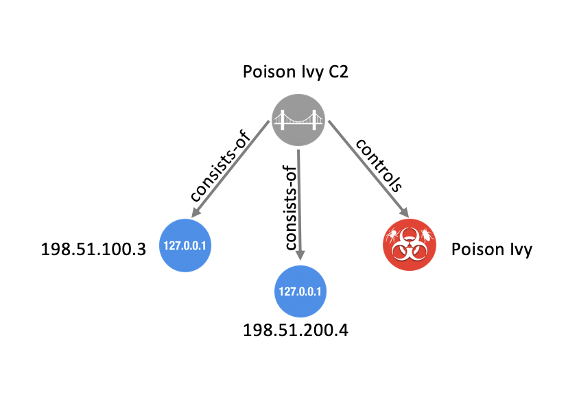
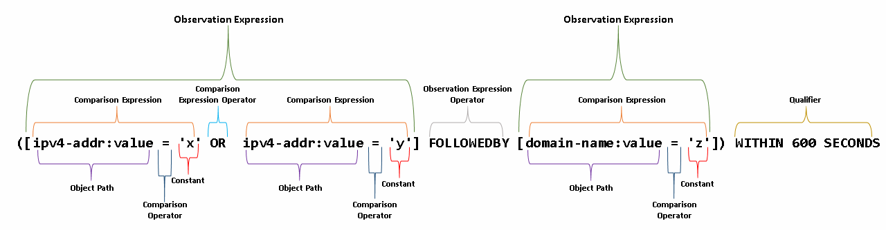
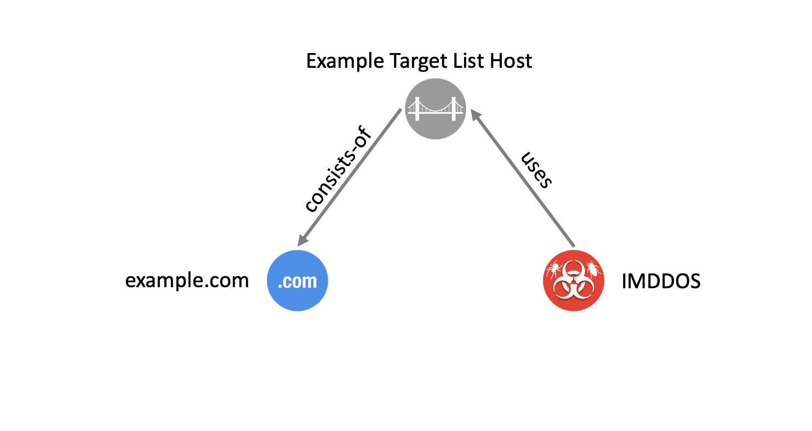
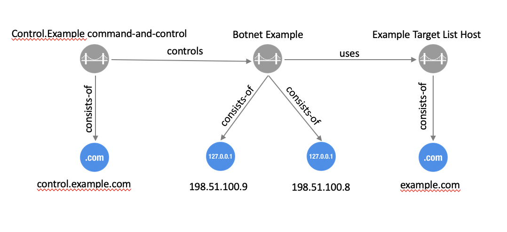
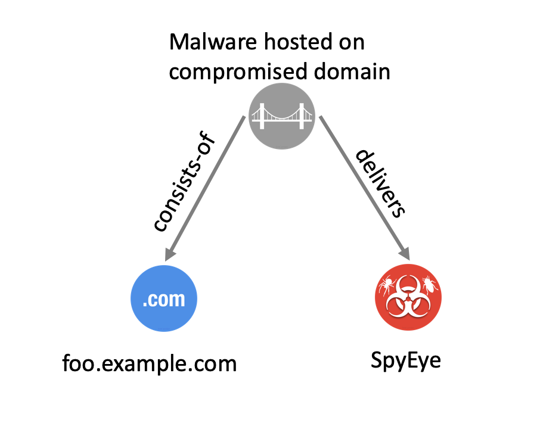

= image:images/oasis-logo.png[OASIS logo,width=306,height=63]
:xrefstyle: short
:stylesdir: css
:stylesheet: stix.css
:toc: macro
:toclevels: 4
:star: *
:bracket: [
:sectnums!:

[discrete]
== [stixtitle]#STIX Version 2.1.1#

[discrete]
=== [stixsubtitle]#Committee Specification Draft 01#

[discrete]
=== [stixsubtitle]#29 March 2024#

*This stage:* +
https://docs.oasis-open.org/cti/stix/v2.1.1/csd01/stix-v2.1.1-csd01.docx (Authoritative) +
https://docs.oasis-open.org/cti/stix/v2.1.1/csd01/stix-v2.1.1-csd01.html +
https://docs.oasis-open.org/cti/stix/v2.1.1/csd01/stix-v2.1.1-csd01.pdf +
*Previous stage:* +
N/A +
*Latest stage:* +
https://docs.oasis-open.org/cti/stix/v2.1.1/stix-v2.1.1.docx (Authoritative) +
https://docs.oasis-open.org/cti/stix/v2.1.1/stix-v2.1.1.html +
https://docs.oasis-open.org/cti/stix/v2.1.1/stix-v2.1.1.pdf

*Technical Committee:* +
https://www.oasis-open.org/committees/cti/[OASIS Cyber Threat Intelligence (CTI) TC]

*Chairs:* +
Marlon Taylor (mailto:marlon.taylor@cisa.dhs.gov[marlon.taylor@cisa.dhs.gov]), http://www.cisa.gov/[DHS Office of Cybersecurity and Communications] +
Alexandre Dulaunoy (mailto:alexandre.dulaunoy@x.circl.lu[alexandre.dulaunoy@x.circl.lu]), https://www.circl.lu/[CIRCL]

*Editors:* +
Rich Piazza (mailto:rpiazza@mitre.org[rpiazza@mitre.org]), http://www.mitre.org/[MITRE Corporation] +
Emily Ratliff (mailto:rpiazza@mitre.org[emily.ratliff@ibm.com]), http://www.ibm.com/[IBM] +
Stephan Relitz (mailto:stephan.relitz@peraton.com[stephan.relitz@peraton.com]), https://www.peraton.com/[Peraton] +
Christian Studer (mailto:christian.studer@circl.lu[christian.studer@circl.lu]), https://www.circl.lu/[CIRCL]

anchor:RelatedWork[]
*Related work:* +
This specification replaces or supersedes:

* _STIX Version 2.1._ Edited by Bret Jordan, Rich Piazza, and Trey Darley. Latest stage: https://docs.oasis-open.org/cti/stix/v2.1/stix-v2.1.html.

This specification is related to:

* _TAXII Version 2.1._ Edited by Bret Jordan and Drew Varner. Latest stage: https://docs.oasis-open.org/cti/taxii/v2.1/taxii-v2.1.html[https://docs.oasis-open.org/cti/taxii/v2.1/taxii-v2.1.html].
* _STIX/TAXII 2.0 Interoperability Test Document: Part 1 Version 1.1._ Edited by Allan Thomson and Jason Keirstead. Latest stage: https://docs.oasis-open.org/cti/stix-taxii-2-interop-p1/v1.1/stix-taxii-2-interop-p1-v1.1.html[https://docs.oasis-open.org/cti/stix-taxii-2-interop-p1/v1.1/stix-taxii-2-interop-p1-v1.1.html].
* _STIX/TAXII 2.0 Interoperability Test Document: Part 2 Version 1.0._ Edited by Allan Thomson and Jason Keirstead. Latest stage: https://docs.oasis-open.org/cti/stix-taxii-2-interop-p2/v1.0/stix-taxii-2-interop-p2-v1.0.html[https://docs.oasis-open.org/cti/stix-taxii-2-interop-p2/v1.0/stix-taxii-2-interop-p2-v1.0.html].

*Abstract:* +
Structured Threat Information Expression (STIX) is a language for expressing cyber threat and observable information. This document defines concepts that apply across all of STIX and defines the overall structure of the STIX language.

*Status:* +
This document was last revised or approved by the membership of OASIS on the above date. The level of approval is also listed above. Check the "Latest stage" location noted above for possible later revisions of this document. Any other numbered Versions and other technical work produced by the Technical Committee (TC) are listed at https://www.oasis-open.org/committees/tc_home.php?wg_abbrev=cti#technical[https://www.oasis-open.org/committees/tc_home.php?wg_abbrev=cti#technical].

TC members should send comments on this document to the TC's email list. Others should send comments to the TC's public comment list, after subscribing to it by following the instructions at the "https://www.oasis-open.org/committees/comments/index.php?wg_abbrev=cti[Send A Comment]" button on the TC's web page at https://www.oasis-open.org/committees/cti/[https://www.oasis-open.org/committees/cti/].

This specification is provided under the https://www.oasis-open.org/policies-guidelines/ipr#Non-Assertion-Mode[Non-Assertion] Mode of the https://www.oasis-open.org/policies-guidelines/ipr/[OASIS IPR Policy], the mode chosen when the Technical Committee was established. For information on whether any patents have been disclosed that may be essential to implementing this specification, and any offers of patent licensing terms, please refer to the Intellectual Property Rights section of the TC's web page (https://www.oasis-open.org/committees/cti/ipr.php[https://www.oasis-open.org/committees/cti/ipr.php]).

Note that any machine-readable content (https://www.oasis-open.org/policies-guidelines/tc-process-2017-05-26#wpComponentsCompLang[Computer Language Definitions]) declared Normative for this Work Product is provided in separate plain text files. In the event of a discrepancy between any such plain text file and display content in the Work Product's prose narrative document(s), the content in the separate plain text file prevails.

*Key words:* +
The key words "*MUST*", "*MUST NOT*", "*REQUIRED*", "*SHALL*", "*SHALL NOT*", "*SHOULD*", "*SHOULD NOT*", "*RECOMMENDED*", "*NOT RECOMMENDED*", "*MAY*", and "*OPTIONAL*" in this document are to be interpreted as described in BCP 14 [RFC2119] [RFC8174] when, and only when, they appear in all capitals, as shown here.

*Citation format:* +
When referencing this specification, the following citation format should be used:

*[STIX-v2.1.1]*

_STIX Version 2.1.1_. Edited by Rich Piazza, Emily Ratliff, Stephan Relitz and Christian Studer. 13 March 2025. OASIS Committee Specification Draft 01. https://docs.oasis-open.org/cti/stix/v2.1.1/csd01/stix-v2.1.1-csd01.html. Latest stage: https://docs.oasis-open.org/cti/stix/v2.1.1/stix-v2.1.1.html.

[discrete]
== Notices

Copyright © OASIS Open 2025. All Rights Reserved.

Distributed under the terms of the OASIS IPR Policy, [https://www.oasis-open.org/policies-guidelines/ipr/].
For complete copyright information please see the full Notices section in an Appendix below.

<<<
toc::[]
<<<
:sectnums:
== Introduction

Structured Threat Information Expression (STIX) is a language and serialization format used to exchange cyber threat intelligence (CTI).
STIX enables organizations to share CTI with one another in a consistent and machine-readable manner, allowing security communities to better understand what computer-based attacks they are most likely to see and to anticipate and/or respond to those attacks faster and more effectively.
STIX is designed to improve many different capabilities, such as collaborative threat analysis, automated threat exchange, automated detection and response, and more.

The objects and features added for inclusion in STIX 2.1 represent an iterative approach to fulfilling basic consumer and producer requirements for CTI sharing.
Objects and properties not included in this version of STIX, but deemed necessary by the community, will be included in future releases.

=== Document Conventions

The following color, font and font style conventions are used in this document:

* The [stixfont]#Consolas# font is used for all type names, property names and literals.
** type names are in red with a light red background – [stixtype]#threat-actor#
** property names are in bold style – *created_at*
** literals (values) are in blue with a blue background – [stixliteral]#malicious-activity#
** All relationship types are string literals; therefore, they will also appear in blue with a blue background – [stixrelationship]#related-to#
* In an object's property table, if a common property is being redefined in some way, then the background is dark grey.
* All examples in this document are expressed in JSON.
They are in `mono` font, with straight quotes, black text and a light grey background, and using 2-space indentation.
JSON examples in this document are representations of JSON objects <<RFC8259>>.
They should not be interpreted as string literals.
The ordering of object keys is insignificant.
Whitespace before or after JSON structural characters in the examples are insignificant <<RFC8259>>.
* Parts of the example may be omitted for conciseness and clarity. These omitted parts are denoted with the ellipses (...).
* The term "hyphen" is used throughout this document to refer to the ASCII hyphen or minus character, which in Unicode is "hyphen-minus", U+002D.

=== Overview

STIX is a schema that defines a taxonomy of cyber threat intelligence that is represented by the following objects:

[width="99%",cols="16%,14%,14%,14%,14%,14%,14%",]
|===
6+|*STIX Objects*  .3+|STIX Bundle Object
3+|*STIX Core Objects* 3+|*STIX Meta Objects (SMO)* 
|STIX Domain Objects (SDO) |STIX Cyber-observable Objects (SCO) |STIX Relationship Objects (SRO) |Extension Definition Objects |Language Content Objects |Marking Definition Objects
|===

*STIX Core Objects*

Any SDO, SCO, or SRO.

*STIX Domain Objects*

Higher Level Intelligence Objects that represent behaviors and constructs that threat analysts would typically create or work with while understanding the threat landscape.

*STIX Cyber-observable Objects*

Objects that represent observed facts about a network or host that may be used and related to higher level intelligence to form a more complete understanding of the threat landscape.

*STIX Relationship Objects*

Objects that connect STIX Domain Objects together, STIX Cyber-observable Objects together, and connect STIX Domain Objects and STIX Cyber-observable Objects together to form a more complete understanding of the threat landscape.

*STIX Meta Objects (SMO)*

A STIX Object that provides the necessary glue and associated metadata to enrich or extend STIX Core Objects to support user and system workflows.

*STIX Bundle Object*

An object that provides a wrapper mechanism for packaging arbitrary STIX content together.

==== Graph-Based Model

STIX is a connected graph of nodes and edges.
STIX Domain Objects and STIX Cyber-observable Objects define the graph nodes and STIX relationships (including both external STIX Relationship Objects and embedded relationships) define the edges.
This graph-based language conforms to common analysis approaches and allows for flexible, modular, structured, and consistent representations of CTI.

==== STIX Domain Objects

STIX defines a set of STIX Domain Objects (SDOs): Attack Pattern, Campaign, Course of Action, Grouping, Identity, Indicator, Infrastructure, Intrusion Set, Location, Malware, Malware Analysis, Note, Observed Data, Opinion, Report, Threat Actor, Tool, and Vulnerability.
Each of these objects corresponds to a concept commonly used in CTI.

STIX Domain Objects are defined in <<_stix_domain_objects_2>>.

==== STIX Cyber-observable Objects

STIX defines a set of STIX Cyber-observable Objects (SCOs) for characterizing host-based and network-based information.
SCOs are used by various STIX Domain Objects (SDOs) to provide supporting context.
The Observed Data SDO, for example, indicates that the raw data was observed at a particular time.

STIX Cyber-observable Objects (SCOs) document the facts concerning what happened on a network or host, and do not capture the who, when, or why.
By associating SCOs with STIX Domain Objects (SDOs), it is possible to convey a higher-level understanding of the threat landscape, and to potentially provide insight as to the who and the why particular intelligence may be relevant to an organization.
For example, information about a file that existed, a process that was observed running, or that network traffic occurred between two IPs can all be captured as SCOs.

STIX Cyber-observable Objects (SCOs) are defined in <<_stix_cyber_observable_objects_2>>.

Previously, in STIX 2.0, Cyber-observable Objects could only exist as objects within an Observed Data object. It is still possible to represent Cyber-observable Objects in this way, but this method has been deprecated. See <<_observable_container_deprecated>>.

==== STIX Relationships

A relationship is a link between STIX Domain Objects (SDOs), STIX Cyber-observable Objects (SCOs), or between an SDO and a SCO that describes the way in which the objects are related.
Relationships can be represented using an external STIX Relationship Object (SRO) or, in some cases, through certain properties which store an identifier reference that comprises an embedded relationship, (for example the *created_by_ref* property).

The generic STIX Relationship Object (SRO) is one of two SROs and is used for most relationships in STIX.
This generic SRO contains a property called *relationship_type* to describe more specifically what the relationship represents.
This specification defines a set of known terms to use for the *relationship_type* property between SDOs of specific types.
For example, the Indicator SDO defines a relationship from itself to Malware via a *relationship_type* of [stixliteral]#indicates# to describe how the Indicator can be used to detect the presence of the corresponding Malware. In addition to the terms defined in the specification, STIX also allows for user-defined terms to be used as the relationship type.

Currently the only other SRO (besides a generic Relationship) is the Sighting SRO.
The Sighting object is used to capture cases where an entity has "seen" an SDO, such as sighting an indicator.
Sighting is a separate SRO because it contains additional properties such as *count* that are only applicable to Sighting relationships.
Other SROs may be defined in future versions of STIX if new relationships are identified that also require additional properties not present on the generic Relationship object.

In addition to relationships created using the SROs (Relationship and Sighting), STIX also uses ID references to represent embedded relationships.
Embedded relationships are simply ID reference properties on STIX Objects that contain the ID of a different STIX Object.
Embedded relationships are used when the property is an inherent part of the object and not something that a third party might add or something that might require the inclusion of a confidence score.
Because they represent an inherent linkage and have no other properties, an SRO is not needed to represent them.
An embedded relationship can only be asserted by the creator of the object ("object creator") it is contained in.

For example, the entity that created a STIX Object is an inherent, factual part of that object and therefore that information is captured in an embedded relationship contained in the *created_by_ref* property rather than through the use of an SRO.

Embedded relationships (ID references) are described in section <<_object_ids_and_references>> and STIX Relationship Objects (SROs) are defined in <<_stix_relationship_objects>>.

==== STIX Cyber Observable Observed Data Relationships (Deprecated)

While refining STIX for the 2.1 specification, the CTI TC reached consensus that the STIX 2.0 Cyber Observable Container (see <<_observable_container_deprecated>>) and the Observed Data object's graph within a graph model was insufficient to support critical CTI use cases.
Consequently, in STIX 2.1, the Cyber Observable Container is deprecated, and implementers are encouraged to use STIX Relationship Objects (SROs) instead.
Within the context of the (deprecated) Cyber Observable Container's graph within a graph model, an object relationship is a reference linking two (or more) related SCOs and these relationships are constrained to SCOs contained within the same Cyber Observable Container.

A Cyber Observable Container relationship should not be confused with STIX Relationship Objects (SROs) that are defined in <<_stix_relationship_objects>>.

==== STIX Patterning

The STIX Patterning language enables the detection of activity on networks and endpoints.
This language allows matching against time stamped cyber observable data collected by a threat intelligence platform or other similar system.
STIX Patterning is currently only used by the STIX Indicator object, but it can be employed in other use cases.

Before undertaking work on STIX Patterning, a thorough effort to evaluate existing patterning languages (e.g., Snort or Yara) was performed.
This effort identified that no existing patterning language solves or supports the STIX use cases. Extending other languages was ruled out as unfeasible, both from a technical perspective as well as taking into consideration that from a licensing/IPR perspective, extending an existing language under the auspices of OASIS would have been problematic.

STIX Patterning was primarily designed to support STIX Indicators.
As such it is a mechanism for communicating how to find malicious code and/or threat actors active within a given network or endpoint.

This language release is focused on supporting a common set of use cases and therefore allows for the expression of an initial set of patterns that producers and consumers of STIX can utilize.
As more complex patterns are deemed necessary, the STIX patterning language will be extended in future releases to improve its effectiveness as an automated detection/remediation method.

STIX Patterning is defined in <<_stix_patterning_2>>.

==== STIX Common Properties

STIX Domain Objects (SDOs) and Relationship Objects (SROs) all share a common set of properties which provide core capabilities such as versioning and data markings (representing how data can be shared and used).
All STIX Cyber-observable Objects (SCOs) likewise share a common set of properties that are applicable for all SCOs. Similarly, STIX Meta Objects (SMOs) use some but not all of the common properties.

==== STIX Open Vocabularies and Enumerations

Some STIX properties are defined using open vocabularies or enumerations.
Enumerations and open vocabularies are defined in STIX in order to enhance interoperability by increasing the likelihood that different entities use the same exact string to represent the same concept.
If used consistently, open vocabularies make it less likely that one entity refers to the energy sector as "Energy" and another as "Energy Sector", thereby making comparison and correlation easier.

While using predefined values from STIX vocabularies is strongly encouraged, in some cases this may not be feasible.
To address this, producers are permitted to use values outside of the open vocabulary.
In the case of enumerations, producers are required to use only the values defined within the STIX specification.

STIX open vocabularies and enumerations are defined in <<_stix_vocabularies>>.
Properties that are defined as open vocabularies identify a suggested vocabulary from that section.
For example, the Threat Actor *sophistication* property, as defined in <<_threat_actor>>, uses the Threat Actor Sophistication vocabulary as defined in <<_threat_actor_sophistication_vocabulary>>.

==== Reserved Names

Reserved property names are marked with a type called [stixtype]#RESERVED# and a description text of "RESERVED FOR FUTURE USE". For more information please see <<_reserved_names_2>>].

==== Serialization

STIX is defined independent of any specific storage or serialization.
However, the mandatory-to-implement (MTI) serialization for STIX 2.1 is UTF-8 encoded JSON as defined in <<RFC7493>> and <<RFC8259>>, which uses the JSON Object type described within when representing all STIX Objects.
In other words, all STIX-conformant tools have to implement support for JSON but can implement support for other serializations.

==== Transporting STIX

STIX 2.1 is transport-agnostic, i.e., the structures and serializations do not rely on any specific transport mechanism.
A companion CTI specification, xref:RelatedWork[TAXII], is designed specifically to transport STIX Objects.
STIX provides a Bundle (see <<_stix_bundle_object>>) as a container for STIX Objects to allow for transportation of bulk STIX data, especially over non-TAXII communication mechanisms.

==== JSON Schemas

JSON schemas have been developed by members of the Cyber Threat Intelligence Technical Committee.
The JSON schemas are informative and serve as a best effort attempt to validate that STIX 2.1 content meets the structural requirements identified in this specification.
This specification is the normative description of STIX 2.1.

=== Changes From Earlier Versions

This section lists all of the changes from the previous 2.1 version of STIX.

==== STIX 2.1.1 Changes from earlier versions

STIX 2.1.1 differs from STIX 2.1 in the following ways:

* Updated Malware Embedded Relationships table with missing property in <<_relationships_11>>.
** *operating_system_refs* is no longer missing in the table.
* Malware Analysis Relationships table fixed with the right relationship type between Malware Analysis and Malware in <<_relationships_12>>.
** wrong [stixliteral]#analysis-of# is replaced with the right [stixliteral]#av-analysis-of# relationship type.
* Email Message property descriptions fixed in <<_properties_28>>.
** *from_ref*, *sender_ref*, *to_refs*, *cc_refs* and *bcc_refs* properties descriptions now mention the right [stixtype]#email-addr# type they are referencing.
* HTTP Request Extension examples fixed in <<_properties_44>>.
** the *request_header* property is now a [stixtype]#list# of type [stixtype]#string# in the examples, as expected from the description.
* Observation Expression Qualifiers example fixed in <<_observation_expression_qualifiers>>.
** the example used to illustrate the use of _Observation Expression_ [stixliteral]#WITHIN# _x_ [stixliteral]#SECONDS# now has the right [stixtype]#windows-registry-key# Observable type.
* Updated Implementation Language Vocabulary in <<_implementation_language_vocabulary>>.
** [stixliteral]#rust# value was added.
* Updated Industry Sector Vocabulary in <<_industry_sector_vocabulary>>.
** [stixliteral]#legal# value was added.
* Fixed Infrastructure Type Vocabulary Summary in <<_infrastructure_type_vocabulary>>.
** missing [stixliteral]#control-system#, [stixliteral]#firewall#, [stixliteral]#routers-switches# and [stixliteral]#workstation# values were added to the Summary as they were already described in the Vocabulary table.
* Enhanced Malware Result Vocabulary in <<_malware_result_vocabulary>>.
** descriptions for every vocabulary values were improved with more descriptive definitions.
* Fixed Report Type Vocabulary in <<_report_type_vocabulary>>.
** missing [stixliteral]#incident# value was added.
* Updated Threat Actor Type Vocabulary in <<_threat_actor_type_vocabulary>>.
** [stixliteral]#private-sector# value was added.
* Fixed multiple Enumeration headers
** Enumerations now have the right headers, to differenciate enumerations from vocabularies, including:
*** *Enumeration Name* is now used instead of *Vocabulary Name*
*** *Enumeration Summary* is now used instead of *Vocabulary Summary*
*** *Enumeration Value* is now used instead of *Vocabulary Value*
** These changes apply on:
*** Encryption Algorithm Enumeration in <<_encryption_algorithm_enumeration>>
*** Extension Type Enumeration in <<_extension_type_enumeration>>
*** Network Socket Address Family Enumeration in <<_network_socket_address_family_enumeration>>
*** Network Socket Type Enumeration in <<_network_socket_type_enumeration>>
*** Opinion Enumeration <<_opinion_enumeration>>
*** Windows™ Integrity Level Enumeration in <<_windows_integrity_level_enumeration>>
*** Windows™ Registry Datatype Enumeration in <<_windows_registry_datatype_enumeration>>
*** Windows™ Service Start Type Enumeration in <<_windows_service_start_type_enumeration>>
*** Windows™ Service Type Enumeration in <<_windows_service_type_enumeration>>
*** Windows™ Service Status Enumeration in <<_windows_service_status_enumeration>>
* Relationship Summary Table has been update in <<_relationship_summary_table>>.
** Duplicated relationship [stixliteral]#located-at# between [stixtype]#threat-actor# and [stixtype]#location# has been removed.
** Misspelled relationship [stixliteral]#exfiltrates-to# between [stixtype]#malware# and [stixtype]#infrastructure# has been fixed.
** Missing relationships have been added, including:
*** [stixliteral]#remediates# between [stixtype]#course-of-action# and [stixtype]#malware#
*** [stixliteral]#remediates# between [stixtype]#course-of-action# and [stixtype]#vulnerability#
*** [stixliteral]#uses# between [stixtype]#tool# and [stixtype]#infrastructure#
*** [stixliteral]#resolves-to# between [stixtype]#domain-name# and [stixtype]#domain-name#
*** [stixliteral]#resolves-to# between [stixtype]#domain-name# and [stixtype]#ipv4-addr#
*** [stixliteral]#resolves-to# between [stixtype]#domain-name# and [stixtype]#ipv6-addr#
*** [stixliteral]#resolves-to# between [stixtype]#ipv4-addr# and [stixtype]#mac-addr#
*** [stixliteral]#belongs-to# between [stixtype]#ipv6-addr# and [stixtype]#autonomous-system#
*** [stixliteral]#resolves-to# between [stixtype]#ipv4-addr# and [stixtype]#mac-addr#
*** [stixliteral]#belongs-to# between [stixtype]#ipv6-addr# and [stixtype]#autonomous-system#
* Fixed typos in Extension Definition Additional Examples
*** typos were fixed in titles for <<_adding_properties_to_an_existing_stix_object_instance>> and <<_adding_properties_to_an_existing_stix_relationship_object_instance>>.
* Special characters were fixed in some participants names in <<_acknowledgments>>.
* All SCO ids were updated in examples to agree with the `generate_id` method in _python-stix2_ library.
* Improved references through the document.
** missing references to sections were added at different places.
** some references were fixed to point to the right section.
** in the description of STIX object properties whose value is either a vocabulary or an enumeration, a reference poiting to the given vocabulary or enumeration was added.

[template="glossary",id="terms"]
=== Glossary

*AV* - Anti-Virus / Anti-Malware solution

*CAPEC* - Common Attack Pattern Enumeration and Classification

*Consumer* - Any entity that receives STIX content

*CTI* - Cyber Threat Intelligence

*Deprecated* - STIX features or properties that are in the process of being replaced by newer ones.

*Embedded Relationship* - A link (an "edge" in a graph) between one STIX Object and another represented as a property on one object containing the ID of another object

*Entity* - Anything that has a separately identifiable existence (e.g., organization, person, group, etc.)

*IEP* - FIRST (Forum of Incident Response and Security Teams) Information Exchange Policy

*Instance* - A single occurrence of a STIX Object version#

*MTI* - Mandatory To Implement

*Object Creator* - The entity that created or updated a STIX Object (see <<_object_creator>>)

*Object Representation* - An instance of an object version that is serialized as STIX

*Producer* - Any entity that distributes STIX content, including object creators as well as those passing along existing content

*SCO* - STIX Cyber-observable Object

*SDO -* STIX Domain Object (a "node" in a graph)

*SMO* - STIX Meta Object

*SRO* - STIX Relationship Object (one mechanism to represent an "edge" in a graph)

*STIX* - Structured Threat Information Expression

*STIX Content* - STIX documents, including STIX Objects, STIX Objects grouped as bundles, etc.

*STIX Object* - A STIX Domain Object (SDO), STIX Cyber Observable Object (SCO), STIX Relationship Object (SRO), or STIX Meta Object (SMO).

*STIX Relationship* - A link (an "edge" in a graph) between two STIX Objects represented by either an SRO or an embedded relationship

*STIX Extension* - A set of mechanisms supporting adding new objects and updating existing objects in a standard way.

*TAXII* - An application layer protocol for the communication of cyber threat information

*TLP* - Traffic Light Protocol

*TTP* - Tactic, technique, or procedure; behaviors and resources that attackers use to carry out their attacks

== Common Data Types

This section defines the common types used throughout STIX for all STIX Objects.
These types will be referenced by the "Type" column in other sections.
This section defines the names and permitted values of common types that are used in the STIX information model; it does not, however, define the meaning of any properties using these types.
These types may be further restricted elsewhere in the document.

The table below is a summary of the data types defined in this section.

[width="100%",cols="29%,71%",]
|===
|[stixtr]*Type* |[stixtr]*Description*

|[stixtype]#binary# |A sequence of bytes.
|[stixtype]#boolean# |A value of [stixliteral]*true* or [stixliteral]*false*.
|[stixtype]#dictionary# |A set of key/value pairs.
|[stixtype]#enum# |A value from a STIX Enumeration.
|[stixtype]#external-reference# |A non-STIX identifier or reference to other related external content.
|[stixtype]#float# |An IEEE 754 [xref:IEEE7542008[IEEE 754-2008]] double-precision number.
|[stixtype]#hashes# |One or more cryptographic hashes.
|[stixtype]#hex# |An array of octets as hexadecimal.
|[stixtype]#identifier# |An identifier (ID) is for STIX Objects.
|[stixtype]#integer# |A whole number.
|[stixtype]#kill-chain-phase# |A name and a phase of a kill chain.
|[stixtype]#list# |A sequence of values ordered based on how they appear in the list. The phrasing "[stixtype]#list# of type [stixtype]#<type>#" is used to indicate that all values within the list *MUST* conform to the specified type.
|[stixtype]#observable-container# |One or more STIX Cyber-observable Objects in the deprecated Cyber Observable Container.
|[stixtype]#open-vocab# |A value from a STIX open ([stixtype]#open-vocab#) or suggested vocabulary.
|[stixtype]#string# |A series of Unicode characters.
|[stixtype]#timestamp# |A time value (date and time).
|===

=== Binary

*Type Name:* [stixtype]#binary#

The [stixtype]#binary# data type represents a sequence of bytes.
In order to allow pattern matching on custom objects, for all properties that use the binary type, the property name *MUST* end with '_bin'.

The JSON MTI serialization represents this as a base64-­encoded string as specified in <<RFC4648>>​.
Other serializations *SHOULD* use a native binary type, if available.

=== Boolean

*Type Name:* [stixtype]#boolean#

A [stixtype]#boolean# is a value of either true or false.
Properties with this type *MUST* have a value of [stixliteral]#true# or [stixliteral]#false#.

The JSON MTI serialization uses the true and false (boolean) values from the JSON values <<RFC8259>>, which are a literal (unquoted) true or false.

*Examples*

--------------------------------------
{
  ...
  "summary": true,
  ...
}
--------------------------------------

=== Dictionary ===

*Type Name:* [stixtype]#dictionary#

A [stixtype]#dictionary# captures an arbitrary set of key/value pairs.
Dictionary keys *MUST* be unique in each dictionary, *MUST* be in ASCII, and are limited to the characters a-z (lowercase ASCII), A-Z (uppercase ASCII), numerals 0-9, hyphen (-), and underscore (_).
Dictionary keys *MUST* be no longer than 250 ASCII characters in length and *SHOULD* be lowercase.

Empty dictionaries are prohibited in STIX and *MUST NOT* be used as a substitute for omitting the property if it is optional.
If the property is required, the dictionary *MUST* be present and *MUST* have at least one key-value pair.

[stixtype]#dictionary# values *MUST* be valid property base types.

=== Enum

*Type Name:* [stixtype]#enum#

The [stixtype]#enum# type is a hardcoded list of terms that is represented as a [stixtype]#string#.
For properties that use this type there is a defined list of values that is identified in the definition for said properties.
The STIX Enumerations are defined in <<_stix_vocabularies>>.
Terms defined in an [stixtype]#enum# by the specification *MUST NOT* be expanded by implementations.

The JSON MTI serialization uses the JSON String type <<RFC8259>> when representing [stixtype]#enum# enumeration.

=== External Reference

*Type Name:* [stixtype]#external-reference#

External references are used to describe pointers to information represented outside of STIX.
For example, a Malware object could use an external reference to indicate an ID for that malware in an external database or a report could use references to represent source material.

The JSON MTI serialization uses the JSON Object type [xref:RFC8259[RFC8259]] when representing [stixtype]#external-reference#.

==== Properties

[width="100%",cols="35%,19%,46%",options="header"]
|===
|[stixtr]*Property Name* |[stixtr]*Type* |[stixtr]*Description*

|*source_name* (required) |[stixtype]#string# |The name of the source that the [stixtype]#external-reference# is defined within (system, registry, organization, etc.).

|*description* (optional) |[stixtype]#string# |A human readable description.

|*url* (optional) |[stixtype]#string# |A URL reference to an external resource <<RFC3986>>.

|*hashes* (optional) |[stixtype]#hashes#|
Specifies a dictionary of hashes for the contents of the *url*. This *SHOULD* be provided when the *url* property is present.

Dictionary keys *MUST* come from one of the entries listed in the [stixvocab]#<<_hashing_algorithm_vocabulary,hash-algorithm-ov>>#.

As stated in <<_hashes>>, to ensure interoperability, a SHA-256 hash *SHOULD* be included whenever possible.

|*external_id* (optional) |[stixtype]#string# |An identifier for the external reference content.

|===

==== Requirements

* In addition to the *source_name* property, at least one of the *description*, *url*, or *external_id* properties *MUST* be present.

*Examples*

An [stixtype]#external-reference# to a VERIS Community Database (VCDB) <<VERIS>> entry

--------------------------------------
{
  ...
  "external_references": [
    {
      "source_name": "veris",
      "external_id": "0001AA7F-C601-424A-B2B8-BE6C9F5164E7",
      "url": "https://github.com/vz-risk/VCDB/blob/125307638178efddd3ecfe2c267ea434667a4eea/data/json/validated/0001AA7F-C601-424A-B2B8-BE6C9F5164E7.json",
      "hashes": {
        "SHA-256": "6db12788c37247f2316052e142f42f4b259d6561751e5f401a1ae2a6df9c674b"
      }
    }
  ],
  ...
}
--------------------------------------

An [stixtype]#external-reference# from the CAPEC™ <<CAPEC>> repository

--------------------------------------
{
  ...
  "external_references": [
    {
      "source_name": "capec",
      "external_id": "CAPEC-550"
    }
  ],
  ...
}
--------------------------------------

An [stixtype]#external-reference# from the CAPEC repository with URL

--------------------------------------
{
  ...
  "external_references": [
    {
      "source_name": "capec",
      "external_id": "CAPEC-550",
      "url": "http://capec.mitre.org/data/definitions/550.html"
    }
  ],
  ...
}
--------------------------------------

An [stixtype]#external-reference# to ACME Threat Intel's report document

--------------------------------------
{
  ...
  "external_references": [
    {
      "source_name": "ACME Threat Intel",
      "description": "Threat report",
      "url": "http://intelreport.mandiant.com/Mandiant_APT1_Report.pdf"
    }
  ],
  ...
}
--------------------------------------

An [stixtype]#external-reference# to a Bugzilla item

--------------------------------------
{
  ...
  "external_references": [
    {
      "source_name": "ACME Bugzilla",
      "external_id": "1370",
      "url": "https://issues.oasis-open.org/browse/TAB-1370"
    }
  ],
  ...
}
--------------------------------------

An [stixtype]#external-reference# to an offline threat report (i.e., e-mailed, offline, etc.)

--------------------------------------
{
  ...
  "external_references": [
    {
      "source_name": "ACME Threat Intel",
      "description": "Threat report"
    }
  ],
  ...
}
--------------------------------------

=== Float

*Type Name:* [stixtype]#float#

The float data type represents an IEEE 754 [xref:IEEE7542008[IEEE 754-2008]] double-precision number (e.g., a number with a fractional part).
However, because the values ±Infinity and NaN are not representable in JSON, they are not valid values in STIX.

In the JSON MTI serialization, floating point values are represented by the JSON Number type <<RFC7493>>.

*Examples*

--------------------------------------
{
  ...
  "distance": 8.321,
  ...
}
--------------------------------------

=== Hashes

*Type Name:* [stixtype]#hashes#

The Hashes type represents one or more cryptographic hashes, as a special set of key/value pairs.
Accordingly, the name of each hashing algorithm *MUST* be specified as a key in the dictionary and *MUST* identify the name of the hashing algorithm used to generate the corresponding value.
This name *SHOULD* come from one of the values defined in the [stixvocab]#<<_hashing_algorithm_vocabulary,hash-algorithm-ov>># open vocabulary.

Dictionary keys *MUST* be unique in each [stixtype]#hashes# property, *MUST* be in ASCII, and are limited to the characters a-z (lowercase ASCII), A-Z (uppercase ASCII), numerals 0-9, hyphen (-), and underscore (_).
Dictionary keys *MUST* have a minimum length of 3 ASCII characters and *MUST* be no longer than 250 ASCII characters in length.
The value *MUST* be a [stixtype]#string# in the appropriate format defined by the hash type indicated in the dictionary key.

To enhance compatibility, the SHA-256 hash *SHOULD* be used whenever possible.

*Examples*

_SHA-256 and User-Defined Hash_

--------------------------------------
{
  "SHA-256": "6db12788c37247f2316052e142f42f4b259d6561751e5f401a1ae2a6df9c674b",
  "x_foo_hash": "aaaabbbbccccddddeeeeffff0123457890"
}
--------------------------------------

=== Hexadecimal

*Type Name:* [stixtype]#hex#

The [stixtype]#hex# data type encodes an array of octets (8-bit bytes) as hexadecimal. 
The string *MUST* consist of an even number of hexadecimal characters, which are the digits '0' through '9' and the lower-case letters 'a' through 'f'. 
In order to allow pattern matching on custom objects, for all properties that use the [stixtype]*hex* type, the property name *MUST* end with '_hex'.

*Examples*

--------------------------------------
...
  "src_flags_hex": "00000002"
...
--------------------------------------

=== Identifier

*Type Name:* [stixtype]#identifier#

An [stixtype]#identifier# uniquely identifies a STIX Object and *MAY* do so in a deterministic way.
A deterministic [stixtype]#identifier# means that the [stixtype]#identifier# generated by more than one producer for the exact same STIX Object using the same namespace, "ID Contributing Properties", and UUID method will have the exact same [stixtype]#identifier# value.

All [stixtype]#identifiers#, excluding those used in the deprecated Cyber Observable Container, *MUST* follow the form [stixalt]#__object-type__--_UUID_#, where [stixalt]_object-type_ is the exact value (all type names are lowercase strings, by definition) from the [stixtype]#type# property of the object being identified or referenced and where the [stixalt]_UUID_ *MUST* be an RFC 4122-compliant UUID <<RFC4122>>.

The [stixalt]_UUID_ part of the [stixtype]#identifier# *MUST* be unique across all objects produced by a given producer regardless of the type identified by the [stixalt]_object-type_ prefix.
Meaning, a producer *MUST NOT* reuse the [stixalt]_UUID_ portion of the [stixtype]#identifier# for objects of different types.

STIX Domain Objects, STIX Relationship Objects, STIX Meta Objects, and STIX Bundle Object *SHOULD* use UUIDv4 for the [stixalt]_UUID_ portion of the [stixtype]#identifier#.
Producers using something other than UUIDv4 need to be mindful of potential collisions and should use a namespace that guarantees uniqueness, however, they *MUST NOT* use a namespace of [stixliteral]#00abedb4-aa42-466c-9c01-fed23315a9b7# if generating a UUIDv5.

STIX Cyber-observable Objects *SHOULD* use UUIDv5 for the [stixalt]_UUID_ portion of the [stixtype]#identifier# and the [stixalt]_UUID_ portion of the UUIDv5-based [stixtype]#identifier# *SHOULD* be generated according to the following rules:

* The namespace *SHOULD* be [stixliteral]#00abedb4-aa42-466c-9c01-fed23315a9b7#. This defined namespace is necessary to support the goal of deduplication and semantic equivalence of some STIX objects in the community of producers.
* The value of the name portion *SHOULD* be the list of "ID Contributing Properties" (property-name and property value pairs) as defined on each SCO object and *SHOULD* be represented as a JSON object that is then serialized / stringified according to <<RFC8785>> to ensure a canonical representation of the JSON data.
* If the contributing properties are all optional, and none are present on the SCO, then a UUIDv4 *MUST* be used.
* Producers not following these rules *MUST NOT* use a namespace of [stixliteral]#00abedb4-aa42-466c-9c01-fed23315a9b7# and *SHOULD* use UUIDv4 in cases where the id would not be unique.

STIX Cyber-observable Objects that are used in the deprecated Cyber Observable Container *MAY* use any [stixtype]#string# value for the [stixtype]#identifier#.
For the deprecated Cyber Observable Container, it is common for implementers to use simple numerical strings for these [stixtype]#identifiers# (e.g., "0", "1", "2", etc.).
See <<_observable_container_deprecated>> for more information.

* These identifiers, when used inside the deprecated Cyber-observable Objects Container specify a local reference to a Cyber-observable Object. These references *MUST* be valid within the local scope of the Cyber Observable Container ([stixtype]#observable-container#) that holds both the source Cyber-observable Object and the Cyber-observable Object that it references.

* These identifiers *SHOULD* be a non-negative monotonically increasing integer, incrementing by 1 from a starting value of 0, and represented as a string within the JSON MTI serialization. However, implementers *MAY* elect to use an alternate key format if necessary.

Using Identifiers: +
Consumers of STIX Cyber Threat Intelligence that are processing the *objects* property of an [stixtype]#Observed-Data# object can assume that the [stixtype]#identifier# is an old deprecated Cyber Observable Container [stixtype]#identifier#.
Consumers can also inspect the [stixtype]#identifier# to see if it contains an [stixalt]_object-type_, if not, they can assume that it is a deprecated Cyber Observable Container [stixtype]#identifier#.
If it does have an [stixalt]_object-type_ and it matches a SCO, then chances are it is a UUIDv5 deterministic [stixtype]#identifier#, but this can be verified by inspecting the [stixalt]_UUID_ portion of the identifier.
<<RFC4122>> defines how one can distinguish between a UUIDv4 and UUIDv5 value.

NOTE: Please see the security considerations section in <<_iana_considerations>> for information about using UUIDv5.

The JSON MTI serialization uses the JSON String type <<RFC8259>> when representing [stixtype]#identifier#.

*​Examples*
--------------------------------------
{
  ...
  "type": "indicator",
  "id": "indicator--e2e1a340-4415-4ba8-9671-f7343fbf0836",
  ...
}

{
  "type": "ipv4-addr",
  "id": "ipv4-addr--28bb3599-77cd-5a82-a950-b5bc3caf07c4",
  "value": "198.51.100.3"
}
--------------------------------------

Deprecated Cyber Observable Container Identifiers
--------------------------------------
{
  "0": {
    "type": "ipv4-addr",
    "value": "198.51.100.2"
  },

  "1": {
    "type": "network-traffic",
    "dst_ref": "0"
  }
}
--------------------------------------

=== Integer

*Type Name:* [stixtype]#integer#

The integer data type represents a whole number.
Unless otherwise specified, all integers *MUST* be capable of being represented as a signed 54-bit value ([-(2{star}{star}53)+1, (2{star}{star}53)-1]) as defined in <<RFC7493>>.
Additional restrictions *MAY* be placed on the type as described where it is used.
The integer size is limited to a 54-bit value not a 64-bit value as per the RFC.

In the JSON MTI serialization, integers are represented by the JSON Number type <<RFC7493>>.

*Examples*

--------------------------------------
{
  ...
  "count": 8,
  ...
}
--------------------------------------

=== Kill Chain Phase

*Type Name:* [stixtype]#kill-chain-phase#

The [stixtype]#kill-chain-phase# represents a phase in a kill chain, which describes the various phases an attacker may undertake in order to achieve their objectives.

The JSON MTI serialization uses the JSON Object type <<RFC8259>> when representing [stixtype]#kill-chain-phase#.

[width="100%",cols="37%,23%,40%",]
|===
|[stixtr]*Property Name* |[stixtr]*Type* |[stixtr]*Description*

|*kill_chain_name* (required) 
|[stixtype]#string# 
|The name of the kill chain.
The value of this property *SHOULD* be all lowercase and *SHOULD* use hyphens instead of spaces or underscores as word separators.

|*phase_name* (required)# 
|[stixtype]#string# 
|The name of the phase in the kill chain.
The value of this property *SHOULD* be all lowercase and *SHOULD* use hyphens instead of spaces or underscores as word separators.
|===

When referencing a kill chain, the *kill_chain_name* property *MUST* be the name of that kill chain.

*Examples*

Example specifying the "pre-attack" phase from the "foo" kill chain

--------------------------------------
{
  ...
  "kill_chain_phases": [
    {
      "kill_chain_name": "foo",
      "phase_name": "pre-attack"
    }
  ],
  ...
}
--------------------------------------

Example specifying the "pre-attack" phase from the "foo" kill-chain

--------------------------------------
{
  ...
  "kill_chain_phases": [
    {
      "kill_chain_name": "foo",
      "phase_name": "pre-attack"
    }
  ],
  ...
}
--------------------------------------

=== List

*Type Name:* [stixtype]#list#

The [stixtype]#list# type defines a sequence of values ordered based on how they appear in the list.
The phrasing "[stixtype]#list# of type [stixtype]#<type>#" is used to indicate that all values within the list *MUST* conform to the specified type.
For instance, [stixtype]#list# of type [stixtype]#integer# means that all values of the list must be of the [stixtype]#integer# type.
This specification does not specify the maximum number of allowed values in a [stixtype]#list#; however, every instance of a [stixtype]#list# *MUST* have at least one value.
Specific STIX Object properties may define more restrictive upper and/or lower bounds for the length of the list.

Empty lists are prohibited in STIX and *MUST NOT* be used as a substitute for omitting the property if it is optional.
If the property is required, the list *MUST* be present and *MUST* have at least one value.

The JSON MTI serialization uses the JSON Array type <<RFC8259>>, which is an ordered list of zero or more values.

*Examples*
--------------------------------------
{
  ...
  "observed_data_refs": [
    "observed-data--b67d30ff-02ac-498a-92f9-32f845f448cf",
    "observed-data--c96f4120-2b4b-47c3-b61f-eceaa54bd9c6",
    "observed-data--787710c9-1988-4a1b-9761-a2de5e19c62f"
  ],
  ...
}
--------------------------------------

=== Observable Container (deprecated)

*Type Name:* [stixtype]#observable-container#

Representing Cyber-observable Objects in an Observable Container has been deprecated and *SHOULD NOT* be used when creating new content.
Existing Observable Data objects using Observable Containers may contain SCOs as defined in this specification, but also may contain Cyber-observable Objects as described in version 2.0 of STIX (xref:RelatedWork[_STIX Version 2.0. Part 3: STIX Objects_]).

The Observable Container type can contain one or more STIX Cyber-observable Objects as a special set of key/value pairs.
The keys in the dictionary are the references used to refer to an object which is located in the observable container as a value to some key.
The value of this "key" is a reference that can be used in the embedded relationship properties in other objects, which *MUST* be in the same container (such as the src_ref property on the Network Traffic object).

Resolving a reference is the process of identifying all of the objects in an observable container by their "key" reference value.
References resolve to an object when the value of the property (e.g., src_ref) is an exact match with the key of another object that resides in the same container as the object that specifies the reference.
All such references are local to the container and the referenced object *MUST* be provided within the same container.
This specification does not address the implementation of reference resolution. Each key in the observable container dictionary is an identifier.

*STIX 2.0 Examples*

_Network Traffic with Source/Destination IPv4 Addresses and AS_
--------------------------------------
{
  "0": {
    "type": "ipv4-addr",
    "value": "1.2.3.4",
    "belongs_to_refs": ["3"]
  },
  "1": {
    "type": "ipv4-addr",
    "value": "2.3.4.5"
  },
  "2": {
    "type": "network-traffic",
    "src_ref": "0",
    "dst_ref": "1",
  }
  "3": {
    "type": "as"
    "number": 42
  }
}

{
  "0": {
    "type": "email-addr",
    "value": "jdoe@example.com",
    "display_name": "John Doe"
  },
  "1": {
    "type": "email-addr",
    "value": "mary@example.com",
    "display_name": "Mary Smith"
  },
  "2": {
    "type": "email-message",
    "from_ref": "0",
    "to_refs": ["1"],
    "date": "1997-11-21T15:55:06Z",
    "subject": "Saying Hello"
  }
}
--------------------------------------

=== Open Vocabulary

*Type Name:* [stixtype]#open-vocab#

The [stixtype]#open-vocab# type is represented as a [stixtype]#string#.
For properties that use this type there will be a list of suggested values, known as the suggested vocabulary, that is identified in the definition for that property.
The suggested vocabularies are defined in <<_stix_vocabularies>>.
The value of the property *SHOULD* be chosen from the suggested vocabulary, but *MAY* be any other [stixtype]#string# value.
Values that are not from the suggested vocabulary *SHOULD* be all lowercase and *SHOULD* use hyphens instead of spaces or underscores as word separators.

A consumer that receives STIX content with one or more [stixtype]#open-vocab# terms not defined in the suggested vocabulary *MAY* ignore those values.

The JSON MTI serialization uses the JSON String type <<RFC8259>> when representing [stixtype]#open-vocab#.

*Examples*

Example using value from the suggested vocabulary.
In this example the Threat Actor *sophistication* property is an open vocabulary and we are using one of the suggested vocabulary values.
--------------------------------------
{
  ...
  "sophistication": "intermediate",
  ...
}
--------------------------------------
Example using a user-defined value.
In this example, for the same Threat Actor *sophistication* property, we are not using a value in the suggested vocabulary.
--------------------------------------
{
  ...
  "sophistication": "pbx-advanced-activity",
  ...
}
--------------------------------------

=== String

*Type Name:* [stixtype]#string#

The [stixtype]#string# data type represents a finite-length string of valid characters from the Unicode coded character set <<ISO10646>>.
Unicode incorporates ASCII and the characters of many other international character sets.

The JSON MTI serialization uses the JSON String type <<RFC8259>>, which mandates the UTF-8 encoding for supporting Unicode.

*Examples*
--------------------------------------
{
  ...
  "name": "The Black Vine Cyberespionage Group",
  ...
}
--------------------------------------

=== Timestamp

*Type Name:* [stixtype]#timestamp#

The [stixtype]#timestamp# type defines how dates and times are represented in STIX.

The JSON MTI serialization uses the JSON String type <<RFC8259>> when representing [stixtype]#timestamp#.

==== Requirements

* The [stixtype]#timestamp# property *MUST* be a valid RFC 3339-formatted timestamp <<RFC3339>> using the format [stixalt]#YYYY-MM-DDTHH:mm:ss[.s+]Z# where the "s+" represents 1 or more sub-second values.
The brackets denote that sub-second precision is optional, and that if no digits are provided, the decimal place *MUST NOT* be present.
* The timestamp *MUST* be represented in the UTC timezone and *MUST* use the "Z" designation to indicate this.

Note when using precisions greater than nanoseconds there may be implications for interoperability as they may be truncated when stored as a UNIX timestamp or floating point number due to the fundamental precision of those formats.

*Examples*
--------------------------------------
{
  ...
  "created": "2016-01-20T12:31:12.123Z",
  ...
}
--------------------------------------

== STIX General Concepts

=== Property Names and String Literals

All type names, property names, and literals *MUST* be in lowercase, except when referencing canonical names defined in another standard (e.g., literal values from an IANA registry).
Lowercase is defined by the locality conventions.
Type names and property names *MUST* begin with a letter character (for example - in ASCII that would be a through z).
Words in property names *MUST* be separated with an underscore (\_), while words in type names and string enumerations *MUST* be separated with a hyphen (-).
Dictionary key and hash algorithm names *MAY* have underscores (_) or hyphens (-).
All type names, property names, object names, and vocabulary terms *MUST* be between three and 250 characters long.

Certain names of properties *MUST* have specific suffixes.

* If the value of the property contains an ID reference for embedded relationships it *MUST* end in *_ref*
* If the value of the property contains a list of embedded relationships it *MUST* end in *_refs*.
* If the value of the property contains a binary value, it *MUST* end in *_bin*.
* If the value of the property contains a hexadecimal value, it *MUST* end in *_hex*.
* A property might contain a string with an alternative encoding.
Some object types will define an additional optional property to specify this encoding. The name of the additional property *MUST* end in *_enc*.
For example, the *name* property might contain text in an alternative encoding, and the *name_enc* property would be used to specify which encoding is used.
The encoding property *MUST NOT* be present when the original property is not present.

In the JSON serialization all property names and string literals *MUST* be exactly the same, including case, as the names listed in the property tables in this specification.
For example, the SDO common property *created_by_ref* must result in the JSON key name "created_by_ref".
Properties marked required in the property tables *MUST* be present in the JSON serialization.

Some properties may be designated as "deprecated".
These properties are in the process of being removed or replaced and implementers should consider using the newer designs.

=== Common Properties

This section defines the common properties that *MAY* exist on a STIX Objects.
While some STIX Objects use all of these common properties, not all object types do.
Each type of STIX Object defines which common properties are required, which are optional, and which are not in use.
A comparison summary table is provided below in this section. This information can also be found at the start of the properties table for each object.

[width="100%",cols="26%,23%,51%",]
|===
|[stixtr]*Property Name* |[stixtr]*Type* |[stixtr]*Description*

|*type*
|[stixtype]#string#
|The *type* property identifies the type of STIX Object.
The value of the *type* property *MUST* be the name of one of the types of STIX Objects defined in <<_stix_domain_objects_2>>, <<_stix_relationship_objects>>, <<_stix_cyber_observable_objects_2>>, and <<_stix_meta_objects>> (e.g., [stixliteral]#indicator#) or the name of a Custom Object as defined by section <<_custom_objects_deprecated>>.

|*spec_version*
|[stixtype]#string#
|The version of the STIX specification used to represent this object.

The value of this property *MUST* be [stixliteral]#2.1# for STIX Objects defined according to this specification.

Since SCOs are now top-level objects in STIX 2.1, the default value for SCOs is [stixliteral]#2.1#.

|*id*
|[stixtype]#identifier#
|The *id* property uniquely identifies this object.

For objects that support versioning, all objects with the same *id* are considered different versions of the same object and the version of the object is identified by its *modified* property.

|*created_by_ref*
|[stixtype]#identifier#
|The *created_by_ref* property specifies the *id* property of the [stixtype]#identity# object that describes the entity that created this object.

If this attribute is omitted, the source of this information is undefined.
This may be used by object creators who wish to remain anonymous.

|*created*
|[stixtype]#timestamp#
|The *created* property represents the time at which the object was originally created.

The object creator can use the time it deems most appropriate as the time the object was created.
The minimum precision *MUST* be milliseconds (three digits after the decimal place in seconds), but *MAY* be more precise.

The *created* property *MUST NOT* be changed when creating a new version of the object.

See <<_versioning>> for further definition of versioning.

|*modified*
|[stixtype]#timestamp#
|The *modified* property is only used by STIX Objects that support versioning and represents the time that this particular version of the object was last modified.

The object creator can use the time it deems most appropriate as the time this version of the object was modified.
The minimum precision *MUST* be milliseconds (three digits after the decimal place in seconds), but *MAY* be more precise.

If the *created* property is defined, then the value of the *modified* property for a given object version *MUST* be later than or equal to the value of the *created* property.

Object creators *MUST* set the *modified* property when creating a new version of an object if the *created* property was set.

See <<_versioning>> for further definition of versioning.

|*revoked*
|[stixtype]#boolean#
|The *revoked* property is only used by STIX Objects that support versioning and indicates whether the object has been revoked.

Revoked objects are no longer considered valid by the object creator.
Revoking an object is permanent; future versions of the object with this *id* *MUST NOT* be created.

The default value of this property is [stixliteral]#false#.

See <<_versioning>> for further definition of versioning.

|*labels*
|[stixtype]#list# of type [stixtype]#string#
|The *labels* property specifies a set of terms used to describe this object.
The terms are user-defined or trust-group defined and their meaning is outside the scope of this specification and *MAY* be ignored.

Where an object has a specific property defined in the specification for characterizing subtypes of that object, the labels property *MUST NOT* be used for that purpose.

For example, the Malware SDO has a property *malware_types* that contains a list of Malware subtypes (dropper, RAT, etc.).
In this example, the labels property cannot be used to describe these Malware subtypes.

|*confidence*
|[stixtype]#integer#
|The *confidence* property identifies the confidence that the creator has in the correctness of their data.
The confidence value *MUST* be a number in the range of 0-100.

<<_confidence_scales>> contains a table of normative mappings to other confidence scales that *MUST* be used when presenting the confidence value in one of those scales.

If the confidence property is not present, then the confidence of the content is unspecified.

|*lang* 
|[stixtype]#string#
|The *lang* property identifies the language of the text content in this object.
When present, it *MUST* be a language code conformant to <<RFC5646>>.
If the property is not present, then the language of the content is [stixliteral]#en# (English).

This property *SHOULD* be present if the object type contains translatable text properties (e.g. name, description).

The language of individual fields in this object *MAY* be overridden by the *lang* property in granular markings (see <<_granular_markings>>).

|*external_references* 
|[stixtype]#list# of type [stixtype]#external-reference# 
|The *external_references* property specifies a list of external references which refers to non-STIX information.
This property is used to provide one or more URLs, descriptions, or IDs to records in other systems.

|*object_marking_refs* 
|[stixtype]#list# of type [stixtype]#identifier#
|The *object_marking_refs* property specifies a list of *id* properties of [stixtype]#marking-definition# objects that apply to this object.

In some cases, though uncommon, marking definitions themselves may be marked with sharing or handling guidance. In this case, this property *MUST NOT* contain any references to the same Marking Definition object (i.e., it cannot contain any circular references).

See <<_data_markings>> for further definition of data markings.

|*granular_markings* 
|[stixtype]#list# of type [stixtype]#granular-marking#
|The *granular_markings* property specifies a list of granular markings applied to this object.

In some cases, though uncommon, marking definitions themselves may be marked with sharing or handling guidance.
In this case, this property *MUST NOT* contain any references to the same Marking Definition object (i.e., it cannot contain any circular references).

See <<_data_markings>> for further definition of data markings.

|*defanged* 
|[stixtype]#boolean#
|This property defines whether or not the data contained within the object has been defanged.

The default value for this property is [stixliteral]#false#.

This property *MUST NOT* be used on any STIX Objects other than SCOs.

|*extensions*
|[stixtype]#dictionary#
|Specifies any extensions of the object, as a dictionary.

Dictionary keys *SHOULD* be the id of a STIX Extension object or the name of a predefined object extension found in this specification, depending on the type of extension being used.

The corresponding dictionary values *MUST* contain the contents of the extension instance.

Each extension dictionary *MAY* contain the property *extension_type*.
The value of this property *MUST* come from the [stixtype]#extension-type-enum# enumeration.
If the *extension_type* property is not present, then this is a predefined extension which does not use the extension facility described in <<_extension_definition>>.
When this extension facility is used the *extension_type* property *MUST* be present.

|===

This table lists all common properties and how they are used for each type of STIX Object. The following table is informational, and the body of the spec is normative and the definitive reference.

[width="100%",cols="23%,9%,9%,9%,12%,12%,11%,15%",]
|===
| 3+|*STIX Core Objects*  3+|*STIX Meta Objects* |
|*Property Name* |*SDOs* |*SROs* |*SCOs* |*Extension* |*Language* |*Markings* |*Bundle*

|*type* |[stixreq]#Required# |[stixreq]#Required# |[stixreq]#Required# |[stixreq]#Required# |[stixreq]#Required# |[stixreq]#Required# |[stixreq]#Required#
|*spec_version* |[stixreq]#Required# |[stixreq]#Required# |[stixopt]#Optional# |[stixreq]#Required# |[stixreq]#Required# |[stixreq]#Required# |N/A
|*id* |[stixreq]#Required# |[stixreq]#Required# |[stixreq]#Required# |[stixreq]#Required# |[stixreq]#Required# |[stixreq]#Required# |[stixreq]#Required#
|*created_by_ref* |[stixopt]#Optional# |[stixopt]#Optional# |N/A |[stixreq]#Required# |[stixopt]#Optional# |[stixopt]#Optional# |N/A
|*created* |[stixreq]#Required# |[stixreq]#Required# |N/A |[stixreq]#Required# |[stixreq]#Required# |[stixreq]#Required# |N/A
|*modified* |[stixreq]#Required# |[stixreq]#Required# |N/A |[stixreq]#Required# |[stixreq]#Required# |N/A |N/A
|*revoked* |[stixopt]#Optional# |[stixopt]#Optional# |N/A |[stixopt]#Optional# |[stixopt]#Optional# |N/A |N/A
|*labels* |[stixopt]#Optional# |[stixopt]#Optional# |N/A |[stixopt]#Optional# |[stixopt]#Optional# |N/A |N/A
|*confidence* |[stixopt]#Optional# |[stixopt]#Optional# |N/A |N/A |[stixopt]#Optional# |N/A |N/A
|*lang* |[stixopt]#Optional# |[stixopt]#Optional# |N/A |N/A |N/A |N/A |N/A
|*external_references* |[stixopt]#Optional# |[stixopt]#Optional# |N/A |[stixopt]#Optional# |[stixopt]#Optional# |[stixopt]#Optional# |N/A
|*object_marking_refs* |[stixopt]#Optional# |[stixopt]#Optional# |[stixopt]#Optional# |[stixopt]#Optional# |[stixopt]#Optional# |[stixopt]#Optional# |N/A
|*granular_markings* |[stixopt]#Optional# |[stixopt]#Optional# |[stixopt]#Optional# |[stixopt]#Optional# |[stixopt]#Optional# |[stixopt]#Optional# |N/A
|*defanged* |N/A |N/A |[stixopt]#Optional# |N/A |N/A |N/A |N/A
|*extensions* |[stixopt]#Optional# |[stixopt]#Optional# |[stixopt]#Optional# |N/A |[stixopt]#Optional# |[stixopt]#Optional# |N/A
|===

=== Object IDs and References

All STIX Objects and the STIX Bundle Object have an *id* property that uniquely identifies each instance of the object.
This *id* *MUST* meet the requirements of the [stixtype]#identifier# type (see <<_identifier>>).

The [stixtype]#identifier# type is also used as an ID reference to define a relationship to other STIX Objects. 
Resolving an ID reference is the process of identifying and obtaining the actual object referred to by the ID reference property.
ID references resolve to an object when the value of the ID reference property (e.g., *created_by_ref*) is an exact match with the *id* property of another object. 
If a consumer has access to multiple versions of an object, the consumer *SHOULD* interpret any references to that object as referring to the latest version as defined in <<_versioning>>.
ID references can refer to objects to which the consumer/producer may not currently have. This specification does not address the implementation of ID reference resolution.

Some ID references (embedded relationships) may be restricted to a subset of object types, as specified in the description of the property that defines the relationship. For example, the *object_marking_refs* common property specifies that the only valid target of the relationship is one or more [stixtype]#marking-definition# objects.

=== SCO Deterministic ID Creation

To enable deterministic IDs for STIX Cyber-observable Objects (SCOs), each SCO defines a set of one or more properties named "ID Contributing Properties".
These properties *MAY* be used in the default calculation of the *id* when creating a SCO.
In some cases, additional selection of extension properties that contribute to the ID may be described in the ID Contributing Properties section listed on each SCO.
The default algorithm that creates the SCO ID based on those named properties is a UUIDv5 as defined in <<_identifier>>, however, other algorithms for creating the SCO ID *MAY* be used.

Deterministic IDs (UUIDv5) in the example SCOs contained in this specification were computed using the algorithm defined in <<_identifier>>.
Every attempt was made for these IDs to be accurate.
Certain IDs which were used in reference properties of the examples did not include the actual object, and therefore it was impossible to accurately compute the appropriate UUIDv5.
In these cases, a UUIDv4 was generated.

=== Object Creator

The object creator is the entity (e.g., system, organization, instance of a tool) that generates the *id* property for a given object.
Object creators are represented as Identity objects.
Some STIX Objects allow this designation (see <<_common_properties>>).
An embedded relationship to the Identity object representing the object creator *SHOULD* be captured in the *created_by_ref* property (or that property can be omitted, meaning the object creator is anonymous).

Entities that re-publish an object from another entity without making any changes to the object, and thus maintaining the original *id*, are not considered the object creator and *MUST NOT* change the *created_by_ref* property.
An entity that accepts objects and republishes them with modifications, additions, or omissions *MUST* create a new *id* for the object.
They are considered the object creator of the new object for purposes of versioning.

=== Versioning

Versioning is the mechanism that object creators use to update and revoke the STIX Objects that they create.
This section describes the versioning process and normative rules for performing versioning and revocation.
STIX Objects that are versioned *MUST* use the property names *created_by_ref*, *created*, *modified*, and *revoked*.
SCOs are not versioned and thus do not have the four versioning properties. See the properties table in <<_common_properties>> for full definitions and normative usage of those properties.

STIX Objects *MAY* be versioned in order to update, add, or remove information.
A version of a STIX Object is identified uniquely by the combination of its *id* and *modified* properties.
The first version of the object *MUST* have the same timestamp for the *created* and *modified* properties.
More recent values of the *modified* property indicate later versions of the object.
Implementations *MUST* consider the version of the STIX Object with the most recent *modified* value to be the most recent state of the object.
For every new version of an object, the *modified* property *MUST* be updated to represent the time that the new version was created.
If a consumer receives two objects that are different, but have the same *id* and *modified* timestamp, it is not defined how the consumer handles the objects.
This specification does not address how implementations should handle versions of the object that are not current.

STIX Objects have a single _object creator_, the entity that generates the *id* for the object and creates the first version.
The object creator *MAY* (but not necessarily will) be identified in the *created_by_ref* property of the object.
Only the object creator is permitted to create new versions of a STIX Object.
Producers other than the object creator *MUST NOT* create new versions of that object.
If a producer other than the object creator wishes to create a new version, they *MUST* instead create a new object with a new *id*.
They *SHOULD* additionally create a [stixliteral]#derived-from# Relationship object to relate their new object to the original object that it was derived from.

Every representation (each time the object version is serialized and shared) of a version of an object (identified by the object's *id* and *modified* properties) *MUST* always have the same set of properties and the same values for each property.
If a property has the same value as the default, it *MAY* be omitted from a representation, and this does not represent a change to the object.
In order to change the value of any property, or to add or remove properties, the *modified* property *MUST* be updated with the time of the change to indicate a new version.

Objects can also be revoked, which means that they are no longer considered valid by the object creator.
As with issuing a new version, only the object creator is permitted to revoke a STIX Object.
A value of [stixliteral]#true# in the *revoked* property indicates that an object (including the current version and all past versions) has been revoked.
Revocation is permanent: once an object is marked as revoked, later versions of that object *MUST NOT* be created.
Changing the *revoked* property to indicate that an object is revoked is an update to the object, and therefore its *modified* property *MUST* be updated at the same time.
This specification does not address how implementations should handle revoked data.

It should be noted that if a producer versions a SCO (assigns value to these four properties) that no other producer would be allowed to create or modify the same SCO with an equivalent deterministic *id*, as that would conflict with the strict versioning rules defined in STIX2.
Therefore, for interoperability and sharing, producers versioning SCOs *MUST NOT* use the default namespace for deterministic ID creation.
Otherwise multiple different producers will conflict with each other if producing the same SCO intelligence.

==== Versioning Timestamps

There are two timestamp properties used to indicate when STIX Objects were created and modified: *created* and *modified*.
The *created* property indicates the time the first version of the object was created.
The *modified* property indicates the time the specific version of the object was created.
The *modified* time *MUST NOT* be earlier than the *created* time.
This specification does not address the specifics of how implementations should determine the value of the creation and modification times for use in the *created* and *modified* properties (e.g., one system might use when the object is first added to the local database as the creation time, while another might use the time when the object is first distributed as STIX).

==== New Version or New Object?

Eventually an implementation will encounter a case where a decision must be made regarding whether a change is a new version of an existing object or is different enough that it is a new object.
This is generally considered a data quality problem and therefore this specification does not provide any normative text.

However, to assist implementers and promote consistency across implementations, some rules of thumb are provided.
Any time a change indicates a _material change_ to the meaning of the object, a new object with a different *id* should be used.
A material change is any change that the object creator believes substantively changes the meaning of the object.
As an example, an object creator might consider changing a Threat Actor from one country to another is a material change.
These decisions are always made by the object creator.
The object creator should also think about relationships to the object when deciding if a change is material.
If the change would invalidate the usefulness of relationships to the object, then the change is considered material and a new object *id* should be used.

*Examples*

_Example of a new version_

One object creator has decided that the previous name they used for an SDO is incorrect. 
They consider that change as an update to the object.

_Note: the IDs in the example below use a simplified format to help illustrate the changing IDs more clearly._

[width="100%",cols="11%,56%,33%",]
|===
|[stixtr]*Step #* |[stixtr]*STIX Object* |[stixtr]*Object Creator Action*

|1 
a|--------------------------------------
{
  "type": "example",
  "id": "example--1",
  "created": "2016-05-01T06:13:14.000Z",
  "modified": "2016-05-01T06:13:14.000Z",
  "name": "attention",
  "description": "this is the description"
}
--------------------------------------
|Original version of an object is created.

|2 
|N/A, STIX is not involved in this step 
|Object creator changes the name in their internal database.

|3 
a|--------------------------------------
{
  "type": "example",
  "id": "example--1",
  "created": "2016-05-01T06:13:14.000Z",
  "modified": "2016-05-08T03:43:44.000Z",
  "name": "Attention!",
  "description": "this is the description"
}
--------------------------------------
|Object creator updates the *modified* property.

|===

_Example of derived object_

One object creator has decided that the previous name they used for an SDO is incorrect.
They consider that change fundamental to the meaning of the object and therefore revoke the object and issue a new one.

[width="100%",cols="11%,55%,34%",]
|===
|[stixtr]*Step #* |[stixtr]*STIX Object* |[stixtr]*Object Creator Action*

|1 
a|--------------------------------------
{
  "type": "example",
  "id": "example--2",
  "created": "2016-05-01T06:13:14.000Z",
  "modified": "2016-05-01T06:13:14.000Z",
  "name": "attention",
  "description": "this is the description"
}
--------------------------------------
|Original object created (via new id and setting *created* and *modified* to the same value).

|2 
|N/A, STIX is not involved in this step
|Object creator changes the name in their internal database.

|3
a|--------------------------------------
{
  "type": "example",
  "id": "example--2",
  "created": "2016-05-01T06:13:14.000Z",
  "modified": "2016-05-08T03:43:44.000Z",
  "name": "attention",
  "description": "this is the description",
  "revoked": true
}
--------------------------------------
|Object creator revokes the existing object by setting *revoked* to [stixliteral]#true#. The *modified* property is updated.

|4
a|--------------------------------------
{
  "type": "example",
  "id": "example--3",
  "created": "2016-05-08T03:43:44.000Z",
  "modified": "2016-05-08T03:43:44.000Z",
  "name": "Something completely different",
  "description": "this is the description"
}
--------------------------------------
|Object creator creates a new object (with a new *id* and setting *created* and *modified* to the same value).

|5
a|--------------------------------------
{
  "type": "relationship",
  "id": "relationship--4",
  "created": "2016-05-08T03:43:44.000Z",
  "modified": "2016-05-08T03:43:44.000Z",
  "relationship_type": "derived-from",
  "source_ref": "example--2",
  "target_ref": "example--3"
}
--------------------------------------
|(Optional) Object creator creates a new Relationship indicating that the new object is derived from the old object.

|===

_Example of consumer workflow_

This section describes an example workflow where a consumer receives multiple updates to a particular object.
(In this example, the STIX Objects have been truncated for brevity.)

[width="99%",cols="12%,54%,34%",]
|===
|[stixtr]*Step #* |[stixtr]*Received STIX Object* |[stixtr]*Recipient Action*

|1
a|--------------------------------------
{
  "type": "example",
  "id": "example--5",
  "created": "2016-05-01T06:13:14.000Z",
  "modified": "2016-05-01T06:13:14.000Z"
}
--------------------------------------
|Consumer stores example object because this is the first time they have seen the object.

|2
a|--------------------------------------
{
  "type": "example",
  "id": "example--5",
  "created": "2016-05-01T06:13:14.000Z",
  "modified": "2016-05-08T03:43:44.000Z"
}
--------------------------------------
|Consumer updates example object because the received *modified* property is later than the object that is currently stored.

|3
a|--------------------------------------
{
  "type": "example",
  "id": "example--5",
  "created": "2016-05-01T06:13:14.000Z",
  "modified": "2016-05-06T06:23:45.000Z"
}
--------------------------------------
|Consumer ignores this object because they already have a newer version of the object.

Note: consumer might choose to store meta-information about received objects, including versions that were received out-of-order.
The consumer also may choose to store a copy for reference.

|4
a|--------------------------------------
{
  "type": "example",
  "id": "example--5",
  "created": "2016-05-01T06:13:14.000Z",
  "modified": "2016-05-11T06:41:21.000Z",
  "revoked": true
}
--------------------------------------
|Consumer receives revoked version and decides to delete example object but keeps some metadata regarding the object.

|5
a|--------------------------------------
{
  "type": "example",
  "id": "example--5",
  "created": "2016-05-01T06:13:14.000Z",
  "modified": "2016-05-10T17:28:54.000Z"
}
--------------------------------------
|Consumer ignores this object because they already have a newer version of the object (the revoked version).

|===

_Example of object creator workflow_

This section describes an example workflow where an object creator publishes multiple updates to a particular object.
This scenario assumes a human using a STIX implementation.
(In this example, the STIX Objects have been truncated for brevity.)

[width="100%",cols="12%,58%,30%",]
|===
|[stixtr]*Step #* |[stixtr]*STIX Object* |[stixtr]*User Action*

|1 
a|N/A - STIX is not involved in this scenario.

(Tools _could_ choose to create and track STIX versions for internal changes, but it is not required by the specification.)

|User clicks a create button in the user interface, creates an SDO, then clicks save. This action causes information to be stored in the product’s database.

|2 
a|--------------------------------------
{
  "type": "example",
  "id": "example--6",
  "created": "2016-05-01T06:13:14.000Z",
  "modified": "2016-05-01T06:13:14.000Z"
}
--------------------------------------
|The user clicks the "share" button, delivering the intelligence to sharing partners.

|3 
a|N/A - STIX is not involved in this scenario.

(Tools _could_ choose to create and track STIX versions for internal changes, but it is not required by the specification.)

|The user performs additional analysis within the STIX implementation, performing multiple modifications and saving their work multiple times.

|4 
a|--------------------------------------
{
  "type": "example",
  "id": "example--6",
  "created": "2016-05-01T06:13:14.000Z",
  "modified": "2016-05-03T16:33:51.000Z"
}
--------------------------------------
|The user, happy with the status of their work, decides to provide an update to some properties of the previously published object (not shown).

|5 
a|--------------------------------------
{
  "type": "example",
  "id": "example--6",
  "created": "2016-05-01T06:13:14.000Z",
  "modified": "2016-05-08T13:35:12.000Z",
  "revoked": true
}
--------------------------------------
|The user receives lots of negative feedback regarding the quality of their work and decides to retract the object by pressing the "revoke" button.

|===

=== Common Relationships

Each SDO and SCO has its own set of relationship types that are specified in the definition of that SDO or SCO.
The following common relationship types are defined for all SDOs and SCOs.
See <<_stix_relationships>> for more information about relationships.

[width="100%",cols="19%,20%,21%,40%",]
|===
|[stixtr]*Relationship Type* |[stixtr]*Source* |[stixtr]*Target* |[stixtr]*Description*

|[stixliteral]#derived-from# 
|[stixtype]_<SDO or SCO of same type as target>_ 
|[stixtype]_<SDO or SCO of same type as source>_ 
|The information in the target object is based on information from the source object.

[stixliteral]#derived-from# is an explicit relationship between two separate objects and *MUST NOT* be used as a substitute for the versioning process defined in <<_versioning>>.

|[stixliteral]#duplicate-of# 
|[stixtype]_<SDO or SCO of same type as target>_ 
|[stixtype]_<SDO or SCO of same type as source>_ 
|The referenced source and target objects are semantically duplicates of each other.

This specification does not address whether the source or the target object is the duplicate object or what action, if any, a consumer should take when receiving an instance of this relationship.

As an example, a Campaign object from one organization could be marked as a [stixliteral]#duplicate-of# a Campaign object from another organization if they both described the same campaign.

|[stixliteral]#related-to#
|[stixtype]_<SDO or SCO of any type>_
|[stixtype]_<SDO or SCO of any type>_
|Asserts a non-specific relationship between two SDOs.
This relationship can be used when none of the other predefined relationships are appropriate, and a user-defined one is not needed.

As an example, a Malware object describing a piece of malware could be marked as a [stixliteral]#related-to# a Tool if they are commonly used together.
That relationship is not common enough to standardize but may be useful to some analysts.

|===

=== Reserved Names

This section defines property names that are reserved for future revisions of this document.
The property names defined in this section and any property name that is marked as [stixtype]#RESERVED# *MUST NOT* be used for the name of any Custom Property or be present in any STIX content conforming to this version of the specification.

Properties that are currently reserved across all STIX Objects are:

* [stixtype]#severity#
* [stixtype]#username#
* [stixtype]#phone_number#
* [stixtype]#action#

=== Object Property Metadata

==== SCO String Encoding

Capturing the observed encoding of a particular STIX Cyber-observable Object (SCO) string is useful for attribution, the creation of indicators, and related use cases.

Certain string properties in STIX Cyber-observable Objects may contain an additional sibling property with the same base name and a suffix of *_enc* that captures the name of the original observed encoding of the property value. 
All *_enc* properties *MUST* specify their encoding using the corresponding name from the IANA character set registry <<CharacterSets>>.
If the preferred MIME name for a character set is defined, this value *MUST* be used; if it is not defined, then the Name value from the registry *MUST* be used instead.

*Examples*

_File with Unicode representation of the filename and a corresponding encoding specification_
--------------------------------------
{
  "type": "file",
  "id": "file-1389b98d-a3d3-5190-a996-716fd444059a",
  "hashes": {
    "SHA-256": "effb46bba03f6c8aea5c653f9cf984f170dcdd3bbbe2ff6843c3e5da0e698766"
  },
  "name": "quêry.dll",
  "name_enc": "windows-1252"
}
--------------------------------------

=== Predefined Object Extensions

Predefined Object Extensions have a specific purpose in STIX Objects: defining coherent sets of properties beyond the base, e.g., HTTP request information for a Network Traffic object.
Accordingly, each object may include one or more Predefined Object Extensions.

Each Predefined Object Extension can be defined at most once on a given STIX Object.
Each extension is specified under the *extensions* property, which is of type [stixtype]#dictionary#.
Note that this means that each extension is specified through a corresponding key in the [stixtype]#extensions# property.
For example, when specified in a File object instance, the NTFS extension would be specified using the key value of [stixtype]#ntfs-ext#.

*Examples*

_Basic File with NTFS Extension_
--------------------------------------
{
  "type": "file",
  "spec_version": "2.1",
  "id": "file--1b40e321-ae73-5637-bd97-33c35a86b80d",
  "hashes": {
    "MD5": "3773a88f65a5e780c8dff9cdc3a056f3"
  },
  "size": 25537,
  "extensions": {
    "ntfs-ext": {
      "sid": "1234567"
    }
  }
}
--------------------------------------

== STIX Domain Objects

This specification defines the set of STIX Domain Objects (SDOs), each of which corresponds to a unique concept commonly represented in CTI.
Using SDOs, STIX Cyber-observable Objects (SCOs), and STIX Relationship Objects (SROs) as building blocks, individuals can create and share broad and comprehensive cyber threat intelligence.

Property information, relationship information, and examples are provided for each SDO defined below.
Property information includes common properties as well as properties that are specific to each SDO.
Relationship information includes embedded relationships (e.g., *created_by_ref*), common relationships (e.g., [stixliteral]#related-to#), and SDO-specific relationships.
Forward relationships (i.e., relationships _from_ the SDO to other SDOs or SCOs) are fully defined, while reverse relationships (i.e., relationships _to_ the SDO from other SDOs or SCOs) are duplicated for convenience.

Some SDOs are similar and can be grouped together into categories.
Attack Pattern, Malware, and Tool can all be considered types of tactics, techniques, and procedures (TTPs): they describe behaviors and resources that attackers use to carry out their attacks.
Similarly, Campaign, Intrusion Set, and Threat Actor all describe information about why adversaries carry out attacks and how they organize themselves.

=== Attack Pattern

*Type Name:* [stixtype]#attack-pattern#

Attack Patterns are a type of TTP that describe ways that adversaries attempt to compromise targets.
Attack Patterns are used to help categorize attacks, generalize specific attacks to the patterns that they follow, and provide detailed information about how attacks are performed.
An example of an attack pattern is "spear phishing": a common type of attack where an attacker sends a carefully crafted e-mail message to a party with the intent of getting them to click a link or open an attachment to deliver malware.
Attack Patterns can also be more specific; spear phishing as practiced by a particular threat actor (e.g., they might generally say that the target won a contest) can also be an Attack Pattern.

The Attack Pattern SDO contains textual descriptions of the pattern along with references to externally-defined taxonomies of attacks such as CAPEC <<CAPEC>>.

==== Properties

[width="100%",cols="100%",stripes=odd]
|===
|[stixtr]*Required Common Properties*
|*type*, *spec_version*, *id*, *created*, *modified*
|[stixtr]*Optional Common Properties*
|*created_by_ref*, *revoked*, *labels*, *confidence*, *lang*, *external_references*, *object_marking_refs*, *granular_markings*, *extensions*
|[stixtr]*Not Applicable Common Properties*
|*defanged*
|[stixtr]*Attack Pattern Specific Properties*
|*name*, *description*, *aliases*, *kill_chain_phases*
|===
[width="100%",cols="29%,27%,44%",]
|===
|[stixtr]*Property Name* |[stixtr]*Type* |[stixtr]*Description*

|*type* (required)
|[stixtype]#string# 
|The value of this property *MUST* be [stixliteral]#attack-pattern#.

|*external_references* (optional)
|[stixtype]#list# of type [stixtype]#external-reference#
|A list of external references which refer to non-STIX information.
This property *MAY* be used to provide one or more Attack Pattern identifiers, such as a CAPEC ID.
When specifying a CAPEC ID, the *source_name* property of the external reference *MUST* be set to [stixliteral]#capec# and the *external_id* property *MUST* be formatted as [stixliteral]#CAPEC-[id]#.

|*name* (required)
|[stixtype]#string#
|A name used to identify the Attack Pattern.

|*description* (optional)
|[stixtype]#string#
|A description that provides more details and context about the Attack Pattern, potentially including its purpose and its key characteristics.

|*aliases* (optional)
|[stixtype]#list# of type [stixtype]#string#
|Alternative names used to identify this Attack Pattern.

|*kill_chain_phases* (optional)
|[stixtype]#list# of type [stixtype]#kill-chain-phase#
|The list of Kill Chain Phases for which this Attack Pattern is used.

|===

==== Relationships

These are the relationships explicitly defined between the Attack Pattern object and other STIX Objects.
The first section lists the embedded relationships by property name along with their corresponding target.
The rest of the table identifies the relationships that can be made from this object type to another object type by way of the Relationship object.
The reverse relationships section illustrates the relationships targeting this object type from another object type.
They are included here for convenience.
For their definitions, please see the "Source" object.

Relationships are not restricted to those listed below.
Relationships can be created between any objects using the related-to relationship type or, as with open vocabularies, user-defined names.

[width="100%",cols="40%,50%"]
|===
2+|[stixtr]*Embedded Relationships*

|*created_by_ref*
|[stixtype]#identifier# (of type [stixtype]#identity#)

|*object_marking_refs* 
|[stixtype]#list# of type [stixtype]#identifier# (of type [stixtype]#marking-definition#) 
|===

[width="100%",cols="100%"]
|===
|[stixtr]*Common Relationships*

|[stixliteral]#duplicate-of#, [stixliteral]#derived-from#, [stixliteral]#related-to#
|===

[width="100%",cols="25%,15%,19%,41%",]
|===
|[stixtr]*Source* |[stixtr]*Relationship Type* |[stixtr]*Target* |[stixtr]*Description*

|[stixtype]#attack-pattern#
|[stixliteral]#delivers#
|[stixtype]#malware# 
|This Relationship describes that this Attack Pattern is used to deliver this malware instance (or family).

|[stixtype]#attack-pattern#
|[stixliteral]#targets# 
|[stixtype]#identity#, [stixtype]#location#, [stixtype]#vulnerability#
|This Relationship describes that this Attack Pattern typically targets the type of victim, location, or vulnerability represented by the related Identity, Location, or Vulnerability object.

For example, a [stixliteral]#targets# Relationship linking an Attack Pattern for SQL injection to an Identity object representing domain administrators means that the form of SQL injection characterized by the Attack Pattern targets domain administrators in order to achieve its objectives.

Another example is a Relationship linking an Attack Pattern for SQL injection to a Vulnerability in blogging software means that the particular SQL injection attack exploits that vulnerability.

|[stixtype]#attack-pattern#
|[stixliteral]#uses#
|[stixtype]#malware#, [stixtype]#tool#
|This Relationship describes that the related Malware or Tool is used to perform the behavior identified in the Attack Pattern.

For example, a [stixliteral]#uses# Relationship linking an Attack Pattern for a distributed denial of service (DDoS) to a Tool for Low Orbit Ion Cannon (LOIC) indicates that the tool can be used to perform those DDoS attacks.
|===
[width="100%",cols="25%,15%,19%,41%",]
|===
4+|[stixtr]*Reverse Relationships*

|[stixtype]#indicator#
|[stixliteral]#indicates#
|[stixtype]#attack-pattern#
|See forward relationship for definition.

|[stixtype]#course-of-action#
|[stixliteral]#mitigates#
|[stixtype]#attack-pattern#
|See forward relationship for definition.

|[stixtype]#campaign#, [stixtype]#intrusion-set#, [stixtype]#malware#, [stixtype]#threat-actor#
|[stixliteral]#uses#
|[stixtype]#attack-pattern#
|See forward relationship for definition.

|===

​**Examples**

A generic attack pattern for spear phishing, referencing CAPEC
--------------------------------------
{
  "type": "attack-pattern",
  "spec_version": "2.1",
  "id": "attack-pattern--0c7b5b88-8ff7-4a4d-aa9d-feb398cd0061",
  "created": "2016-05-12T08:17:27.000Z",
  "modified": "2016-05-12T08:17:27.000Z",
  "name": "Spear Phishing",
  "description": "...",
  "external_references": [
    {
      "source_name": "capec",
      "external_id": "CAPEC-163"
    }
  ]
}
--------------------------------------
A specific attack pattern for a particular form of spear phishing, referencing CAPEC
--------------------------------------
[
  {
    "type": "attack-pattern",
    "spec_version": "2.1",
    "id": "attack-pattern--7e33a43e-e34b-40ec-89da-36c9bb2cacd5",
    "created": "2016-05-12T08:17:27.000Z",
    "modified": "2016-05-12T08:17:27.000Z",
    "name": "Spear Phishing as Practiced by Adversary X",
    "description": "A particular form of spear phishing where the attacker claims that the target had won a contest, including personal details, to get them to click on a link.",
    "external_references": [
      {
        "source_name": "capec",
        "external_id": "CAPEC-163"
      }
    ]
  },
  {
    "type": "relationship",
    "spec_version": "2.1",
    "id": "relationship--57b56a43-b8b0-4cba-9deb-34e3e1faed9e",
    "created": "2016-05-12T08:17:27.000Z",
    "modified": "2016-05-12T08:17:27.000Z",
    "relationship_type": "uses",
    "source_ref": "intrusion-set--0c7e22ad-b099-4dc3-b0df-2ea3f49ae2e6",
    "target_ref": "attack-pattern--7e33a43e-e34b-40ec-89da-36c9bb2cacd5"
  },
  {
    "type": "intrusion-set",
    "spec_version": "2.1",
    "id": "intrusion-set--0c7e22ad-b099-4dc3-b0df-2ea3f49ae2e6",
    "created": "2016-05-12T08:17:27.000Z",
    "modified": "2016-05-12T08:17:27.000Z",
    "name": "Adversary X"
  }
]
--------------------------------------

=== Campaign

*Type Name:* [stixtype]#campaign#

A Campaign is a grouping of adversarial behaviors that describes a set of malicious activities or attacks (sometimes called waves) that occur over a period of time against a specific set of targets.
Campaigns usually have well defined objectives and may be part of an Intrusion Set.

Campaigns are often attributed to an intrusion set and threat actors.
The threat actors may reuse known infrastructure from the intrusion set or may set up new infrastructure specific for conducting that campaign.

Campaigns can be characterized by their objectives and the incidents they cause, people or resources they target, and the resources (infrastructure, intelligence, Malware, Tools, etc.) they use.

For example, a Campaign could be used to describe a crime syndicate's attack using a specific variant of malware and new C2 servers against the executives of ACME Bank during the summer of 2016 in order to gain secret information about an upcoming merger with another bank.

==== Properties

[width="100%",cols="100%",stripes=odd]
|===

|[stixtr]*Required Common Properties*
|*type*, *spec_version*, *id*, *created*, *modified*

|[stixtr]*Optional Common Properties*
|*created_by_ref*, *revoked*, *labels*, *confidence*, *lang*, *external_references*, *object_marking_refs*, *granular_markings*, *extensions*

|[stixtr]*Not Applicable Common Properties*
|*defanged*

|[stixtr]*Campaign Specific Properties*
|*name*, *description*, *aliases*, *first_seen*, *last_seen*, *objective*

|===

[width="100%",cols="31%,28%,41%",]
|===
|[stixtr]*Property Name*|[stixtr]*Type*|[stixtr]*Description*

|*type* (required)
|[stixtype]#string#
|The value of this property *MUST* be [stixliteral]#campaign#.

|*name* (required)
|[stixtype]#string#
|A name used to identify the Campaign.

|*description* (optional)
|[stixtype]#string#
|A description that provides more details and context about the Campaign, potentially including its purpose and its key characteristics.

|*aliases* (optional)
|[stixtype]#list# of type [stixtype]#string#
|Alternative names used to identify this Campaign

|*first_seen* (optional)
|[stixtype]#timestamp#
|The time that this Campaign was first seen.

A summary property of data from sightings and other data that may or may not be available in STIX. If new sightings are received that are earlier than the first seen timestamp, the object may be updated to account for the new data.

|*last_seen* (optional)
|[stixtype]#timestamp#
|The time that this Campaign was last seen.

A summary property of data from sightings and other data that may or may not be available in STIX. If new sightings are received that are later than the last seen timestamp, the object may be updated to account for the new data.

If this property and the *first_seen* property are both defined, then this property *MUST* be greater than or equal to the timestamp in the *first_seen* property.

|*objective* (optional)
|[stixtype]#string#
|The Campaign’s primary goal, objective, desired outcome, or intended effect — what the Threat Actor or Intrusion Set hopes to accomplish with this Campaign.

|===

==== Relationships

These are the relationships explicitly defined between the Campaign object and other STIX Objects.
The first section lists the embedded relationships by property name along with their corresponding target.
The rest of the table identifies the relationships that can be made from this object type to another object type by way of the Relationship object.
The reverse relationships section illustrates the relationships targeting this object type from another object type.
They are included here for convenience.
For their definitions, please see the "Source" object.

Relationships are not restricted to those listed below.
Relationships can be created between any objects using the related-to relationship type or, as with open vocabularies, user-defined names.

[width="100%",cols="40%,60%",]
|===
2+|[stixtr]*Embedded Relationships*

|*created_by_ref*
|[stixtype]#identifier# (of type [stixtype]#identity#)

|*object_marking_refs*
|[stixtype]#list# of type [stixtype]#identifier# (of type [stixtype]#marking-definition#)
|===

[width="100%",]
|===
|[stixtr]*Common Relationships*

|[stixliteral]#duplicate-of#, [stixliteral]#derived-from#, [stixliteral]#related-to#

|===

[width="100%",cols="18%,20%,20%,42%",]
|===
|[stixtr]*Source* |[stixtr]*Relationship Type* |[stixtr]*Target* |[stixtr]*Description*

|[stixtype]#campaign#
|[stixliteral]#attributed-to#
|[stixtype]#intrusion-set#, [stixtype]#threat-actor#
|This Relationship describes that the Intrusion Set or Threat Actor that is involved in carrying out the Campaign.

For example, an [stixliteral]#attributed-to# Relationship from the Glass Gazelle Campaign to the Urban Fowl Threat Actor means that the actor carried out or was involved in some of the activity described by the Campaign.

|[stixtype]#campaign#
|[stixliteral]#compromises#
|[stixtype]#infrastructure#
|This Relationship describes that the Campaign compromises the related Infrastructure.

|[stixtype]#campaign#
|[stixliteral]#originates-from#
|[stixtype]#location#
|This Relationship describes that the Campaign originates from the related Location.

For example, an [stixliteral]#originates-from# relationship from the Glass Gazelle Campaign to a Location representing North America means that Glass Gazelle appears to originate from or is located in North America.

|[stixtype]#campaign#
|[stixliteral]#targets#
|[stixtype]#identity#, [stixtype]#location#, [stixtype]#vulnerability#
|This Relationship describes that the Campaign uses exploits of the related Vulnerability or targets the type of victims described by the related Identity or Location.

For example, a [stixliteral]#targets# Relationship from the Glass Gazelle Campaign to a Vulnerability in a blogging platform indicates that attacks performed as part of Glass Gazelle often exploit that Vulnerability.

Similarly, a [stixliteral]#targets# Relationship from the Glass Gazelle Campaign to an Identity describing the energy sector in the United States means that the Campaign typically carries out attacks against targets in that sector.

|[stixtype]#campaign#
|[stixliteral]#uses#
|[stixtype]#attack-pattern#, [stixtype]#infrastructure#, [stixtype]#malware#, [stixtype]#tool#
|This Relationship describes that attacks carried out as part of the Campaign typically use the related Attack Pattern, Infrastructure, Malware, or Tool.

For example, a [stixliteral]#uses# Relationship from the Glass Gazelle Campaign to the xInject Malware indicates that xInject is often used during attacks attributed to that Campaign.

A campaign, threat actor, intrusion set, malware, or tool takes infrastructure and compromises and/or uses it for their own.
|===

[width="100%",cols="18%,20%,20%,42%",]
|===
4+|[stixtr]*Reverse Relationships*

|[stixtype]#indicator#
|[stixliteral]#indicates#
|[stixtype]#campaign#
|See forward relationship for definition.

|===

*Examples*
--------------------------------------
{
  "type": "campaign",
  "spec_version": "2.1",
  "id": "campaign--8e2e2d2b-17d4-4cbf-938f-98ee46b3cd3f",
  "created_by_ref": "identity--f431f809-377b-45e0-aa1c-6a4751cae5ff",
  "created": "2016-04-06T20:03:00.000Z",
  "modified": "2016-04-06T20:03:00.000Z",
  "name": "Green Group Attacks Against Finance",
  "description": "Campaign by Green Group against a series of targets in the financial services sector."
}
--------------------------------------

=== Course of Action

*Type Name:* [stixtype]#course-of-action#

NOTE: *The Course of Action object in STIX 2.1 is a stub.
It is included to support basic use cases (such as sharing prose courses of action) but does not support the ability to represent automated courses of action or contain properties to represent metadata about courses of action.
Future STIX 2 releases will expand it to include these capabilities.*

A Course of Action is an action taken either to prevent an attack or to respond to an attack that is in progress.
It may describe technical, automatable responses (applying patches, reconfiguring firewalls) but can also describe higher level actions like employee training or policy changes.
For example, a course of action to mitigate a vulnerability could describe applying the patch that fixes it.

The Course of Action SDO contains a textual description of the action; a reserved *action* property also serves as a placeholder for future inclusion of machine automatable courses of action.

==== Properties

[width="100%",stripes=odd]
|===
|[stixtr]*Required Common Properties*
|*type*, *spec_version*, *id*, *created*, *modified*
|[stixtr]*Optional Common Properties*
|*created_by_ref*, *revoked*, *labels*, *confidence*, *lang*, *external_references*, *object_marking_refs*, *granular_markings*, *extensions*
|[stixtr]*Not Applicable Common Properties*
|*defanged*
|[stixtr]*Course of Action Specific Properties*
|*name*, *description*, *action*
|===

[width="100%",cols="35%,27%,38%",]
|===
|[stixtr]*Property Name* |[stixtr]*Type* |[stixtr]*Description*

|*type* (required) 
|[stixtype]#string#
|The value of this property *MUST* be [stixliteral]#course-of-action#.

|*name* (required) 
|[stixtype]#string#
|A name used to identify the Course of Action.

|*description* (optional) 
|[stixtype]#string#
|A description that provides more details and context about the Course of Action, potentially including its purpose and its key characteristics.

|*action* (reserved) 
|[stixtype]#RESERVED#
|RESERVED - To capture structured/automated courses of action.

|===

==== Relationships

These are the relationships explicitly defined between the Course of Action object and other STIX Objects. The first section lists the embedded relationships by property name along with their corresponding target. The rest of the table identifies the relationships that can be made from this object type to another object type by way of the Relationship object. The reverse relationships section illustrates the relationships targeting this object type from another object type. They are included here for convenience. For their definitions, please see the "Source" object.

Relationships are not restricted to those listed below. Relationships can be created between any objects using the [stixliteral]#related-to# relationship type or, as with open vocabularies, user-defined names.

[width="100%",cols="40%,60%"]
|===
2+|[stixtr]*Embedded Relationships*

|*created_by_ref*
|[stixtype]#identifier# (of type [stixtype]#identity#)

|*object_marking_refs*
|[stixtype]#list# of type [stixtype]#identifier# (of type [stixtype]#marking-definition#)

|===

[width="100%",]
|===
|[stixtr]*Common Relationships*

|[stixliteral]#duplicate-of#, [stixliteral]#derived-from#, [stixliteral]#related-to#

|===

[width="100%",cols="27%,17%,23%,33%",]
|===
|[stixtr]*Source* |[stixtr]*Relationship Type* |[stixtr]*Target* |[stixtr]*Description*

|[stixtype]#course-of-action#
|[stixliteral]#investigates#
|[stixtype]#indicator#
|This Relationship describes that the Course of Action can be used to investigate the Indicator.

|[stixtype]#course-of-action#
|[stixliteral]#mitigates#
|[stixtype]#attack-pattern#, [stixtype]#indicator#, [stixtype]#malware#, [stixtype]#tool#, [stixtype]#vulnerability#
|This Relationship describes that the Course of Action can mitigate (e.g. respond to a threat) the related Attack Pattern, Indicator, Malware, Vulnerability, or Tool.

For example, a [stixliteral]#mitigates# Relationship from a Course of Action object to a Malware object indicates that the course of action mitigates the malware.

|[stixtype]#course-of-action#
|[stixliteral]#remediates#
|[stixtype]#malware#, [stixtype]#vulnerability#
|This Relationship describes that the Course of Action can be used to remediate (e.g. clean up) the malware or vulnerability
|===

[width="100%",cols="27%,17%,23%,33%",]
|===
4+|[stixtr]*Reverse Relationships*

|— |— |— |—
|===

*​Examples*
--------------------------------------
[
  {
    "type": "course-of-action",
    "spec_version": "2.1",
    "id": "course-of-action--8e2e2d2b-17d4-4cbf-938f-98ee46b3cd3f",
    "created_by_ref": "identity--f431f809-377b-45e0-aa1c-6a4751cae5ff",
    "created": "2016-04-06T20:03:48.000Z",
    "modified": "2016-04-06T20:03:48.000Z",
    "name": "Add TCP port 80 Filter Rule to the existing Block UDP 1434 Filter",
    "description": "This is how to add a filter rule to block inbound access to TCP port 80 to the existing UDP 1434 filter ..."
  },
  {
    "type": "relationship",
    "spec_version": "2.1",
    "id": "relationship--44298a74-ba52-4f0c-87a3-1824e67d7fad",
    "created_by_ref": "identity--f431f809-377b-45e0-aa1c-6a4751cae5ff",
    "created": "2016-04-06T20:07:10.000Z",
    "modified": "2016-04-06T20:07:10.000Z",
    "relationship_type": "mitigates",
    "source_ref": "course-of-action--8e2e2d2b-17d4-4cbf-938f-98ee46b3cd3f",
    "target_ref": "malware--31b940d4-6f7f-459a-80ea-9c1f17b5891b"
  },
  {
    "type": "malware",
    "spec_version": "2.1",
    "id": "malware--31b940d4-6f7f-459a-80ea-9c1f17b5891b",
    "created_by_ref": "identity--f431f809-377b-45e0-aa1c-6a4751cae5ff",
    "created": "2016-04-06T20:07:09.000Z",
    "modified": "2016-04-06T20:07:09.000Z",
    "name": "Poison Ivy",
    ...
  }
]
--------------------------------------

=== Grouping

*Type Name:* [stixtype]#grouping#

A Grouping object explicitly asserts that the referenced STIX Objects have a shared context, unlike a STIX Bundle (which explicitly conveys no context).
A Grouping object should not be confused with an intelligence product, which should be conveyed via a STIX Report.

A STIX Grouping object might represent a set of data that, in time, given sufficient analysis, would mature to convey an incident or threat report as a STIX Report object.
For example, a Grouping could be used to characterize an ongoing investigation into a security event or incident.
A Grouping object could also be used to assert that the referenced STIX Objects are related to an ongoing analysis process, such as when a threat analyst is collaborating with others in their trust community to examine a series of Campaigns and Indicators.
The Grouping SDO contains a list of references to SDOs, SCOs, SROs, and SMOs, along with an explicit statement of the context shared by the content, a textual description, and the name of the grouping.

==== Properties

[width="100%",stripes=odd]
|===
|[stixtr]*Required Common Properties*
|*type*, *spec_version*, *id*, *created*, *modified*
|[stixtr]*Optional Common Properties*
|*created_by_ref*, *revoked*, *labels*, *confidence*, *lang*, *external_references*, *object_marking_refs*, *granular_markings*, *extensions*
|[stixtr]*Not Applicable Common Properties*
|*defanged*
|[stixtr]*Grouping Specific Properties*
|*name*, *description*, *context*, *object_refs*
|===

[width="100%",cols="35%,27%,38%",]
|===
|[stixtr]*Property Name* |[stixtr]*Type* |[stixtr]*Description*

|*type* (required)
|[stixtype]#string#
|The value of this property *MUST* be [stixliteral]#grouping#.

|*name* (optional)
|[stixtype]#string#
|A name used to identify the Grouping.

|*description* (optional)
|[stixtype]#string#
|A description that provides more details and context about the Grouping, potentially including its purpose and its key characteristics.

|*context* (required)
|[stixtype]#open-vocab#
|A short descriptor of the particular context shared by the content referenced by the Grouping.

The value for this property *SHOULD* come from the [stixvocab]#<<_grouping_context_vocabulary,grouping-context-ov>># open vocabulary.

|*object_refs* (required)
|[stixtype]#list# of type [stixtype]#identifier#
|Specifies the STIX Objects that are referred to by this Grouping.

|===

==== Relationships

There are no relationships explicitly defined between the Grouping object and other STIX Objects, other than those defined as common relationships. The first section lists the embedded relationships by property name along with their corresponding target.

Relationships are not restricted to those listed below. Relationships can be created between any objects using the [stixliteral]#related-to# relationship type or, as with open vocabularies, user-defined names.

[width="100%",cols="40%,60%",]
|===
2+|[stixtr]*Embedded Relationships*

|*created_by_ref*
|[stixtype]#identifier# (of type [stixtype]#identity#)

|*object_marking_refs*
|[stixtype]#list# of type [stixtype]#identifier# (of type [stixtype]#marking-definition#)

|*object_refs*
|[stixtype]#list# of type [stixtype]#identifier# (of type STIX Object)

|===

[width="100%",]
|===
|[stixtr]*Common Relationships*

|[stixliteral]#duplicate-of#, [stixliteral]#derived-from#, [stixliteral]#related-to#
|===

[width="99%",cols="14%,21%,26%,39%",]
|===
|[stixtr]*Source* |[stixtr]*Relationship Type* |[stixtr]*Target* |[stixtr]*Description*

|— |— |— |—

|===

*Examples*

A standalone Grouping; the consumer may or may not already have access to the referenced STIX Objects.
--------------------------------------
{
  "type": "grouping",
  "spec_version": "2.1",
  "id": "grouping--84e4d88f-44ea-4bcd-bbf3-b2c1c320bcb3",
  "created_by_ref": "identity--a463ffb3-1bd9-4d94-b02d-74e4f1658283",
  "created": "2015-12-21T19:59:11.000Z",
  "modified": "2015-12-21T19:59:11.000Z",
  "name": "The Black Vine Cyberespionage Group",
  "description": "A simple collection of Black Vine Cyberespionage Group attributed intel",
  "context": "suspicious-activity",
  "object_refs": [
    "indicator--26ffb872-1dd9-446e-b6f5-d58527e5b5d2",
    "campaign--83422c77-904c-4dc1-aff5-5c38f3a2c55c",
    "relationship--f82356ae-fe6c-437c-9c24-6b64314ae68a",
    "file--0203b5c8-f8b6-4ddb-9ad0-527d727f968b"
  ]
}
--------------------------------------

=== Identity

*Type Name:* [stixtype]#identity#

Identities can represent actual individuals, organizations, or groups (e.g., ACME, Inc.) as well as classes of individuals, organizations, systems or groups (e.g., the finance sector).

The Identity SDO can capture basic identifying information, contact information, and the sectors that the Identity belongs to. Identity is used in STIX to represent, among other things, targets of attacks, information sources, object creators, and threat actor identities.

==== Properties

[width="100%",stripes=odd]
|===
|[stixtr]*Required Common Properties*
|*type*, *spec_version*, *id*, *created*, *modified*
|[stixtr]*Optional Common Properties*
|*created_by_ref*, *revoked*, *labels*, *confidence*, *lang*, *external_references*, *object_marking_refs*, *granular_markings*, *extensions*
|[stixtr]*Not Applicable Common Properties*
|*defanged*
|[stixtr]*Identity Specific Properties*
|*name*, *description*, *roles*, *identity_class*, *sectors*, *contact_information*
|===

[width="100%",cols="32%,27%,41%",]
|===
|[stixtr]*Property Name* |[stixtr]*Type* |[stixtr]*Description*

|*type* (required)
|[stixtype]#string#
|The value of this property *MUST* be [stixliteral]#identity#.

|*name* (required)
|[stixtype]#string#
|The name of this Identity.
When referring to a specific entity (e.g., an individual or organization), this property *SHOULD* contain the canonical name of the specific entity.

|*description* (optional)
|[stixtype]#string#
|A description that provides more details and context about the Identity, potentially including its purpose and its key characteristics.

|*roles* (optional)
|[stixtype]#list# of type [stixtype]#string#
|The list of roles that this Identity performs (e.g., CEO, Domain Administrators, Doctors, Hospital, or Retailer).
No open vocabulary is yet defined for this property.

|*identity_class* (optional)
|[stixtype]#open-vocab#
|The type of entity that this Identity describes, e.g., an individual or organization.

The value for this property *SHOULD* come from the [stixvocab]#<<_identity_class_vocabulary,identity-class-ov>># open vocabulary.

|*sectors* (optional) 
|[stixtype]#list# of type [stixtype]#open-vocab#
|The list of industry sectors that this Identity belongs to.

The values for this property *SHOULD* come from the  [stixvocab]#<<_industry_sector_vocabulary,industry-sector-ov>># open vocabulary.

|*contact_information* (optional)
|[stixtype]#string#
|The contact information (e-mail, phone number, etc.) for this Identity.
No format for this information is currently defined by this specification.

|===

==== Relationships

These are the relationships explicitly defined between the Identity object and other STIX Objects.
The first section lists the embedded relationships by property name along with their corresponding target.
The rest of the table identifies the relationships that can be made from this object type to another object type by way of the Relationship object.
The reverse relationships section illustrates the relationships targeting this object type from another object type.
They are included here for convenience.
For their definitions, please see the "Source" object.

Relationships are not restricted to those listed below.
Relationships can be created between any objects using the [stixliteral]#related-to# relationship type or, as with open vocabularies, user-defined names.

[width="100%",cols="40%,60%",]
|===
2+|[stixtr]*Embedded Relationships*

|*created_by_ref*
|[stixtype]#identifier# (of type [stixtype]#identity#)

|*object_marking_refs*
|[stixtype]#list# of type [stixtype]#identifier# (of type [stixtype]#marking-definition#)

|===

[width="100%",]
|===
|[stixtr]*Common Relationships*

|[stixliteral]#duplicate-of#, [stixliteral]#derived-from#, [stixliteral]#related-to#
|===

[width="100%",cols="22%,20%,16%,42%",]
|===
|[stixtr]*Source* |[stixtr]*Relationship Type* |[stixtr]*Target* |[stixtr]*Description*

|[stixtype]#identity#
|[stixliteral]#located-at#
|[stixtype]#location#
|This Relationship describes that the Identity is located at or in the related Location.

For example, a located-at relationship from the ACME Corporation to a Location representing the United States means that ACME Corporation is located in the United States.
|===

[width="100%",cols="22%,20%,16%,42%",]
|===
4+|[stixtr]*Reverse Relationships*

|[stixtype]#attack-pattern#, [stixtype]#campaign#, [stixtype]#intrusion-set#, [stixtype]#malware#, [stixtype]#threat-actor#, [stixtype]#tool#
|[stixliteral]#targets#
|[stixtype]#identity#
|See forward relationship for definition.

|[stixtype]#threat-actor#
|[stixliteral]#attributed-to#, [stixliteral]#impersonates#
|[stixtype]#identity#
|See forward relationship for definition.

|===

*Examples*

An Identity for an individual named John Smith
--------------------------------------
{
  "type": "identity",
  "spec_version": "2.1",
  "id": "identity--023d105b-752e-4e3c-941c-7d3f3cb15e9e",
  "created_by_ref": "identity--f431f809-377b-45e0-aa1c-6a4751cae5ff",
  "created": "2016-04-06T20:03:00.000Z",
  "modified": "2016-04-06T20:03:00.000Z",
  "name": "John Smith",
  "identity_class": "individual"
}
--------------------------------------
An Identity for a company named ACME Widget, Inc.
--------------------------------------
{
  "type": "identity",
  "spec_version": "2.1",
  "id": "identity--e5f1b90a-d9b6-40ab-81a9-8a29df4b6b65",
  "created_by_ref": "identity--f431f809-377b-45e0-aa1c-6a4751cae5ff",
  "created": "2016-04-06T20:03:00.000Z",
  "modified": "2016-04-06T20:03:00.000Z",
  "name": "ACME Widget, Inc.",
  "identity_class": "organization"
}
--------------------------------------
=== Incident

*Type Name:* [stixtype]#incident#

NOTE: *The Incident object in STIX 2.1 is a stub.
It is included to support basic use cases but does not contain properties to represent metadata about incidents.
Future STIX 2 releases will expand it to include these capabilities.
It is suggested that it is used as an extension point for an Incident object defined using the extension facility described in <<_extension_definition>>.*

==== Properties

[width="100%",stripes=odd]
|===
|[stixtr]*Required Common Properties*
|*type*, *spec_version*, *id*, *created*, *modified*
|[stixtr]*Optional Common Properties*
|*created_by_ref*, *revoked*, *labels*, *confidence*, *lang*, *external_references*, *object_marking_refs*, *granular_markings*, *extensions*
|[stixtr]*Not Applicable Common Properties*
|*defanged*
|[stixtr]*Incident Specific Properties*
|*name*, *description*
|===

[width="100%",cols="35%,27%,38%",]
|===
|[stixtr]*Property Name* |[stixtr]*Type* |[stixtr]*Description*

|*type* (required)
|[stixtype]#string#
|The value of this property *MUST* be [stixliteral]#incident#.

|*name* (required)
|[stixtype]#string#
|A name used to identify the Incident.

|*description* (optional)
|[stixtype]#string#
|A description that provides more details and context about the Incident, potentially including its purpose and its key characteristics.

|===

==== Relationships

These are the relationships explicitly defined between the Incident object and other STIX Objects.
The first section lists the embedded relationships by property name along with their corresponding target.
The rest of the table identifies the relationships that can be made from this object type to another object type by way of the Relationship object.
The reverse relationships section illustrates the relationships targeting this object type from another object type.
They are included here for convenience.
For their definitions, please see the "Source" object.

Relationships are not restricted to those listed below.
Relationships can be created between any objects using the [stixliteral]#related-to# relationship type or, as with open vocabularies, user-defined names.

This table is left intentionally blank and will be fleshed out in a future release.

[width="100%",cols="40%,60%",]
|===
2+|[stixtr]*Embedded Relationships*

|*created_by_ref*
|[stixtype]#identifier# (of type [stixtype]#identity#)

|*object_marking_refs*
|[stixtype]#list# of type [stixtype]#identifier# (of type [stixtype]#marking-definition#)

|===

[width="100%",]
|===
|[stixtr]*Common Relationships*

|[stixliteral]#duplicate-of#, [stixliteral]#derived-from#, [stixliteral]#related-to#
|===

[width="100%",cols="27%,17%,23%,33%",]
|===
|[stixtr]*Source* |[stixtr]*Relationship Type* |[stixtr]*Target* |[stixtr]*Description*

|— |— |— |—
|===

[width="100%",cols="27%,17%,23%,33%",]
|===
4+|[stixtr]*Reverse Relationships*

|— |— |— |—
|===

*​Examples*
--------------------------------------
[
  {
    "type": "incident",
    "spec_version": "2.1",
    "id": "incident--8e2e2d2b-17d4-4cbf-938f-98ee46b3cd3f",
    "created_by_ref": "identity--f431f809-377b-45e0-aa1c-6a4751cae5ff",
    "created": "2016-04-06T20:03:48.000Z",
    "modified": "2016-04-06T20:03:48.000Z",
    "name": "Incident 43",
    "description": "This incident addresses APT 28 ..."
  }
]
--------------------------------------

=== Indicator

*Type Name:* [stixtype]#indicator#

Indicators contain a pattern that can be used to detect suspicious or malicious cyber activity.
For example, an Indicator may be used to represent a set of malicious domains and use the STIX Patterning Language (see <<_stix_patterning_2>>) to specify these domains.

The Indicator SDO contains a simple textual description, the Kill Chain Phases that it detects behavior in, a time window for when the Indicator is valid or useful, and a required *pattern* property to capture a structured detection pattern.
Conforming STIX implementations *MUST* support the STIX Patterning Language as defined in <<_stix_patterning_2>>.

Relationships from the Indicator can describe the malicious or suspicious behavior that it directly detects (Malware, Tool, and Attack Pattern). In addition, it may also imply the presence of a Campaigns, Intrusion Sets, and Threat Actors, etc.

==== Properties

[width="100%",stripes=odd]
|===
|[stixtr]*Required Common Properties*
|*type*, *spec_version*, *id*, *created*, *modified*
|[stixtr]*Optional Common Properties*
|*created_by_ref*, *revoked*, *labels*, *confidence*, *lang*, *external_references*, *object_marking_refs*, *granular_markings*, *extensions*
|[stixtr]*Not Applicable Common Properties*
|*defanged*
|[stixtr]*Indicator Specific Properties*
|*name*, *description*, *indicator_types*, *pattern*, *pattern_type*, *pattern_version*, *valid_from*, *valid_until*, *kill_chain_phases*
|===

[width="100%",cols="35%,27%,38%",]
|===
|[stixtr]*Property Name* |[stixtr]*Type* |[stixtr]*Description*

|*type* (required)
|[stixtype]#string#
|The value of this property *MUST* be [stixliteral]#indicator#.

|*name* (optional)
|[stixtype]#string#
|A name used to identify the Indicator.

Producers *SHOULD* provide this property to help products and analysts understand what this Indicator actually does.

|*description* (optional)
|[stixtype]#string#
|A description that provides more details and context about the Indicator, potentially including its purpose and its key characteristics.

Producers *SHOULD* provide this property to help products and analysts understand what this Indicator actually does.

|*indicator_types* (optional)
|[stixtype]#list# of type [stixtype]#open-vocab#
|A set of categorizations for this indicator.

The values for this property *SHOULD* come from the [stixvocab]#<<_indicator_type_vocabulary,indicator-type-ov>># open vocabulary.

|*pattern* (required)
|[stixtype]#string#
|The detection pattern for this Indicator *MAY* be expressed as a STIX Pattern as specified in <<_stix_patterning_2>> or another appropriate language such as SNORT, YARA, etc.

|*pattern_type* (required)
|[stixtype]#open-vocab#
|The pattern language used in this indicator.

The value for this property *SHOULD* come from the [stixvocab]#<<_pattern_type_vocabulary,pattern-type-ov>># open vocabulary.

The value of this property *MUST* match the type of pattern data included in the *pattern* property.

|*pattern_version* (optional)
|[stixtype]#string#
|The version of the pattern language that is used for the data in the *pattern* property which *MUST* match the type of pattern data included in the *pattern* property.

For patterns that do not have a formal specification, the build or code version that the pattern is known to work with *SHOULD* be used.

For the STIX Pattern language, the default value is determined by the specification version of the object.

For other languages, the default value *SHOULD* be the latest version of the patterning language at the time of this object's creation.

|*valid_from* (required)
|[stixtype]#timestamp#
|The time from which this Indicator is considered a valid indicator of the behaviors it is related or represents.

|*valid_until* (optional)
|[stixtype]#timestamp#
|The time at which this Indicator should no longer be considered a valid indicator of the behaviors it is related to or represents.

If the *valid_until* property is omitted, then there is no constraint on the latest time for which the Indicator is valid.

This *MUST* be greater than the timestamp in the *valid_from* property.

|*kill_chain_phases* (optional)
|[stixtype]#list# of type [stixtype]#kill-chain-phase#
|The kill chain phase(s) to which this Indicator corresponds.

|===

==== Relationships

These are the relationships explicitly defined between the Indicator object and other STIX Objects.
The first section lists the embedded relationships by property name along with their corresponding target.
The rest of the table identifies the relationships that can be made from this object type to another object type by way of the Relationship object.
The reverse relationships section illustrates the relationships targeting this object type from another object type.
They are included here for convenience.
For their definitions, please see the "Source" object.

Relationships are not restricted to those listed below.
Relationships can be created between any objects using the related-to relationship type or, as with open vocabularies, user-defined names.

[width="100%",cols="40%,60%",]
|===
2+|[stixtr]*Embedded Relationships*

|*created_by_ref*
|[stixtype]#identifier# (of type [stixtype]#identity#)

|*object_marking_refs*
|[stixtype]#list# of type [stixtype]#identifier# (of type [stixtype]#marking-definition#)

|===

[width="100%",]
|===
|[stixtr]*Common Relationships*

|[stixliteral]#duplicate-of#, [stixliteral]#derived-from#, [stixliteral]#related-to#
|===

[width="100%",cols="18%,16%,21%,45%",]
|===
|[stixtr]*Source* |[stixtr]*Relationship Type* |[stixtr]*Target* |[stixtr]*Description*

|[stixtype]#indicator#
|[stixliteral]#indicates#
|[stixtype]#attack-pattern#, [stixtype]#campaign#, [stixtype]#infrastructure#, [stixtype]#intrusion-set#, [stixtype]#malware#, [stixtype]#threat-actor#, [stixtype]#tool#
|This Relationship describes that the Indicator can detect evidence of the related Attack Pattern, Campaign, Infrastructure, Intrusion Set, Malware, Threat Actor, or Tool.
This evidence may not be direct: for example, the Indicator may detect secondary evidence of the Campaign, such as malware or behavior commonly used by that Campaign.

For example, an [stixliteral]#indicates# Relationship from an Indicator to a Campaign object representing Glass Gazelle means that the Indicator is capable of detecting evidence of Glass Gazelle, such as command and control IPs commonly used by that Campaign.

|[stixtype]#indicator#
|[stixliteral]#based-on#
|[stixtype]#observed-data#
|This relationship describes that the indicator was created based on information from an [stixtype]#observed-data# object.

For example, an indicator may be created based upon the observation of a spearphishing email or created based upon analysis performed on a piece of malware or adversary infrastructure.
|===

[width="100%",cols="18%,16%,21%,45%",]
|===
4+|[stixtr]*Reverse Relationships*

|[stixtype]#course-of-action#
|[stixliteral]#investigates#
|[stixtype]#indicator#
|See forward relationship for definition.

|[stixtype]#course-of-action#
|[stixliteral]#mitigates#
|[stixtype]#indicator#
|See forward relationship for definition.

|===

*Examples*

Indicator itself, with context
--------------------------------------
[
  {
    "type": "indicator",
    "spec_version": "2.1",
    "id": "indicator--8e2e2d2b-17d4-4cbf-938f-98ee46b3cd3f",
    "created_by_ref": "identity--f431f809-377b-45e0-aa1c-6a4751cae5ff",
    "created": "2016-04-06T20:03:48.000Z",
    "modified": "2016-04-06T20:03:48.000Z",
    "indicator_types": ["malicious-activity"],
    "name": "Poison Ivy Malware",
    "description": "This file is part of Poison Ivy",
    "pattern": "[ file:hashes.'SHA-256' = '4bac27393bdd9777ce02453256c5577cd02275510b2227f473d03f533924f877' ]",
    "pattern_type": "stix",
    "valid_from": "2016-01-01T00:00:00Z"
  },
  {
    "type": "relationship",
    "spec_version": "2.1",
    "id": "relationship--44298a74-ba52-4f0c-87a3-1824e67d7fad",
    "created_by_ref": "identity--f431f809-377b-45e0-aa1c-6a4751cae5ff",
    "created": "2016-04-06T20:06:37.000Z",
    "modified": "2016-04-06T20:06:37.000Z",
    "relationship_type": "indicates",
    "source_ref": "indicator--8e2e2d2b-17d4-4cbf-938f-98ee46b3cd3f",
    "target_ref": "malware--31b940d4-6f7f-459a-80ea-9c1f17b5891b"
  },
  {
    "type": "malware",
    "spec_version": "2.1",
    "id": "malware--31b940d4-6f7f-459a-80ea-9c1f17b5891b",
    "is_family": true,
    "created": "2016-04-06T20:07:09.000Z",
    "modified": "2016-04-06T20:07:09.000Z",
    "created_by_ref": "identity--f431f809-377b-45e0-aa1c-6a4751cae5ff",
    "name": "Poison Ivy",
    "malware_types": ["trojan"]
  }
]
--------------------------------------

=== Infrastructure

*Type Name:* [stixtype]#infrastructure#

The Infrastructure SDO represents a type of TTP and describes any systems, software services and any associated physical or virtual resources intended to support some purpose (e.g., C2 servers used as part of an attack, device or server that are part of defense, database servers targeted by an attack, etc.).
While elements of an attack can be represented by other SDOs or SCOs, the Infrastructure SDO represents a named group of related data that constitutes the infrastructure.

==== Properties

[width="100%",stripes=odd]
|===
|[stixtr]*Required Common Properties*
|*type*, *spec_version*, *id*, *created*, *modified*
|[stixtr]*Optional Common Properties*
|*created_by_ref*, *revoked*, *labels*, *confidence*, *lang*, *external_references*, *object_marking_refs*, *granular_markings*, *extensions*
|[stixtr]*Not Applicable Common Properties*
|*defanged*
|[stixtr]*Infrastructure Specific Properties*
|*name*, *description*, *infrastructure_types*, *aliases*, *kill_chain_phases*, *first_seen*, *last_seen*
|===

[width="100%",cols="29%,27%,44%",]
|===
|[stixtr]*Property Name* |[stixtr]*Type* |[stixtr]*Description*

|*type* (required)
|[stixtype]#string#
|The value of this property *MUST* be [stixliteral]#infrastructure#.

|*name* (required) 
|[stixtype]#string#
|A name or characterizing text used to identify the Infrastructure.

|*description* (optional)
|[stixtype]#string#
|A description that provides more details and context about the Infrastructure, potentially including its purpose, how it is being used, how it relates to other intelligence activities captured in related objects, and its key characteristics.

|*infrastructure_types* (optional)
|[stixtype]#list# of type [stixtype]#open-vocab#
|The type of infrastructure being described.

The values for this property *SHOULD* come from the [stixvocab]#<<_infrastructure_type_vocabulary,infrastructure-type-ov>># open vocabulary.

|*aliases* (optional)
|[stixtype]#list# of type [stixtype]#string#
|Alternative names used to identify this Infrastructure.

|*kill_chain_phases* (optional)
|[stixtype]#list# of type [stixtype]#kill-chain-phase#
|The list of Kill Chain Phases for which this Infrastructure is used.

|*first_seen* (optional)
|[stixtype]#timestamp#
|The time that this Infrastructure was first seen performing malicious activities.

|*last_seen* (optional)
|[stixtype]#timestamp#
|The time that this Infrastructure was last seen performing malicious activities.

If this property and the *first_seen* property are both defined, then this property *MUST* be greater than or equal to the timestamp in the *first_seen* property.

|===

==== Relationships

These are the relationships explicitly defined between the Infrastructure object and other STIX Objects.
The first section lists the embedded relationships by property name along with their corresponding target.
The rest of the table identifies the relationships that can be made from this object type to another object type by way of the Relationship object.
The reverse relationships section illustrates the relationships targeting this object type from another object type.
They are included here for convenience.
For their definitions, please see the "Source" object.

Relationships are not restricted to those listed below.
Relationships can be created between any objects using the related-to relationship type or, as with open vocabularies, user-defined names.

[width="100%",cols="40%,60%",]
|===
2+|[stixtr]*Embedded Relationships*

|*created_by_ref*
|[stixtype]#identifier# (of type [stixtype]#identity#)

|*object_marking_refs*
|[stixtype]#list# of type [stixtype]#identifier# (of type [stixtype]#marking-definition#)

|===

[width="100%",]
|===
|[stixtr]*Common Relationships*

|[stixliteral]#duplicate-of#, [stixliteral]#derived-from#, [stixliteral]#related-to#
|===
[width="100%",cols="23%,22%,19%,36%",]
|===
|[stixtr]*Source* |[stixtr]*Relationship Type* |[stixtr]*Target* |[stixtr]*Description*

|[stixtype]#infrastructure#
|[stixliteral]#communicates-with#
|[stixtype]#infrastructure#, [stixtype]#ipv4-addr#, [stixtype]#ipv6-addr#, [stixtype]#domain-name#, [stixtype]#url#
|This Relationship documents that this infrastructure instance communicates with the defined network addressable resource.

For example, a botnet could communicate with a crypto-currency mining pool. This does not mean that the pool is a part of this infrastructure.

|[stixtype]#infrastructure# 
|[stixliteral]#consists-of#
|[stixtype]#infrastructure#, [stixtype]#observed-data#, [stixtype]#<All __STIX Cyber-observable Objects__># 
|This Relationship documents the objects that are used to make up an infrastructure instance, such as [stixtype]#ipv4-addr#, [stixtype]#ipv6-addr#, [stixtype]#domain-name#, [stixtype]#url#.
An infrastructure instance consists of zero or more objects.

While not all SCO types will make sense as infrastructure, allowing any type of SCO prevents artificially restricting what could be used.

|[stixtype]#infrastructure#
|[stixliteral]#controls#
|[stixtype]#infrastructure#, [stixtype]#malware#
|This Relationship describes that this infrastructure controls some other infrastructure or a malware instance (or family).

|[stixtype]#infrastructure#
|[stixliteral]#delivers#
|[stixtype]#malware#
|This Relationship describes that this infrastructure is used to actively deliver a malware instance (or family).

|[stixtype]#infrastructure#
|[stixliteral]#has#
|[stixtype]#vulnerability#
|This Relationship describes that this specific Infrastructure has this specific Vulnerability.

For example, a web server may not have been patched and currently is impacted by a CVE.

|[stixtype]#infrastructure#
|[stixliteral]#hosts#
|[stixtype]#tool#, [stixtype]#malware#
|This Relationship describes that this infrastructure has a tool running on it or is used to passively host the tool / malware.

For example, an SSH server may be hosted on a piece of infrastructure.

|[stixtype]#infrastructure#
|[stixliteral]#located-at#
|[stixtype]#location#
|This Relationship describes that the infrastructure originates from the related location.

For example, a [stixliteral]#located-at# relationship from the Red Orca C2 infrastructure to a Location representing North America means that the Red Orca C2 Infrastructure appears to originate from or is located in North America.

|[stixtype]#infrastructure#
|[stixliteral]#uses#
|[stixtype]#infrastructure#
|This Relationship describes that this infrastructure uses this other infrastructure to achieve its objectives.
|===
[width="100%",cols="23%,22%,19%,36%",]
|===
4+|[stixtr]*Reverse Relationships*

|[stixtype]#campaign#, [stixtype]#intrusion-set#, [stixtype]#threat-actor#
|[stixliteral]#compromises#
|[stixtype]#infrastructure#
|See forward relationship for definition.

|[stixtype]#malware#
|[stixliteral]#beacons-to#, [stixliteral]#exfiltrates-to#
|[stixtype]#infrastructure#
|See forward relationship for definition.

|[stixtype]#intrusion-set#, [stixtype]#threat-actor# 
|[stixliteral]#hosts#
|[stixtype]#infrastructure# 
|See forward relationship for definition.

|[stixtype]#indicator#
|[stixliteral]#indicates#
|[stixtype]#infrastructure#
|See forward relationship for definition.

|[stixtype]#intrusion-set#, [stixtype]#threat-actor#
|[stixliteral]#owns#
|[stixtype]#infrastructure#
|See forward relationship for definition.

|[stixtype]#malware#, [stixtype]#tool#
|[stixliteral]#targets#
|[stixtype]#infrastructure#
|See forward relationship for definition.

|[stixtype]#campaign#, [stixtype]#intrusion-set#, [stixtype]#malware#, [stixtype]#threat-actor#, [stixtype]#tool#
|[stixliteral]#uses#
|[stixtype]#infrastructure#
|See forward relationship for definition.

|===

*​Examples (additional examples can be found in <<_additional_examples>>)*

Malware C2 Infrastructure

--------------------------------------
{
  "type":"infrastructure",
  "spec_version": "2.1",
  "id":"infrastructure--38c47d93-d984-4fd9-b87b-d69d0841628d",
  "created":"2016-05-07T11:22:30.000Z",
  "modified":"2016-05-07T11:22:30.000Z",
  "name":"Poison Ivy C2",
  "infrastructure_types": ["command-and-control"]
},
{
  "type": "relationship",
  "spec_version": "2.1",
  "id": "relationship--7aebe2f0-28d6-48a2-9c3e-b0aaa60266ed",
  "created": "2016-05-09T08:17:27.000Z",
  "modified": "2016-05-09T08:17:27.000Z",
  "relationship_type": "controls",
  "source_ref": "infrastructure--38c47d93-d984-4fd9-b87b-d69d0841628d",
  "target_ref": "malware--16f4f3f9-1b68-4abb-bb66-7639d49f1e30"
},
{
  "type": "malware",
  "spec_version": "2.1",
  "id": "malware--16f4f3f9-1b68-4abb-bb66-7639d49f1e30",
  "created": "2016-05-08T14:31:09.000Z",
  "modified": "2016-05-08T14:31:09.000Z",
  "is_family": true,
  "malware_types":[
    "remote-access-trojan"
  ],
  "name": "Poison Ivy"
},
{
  "type": "relationship",
  "spec_version": "2.1",
  "id": "relationship--7aebe2f0-28d6-48a2-9c3e-b0aaa60266ef",
  "created": "2016-05-09T08:17:27.000Z",
  "modified": "2016-05-09T08:17:27.000Z",
  "relationship_type": "consists-of",
  "source_ref": "infrastructure--38c47d93-d984-4fd9-b87b-d69d0841628d",
  "target_ref": "ipv4-addr--28bb3599-77cd-5a82-a950-b5bc3caf07c4"
},
{
  "type": "relationship",
  "spec_version": "2.1",
  "id": "relationship--b82b2819-3b86-4bd5-afb3-fa36cfbc3f18",
  "created": "2016-05-09T08:17:27.000Z",
  "modified": "2016-05-09T08:17:27.000Z",
  "relationship_type": "consists-of",
  "source_ref": "infrastructure--38c47d93-d984-4fd9-b87b-d69d0841628d",
  "target_ref": "ipv4-addr--84445275-e371-444b-baea-ac7d07a180fd"
},
{
  "type": "ipv4-addr",
  "spec_version": "2.1",
  "id": "ipv4-addr--28bb3599-77cd-5a82-a950-b5bc3caf07c4",
  "value": "198.51.100.3"
},
{
  "type": "ipv4-addr",
  "spec_version": "2.1",
  "id": "ipv4-addr--055987b7-7d94-5326-8e20-c3dad8241976",
  "value": "198.52.200.4"
}
--------------------------------------

=== Intrusion Set

*Type Name:* [stixtype]#intrusion-set#

An Intrusion Set is a grouped set of adversarial behaviors and resources with common properties that is believed to be orchestrated by a single organization.
An Intrusion Set may capture multiple Campaigns or other activities that are all tied together by shared attributes indicating a commonly known or unknown Threat Actor.
New activity can be attributed to an Intrusion Set even if the Threat Actors behind the attack are not known.
Threat Actors can move from supporting one Intrusion Set to supporting another, or they may support multiple Intrusion Sets.

Where a Campaign is a set of attacks over a period of time against a specific set of targets to achieve some objective, an Intrusion Set is the entire attack package and may be used over a very long period of time in multiple Campaigns to achieve potentially multiple purposes.

While sometimes an Intrusion Set is not active, or changes focus, it is usually difficult to know if it has truly disappeared or ended.
Analysts may have varying level of fidelity on attributing an Intrusion Set back to Threat Actors.

==== Properties

[width="100%",stripes=odd]
|===
|[stixtr]*Required Common Properties*
|*type*, *spec_version*, *id*, *created*, *modified*
|[stixtr]*Optional Common Properties*
|*created_by_ref*, *revoked*, *labels*, *confidence*, *lang*, *external_references*, *object_marking_refs*, *granular_markings*, *extensions*
|[stixtr]*Not Applicable Common Properties*
|*defanged*
|[stixtr]*Intrusion Set Specific Properties*
|*name*, *description*, *aliases*, *first_seen*, *last_seen*, *goals*, *resource_level*, *primary_motivation*, *secondary_motivations*
|===

[width="100%",cols="31%,29%,40%",]
|===
|[stixtr]*Property Name* |[stixtr]*Type* |[stixtr]*Description*

|*type* (required)
|[stixtype]#string#
|The value of this property *MUST* be [stixliteral]#intrusion-set#.

|*name* (required)
|[stixtype]#string#
|A name used to identify this Intrusion Set.

|*description* (optional)
|[stixtype]#string#
|A description that provides more details and context about the Intrusion Set, potentially including its purpose and its key characteristics.

|*aliases* (optional)
|[stixtype]#list# of type [stixtype]#string#
|Alternative names used to identify this Intrusion Set.

|*first_seen* (optional) 
|[stixtype]#timestamp#
|The time that this Intrusion Set was first seen.

A summary property of data from sightings and other data that may or may not be available in STIX.
If new sightings are received that are earlier than the first seen timestamp, the object may be updated to account for the new data.

|*last_seen* (optional) 
|[stixtype]#timestamp#
|The time that this Intrusion Set was last seen.

This property is a summary property of data from sightings and other data that may or may not be available in STIX. If new sightings are received that are later than the last seen timestamp, the object may be updated to account for the new data.

If this property and the *first_seen* property are both defined, then this property *MUST* be greater than or equal to the timestamp in the *first_seen* property.

|*goals* (optional)
|[stixtype]#list# of type [stixtype]#string#
|The high-level goals of this Intrusion Set, namely, _what_ are they trying to do.
For example, they may be motivated by personal gain, but their goal is to steal credit card numbers.
To do this, they may execute specific Campaigns that have detailed objectives like compromising point of sale systems at a large retailer.

Another example: to gain information about latest merger and IPO information from ACME Bank.

|*resource_level* (optional)
|[stixtype]#open-vocab#
|This property specifies the organizational level at which this Intrusion Set typically works, which in turn determines the resources available to this Intrusion Set for use in an attack.

The value for this property *SHOULD* come from the [stixvocab]#<<_attack_resource_level_vocabulary,attack-resource-level-ov>># open vocabulary.

|*primary_motivation* (optional)
|[stixtype]#open-vocab#
|The primary reason, motivation, or purpose behind this Intrusion Set.
The motivation is _why_ the Intrusion Set wishes to achieve the goal (what they are trying to achieve).

The value for this property *SHOULD* come from the [stixvocab]#<<_attack_motivation_vocabulary,attack-motivation-ov>># open vocabulary.

|*secondary_motivations* (optional)
|[stixtype]#list# of type [stixtype]#open-vocab#
|The secondary reasons, motivations, or purposes behind this Intrusion Set.
These motivations can exist as an equal or near-equal cause to the primary motivation.
However, it does not replace or necessarily magnify the primary motivation, but it might indicate additional context.
The position in the list has no significance.

The values for this property *SHOULD* come from the [stixvocab]#<<_attack_motivation_vocabulary,attack-motivation-ov>># open vocabulary.

|===

==== Relationships

These are the relationships explicitly defined between the Intrusion Set object and other STIX Objects.
The first section lists the embedded relationships by property name along with their corresponding target.
The rest of the table identifies the relationships that can be made from this object type to another object type by way of the Relationship object.
The reverse relationships section illustrates the relationships targeting this object type from another object type.
They are included here for convenience.
For their definitions, please see the "Source" object.

Relationships are not restricted to those listed below.
Relationships can be created between any objects using the [stixliteral]#related-to# relationship type or, as with open vocabularies, user-defined names.

[width="100%",cols="40%,60%",]
|===
2+|[stixtr]*Embedded Relationships*

|*created_by_ref*
|[stixtype]#identifier# (of type [stixtype]#identity#)

|*object_marking_refs*
|[stixtype]#list# of type [stixtype]#identifier# (of type [stixtype]#marking-definition#)

|===
[width="100%",]
|===
|[stixtr]*Common Relationships*

|[stixliteral]#duplicate-of#, [stixliteral]#derived-from#, [stixliteral]#related-to#
|===

[width="100%",cols="21%,20%,22%,37%",]
|===
|[stixtr]*Source* |[stixtr]*Relationship Type* |[stixtr]*Target* |[stixtr]*Description*

|[stixtype]#intrusion-set#
|[stixliteral]#attributed-to#
|[stixtype]#threat-actor#
|This Relationship describes that the related Threat Actor is involved in carrying out the Intrusion Set.

For example, an [stixliteral]#attributed-to# Relationship from the Red Orca Intrusion Set to the Urban Fowl Threat Actor means that the actor carried out or was involved in some of the activity described by the Intrusion Set.

|[stixtype]#intrusion-set# 
|[stixliteral]#compromises#
|[stixtype]#infrastructure# 
|This Relationship describes that the Intrusion Set compromises the related Infrastructure.

|[stixtype]#intrusion-set# 
|[stixliteral]#hosts#, [stixliteral]#owns#
|[stixtype]#infrastructure# 
|This Relationship describes that the Intrusion Set hosts or owns the related Infrastructure (e.g. an actor that rents botnets to other threat actors).

|[stixtype]#intrusion-set# 
|[stixliteral]#originates-from#
|[stixtype]#location#
|This Relationship describes that the Intrusion Set originates from the related location and *SHOULD NOT* be used to define attribution.

For example, an [stixliteral]#originates-from# relationship from the Red Orca Intrusion Set to a Location representing North America means that the Red Orca Intrusion Set appears to originate from or is located in North America.

|[stixtype]#intrusion-set# 
|[stixliteral]#targets# 
|[stixtype]#identity#, [stixtype]#location#, [stixtype]#vulnerability#
|This Relationship describes that the Intrusion Set uses exploits of the related Vulnerability or targets the type of victims described by the related Identity or Location.

For example, a [stixliteral]#targets# Relationship from the Red Orca Intrusion Set to a Vulnerability in a blogging platform indicates that attacks performed as part of Red Orca often exploit that Vulnerability.

Similarly, a [stixliteral]#targets# Relationship from the Red Orca Intrusion Set to an Identity describing the energy sector in the United States means that the Intrusion Set typically carries out attacks against targets in that sector.

|[stixtype]#intrusion-set# 
|[stixliteral]#uses# 
|[stixtype]#attack-pattern#, [stixtype]#infrastructure#, [stixtype]#malware#, [stixtype]#tool#
|This Relationship describes that attacks carried out as part of the Intrusion Set typically use the related Attack Pattern, Infrastructure, Malware, or Tool.

For example, a [stixliteral]#uses# Relationship from the Red Orca Intrusion Set to the xInject Malware indicates that xInject is often used during attacks attributed to that Intrusion Set.
|===

[width="100%",cols="21%,20%,22%,37%",]
|===
4+|[stixtr]*Reverse Relationships*

|[stixtype]#campaign#
|[stixliteral]#attributed-to#
|[stixtype]#intrusion-set#
|See forward relationship for definition.

|[stixtype]#malware#
|[stixliteral]#authored-by#
|[stixtype]#intrusion-set#
|See forward relationship for definition.

|[stixtype]#indicator#
|[stixliteral]#indicates#
|[stixtype]#intrusion-set# 
|See forward relationship for definition.

|===

*​Examples*
--------------------------------------
{
  "type": "intrusion-set",
  "spec_version": "2.1",
  "id": "intrusion-set--4e78f46f-a023-4e5f-bc24-71b3ca22ec29",
  "created_by_ref": "identity--f431f809-377b-45e0-aa1c-6a4751cae5ff",
  "created": "2016-04-06T20:03:48.000Z",
  "modified": "2016-04-06T20:03:48.000Z",
  "name": "Bobcat Breakin",
  "description": "Incidents usually feature a shared TTP of a bobcat being released within the building containing network access, scaring users to leave their computers without locking them first. Still determining where the threat actors are getting the bobcats.",
  "aliases": ["Zookeeper"],
  "goals": ["acquisition-theft", "harassment", "damage"]
}
--------------------------------------

=== Location

*Type Name:* [stixtype]#location#

A Location represents a geographic location.
The location may be described as any, some or all of the following: region (e.g., North America), civic address (e.g. New York, US), latitude and longitude.

Locations are primarily used to give context to other SDOs.
For example, a Location could be used in a relationship to describe that the Bourgeois Swallow intrusion set originates from Eastern Europe.

The Location SDO can be related to an Identity or Intrusion Set to indicate that the identity or intrusion set is located in that location.
It can also be related from a malware or attack pattern to indicate that they target victims in that location.
The Location object describes geographic areas, not governments, even in cases where that area might have a government.
For example, a Location representing the United States describes the United States as a geographic area, not the federal government of the United States.

At least one of the following properties/sets of properties *MUST* be provided:

* *region*
* *country*
* *latitude* and *longitude*

When a combination of properties is provided (e.g. a *region* and a *latitude* and *longitude*) the more precise properties are what the location describes.
In other words, if a location contains both a region of [stixliteral]#northern-america# and a country of [stixliteral]#us#, then the location describes the United States, not all of North America. In cases where a latitude and longitude are specified without a precision, the location describes the most precise other value.

If precision is specified, then the datum for *latitude* and *longitude* *MUST* be WGS 84 <<WGS84>>.
Organizations specifying a designated location using *latitude* and *longitude* *SHOULD* specify the precision which is appropriate for the scope of the location being identified.
The scope is defined by the boundary as outlined by the precision around the coordinates.

==== Properties

[width="100%",stripes=odd]
|===
|[stixtr]*Required Common Properties*
|*type*, *spec_version*, *id*, *created*, *modified*
|[stixtr]*Optional Common Properties*
|*created_by_ref*, *revoked*, *labels*, *confidence*, *lang*, *external_references*, *object_marking_refs*, *granular_markings*, *extensions*
|[stixtr]*Not Applicable Common Properties*
|*defanged*
|[stixtr]*Location Specific Properties*
|*name*, *description*, *latitude*, *longitude*, *precision*, *region*, *country*, *administrative_area*, *city*, *street_address*, *postal_code*
|===

[width="100%",cols="31%,28%,41%",]
|===
|[stixtr]*Property Name* |[stixtr]*Type* |[stixtr]*Description*

|*type* (required)
|[stixtype]#string#
|The value of this property *MUST* be [stixliteral]#location#.

|*name* (optional)
|[stixtype]#string#
|A name used to identify the Location.

|*description* (optional) 
|[stixtype]#string#
|A textual description of the Location.

|*latitude* (optional) 
|[stixtype]#float#
|The latitude of the Location in decimal degrees.
Positive numbers describe latitudes north of the equator, and negative numbers describe latitudes south of the equator.
The value of this property *MUST* be between -90.0 and 90.0, inclusive.

If the *longitude* property is present, this property *MUST* be present.

|*longitude* (optional)
|[stixtype]#float#
|The longitude of the Location in decimal degrees. Positive numbers describe longitudes east of the prime meridian and negative numbers describe longitudes west of the prime meridian.
The value of this property *MUST* be between -180.0 and 180.0, inclusive.

If the *latitude* property is present, this property *MUST* be present.

|*precision* (optional)
|[stixtype]#float#
|Defines the precision of the coordinates specified by the *latitude* and *longitude* properties.
This is measured in meters.
The actual Location may be anywhere up to *precision* meters from the defined point.

If this property is not present, then the precision is unspecified.

If this property is present, the *latitude* and *longitude* properties *MUST* be present.

|*region* (optional)
|[stixtype]#open-vocab#
|The region that this Location describes.

The value for this property *SHOULD* come from the [stixvocab]#<<_region_vocabulary,region-ov>># open vocabulary.

|*country* (optional)
|[stixtype]#string#
|The country that this Location describes.
This property *SHOULD* contain a valid ISO 3166-1 ALPHA-2 Code [<<ISO31661>>].

|*administrative_area* (optional)
|[stixtype]#string#
|The state, province, or other sub-national administrative area that this Location describes.

This property *SHOULD* contain a valid ISO 3166-2 Code [<<ISO31662>>].

|*city* (optional)
|[stixtype]#string#
|The city that this Location describes.

|*street_address* (optional)
|[stixtype]#string#
|The street address that this Location describes.
This property includes all aspects or parts of the street address.
For example, some addresses may have multiple lines including a mailstop or apartment number.

|*postal_code* (optional)
|[stixtype]#string#
|The postal code for this Location.

|===

==== Relationships

These are the relationships explicitly defined between the Location object and other STIX Objects.
The first section lists the embedded relationships by property name along with their corresponding target.
The rest of the table identifies the relationships that can be made from this object type to another object type by way of the Relationship object.
The reverse relationships section illustrates the relationships targeting this object type from another object type.
They are included here for convenience.
For their definitions, please see the "Source" object.

Relationships are not restricted to those listed below.
Relationships can be created between any objects using the related-to relationship type or, as with open vocabularies, user-defined names.

[width="100%",cols="40%,60%",]
|===
2+|[stixtr]*Embedded Relationships*

|*created_by_ref*
|[stixtype]#identifier# (of type [stixtype]#identity#)

|*object_marking_refs*
|[stixtype]#list# of type [stixtype]#identifier# (of type [stixtype]#marking-definition#)

|===

[width="100%",]
|===
|[stixtr]*Common Relationships*

|[stixliteral]#duplicate-of#, [stixliteral]#derived-from#, [stixliteral]#related-to#
|===

[width="100%",cols="22%,20%,16%,42%",]
|===
|[stixtr]*Source* |[stixtr]*Relationship Type* |[stixtr]*Target* |[stixtr]*Description*

|— |— |— |—
|===

[width="100%",cols="22%,20%,16%,42%",]
|===
4+|[stixtr]*Reverse Relationships*

|[stixtype]#identity#, [stixtype]#infrastructure#, [stixtype]#threat-actor#
|[stixliteral]#located-at#
|[stixtype]#location#
|See forward relationship for definition.

|[stixtype]#campaign#, [stixtype]#intrusion-set#, [stixtype]#malware#
|[stixliteral]#originates-from#
|[stixtype]#location#
|See forward relationship for definition.

|[stixtype]#attack-pattern#, [stixtype]#campaign#, [stixtype]#intrusion-set#, [stixtype]#malware#, [stixtype]#threat-actor#, [stixtype]#tool#
|[stixliteral]#targets#
|[stixtype]#location#
|See forward relationship for definition.

|===

*Examples*
--------------------------------------
{
  "type": "location",
  "spec_version": "2.1",
  "id": "location--a6e9345f-5a15-4c29-8bb3-7dcc5d168d64",
  "created_by_ref": "identity--f431f809-377b-45e0-aa1c-6a4751cae5ff",
  "created": "2016-04-06T20:03:00.000Z",
  "modified": "2016-04-06T20:03:00.000Z",
  "region": "northern-america"
}
{
  "type": "location",
  "spec_version": "2.1",
  "id": "location--a6e9345f-5a15-4c29-8bb3-7dcc5d168d64",
  "created_by_ref": "identity--f431f809-377b-45e0-aa1c-6a4751cae5ff",
  "created": "2016-04-06T20:03:00.000Z",
  "modified": "2016-04-06T20:03:00.000Z",
  "region": "south-eastern-asia",
  "country": "th",
  "administrative_area": "Tak",
  "postal_code": "63170"
}
{
  "type": "location",
  "spec_version": "2.1",
  "id": "location--a6e9345f-5a15-4c29-8bb3-7dcc5d168d64",
  "created_by_ref": "identity--f431f809-377b-45e0-aa1c-6a4751cae5ff",
  "created": "2016-04-06T20:03:00.000Z",
  "modified": "2016-04-06T20:03:00.000Z",
  "latitude": "48.8566",
  "longitude": "2.3522"
}
--------------------------------------
=== Malware

*Type Name:* [stixtype]#malware#

Malware is a type of TTP that represents malicious code.
It generally refers to a program that is inserted into a system, usually covertly.
The intent is to compromise the confidentiality, integrity, or availability of the victim's data, applications, or operating system (OS) or otherwise annoy or disrupt the victim.

The Malware SDO characterizes, identifies, and categorizes malware instances and families from data that may be derived from analysis.
This SDO captures detailed information about how the malware works and what it does.
This SDO captures contextual data relevant to sharing Malware data without requiring the full analysis provided by the Malware Analysis SDO.

The Indicator SDO provides intelligence producers with the ability to define, using the STIX Pattern Grammar in a standard way to identify and detect behaviors associated with malicious activities.
Although the Malware SDO provides vital intelligence on a specific instance or malware family, it does not provide a standard grammar that the Indicator SDO provides to identify those properties in security detection systems designed to process the STIX Pattern grammar.
We strongly encourage the use of STIX Indicators for the detection of actual malware, due to its use of the STIX Patterning language and the clear semantics that it provides.

To minimize the risk of a consumer compromising their system in parsing malware samples, producers *SHOULD* consider sharing defanged content (archive and password-protected samples) instead of raw, base64-encoded malware samples.

==== Properties

[width="100%",stripes=odd]
|===
|[stixtr]*Required Common Properties*
|*type*, *spec_version*, *id*, *created*, *modified*
|[stixtr]*Optional Common Properties*
|*created_by_ref*, *revoked*, *labels*, *confidence*, *lang*, *external_references*, *object_marking_refs*, *granular_markings*, *extensions*
|[stixtr]*Not Applicable Common Properties*
|*defanged*
|[stixtr]*Malware Specific Properties*
|*name*, *description*, *malware_types*, *is_family*, *aliases*, *kill_chain_phases*, *first_seen*, *last_seen*, *operating_system_refs*, *architecture_execution_envs*, *implementation_languages*, *capabilities*, *sample_refs*
|===

[width="100%",cols="31%,26%,43%",]
|===
|[stixtr]*Property Name* |[stixtr]*Type* |[stixtr]*Description*

|*type* (required) 
|[stixtype]#string#
|The value of this property *MUST* be [stixliteral]#malware#.

|*name* (optional)
|[stixtype]#string#
|A name used to identify the malware instance or family, as specified by the producer of the SDO. For a malware family the name *MUST* be defined.
If a name for a malware instance is not available, the SHA-256 hash value or sample's filename *MAY* be used instead.

|*description* (optional)
|[stixtype]#string#
|A description that provides more details and context about the malware instance or family, potentially including its purpose and its key characteristics.

|*malware_types* (optional)
|[stixtype]#list# of type [stixtype]#open-vocab#
|A set of categorizations for the malware being described.

The values for this property *SHOULD* come from the [stixvocab]#<<_malware_type_vocabulary,malware-type-ov>># open vocabulary.

|*is_family* (required) 
|[stixtype]#boolean#
|Whether the object represents a malware family (if [stixliteral]#true#) or a malware instance (if [stixliteral]#false#).

|*aliases* (optional) 
|[stixtype]#list# of type [stixtype]#string#
|Alternative names used to identify this malware or malware family.

|*kill_chain_phases* (optional)
|[stixtype]#list# of type [stixtype]#kill-chain-phase#
|The list of Kill Chain Phases for which this malware can be used.

|*first_seen* (optional)
|[stixtype]#timestamp#
|The time that the malware instance or family was first seen.

This property is a summary property of data from sightings and other data that may or may not be available in STIX.
If new sightings are received that are earlier than the first seen timestamp, the object may be updated to account for the new data.

|*last_seen* (optional)
|[stixtype]#timestamp#
|The time that the malware family or malware instance was last seen.

This property is a summary property of data from sightings and other data that may or may not be available in STIX.
If new sightings are received that are later than the *last_seen* timestamp, the object may be updated to account for the new data.

If this property and the *first_seen* property are both defined, then this property *MUST* be greater than or equal to the timestamp in the *first_seen* property.

|*operating_system_refs* #optional)
|[stixtype]#list# of type [stixtype]#identifier#
|The operating systems that the malware family or malware instance is executable on.
This applies to virtualized operating systems as well as those running on bare metal.

The value of this property *MUST* be the [stixtype]#identifier# for a SCO [stixtype]#software# object.

|*architecture_execution_envs* (optional)
|[stixtype]#list# of type [stixtype]#open-vocab#
|The processor architectures (e.g., x86, ARM, etc.) that the malware instance or family is executable on.

The values for this property *SHOULD* come from the [stixvocab]#<<_processor_architecture_vocabulary,processor-architecture-ov>># open vocabulary.

|*implementation_languages* (optional) 
|[stixtype]#list# of type [stixtype]#open-vocab#
|The programming language(s) used to implement the malware instance or family.

The values for this property *SHOULD* come from the [stixvocab]#<<_implementation_language_vocabulary,implementation-language-ov>># open vocabulary.

|*capabilities* (optional)
|[stixtype]#list# of type [stixtype]#open-vocab#
|Any of the capabilities identified for the malware instance or family.

The values for this property *SHOULD* come from the [stixvocab]#<<_malware_capabilities_vocabulary,malware-capabilities-ov>># open vocabulary.

|*sample_refs* (optional)
|[stixtype]#list# of type [stixtype]#identifier#
|The *sample_refs* property specifies a list of [stixtype]#identifiers# of the SCO [stixtype]#file# or [stixtype]#artifact# objects associated with this malware instance(s) or family.

If *is_family* is [stixliteral]#false#, then all samples listed in *sample_refs* *MUST* refer to the same binary data.

|===

==== Relationships

These are the relationships explicitly defined between the Malware object and other STIX Objects.
The first section lists the embedded relationships by property name along with their corresponding target.
The rest of the table identifies the relationships that can be made from this object type to another object type by way of the Relationship object.
The reverse relationships section illustrates the relationships targeting this object type from another object type.
They are included here for convenience.
For their definitions, please see the "Source" object.

Relationships are not restricted to those listed below.
Relationships can be created between any objects using the [stixliteral]#related-to# relationship type or, as with open vocabularies, user-defined names.

[width="100%",cols="40%,60%",]
|===
2+|[stixtr]*Embedded Relationships*

|*created_by_ref*
|[stixtype]#identifier# (of type [stixtype]#identity#)

|*object_marking_refs*
|[stixtype]#list# of type [stixtype]#identifier# (of type [stixtype]#marking-definition#)

|*operating_system_refs*
|[stixtype]#list# of type [stixtype]#identifier# (of type [stixtype]#software#)

|*sample_refs*
|[stixtype]#list# of type [stixtype]#identifier# (of type [stixtype]#file# or [stixtype]#artifact#)

|===
[width="100%",]
|===
|[stixtr]*Common Relationships*

|[stixliteral]#duplicate-of#, [stixliteral]#derived-from#, [stixliteral]#related-to#
|===
[width="100%",cols="25%,25%,19%,31%",]
|===
|[stixtr]*Source* |[stixtr]*Relationship Type* |[stixtr]*Target* |[stixtr]*Description*

|[stixtype]#malware#
|[stixliteral]#authored-by#
|[stixtype]#threat-actor#, [stixtype]#intrusion-set#
|This Relationship describes that the malware instance or family was developed by the related threat actor or intrusion set.

|[stixtype]#malware#
|[stixliteral]#beacons-to#, [stixliteral]#exfiltrates-to#
|[stixtype]#infrastructure#
|This Relationship describes that the malware instance or family beacons to or exfiltrates data to the related Infrastructure.

|[stixtype]#malware#
|[stixliteral]#communicates-with#
|[stixtype]#ipv4-addr#, [stixtype]#ipv6-addr#, [stixtype]#domain-name#, [stixtype]#url#
|This Relationship documents that this malware instance (or family) communicates with (beacons to, connects to, or exfiltrated data to) the defined network addressable resource.

|[stixtype]#malware#
|[stixliteral]#controls#
|[stixtype]#malware# 
|This Relationship documents that this malware instance (or family) can control other malware which may be resident on the same system on which it is executing.

Note that this is not meant to imply or state that the malware instance or family drops other malware (which is covered by the [stixliteral]#drops# relationship).
Rather, it is meant to state that the malware instance or family is able to subvert or control other malware to achieve its goals.

|[stixtype]#malware#
|[stixliteral]#downloads#, [stixliteral]#drops#
|[stixtype]#malware#, [stixtype]#tool#, [stixtype]#file#
|These Relationships document that this malware instance (or family) downloads or drops another malware instance, tool or file. This is especially common with "first-stage" malware instances such as downloaders and droppers.

|[stixtype]#malware#
|[stixliteral]#exploits#
|[stixtype]#vulnerability#
|This Relationship documents that this malware instance or family exploits or attempts to exploit a particular vulnerability.

For example, an [stixliteral]#exploits# Relationship linking a malware instance or family representing a downloader to a Vulnerability for CVE-2016-0001 means that the malware instance or family exploits that vulnerability.

|[stixtype]#malware#
|[stixliteral]#originates-from#
|[stixtype]#location#
|This Relationship documents that this malware instance or family originates from a particular location.

|[stixtype]#malware# 
|[stixliteral]#targets#
|[stixtype]#identity#, [stixtype]#infrastructure#, [stixtype]#location#, [stixtype]#vulnerability#
|This Relationship documents that a malware instance or family is being used to target an Identity, Infrastructure, or Location. For malware families, this can be used to capture the full set of identities, infrastructures, or locations targeted by the family.

Similarly, a [stixliteral]#targets# Relationship linking a malware instance or family representing a downloader to an Identity representing the energy sector means that downloader is typically used against targets in the energy sector.

|[stixtype]#malware#
|[stixliteral]#uses#
|[stixtype]#attack-pattern#, [stixtype]#infrastructure#, [stixtype]#malware#, [stixtype]#tool#
|This Relationship documents that this malware instance or family uses the attack pattern, infrastructure, malware, or tool to achieve its objectives.

For example, a [stixliteral]#uses# Relationship from the jay-sm17h Threat Actor to the xInject Malware indicates that xInject is often used by jay-sm17h.

|[stixtype]#malware#
|[stixliteral]#variant-of#
|[stixtype]#malware#
|This Relationship is used to document that one malware instance or family is a variant of another malware instance or family.

Only the following uses of this relationship are valid:

Malware instance → Malware family: a Malware instance is a variant of a Malware family.
For example, a particular Zeus version 2 sample is a variant of the broader Zeus family.

Malware family → Malware family: a Malware family is a variant of another Malware family.
For example, the Gameover Zeus family is a variant of the broader Zeus family.

Malware instance → Malware instance: a Malware instance is a variant of another Malware instance.
For example, a particular Cryptolocker instance that is based on an another Cryptolocker instance with minor changes.

Malware family → Malware instance: this relationship *MUST NOT* be used as it is not semantically valid.
|===
[width="100%",cols="25%,25%,19%,31%",]
|===
4+|[stixtr]*Reverse Relationships*

|[stixtype]#attack-pattern#, [stixtype]#infrastructure#, [stixtype]#tool#
|[stixliteral]#delivers#
|[stixtype]#malware#
|See forward relationship for definition.

|[stixtype]#indicator#
|[stixliteral]#indicates#
|[stixtype]#malware#
|See forward relationship for definition.

|[stixtype]#course-of-action#
|[stixliteral]#mitigates#, [stixliteral]#remediates#
|[stixtype]#malware# 
|See forward relationship for definition.

|[stixtype]#attack-pattern#, [stixtype]#campaign#, [stixtype]#intrusion-set#, [stixtype]#threat-actor#
|[stixliteral]#uses#
|[stixtype]#malware#
|See forward relationship for definition.

|[stixtype]#tool#
|[stixliteral]#drops#
|[stixtype]#malware#
|See forward relationship for definition.

|[stixtype]#infrastructure#
|[stixliteral]#controls#
|[stixtype]#malware#
|See forward relationship for definition.

|[stixtype]#malware-analysis#
|[stixliteral]#characterizes#, [stixliteral]#av-analysis-of#, [stixliteral]#static-analysis-of#, [stixliteral]#dynamic-analysis-of#
|[stixtype]#malware#
|See forward relationship for definition.

|===

*Examples*
--------------------------------------
{
  "type": "malware",
  "spec_version": "2.1",
  "id": "malware--0c7b5b88-8ff7-4a4d-aa9d-feb398cd0061",
  "created": "2016-05-12T08:17:27.000Z",
  "modified": "2016-05-12T08:17:27.000Z",
  "name": "Cryptolocker",
  "description": "A variant of the cryptolocker family",
  "malware_types": ["ransomware"],
  "is_family": false
}
--------------------------------------
=== Malware Analysis

*Type Name:* [stixtype]#malware-analysis#

Malware Analysis captures the metadata and results of a particular static or dynamic analysis performed on a malware instance or family.
One of *result* or *analysis_sco_refs* properties *MUST* be provided.

==== Properties

[width="100%",stripes=odd]
|===
|[stixtr]*Required Common Properties*
|*type*, *spec_version*, *id*, *created*, *modified*
|[stixtr]*Optional Common Properties*
|*created_by_ref*, *revoked*, *labels*, *confidence*, *lang*, *external_references*, *object_marking_refs*, *granular_markings*, *extensions*
|[stixtr]*Not Applicable Common Properties*
|*defanged*
|[stixtr]*Malware Analysis Specific Properties*
|*product*, *version*, *host_vm_ref*, *operating_system_ref*, *installed_software_refs*, *configuration_version*, *modules*, *analysis_engine_version*, *analysis_definition_version*, *submitted*, *analysis_started*, *analysis_ended*, *result_name*, *result*, *analysis_sco_refs*, *sample_ref*
|===

[width="100%",cols="34%,21%,45%",]
|===
|[stixtr]*Property Name* |[stixtr]*Type* |[stixtr]*Description*

|*type* (required)
|[stixtype]#string#
|The value of this property *MUST* be [stixliteral]#malware-analysis#.

|*product* (required)
|[stixtype]#string#
|The name of the analysis engine or product that was used.
Product names *SHOULD* be all lowercase with words separated by a dash "-".

For cases where the name of a product cannot be specified, a value of "anonymized" *MUST* be used.

|*version* (optional)
|[stixtype]#string#
|The version of the analysis product that was used to perform the analysis.

|*host_vm_ref* (optional)
|[stixtype]#identifier#
|A description of the virtual machine environment used to host the guest operating system (if applicable) that was used for the dynamic analysis of the malware instance or family.

If this value is not included in conjunction with the *operating_system_ref* property, this means that the dynamic analysis may have been performed on bare metal (i.e. without virtualization) or the information was redacted.

The value of this property *MUST* be the [stixtype]#identifier# for a SCO [stixtype]#software# object.

|*operating_system_ref* (optional)
|[stixtype]#identifier#
|The operating system used for the dynamic analysis of the malware instance or family.
This applies to virtualized operating systems as well as those running on bare metal.

The value of this property *MUST* be the [stixtype]#identifier# for a SCO [stixtype]#software# object.

|*installed_software_refs* (optional)
|[stixtype]#list# of type [stixtype]#identifier#
|Any non-standard software installed on the operating system (specified through the [stixliteral]#operating-system# value) used for the dynamic analysis of the malware instance or family.

The value of this property *MUST* be the [stixtype]#identifier# for a SCO [stixtype]#software# object.

|*configuration_version* (optional)
|[stixtype]#string#
|The named configuration of additional product configuration parameters for this analysis run.

For example, when a product is configured to do full depth analysis of Window™ PE files.
This configuration may have a named version and that named version can be captured in this property.
This will ensure additional runs can be configured in the same way.

|*modules* (optional)
|[stixtype]#list# of type [stixtype]#string#
|The specific analysis modules that were used and configured in the product during this analysis run.

For example, configuring a product to support analysis of Dridex.

|*analysis_engine_version* (optional)
|[stixtype]#string#
|The version of the analysis engine or product (including AV engines) that was used to perform the analysis.

|*analysis_definition_version* (optional)
|[stixtype]#string#
|The version of the analysis definitions used by the analysis tool (including AV tools).

|*submitted* (optional)
|[stixtype]#timestamp#
|The date and time that the malware was first submitted for scanning or analysis.
This value will stay constant while the scanned date can change.
For example, when Malware was submitted to a virus analysis tool.

|*analysis_started* (optional)
|[stixtype]#timestamp#
|The date and time that the malware analysis was initiated.

|*analysis_ended* (optional) 
|[stixtype]#timestamp#
|The date and time that the malware analysis ended.

|*result_name* (optional)
|[stixtype]#string#
|The classification result or name assigned to the malware instance by the scanner tool.

|*result* (optional)
|[stixtype]#open-vocab#
|The classification result as determined by the scanner or tool analysis process.

The value for this property *SHOULD* come from the [stixvocab]#<<_malware_result_vocabulary,malware-result-ov>># open vocabulary.

|*analysis_sco_refs* (optional)
|[stixtype]#list# of type [stixtype]#identifier#
|This property contains the references to the STIX Cyber-observable Objects that were captured during the analysis process.

|*sample_ref* (optional)
|[stixtype]#identifier#
|This property contains the reference to the SCO file, network traffic or artifact object that this malware analysis was performed against.

Caution should be observed when creating an SRO between Malware and Malware Analysis objects when the Malware *sample_refs* property does not contain the SCO that is included in the Malware Analysis *sample_ref* property.

Note, this property can also contain a reference to an SCO which is not associated with Malware (i.e., some SCO which was scanned and found to be benign.)

|===

==== Relationships

These are the relationships explicitly defined between the Malware Analysis object and other STIX Objects.
The first section lists the embedded relationships by property name along with their corresponding target.
The rest of the table identifies the relationships that can be made from this object type to another object type by way of the Relationship object.
The reverse relationships section illustrates the relationships targeting this object type from another object type.
They are included here for convenience.
For their definitions, please see the "Source" object.

Relationships are not restricted to those listed below.
Relationships can be created between any objects using the [stixliteral]#related-to# relationship type or, as with open vocabularies, user-defined names.

[width="100%",cols="40%,60%",]
|===
2+|[stixtr]*Embedded Relationships*

|*created_by_ref* 
|[stixtype]#identifier# (of type [stixtype]#identity#)

|*object_markings_refs*
|[stixtype]#list# of type [stixtype]#identifier# (of type [stixtype]#marking-definition#)

|*host_vm_ref*
|[stixtype]#identifier# (of type [stixtype]#software#)

|*operating_system_ref*
|[stixtype]#identifier# (of type [stixtype]#software#)

|*installed_software_refs*
|[stixtype]#list# of type [stixtype]#identifier# (of type [stixtype]#software#)

|*analysis_sco_refs*
|[stixtype]#list# of type [stixtype]#identifier# (of type STIX Object)

|*sample_ref*
|[stixtype]#identifier# (of type [stixtype]#file#, [stixtype]#network-traffic#, and [stixtype]#artifact#)

|===

[width="100%",]
|===
|[stixtr]*Common Relationships*

|[stixliteral]#duplicate-of#, [stixliteral]#derived-from#, [stixliteral]#related-to#
|===
[width="100%",cols="23%,25%,11%,41%",]
|===
|[stixtr]*Source* |[stixtr]*Relationship Type* |[stixtr]*Target* |[stixtr]*Description*

|[stixtype]#malware-analysis#
|[stixliteral]#characterizes#
|[stixtype]#malware#
|This Relationship describes that the malware analysis describes the related malware.

|[stixtype]#malware-analysis#
|[stixliteral]#av-analysis-of#
|[stixtype]#malware#
|This Relationship describes that the malware analysis is results for the related malware.

|[stixtype]#malware-analysis#
|[stixliteral]#static-analysis-of#
|[stixtype]#malware#
|This Relationship describes that the malware analysis is static analysis results for the related malware.

|[stixtype]#malware-analysis#
|[stixliteral]#dynamic-analysis-of#
|[stixtype]#malware#
|This Relationship describes that the malware analysis is dynamic analysis results for the related malware.
|===
[width="100%",cols="23%,25%,11%,41%",]
|===
4+|[stixtr]*Reverse Relationships*

|— |— |— |—

|===

*Examples*
--------------------------------------
{
  "type": "malware",
  "spec_version": "2.1",
  "id": "malware--8bcf14e9-2ba2-44ef-9e32-fbbc9d2608b2",
  "created": "2020-01-16T18:52:24.277Z",
  "modified": "2020-01-16T18:52:24.277Z",
  "name": "a92e5b2bae.exe",
  "malware_types": [
    "unknown"
  ],
  "is_family": false,
  "sample_refs": [
    "file--ba8965d8-e4ec-5f9c-a4df-1c460994ca58"
  ]
}
{
  "type": "malware-analysis",
  "spec_version": "2.1",
  "id": "malware-analysis--d25167b7-fed0-4068-9ccd-a73dd2c5b07c",
  "created": "2020-01-16T18:52:24.277Z",
  "modified": "2020-01-16T18:52:24.277Z",
  "product": "microsoft",
  "analysis_engine_version": "5.1.0",
  "analysis_definition_version": "053514-0062",
  "analysis_started": "2012-02-11T08:36:14Z",
  "analysis_ended": "2012-02-11T08:36:14Z",
  "result": "malicious"
}
{
  "type": "relationship",
  "spec_version": "2.1",
  "id": "relationship--014841f8-eb38-4673-9904-70f67c92dd8b",
  "created": "2020-01-16T18:52:24.277Z",
  "modified": "2020-01-16T18:52:24.277Z",
  "relationship_type": "av-analysis-of",
  "source_ref": "malware-analysis--d25167b7-fed0-4068-9ccd-a73dd2c5b07c",
  "target_ref": "malware--8bcf14e9-2ba2-44ef-9e32-fbbc9d2608b2"
}
{
  "type": "file",
  "id": "file--ba8965d8-e4ec-5f9c-a4df-1c460994ca58",
  "spec_version": "2.1",
  "hashes": {
    "MD5": "a92e5b2bae0b4b3a3d81c85610b95cd4",
    "SHA-1": "5374e08903744ceeaedd8f5e1bfc06b2c4688e76"
  },
  "size": 77312,
  "name": "a92e5b2bae.exe",
  "parent_directory_ref": "directory--ab82f84a-5afc-5ea7-8d98-9fcbc277eda6"
}
{
  "type": "directory",
  "id": "directory--ab82f84a-5afc-5ea7-8d98-9fcbc277eda6",
  "spec_version": "2.1",
  "path": "C:\\"
}
--------------------------------------

=== Note

*Type Name:* [stixtype]#note#

A Note is intended to convey informative text to provide further context and/or to provide additional analysis not contained in the STIX Objects, Marking Definition objects, or Language Content objects which the Note relates to.
Notes can be created by anyone (not just the original object creator).

For example, an analyst may add a Note to a Campaign object created by another organization indicating that they've seen posts related to that Campaign on a hacker forum.

Because Notes are typically (though not always) created by human analysts and are comprised of human-oriented text, they contain an additional property to capture the analyst(s) that created the Note.
This is distinct from the *created_by_ref* property, which is meant to capture the organization that created the object.

==== Properties

[width="100%",stripes=odd,]
|===
|[stixtr]*Required Common Properties*
|*type*, *spec_version*, *id*, *created*, *modified*
|[stixtr]*Optional Common Properties*
|*created_by_ref*, *revoked*, *labels*, *confidence*, *lang*, *external_references*, *object_marking_refs*, *granular_markings*, *extensions*
|[stixtr]*Not Applicable Common Properties*
|*defanged*
|[stixtr]*Note Specific Properties*
|*abstract, content, authors, object_refs*
|===
[width="100%",cols="32%,20%,48%",]
|===
|[stixtr]*Property Name* |[stixtr]*Type* |[stixtr]*Description*

|*type* (required)
|[stixtype]#string#
|The value of this property *MUST* be [stixliteral]#note#

|*abstract* (optional)
|[stixtype]#string#
|A brief summary of the note content.

|*content* (required)
|[stixtype]#string#
|The content of the note.

|*authors* (optional)
|[stixtype]#list# of type [stixtype]#string#
|The name of the author(s) of this note (e.g., the analyst(s) that created it).

|*object_refs* (required)
|[stixtype]#list# of type [stixtype]#identifier#
|The STIX Objects that the note is being applied to.

|===

==== Relationships

There are no relationships explicitly defined between the Note object and other STIX Objects, other than the embedded relationships listed below.
These embedded relationships are listed by property name along with their corresponding target.

[width="100%",cols="29%,71%",]
|===
2+|[stixtr]*Embedded Relationships*

|*created_by_ref*
|[stixtype]#identity#

|*object_marking_refs*
|[stixtype]#list# of type [stixtype]#identifier# (of type [stixtype]#marking-definition#)

|*object_refs*
|[stixtype]#list# of type [stixtype]#identifier# (of type STIX Object)

|===

*Examples*

A generic Note defining additional context and shows an optional external reference to a ticketing system.
--------------------------------------
{
  "type": "note",
  "spec_version": "2.1",
  "id": "note--0c7b5b88-8ff7-4a4d-aa9d-feb398cd0061",
  "created": "2016-05-12T08:17:27.000Z",
  "modified": "2016-05-12T08:17:27.000Z",
  "external_references": [
    {
      "source_name": "job-tracker",
      "external_id": "job-id-1234"
    }
  ],
  "abstract": "Tracking Team Note#1",
  "content": "This note indicates the various steps taken by the threat analyst team to investigate this specific campaign. Step 1) Do a scan 2) Review scanned results for identified hosts not known by external intel…etc.",
  "authors": ["John Doe"],
  "object_refs": ["campaign--8e2e2d2b-17d4-4cbf-938f-98ee46b3cd3f"]
}
--------------------------------------
=== Observed Data

*Type Name:* [stixtype]#observed-data#

Observed Data conveys information about cyber security related entities such as files, systems, and networks using the STIX Cyber-observable Objects (SCOs).
For example, Observed Data can capture information about an IP address, a network connection, a file, or a registry key.
Observed Data is not an intelligence assertion, it is simply the raw information without any context for what it means.

Observed Data can capture that a piece of information was seen one or more times.
Meaning, it can capture both a single observation of a single entity (file, network connection) as well as the aggregation of multiple observations of an entity.
When the *number_observed* property is 1 the Observed Data represents a single entity.
When the *number_observed* property is greater than 1, the Observed Data represents several instances of an entity potentially collected over a period of time.
If a time window is known, that can be captured using the *first_observed* and *last_observed* properties.
When used to collect aggregate data, it is likely that some properties in the SCO (e.g., timestamp properties) will be omitted because they would differ for each of the individual observations.

Observed Data may be used by itself (without relationships) to convey raw data collected from any source including analyst reports, sandboxes, and network and host-based detection tools.
An intelligence producer conveying Observed Data *SHOULD* include as much context (e.g. SCOs) as possible that supports the use of the observed data set in systems expecting to utilize the Observed Data for improved security.
This includes all SCOs that matched on an Indicator pattern and are represented in the collected observed event (or events) being conveyed in the Observed Data object.
For example, a firewall could emit a single Observed Data instance containing a single Network Traffic object for each connection it sees.
The firewall could also aggregate data and instead send out an Observed Data instance every ten minutes with an IP address and an appropriate *number_observed* value to indicate the number of times that IP address was observed in that window.
A sandbox could emit an Observed Data instance containing a file hash that it discovered.

Observed Data may also be related to other SDOs to represent raw data that is relevant to those objects.
For example, the Sighting Relationship object, can relate an Indicator, Malware, or other SDO to a specific Observed Data to represent the raw information that led to the creation of the Sighting (e.g., what was actually seen that suggested that a particular instance of malware was active).

To support backwards compatibility, related SCOs can still be specified using the *objects* properties, either the *objects* property or the *object_refs* property *MUST* be provided, but both *MUST NOT* be present at the same time.

==== Properties

[width="100%",stripes=odd,]
|===
|[stixtr]*Required Common Properties*
|*type*, *spec_version*, *id*, *created*, *modified*
|[stixtr]*Optional Common Properties*
|*created_by_ref*, *revoked*, *labels*, *confidence*, *lang*, *external_references*, *object_marking_refs*, *granular_markings*, *extensions*
|[stixtr]*Not Applicable Common Properties*
|*defanged*
|[stixtr]*Observed Data Specific Properties*
|*first_observed*, *last_observed*, *number_observed*, *objects*, *object_refs*
|===

[width="100%",cols="32%,28%,40%",]
|===
|[stixtr]*Property Name* |[stixtr]*Type* |[stixtr]*Description*

|*type* (required)
|[stixtype]#string#
|The value of this property *MUST* be [stixliteral]#observed-data#.

|*first_observed* (required)
|[stixtype]#timestamp#
|The beginning of the time window during which the data was seen.

|*last_observed* (required)
|[stixtype]#timestamp#
|The end of the time window during which the data was seen.

This *MUST* be greater than or equal to the timestamp in the *first_observed* property.

|*number_observed* (required)
|[stixtype]#integer#
|The number of times that each Cyber-observable object represented in the *objects* or *object_ref* property was seen.
If present, this *MUST* be an integer between 1 and 999,999,999 inclusive.

If the *number_observed* property is greater than 1, the data contained in the *objects* or *object_refs* property was seen multiple times.
In these cases, object creators *MAY* omit properties of the SCO (such as timestamps) that are specific to a single instance of that observed data.

|*objects* (optional - deprecated)
|[stixtype]#observable-container#
|A dictionary of SCO representing the observation. The dictionary *MUST* contain at least one object.

The cyber observable content *MAY* include multiple objects if those objects are related as part of a single observation. Multiple objects not related to each other via cyber observable Relationships *MUST NOT* be contained within the same Observed Data instance.

This property *MUST NOT* be present if *object_refs* is provided.

For example, a Network Traffic object and two IPv4 Address objects related via the *src_ref* and *dst_ref* properties can be contained in the same Observed Data because they are all related and used to characterize that single entity.

NOTE: this property is now deprecated in favor of object_refs and will be removed in a future version.

|*object_refs* (optional)
|[stixtype]#list# of type [stixtype]#identifier#
|A list of SCOs and SROs representing the observation. The *object_refs* *MUST* contain at least one SCO reference if defined.

The *object_refs* *MAY* include multiple SCOs and their corresponding SROs, if those SCOs are related as part of a single observation.

For example, a Network Traffic object and two IPv4 Address objects related via the *src_ref* and *dst_ref* properties can be contained in the same Observed Data because they are all related and used to characterize that single entity.

This property *MUST NOT* be present if *objects* is provided.

|===

==== Relationships

There are no forward relationships explicitly defined between the Observed Data object and other STIX Objects, other than those defined as common relationships.
The first section lists the embedded relationships by property name along with their corresponding target.
The reverse relationships section illustrates the relationships targeting this object type from another object type.
They are included here for convenience.
For their definitions, please see the "Source" object.

In addition to the relationships created using the generic Relationship object, Observed Data is also a direct target of the Sighting SRO.
Sightings represent a relationship between some intelligence entity that was seen (e.g., an Indicator or Malware instance), where it was seen, and what evidence was actually seen. The evidence (or raw data) in that relationship is captured as Observed Data.

Relationships are not restricted to those listed below.
Relationships can be created between any objects using the [stixliteral]#related-to# relationship type or, as with open vocabularies, user-defined names.

[width="100%",cols="29%,71%",]
|===
2+|[stixtr]*Embedded Relationships*

|*created_by_ref*
|[stixtype]#identifier# (of type [stixtype]#identity#)

|*object_marking_refs*
|[stixtype]#list# of type [stixtype]#identifier# (of type [stixtype]#marking-definition#)

|*object_refs*
|[stixtype]#list# of type [stixtype]#identifier# (of type SCO or SRO)
|===

[width="100%",]
|===
|[stixtr]*Common Relationships*

|[stixliteral]#duplicate-of#, [stixliteral]#derived-from#, [stixliteral]#related-to#
|===

[width="100%",cols="23%,15%,23%,39%",]
|===
|[stixtr]*Source* |[stixtr]*Relationship Type* |[stixtr]*Target* |[stixtr]*Description*

|— |— |— |—
|===

[width="100%",cols="23%,15%,23%,39%",]
|===
4+|[stixtr]*Reverse Relationships*

|[stixtype]#indicator#
|[stixliteral]#based-on#
|[stixtype]#observed-data#
|See forward relationship for definition.

|[stixtype]#infrastructure#
|[stixliteral]#consists-of#
|[stixtype]#observed-data#
|See forward relationship for definition

|===

*Examples*

Observed Data that references two SCOs

--------------------------------------
{
  "type": "observed-data",
  "spec_version": "2.1",
  "id": "observed-data--b67d30ff-02ac-498a-92f9-32f845f448cf",
  "created_by_ref": "identity--f431f809-377b-45e0-aa1c-6a4751cae5ff",
  "created": "2016-04-06T19:58:16.000Z",
  "modified": "2016-04-06T19:58:16.000Z",
  "first_observed": "2015-12-21T19:00:00Z",
  "last_observed": "2015-12-21T19:00:00Z",
  "number_observed": 50,
  "object_refs": [
    "ipv4-addr--28bb3599-77cd-5a82-a950-b5bc3caf07c4",
    "domain-name--bedb4899-d24b-5401-bc86-8f6b4cc18ec7"
  ]
}
{
  "type": "domain-name",
  "spec_version": "2.1",
  "id": "domain-name--bedb4899-d24b-5401-bc86-8f6b4cc18ec7",
  "value": "example.com",
  "resolves_to_refs": ["ipv4-addr--28bb3599-77cd-5a82-a950-b5bc3caf07c4"]
}
{
  "type": "ipv4-addr",
  "spec_version": "2.1",
  "id": "ipv4-addr--28bb3599-77cd-5a82-a950-b5bc3caf07c4",
  "value": "198.51.100.3"
}
--------------------------------------

=== Opinion

*Type Name*: [stixtype]#opinion#

An Opinion is an assessment of the correctness of the information in a STIX Object produced by a different entity.
The primary property is the *opinion* property, which captures the level of agreement or disagreement using a fixed scale.
That fixed scale also supports a numeric mapping to allow for consistent statistical operations across opinions.

For example, an analyst from a consuming organization might say that they "strongly disagree" with a Campaign object and provide an explanation about why.
In a more automated workflow, a SOC operator might give an Indicator "one star" in their TIP (expressing "strongly disagree") because it is considered to be a false positive within their environment.
Opinions are subjective, and the specification does not address how best to interpret them.
Sharing communities are encouraged to provide clear guidelines to their constituents regarding best practice for the use of Opinion objects within the community.

Because Opinions are typically (though not always) created by human analysts and are comprised of human-oriented text, they contain an additional property to capture the analyst(s) that created the Opinion.
This is distinct from the *created_by_ref* property, which is meant to capture the organization that created the object.

==== Properties

[width="100%",stripes=odd,]
|===
|[stixtr]*Required Common Properties*
|*type*, *spec_version*, *id*, *created*, *modified*
|[stixtr]*Optional Common Properties*
|*created_by_ref*, *revoked*, *labels*, *confidence*, *lang*, *external_references*, *object_marking_refs*, *granular_markings*, *extensions*
|[stixtr]*Not Applicable Common Properties*
|*defanged*
|[stixtr]*Opinion Specific Properties*
|*explanation*, *authors*, *opinion*, *object_refs*
|===

[width="100%",cols="28%,20%,52%",]
|===
|[stixtr]*Property Name* |[stixtr]*Type* |[stixtr]*Description*

|*type* (required)
|[stixtype]#string#
|The value of this property *MUST* be [stixliteral]#opinion#

|*explanation* (optional)
|[stixtype]#string#
|An explanation of why the producer has this Opinion.
For example, if an Opinion of strongly-disagree is given, the explanation can contain an explanation of why the Opinion producer disagrees and what evidence they have for their disagreement.

|*authors* (optional)
|[stixtype]#list# of type [stixtype]#string#
|The name of the author(s) of this Opinion (e.g., the analyst(s) that created it).

|*opinion* (required)
|[stixtype]#enum#
|The opinion that the producer has about all of the STIX Object(s) listed in the *object_refs* property.

The values of this property *MUST* come from the [stixvocab]#<<_opinion_enumeration,opinion-enum>># enumeration.

|*object_refs* (required)
|[stixtype]#list# of type [stixtype]#identifier#
|The STIX Objects that the Opinion is being applied to.

|===

==== Relationships 

There are no relationships explicitly defined between the Opinion object and other STIX Objects, other than those defined as common relationships.
The first section lists the embedded relationships by property name along with their corresponding target.

Relationships are not restricted to those listed below.
Relationships can be created between any objects using the [stixliteral]#related-to# relationship name or, as with open vocabularies, user-defined names.

[width="100%",cols="40%,60%",]
|===
2+|[stixtr]*Embedded Relationships*

|*created_by_ref*
|[stixtype]#identity#

|*object_marking_refs*
|[stixtype]#list# of type [stixtype]#identifier# (of type [stixtype]#marking-definition#)

|*object_refs*
|[stixtype]#list# of type [stixtype]#identifier# (of type any STIX Object type)

|===

[width="100%",]
|===
|[stixtr]*Common Relationships*

|[stixliteral]#duplicate-of#, [stixliteral]#derived-from#, [stixliteral]#related-to#

|===

[width="100%",cols="13%,17%,21%,49%",]
|===
|[stixtr]*Source* |[stixtr]*Relationship Type* |[stixtr]*Target* |[stixtr]*Description*

|— |— |— |—

|===

*Examples*
--------------------------------------
[
  {
    "type": "opinion",
    "spec_version": "2.1",
    "id": "opinion--b01efc25-77b4-4003-b18b-f6e24b5cd9f7",
    "created_by_ref": "identity--f431f809-377b-45e0-aa1c-6a4751cae5ff",
    "created": "2016-05-12T08:17:27.000Z",
    "modified": "2016-05-12T08:17:27.000Z",
    "object_refs": ["relationship--16d2358f-3b0d-4c88-b047-0da2f7ed4471"],
    "opinion": "strongly-disagree",
    "explanation": "This doesn't seem like it is feasible. We've seen how PandaCat has attacked Spanish infrastructure over the last 3 years, so this change in targeting seems too great to be viable. The methods used are more commonly associated with the FlameDragonCrew."
  }
]
--------------------------------------

=== Report

*Type Name:* [stixtype]#report#

Reports are collections of threat intelligence focused on one or more topics, such as a description of a threat actor, malware, or attack technique, including context and related details.
They are used to group related threat intelligence together so that it can be published as a comprehensive cyber threat story.

The Report SDO contains a list of references to STIX Objects (the CTI objects included in the report) along with a textual description and the name of the report.

For example, a threat report produced by ACME Defense Corp. discussing the Glass Gazelle campaign should be represented using Report.
The Report itself would contain the narrative of the report while the Campaign SDO and any related SDOs (e.g., Indicators for the Campaign, Malware it uses, and the associated Relationships) would be referenced in the report contents.

==== Properties

[width="100%",stripes=odd,]
|===
|[stixtr]*Required Common Properties*
|*type*, *spec_version*, *id*, *created*, *modified*
|[stixtr]*Optional Common Properties*
|*created_by_ref*, *revoked*, *labels*, *confidence*, *lang*, *external_references*, *object_marking_refs*, *granular_markings*, *extensions*
|[stixtr]*Not Applicable Common Properties*
|*defanged*
|[stixtr]*Report Specific Properties*
|*name*, *description*, *report_types*, *published*, *object_refs*
|===

[width="100%",cols="32%,24%,44%",]
|===
|[stixtr]*Property Name* |[stixtr]*Type* |[stixtr]*Description*

|*type* (required) 
|[stixtype]#string#
|The value of this property *MUST* be [stixliteral]#report#.

|*name* (required)
|[stixtype]#string#
|A name used to identify the Report.

|*description* (optional)
|[stixtype]#string#
|A description that provides more details and context about the Report, potentially including its purpose and its key characteristics.

|*report_types* (optional)
|[stixtype]#list# of type [stixtype]#open-vocab#
|The primary type(s) of content found in this report.

The values for this property *SHOULD* come from the [stixvocab]#<<_report_type_vocabulary,report-type-ov>># open vocabulary.

|*published* (required) 
|[stixtype]#timestamp#
|The date that this Report object was officially published by the creator of this report.

The publication date (public release, legal release, etc.) may be different than the date the report was created or shared internally (the date in the *created* property).

|*object_refs* (required) 
|[stixtype]#list# of type [stixtype]#identifier#
|Specifies the STIX Objects that are referred to by this Report.

|===

==== Relationships

There are no relationships explicitly defined between the Report object and other STIX Objects, other than those defined as common relationships.
The first section lists the embedded relationships by property name along with their corresponding target.

Relationships are not restricted to those listed below.
Relationships can be created between any objects using the [stixliteral]#related-to# relationship name or, as with open vocabularies, user-defined names.

[width="99%",cols="40%,60%",]
|===
2+|[stixtr]*Embedded Relationships*

|*created_by_ref*
|[stixtype]#identifier# (of type [stixtype]#identity#)

|*object_marking_refs*
|[stixtype]#list# of type [stixtype]#identifier# (of type [stixtype]#marking-definition#)

|*object_refs*
|[stixtype]#list# of type [stixtype]#identifier# (of STIX Objects type)

|===

[width="99%",]
|===
|[stixtr]*Common Relationships*

|[stixliteral]#duplicate-of#, [stixliteral]#derived-from#, [stixliteral]#related-to#

|===

[width="99%",cols="14%,21%,26%,39%",]
|===
|[stixtr]*Source* |[stixtr]*Relationship Type* |[stixtr]*Target* |[stixtr]*Description*

|— |— |— |—

|===

*Examples*

A standalone Report; the consumer may or may not already have access to the referenced STIX Objects.
--------------------------------------
{
  "type": "report",
  "spec_version": "2.1",
  "id": "report--84e4d88f-44ea-4bcd-bbf3-b2c1c320bcb3",
  "created_by_ref": "identity--a463ffb3-1bd9-4d94-b02d-74e4f1658283",
  "created": "2015-12-21T19:59:11.000Z",
  "modified": "2015-12-21T19:59:11.000Z",
  "name": "The Black Vine Cyberespionage Group",
  "description": "A simple report with an indicator and campaign",
  "published": "2016-01-20T17:00:00.000Z",
  "report_types": ["campaign"],
  "object_refs": [
    "indicator--26ffb872-1dd9-446e-b6f5-d58527e5b5d2",
    "campaign--83422c77-904c-4dc1-aff5-5c38f3a2c55c",
    "relationship--f82356ae-fe6c-437c-9c24-6b64314ae68a"
  ]
}
--------------------------------------
A Bundle with a Report and the STIX Objects that are referred to by the Report
--------------------------------------
{
  "type": "bundle",
  "id": "bundle--44af6c39-c09b-49c5-9de2-394224b04982",
  "objects": [
    {
      "type": "identity",
      "spec_version": "2.1",
      "id": "identity--a463ffb3-1bd9-4d94-b02d-74e4f1658283",
      "created": "2015-01-21T19:59:17.000Z",
      "modified": "2015-01-21T19:59:17.000Z",
      "name": "Acme Cybersecurity Solutions"
    },
    {
      "type": "report",
      "spec_version": "2.1",
      "id": "report--84e4d88f-44ea-4bcd-bbf3-b2c1c320bcbd",
      "created_by_ref": "identity--a463ffb3-1bd9-4d94-b02d-74e4f1658283",
      "created": "2015-12-21T19:59:11.000Z",
      "modified": "2016-05-21T19:59:11.000Z",
      "name": "The Black Vine Cyberespionage Group",
      "description": "A simple report with an indicator and campaign",
      "published": "2016-01-20T17:00:00.000Z",
      "report_types": ["campaign"],
      "object_refs": [
        "indicator--26ffb872-1dd9-446e-b6f5-d58527e5b5d2",
        "campaign--83422c77-904c-4dc1-aff5-5c38f3a2c55c",
        "relationship--f82356ae-fe6c-437c-9c24-6b64314ae68a"
      ]
    },
    {
      "type": "indicator",
      "spec_version": "2.1",
      "id": "indicator--26ffb872-1dd9-446e-b6f5-d58527e5b5d2",
      "created": "2015-12-21T19:59:17.000Z",
      "modified": "2016-05-21T19:59:17.000Z",
      "name": "Some indicator",
      "indicator_types": ["malicious-activity"],
      "pattern": "[ file:hashes.MD5 = '3773a88f65a5e780c8dff9cdc3a056f3' ]",
      "valid_from": "2015-12-21T19:59:17Z",
      "created_by_ref": "identity--a463ffb3-1bd9-4d94-b02d-74e4f1658283"
    },
    {
      "type": "campaign",
      "spec_version": "2.1",
      "id": "campaign--83422c77-904c-4dc1-aff5-5c38f3a2c55c",
      "created_by_ref": "identity--a463ffb3-1bd9-4d94-b02d-74e4f1658283",
      "created": "2015-12-21T19:59:17.000Z",
      "modified": "2016-05-21T19:59:17.000Z",
      "name": "Some Campaign"
    },
    {
      "type": "relationship",
      "spec_version": "2.1",
      "id": "relationship--f82356ae-fe6c-437c-9c24-6b64314ae68a",
      "created_by_ref": "identity--a463ffb3-1bd9-4d94-b02d-74e4f1658283",
      "created": "2015-12-21T19:59:17.000Z",
      "modified": "2015-12-21T19:59:17.000Z",
      "source_ref": "indicator--26ffb872-1dd9-446e-b6f5-d58527e5b5d2",
      "target_ref": "campaign--83422c77-904c-4dc1-aff5-5c38f3a2c55c",
      "relationship_type": "indicates"
    }
  ]
}
--------------------------------------

=== Threat Actor

*Type Name:* [stixtype]#threat-actor#

Threat Actors are actual individuals, groups, or organizations believed to be operating with malicious intent.
A Threat Actor is not an Intrusion Set but may support or be affiliated with various Intrusion Sets, groups, or organizations over time.

Threat Actors leverage their resources, and possibly the resources of an Intrusion Set, to conduct attacks and run Campaigns against targets.

Threat Actors can be characterized by their motives, capabilities, goals, sophistication level, past activities, resources they have access to, and their role in the organization.

==== Properties

[width="100%",stripes=odd,]
|===
|[stixtr]*Required Common Properties*
|*type*, *spec_version*, *id*, *created*, *modified*
|[stixtr]*Optional Common Properties*
|*created_by_ref*, *revoked*, *labels*, *confidence*, *lang*, *external_references*, *object_marking_refs*, *granular_markings*, *extensions*
|[stixtr]*Not Applicable Common Properties*
|*defanged*
|[stixtr]*Threat Actor Specific Properties*
|*name*, *description*, *threat_actor_types*, *aliases*, *first_seen*, *last_seen*, *roles*, *goals*, *sophistication*, *resource_level*, *primary_motivation*, *secondary_motivations*, *personal_motivations*
|===
[width="100%",cols="33%,17%,50%",]
|===
|[stixtr]*Property Name* |[stixtr]*Type* |[stixtr]*Description*

|*type* (required) 
|[stixtype]#string#
|The value of this property *MUST* be [stixliteral]#threat-actor#.

|*name* (required) 
|[stixtype]#string#
|A name used to identify this Threat Actor or Threat Actor group.

|*description* (optional) 
|[stixtype]#string#
|A description that provides more details and context about the Threat Actor, potentially including its purpose and its key characteristics.

|*threat_actor_types* (optional) 
|[stixtype]#list# of type [stixtype]#open-vocab#
|The type(s) of this threat actor.

The values for this property *SHOULD* come from the [stixvocab]#<<_threat_actor_type_vocabulary,threat-actor-type-ov>># open vocabulary.

|*aliases* (optional) 
|[stixtype]#list# of type [stixtype]#string#
|A list of other names that this Threat Actor is believed to use.

|*first_seen* (optional) 
|[stixtype]#timestamp#
|The time that this Threat Actor was first seen.

This property is a summary property of data from sightings and other data that may or may not be available in STIX.
If new sightings are received that are earlier than the first seen timestamp, the object may be updated to account for the new data.

|*last_seen* (optional)
|[stixtype]#timestamp#
|The time that this Threat Actor was last seen.

This property is a summary property of data from sightings and other data that may or may not be available in STIX.
If new sightings are received that are later than the last seen timestamp, the object may be updated to account for the new data.

If this property and the *first_seen* property are both defined, then this property *MUST* be greater than or equal to the timestamp in the *first_seen* property.

|*roles* (optional)
|[stixtype]#list# of type [stixtype]#open-vocab#
|A list of roles the Threat Actor plays.

The values for this property *SHOULD* come from the [stixvocab]#<<_threat_actor_role_vocabulary,threat-actor-role-ov>># open vocabulary.

|*goals* (optional)
|[stixtype]#list# of type [stixtype]#string#
|The high-level goals of this Threat Actor, namely, _what_ are they trying to do.
For example, they may be motivated by personal gain, but their goal is to steal credit card numbers.
To do this, they may execute specific Campaigns that have detailed objectives like compromising point of sale systems at a large retailer.

|*sophistication* (optional)
|[stixtype]#open-vocab#
|The skill, specific knowledge, special training, or expertise a Threat Actor must have to perform the attack.

The value for this property *SHOULD* come from the [stixvocab]#<<_threat_actor_sophistication_vocabulary,threat-actor-sophistication-ov>># open vocabulary.

|*resource_level* (optional)
|[stixtype]#open-vocab#
|The organizational level at which this Threat Actor typically works, which in turn determines the resources available to this Threat Actor for use in an attack.
This attribute is linked to the *sophistication* property — a specific resource level implies that the Threat Actor has access to at least a specific sophistication level.

The value for this property *SHOULD* come from the [stixvocab]#<<_attack_resource_level_vocabulary,attack-resource-level-ov>># open vocabulary.

|*primary_motivation* (optional)
|[stixtype]#open-vocab#
|The primary reason, motivation, or purpose behind this Threat Actor.
The motivation is _why_ the Threat Actor wishes to achieve the goal (what they are trying to achieve).

The value for this property *SHOULD* come from the [stixvocab]#<<_attack_motivation_vocabulary,attack-motivation-ov>># open vocabulary.

|*secondary_motivations* (optional)
|[stixtype]#list# of type [stixtype]#open-vocab#
|This property specifies the secondary reasons, motivations, or purposes behind this Threat Actor.

These motivations can exist as an equal or near-equal cause to the primary motivation.
However, it does not replace or necessarily magnify the primary motivation, but it might indicate additional context.
The position in the list has no significance.

The value for this property *SHOULD* come from the [stixvocab]#<<_attack_motivation_vocabulary,attack-motivation-ov>># open vocabulary.

|*personal_motivations* (optional)
|[stixtype]#list# of type [stixtype]#open-vocab#
|The personal reasons, motivations, or purposes of the Threat Actor regardless of organizational goals.

Personal motivation, which is independent of the organization's goals, describes what impels an individual to carry out an attack.
Personal motivation may align with the organization's motivation — as is common with activists — but more often it supports personal goals.
For example, an individual analyst may join a Data Miner corporation because his or her skills may align with the corporation's objectives.
But the analyst most likely performs his or her daily work toward those objectives for personal reward in the form of a paycheck.
The motivation of personal reward may be even stronger for Threat Actors who commit illegal acts, as it is more difficult for someone to cross that line purely for altruistic reasons.
The position in the list has no significance.

The values for this property *SHOULD* come from the [stixvocab]#<<_attack_motivation_vocabulary,attack-motivation-ov>># open vocabulary.

|===

==== Relationships

These are the relationships explicitly defined between the Threat Actor object and other STIX Objects. The first section lists the embedded relationships by property name along with their corresponding target. The rest of the table identifies the relationships that can be made from this object type to another object type by way of the Relationship object. The reverse relationships section illustrates the relationships targeting this object type from another object type. They are included here for convenience. For their definitions, please see the "Source" object.

Relationships are not restricted to those listed below. Relationships can be created between any objects using the [stixliteral]#related-to# relationship type or, as with open vocabularies, user-defined names.

[width="100%",cols="40%,60%",]
|===
2+|[stixtr]*Embedded Relationships*

|*created_by_ref*
|[stixtype]#identifier# (of type [stixtype]#identity#)

|*object_marking_refs*
|[stixtype]#list# of type [stixtype]#identifier# (of type [stixtype]#marking-definition#)

|===
[width="100%",]
|===
|[stixtr]*Common Relationships*

|[stixliteral]#duplicate-of#, [stixliteral]#derived-from#, [stixliteral]#related-to#

|===

[width="100%",cols="22%,20%,21%,37%",]
|===
|[stixtr]*Source* |[stixtr]*Relationship Type* |[stixtr]*Target* |[stixtr]*Description*

|[stixtype]#threat-actor# 
|[stixliteral]#attributed-to#
|[stixtype]#identity# 
|This Relationship describes that the Threat Actor's real identity is the related Identity.

For example, an [stixliteral]#attributed-to# Relationship from the jay-sm17h Threat Actor to the John Smith Identity means that the actor known as jay-sm17h is John Smith.

|[stixtype]#threat-actor# 
|[stixliteral]#compromises#
|[stixtype]#infrastructure# 
|This Relationship describes that the Threat Actor compromises the related Infrastructure.

|[stixtype]#threat-actor#
|[stixliteral]#hosts#, [stixliteral]#owns#
|[stixtype]#infrastructure#
|This Relationship describes that the Threat Actor hosts or owns the related Infrastructure (e.g. an actor that rents botnets to other threat actors).

|[stixtype]#threat-actor#
|[stixliteral]#impersonates#
|[stixtype]#identity#
|This Relationship describes that the Threat Actor impersonates the related Identity.

For example, an [stixliteral]#impersonates# Relationship from the gh0st Threat Actor to the ACME Corp. Identity means that the actor known as gh0st impersonates ACME Corp.

|[stixtype]#threat-actor#
|[stixliteral]#located-at#
|[stixtype]#location#
|This Relationship describes that the Threat Actor is located at or in the related Location.

For example, a [stixliteral]#located-at# relationship from the gh0st Threat Actor to a Location representing the United States means that ACME Corporation is located in the United States.

|[stixtype]#threat-actor#
|[stixliteral]#targets#
|[stixtype]#identity#, [stixtype]#location#, [stixtype]#vulnerability#
|This Relationship describes that the Threat Actor uses exploits of the related Vulnerability or targets the type of victims described by the related Identity or Location.

For example, a [stixliteral]#targets# Relationship from the jay-sm17h Threat Actor to a Vulnerability in a blogging platform indicates that attacks performed by John Smith often exploit that Vulnerability.

Similarly, a [stixliteral]#targets# Relationship from the jay-sm17h Threat Actor to an Identity describing the energy sector in the United States means that John Smith often carries out attacks against targets in that sector.

|[stixtype]#threat-actor# 
|[stixliteral]#uses# 
|[stixtype]#attack-pattern#, [stixtype]#infrastructure#, [stixtype]#malware#, [stixtype]#tool#
|This Relationship describes that attacks carried out as part of the Threat Actor typically use the related Attack Pattern, Infrastructure, Malware, or Tool.

For example, a [stixliteral]#uses# Relationship from the jay-sm17h Threat Actor to the xInject Malware indicates that xInject is often used by John Smith.

A campaign, threat actor, intrusion set, malware, or tool takes infrastructure and compromises and/or uses it for their own.
|===

[width="100%",cols="22%,20%,21%,37%",]
|===
4+|[stixtr]*Reverse Relationships*

|[stixtype]#campaign#, [stixtype]#intrusion-set#
|[stixliteral]#attributed-to#
|[stixtype]#threat-actor# 
|See forward relationship for definition.

|[stixtype]#malware# 
|[stixliteral]#authored-by# 
|[stixtype]#threat-actor# 
|See forward relationship for definition.

|[stixtype]#indicator# 
|[stixliteral]#indicates#
|[stixtype]#threat-actor# 
|See forward relationship for definition.

|===

*Examples*
--------------------------------------
{
  "type": "threat-actor",
  "spec_version": "2.1",
  "id": "threat-actor--8e2e2d2b-17d4-4cbf-938f-98ee46b3cd3f",
  "created_by_ref": "identity--f431f809-377b-45e0-aa1c-6a4751cae5ff",
  "created": "2016-04-06T20:03:48.000Z",
  "modified": "2016-04-06T20:03:48.000Z",
  "threat_actor_types": [ "crime-syndicate"],
  "name": "Evil Org",
  "description": "The Evil Org threat actor group",
  "aliases": ["Syndicate 1", "Evil Syndicate 99"],
  "roles": ["director"],
  "goals": ["Steal bank money", "Steal credit cards"],
  "sophistication": "advanced",
  "resource_level": "team",
  "primary_motivation": "organizational-gain"
}
--------------------------------------

=== Tool

*Type Name:* [stixtype]#tool#

Tools are legitimate software that can be used by threat actors to perform attacks.
Knowing how and when threat actors use such tools can be important for understanding how campaigns are executed.
Unlike malware, these tools or software packages are often found on a system and have legitimate purposes for power users, system administrators, network administrators, or even normal users.
Remote access tools (e.g., RDP) and network scanning tools (e.g., Nmap) are examples of Tools that may be used by a Threat Actor during an attack.

The Tool SDO characterizes the properties of these software tools and can be used as a basis for making an assertion about how a Threat Actor uses them during an attack.
It contains properties to name and describe the tool, a list of Kill Chain Phases the tool can be used to carry out, and the version of the tool.

This SDO *MUST NOT* be used to characterize malware.
Further, Tool *MUST NOT* be used to characterize tools used as part of a course of action in response to an attack.

==== Properties

[width="100%",stripes=odd,]
|===
|[stixtr]*Required Common Properties*
|*type*, *spec_version*, *id*, *created*, *modified*
|[stixtr]*Optional Common Properties*
|*created_by_ref*, *revoked*, *labels*, *confidence*, *lang*, *external_references*, *object_marking_refs*, *granular_markings*, *extensions*
|[stixtr]*Not Applicable Common Properties*
|*defanged*
|[stixtr]*Tool Specific Properties*
|*name*, *description*, *tool_types*, *aliases*, *kill_chain_phases*, *tool_version*
|===
[width="100%",cols="29%,24%,47%",]
|===
|[stixtr]*Property Name* |[stixtr]*Type* |[stixtr]*Description*

|*type* (required)
|[stixtype]#string#
|The value of this property *MUST* be [stixliteral]#tool#.

|*name* (required)
|[stixtype]#string#
|The name used to identify the Tool.

|*description* (optional)
|[stixtype]#string#
|A description that provides more details and context about the Tool, potentially including its purpose and its key characteristics.

|*tool_types* (optional)
|[stixtype]#list# of type [stixtype]#open-vocab#
|The kind(s) of tool(s) being described.

The values for this property *SHOULD* come from the [stixvocab]#<<_tool_type_vocabulary,tool-type-ov>># open vocabulary.

|*aliases* (optional) 
|[stixtype]#list# of type [stixtype]#string#
|Alternative names used to identify this Tool.

|*kill_chain_phases* (optional)
|[stixtype]#list# of type [stixtype]#kill-chain-phase#
|The list of kill chain phases for which this Tool can be used.

|*tool_version* (optional) 
|[stixtype]#string#
|The version identifier associated with the Tool.

|===

==== Relationships

These are the relationships explicitly defined between the Tool object and other STIX Objects.
The first section lists the embedded relationships by property name along with their corresponding target.
The rest of the table identifies the relationships that can be made from this object type to another object type by way of the Relationship object.
The reverse relationships section illustrates the relationships targeting this object type from another object type.
They are included here for convenience.
For their definitions, please see the "Source" object.

Relationships are not restricted to those listed below.
Relationships can be created between any objects using the [stixliteral]#related-to# relationship type or, as with open vocabularies, user-defined names.

[width="100%",cols="40%,60%",]
|===
2+|[stixtr]*Embedded Relationships*

|*created_by_ref*
|[stixtype]#identifier# (of type [stixtype]#identity#)

|*object_marking_refs*
|[stixtype]#list# of type [stixtype]#identifier# (of type [stixtype]#marking-definition#)

|===

[width="100%",]
|===
|[stixtr]*Common Relationships*

|[stixliteral]#duplicate-of#, [stixliteral]#derived-from#, [stixliteral]#related-to#

|===

[width="100%",cols="23%,19%,20%,38%",]
|===
|[stixtr]*Source* |[stixtr]*Relationship Type* |[stixtr]*Target* |[stixtr]*Description*

|[stixtype]#tool# 
|[stixliteral]#delivers# 
|[stixtype]#malware# 
|This Relationship describes that this Tool is used to deliver a malware instance (or family).

|[stixtype]#tool#
|[stixliteral]#drops#
|[stixtype]#malware#
|This Relationship documents that this Tool drops a malware instance (or family).

|[stixtype]#tool#
|[stixliteral]#has#
|[stixtype]#vulnerability#
|This Relationship describes that this specific Tool has this specific Vulnerability.

For example, a tool may not have been patched and currently is impacted by a CVE.

|[stixtype]#tool#
|[stixliteral]#targets#
|[stixtype]#identity#, [stixtype]#infrastructure#, [stixtype]#location#, [stixtype]#vulnerability#
|This Relationship documents that this Tool is being used to target this Identity, Infrastructure, Location, or exploit the Vulnerability.

For example, a [stixliteral]#targets# Relationship linking an exploit Tool to a Vulnerability for CVE-2016-0001 means that the tool exploits that vulnerability.

Similarly, a [stixliteral]#targets# Relationship linking a DDoS Tool to an Identity representing the energy sector means that Tool is typically used against targets in the energy sector.

|[stixtype]#tool#
|[stixliteral]#uses#
|[stixtype]#infrastructure#
|This Relationship describes that this Tool uses the related Infrastructure.
|===

[width="100%",cols="23%,19%,20%,38%",]
|===
4+|[stixtr]*Reverse Relationships*

|[stixtype]#infrastructure#
|[stixliteral]#hosts#
|[stixtype]#tool#
|See forward relationship for definition

|[stixtype]#malware#
|[stixliteral]#downloads#, [stixliteral]#drops#
|[stixtype]#tool#
|See forward relationship for definition

|[stixtype]#indicator#
|[stixliteral]#indicates#
|[stixtype]#tool#
|See forward relationship for definition

|[stixtype]#course-of-action#
|[stixliteral]#mitigates#
|[stixtype]#tool#
|See forward relationship for definition

|[stixtype]#attack-pattern#, [stixtype]#campaign#, [stixtype]#intrusion-set#, [stixtype]#malware#, [stixtype]#threat-actor#
|[stixliteral]#uses#
|[stixtype]#tool#
|See forward relationship for definition

|===

*Examples*
--------------------------------------
{
  "type": "tool",
  "spec_version": "2.1",
  "id": "tool--8e2e2d2b-17d4-4cbf-938f-98ee46b3cd3f",
  "created_by_ref": "identity--f431f809-377b-45e0-aa1c-6a4751cae5ff",
  "created": "2016-04-06T20:03:48.000Z",
  "modified": "2016-04-06T20:03:48.000Z",
  "tool_types": [ "remote-access"],
  "name": "VNC"
}
--------------------------------------
=== Vulnerability

*Type Name:* [stixtype]#vulnerability#

A Vulnerability is a weakness or defect in the requirements, designs, or implementations of the computational logic (e.g., code) found in software and some hardware components (e.g., firmware) that can be directly exploited to negatively impact the confidentiality, integrity, or availability of that system.

CVE is a list of information security vulnerabilities and exposures that provides common names for publicly known problems <<CVE>>.
For example, if a piece of malware exploits CVE-2015-12345, a Malware object could be linked to a Vulnerability object that references CVE-2015-12345.

The Vulnerability SDO is primarily used to link to external definitions of vulnerabilities or to describe 0-day vulnerabilities that do not yet have an external definition.
Typically, other SDOs assert relationships to Vulnerability objects when a specific vulnerability is targeted and exploited as part of malicious cyber activity.
As such, Vulnerability objects can be used as a linkage to the asset management and compliance process.

==== Properties

[width="100%",stripes=odd,]
|===
|[stixtr]*Required Common Properties*
|*type*, *spec_version*, *id*, *created*, *modified*
|[stixtr]*Optional Common Properties*
|*created_by_ref*, *revoked*, *labels*, *confidence*, *lang*, *external_references*, *object_marking_refs*, *granular_markings*, *extensions*
|[stixtr]*Not Applicable Common Properties*
|*defanged*
|[stixtr]*Vulnerability Specific Properties*
|*name*, *description*
|===

[width="100%",cols="29%,26%,45%",]
|===
|[stixtr]*Property Name* |[stixtr]*Type* |[stixtr]*Description*

|*type* (required) 
|[stixtype]#string#
|The value of this property MUST be [stixliteral]#vulnerability#.

|*external_references* (optional)
|[stixtype]#list# of type [stixtype]#external-reference#
|A list of external references which refer to non-STIX information.
This property *MAY* be used to provide one or more Vulnerability identifiers, such as a CVE ID <<CVE>>.
When specifying a CVE ID, the *source_name* property of the external reference *MUST* be set to [stixliteral]#cve# and the *external_id* property *MUST* be the exact CVE identifier.

|*name* (required)
|[stixtype]#string#
|A name used to identify the Vulnerability.

|*description* (optional)
|[stixtype]#string#
|A description that provides more details and context about the Vulnerability, potentially including its purpose and its key characteristics.

|===

==== Relationships

These are the relationships explicitly defined between the Vulnerability object and other STIX Objects.
The first section lists the embedded relationships by property name along with their corresponding target.
The rest of the table identifies the relationships that can be made from this object type to another object type by way of the Relationship object.
The reverse relationships section illustrates the relationships targeting this object type from another object type.
They are included here for convenience.
For their definitions, please see the "Source" object.

Relationships are not restricted to those listed below.
Relationships can be created between any objects using the [stixliteral]#related-to# relationship type or, as with open vocabularies, user-defined names.

[width="100%",cols="40%,60%",]
|===
2+|[stixtr]*Embedded Relationships*

|*created_by_ref*
|[stixtype]#identifier# (of type [stixtype]#identity#)

|*object_marking_refs*
|[stixtype]#list# of type [stixtype]#identifier# (of type [stixtype]#marking-definition#)

|===

[width="100%",]
|===
|[stixtr]*Common Relationships*

|[stixliteral]#duplicate-of#, [stixliteral]#derived-from#, [stixliteral]#related-to#

|===

[width="100%",cols="24%,17%,19%,40%",]
|===
|[stixtr]*Source* |[stixtr]*Relationship Type* |[stixtr]*Target* |[stixtr]*Description*

|— |— |— |—
|===

[width="100%",cols="24%,17%,19%,40%",]
|===
4+|[stixtr]*Reverse Relationships*

|[stixtype]#attack-pattern#, [stixtype]#campaign#, [stixtype]#intrusion-set#, [stixtype]#malware#, [stixtype]#threat-actor#, [stixtype]#tool#
|[stixliteral]#targets#
|[stixtype]#vulnerability#
|See forward relationship for definition.

|[stixtype]#malware#
|[stixliteral]#exploits#
|[stixtype]#vulnerability#
|See forward relationship for definition.

|[stixtype]#course-of-action#
|[stixliteral]#mitigates#, [stixliteral]#remediates#
|[stixtype]#vulnerability#
|See forward relationship for definition.

|[stixtype]#infrastructure#
|[stixliteral]#has#
|[stixtype]#vulnerability#
|See forward relationship for definition.

|===

*​Examples*
--------------------------------------
{
  "type": "vulnerability",
  "spec_version": "2.1",
  "id": "vulnerability--0c7b5b88-8ff7-4a4d-aa9d-feb398cd0061",
  "created": "2016-05-12T08:17:27.000Z",
  "modified": "2016-05-12T08:17:27.000Z",
  "created_by_ref": "identity--f431f809-377b-45e0-aa1c-6a4751cae5ff",
  "name": "CVE-2016-1234",
  "external_references": [
    {
      "source_name": "cve",
      "external_id": "CVE-2016-1234"
    }
  ]
}
--------------------------------------
== STIX Relationship Objects ==

STIX Relationship Objects (SROs) represent types of relationships used to describe CTI.
The Generic Relationship SRO is used to describe many varied types of relationships, while the specific Sighting SRO contains additional properties to represent Sighting relationships.

Property information, relationship information, and examples are provided for each SRO defined below.
Property information includes common properties as well as properties that are specific to each SRO.
Because SROs cannot be the source or target of other SROs, relationship information is included but only to describe embedded relationships (e.g., *created_by_ref*).

=== Relationship

*Type Name:* [stixtype]#relationship#

The Relationship object is used to link together two SDOs or SCOs in order to describe how they are related to each other.
If SDOs and SCOs are considered "nodes" or "vertices" in the graph, the Relationship Objects (SROs) represent "edges".

STIX defines many relationship types to link together SDOs and SCOs.
These relationships are contained in the "Relationships" table under each SDO and SCO definition.
Relationship types defined in the specification *SHOULD* be used to ensure consistency.
An example of a specification-defined relationship is that an [stixtype]#indicator# [stixliteral]#indicates# a [stixtype]#campaign#.
That relationship type is listed in the Relationships section of the Indicator SDO definition.

STIX also allows relationships from any SDO or SCO to any SDO or SCO that have not been defined in this specification.
These relationships *MAY* use the [stixliteral]#related-to# relationship type or *MAY* use a user-defined relationship type.
As an example, a user might want to link [stixtype]#malware# directly to a [stixtype]#tool#.
They can do so using [stixliteral]#related-to# to say that the Malware is related to the Tool but not describe how, or they could use [stixliteral]#delivered-by# (a user-defined name they determined) to indicate more detail.

Note that some relationships in STIX may seem like "shortcuts".
For example, an Indicator doesn't really detect a Campaign: it detects activity (Attack Patterns, Malware, Infrastructure, etc.) that are often used by that campaign.
While some analysts might want all of the source data and think that shortcuts are misleading, in many cases it's helpful to provide just the key points (shortcuts) and leave out the low-level details.
In other cases, the low-level analysis may not be known or sharable, while the high-level analysis is.
For these reasons, relationships that might appear to be "shortcuts" are not excluded from STIX.

==== Specification-Defined Relationships Summary

A relationship summary table for all specification-defined relationships can be found in <<_relationship_summary_table>> of this document.
The relationship summary table is provided as a convenience.
If there is a discrepancy between the table and the relationships defined with each of the SDOs, then the relationships defined with the SDOs *MUST* be viewed as authoritative.​

==== Properties

[width="100%",stripes=odd,]
|===
|[stixtr]*Required Common Properties*
|*type*, *spec_version*, *id*, *created*, *modified*
|[stixtr]*Optional Common Properties*
|*created_by_ref*, *revoked*, *labels*, *confidence*, *lang*, *external_references*, *object_marking_refs*, *granular_markings*, *extensions*
|[stixtr]*Not Applicable Common Properties*
|*defanged*
|[stixtr]*Relationship Specific Properties*
|*relationship_type*, *description*, *source_ref*, *target_ref*, *start_time*, *stop_time*
|===

[width="100%",cols="32%,24%,44%",]
|===
|[stixtr]*Property Name* |[stixtr]*Type* |[stixtr]*Description*

|*type* (required)
|[stixtype]#string#
|The value of this property *MUST* be [stixliteral]#relationship#.

|*relationship_type* (required)
|[stixtype]#string#
|The name used to identify the type of Relationship.
This value *SHOULD* be an exact value listed in the relationships for the source and target SDO, but *MAY* be any string.
The value of this property *MUST* be in ASCII and is limited to characters a-z (lowercase ASCII), 0-9, and hyphen (-).

|*description* (optional)
|[stixtype]#string#
|A description that provides more details and context about the Relationship, potentially including its purpose and its key characteristics.

|*source_ref* (required)
|[stixtype]#identifier#
|The *id* of the source (from) object. The value *MUST* be an ID reference to an SDO or SCO (i.e., it cannot point to an SRO, Bundle, Language Content, or Marking Definition).

|*target_ref* (required)
|[stixtype]#identifier#
|The *id* of the target (to) object. The value *MUST* be an ID reference to an SDO or SCO (i.e., it cannot point to an SRO, Bundle, Language Content, or Marking Definition).

|*start_time* (optional)
|[stixtype]#timestamp#
|This optional timestamp represents the earliest time at which the Relationship between the objects exists.
If this property is a future timestamp, at the time the *start_time* property is defined, then this represents an estimate by the producer of the intelligence of the earliest time at which relationship will be asserted to be true.

If it is not specified, then the earliest time at which the relationship between the objects exists is not defined.

|*stop_time* (optional) 
|[stixtype]#timestamp#
|The latest time at which the Relationship between the objects exists.
If this property is a future timestamp, at the time the *stop_time* property is defined, then this represents an estimate by the producer of the intelligence of the latest time at which relationship will be asserted to be true.

If *start_time* and *stop_time* are both defined, then *stop_time* *MUST* be later than the *start_time* value.

If *stop_time* is not specified, then the latest time at which the relationship between the objects exists is either not known, not disclosed, or has no defined stop time.

|===

==== Relationships

There are no relationships explicitly defined between the Relationship object and other STIX Objects, other than the embedded relationships listed below. These embedded relationships are listed by property name along with their corresponding target.

The only type of relationship that can point to a Relationship Object is the embedded relationship on the Note, Opinion, and Language Content Objects.

[width="100%",cols="41%,59%",]
|===
2+|[stixtr]*Embedded Relationships*

|*created_by_ref* 
|[stixtype]#identifier# (of type [stixtype]#identity#)

|*object_marking_refs* 
|[stixtype]#list# of type [stixtype]#identifier# (of type [stixtype]#marking-definition#)

|===

=== Sighting

*Type Name:* [stixtype]#sighting#

A Sighting denotes the belief that something in CTI (e.g., an indicator, malware, tool, threat actor, etc.) was seen.
Sightings are used to track who and what are being targeted, how attacks are carried out, and to track trends in attack behavior.

The Sighting relationship object is a special type of SRO; it is a relationship that contains extra properties not present on the Generic Relationship object.
These extra properties are included to represent data specific to sighting relationships (e.g., *count*, representing how many times something was seen), but for other purposes a Sighting can be thought of as a Relationship with a name of "sighting-of".
Sighting is captured as a relationship because you cannot have a sighting unless you have something that has been sighted.
Sighting does not make sense without the relationship to what was sighted.

Sighting relationships relate three aspects of the sighting:

* What was sighted, such as the Indicator, Malware, Campaign, or other SDO (*sighting_of_ref*)
* Who sighted it and/or where it was sighted, represented as an Identity (*where_sighted_refs*)
* What was actually seen on systems and networks, represented as Observed Data (*observed_data_refs*)

What was sighted is required; a sighting does not make sense unless you say what you saw.
Who sighted it, where it was sighted, and what was actually seen are optional.
In many cases it is not necessary to provide that level of detail in order to provide value.

Sightings are used whenever any SDO has been "seen".
In some cases, the object creator wishes to convey very little information about the sighting; the details might be sensitive, but the fact that they saw a malware instance or threat actor could still be very useful.
In other cases, providing the details may be helpful or even necessary; saying exactly which of the 1000 IP addresses in an indicator were sighted is helpful when tracking which of those IPs is still malicious.

Sighting is distinct from Observed Data in that Sighting is an intelligence assertion ("I saw this threat actor") while Observed Data is simply information ("I saw this file").
When you combine them by including the linked Observed Data (*observed_data_refs*) from a Sighting, you can say "I saw this file, and that makes me think I saw this threat actor".

==== Properties

[width="100%",stripes=odd,]
|===
|[stixtr]*Required Common Properties*
|*type*, *spec_version*, *id*, *created*, *modified*
|[stixtr]*Optional Common Properties*
|*created_by_ref*, *revoked*, *labels*, *confidence*, *lang*, *external_references*, *object_marking_refs*, *granular_markings*, *extensions*
|[stixtr]*Not Applicable Common Properties*
|*defanged*
|[stixtr]*Sighting Specific Properties*
|*description*, *first_seen*, *last_seen*, *count*, *sighting_of_ref*, *observed_data_refs*, *where_sighted_refs*, *summary*
|===

[width="100%",cols="32%,27%,41%",]
|===
|[stixtr]*Property Name* |[stixtr]*Type* |[stixtr]*Description*

|*type* (required)
|[stixtype]#string#
|The value of this property *MUST* be [stixliteral]#sighting#.

|*description* (optional)
|[stixtype]#string#
|A description that provides more details and context about the Sighting.

|*first_seen* (optional)
|[stixtype]#timestamp#
|The beginning of the time window during which the SDO referenced by the *sighting_of_ref* property was sighted.

|*last_seen* (optional) 
|[stixtype]#timestamp#
|The end of the time window during which the SDO referenced by the *sighting_of_ref* property was sighted.

If this property and the *first_seen* property are both defined, then this property *MUST* be greater than or equal to the timestamp in the *first_seen* property.

|*count* (optional) 
|[stixtype]#integer#
|If present, this *MUST* be an integer between 0 and 999,999,999 inclusive and represents the number of times the SDO referenced by the *sighting_of_ref* property was sighted.

Observed Data has a similar property called *number_observed*, which refers to the number of times the data was observed.
These counts refer to different concepts and are distinct.

For example, a single sighting of a DDoS bot might have many millions of observations of the network traffic that it generates.
Thus, the Sighting *count* would be 1 (the bot was observed once) but the Observed Data *number_observed* would be much higher.

As another example, a sighting with a count of 0 can be used to express that an indicator was not seen at all.

|*sighting_of_ref* (required)
|[stixtype]#identifier#
|An ID reference to the SDO that was sighted (e.g., Indicator or Malware).

For example, if this is a Sighting of an Indicator, that Indicator’s ID would be the value of this property.

This property *MUST* reference only an SDO.

|*observed_data_refs* (optional)
|[stixtype]#list# of type [stixtype]#identifier#
|A list of ID references to the Observed Data objects that contain the raw cyber data for this Sighting.

For example, a Sighting of an Indicator with an IP address could include the Observed Data for the network connection that the Indicator was used to detect.

This property *MUST* reference only Observed Data SDOs.

|*where_sighted_refs* (optional) 
|[stixtype]#list# of type [stixtype]#identifier#
|A list of ID references to the Identity or Location objects describing the entities or types of entities that saw the sighting.

Omitting the *where_sighted_refs* property does not imply that the sighting was seen by the object creator.
To indicate that the sighting was seen by the object creator, an Identity representing the object creator should be listed in *where_sighted_refs*.

This property *MUST* reference only Identity or Location SDOs.

|*summary* (optional)
|[stixtype]#boolean#
|The *summary* property indicates whether the Sighting should be considered summary data.
Summary data is an aggregation of previous Sightings reports and should not be considered primary source data. Default value is [stixliteral]#false#.

|===

==== Relationships

There are no relationships explicitly defined between the Sighting object and other STIX Objects, other than the embedded relationships listed below.
These embedded relationships are listed by property name along with their corresponding target.

The only type of relationship that can point to a Sighting Object is the embedded relationship on the Note, Opinion, and Language Content Objects.

[width="100%",cols="35%,65%",]
|===
2+|[stixtr]*Embedded Relationships*

|*created_by_ref* 
|[stixtype]#identifier# (of type [stixtype]#identity#)

|*object_marking_refs* 
|[stixtype]#list# of type [stixtype]#identifier# (of type [stixtype]#marking-definition#)

|*sighting_of_ref* 
|[stixtype]#identifier# (of type SDO)

|*observed_data_refs*
|[stixtype]#list# of type [stixtype]#identifier# (of type [stixtype]#observed-data#)

|*where_sighted_refs*
|[stixtype]#list# of type [stixtype]#identifier# (of type [stixtype]#identity#)

|===

*Examples*

Sighting of Indicator, without Observed Data
--------------------------------------
{
  "type": "sighting",
  "spec_version": "2.1",
  "id": "sighting--ee20065d-2555-424f-ad9e-0f8428623c75",
  "created_by_ref": "identity--f431f809-377b-45e0-aa1c-6a4751cae5ff",
  "created": "2016-04-06T20:08:31.000Z",
  "modified": "2016-04-06T20:08:31.000Z",
  "sighting_of_ref": "indicator--8e2e2d2b-17d4-4cbf-938f-98ee46b3cd3f"
}
--------------------------------------
Sighting of Indicator, with Observed Data (what exactly was seen) and where it was seen
--------------------------------------
[
  {
    "type": "sighting",
    "spec_version": "2.1",
    "id": "sighting--ee20065d-2555-424f-ad9e-0f8428623c75",
    "created_by_ref": "identity--f431f809-377b-45e0-aa1c-6a4751cae5ff",
    "created": "2016-04-06T20:08:31.000Z",
    "modified": "2016-04-06T20:08:31.000Z",
    "first_seen": "2015-12-21T19:00:00Z",
    "last_seen": "2015-12-21T19:00:00Z",
    "count": 50,
    "sighting_of_ref": "indicator--8e2e2d2b-17d4-4cbf-938f-98ee46b3cd3f",
    "observed_data_refs": ["observed-data--b67d30ff-02ac-498a-92f9-32f845f448cf"],
    "where_sighted_refs": ["identity--b67d30ff-02ac-498a-92f9-32f845f448ff"]
  },
  {
    "type": "observed-data",
    "spec_version": "2.1",
    "id": "observed-data--b67d30ff-02ac-498a-92f9-32f845f448cf",
    "created_by_ref": "identity--f431f809-377b-45e0-aa1c-6a4751cae5ff",
    "created": "2016-04-06T19:58:16.000Z",
    "modified": "2016-04-06T19:58:16.000Z",
    "first_observed": "2015-12-21T19:00:00Z",
    "last_observed": "2016-04-06T19:58:16Z",
    "number_observed": 50,
    "object_refs": [
      "file--30038539-3eb6-44bc-a59e-d0d3fe84695a"
    ]
  }
]
--------------------------------------

== STIX Cyber-observable Objects

=== Artifact Object

*Type Name:* [stixtype]#artifact#

The Artifact object permits capturing an array of bytes (8-bits), as a base64-encoded string, or linking to a file-like payload.

One of *payload_bin* or *url* *MUST* be provided. It is incumbent on object creators to ensure that the URL is accessible for downstream consumers.

==== Properties

[width="100%",stripes=odd,]
|===
|[stixtr]*Required Common Properties*
|*type*, *id*
|[stixtr]*Optional Common Properties*
|*spec_version*, *object_marking_refs*, *granular_markings*, *defanged*, *extensions*
|[stixtr]*Not Applicable Common Properties*
|*created_by_ref*, *revoked*, *labels*, *confidence*, *lang*, *external_references*
|[stixtr]*Artifact Object Specific Properties*
|*mime_type*, *payload_bin*, *url*, *hashes*, *encryption_algorithm*, *decryption_key*
|[stixtr]*ID Contributing Properties*
|*hashes*, *payload_bin*

If the *hashes* property is present, include only one hash.
The selected hash *SHOULD* come from this ordered list (based on the following order of preference) [ MD5, SHA-1, SHA-256, SHA-512 ].

|===

[width="100%",cols="29%,14%,57%",]
|===
|[stixtr]*Property Name* |[stixtr]*Type* |[stixtr]*Description*

|*type* (required)
|[stixtype]#string#
|The value of this property *MUST* be [stixliteral]#artifact#.

|*mime_type* (optional)
|[stixtype]#string#
|Whenever feasible, this value *SHOULD* be one of the values defined in the Template column in the IANA media type registry [<<MediaTypes>>].
Maintaining a comprehensive universal catalog of all extant file types is obviously not possible.
When specifying a MIME Type not included in the IANA registry, implementers should use their best judgement so as to facilitate interoperability.

|*payload_bin* (optional)
|[stixtype]#binary#
|Specifies the binary data contained in the artifact as a base64-encoded string.

This property *MUST NOT* be present if *url* is provided.

|*url* (optional)
|[stixtype]#string#
|The value of this property *MUST* be a valid URL that resolves to the unencoded content.

This property *MUST NOT* be present if *payload_bin* is provided.

|*hashes* (optional)
|[stixtype]#hashes#
|Specifies a dictionary of hashes for the contents of the *url* or the *payload_bin*.

This property *MUST* be present when the *url* property is present.

Dictionary keys *MUST* come from the [stixvocab]#<<_hashing_algorithm_vocabulary,hash-algorithm-ov>># open vocabulary.

|*encryption_algorithm* (optional)
|[stixtype]#enum#
|If the artifact is encrypted, specifies the type of encryption algorithm the binary data (either via *payload_bin* or *url*) is encoded in.

The value of this property *MUST* come from the [stixvocab]#<<_encryption_algorithm_enumeration,encryption-algorithm-enum>># enumeration.

If both *mime_type* and *encryption_algorithm* are included, this signifies that the artifact represents an encrypted archive.

|*decryption_key* (optional)
|[stixtype]#string#
|Specifies the decryption key for the encrypted binary data (either via *payload_bin* or *url*).
For example, this may be useful in cases of sharing malware samples, which are often encoded in an encrypted archive.

This property *MUST NOT* be present when the *encryption_algorithm* property is absent.

|===

*Examples*

_Basic Image Artifact_
--------------------------------------
{
  "type": "artifact",
  "spec_version": "2.1",
  "id": "artifact--a785c567-cc53-52a1-abeb-026bb7ddf8ba",
  "mime_type": "image/jpeg",
  "payload_bin": "VBORw0KGgoAAAANSUhEUgAAADI== ..."
}
--------------------------------------

_Encrypted Zip Archive Artifact_
--------------------------------------
{
  "type": "artifact",
  "spec_version": "2.1",
  "id": "artifact--6be1fbcb-fd03-5ec3-b05f-4329746e9d2b",
  "mime_type": "application/zip",
  "payload_bin": "ZX7HIBWPQA99NSUhEUgAAADI== ...",
  "encryption_algorithm": "mime-type-indicated",
  "decryption_key": "My voice is my passport"
}
--------------------------------------

=== Autonomous System (AS) Object

*Type Name:* [stixtype]#autonomous-system#

This object represents the properties of an Autonomous System (AS).

==== Properties 

[width="100%",stripes=odd,]
|===
|[stixtr]*Required Common Properties*
|*type*, *id*
|[stixtr]*Optional Common Properties*
|*spec_version*, *object_marking_refs*, *granular_markings*, *defanged*, *extensions*
|[stixtr]*Not Applicable Common Properties*
|*created_by_ref*, *revoked*, *labels*, *confidence*, *lang*, *external_references*
|[stixtr]*AS Object Specific Properties*
|*number*, *name*, *rir*
|[stixtr]*ID Contributing Properties*
|*number*
|===
[width="100%",cols="22%,14%,64%",]
|===
|[stixtr]*Property Name* |[stixtr]*Type* |[stixtr]*Description*

|*type* (required)
|[stixtype]#string#
|The value of this property *MUST* be [stixliteral]#autonomous-system#.

|*number* (required)
|[stixtype]#integer#
|Specifies the number assigned to the AS. Such assignments are typically performed by a Regional Internet Registry (RIR).

|*name* (optional)
|[stixtype]#string#
|Specifies the name of the AS.

|*rir* (optional)
|[stixtype]#string#
|Specifies the name of the Regional Internet Registry (RIR) that assigned the number to the AS.
|===

*Examples*

_Basic AS object_
--------------------------------------
{
  "type": "autonomous-system",
  "spec_version": "2.1",
  "id": "autonomous-system--3aa27478-50b5-5ab8-9da9-cdc12b657fff",
  "number": 15139,
  "name": "Slime Industries",
  "rir": "ARIN"
}
--------------------------------------

=== Directory Object

*Type Name:* [stixtype]#directory#

The Directory object represents the properties common to a file system directory.

==== Properties 

[width="100%",stripes=odd,]
|===
|[stixtr]*Required Common Properties*
|*type*, *id*
|[stixtr]*Optional Common Properties*
|*spec_version*, *object_marking_refs*, *granular_markings*, *defanged*, *extensions*
|[stixtr]*Not Applicable Common Properties*
|*created_by_ref*, *revoked*, *labels*, *confidence*, *lang*, *external_references*
|[stixtr]*Directory Object Specific Properties*
|*path*, *path_enc*, *ctime*, *mtime*, *atime*, *contains_refs*
|[stixtr]*ID Contributing Properties*
|*path*
|===
[width="100%",cols="24%,14%,62%",]
|===
|[stixtr]*Property Name* |[stixtr]*Type* |[stixtr]*Description*

|*type* (required)
|[stixtype]#string#
|The value of this property *MUST* be [stixliteral]#directory#.

|*path* (required)
|[stixtype]#string#
|Specifies the path, as originally observed, to the directory on the file system.

|*path_enc* (optional)
|[stixtype]#string#
|Specifies the observed encoding for the path. The value *MUST* be specified if the path is stored in a non-Unicode encoding. This value *MUST* be specified using the corresponding name from the 2013-12-20 revision of the IANA character set registry <<CharacterSets>>. If the preferred MIME name for a character set is defined, this value *MUST* be used; if it is not defined, then the Name value from the registry *MUST* be used instead.

|*ctime* (optional)
|[stixtype]#timestamp#
|Specifies the date/time the directory was created.

|*mtime* (optional)
|[stixtype]#timestamp#
|Specifies the date/time the directory was last written to/modified.

|*atime* (optional)
|[stixtype]#timestamp#
|Specifies the date/time the directory was last accessed.

|*contains_refs* (optional)
|[stixtype]#list# of type [stixtype]#identifier#
|Specifies a list of references to other File and/or Directory objects contained within the directory.

The objects referenced in this list *MUST* be of type [stixtype]#file# or [stixtype]#directory#.

|===

*Examples*

_Basic directory_
--------------------------------------
{
  "type": "directory",
  "spec_version": "2.1",
  "id": "directory--0a58d0c1-59e6-5afd-8252-dcd3f13e5622",
  "path": "C:\\Windows\\System32"
}
--------------------------------------

=== Domain Name Object

*Type Name:* [stixtype]#domain-name#

The Domain Name object represents the properties of a network domain name.

==== Properties 

[width="100%",stripes=odd,]
|===
|[stixtr]*Required Common Properties*
|*type*, *id*
|[stixtr]*Optional Common Properties*
|*spec_version*, *object_marking_refs*, *granular_markings*, *defanged*, *extensions*
|[stixtr]*Not Applicable Common Properties*
|*created_by_ref*, *revoked*, *labels*, *confidence*, *lang*, *external_references*
|[stixtr]*Domain Name Object Specific Properties*
|*value*, *resolves_to_refs*
|[stixtr]*ID Contributing Properties*
|*value*
|===
[width="100%",cols="23%,15%,62%",]
|===
|[stixtr]*Property Name* |[stixtr]*Type* |[stixtr]*Description*

|*type* (required)
|[stixtype]#string#
|The value of this property *MUST* be [stixliteral]#domain-name#.

|*value* (required) 
|[stixtype]#string#
|Specifies the value of the domain name.
The value of this property *MUST* conform to <<RFC1034>>, and each domain and sub-domain contained within the domain name *MUST* conform to <<RFC5890>>.

|*resolves_to_refs* (optional)
|[stixtype]#list# of type [stixtype]#identifier#
|Specifies a list of references to one or more IP addresses or domain names that the domain name resolves to.

The objects referenced in this list *MUST* be of type [stixtype]#ipv4-addr# or [stixtype]#ipv6-addr# or [stixtype]#domain-name# (for cases such as CNAME records).

|===

==== Relationships

These are the relationships explicitly defined between the Domain Name object and other STIX Objects. The table identifies the relationships that can be made from this object type to another object type by way of the Relationship object.

[width="100%",cols="25%,15%,19%,41%",]
|===
|[stixtr]*Source* |[stixtr]*Relationship Type* |[stixtr]*Target* |[stixtr]*Description*

|[stixtype]#domain-name# 
|[stixliteral]#resolves-to# 
|[stixtype]#domain-name#, [stixtype]#ipv4-addr#, [stixtype]#ipv6-addr#
|This Relationship describes that this Domain Name resolves to one or more IP addresses or domain names.
|===

*Examples*

_Basic FQDN_
--------------------------------------
{
  "type": "domain-name",
  "spec_version": "2.1",
  "id": "domain-name--bedb4899-d24b-5401-bc86-8f6b4cc18ec7",
  "value": "example.com",
  "resolves_to_refs": ["ipv4-addr--28bb3599-77cd-5a82-a950-b5bc3caf07c4"]
}
{
  "type": "ipv4-addr",
  "spec_version": "2.1",
  "id": "ipv4-addr--28bb3599-77cd-5a82-a950-b5bc3caf07c4",
  "value": "198.51.100.3"
}
--------------------------------------

=== Email Address Object

*Type Name:* [stixtype]#email-addr#

The Email Address object represents a single email address.

==== Properties

[width="100%",stripes=odd,]
|===
|[stixtr]*Required Common Properties*
|*type*, *id*
|[stixtr]*Optional Common Properties*
|*spec_version*, *object_marking_refs*, *granular_markings*, *defanged*, *extensions*
|[stixtr]*Not Applicable Common Properties*
|*created_by_ref*, *revoked*, *labels*, *confidence*, *lang*, *external_references*
|[stixtr]*Email Address Object Specific Properties*
|*value*, *display_name*, *belongs_to_ref*
|[stixtr]*ID Contributing Properties*
|*value*
|===
[width="100%",cols="21%,15%,64%",]
|===
|[stixtr]*Property Name* |[stixtr]*Type* |[stixtr]*Description*

|*type* (required) 
|[stixtype]#string#
|The value of this property *MUST* be [stixliteral]#email-addr#.

|*value* (required) 
|[stixtype]#string#
|Specifies the value of the email address.
This *MUST NOT* include the display name.

This property corresponds to the _addr-spec_ construction in section 3.4 of <<RFC5322>>, for example, [stixliteral]#jane.smith@example.com#.

|*display_name* (optional)
|[stixtype]#string#
|Specifies a single email display name, i.e., the name that is displayed to the human user of a mail application.

This property corresponds to the _display-name_ construction in section 3.4 of <<RFC5322>>, for example, [stixliteral]#Jane Smith#.

|*belongs_to_ref* (optional)
|[stixtype]#identifier#
|Specifies the user account that the email address belongs to, as a reference to a User Account object.

The object referenced in this property *MUST* be of type [stixtype]#user-account#.

|===

*Examples*

_Basic Email Address_
--------------------------------------
{
  "type": "email-addr",
  "spec_version": "2.1",
  "id": "email-addr--7165e2a9-671f-585d-b1e1-ca59c671d934",
  "value": "john@example.com",
  "display_name": "John Doe"
}
--------------------------------------

=== Email Message Object

*Type Name:* [stixtype]#email-message#

The Email Message object represents an instance of an email message, corresponding to the internet message format described in <<RFC5322>> and related RFCs.

Header field values that have been encoded as described in section 2 of <<RFC2047>> *MUST* be decoded before inclusion in Email Message object properties.
For example, [stixalt]#this is some text# *MUST* be used instead of [stixalt]#=?iso-8859-1?q?this=20is=20some=20text?=#.
Any characters in the encoded value which cannot be decoded into Unicode *SHOULD* be replaced with the 'REPLACEMENT CHARACTER' (U+FFFD).
If it is necessary to capture the header value as observed, this can be achieved by referencing an Artifact object through the *raw_email_ref* property.

==== Properties

[width="100%",stripes=odd,]
|===
|[stixtr]*Required Common Properties*
|*type*, *id*
|[stixtr]*Optional Common Properties*
|*spec_version*, *object_marking_refs*, *granular_markings*, *defanged*, *extensions*
|[stixtr]*Not Applicable Common Properties*
|*created_by_ref*, *revoked*, *labels*, *confidence*, *lang*, *external_references*
|[stixtr]*Email Message Object Specific Properties*
|*is_multipart*, *date*, *content_type*, *from_ref*, *sender_ref*, *to_refs*, *cc_refs*, *bcc_refs*, *subject*, *received_lines*, *additional_header_fields*, *body*, *body_multipart*, *raw_email_ref*
|[stixtr]*ID Contributing Properties*
|*from_ref*, *subject*, *body*
|===
[width="100%",cols="32%,18%,50%",]
|===
|[stixtr]*Property Name* |[stixtr]*Type* |[stixtr]*Description*

|*type* (required)
|[stixtype]#string#
|The value of this property *MUST* be [stixliteral]#email-message#.

|*is_multipart* (required)
|[stixtype]#boolean#
|Indicates whether the email body contains multiple MIME parts.

|*date* (optional)
|[stixtype]#timestamp#
|Specifies the date/time that the email message was sent.

|*content_type* (optional)
|[stixtype]#string#
|Specifies the value of the "Content-Type" header of the email message.

|*from_ref* (optional)
|[stixtype]#identifier#
|Specifies the value of the "From:" header of the email message.
The "From:" field specifies the author of the message, that is, the mailbox(es) of the person or system responsible for the writing of the message.

The object referenced in this property *MUST* be of type [stixtype]#email-addr#.

|*sender_ref* (optional)
|[stixtype]#identifier#
|Specifies the value of the "Sender" field of the email message.
The "Sender:" field specifies the mailbox of the agent responsible for the actual transmission of the message.

The object referenced in this property *MUST* be of type [stixtype]#email-addr#.

|*to_refs* (optional)
|[stixtype]#list# of type [stixtype]#identifier#
|Specifies the mailboxes that are "To:" recipients of the email message.

The objects referenced in this list *MUST* be of type [stixtype]#email-addr#.

|*cc_refs* (optional)
|[stixtype]#list# of type [stixtype]#identifier#
|Specifies the mailboxes that are "CC:" recipients of the email message.

The objects referenced in this list *MUST* be of type [stixtype]#email-addr#.

|*bcc_refs* (optional)
|[stixtype]#list# of type [stixtype]#identifier#
|Specifies the mailboxes that are "BCC:" recipients of the email message.

As per <<RFC5322>>, the absence of this property should not be interpreted as semantically equivalent to an absent BCC header on the message being characterized.

The objects referenced in this list *MUST* be of type [stixtype]#email-addr#.

|*message_id* (optional)
|[stixtype]#string#
|Specifies the Message-ID field of the email message.

|*subject* (optional)
|[stixtype]#string#
|Specifies the subject of the email message.

|*received_lines* (optional)
|[stixtype]#list# of type [stixtype]#string#
|Specifies one or more "Received" header fields that may be included in the email headers.

List values *MUST* appear in the same order as present in the email message.

|*additional_header_fields* (optional)
|[stixtype]#dictionary#
|Specifies any other header fields (except for *date*, *received_lines*, *content_type*, *from_ref*, *sender_ref*, *to_refs*, *cc_refs*, *bcc_refs*, and *subject*) found in the email message, as a dictionary.

Each key/value pair in the dictionary represents the name/value of a single header field or names/values of a header field that occurs more than once.
Each dictionary key *SHOULD* be a case-preserved version of the header field name.
The corresponding value for each dictionary key *MUST* always be a [stixtype]#list# of type [stixtype]#string# to support when a header field is repeated.

|*body* (optional)
|[stixtype]#string#
|Specifies a [stixtype]#string# containing the email body. This property *MUST NOT* be used if *is_multipart* is true.

|*body_multipart* (optional)
|[stixtype]#list# of type [stixtype]#email-mime-part-type#
|Specifies a list of the MIME parts that make up the email body. This property *MUST NOT* be used if *is_multipart* is false.

|*raw_email_ref* (optional)
|[stixtype]#identifier#
|Specifies the raw binary contents of the email message, including both the headers and body, as a reference to an Artifact object.

The object referenced in this property *MUST* be of type [stixtype]#artifact#.

|===

==== Email MIME Component Type

*Type Name:* [stixtype]#email-mime-part-type#

Specifies one component of a multi-part email body.

There is no property to capture the value of the "Content-Transfer-Encoding" header field, since the body *MUST* be decoded before being represented in the *body* property.

One of *body* OR *body_raw_ref* *MUST* be included.

===== Properties

[width="100%",cols="26%,14%,60%",]
|===
|[stixtr]*Property Name* |[stixtr]*Type* |[stixtr]*Description*

|*body* (optional)
|[stixtype]#string#
|Specifies the contents of the MIME part if the *content_type* is not provided or starts with [stixliteral]#text/# (e.g., in the case of plain text or HTML email).

For inclusion in this property, the contents *MUST* be decoded to Unicode.
Note that the charset provided in *content_type* is for informational usage and not for decoding of this property.

|*body_raw_ref* (optional)
|[stixtype]#identifier#
|Specifies the contents of non-textual MIME parts, that is those whose *content_type* does not start with [stixliteral]#text/#, as a reference to an Artifact object or File object.

The object referenced in this property *MUST* be of type [stixtype]#artifact# or [stixtype]#file#.
For use cases where conveying the actual data contained in the MIME part is of primary importance, [stixtype]#artifact# *SHOULD* be used.
Otherwise, for use cases where conveying metadata about the file-like properties of the MIME part is of primary importance, [stixtype]#file# *SHOULD* be used.

|*content_type* (optional)
|[stixtype]#string#
a|Specifies the value of the "Content-Type" header field of the MIME part.

Any additional "Content-Type" header field parameters such as [stixliteral]#charset# *SHOULD* be included in this property.

Example:
--------------------------------------
text/html; charset=UTF-8
--------------------------------------
|*content_disposition* (optional)
|[stixtype]#string#
|Specifies the value of the "Content-Disposition" header field of the MIME part.

|===

*Examples*

_Simple Email Message_
--------------------------------------
{
  "type": "email-message",
  "spec_version": "2.1",
  "id": "email-message--92fa1bfd-2c62-5a30-8b7c-5b91ea73cf29",
  "from_ref": "email-addr--6deb37bd-12b7-54ae-805f-5f7146f3d171",
  "to_refs": ["email-addr--2aeeb98c-9db4-525e-874d-221fdfe9f76e"],
  "is_multipart": false,
  "date": "1997-11-21T15:55:06.000Z",
  "subject": "Saying Hello"
}
{
  "type": "email-addr",
  "spec_version": "2.1",
  "id": "email-addr--6deb37bd-12b7-54ae-805f-5f7146f3d171",
  "value": "jdoe@example.com",
  "display_name": "John Doe"
}
{
  "type": "email-addr",
  "spec_version": "2.1",
  "id": "email-addr--2aeeb98c-9db4-525e-874d-221fdfe9f76e",
  "value": "mary@example.com",
  "display_name": "Mary Smith"
}
--------------------------------------

​__Simple Email Message with Additional Header Properties__
--------------------------------------
{
  "type": "email-message",
  "spec_version": "2.1",
  "id": "email-message--0c57a381-2a17-5e61-8754-5ef96efb286c",
  "from_ref": "email-addr--9b7e29b3-fd8d-562e-b3f0-8fc8134f5dda",
  "to_refs": ["email-addr--3734e66b-c4e8-5d0b-bca9-befdd5699746"],
  "is_multipart": false,
  "date": "2004-04-19T12:22:23.000Z",
  "subject": "Did you see this?",
  "additional_header_fields": {
    "Reply-To": [
      "steve@example.com",
      "jane@example.com"
    ]
  }
}
{
  "type": "email-addr",
  "spec_version": "2.1",
  "id": "email-addr--9b7e29b3-fd8d-562e-b3f0-8fc8134f5dda",
  "value": "joe@example.com",
  "display_name": "Joe Smith"
}
{
  "type": "email-addr",
  "spec_version": "2.1",
  "id": "email-addr--3734e66b-c4e8-5d0b-bca9-befdd5699746",
  "value": "bob@example.com",
  "display_name": "Bob Smith"
}
--------------------------------------

​__Complex MIME Email Message__
--------------------------------------
{
  "type": "email-message",
  "spec_version": "2.1",
  "id": "email-message--d7d69ead-3347-5772-815a-7766dc29c72c",
  "is_multipart": true,
  "received_lines": [
    "from mail.example.com ([198.51.100.3]) by smtp.gmail.com with ESMTPSA id q23sm23309939wme.17.2016.07.19.07.20.32 (version=TLS1_2 cipher=ECDHE-RSA-AES128-GCM-SHA256 bits=128/128); Tue, 19 Jul 2016 07:20:40 -0700 (PDT)"
  ],
  "content_type": "multipart/mixed",
  "date": "2016-06-19T14:20:40.000Z",
  "from_ref": "email-addr--6deb37bd-12b7-54ae-805f-5f7146f3d171",
  "to_refs": ["email-addr--3734e66b-c4e8-5d0b-bca9-befdd5699746"],
  "cc_refs": ["email-addr--2aeeb98c-9db4-525e-874d-221fdfe9f76e"],
  "subject": "Check out this picture of a cat!",
  "additional_header_fields": {
    "Content-Disposition": "inline",
    "X-Mailer": "Mutt/1.5.23",
    "X-Originating-IP": "198.51.100.3"
  },
  "body_multipart": [
    {
      "content_type": "text/plain; charset=utf-8",
      "content_disposition": "inline",
      "body": "Cats are funny!"
    },
    {
      "content_type": "image/png",
      "content_disposition": "attachment; filename=\"tabby.png\"",
      "body_raw_ref": "artifact--0682152c-646a-513b-bc07-e516494ed178"
    },
    {
      "content_type": "application/zip",
      "content_disposition": "attachment; filename=\"tabby_pics.zip\"",
      "body_raw_ref": "file--cfebcece-2336-51b0-baf1-d94daae5e1d1"
    }
  ]
}
{
  "type": "email-addr",
  "spec_version": "2.1",
  "id": "email-addr--6deb37bd-12b7-54ae-805f-5f7146f3d171",
  "value": "jdoe@example.com",
  "display_name": "John Doe"
}
{
  "type": "email-addr",
  "spec_version": "2.1",
  "id": "email-addr--3734e66b-c4e8-5d0b-bca9-befdd5699746",
  "value": "bob@example.com",
  "display_name": "Bob Smith"
}
{
  "type": "email-addr",
  "spec_version": "2.1",
  "id": "email-addr--2aeeb98c-9db4-525e-874d-221fdfe9f76e",
  "value": "mary@example.com",
  "display_name": "Mary Smith"
}
{
  "type": "artifact",
  "spec_version": "2.1",
  "id": "artifact--0682152c-646a-513b-bc07-e516494ed178"
  "mime_type": "image/jpeg",
  "payload_bin": "VBORw0KGgoAAAANSUhEUgAAADI== ...",
  "hashes": {
    "SHA-256": "effb46bba03f6c8aea5c653f9cf984f170dcdd3bbbe2ff6843c3e5da0e698766"
  }
}
{
  "type": "file",
  "spec_version": "2.1",
  "id": "file--cfebcece-2336-51b0-baf1-d94daae5e1d1",
  "name": "tabby_pics.zip",
  "magic_number_hex": "504B0304",
  "hashes": {
    "SHA-256": "fe90a7e910cb3a4739bed9180e807e93fa70c90f25a8915476f5e4bfbac681db"
  }
}
--------------------------------------

=== File Object

*Type Name:* [stixtype]#file#

The File object represents the properties of a file.
A File object *MUST* contain at least one of *hashes* or *name*.

==== Properties 

[width="100%",stripes=odd,]
|===
|[stixtr]*Required Common Properties*
|*type*, *id*
|[stixtr]*Optional Common Properties*
|*spec_version*, *object_marking_refs*, *granular_markings*, *defanged*, *extensions*
|[stixtr]*Not Applicable Common Properties*
|*created_by_ref*, *revoked*, *labels*, *confidence*, *lang*, *external_references*
|[stixtr]*File Object Specific Properties*
|*hashes*, *size*, *name*, *name_enc*, *magic_number_hex*, *mime_type*, *ctime*, *mtime*, *atime*, *parent_directory_ref*, *contains_refs*, *content_ref*
|[stixtr]*ID Contributing Properties*
|*hashes*, *name*, *extensions*, *parent_directory_ref*

If the *hashes* property is present, include only one hash. The selected hash *SHOULD* come from this ordered list (based on the following order of preference) [ MD5, SHA-1, SHA-256, SHA-512 ].

|===
[width="100%",cols="27%,15%,58%",]
|===
|[stixtr]*Property Name* |[stixtr]*Type* |[stixtr]*Description*

|*type* (required)
|[stixtype]#string#
|The value of this property *MUST* be [stixliteral]#file#.

|*extensions* (optional) 
|[stixtype]#dictionary#
|The File object defines the following extensions. In addition to these, producers *MAY* create their own.

[stixtype]#ntfs-ext#, [stixtype]#raster-image-ext#, [stixtype]#pdf-ext#, [stixtype]#archive-ext#, [stixtype]#windows-pebinary-ext#

Dictionary keys *MUST* use the specification defined name (examples above) or be the id of a STIX Extension object, depending on the type of extension being used.

The corresponding dictionary values *MUST* contain the contents of the extension instance.

|*hashes* (optional)
|[stixtype]#hashes#
|Specifies a dictionary of hashes for the file.

(When used with the Archive File Extension, this refers to the hash of the *entire* archive file, *not* its contents.)

Dictionary keys *MUST* come from the [stixvocab]#<<_hashing_algorithm_vocabulary,hash-algorithm-ov>># open vocabulary.

|*size* (optional)
|[stixtype]#integer#
|Specifies the size of the file, in bytes. The value of this property *MUST NOT* be negative.

|*name* (optional)
|[stixtype]#string#
|Specifies the name of the file.

|*name_enc* (optional)
|[stixtype]#string#
|Specifies the observed encoding for the name of the file.
This value *MUST* be specified using the corresponding name from the 2013-12-20 revision of the IANA character set registry <<CharacterSets>>.
If the value from the Preferred MIME Name column for a character set is defined, this value *MUST* be used; if it is not defined, then the value from the Name column in the registry *MUST* be used instead.

This property allows for the capture of the original text encoding for the file name, which may be forensically relevant; for example, a file on an NTFS volume whose name was created using the windows-1251 encoding, commonly used for languages based on Cyrillic script.

|*magic_number_hex* (optional)
|[stixtype]#hex#
|Specifies the hexadecimal constant ("magic number") associated with a specific file format that corresponds to the file, if applicable.

|*mime_type* (optional)
|[stixtype]#string#
|Specifies the MIME type name specified for the file, e.g., [stixliteral]#application/msword#.

Whenever feasible, this value *SHOULD* be one of the values defined in the Template column in the IANA media type registry [<<MediaTypes>>].

Maintaining a comprehensive universal catalog of all extant file types is obviously not possible. When specifying a MIME Type not included in the IANA registry, implementers should use their best judgement so as to facilitate interoperability.

|*ctime* (optional)
|[stixtype]#timestamp#
|Specifies the date/time the file was created.

|*mtime* (optional)
|[stixtype]#timestamp#
|Specifies the date/time the file was last written to/modified.

|*atime* (optional)
|[stixtype]#timestamp#
|Specifies the date/time the file was last accessed.

|*parent_directory_ref* (optional)
|[stixtype]#identifier#
|Specifies the parent directory of the file, as a reference to a Directory object.

The object referenced in this property *MUST* be of type [stixtype]#directory#.

|*contains_refs* (optional)
|[stixtype]#list# of type [stixtype]#identifier#
|Specifies a list of references to other Cyber-observable Objects contained within the file, such as another file that is appended to the end of the file, or an IP address that is contained somewhere in the file.

This is intended for use cases other than those targeted by the Archive extension.

|*content_ref* (optional)
|[stixtype]#identifier#
|Specifies the content of the file, represented as an Artifact object.

The object referenced in this property *MUST* be of type [stixtype]#artifact#.

|===

*Examples*

_Basic file with file system properties without observed encoding_
--------------------------------------
{
  "type": "file",
  "spec_version": "2.1",
  "id": "file--949eb97a-da1e-5292-8959-03c4249dc9f3",
  "hashes": {
    "SHA-256": "fe90a7e910cb3a4739bed9180e807e93fa70c90f25a8915476f5e4bfbac681db"
  },
  "size": 25536,
  "name": "foo.dll"
}
--------------------------------------

_Basic file with file system properties with observed encoding_
--------------------------------------

{
  "type": "file",
  "spec_version": "2.1",
  "id": "file--7d1e3a18-89e7-5bc5-be36-9879f5b7f5c8",
  "hashes": {
    "SHA-256": "841a8921140aba50671ebb0770fecc4ee308c4952cfeff8de154ab14eeef4649"
  },
  "name": "quêry.dll",
  "name_enc": "windows-1252"
}
--------------------------------------

In this example, the file name would have originally appeared using the bytes 71 75 *ea* 72 79 2e 64 6c 6c. Representing it in UTF-8, as required for JSON, would use the bytes 71 75 *c3 aa* 72 79 2e 64 6c 6c.

_Basic file with parent directory_
--------------------------------------
{
  "type": "directory",
  "spec_version": "2.1",
  "id": "directory--0a58d0c1-59e6-5afd-8252-dcd3f13e5622",
  "path": "C:\\Windows\\System32"
}
{
  "type": "file",
  "spec_version": "2.1",
  "id": "file--39643577-13b7-5f21-9584-df7e7c33f357",
  "hashes": {
    "SHA-256": "ceafbfd424be2ca4a5f0402cae090dda2fb0526cf521b60b60077c0f622b285a"
  },
  "parent_directory_ref": "directory--0a58d0c1-59e6-5afd-8252-dcd3f13e5622",
  "name": "qwerty.dll"
}
--------------------------------------

==== Archive File Extension

*Type Name:* [stixtype]#archive-ext#

The Archive File extension specifies a default extension for capturing properties specific to archive files.
The key for this extension when used in the *extensions* dictionary *MUST* be [stixliteral]#archive-ext#.
Note that this predefined extension does not use the extension facility described in <<_extension_definition>>.

===== Properties

[width="100%",cols="21%,15%,64%",]
|===
|[stixtr]*Property Name* |[stixtr]*Type* |[stixtr]*Description*

|*contains_refs* (required)
|[stixtype]#list# of type [stixtype]#identifier#
|This property specifies the files that are contained in the archive.
It *MUST* contain references to one or more File objects.

The objects referenced in this list *MUST* be of type [stixtype]#file# or [stixtype]#directory#.

|*comment* (optional)
|[stixtype]#string#
|Specifies a comment included as part of the archive file.
|===

*Examples*

_Basic unencrypted ZIP Archive_
--------------------------------------
{
  "type": "file",
  "spec_version": "2.1",
  "id": "file--70221dbf-52fd-5377-9619-c0ce6b3ffc8c",
  "hashes": {
    "SHA-256": "ceafbfd424be2ca4a5f0402cae090dda2fb0526cf521b60b60077c0f622b285a"
  }
}
{
  "type": "file",
  "spec_version": "2.1",
  "id": "file--c0e2b1c9-232d-5b64-8b74-b6aee5bb9c47",
  "hashes": {
    "SHA-256": "19c549ec2628b989382f6b280cbd7bb836a0b461332c0fe53511ce7d584b89d3"
  }
}
{
  "type": "file",
  "spec_version": "2.1",
  "id": "file--5d0833b7-065e-571f-8bf2-657cb9569570",
  "hashes": {
    "SHA-256": "0969de02ecf8a5f003e3f6d063d848c8a193aada092623f8ce408c15bcb5f038"
  }
}
{
  "type": "file",
  "spec_version": "2.1",
  "id": "file--9a1f834d-2506-5367-baec-7aa63996ac43",
  "name": "foo.zip",
  "hashes": {
    "SHA-256": "35a01331e9ad96f751278b891b6ea09699806faedfa237d40513d92ad1b7100f"
  },
  "mime_type": "application/zip",
  "extensions": {
    "archive-ext": {
      "contains_refs": [
        "file--70221dbf-52fd-5377-9619-c0ce6b3ffc8c",
        "file--c0e2b1c9-232d-5b64-8b74-b6aee5bb9c47",
        "file--5d0833b7-065e-571f-8bf2-657cb9569570"
      ]
    }
  }
}
--------------------------------------

==== NTFS File Extension

*Type Name:* [stixtype]#ntfs-ext#

The NTFS file extension specifies a default extension for capturing properties specific to the storage of the file on the NTFS file system.
The key for this extension when used in the *extensions* dictionary *MUST* be [stixliteral]#ntfs-ext#.
Note that this predefined extension does not use the extension facility described in <<_extension_definition>>.

An object using the NTFS File Extension *MUST* contain at least one property from this extension.

===== Properties

[width="100%",cols="30%,27%,43%",]
|===
|[stixtr]*Property Name* |[stixtr]*Type* |[stixtr]*Description*

|*sid* (optional)
|[stixtype]#string#
|Specifies the security ID (SID) value assigned to the file.

|*alternate_data_streams* (optional)
|[stixtype]#list# of type [stixtype]#alternate-data-stream-type#
|Specifies a list of NTFS alternate data streams that exist for the file.
|===

===== Alternate Data Stream Type

*Type Name:* [stixtype]#alternate-data-stream-type#

The Alternate Data Stream type represents an NTFS alternate data stream.

====== Properties

[width="100%",cols="22%,15%,63%",]
|===
|[stixtr]*Property Name* |[stixtr]*Type* |[stixtr]*Description*

|*name* (required)
|[stixtype]#string#
|Specifies the name of the alternate data stream.

|*hashes* (optional)
|[stixtype]#hashes#
|Specifies a dictionary of hashes for the data contained in the alternate data stream.

Dictionary keys *MUST* come from the [stixvocab]#<<_hashing_algorithm_vocabulary,hash-algorithm-ov>># open vocabulary.

|*size* (optional)
|[stixtype]#integer#
|Specifies the size of the alternate data stream, in bytes. The value of this property *MUST NOT* be negative.
|===

*Examples*

_NTFS File with a single alternate data stream_
--------------------------------------
{
  "type": "file",
  "spec_version": "2.1",
  "id": "file--ba04c974-3cef-5f42-adc7-084d467874e2",
  "hashes": {
    "SHA-256": "35a01331e9ad96f751278b891b6ea09699806faedfa237d40513d92ad1b7100f"
  },
  "extensions": {
    "ntfs-ext": {
      "alternate_data_streams": [
        {
          "name": "second.stream",
          "size": 25536
        }
      ]
    }
  }
}
--------------------------------------

==== PDF File Extension

*Type Name:* [stixtype]#pdf-ext#

The PDF file extension specifies a default extension for capturing properties specific to PDF files.
The key for this extension when used in the *extensions* dictionary *MUST* be [stixliteral]#pdf-ext#.
Note that this predefined extension does not use the extension facility described in <<_extension_definition>>.

An object using the PDF File Extension *MUST* contain at least one property from this extension.

===== Properties

[width="100%",cols="27%,14%,59%",]
|===
|[stixtr]*Property Name* |[stixtr]*Type* |[stixtr]*Description*

|*version* (optional)
|[stixtype]#string#
|Specifies the decimal version number of the string from the PDF header that specifies the version of the PDF specification to which the PDF file conforms. E.g., [stixalt]#1.4#.

|*is_optimized* (optional)
|[stixtype]#boolean#
|Specifies whether the PDF file has been optimized.

|*document_info_dict* (optional)
|[stixtype]#dictionary#
|Specifies details of the PDF document information dictionary (DID), which includes properties like the document creation data and producer, as a dictionary.
Each key in the dictionary *SHOULD* be a case-preserved version of the corresponding entry in the document information dictionary without the prepended forward slash, e.g., [stixalt]#Title#.
The corresponding value for the key *MUST* be the value specified for the document information dictionary entry, as a [stixtype]#string#.

|*pdfid0* (optional)
|[stixtype]#string#
|Specifies the first file identifier found for the PDF file.

|*pdfid1* (optional)
|[stixtype]#string#
|Specifies the second file identifier found for the PDF file.
|===

*Examples*

_Basic PDF file_
--------------------------------------
{
  "type": "file",
  "spec_version": "2.1",
  "id": "file--965aa96f-d90a-506a-8317-d38d44b235f9",
  "name": "example.pdf",
  "extensions": {
    "pdf-ext": {
      "version": "1.7",
      "document_info_dict": {
        "Title": "Sample document",
        "Author": "Adobe Systems Incorporated",
        "Creator": "Adobe FrameMaker 5.5.3 for Power Macintosh",
        "Producer": "Acrobat Distiller 3.01 for Power Macintosh",
        "CreationDate": "20070412090123-02"
      },
      "pdfid0": "DFCE52BD827ECF765649852119D",
      "pdfid1": "57A1E0F9ED2AE523E313C"
    }
  }
}
--------------------------------------

==== Raster Image File Extension

*Type Name:* [stixtype]#raster-image-ext#

The Raster Image file extension specifies a default extension for capturing properties specific to raster image files.
The key for this extension when used in the *extensions* dictionary *MUST* be [stixliteral]#raster-image-ext#.
Note that this predefined extension does not use the extension facility described in <<_extension_definition>>.

An object using the Raster Image File Extension *MUST* contain at least one property from this extension.

===== Properties

[width="100%",cols="35%,14%,51%",]
|===
|[stixtr]*Property Name* |[stixtr]*Type* |[stixtr]*Description*

|*image_height* (optional)
|[stixtype]#integer#
|Specifies the height of the image in the image file, in pixels.

|*image_width* (optional)
|[stixtype]#integer#
|Specifies the width of the image in the image file, in pixels.

|*bits_per_pixel* (optional)
|[stixtype]#integer#
|Specifies the sum of bits used for each color channel in the image file, and thus the total number of pixels used for expressing the color depth of the image.

|*exif_tags* (optional)
|[stixtype]#dictionary#
|Specifies the set of EXIF tags found in the image file, as a dictionary.
Each key/value pair in the dictionary represents the name/value of a single EXIF tag.
Accordingly, each dictionary key *MUST* be a case-preserved version of the EXIF tag name, e.g., [stixliteral]#XResolution#.
Each dictionary value *MUST* be either an [stixtype]#integer# (for int* EXIF datatypes) or a [stixtype]#string# (for all other EXIF datatypes).
|===

​**Examples**

_Simple Image File with EXIF Data_
--------------------------------------
{
  "type": "file",
  "spec_version": "2.1",
  "id": "file--66772174-3442-5e0d-b577-4bd7be55fb87",
  "name": "picture.jpg",
  "hashes": {
    "SHA-256": "4bac27393bdd9777ce02453256c5577cd02275510b2227f473d03f533924f877"
  },
  "extensions": {
    "raster-image-ext": {
      "exif_tags": {
        "Make": "Nikon",
        "Model": "D7000",
        "XResolution": 4928,
        "YResolution": 3264
      }
    }
  }
}
--------------------------------------
==== Windows™ PE Binary File Extension

*Type Name:* [stixtype]#windows-pebinary-ext#

The Windows™ PE Binary File extension specifies a default extension for capturing properties specific to Windows portable executable (PE) files.
The key for this extension when used in the *extensions* dictionary *MUST* be [stixliteral]#windows-pebinary-ext#.
Note that this predefined extension does not use the extension facility described in <<_extension_definition>>.

An object using the Windows™ PE Binary File Extension *MUST* contain at least one property other than the required *pe_type* property from this extension.

===== Properties

[width="100%",cols="35%,26%,39%",]
|===
|[stixtr]*Property Name* |[stixtr]*Type* |[stixtr]*Description*

|*pe_type* (required)
|[stixtype]#open-vocab#
|Specifies the type of the PE binary.
This is an open vocabulary and values *SHOULD* come from the [stixvocab]#<<_windows_pe_binary_vocabulary,windows-pebinary-type-ov>># open vocabulary.

|*imphash* (optional)
|[stixtype]#string#
|Specifies the special import hash, or 'imphash', calculated for the PE Binary based on its imported libraries and functions.

|*machine_hex* (optional)
|[stixtype]#hex#
|Specifies the type of target machine.

|*number_of_sections* (optional)
|[stixtype]#integer#
|Specifies the number of sections in the PE binary, as a non-negative integer.

|*time_date_stamp* (optional)
|[stixtype]#timestamp#
|Specifies the time when the PE binary was created. The timestamp value *MUST* be precise to the second.

|*pointer_to_symbol_table_hex* (optional)
|[stixtype]#hex#
|Specifies the file offset of the COFF symbol table.

|*number_of_symbols* (optional)
|[stixtype]#integer#
|Specifies the number of entries in the symbol table of the PE binary, as a non-negative integer.

|*size_of_optional_header* (optional)
|[stixtype]#integer#
|Specifies the size of the optional header of the PE binary.
The value of this property *MUST NOT* be negative.

|*characteristics_hex* (optional)
|[stixtype]#hex#
|Specifies the flags that indicate the file’s characteristics.

|*file_header_hashes* (optional)
|[stixtype]#hashes#
|Specifies any hashes that were computed for the file header.

Dictionary keys *MUST* come from the [stixvocab]#<<_hashing_algorithm_vocabulary,hash-algorithm-ov>># open vocabulary.

|*optional_header* (optional)
|[stixtype]#windows-pe-optional-header-type#
|Specifies the PE optional header of the PE binary. When used, at least one property from the windows-pe-optional-header-type *MUST* be included.
|
*sections* (optional)
|[stixtype]#list# of type [stixtype]#windows-pe-section-type#
|Specifies metadata about the sections in the PE file.
|===

===== Windows™ PE Optional Header Type

*Type Name:* [stixtype]#windows-pe-optional-header-type#

The Windows PE Optional Header type represents the properties of the PE optional header.
An object using the Windows PE Optional Header Type *MUST* contain at least one property from this type.

====== Properties

[width="100%",cols="34%,16%,50%",]
|===
|[stixtr]*Property Name* |[stixtr]*Type* |[stixtr]*Description*

|*magic_hex* (optional)
|[stixtype]#hex#
|Specifies the hex value that indicates the type of the PE binary.

|*major_linker_version* (optional)
|[stixtype]#integer#
|Specifies the linker major version number.

|*minor_linker_version* (optional)
|[stixtype]#integer#
|Specifies the linker minor version number.

|*size_of_code* (optional)
|[stixtype]#integer#
|Specifies the size of the code (text) section.
If there are multiple such sections, this refers to the sum of the sizes of each section.
The value of this property *MUST NOT* be negative.

|*size_of_initialized_data* (optional)
|[stixtype]#integer#
|Specifies the size of the initialized data section.
If there are multiple such sections, this refers to the sum of the sizes of each section.
The value of this property *MUST NOT* be negative.

|*size_of_uninitialized_data* (optional)
|[stixtype]#integer# |Specifies the size of the uninitialized data section.
If there are multiple such sections, this refers to the sum of the sizes of each section.
The value of this property *MUST NOT* be negative.

|*address_of_entry_point* (optional)
|[stixtype]#integer#
|Specifies the address of the entry point relative to the image base when the executable is loaded into memory.

|*base_of_code* (optional)
|[stixtype]#integer#
|Specifies the address that is relative to the image base of the beginning-of-code section when it is loaded into memory.

|*base_of_data* (optional)
|[stixtype]#integer#
|Specifies the address that is relative to the image base of the beginning-of-data section when it is loaded into memory.

|*image_base* (optional)
|[stixtype]#integer#
|Specifies the preferred address of the first byte of the image when loaded into memory.

|*section_alignment* (optional)
|[stixtype]#integer#
|Specifies the alignment (in bytes) of PE sections when they are loaded into memory.

|*file_alignment* (optional)
|[stixtype]#integer#
|Specifies the factor (in bytes) that is used to align the raw data of sections in the image file.

|*major_os_version* (optional)
|[stixtype]#integer#
|Specifies the major version number of the required operating system.

|*minor_os_version* (optional)
|[stixtype]#integer#
|Specifies the minor version number of the required operating system.

|*major_image_version* (optional)
|[stixtype]#integer#
|Specifies the major version number of the image.

|*minor_image_version* (optional)
|[stixtype]#integer#
|Specifies the minor version number of the image.

|*major_subsystem_version* (optional)
|[stixtype]#integer#
|Specifies the major version number of the subsystem.

|*minor_subsystem_version* (optional)
|[stixtype]#integer#
|Specifies the minor version number of the subsystem.

|*win32_version_value_hex* (optional)
|[stixtype]#hex#
|Specifies the reserved win32 version value.

|*size_of_image* (optional)
|[stixtype]#integer#
|Specifies the size of the image in bytes, including all headers, as the image is loaded in memory.
The value of this property *MUST NOT* be negative.

|*size_of_headers* (optional)
|[stixtype]#integer#
|Specifies the combined size of the MS-DOS, PE header, and section headers, rounded up to a multiple of the value specified in the file_alignment header.
The value of this property *MUST NOT* be negative.

|*checksum_hex* (optional)
|[stixtype]#hex#
|Specifies the checksum of the PE binary.

|*subsystem_hex* (optional)
|[stixtype]#hex#
|Specifies the subsystem (e.g., GUI, device driver, etc.) that is required to run this image.

|*dll_characteristics_hex* (optional)
|[stixtype]#hex#
|Specifies the flags that characterize the PE binary.

|*size_of_stack_reserve* (optional)
|[stixtype]#integer#
|Specifies the size of the stack to reserve, in bytes.
The value of this property *MUST NOT* be negative.

|*size_of_stack_commit* (optional)
|[stixtype]#integer#
|Specifies the size of the stack to commit, in bytes.
The value of this property *MUST NOT* be negative.

|*size_of_heap_reserve* (optional)
|[stixtype]#integer#
|Specifies the size of the local heap space to reserve, in bytes.
The value of this property *MUST NOT* be negative.

|*size_of_heap_commit* (optional)
|[stixtype]#integer#
|Specifies the size of the local heap space to commit, in bytes.
The value of this property *MUST NOT* be negative.

|*loader_flags_hex* (optional)
|[stixtype]#hex#
|Specifies the reserved loader flags.

|*number_of_rva_and_sizes* (optional)
|[stixtype]#integer#
|Specifies the number of data-directory entries in the remainder of the optional header.

|*hashes* (optional)
|[stixtype]#hashes#
|Specifies any hashes that were computed for the optional header.

Dictionary keys *MUST* come from the [stixvocab]#<<_hashing_algorithm_vocabulary,hash-algorithm-ov>># open vocabulary.

|===

===== Windows™ PE Section Type

*Type Name:* [stixtype]#windows-pe-section-type#

The Windows PE Section type specifies metadata about a PE file section.

====== Properties

[width="100%",cols="22%,15%,63%",]
|===
|[stixtr]*Property Name* |[stixtr]*Type* |[stixtr]*Description*

|*name* (required)
|[stixtype]#string#
|Specifies the name of the section.

|*size* (optional)
|[stixtype]#integer#
|Specifies the size of the section, in bytes. The value of this property *MUST NOT* be negative.

|*entropy* (optional) 
|[stixtype]#float#
|Specifies the calculated entropy for the section, as calculated using the Shannon algorithm [<<ShannonEntropy>>].
The size of each input character is defined as a byte, resulting in a possible range of 0 through 8.

|*hashes* (optional)
|[stixtype]#hashes#
|Specifies any hashes computed over the section.

Dictionary keys *MUST* come from the [stixvocab]#<<_hashing_algorithm_vocabulary,hash-algorithm-ov>># open vocabulary.

|===

*Examples*

_Typical EXE File_
--------------------------------------
{
  "type": "file",
  "spec_version": "2.1",
  "id": "file--9af228db-9a04-5787-ad43-ccadc137a0e2",
  "name": "example.exe",
  "extensions": {
    "windows-pebinary-ext": {
      "pe_type": "exe",
      "machine_hex": "014c",
      "number_of_sections": 4,
      "time_date_stamp": "2016-01-22T12:31:12Z",
      "pointer_to_symbol_table_hex": "74726144",
      "number_of_symbols": 4542568,
      "size_of_optional_header": 224,
      "characteristics_hex": "818f",
      "optional_header": {
        "magic_hex": "010b",
        "major_linker_version": 2,
        "minor_linker_version": 25,
        "size_of_code": 512,
        "size_of_initialized_data": 283648,
        "size_of_uninitialized_data": 0,
        "address_of_entry_point": 4096,
        "base_of_code": 4096,
        "base_of_data": 8192,
        "image_base": 14548992,
        "section_alignment": 4096,
        "file_alignment": 4096,
        "major_os_version": 1,
        "minor_os_version": 0,
        "major_image_version": 0,
        "minor_image_version": 0,
        "major_subsystem_version": 4,
        "minor_subsystem_version": 0,
        "win32_version_value_hex": "00",
        "size_of_image": 299008,
        "size_of_headers": 4096,
        "checksum_hex": "00",
        "subsystem_hex": "03",
        "dll_characteristics_hex": "00",
        "size_of_stack_reserve": 100000,
        "size_of_stack_commit": 8192,
        "size_of_heap_reserve": 100000,
        "size_of_heap_commit": 4096,
        "loader_flags_hex": "abdbffde",
        "number_of_rva_and_sizes": 3758087646
      },
      "sections": [
        {
          "name": "CODE",
          "entropy": 0.061089
        },
        {
          "name": "DATA",
          "entropy": 7.980693
        },
        {
          "name": "NicolasB",
          "entropy": 0.607433
        },
        {
          "name": ".idata",
          "entropy": 0.607433
        }
      ]
    }
  }
}
--------------------------------------

=== IPv4 Address Object

*Type Name:* [stixtype]#ipv4-addr#

The IPv4 Address object represents one or more IPv4 addresses expressed using CIDR notation.

==== Properties

[width="100%",stripes=odd,]
|===
|[stixtr]*Required Common Properties*
|*type*, *id*
|[stixtr]*Optional Common Properties*
|*spec_version*, *object_marking_refs*, *granular_markings*, *defanged*, *extensions*
|[stixtr]*Not Applicable Common Properties*
|*created_by_ref*, *revoked*, *labels*, *confidence*, *lang*, *external_references*
|[stixtr]*IPv4 Address Object Specific Properties*
|*value*, *resolves_to_refs*, *belongs_to_refs*
|[stixtr]*ID Contributing Properties*
|*value*
|===
[width="100%",cols="23%,14%,63%",]
|===
|[stixtr]*Property Name* |[stixtr]*Type* |[stixtr]*Description*

|*type* (required)
|[stixtype]#string#
|The value of this property *MUST* be [stixliteral]#ipv4-addr#.

|*value* (required)
|[stixtype]#string#
a|Specifies the values of one or more IPv4 addresses expressed using CIDR notation.

If a given IPv4 Address object represents a single IPv4 address, the CIDR /32 suffix *MAY* be omitted.

Example:
--------------------------------------
10.2.4.5/24
--------------------------------------
|*resolves_to_refs* (optional) 
|[stixtype]#list# of type [stixtype]#identifier#
|Specifies a list of references to one or more Layer 2 Media Access Control (MAC) addresses that the IPv4 address resolves to.

The objects referenced in this list *MUST* be of type [stixtype]#mac-addr#.

|*belongs_to_refs* (optional)
|[stixtype]#list# of type [stixtype]#identifier#
|Specifies a list of references to one or more autonomous systems (AS) that the IPv4 address belongs to.

The objects referenced in this list *MUST* be of type [stixtype]#autonomous-system#.

|===

==== Relationships

These are the relationships explicitly defined between the IPv4 Address object and other STIX Objects.
The table identifies the relationships that can be made from this object type to another object type by way of the Relationship object.

[width="99%",cols="24%,15%,23%,38%",]
|===
|[stixtr]*Source* |[stixtr]*Relationship Type* |[stixtr]*Target* |[stixtr]*Description*

|[stixtype]#ipv4-addr#
|[stixliteral]#resolves-to#
|[stixtype]#mac-addr#
|This Relationship describes that this IPv4 Address resolves to one or more Layer 2 Media Access Control (MAC) addresses.

|[stixtype]#ipv4-addr#
|[stixliteral]#belongs-to#
|[stixtype]#autonomous-system#
|This Relationship describes that this IPv4 Address belongs to one or more autonomous systems (AS).
|===

*Examples*

_IPv4 Single Address_
--------------------------------------
{
  "type": "ipv4-addr",
  "spec_version": "2.1",
  "id": "ipv4-addr--28bb3599-77cd-5a82-a950-b5bc3caf07c4",
  "value": "198.51.100.3"
}
--------------------------------------

_IPv4 CIDR Block_
--------------------------------------
{
  "type": "ipv4-addr",
  "spec_version": "2.1",
  "id": "ipv4-addr--1ea47840-aa39-5aa8-b4a2-cd203eb6662a",
  "value": "198.51.100.0/24"
}
--------------------------------------

=== IPv6 Address Object

*Type Name:* [stixtype]#ipv6-addr#

The IPv6 Address object represents one or more IPv6 addresses expressed using CIDR notation.

==== Properties

[width="100%",stripes=odd,]
|===
|[stixtr]*Required Common Properties*
|*type*, *id*
|[stixtr]*Optional Common Properties*
|*spec_version*, *object_marking_refs*, *granular_markings*, *defanged*, *extensions*
|[stixtr]*Not Applicable Common Properties*
|*created_by_ref*, *revoked*, *labels*, *confidence*, *lang*, *external_references*
|[stixtr]*IPv6 Address Object Specific Properties*
|*value*, *resolves_to_refs*, *belongs_to_refs*
|[stixtr]*ID Contributing Properties*
|*value*
|===
[width="100%",cols="23%,14%,63%",]
|===
|[stixtr]*Property Name* |[stixtr]*Type* |[stixtr]*Description*

|*type* (required)
|[stixtype]#string#
|The value of this property *MUST* be [stixliteral]#ipv6-addr#.

|*value* (required)
|[stixtype]#string#
|Specifies the values of one or more IPv6 addresses expressed using CIDR notation.

If a given IPv6 Address object represents a single IPv6 address, the CIDR /128 suffix *MAY* be omitted.

|*resolves_to_refs* (optional)
|[stixtype]#list# of type [stixtype]#identifier#
|Specifies a list of references to one or more Layer 2 Media Access Control (MAC) addresses that the IPv6 address resolves to.

The objects referenced in this list *MUST* be of type [stixtype]#mac-addr#.

|*belongs_to_refs* (optional)
|[stixtype]#list# of type [stixtype]#identifier#
|Specifies a list of references to one or more autonomous systems (AS) that the IPv6 address belongs to.

The objects referenced in this list *MUST* be of type [stixtype]#autonomous-system#.

|===

==== Relationships

These are the relationships explicitly defined between the IPv6 Address object and other STIX Objects.
The table identifies the relationships that can be made from this object type to another object type by way of the Relationship object.

[width="99%",cols="24%,15%,23%,38%",]
|===
|[stixtr]*Source* |[stixtr]*Relationship Type* |[stixtr]*Target* |[stixtr]*Description*

|[stixtype]#ipv6-addr#
|[stixliteral]#resolves-to#
|[stixtype]#mac-addr#
|This Relationship describes that this IPv6 Address resolves to one or more Layer 2 Media Access Control (MAC) addresses.

|[stixtype]#ipv6-addr#
|[stixliteral]#belongs-to#
|[stixtype]#autonomous-system#
|This Relationship describes that this IPv6 Address belongs to one or more autonomous systems (AS).

|===

*Examples*

_IPv6 Single Address_
--------------------------------------
{
  "type": "ipv6-addr",
  "spec_version": "2.1",
  "id": "ipv6-addr--85a85a8c-ee99-5722-946d-3c3a3270fc6f",
  "value": "2001:0db8:85a3:0000:0000:8a2e:0370:7334"
}
--------------------------------------

_IPv6 CIDR block_
--------------------------------------
{
  "type": "ipv6-addr",
  "spec_version": "2.1",
  "id": "ipv6-addr--084d3b4c-7785-568a-a569-0c61c95754ab",
  "value": "2001:0db8::/96"
}
--------------------------------------

=== MAC Address Object

*Type Name:* [stixtype]#mac-addr#

The MAC Address object represents a single Media Access Control (MAC) address.

==== Properties

[width="100%",stripes=odd,]
|===
|[stixtr]*Required Common Properties*
|*type*, *id*
|[stixtr]*Optional Common Properties*
|*spec_version*, *object_marking_refs*, *granular_markings*, *defanged*, *extensions*
|[stixtr]*Not Applicable Common Properties*
|*created_by_ref*, *revoked*, *labels*, *confidence*, *lang*, *external_references*
|[stixtr]*MAC Address Object Specific Properties*
|*value*
|[stixtr]*ID Contributing Properties*
|*value*
|===
[width="100%",cols="20%,12%,68%",]
|===
|[stixtr]*Property Name* |[stixtr]*Type* |[stixtr]*Description*

|*type* (required) 
|[stixtype]#string#
|The value of this property *MUST* be [stixliteral]#mac-addr#.

|*value* (required) 
|[stixtype]#string#
a|Specifies the value of a single MAC address.

The MAC address value *MUST* be represented as a single colon-delimited, lowercase MAC-48 address, which *MUST* include leading zeros for each octet.

Example:
--------------------------------------
00:00:ab:cd:ef:01
--------------------------------------
|===

*Examples*

_Typical MAC address_
--------------------------------------
{
  "type": "mac-addr",
  "spec_version": "2.1",
  "id": "mac-addr--757b1725-9903-54f5-a855-1240691d7659",
  "value": "d2:fb:49:24:37:18"
}
--------------------------------------

=== Mutex Object

*Type Name:* [stixtype]#mutex#

The Mutex object represents the properties of a mutual exclusion (mutex) object.

==== Properties

[width="100%",stripes=odd,]
|===
|[stixtr]*Required Common Properties*
|*type*, *id*
|[stixtr]*Optional Common Properties*
|*spec_version*, *object_marking_refs*, *granular_markings*, *defanged*, *extensions*
|[stixtr]*Not Applicable Common Properties*
|*created_by_ref*, *revoked*, *labels*, *confidence*, *lang*, *external_references*
|[stixtr]*Mutex Object Specific Properties*
|*name*
|[stixtr]*ID Contributing Properties*
|*name*
|===
[width="100%",cols="23%,17%,60%",]
|===
|[stixtr]*Property Name* |[stixtr]*Type* |[stixtr]*Description*

|*type* (required)
|[stixtype]#string#
|The value of this property *MUST* be [stixliteral]#mutex#.

|*name* (required)
|[stixtype]#string#
|Specifies the name of the mutex object.
|===

*Examples*

_Malware mutex_
--------------------------------------
{
  "type": "mutex",
  "spec_version": "2.1",
  "id": "mutex--f93fe911-e545-5239-b9b0-597840d0c871",
  "name": "__CLEANSWEEP__"
}
--------------------------------------

=== Network Traffic Object

*Type Name:* [stixtype]#network-traffic#

The Network Traffic object represents arbitrary network traffic that originates from a source and is addressed to a destination.
The network traffic *MAY* or *MAY NOT* constitute a valid unicast, multicast, or broadcast network connection.
This *MAY* also include traffic that is not established, such as a SYN flood.

To allow for use cases where a source or destination address may be sensitive and not suitable for sharing, such as addresses that are internal to an organization's network, the source and destination properties (*src_ref* and *dst_ref*, respectively) are defined as optional in the properties table below.
However, a Network Traffic object *MUST* contain the *protocols* property and at least one of the *src_ref* or *dst_ref* properties and *SHOULD* contain the *src_port* and *dst_port* properties.

==== Properties 

[width="100%",stripes=odd,]
|===
|[stixtr]*Required Common Properties*
|*type*, *id*
|[stixtr]*Optional Common Properties*
|*spec_version*, *object_marking_refs*, *granular_markings*, *defanged*, *extensions*
|[stixtr]*Not Applicable Common Properties*
|*created_by_ref*, *revoked*, *labels*, *confidence*, *lang*, *external_references*
|[stixtr]*Network Traffic Specific Properties*
|*start*, *end*, *is_active*, *src_ref*, *dst_ref*, *src_port*, *dst_port*, *protocols*, *src_byte_count*, *dst_byte_count*, *src_packets*, *dst_packets*, *ipfix*, *src_payload_ref*, *dst_payload_ref*, *encapsulates_refs*, *encapsulated_by_ref*
|[stixtr]*ID Contributing Properties*
|*start*, *end*, *src_ref*, *dst_ref*, *src_port*, *dst_port*, *protocols*, *extensions*
|===
[width="100%",cols="26%,15%,59%",]
|===
|[stixtr]*Property Name* |[stixtr]*Type* |[stixtr]*Description*

|*type* (required)
|[stixtype]#string#
|The value of this property *MUST* be [stixliteral]#network-traffic#.

|*extensions* (optional)
|[stixtype]#dictionary#
|The Network Traffic object defines the following extensions.
In addition to these, producers *MAY* create their own.

[stixtype]#http-request-ext#, [stixtype]#tcp-ext#, [stixtype]#icmp-ext#, [stixtype]#socket-ext#

Dictionary keys *MUST* use the specification defined name (examples above) or be the id of a STIX Extension object, depending on the type of extension being used.

The corresponding dictionary values *MUST* contain the contents of the extension instance.

|*start* (optional)
|[stixtype]#timestamp#
|Specifies the date/time the network traffic was initiated, if known.

|*end* (optional)
|[stixtype]#timestamp#
|Specifies the date/time the network traffic ended, if known.

If the *is_active* property is true, then the *end* property *MUST* *NOT* be included.

If this property and the *start* property are both defined, then this property *MUST* be greater than or equal to the timestamp in the *start* property.

|*is_active* (optional)
|[stixtype]#boolean#
|Indicates whether the network traffic is still ongoing.

If the *end* property is provided, this property *MUST* be [stixliteral]#false#.

|*src_ref* (optional)
|[stixtype]#identifier#
|Specifies the source of the network traffic, as a reference to a Cyber-observable Object.

The object referenced *MUST* be of type [stixtype]#ipv4-addr#, [stixtype]#ipv6-addr#, [stixtype]#mac-addr#, or [stixtype]#domain-name# (for cases where the IP address for a domain name is unknown).

|*dst_ref* (optional)
|[stixtype]#identifier#
|Specifies the destination of the network traffic, as a reference to a Cyber-observable Object.

The object referenced *MUST* be of type [stixtype]#ipv4-addr#, [stixtype]#ipv6-addr#, [stixtype]#mac-addr#, or [stixtype]#domain-name# (for cases where the IP address for a domain name is unknown).

|*src_port* (optional)
|[stixtype]#integer#
|Specifies the source port used in the network traffic, as an integer.
The port value *MUST* be in the range of 0 - 65535.

|*dst_port* (optional)
|[stixtype]#integer#
|Specifies the destination port used in the network traffic, as an integer.
The port value *MUST* be in the range of 0 - 65535.

|*protocols* (required)
|[stixtype]#list# of type [stixtype]#string#
a|Specifies the protocols observed in the network traffic, along with their corresponding state.

Protocols *MUST* be listed in low to high order, from outer to inner in terms of packet encapsulation.
That is, the protocols in the outer level of the packet, such as IP, *MUST* be listed first.

The protocol names *SHOULD* come from the service names defined in the Service Name column of the IANA Service Name and Port Number Registry [<<PortNumbers>>].
In cases where there is variance in the name of a network protocol not included in the IANA Registry, content producers should exercise their best judgement, and it is recommended that lowercase names be used for consistency with the IANA registry.

If the protocol extension is present, the corresponding protocol value for that extension *SHOULD* be listed in this property.

Examples:
--------------------------------------
ipv4, tcp, http
ipv4, udp
ipv6, tcp, http
ipv6, tcp, ssl, https
--------------------------------------

|*src_byte_count* (optional)
|[stixtype]#integer#
|Specifies the number of bytes, as a positive integer, sent from the source to the destination.

|*dst_byte_count* (optional)
|[stixtype]#integer#
|Specifies the number of bytes, as a positive integer, sent from the destination to the source.

|*src_packets* (optional)
|[stixtype]#integer#
|Specifies the number of packets, as a positive integer, sent from the source to the destination.

|*dst_packets* (optional)
|[stixtype]#integer#
|Specifies the number of packets, as a positive integer, sent from the destination to the source.

|*ipfix* (optional)
|[stixtype]#dictionary#
|Specifies any IP Flow Information Export <<IPFIX>> data for the traffic, as a dictionary.
Each key/value pair in the dictionary represents the name/value of a single IPFIX element.
Accordingly, each dictionary key *SHOULD* be a case-preserved version of the IPFIX element name, e.g., [stixalt]#octetDeltaCount#.
Each dictionary value *MUST* be either an [stixtype]#integer# or a [stixtype]#string#, as well as a valid IPFIX property.

|*src_payload_ref* (optional)
|[stixtype]#identifier#
|Specifies the bytes sent from the source to the destination.

The object referenced in this property *MUST* be of type [stixtype]#artifact#.

|*dst_payload_ref* (optional) 
|[stixtype]#identifier#
|Specifies the bytes sent from the destination to the source.

The object referenced in this property *MUST* be of type [stixtype]#artifact#.

|*encapsulates_refs* (optional)
|[stixtype]#list# of type [stixtype]#identifier#
|Links to other [stixtype]#network-traffic# objects encapsulated by this [stixtype]#network-traffic# object.

The objects referenced in this property *MUST* be of type [stixtype]#network-traffic#.

|*encapsulated_by_ref* (optional)
|[stixtype]#identifier#
|Links to another [stixtype]#network-traffic# object which encapsulates this object.

The object referenced in this property *MUST* be of type [stixtype]#network-traffic#.

|===

*Examples*

_Basic TCP Network Traffic_
--------------------------------------
{
  "type": "ipv4-addr",
  "spec_version": "2.1",
  "id": "ipv4-addr--9cf4a8ec-7640-5f40-a006-79942896168b",
  "value": "198.51.100.2"
}
{
  "type": "ipv4-addr",
  "spec_version": "2.1",
  "id": "ipv4-addr--28bb3599-77cd-5a82-a950-b5bc3caf07c4",
  "value": "198.51.100.3"
}
{
  "type": "network-traffic",
  "spec_version": "2.1",
  "id": "network-traffic--6e0cb830-0305-57d4-8536-7be874d42005",
  "src_ref": "ipv4-addr--9cf4a8ec-7640-5f40-a006-79942896168b",
  "dst_ref": "ipv4-addr--28bb3599-77cd-5a82-a950-b5bc3caf07c4",
  "protocols": [
    "tcp"
  ]
}
--------------------------------------

_Basic HTTP Network Traffic_
--------------------------------------
{
  "type": "domain-name",
  "spec_version": "2.1",
  "id": "domain-name--bedb4899-d24b-5401-bc86-8f6b4cc18ec7",
  "value": "example.com"
}
{
  "type": "network-traffic",
  "spec_version": "2.1",
  "id": "network-traffic--c695ada6-5d5d-5446-a661-935874e1d058",
  "dst_ref": "domain-name--bedb4899-d24b-5401-bc86-8f6b4cc18ec7",
  "protocols": [
    "ipv4",
    "tcp",
    "http"
  ]
}
--------------------------------------

_Network Traffic with Netflow Data_
--------------------------------------

{
  "type": "ipv4-addr",
  "spec_version": "2.1",
  "id": "ipv4-addr--ad74bc22-43d2-52ed-890e-7d382f58e1eb",
  "value": "203.0.113.1"
}
{
  "type": "ipv4-addr",
  "spec_version": "2.1",
  "id": "ipv4-addr--826fe3cb-56b0-5620-9d30-4c17ed7b24e3",
  "value": "203.0.113.5"
}
{
  "type": "network-traffic",
  "spec_version": "2.1",
  "id": "network-traffic--44eb3012-751d-5c12-b9ba-1506e42e26ef",
  "src_ref": "ipv4-addr--ad74bc22-43d2-52ed-890e-7d382f58e1eb",
  "dst_ref": "ipv4-addr--826fe3cb-56b0-5620-9d30-4c17ed7b24e3",
  "protocols": [
    "ipv4",
    "tcp"
  ],
  "src_byte_count": 147600,
  "src_packets": 100,
  "ipfix": {
    "minimumIpTotalLength": 32,
    "maximumIpTotalLength": 2556
  }
}
--------------------------------------

_Basic Tunneled Network Traffic_
--------------------------------------
{
  "type": "ipv4-addr",
  "spec_version": "2.1",
  "id": "ipv4-addr--9cf4a8ec-7640-5f40-a006-79942896168b",
  "value": "198.51.100.2"
}
{
  "type": "ipv4-addr",
  "spec_version": "2.1",
  "id": "ipv4-addr--ad74bc22-43d2-52ed-890e-7d382f58e1eb",
  "value": "203.0.113.1"
}
{
  "type": "ipv4-addr",
  "spec_version": "2.1",
  "id": "ipv4-addr--a2935766-2522-5939-9513-cc3536f212a3",
  "value": "203.0.113.2"
}
{
  "type": "network-traffic",
  "spec_version": "2.1",
  "id": "network-traffic--372c0c73-777a-50de-bc3a-92cc72fcf7dd",
  "src_ref": "ipv4-addr--9cf4a8ec-7640-5f40-a006-79942896168b",
  "dst_ref": "ipv4-addr--ad74bc22-43d2-52ed-890e-7d382f58e1eb",
  "src_port": 2487,
  "dst_port": 1723,
  "protocols": [
    "ipv4",
    "pptp"
  ],
  "src_byte_count": 35779,
  "dst_byte_count": 935750,
  "encapsulates_refs": [
    "network-traffic--8dce0dc4-f5ea-5313-8e6c-03646d419b6a"
  ]
}
{
  "type": "network-traffic",
  "spec_version": "2.1",
  "id": "network-traffic--8dce0dc4-f5ea-5313-8e6c-03646d419b6a",
  "src_ref": "ipv4-addr--9cf4a8ec-7640-5f40-a006-79942896168b",
  "dst_ref": "ipv4-addr--a2935766-2522-5939-9513-cc3536f212a3",
  "src_port": 24678,
  "dst_port": 80,
  "protocols": [
    "ipv4",
    "tcp",
    "http"
  ],
  "src_packets": 14356,
  "dst_packets": 14356,
  "encapsulated_by_ref": "network-traffic--372c0c73-777a-50de-bc3a-92cc72fcf7dd"
}
--------------------------------------

_Web traffic tunneled over DNS_
--------------------------------------
{
  "type": "ipv4-addr",
  "spec_version": "2.1",
  "id": "ipv4-addr--ad74bc22-43d2-52ed-890e-7d382f58e1eb",
  "value": "203.0.113.1"
}
{
  "type": "ipv4-addr",
  "spec_version": "2.1",
  "id": "ipv4-addr--13cba85b-1780-5517-b600-7b6546cfd760",
  "value": "198.51.100.34"
}
{
  "type": "ipv4-addr",
  "spec_version": "2.1",
  "id": "ipv4-addr--23476ffc-8715-5eee-bd37-2f204b7db486",
  "value": "198.51.100.54"
}
{
  "type": "network-traffic",
  "spec_version": "2.1",
  "id": "network-traffic--fc1686c0-b36e-5041-9ce4-c8df9cf10d6d",
  "src_ref": "ipv4-addr--ad74bc22-43d2-52ed-890e-7d382f58e1eb",
  "dst_ref": "ipv4-addr--13cba85b-1780-5517-b600-7b6546cfd760",
  "src_port": 2487,
  "dst_port": 53,
  "protocols": [
    "ipv4",
    "udp",
    "dns"
  ],
  "src_byte_count": 35779,
  "dst_byte_count": 935750,
  "encapsulates_refs": [
    "network-traffic--27ed09d5-f85a-5a8e-8590-49a91d7e510e"
  ]
}
{
  "type": "network-traffic",
  "spec_version": "2.1",
  "id": "network-traffic--27ed09d5-f85a-5a8e-8590-49a91d7e510e",
  "src_ref": "ipv4-addr--13cba85b-1780-5517-b600-7b6546cfd760",
  "dst_ref": "ipv4-addr--23476ffc-8715-5eee-bd37-2f204b7db486",
  "src_port": 24678,
  "dst_port": 443,
  "protocols": [
    "ipv4",
    "tcp",
    "ssl",
    "http"
  ],
  "src_packets": 14356,
  "dst_packets": 14356,
  "encapsulated_by_ref": "network-traffic--fc1686c0-b36e-5041-9ce4-c8df9cf10d6d"
}
--------------------------------------

==== HTTP Request Extension

*Type Name:* [stixtype]#http-request-ext#

The HTTP request extension specifies a default extension for capturing network traffic properties specific to HTTP requests.
The key for this extension when used in the *extensions* dictionary *MUST* be [stixliteral]#http-request-ext#.
Note that this predefined extension does not use the extension facility described in <<_extension_definition>>.
The corresponding protocol value for this extension is [stixliteral]#http#.

===== Properties

[width="100%",cols="31%,16%,53%",]
|===
|[stixtr]*Property Name* |[stixtr]*Type* |[stixtr]*Description*

|*request_method* (required)
|[stixtype]#string#
|Specifies the HTTP method portion of the HTTP request line, as a lowercase string.

|*request_value* (required)
|[stixtype]#string#
|Specifies the value (typically a resource path) portion of the HTTP request line.

|*request_version* (optional)
|[stixtype]#string#
|Specifies the HTTP version portion of the HTTP request line, as a lowercase string.

|*request_header* (optional)
|[stixtype]#dictionary#
|Specifies all of the HTTP header fields that may be found in the HTTP client request, as a dictionary.

Each key in the dictionary *MUST* be the name of the header field and *SHOULD* preserve case, e.g., [stixalt]#User-Agent#.
The corresponding value for each dictionary key *MUST* always be a [stixtype]#list# of type [stixtype]#string# to support when a header field is repeated.

|*message_body_length* (optional)
|[stixtype]#integer#
|Specifies the length of the HTTP message body, if included, in bytes.

|*message_body_data_ref* (optional)
|[stixtype]#identifier#
|Specifies the data contained in the HTTP message body, if included.

The object referenced in this property *MUST* be of type [stixtype]#artifact#.

|===

*Examples*

_Basic HTTP Request_
--------------------------------------
{
  "type": "ipv4-addr",
  "spec_version": "2.1",
  "id": "ipv4-addr--165070a8-c561-58a8-8659-fce2f255c2c0",
  "value": "198.51.100.53"

}
{
  "type": "network-traffic",
  "spec_version": "2.1",
  "id": "network-traffic--fdd6dbda-a206-52fe-b19b-64d908748850",
  "dst_ref": "ipv4-addr--165070a8-c561-58a8-8659-fce2f255c2c0",
  "protocols": [
    "tcp",
    "http"
  ],
  "extensions": {
    "http-request-ext": {
      "request_method": "get",
      "request_value": "/download.html",
      "request_version": "http/1.1",
      "request_header": {
        "Accept-Encoding": ["gzip,deflate"],
        "User-Agent": ["Mozilla/5.0 (Windows; U; Windows NT 5.1; en-US; rv:1.6) Gecko/20040113"],
        "Host": ["www.example.com"]
      }
    }
  }
}
--------------------------------------

==== ICMP Extension

*Type Name:* [stixtype]#icmp-ext#

The ICMP extension specifies a default extension for capturing network traffic properties specific to ICMP.
The key for this extension when used in the *extensions* dictionary *MUST* be [stixliteral]#icmp-ext#.
Note that this predefined extension does not use the extension facility described in <<_extension_definition>>.
The corresponding protocol value for this extension is [stixliteral]#icmp#.

===== Properties

[width="100%",cols="32%,14%,54%",]
|===
|[stixtr]*Property Name* |[stixtr]*Type* |[stixtr]*Description*

|*icmp_type_hex* (required)
|[stixtype]#hex#
|Specifies the ICMP type byte.

|*icmp_code_hex* (required)
|[stixtype]#hex#
|Specifies the ICMP code byte.
|===

*Examples*
_Basic ICMP Traffic_
--------------------------------------
{
  "type": "ipv4-addr",
  "spec_version": "2.1",
  "id": "ipv4-addr--4b8ed646-46df-5a9c-b5a6-b3ae128f35a6",
  "value": "198.51.100.9"
}
{
  "type": "ipv4-addr",
  "spec_version": "2.1",
  "id": "ipv4-addr--826fe3cb-56b0-5620-9d30-4c17ed7b24e3",
  "value": "203.0.113.5"
}
{
  "type": "network-traffic",
  "spec_version": "2.1",
  "id": "network-traffic--4f156a67-4efc-58fb-b0a7-f2612927a37d",
  "src_ref": "ipv4-addr--4b8ed646-46df-5a9c-b5a6-b3ae128f35a6",
  "dst_ref": "ipv4-addr--826fe3cb-56b0-5620-9d30-4c17ed7b24e3",
  "protocols": [
    "icmp"
  ],
  "extensions": {
    "icmp-ext": {
      "icmp_type_hex": "08",
      "icmp_code_hex": "00"
    }
  }
}
--------------------------------------

==== Network Socket Extension

*Type Name:* [stixtype]#socket-ext#

The Network Socket extension specifies a default extension for capturing network traffic properties associated with network sockets.
The key for this extension when used in the extensions dictionary MUST be [stixliteral]#socket-ext#.
Note that this predefined extension does not use the extension facility described in <<_extension_definition>>.

===== Properties

[width="100%",cols="23%,20%,57%",]
|===
|[stixtr]*Property Name* |[stixtr]*Type* |[stixtr]*Description*

|*address_family* (required)
|[stixtype]#enum#
|Specifies the address family (AF_*) that the socket is configured for.

The values of this property *MUST* come from the [stixvocab]#<<_network_socket_address_family_enumeration,network-socket-address-family-enum>># enumeration.

|*is_blocking* (optional)
|[stixtype]#boolean#
|Specifies whether the socket is in blocking mode.

|*is_listening* (optional)
|[stixtype]#boolean#
|Specifies whether the socket is in listening mode.

|*options* (optional)
|[stixtype]#dictionary#
|Specifies any options (e.g., SO_*) that may be used by the socket, as a dictionary.
Each key in the dictionary *SHOULD* be a case-preserved version of the option name, e.g., [stixalt]#SO_ACCEPTCONN#.
Each key value in the dictionary *MUST* be the value for the corresponding options key.
Each dictionary value *MUST* be an [stixtype]#integer#.
For [stixalt]#SO_RCVTIMEO#, [stixalt]#SO_SNDTIMEO# and [stixalt]#SO_LINGER# the value represents the number of milliseconds.
If the [stixalt]#SO_LINGER# key is present, it indicates that the [stixalt]#SO_LINGER# option is active.

|*socket_type* (optional)
|[stixtype]#enum#
|Specifies the type of the socket.

The values of this property *MUST* come from the [stixvocab]#<<_network_socket_type_enumeration,network-socket-type-enum>># enumeration.

|*socket_descriptor* (optional)
|[stixtype]#integer#
|Specifies the socket file descriptor value associated with the socket, as a non-negative integer.

|*socket_handle* (optional)
|[stixtype]#integer#
|Specifies the handle or inode value associated with the socket.
|===

*Examples*

_Basic Stream Socket_
--------------------------------------
{
  "type": "ipv4-addr",
  "spec_version": "2.1",
  "id": "ipv4-addr--9cf4a8ec-7640-5f40-a006-79942896168b",
  "value": "198.51.100.2"
}
{
  "type": "network-traffic",
  "spec_version": "2.1",
  "id": "network-traffic--59d8852c-0c68-5e0c-8ae2-f3c46bd7b1df",
  "src_ref": "ipv4-addr--9cf4a8ec-7640-5f40-a006-79942896168b",
  "src_port": 223,
  "protocols": [
    "ip",
    "tcp"
  ],
  "extensions": {
    "socket-ext": {
      "is_listening": true,
      "address_family": "AF_INET",
      "socket_type": "SOCK_STREAM"
    }
  }
}
--------------------------------------

==== TCP Extension

*Type Name:* [stixtype]#tcp-ext#

The TCP extension specifies a default extension for capturing network traffic properties specific to TCP.
The key for this extension when used in the *extensions* dictionary *MUST* be [stixliteral]#tcp-ext#.
Note that this predefined extension does not use the extension facility described in <<_extension_definition>>.
The corresponding protocol value for this extension is [stixliteral]#tcp#.

An object using the TCP Extension *MUST* contain at least one property from this extension.

===== Properties

[width="100%",cols="21%,9%,70%",]
|===
|[stixtr]*Property Name* |[stixtr]*Type* |[stixtr]*Description*

|*src_flags_hex* (optional) 
|[stixtype]#hex#
|Specifies the source TCP flags, as the union of all TCP flags observed between the start of the traffic (as defined by the *start* property) and the end of the traffic (as defined by the *end* property).

If the start and end times of the traffic are not specified, this property *SHOULD* be interpreted as the union of all TCP flags observed over the entirety of the network traffic being reported upon.

|*dst_flags_hex* (optional)
|[stixtype]#hex#
|Specifies the destination TCP flags, as the union of all TCP flags observed between the start of the traffic (as defined by the *start* property) and the end of the traffic (as defined by the *end* property).

If the start and end times of the traffic are not specified, this property *SHOULD* be interpreted as the union of all TCP flags observed over the entirety of the network traffic being reported upon.

|===

​**Examples**

_Basic TCP Traffic_
--------------------------------------
{
  "type": "ipv4-addr",
  "spec_version": "2.1",
  "id": "ipv4-addr--f85034be-e4ad-5153-aa6b-79c450eb25b3",
  "value": "198.51.100.5"
}
{
  "type": "ipv4-addr",
  "spec_version": "2.1",
  "id": "ipv4-addr--72073c96-1246-5058-8e5c-6ca59d656dee",
  "value": "198.51.100.6"
}
{
  "type": "network-traffic",
  "spec_version": "2.1",
  "id": "network-traffic--47b27c77-4272-563f-91ca-87e2a4afd6ef",
  "src_ref": "ipv4-addr--f85034be-e4ad-5153-aa6b-79c450eb25b3",
  "dst_ref": "ipv4-addr--72073c96-1246-5058-8e5c-6ca59d656dee",
  "src_port": 3372,
  "dst_port": 80,
  "protocols": [
    "tcp"
  ],
  "extensions": {
    "tcp-ext": {
      "src_flags_hex": "00000002"
    }
  }
}
--------------------------------------

=== Process Object

*Type Name:* [stixtype]#process#

The Process object represents common properties of an instance of a computer program as executed on an operating system.
A Process object *MUST* contain at least one property (other than *type*) from this object (or one of its extensions).

==== Properties

[width="100%",stripes=odd,]
|===
|[stixtr]*Required Common Properties*
|*type*, *id*
|[stixtr]*Optional Common Properties*
|*spec_version*, *object_marking_refs*, *granular_markings*, *defanged*, *extensions*
|[stixtr]*Not Applicable Common Properties*
|*created_by_ref*, *revoked*, *labels*, *confidence*, *lang*, *external_references*
|[stixtr]*Process Object Specific Properties*
|*is_hidden*, *pid*, *created_time*, *cwd*, *command_line*, *environment_variables*, *opened_connection_refs*, *creator_user_ref*, *image_ref*, *parent_ref*, *child_refs*
|[stixtr]*ID Contributing Properties*
|_Since all properties on this object are optional, please use a UUIDv4 for the ID of this object._
|===
[width="100%",cols="32%,15%,53%",]
|===
|[stixtr]*Property Name* |[stixtr]*Type* |[stixtr]*Description*

|*type* (required)
|[stixtype]#string#
|The value of this property *MUST* be [stixliteral]#process#.

|*extensions* (optional)
|[stixtype]#dictionary#
|The Process object defines the following extensions.
In addition to these, producers *MAY* create their own.

[stixtype]#windows-process-ext#, [stixtype]#windows-service-ext#

Dictionary keys *MUST* use the specification defined name (examples above) or be the id of a STIX Extension object, depending on the type of extension being used.

The corresponding dictionary values *MUST* contain the contents of the extension instance.

|*is_hidden* (optional)
|[stixtype]#boolean#
|Specifies whether the process is hidden.

|*pid* (optional)
|[stixtype]#integer#
|Specifies the Process ID, or PID, of the process.

|*created_time* (optional)
|[stixtype]#timestamp#
|Specifies the date/time at which the process was created.

|*cwd* (optional)
|[stixtype]#string#
|Specifies the current working directory of the process.

|*command_line* (optional)
|[stixtype]#string#
|Specifies the full command line used in executing the process, including the process name (which may be specified individually via the image_ref.name property) and any arguments.

|*environment_variables* (optional) 
|[stixtype]#dictionary#
|Specifies the list of environment variables associated with the process as a dictionary.
Each key in the dictionary *MUST* be a case preserved version of the name of the environment variable, and each corresponding value *MUST* be the environment variable value as a [stixtype]#string#.

|*opened_connection_refs* (optional)
|[stixtype]#list# of type [stixtype]#identifier#
|Specifies the list of network connections opened by the process, as a reference to one or more Network Traffic objects.

The objects referenced in this list *MUST* be of type [stixtype]#network-traffic#.

|*creator_user_ref* (optional)
|[stixtype]#identifier#
|Specifies the user that created the process, as a reference to a User Account object.

The object referenced in this property *MUST* be of type [stixtype]#user-account#.

|*image_ref* (optional)
|[stixtype]#identifier#
|Specifies the executable binary that was executed as the process image, as a reference to a File object.

The object referenced in this property *MUST* be of type [stixtype]#file#.

|*parent_ref* (optional)
|[stixtype]#identifier#
|Specifies the other process that spawned (i.e. is the parent of) this one, as a reference to a Process object.

The object referenced in this property *MUST* be of type [stixtype]#process#.

|*child_refs* (optional) 
|[stixtype]#list# of type [stixtype]#identifier#
|Specifies the other processes that were spawned by (i.e. children of) this process, as a reference to one or more other Process objects.

The objects referenced in this list *MUST* be of type [stixtype]#process#.

|===

​**Examples**

_Basic Process_
--------------------------------------
{
  "type": "file",
  "spec_version": "2.1",
  "id": "file--3eb55c0e-fe96-588b-a7ab-10f55f7ec596",
  "name": "gedit-bin",
  "hashes": {
    "SHA-256": "aec070645fe53ee3b3763059376134f058cc337247c978add178b6ccdfb0019f"
  }
}
{
  "type": "process",
  "spec_version": "2.1",
  "id": "process--8fac80fe-a220-4ba9-8ffe-4f43ce8edff8",
  "pid": 1221,
  "created_time": "2016-01-20T14:11:25.55Z",
  "command_line": "./gedit-bin --new-window",
  "image_ref": "file--e04f22d1-be2c-59de-add8-10f61d15fe20"
}
--------------------------------------

==== Windows™ Process Extension

*Type Name:* [stixtype]#windows-process-ext#

The Windows Process extension specifies a default extension for capturing properties specific to Windows processes.
The key for this extension when used in the *extensions* dictionary *MUST* be [stixliteral]#windows-process-ext#.
Note that this predefined extension does not use the extension facility described in <<_extension_definition>>.

An object using the Windows Process Extension *MUST* contain at least one property from this extension.

===== Properties 

[width="100%",cols="30%,13%,57%",]
|===
|[stixtr]*Property Name* |[stixtr]*Type* |[stixtr]*Description*

|*aslr_enabled* (optional)
|[stixtype]#boolean#
|Specifies whether Address Space Layout Randomization (ASLR) is enabled for the process.

|*dep_enabled* (optional)
|[stixtype]#boolean#
|Specifies whether Data Execution Prevention (DEP) is enabled for the process.

|*priority* (optional)
|[stixtype]#string#
|Specifies the current priority class of the process in Windows.
This value *SHOULD* be a string that ends in [stixliteral]#_CLASS#.

|*owner_sid* (optional)
|[stixtype]#string#
|Specifies the Security ID (SID) value of the owner of the process.

|*window_title* (optional)
|[stixtype]#string#
|Specifies the title of the main window of the process.

|*startup_info* (optional)
|[stixtype]#dictionary#
|Specifies the STARTUP_INFO struct used by the process, as a dictionary.
Each name/value pair in the struct *MUST* be represented as a key/value pair in the dictionary, where each key *MUST* be a case-preserved version of the original name.
For example, given a name of "lpDesktop" the corresponding key would be [stixalt]#lpDesktop#.

|*integrity_level* (optional)
|[stixtype]#enum#
|Specifies the Windows integrity level, or trustworthiness, of the process.

The values of this property *MUST* come from the [stixvocab]#<<_windows_integrity_level_enumeration,windows-integrity-level-enum>># enumeration.

|===

*Examples*

_Basic Windows Process_
--------------------------------------
{
  "type": "process",
  "spec_version": "2.1",
  "id": "process--65a99d8a-e5b2-44bb-8311-963a580ee9a1",
  "pid": 314,
  "extensions": {
    "windows-process-ext": {
      "aslr_enabled": true,
      "dep_enabled": true,
      "priority": "HIGH_PRIORITY_CLASS",
      "owner_sid": "S-1-5-21-186985262-1144665072-74031268-1309"
    }
  }
}
--------------------------------------

==== Windows™ Service Extension

*Type Name:* [stixtype]#windows-service-ext#

The Windows Service extension specifies a default extension for capturing properties specific to Windows services.
The key for this extension when used in the *extensions* dictionary *MUST* be [stixliteral]#windows-service-ext#.
Note that this predefined extension does not use the extension facility described in <<_extension_definition>>.

As all properties of this extension are optional, at least one of the properties defined below *MUST* be included when using this extension.

===== Properties 

[width="100%",cols="23%,21%,56%",]
|===
|[stixtr]*Property Name* |[stixtr]*Type* |[stixtr]*Description*

|*service_name* (optional)
|[stixtype]#string#
|Specifies the name of the service.

|*descriptions* (optional)
|[stixtype]#list# of type [stixtype]#string#
|Specifies the descriptions defined for the service.

|*display_name* (optional)
|[stixtype]#string#
|Specifies the display name of the service in Windows GUI controls.

|*group_name* (optional)
|[stixtype]#string#
|Specifies the name of the load ordering group of which the service is a member.

|*start_type* (optional)
|[stixtype]#enum#
|Specifies the start options defined for the service.

The values of this property *MUST* come from the [stixvocab]#<<_windows_service_start_type_enumeration,windows-service-start-type-enum>># enumeration.

|*service_dll_refs* (optional)
|[stixtype]#list# of type [stixtype]#identifier#
|Specifies the DLLs loaded by the service, as a reference to one or more File objects.

The objects referenced in this property *MUST* be of type [stixtype]#file#.

|*service_type* (optional)
|[stixtype]#enum#
|Specifies the type of the service.

The values of this property *MUST* come from the [stixvocab]#<<_windows_service_type_enumeration,windows-service-type-enum>># enumeration.

|*service_status* (optional)
|[stixtype]#enum#
|Specifies the current status of the service.

The values of this property *MUST* come from the [stixvocab]#<<_windows_service_status_enumeration,windows-service-status-enum>># enumeration.

|===

​**Examples**

_Basic Windows Service_
--------------------------------------
{
  "type": "file",
  "spec_version": "2.1",
  "id": "file--ca7d6a8a-b79e-5c3b-b736-8d48adcf0c97",
  "hashes": {
    "SHA-256": "bf07a7fbb825fc0aae7bf4a1177b2b31fcf8a3feeaf7092761e18c859ee52a9c"
  },
  "name": "sirvizio.exe"
}
{
  "type": "process",
  "spec_version": "2.1",
  "id": "process--ab1ff083-dc96-4896-8c8d-4e623f6e145e",
  "pid": 2217,
  "command_line": "C:\\Windows\\System32\\sirvizio.exe /s",
  "image_ref": "file--3916128d-69af-5525-be7a-99fac2383a59",
  "extensions": {
    "windows-service-ext": {
      "service_name": "sirvizio",
      "display_name": "Sirvizio",
      "start_type": "SERVICE_AUTO_START",
      "service_type": "SERVICE_WIN32_OWN_PROCESS",
      "service_status": "SERVICE_RUNNING"
    }
  }
}
--------------------------------------

=== Software Object

*Type Name:* [stixtype]#software#

The Software object represents high-level properties associated with software, including software products.

==== Properties

[width="100%",stripes=odd,]
|===
|[stixtr]*Required Common Properties*
|*type*, *id*
|[stixtr]*Optional Common Properties*
|*spec_version*, *object_marking_refs*, *granular_markings*, *defanged*, *extensions*
|[stixtr]*Not Applicable Common Properties*
|*created_by_ref*, *revoked*, *labels*, *confidence*, *lang*, *external_references*
|[stixtr]*Software Object Specific Properties*
|*name*, *cpe*, *swid*, *languages*, *vendor*, *version*
|[stixtr]*ID Contributing Properties*
|*name*, *cpe*, *swid*, *vendor*, *version*
|===
[width="100%",cols="21%,14%,65%",]
|===
|[stixtr]*Property Name* |[stixtr]*Type* |[stixtr]*Description*

|*type* (required)
|[stixtype]#string#
|The value of this property *MUST* be [stixliteral]#software#.

|*name* (required)
|[stixtype]#string#
|Specifies the name of the software.

|*cpe* (optional)
|[stixtype]#string#
|Specifies the Common Platform Enumeration (CPE) entry for the software, if available.
The value for this property *MUST* be a CPE v2.3 entry from the official NVD CPE Dictionary <<NVD>>.

While the CPE dictionary does not contain entries for _all_ software, whenever it _does_ contain an identifier for a given instance of software, this property *SHOULD* be present.

|*swid* (optional)
|[stixtype]#string#
|Specifies the Software Identification (SWID) Tags <<SWID>> entry for the software, if available.
The tag attribute, tagId, a globally unique identifier, *SHOULD* be used as a proxy identifier of the tagged product.

|*languages* (optional)
|[stixtype]#list# of type [stixtype]#string#
|Specifies the languages supported by the software.
The value of each list member *MUST* be a language code conformant to <<RFC5646>>.

|*vendor* (optional)
|[stixtype]#string#
|Specifies the name of the vendor of the software.

|*version* (optional)
|[stixtype]#string#
|Specifies the version of the software.
|===

*Examples*

_Typical Software Instance_
--------------------------------------
{
  "type": "software",
  "spec_version": "2.1",
  "id": "software--710b0b41-d4d0-5d6c-a400-fc9254554ffc",
  "name": "Word",
  "cpe": "cpe:2.3:a:microsoft:word:2000:*:*:*:*:*:*:*",
  "version": "2002",
  "vendor": "Microsoft"
}
--------------------------------------

=== URL Object

*Type Name:* [stixtype]#url#

The URL object represents the properties of a uniform resource locator (URL).

==== Properties 

[width="100%",stripes=odd,]
|===
|[stixtr]*Required Common Properties*
|*type*, *id*
|[stixtr]*Optional Common Properties*
|*spec_version*, *object_marking_refs*, *granular_markings*, *defanged*, *extensions*
|[stixtr]*Not Applicable Common Properties*
|*created_by_ref*, *revoked*, *labels*, *confidence*, *lang*, *external_references*
|[stixtr]*URL Object Specific Properties*
|*value*
|[stixtr]*ID Contributing Properties*
|*value*
|===
[width="100%",cols="25%,15%,60%",]
|===
|[stixtr]*Property Name* |[stixtr]*Type* |[stixtr]*Description*

|*type* (required)
|[stixtype]#string#
|The value of this property *MUST* be [stixliteral]#url#.

|*value* (required)
|[stixtype]#string#
|Specifies the value of the URL.
The value of this property *MUST* conform to <<RFC3986>>, more specifically section 1.1.3 with reference to the definition for "Uniform Resource Locator".
|===

*Examples*

_Typical URL_
--------------------------------------
{
  "type": "url",
  "spec_version": "2.1",
  "id": "url--47c3cf9a-5027-5bf0-997a-017c7edc7c55",
  "value": "https://example.com/research/index.html"
}
--------------------------------------

=== User Account Object

*Type Name:* [stixtype]#user-account#

The User Account object represents an instance of any type of user account, including but not limited to operating system, device, messaging service, and social media platform accounts.
As all properties of this object are optional, at least one of the properties defined below *MUST* be included when using this object.

==== Properties

[width="100%",stripes=odd,]
|===
|[stixtr]*Required Common Properties*
|*type*, *id*
|[stixtr]*Optional Common Properties*
|*spec_version*, *object_marking_refs*, *granular_markings*, *defanged*, *extensions*
|[stixtr]*Not Applicable Common Properties*
|*created_by_ref*, *revoked*, *labels*, *confidence*, *lang*, *external_references*
|[stixtr]*User Account Object Specific Properties*
|*user_id*, *credential*, *account_login*, *account_type*, *display_name*, *is_service_account*, *is_privileged*, *can_escalate_privs*, *is_disabled*, *account_created*, *account_expires*, *credential_last_changed*, *account_first_login*, *account_last_login*
|[stixtr]*ID Contributing Properties*
|*account_type*, *user_id*, *account_login*
|===
[width="100%",cols="32%,14%,54%",]
|===
|[stixtr]*Property Name* |[stixtr]*Type* |[stixtr]*Description*

|*type* (required)
|[stixtype]#string#
|The value of this property *MUST* be [stixliteral]#user-account#.

|*extensions* (optional)
|[stixtype]#dictionary#
|The User Account object defines the following extensions.
In addition to these, producers *MAY* create their own.

[stixtype]#unix-account-ext#

Dictionary keys *MUST* use the specification defined name (examples above) or be the id of a STIX Extension object, depending on the type of extension being used.

The corresponding dictionary values *MUST* contain the contents of the extension instance.

|*user_id* (optional)
|[stixtype]#string#
|Specifies the identifier of the account.
The format of the identifier depends on the system the user account is maintained in, and may be a numeric ID, a GUID, an account name, an email address, etc.
The *user_id* property should be populated with whatever field is the unique identifier for the system the account is a member of.
For example, on UNIX systems it would be populated with the UID.

|*credential* (optional)
|[stixtype]#string#
|Specifies a cleartext credential.
This is *only* intended to be used in capturing metadata from malware analysis (e.g., a hard-coded domain administrator password that the malware attempts to use for lateral movement) and *SHOULD NOT* be used for sharing of PII.

|*account_login* (optional)
|[stixtype]#string#
|Specifies the account login string, used in cases where the *user_id* property specifies something other than what a user would type when they login.

For example, in the case of a Unix account with user_id 0, the account_login might be "root".

|*account_type* (optional)
|[stixtype]#open-vocab#
|Specifies the type of the account.

This is an open vocabulary and values *SHOULD* come from the [stixvocab]#<<_account_type_vocabulary,account-type-ov>># open vocabulary.

|*display_name* (optional)
|[stixtype]#string#
|Specifies the display name of the account, to be shown in user interfaces, if applicable.

On Unix, this is equivalent to the GECOS field.

|*is_service_account* (optional)
|[stixtype]#boolean#
|Indicates that the account is associated with a network service or system process (daemon), not a specific individual.

|*is_privileged* (optional)
|[stixtype]#boolean#
|Specifies that the account has elevated privileges (i.e., in the case of root on Unix or the Windows Administrator account).

|*can_escalate_privs* (optional)
|[stixtype]#boolean#
|Specifies that the account has the ability to escalate privileges (i.e., in the case of sudo on Unix or a Windows Domain Admin account)

|*is_disabled* (optional)
|[stixtype]#boolean#
|Specifies if the account is disabled.

|*account_created* (optional)
|[stixtype]#timestamp#
|Specifies when the account was created.

|*account_expires* (optional)
|[stixtype]#timestamp#
|Specifies the expiration date of the account.

|*credential_last_changed* (optional)
|[stixtype]#timestamp#
|Specifies when the account credential was last changed.

|*account_first_login* (optional)
|[stixtype]#timestamp#
|Specifies when the account was first accessed.

|*account_last_login* (optional) 
|[stixtype]#timestamp#
|Specifies when the account was last accessed.
|===

*Examples*

_Basic Unix Account_
--------------------------------------
{
  "type": "user-account",
  "spec_version": "2.1",
  "id": "user-account--f94d689e-707d-58c3-b803-c720bb6ed096",
  "user_id": "1001",
  "account_login": "jdoe",
  "account_type": "unix",
  "display_name": "John Doe",
  "is_service_account": false,
  "is_privileged": false,
  "can_escalate_privs": true,
  "account_created": "2016-01-20T12:31:12Z",
  "credential_last_changed": "2016-01-20T14:27:43Z",
  "account_first_login": "2016-01-20T14:26:07Z",
  "account_last_login": "2016-07-22T16:08:28Z"
}
--------------------------------------

_Basic Twitter Account_
--------------------------------------
{
  "type": "user-account",
  "spec_version": "2.1",
  "id": "user-account--f223e803-846b-591a-aefa-545e938f8a56",
  "user_id": "thegrugq_ebooks",
  "account_login": "thegrugq_ebooks",
  "account_type": "twitter",
  "display_name": "the grugq"
}
--------------------------------------

==== UNIX™ Account Extension

*Type Name:* [stixtype]#unix-account-ext#

The UNIX account extension specifies a default extension for capturing the additional information for an account on a UNIX system.
The key for this extension when used in the *extensions* dictionary *MUST* be [stixliteral]#unix-account-ext#.
Note that this predefined extension does not use the extension facility described in <<_extension_definition>>.

An object using the UNIX Account Extension *MUST* contain at least one property from this extension.

===== Properties

[width="100%",cols="22%,22%,56%",]
|===
|[stixtr]*Property Name* |[stixtr]*Type* |[stixtr]*Description*

|*gid* (optional)
|[stixtype]#integer#
|Specifies the primary group ID of the account.

|*groups* (optional)
|[stixtype]#list# of type [stixtype]#string#
|Specifies a list of names of groups that the account is a member of.

|*home_dir* (optional)
|[stixtype]#string#
|Specifies the home directory of the account.

|*shell* (optional)
|[stixtype]#string#
|Specifies the account's command shell.
|===

​**Examples**

_Basic UNIX Account_
--------------------------------------
{
  "type": "user-account",
  "spec_version": "2.1",
  "id": "user-account--f94d689e-707d-58c3-b803-c720bb6ed096",
  "user_id": "1001",
  "account_login": "jdoe",
  "account_type": "unix",
  "display_name": "John Doe",
  "is_service_account": false,
  "is_privileged": false,
  "can_escalate_privs": true,
  "extensions": {
    "unix-account-ext": {
      "gid": 1001,
      "groups": ["wheel"],
      "home_dir": "/home/jdoe",
      "shell": "/bin/bash"
    }
  }
}
--------------------------------------

=== Windows™ Registry Key Object 

*Type Name:* [stixtype]#windows-registry-key#

The Registry Key object represents the properties of a Windows registry key.
As all properties of this object are optional, at least one of the properties defined below *MUST* be included when using this object.

==== Properties 

[width="100%",stripes=odd,]
|===
|[stixtr]*Required Common Properties*
|*type*, *id*
|[stixtr]*Optional Common Properties*
|*spec_version*, *object_marking_refs*, *granular_markings*, *defanged*, *extensions*
|[stixtr]*Not Applicable Common Properties*
|*created_by_ref*, *revoked*, *labels*, *confidence*, *lang*, *external_references*
|[stixtr]*Windows^TM^ Registry Key Object Specific Properties*
|*key*, *values*, *modified_time*, *creator_user_ref*, *number_of_subkeys*
|[stixtr]*ID Contributing Properties*
|*key*, *values* _(all items defined in the *values* property *MUST* be included)_
|===
[width="100%",cols="24%,22%,54%",]
|===
|[stixtr]*Property Name* |[stixtr]*Type* |[stixtr]*Description*

|*type* (required)
|[stixtype]#string#
|The value of this property *MUST* be [stixliteral]#windows-registry-key#.

|*key* (optional)
|[stixtype]#string#
|Specifies the full registry key including the hive.

The value of the key, including the hive portion, *SHOULD* be case-preserved.
The hive portion of the key *MUST* be fully expanded and not truncated; e.g., HKEY_LOCAL_MACHINE must be used instead of HKLM.

|*values* (optional)
|[stixtype]#list# of type [stixtype]#windows-registry-value-type#
|Specifies the values found under the registry key.

|*modified_time* (optional)
|[stixtype]#timestamp#
|Specifies the last date/time that the registry key was modified.

|*creator_user_ref* (optional)
|[stixtype]#identifier#
|Specifies a reference to the user account that created the registry key.

The object referenced in this property *MUST* be of type [stixtype]#user-account#.

|*number_of_subkeys* (optional)
|[stixtype]#integer#
|Specifies the number of subkeys contained under the registry key.
|===

==== Windows™ Registry Value Type

*Type Name:* [stixtype]#windows-registry-value-type#

The Windows Registry Value type captures the properties of a Windows Registry Key Value.
As all properties of this type are optional, at least one of the properties defined below *MUST* be included when using this type.

===== Properties

[width="100%",cols="20%,22%,58%",]
|===
|[stixtr]*Property Name* |[stixtr]*Type* |[stixtr]*Description*

|*name* (optional)
|[stixtype]#string#
|Specifies the name of the registry value. For specifying the default value in a registry key, an empty string *MUST* be used.

|*data* (optional)
|[stixtype]#string#
|Specifies the data contained in the registry value.

|*data_type* (optional)
|[stixtype]#enum#
|Specifies the registry (REG_*) data type used in the registry value.

The values of this property *MUST* come from the [stixvocab]#<<_windows_registry_datatype_enumeration,windows-registry-datatype-enum>>#  enumeration.

|===

*Examples*

_Simple registry key_
--------------------------------------
{
  "type": "windows-registry-key",
  "spec_version": "2.1",
  "id": "windows-registry-key--1884b770-b679-522a-a9c7-45fadaaec7bb",
  "key": "HKEY_LOCAL_MACHINE\\System\\Foo\\Bar"
}
--------------------------------------

_Registry key with values_
--------------------------------------
{
  "type": "windows-registry-key",
  "spec_version": "2.1",
  "id": "windows-registry-key--f6a11ddf-fa2b-54c8-97ab-e7f28413095a",
  "key": "hkey_local_machine\\system\\bar\\foo",
  "values": [
    {
      "name": "Foo",
      "data": "qwerty",
      "data_type": "REG_SZ"
    },
    {
      "name": "Bar",
      "data": "42",
      "data_type": "REG_DWORD"
    }
  ]
}
--------------------------------------

=== X.509 Certificate Object

*Type Name:* [stixtype]#x509-certificate#

The X.509 Certificate object represents the properties of an X.509 certificate, as defined by ITU recommendation X.509 [<<X509>>].
An X.509 Certificate object *MUST* contain at least one object specific property (other than *type)* from this object.

==== Properties

[width="100%",stripes=odd,]
|===
|[stixtr]*Required Common Properties*
|*type*, *id*
|[stixtr]*Optional Common Properties*
|*spec_version*, *object_marking_refs*, *granular_markings*, *defanged*, *extensions*
|[stixtr]*Not Applicable Common Properties*
|*created_by_ref*, *revoked*, *labels*, *confidence*, *lang*, *external_references*
|[stixtr]*X.509 Certificate Object Specific Properties*
|*is_self_signed*, *hashes*, *version*, *serial_number*, *signature_algorithm*, *issuer*, *validity_not_before*, *validity_not_after*, *subject*, *subject_public_key_algorithm*, *subject_public_key_modulus*, *subject_public_key_exponent*, *x509_v3_extensions*
|[stixtr]*ID Contributing Properties* 
|*hashes*, *serial_number*

If the *hashes* property is present, include only one hash. The selected hash *SHOULD* come from this ordered list (based on the following order of preference) [ MD5, SHA-1, SHA-256, SHA-512 ].

|===
[width="100%",cols="35%,24%,41%",]
|===
|[stixtr]*Property Name* |[stixtr]*Type* |[stixtr]*Description*

|*type* (required)
|[stixtype]#string#
|The value of this property *MUST* be [stixliteral]#x509-certificate#.

|*is_self_signed* (optional)
|[stixtype]#boolean#
|Specifies whether the certificate is self-signed, i.e., whether it is signed by the same entity whose identity it certifies.

|*hashes* (optional)
|[stixtype]#hashes#
|Specifies any hashes that were calculated for the entire contents of the certificate.

Dictionary keys *MUST* come from the [stixvocab]#<<_hashing_algorithm_vocabulary,hash-algorithm-ov>># open vocabulary.

|*version* (optional)
|[stixtype]#string#
|Specifies the version of the encoded certificate.

|*serial_number* (optional)
|[stixtype]#string#
|Specifies the unique identifier for the certificate, as issued by a specific Certificate Authority.

|*signature_algorithm* (optional)
|[stixtype]#string#
|Specifies the name of the algorithm used to sign the certificate.

|*issuer* (optional)
|[stixtype]#string#
|Specifies the name of the Certificate Authority that issued the certificate.

|*validity_not_before* (optional)
|[stixtype]#timestamp#
|Specifies the date on which the certificate validity period begins.

|*validity_not_after* (optional)
|[stixtype]#timestamp#
|Specifies the date on which the certificate validity period ends.

|*subject* (optional)
|[stixtype]#string#
|Specifies the name of the entity associated with the public key stored in the subject public key field of the certificate.

|*subject_public_key_algorithm* (optional)
|[stixtype]#string#
|Specifies the name of the algorithm with which to encrypt data being sent to the subject.

|*subject_public_key_modulus* (optional)
|[stixtype]#string#
|Specifies the modulus portion of the subject's public RSA key.

|*subject_public_key_exponent* (optional)
|[stixtype]#integer#
|Specifies the exponent portion of the subject's public RSA key, as an integer.

|*x509_v3_extensions* (optional)
|[stixtype]#x509-v3-extensions-type#
|Specifies any standard X.509 v3 extensions that may be used in the certificate.
|===

==== X.509 v3 Extensions Type

*Type Name:* [stixtype]#x509-v3-extensions-type#

The X.509 v3 Extensions type captures properties associated with X.509 v3 extensions, which serve as a mechanism for specifying additional information such as alternative subject names.
An object using the X.509 v3 Extensions type *MUST* contain at least one property from this type.

Note that the use of the term "extensions" in this context refers to the X.509 v3 Extensions type and is not a STIX Cyber Observables extension.
Therefore, it is a type that describes X.509 extensions.

===== Properties 

[width="100%",cols="38%,13%,49%",]
|===
|[stixtr]*Property Name* |[stixtr]*Type* |[stixtr]*Description*

|*basic_constraints* (optional)
|[stixtype]#string#
|Specifies a multi-valued extension which indicates whether a certificate is a CA certificate.
The first (mandatory) name is CA followed by _TRUE_ or _FALSE_.
If CA is _TRUE,_ then an optional pathlen name followed by a non-negative value can be included.
Also equivalent to the object ID (OID) value of 2.5.29.19.

|*name_constraints* (optional)
|[stixtype]#string#
|Specifies a namespace within which all subject names in subsequent certificates in a certification path *MUST* be located.
Also equivalent to the object ID (OID) value of 2.5.29.30.#

|*policy_constraints* (optional)
|[stixtype]#string#
|Specifies any constraints on path validation for certificates issued to CAs.
Also equivalent to the object ID (OID) value of 2.5.29.36.

|*key_usage* (optional)
|[stixtype]#string#
|Specifies a multi-valued extension consisting of a list of names of the permitted key usages.
Also equivalent to the object ID (OID) value of 2.5.29.15.

|*extended_key_usage* (optional)
|[stixtype]#string#
|Specifies a list of usages indicating purposes for which the certificate public key can be used for.
Also equivalent to the object ID (OID) value of 2.5.29.37.

|*subject_key_identifier* (optional)
|[stixtype]#string#
|Specifies the identifier that provides a means of identifying certificates that contain a particular public key.
Also equivalent to the object ID (OID) value of 2.5.29.14.

|*authority_key_identifier* (optional)
|[stixtype]#string#
|Specifies the identifier that provides a means of identifying the public key corresponding to the private key used to sign a certificate.
Also equivalent to the object ID (OID) value of 2.5.29.35.

|*subject_alternative_name* (optional)
|[stixtype]#string#
|Specifies the additional identities to be bound to the subject of the certificate.
Also equivalent to the object ID (OID) value of 2.5.29.17.

|*issuer_alternative_name* (optional)
|[stixtype]#string#
|Specifies the additional identities to be bound to the issuer of the certificate.
Also equivalent to the object ID (OID) value of 2.5.29.18.

|*subject_directory_attributes* (optional)
|[stixtype]#string#
|Specifies the identification attributes (e.g., nationality) of the subject.
Also equivalent to the object ID (OID) value of 2.5.29.9.

|*crl_distribution_points* (optional)
|[stixtype]#string#
|Specifies how CRL information is obtained.
Also equivalent to the object ID (OID) value of 2.5.29.31.

|*inhibit_any_policy* (optional)
|[stixtype]#string#
|Specifies the number of additional certificates that may appear in the path before anyPolicy is no longer permitted.
Also equivalent to the object ID (OID) value of 2.5.29.54.

|*private_key_usage_period_not_before* (optional)
|[stixtype]#timestamp#
|Specifies the date on which the validity period begins for the private key, if it is different from the validity period of the certificate.

|*private_key_usage_period_not_after* (optional)
|[stixtype]#timestamp#
|Specifies the date on which the validity period ends for the private key, if it is different from the validity period of the certificate.

|*certificate_policies* (optional)
|[stixtype]#string#
|Specifies a sequence of one or more policy information terms, each of which consists of an object identifier (OID) and optional qualifiers. 
Also equivalent to the object ID (OID) value of 2.5.29.32.

|*policy_mappings* (optional)
|[stixtype]#string#
|Specifies one or more pairs of OIDs; each pair includes an issuerDomainPolicy and a subjectDomainPolicy. 
The pairing indicates whether the issuing CA considers its issuerDomainPolicy equivalent to the subject CA's subjectDomainPolicy. 
Also equivalent to the object ID (OID) value of 2.5.29.33.
|===

*Examples*

_Basic X.509 certificate_
--------------------------------------
{
  "type": "x509-certificate",
  "spec_version": "2.1",
  "id": "x509-certificate--bf86f034-2390-54d7-8426-d08433db3fbe",
  "issuer": "C=ZA, ST=Western Cape, L=Cape Town, O=Thawte Consulting cc, OU=Certification Services Division, CN=Thawte Server CA/emailAddress=server-certs@thawte.com",
  "validity_not_before": "2016-03-12T12:00:00Z",
  "validity_not_after": "2016-08-21T12:00:00Z",
  "subject": "C=US, ST=Maryland, L=Pasadena, O=Brent Baccala, OU=FreeSoft, CN=www.freesoft.org/emailAddress=baccala@freesoft.org",
  "serial_number": "36:f7:d4:32:f4:ab:70:ea:d3:ce:98:6e:ea:99:93:49:32:0a:b7:06"}
--------------------------------------
_X.509 Certificate w/ V3 Extensions_
--------------------------------------
{
  "type":"x509-certificate",
  "spec_version": "2.1",
  "id": "x509-certificate--5adb038a-160d-5d1c-826e-bde4926a0d2d",
  "issuer":"C=ZA, ST=Western Cape, L=Cape Town, O=Thawte Consulting cc, OU=Certification Services Division, CN=Thawte Server CA/emailAddress=server-certs@thawte.com",
  "validity_not_before":"2016-03-12T12:00:00Z",
  "validity_not_after":"2016-08-21T12:00:00Z",
  "subject":"C=US, ST=Maryland, L=Pasadena, O=Brent Baccala, OU=FreeSoft, CN=www.freesoft.org/emailAddress=baccala@freesoft.org",
  "serial_number": "02:08:87:83:f2:13:58:1f:79:52:1e:66:90:0a:02:24:c9:6b:c7:dc",
  "x509_v3_extensions":{
    "basic_constraints":"critical,CA:TRUE, pathlen:0",
    "name_constraints":"permitted;IP:192.168.0.0/255.255.0.0",
    "policy_constraints":"requireExplicitPolicy:3",
    "key_usage":"critical, keyCertSign",
    "extended_key_usage":"critical,codeSigning,1.2.3.4",
    "subject_key_identifier":"hash",
    "authority_key_identifier":"keyid,issuer",
    "subject_alternative_name":"email:my@other.address,RID:1.2.3.4",
    "issuer_alternative_name":"issuer:copy",
    "crl_distribution_points":"URI:http://myhost.com/myca.crl",
    "inhibit_any_policy":"2",
    "private_key_usage_period_not_before":"2016-03-12T12:00:00Z",
    "private_key_usage_period_not_after":"2018-03-12T12:00:00Z",
    "certificate_policies":"1.2.4.5, 1.1.3.4"
  }
}
--------------------------------------

== STIX Meta Objects

=== Language Content

The Language Content object represents text content for STIX Objects represented in languages other than that of the original object. Language content may be a translation of the original object by a third-party, a first-source translation by the original publisher, or additional official language content provided at the time of creation.

Language Content contains two important sets of properties:

* The *object_ref* and *object_modified* properties specify the target object that the language content applies to.
** For example, to provide additional language content for a Campaign, the *object_ref* property should be set to the *id* of the Campaign and the *object_modified* property set to its modified time. Most relationships in STIX are not specific to a particular version of a STIX object, but because language content provides the translation of specific text, the *object_modified* property is necessary to provide that specificity.
* The *content* property is a [stixtype]#dictionary# which maps to properties in the target object in order to provide a translation of them.

==== Properties

[width="100%",stripes=odd,]
|===
|[stixtr]*Required Common Properties*
|*type*, *spec_version*, *id*, *created*, *modified*
|[stixtr]*Optional Common Properties*
|*created_by_ref*, *revoked*, *labels*, *confidence*, *external_references*, *object_marking_refs*, *granular_markings*, *extensions*
|[stixtr]*Not Applicable Common Properties*
|*lang*, *defanged*
|[stixtr]*Language Content Specific Properties*
|*object_ref*, *object_modified*, *contents*
|===
[width="100%",cols="32%,28%,40%",]
|===
|[stixtr]*Property Name* |[stixtr]*Type* |[stixtr]*Description*

|*type* (required)
|[stixtype]#string#
|The *type* property identifies the type of object.
The value of this property *MUST* be [stixliteral]#language-content#.

|*object_ref* (required)
|[stixtype]#identifier#
|The *object_ref* property identifies the *id* of the object that this Language Content applies to.
It *MUST* be the identifier for a STIX Object.

|*object_modified* (optional)
|[stixtype]#timestamp#
|The *object_modified* property identifies the *modified* time of the object that this Language Content applies to.
It *MUST* be an exact match for the *modified* time of the STIX Object being referenced.

|*contents* (required)
|[stixtype]#dictionary#
a|
The *contents* property contains the actual Language Content (translation).

The keys in the dictionary *MUST* be RFC 5646 language codes for which language content is being provided <<RFC5646>>.
The values each consist of a dictionary that mirrors the properties in the target object (identified by *object_ref* and *object_modified*).
For example, to provide a translation of the *name* property on the target object the key in the dictionary would be *name*.

For each key in the nested dictionary:

* If the original property is a [stixtype]#string#, the corresponding property in the language content object *MUST* contain a string with the content for that property in the language of the top-level key.
* If the original property is a [stixtype]#list#, the corresponding property in the translation object must also be a [stixtype]#list#.
Each item in this list recursively maps to the item at the same position in the list contained in the target object. The lists *MUST* have the same length.
* In the event that translations are only provided for _some_ list items, the untranslated list items *MUST* be represented by an empty string ("").
This indicates to a consumer of the Language Content object that they should interpolate the translated list items in the Language Content object with the corresponding (untranslated) list items from the original object as indicated by the *object_ref* property.
* If the original property is an object (including dictionaries), the corresponding location in the translation object must also be an object.
Each key/value field in this object recursively maps to the object with the same key in the original.

The translation object *MAY* contain only a subset of the translatable fields of the original.
Keys that point to non-translatable properties in the target or to properties that do not exist in the target object *MUST* be ignored.

|===

==== Relationships

There are no relationships explicitly defined between the Language Content object and other STIX Objects, other than the embedded relationships listed below.
These embedded relationships are listed by property name along with their corresponding target.

Note that the *object_ref* relationship has a companion property, *object_modified*, that identifies the version of the object that the language content is being provided for.

[width="100%",cols="35%,65%",]
|===
2+|[stixtr]*Embedded Relationships*

|*created_by_ref*
|[stixtype]#identity#

|*object_marking_refs*
|[stixtype]#marking-definition#

|*object_ref*
|[stixtype]#identifier#
|===

*Examples*

_Translation of a campaign_
--------------------------------------
{
  "type": "campaign",
  "id": "campaign--12a111f0-b824-4baf-a224-83b80237a094",
  "lang": "en",
  "spec_version": "2.1",
  "created": "2017-02-08T21:31:22.007Z",
  "modified": "2017-02-08T21:31:22.007Z",
  "name": "Bank Attack",
  "description": "More information about bank attack"
}

{
  "type": "language-content",
  "id": "language-content--b86bd89f-98bb-4fa9-8cb2-9ad421da981d",
  "spec_version": "2.1",
  "created": "2017-02-08T21:31:22.007Z",
  "modified": "2017-02-08T21:31:22.007Z",
  "object_ref": "campaign--12a111f0-b824-4baf-a224-83b80237a094",
  "object_modified": "2017-02-08T21:31:22.007Z",
  "contents": {
    "de": {
      "name": "Bank Angriff",
      "description": "Weitere Informationen über Banküberfall"
    },
    "fr": {
      "name": "Attaque Bank",
      "description": "Plus d'informations sur la crise bancaire"
    }
  }
}
--------------------------------------
The threat actor defined here, is from the example in <<_threat_actor>>.
--------------------------------------
{
  "type": "language-content",
  "id": "language-content--0911f616-727f-48cb-a4c5-9420299562a4",
  "spec_version": "2.1",
  "created": "2019-06-08T21:31:22.007Z",
  "modified": "2019-07-08T21:31:22.007Z",
  "object_ref": "threat-actor--8e2e2d2b-17d4-4cbf-938f-98ee46b3cd3f",
  "contents": {
    "de": {
      "goals": ["Bankgeld stehlen", "Kreditkarten stehlen"]
    },
    "fr": {
      "goals": ["Voler de l'argent en banque", ""]
    }
  }
}
--------------------------------------

=== Data Markings

Data markings represent restrictions, permissions, and other guidance for how data can be used and shared. 
For example, data may be shared with the restriction that it must not be re-shared, or that it must be encrypted at rest. 
In STIX, data markings are specified using the [stixtype]#marking-definition# object. 
These definitions are applied to complete STIX Objects using object markings and to individual properties of STIX Objects via granular markings.

Multiple markings can be added to the same object, including both object and granular markings. 
Some types of marking definitions or trust groups have rules about which markings override other markings or which markings can be additive to other markings.
This specification does not define rules for how multiple markings applied to the same object or property should be interpreted.

Granular data markings are also used to mark individual fields on an object with which language their text content is in.
For example, granular markings can be used to indicate that while the rest of the object is in English, the *description* field is in Japanese.
This mechanism does not use the marking-definition object to represent language, rather a separate *lang* field that can also be applied via granular markings.

==== Marking Definition

*Type Name:* [stixtype]#marking-definition#

The [stixtype]#marking-definition# object represents a specific marking.
Data markings typically represent handling or sharing requirements for data and are applied in the *object_marking_refs* and *granular_markings* properties on STIX Objects, which reference a list of IDs for [stixtype]#marking-definition# objects.

Two marking definition types are defined in this specification: TLP, to capture TLP markings, and Statement, to capture text marking statements.
In addition, it is expected that the FIRST Information Exchange Policy (IEP) will be included in a future version once a machine-usable specification for it has been defined.

Unlike other STIX Objects, Marking Definition objects cannot be versioned because it would allow for indirect changes to the markings on a STIX Object.
For example, if a Statement marking is changed from "Reuse Allowed" to "Reuse Prohibited", all STIX Objects marked with that Statement marking would effectively have an updated marking without being updated themselves.
Instead, a new Statement marking with the new text should be created and the marked objects updated to point to the new marking.

The JSON MTI serialization uses the JSON Object type <<RFC8259>> when representing [stixtype]#marking-definition#.

===== Properties

[width="100%",stripes=odd,]
|===
|[stixtr]*Required Common Properties*
|*type*, *spec_version*, *id*, *created*
|[stixtr]*Optional Common Properties*
|*created_by_ref*, *external_references*, *object_marking_refs*, *granular_markings*, *extensions*
|[stixtr]*Not Applicable Common Properties*
|*modified*, *revoked*, *labels*, *confidence*, *lang*, *defanged*
|[stixtr]*Marking Definition Specific Properties*
|*name*, *definition_type*, *definition*
|===
[width="100%",cols="32%,26%,42%",]
|===
|[stixtr]*Property Name* |[stixtr]*Type* |[stixtr]*Description*

|*type* (required)
|[stixtype]#string#
|The *type* property identifies the type of object.
The value of this property *MUST* be [stixliteral]#marking-definition#.

|*name* (optional)
|[stixtype]#string#
|A name used to identify the Marking Definition.

|*definition_type* (optional - deprecated)
|[stixtype]#open-vocab#
|The *definition_type* property identifies the type of Marking Definition.
The value of the *definition_type* property *SHOULD* be one of the types defined in the subsections below: [stixliteral]#statement# or [stixliteral]#tlp# (see <<_statement_marking_object_type>> and <<_tlp_marking_object_type>>).

Any new marking definitions *SHOULD* be specified using the extension facility described in <<_extension_definition>>].

If the *extensions* property is not present, this property *MUST* be present.

|*definition* (optional - deprecated)
|[stixtype]#<marking object>#
|The *definition* property contains the marking object itself (e.g., the TLP marking as defined in <<_tlp_marking_object_type>>, the Statement marking as defined in <<_statement_marking_object_type>>.

Any new marking definitions *SHOULD* be specified using the extension facility described in <<_extension_definition>>.

If the *extensions* property is not present, this property *MUST* be present.

|===

===== Relationships

There are no relationships explicitly defined between the Marking Definition object and other STIX Objects, other than the embedded relationships listed below.
These embedded relationships are listed by property name along with their corresponding target.

[width="100%",cols="35%,65%",]
|===
2+|[stixtr]*Embedded Relationships*

|*created_by_ref*
|[stixtype]#identity#

|*object_marking_refs*
|[stixtype]#marking-definition#
|===

===== Statement Marking Object Type

The Statement marking type defines the representation of a textual marking statement (e.g., copyright, terms of use, etc.) in a definition.
The value of the *definition_type* property *MUST* be [stixliteral]#statement# when using this marking type.
Statement markings are generally not machine-readable, and this specification does not define any behavior or actions based on their values.

Content may be marked with multiple statements of use.
In other words, the same content can be marked both with a statement saying "Copyright 2019" and a statement saying, "Terms of use are ..." and both statements apply.

[width="100%",cols="32%,28%,40%",]
|===
|[stixtr]*Property Name* |[stixtr]*Type* |[stixtr]*Description*

|*statement* (required)
|[stixtype]#string#
|A Statement (e.g., copyright, terms of use) applied to the content marked by this marking definition.
|===

*Examples*
--------------------------------------
{
  "type": "marking-definition",
  "spec_version": "2.1",
  "id": "marking-definition--4a0042fe-8b88-40fe-9600-dfa128ce6fbd",
  "created": "2016-08-01T00:00:00.000Z",
  "definition_type": "statement",
  "definition": {
    "statement": "Copyright 2019, Example Corp"
  }
}
--------------------------------------

===== TLP Marking Object Type

The TLP marking type defines how you would represent a Traffic Light Protocol (TLP) marking in a definition property.
The value of the *definition_type* property *MUST* be [stixliteral]#tlp# when using this marking type.

[width="100%",cols="32%,28%,40%",]
|===
|[stixtr]*Property Name* |[stixtr]*Type* |[stixtr]*Description*

|*tlp* (required)
|[stixtype]#string#
|The TLP level <<TLP>> of the content marked by this marking definition, as defined in this section.
|===

The following standard marking definitions *MUST* be used to reference or represent TLP markings. Other instances of [stixtype]#tlp-marking# *MUST NOT* be used or created (the only instances of TLP marking definitions permitted are those defined here).

[width="100%",cols="11%,89%",]
|===
|[stixliteral]#white#
a|--------------------------------------
{
  "type": "marking-definition",
  "spec_version": "2.1",
  "id": "marking-definition--613f2e26-407d-48c7-9eca-b8e91df99dc9",
  "created": "2017-01-20T00:00:00.000Z",
  "definition_type": "tlp",
  "name": "TLP:WHITE",
  "definition": {
    "tlp": "white"
  }
}
--------------------------------------

|[stixliteral]#green#
a|--------------------------------------
{
  "type": "marking-definition",
  "spec_version": "2.1",
  "id": "marking-definition--34098fce-860f-48ae-8e50-ebd3cc5e41da",
  "created": "2017-01-20T00:00:00.000Z",
  "definition_type": "tlp",
  "name": "TLP:GREEN",
  "definition": {
    "tlp": "green"
  }
}
--------------------------------------

|[stixliteral]#amber#
a|--------------------------------------
{
  "type": "marking-definition",
  "spec_version": "2.1",
  "id": "marking-definition--f88d31f6-486f-44da-b317-01333bde0b82",
  "created": "2017-01-20T00:00:00.000Z",
  "definition_type": "tlp",
  "name": "TLP:AMBER",
  "definition": {
    "tlp": "amber"
  }
}
--------------------------------------

|[stixliteral]#red#
a|--------------------------------------
{
  "type": "marking-definition",
  "spec_version": "2.1",
  "id": "marking-definition--5e57c739-391a-4eb3-b6be-7d15ca92d5ed",
  "created": "2017-01-20T00:00:00.000Z",
  "definition_type": "tlp",
  "name": "TLP:RED",
  "definition": {
    "tlp": "red"
  }
}
--------------------------------------

|===

==== Object Markings

Object Markings apply data markings to an entire STIX Object and all of its contents.
Object Markings are specified as embedded relationships in the *object_marking_refs* property, which is an optional list of IDs for Marking Definition objects.
The referenced markings apply to that STIX Object or Marking Definition and all of its contents.
Changes to the *object_marking_refs* property (and therefore the markings applied to the object) are treated the same as changes to any other properties on the object and follow the same rules for versioning.

*Examples*

This example marks the Indicator and all its properties with the Marking Definition referenced by the ID.
--------------------------------------
{
  "type": "indicator",
  "spec_version": "2.1",
  "id": "indicator--b346b4b3-f4b7-4235-b659-f985f65f0009",
  ...
  "object_marking_refs": ["marking-definition--34098fce-860f-48ae-8e50-ebd3cc5e41da"],
  ...
}
--------------------------------------

==== Granular Markings

Whereas object markings apply to an entire STIX Object or Marking Definition and all its properties, granular markings allow both data markings and language markings to be applied to individual portions of STIX Objects and Marking Definitions.
Granular markings are specified in the *granular_markings* property, which is a list of [stixtype]#granular-marking# instances.
Each of those instances contains a list of selectors to indicate what is marked and either a reference to the [stixtype]#marking-definition# object to be applied or a language code to be applied.
Granular markings can be used, for example, to indicate that the *name* property of an [stixtype]#indicator# should be handled as TLP:GREEN, the *description* property as TLP:AMBER, and the *pattern* property as TLP:RED.

The *granular_markings* property can also be used for language markings.
To support applying both data markings and language markings to an object, the [stixtype]#granular-marking# type has a choice of two properties in addition to the selector: the *lang* property is used to apply language markings, and the *marking_ref* property is used to apply data markings.
Because each granular marking instance applies to either a language or a marking, one and only one of these properties *MUST* be present on each instance of a granular marking.

===== Granular Marking Type

The [stixtype]#granular-marking# type defines how the [stixtype]#marking-definition# object referenced by the *marking_ref* property or a language specified by the *lang* property applies to a set of content identified by the list of selectors in the *selectors* property.

[width="100%",cols="27%,20%,53%",]
|===
|[stixtr]*Property Name* |[stixtr]*Type* |[stixtr]*Description*

|*lang* (optional)
|[stixtype]#string#
|The *lang* property identifies the language of the text identified by this marking. The value of the *lang* property, if present, *MUST* be an <<RFC5646>> language code.

If the *marking_ref* property is not present, this property *MUST* be present.
If the *marking_ref* property is present, this property *MUST NOT* be present.

|*marking_ref* (optional)
|[stixtype]#identifier#
|The *marking_ref* property specifies the ID of the [stixtype]#marking-definition# object that describes the marking.

If the *lang* property is not present, this property *MUST* be present.
If the *lang* property is present, this property *MUST NOT* be present.

|*selectors*(required)
|[stixtype]#list# of type [stixtype]#string#
|The *selectors* property specifies a list of selectors for content contained within the STIX Object in which this property appears.
Selectors *MUST* conform to the syntax defined below.

The [stixtype]#marking-definition# referenced in the *marking_ref* property is applied to the content selected by the selectors in this list.

The <<RFC5646>> language code specified by the *lang* property is applied to the content selected by the selectors in this list.

|===

​**Selector Syntax**

Selectors contained in the *selectors* list are strings that consist of multiple components that *MUST* be separated by the . character.
Each component *MUST* be one of:

* A property name or dictionary key, e.g., [stixliteral]#description#, or;
* A zero-based list index, specified as a non-negative integer in square brackets, e.g., [stixliteral]#[4]#

Selectors denote path traversals: the root of each selector is the STIX Object that the *granular_markings* property appears in.
Starting from that root, for each component in the selector, properties and list items are traversed.
When the complete list has been traversed, the value of the content is considered selected.

Selectors *MUST* refer to properties or list items that are actually present on the marked object.

As an example, consider the following STIX Object:
--------------------------------------
{
  "id": "vulnerability--ee916c28-c7a4-4d0d-ad56-a8d357f89fef",
  "spec_version": "2.1",
  "created": "2016-02-14T00:00:00.000Z",
  "modified": "2016-02-14T00:00:00.000Z",
  "type": "vulnerability",
  "name": "CVE-2014-0160",
  "description": "The (1) TLS...",
  "external_references": [
    {
      "source_name": "cve",
      "external_id": "CVE-2014-0160"
    }
  ],
  "labels": ["heartbleed", "has-logo"]
}
--------------------------------------

Valid selectors:

* [stixliteral]#description# selects the *description* property ("The (1) TLS...").
* [stixliteral]#external_references.[0].source_name# selects the *source_name* property of the first value of the *external_references* list ("cve").
* [stixliteral]#labels.[0]# selects the first item contained within the *labels* list ("heartbleed").
* [stixliteral]#labels# selects the list contained in the *labels* property.
Due to the recursive nature of the selector, that includes all items in the list (["heartbleed", "has-logo"]).
* [stixliteral]#external_references# selects the list contained in the *external_references* property.
Due to the recursive nature of the selector, that includes all list items and all properties of those list items.

Invalid selectors:

* [stixliteral]#pattern# and [stixliteral]#external_references.[3]# are invalid selectors because they refer to content not present in that object.
* [stixliteral]#description.[0]# is an invalid selector because the [stixliteral]#description# property is a string and not a list.
* [stixliteral]#labels.name# is an invalid selector because [stixliteral]#labels# property is a list and not an object.

This syntax is inspired by JSONPath [<<Goessner_2007>>] and is in fact a strict subset of allowable JSONPath expressions (with the exception that the '$' to indicate the root is implicit).
Care should be taken when passing selectors to JSONPath evaluators to ensure that the root of the query is the individual STIX Object.
It is expected, however, that selectors can be easily evaluated in programming languages that implement list and key/value mapping types (dictionaries, hashmaps, etc.) without resorting to an external library.

*Examples*

This example marks the *description* and *labels* properties with the [stixtype]#marking-definition# referenced in the *granular_markings* property however the *name* property uses the object marking.
--------------------------------------

{
  ...
  "granular_markings": [
    {
      "marking_ref": "marking-definition--089a6ecb-cc15-43cc-9494-767639779123",
      "selectors": ["description", "labels"]
    }
  ],
  "object_marking_refs": ["marking-definition--79e2fa14-02c6-40d7-aa4b-ebf281dd78ef"],
  "description": "Some description",
  "name": "Some name",
  "labels": ["first", "second"]
}
--------------------------------------

​​This example marks the default language for this object as English (in this case, the *name* property) and the *description* as German.
--------------------------------------
{
  "type": "campaign",
  "spec_version": "2.1",
  "id": "campaign--12a111f0-b824-4baf-a224-83b80237a094",
  "lang": "en",
  "created": "2017-02-08T21:31:22.007Z",
  "modified": "2017-02-08T21:31:22.007Z",
  "name": "Bank Attack",
  "description": "Weitere Informationen über Banküberfall",
  "granular_markings": [
    {
      "selectors": ["description"],
      "lang": "de"
    }
  ]
}
--------------------------------------

=== Extension Definition

The STIX Extension Definition object allows producers of threat intelligence to extend existing STIX objects or to create entirely new STIX objects in a standardized way.
This object contains detailed information about the extension and any additional properties and or objects that it defines.
This extension mechanism *MUST NOT* be used to redefine existing standardized objects or properties.

If a producer does not include the STIX Extension Definition object with the STIX objects that use it, consumers should refer to <<_object_ids_and_references>> for information in resolving references.

There are three ways to extend STIX using STIX Extensions.

* Define one or more new STIX Object types.
* Define additional properties for an existing STIX Object type as a nested property extension.
This is typically done to represent a sub-component or module of one or more STIX Object types.
* Define additional properties for an existing STIX Object type at the object's top-level. This can be done to represent properties that form an inherent part of the definition of an object type.

When defining a new STIX Object (e.g., SDO, SCO, or SRO) all common properties associated with that type of object (SDO, SCO, SRO) *MUST* be included in the schema or definition of that new STIX Object type.
Extensions that create new STIX objects *MUST* follow all conformance requirements for that object type (SDO, SCO, SRO) including all of the requirements for the common properties associated with that object type.

When defining a STIX extension using the nested property extension mechanism the *extensions* property (as defined in <<_common_properties>>) *MUST* include the extension definition's UUID that defines the extension definition object and the *extension_type* property.

*IMPORTANT NOTE:* Producers using top-level property extensions should be mindful that another producer could also define a top-level property extension using the same property names but for different purposes causing name conflicts when both extensions are used in the same environment.
This standard does not define any name conflict resolution for new STIX Objects or for top-level properties created by this extension mechanism.
However, producers *SHOULD* follow industry best practices such as using unique property names that are guaranteed to avoid duplicates across all organizations to avoid naming conflicts.

*IMPORTANT NOTE:* Producers using STIX extensions should be mindful that future versions of the STIX specification *MAY* define objects and or properties that conflict with existing non-standardized extensions.
In these cases the meaning as defined in the STIX specification will override any and all conflicting extensions.

Specific extensions, as with specific Custom Properties, *MAY NOT* be supported across implementations.
A consumer that receives STIX content containing a STIX extension that it does not understand *MAY* refuse to process the content or *MAY* ignore that extension and continue processing the content.

The three uses of this extension facility *MAY* be combined into a single Extension Definition object when appropriate.

The following example highlights where this may be useful.

*Hybrid Extension Example*

An intelligence producer has a monitoring network of sensors that collect a variety of cybersecurity telemetry from each sensor where those sensors have unique data not currently defined in STIX 2.1.
The producer wishes to create an extension that other downstream consumers can receive both the high-level summarization object but also the individual categorized telemetry from each sensor.

* A new SDO representing the statistical summarization object.
* A list of new properties to be added to the standard Observed Data object representing additional meta-data information associated with the telemetry.
* A new SCO representing a new cyber observable data type.

In this case, the producer creates a single extension that contains the following extension types:
--------------------------------------
"extension_types": [ "new-sdo", "new-sco", "property-extension" ]
--------------------------------------
Therefore, producers *MAY* use the hybrid extension mechanism when they wish to define a single extension that encompasses new SDO and/or sub-component or top-level property extension properties in a related extension.

Producers *SHOULD NOT* use the hybrid extension mechanism if the extensions are not related to each other.
If the extensions are independent features then a producer *SHOULD* consider creating separate extension definitions.

==== Extension Definition Properties

[width="100%",stripes=odd,]
|===
|[stixtr]*Required Common Properties*
|*type*, *spec_version*, *id*, *created, modified, created_by_ref*
|[stixtr]*Optional Common Properties*
|*revoked*, *labels*, *external_references*, *object_marking_refs*, *granular_markings*
|[stixtr]*Not Applicable Common Properties*
|*confidence*, *lang*, *defanged*, *extensions*
|[stixtr]*Extension Definition Specific Properties*
|*name*, *description*, *schema*, *version*, *extension_types*, *extension_properties*
|===

[width="100%",cols="27%,16%,57%",]
|===
|*Property Name* |*Data Type* |*Details*

|*type* (required)
|[stixtype]#string#
|The *type* property identifies the type of object. The value of this property *MUST* be [stixliteral]#extension-definition#.

|*name* (required)
|[stixtype]#string#
|A name used for display purposes during execution, development, or debugging.

|*description* (optional)
|[stixtype]#string#
|A detailed explanation of what data the extension conveys and how it is intended to be used.

While the description property is optional this property *SHOULD* be populated.

Note that the *schema* property is the normative definition of the extension, and this property, if present, is for documentation purposes only.

|*schema* (required) 
|[stixtype]#string#
|The normative definition of the extension, either as a URL or as plain text explaining the definition.

A URL *SHOULD* point to a JSON schema or a location that contains information about the schema.

*NOTE:* It is recommended that an external reference be provided to the comprehensive documentation of the extension-definition.

|*version* (required) 
|[stixtype]#string#
|The version of this extension. Producers of STIX extensions are encouraged to follow standard semantic versioning procedures where the version number follows the pattern, MAJOR.MINOR.PATCH. This will allow consumers to distinguish between the three different levels of compatibility typically identified by such versioning strings.

As with all STIX Objects, changing a STIX extension definition could involve STIX versioning. See <<_new_version_or_new_object>> for more information on versioning an object versus creating a new one.

|*extension_types* (required) 
|[stixtype]#list# of type [stixtype]#enum#
|This property specifies one or more extension types contained within this extension.

The values for this property *MUST* come from the [stixvocab]#<<_extension_type_enumeration,extension-type-enum>># enumeration.

When this property includes [stixliteral]#toplevel-property-extension# then the *extension_properties* property *SHOULD* include one or more property names.

|*extension_properties* (optional) 
|[stixtype]#list# of type [stixtype]#string#
|This property contains the list of new property names that are added to an object by an extension.

This property *MUST* only be used when the *extension_types* property includes a value of [stixliteral]#toplevel-property-extension#.
In other words, when new properties are being added at the top-level of an existing object.

|===

==== Requirements for STIX Extension Schemas

The requirements listed below apply to the extension schema referred to by the *schema* property.
These requirements are not for the Extension Definition object itself.

===== Requirements for Extension Properties 

* A STIX Object *MAY* have any number of Extensions containing one or more properties.
* Extension property names *MUST* be in ASCII and *MUST* only contain the characters a–z (lowercase ASCII), 0–9, and underscore (_).
* Extension property names *MUST* have a minimum length of 3 ASCII characters.
* Extension property names *MUST* be no longer than 250 ASCII characters in length.
* Extension properties *SHOULD* only be used when there are no existing properties defined by the STIX specification that fulfils that need.

===== Requirements for Extension STIX Objects

* Producers *MAY* include any number of STIX Extensions in STIX content.
* Extension STIX Objects *MUST* support the Common Properties as defined in <<_common_properties>>.
** Common property names *MUST NOT* be reused to represent the custom properties in the object.
* An Extension STIX Object *MUST* have one or more properties.
* The property names used in Extension STIX Object *MUST* be in ASCII and *MUST* only contain the characters a-z (lowercase ASCII), 0-9, and underscore (_).
* The name of a property of a Extension STIX Object *MUST* have a minimum length of 3 ASCII characters.
* The name of a property of a Extension STIX Object *MUST* be no longer than 250 ASCII characters in length.
* The *type* property in an Extension STIX Object *MUST* be in ASCII and *MUST* only contain the characters a-z (lowercase ASCII), 0-9, and hyphen (-).
* The *type* property *MUST NOT* contain a hyphen (-) character immediately following another hyphen (-) character.
* Extension STIX Object names *MUST* have a minimum length of 3 ASCII characters.
* Extension STIX Object names *MUST* be no longer than 250 ASCII characters in length.
* The value of the *id* property in a Extension STIX Object *MUST* use the same format as the [stixtype]#identifier# type, namely, [stixalt]#[object-type]--[UUID]#.
* Extension STIX Objects *SHOULD* only be used when there is no existing STIX Object defined by the STIX specification that fulfils that need.

*Examples (additional examples can be found in <<_additional_examples>>)*

*Example - Create a new object type*

This is an example of a new SDO object type being created with the STIX Extension mechanism.
--------------------------------------
{
  "id": "extension-definition--9c59fd79-4215-4ba2-920d-3e4f320e1e62",
  "type": "extension-definition",
  "spec_version": "2.1",
  "name": "New SDO 1",
  "description": "This schema creates a new object type called my-favorite-sdo-1",
  "created": "2014-02-20T09:16:08.989000Z",
  "modified": "2014-02-20T09:16:08.989000Z",
  "created_by_ref": "identity--11b76a96-5d2b-45e0-8a5a-f6994f370731",
  "schema": "https://www.example.com/schema-my-favorite-sdo-1/v1/",
  "version": "1.2.1",
  "extension_types": [ "new-sdo" ]
},
{ 
  "type": "my-favorite-sdo",
  "spec_version": "2.1",
  "id": "my-favorite-sdo--ac97aae4-83f1-46ca-a351-7aeb76678189",
  "created": "2014-02-20T09:16:08.989000Z",
  "modified": "2014-02-20T09:16:08.989000Z",
  "name": "This is the name of my favorite",
  "some_property_name1": "value1",
  "some_property_name2": "value2",
  "extensions": {
    "extension-definition--9c59fd79-4215-4ba2-920d-3e4f320e1e62" : {
      "extension_type" : "new-sdo"
    }
  }
}
--------------------------------------

*Example - Adding properties to an existing STIX object instance*

This example adds the properties *rank* and *toxicity* to the [stixtype]#indicator# object.
--------------------------------------
{
  "id": "extension-definition--d83fce45-ef58-4c6c-a3f4-1fbc32e98c6e",
  "type": "extension-definition",
  "spec_version": "2.1",
  "name": "Extension Foo 1",
  "description": "This schema adds two properties to a STIX object",
  "created": "2014-02-20T09:16:08.989000Z",
  "modified": "2014-02-20T09:16:08.989000Z",
  "created_by_ref": "identity--11b76a96-5d2b-45e0-8a5a-f6994f370731",
  "schema": "https://www.example.com/schema-foo-1/v1/",
  "version": "1.2.1",
  "extension_types": [ "property-extension" ]
},
{
  "type": "indicator",
  "spec_version": "2.1",
  "id": "indicator--e97bfccf-8970-4a3c-9cd1-5b5b97ed5d0c",
  "created": "2014-02-20T09:16:08.989000Z",
  "modified": "2014-02-20T09:16:08.989000Z",
  "name": "File hash for Poison Ivy variant",
  "description": "This file hash indicates that a sample of Poison Ivy is present.",
  "labels": [
    "malicious-activity"
  ],
  "pattern": "[file:hashes.'SHA-256' = 'ef537f25c895bfa782526529a9b63d97aa631564d5d789c2b765448c8635fb6c']",
  "pattern_type": "stix",
  "valid_from": "2014-02-20T09:00:00.000000Z",
  "extensions": {
    "extension-definition--d83fce45-ef58-4c6c-a3f4-1fbc32e98c6e" : {
      "extension_type": "property-extension",
      "rank": 5,
      "toxicity": 8
    }
  }
}
--------------------------------------

*Example - Adding properties at the top-level to an existing STIX object instance*

NOTE: There is an example above using the preferred way, property-extension, of adding properties to an object.

This example is similar to the previous example, but uses the [stixtype]#toplevel-property-extension# to add the properties *rank* and *toxicity* to a STIX object.
--------------------------------------

{
  "id": "extension-definition--71736db5-10db-43d3-b0e3-65cf81601fe1",
  "type": "extension-definition",
  "spec_version": "2.1",
  "name": "Extension Foo 1a",
  "description": "This schema adds two properties to a STIX object at the toplevel",
  "created": "2014-02-20T09:16:08.989000Z",
  "modified": "2014-02-20T09:16:08.989000Z",
  "created_by_ref": "identity--11b76a96-5d2b-45e0-8a5a-f6994f370731",
  "schema": "https://www.example.com/schema-foo-1a/v1/",
  "version": "1.2.1",
  "extension_types": [ "toplevel-property-extension" ],
  "extension_properties" : [
    "toxicity",
    "rank"
  ]
},
{
  "type": "indicator",
  "spec_version": "2.1",
  "id": "indicator--66a63e16-92d7-4b2f-bd3d-21540d6b3fc7",
  "created": "2014-02-20T09:16:08.989000Z",
  "modified": "2014-02-20T09:16:08.989000Z",
  "name": "File hash for Poison Ivy variant",
  "description": "This file hash indicates that a sample of Poison Ivy is present.",
  "labels": [
    "malicious-activity"
  ],
  "pattern": "[file:hashes.'SHA-256' = 'ef537f25c895bfa782526529a9b63d97aa631564d5d789c2b765448c8635fb6c']",
  "pattern_type": "stix",
  "valid_from": "2014-02-20T09:00:00.000000Z",
  "rank": 1,
  "toxicity": 2,
  "extensions": {
    "extension-definition--71736db5-10db-43d3-b0e3-65cf81601fe1" : {
      "extension_type": "toplevel-property-extension"
    }
  }
}
--------------------------------------

*Example - Adding two new STIX objects and properties to an existing STIX object instance*

In this example, the extension introduces a new SDO, SCO, and some properties to be added to the [stixtype]#indicator# object.
--------------------------------------
{
  "id": "extension-definition--c5333451-c08c-4c48-be5e-9ad4c947776a",
  "type": "extension-definition",
  "spec_version": "2.1",
  "name": "Extension My Favorite SDO and Sub-Comp",
  "description": "This schema adds a new object my-favorite-sdo and some sub-component to existing objects",
  "created": "2014-02-20T09:16:08.989000Z",
  "modified": "2014-02-20T09:16:08.989000Z",
  "created_by_ref": "identity--c1694394-c150-4f80-a69a-59ca5e850df4",
  "schema": "https://www.example.com/schema-newobj-subcomp/v1/schema.json",
  "version": "1.2.1",
  "extension_types": [ "new-sdo", "new-sco", "property-extension" ]
},
{
  "type": "my-favorite-sdo",
  "spec_version": "2.1",
  "id": "my-favorite-sdo--a5461d2e-7ba9-43ef-9b3e-11471d1ad8da",
  "created": "2014-02-20T09:16:08.989000Z",
  "modified": "2014-02-20T09:16:08.989000Z",
  "name": "This is the name of my favorite",
  "some_field": "value",
  "extensions": {
    "extension-definition--c5333451-c08c-4c48-be5e-9ad4c947776a" : {
      "extension_type": "new-sdo"
    }
  }
},
{
  "type": "my-favorite-sco",
  "spec_version": "2.1",
  "id": "my-favorite-sco--f9dbe89c-0030-4a9d-8b78-0dcd0a0de874",
  "name": "This is the name of my favorite SCO",
  "some_network_protocol_field": "value",
  "extensions": {
    "extension-definition--c5333451-c08c-4c48-be5e-9ad4c947776a" : {
      "extension_type": "new-sco"
    }
  }
},
{
  "type": "indicator",
  "spec_version": "2.1",
  "id": "indicator--50a77dab-ccc6-439c-b142-92786c394b43",
  "created": "2014-02-20T09:16:08.989000Z",
  "modified": "2014-02-20T09:16:08.989000Z",
  "name": "File hash for Poison Ivy variant",
  "description": "This file hash indicates that a sample of Poison Ivy is present.",
  "labels": [
    "malicious-activity"
  ],
  "pattern": "[file:hashes.'SHA-256' = 'ef537f25c895bfa782526529a9b63d97aa631564d5d789c2b765448c8635fb6c']",
  "pattern_type": "stix",
  "valid_from": "2014-02-20T09:00:00.000000Z",
  "extensions": {
    "extension-definition--c5333451-c08c-4c48-be5e-9ad4c947776a" : {
      "extension_type": "property-extension",
      "rank" : 5,
      "toxicity": 8
    }
  }
}
--------------------------------------

== STIX Bundle Object

*Type Name:* [stixtype]#bundle#

A Bundle is a collection of arbitrary STIX Objects grouped together in a single container.
A Bundle does not have any semantic meaning and the objects contained within the Bundle are not considered related by virtue of being in the same Bundle.

A STIX Bundle Object is not a STIX Object but makes use of the *type* and *id* Common Properties.
A Bundle is transient, and implementations *SHOULD NOT* assume that other implementations will treat it as a persistent object or keep any custom properties found on the bundle itself.

The JSON MTI serialization uses the JSON Object type <<RFC8259>> when representing [stixtype]#bundle#.

=== Properties

[width="100%",cols="32%,27%,41%",]
|===
|[stixtr]*Property Name* |[stixtr]*Type* |[stixtr]*Description*

|*type* (required)
|[stixtype]#string#
|The *type* property identifies the type of object. The value of this property *MUST* be [stixliteral]#bundle#.

|*id* (required) 
|[stixtype]#identifier#
|An identifier for this Bundle. The *id* property for the Bundle is designed to help tools that may need it for processing, however, tools are not required to store or track it. Tools that consume STIX should not rely on the ability to refer to bundles by ID.

|*objects* (optional)
|[stixtype]#list# of type [stixtype]_<STIX Object>_
|Specifies a set of one or more STIX Objects. Objects in this list *MUST* be a STIX Object.

|===

=== Relationships

STIX Bundle Object is not a STIX Object and *MUST NOT* have any relationships to or from it.

*Examples*
--------------------------------------
{
  "type": "bundle",
  "id": "bundle--5d0092c5-5f74-4287-9642-33f4c354e56d",
  "objects": [
    {
      "type": "indicator",
      "spec_version": "2.1",
      "id": "indicator--8e2e2d2b-17d4-4cbf-938f-98ee46b3cd3f",
      "created_by_ref": "identity--f431f809-377b-45e0-aa1c-6a4751cae5ff",
      "created": "2016-04-29T14:09:00.000Z",
      "modified": "2016-04-29T14:09:00.000Z",
      "object_marking_refs": ["marking-definition--089a6ecb-cc15-43cc-9494-767639779123"],
      "name": "Poison Ivy Malware",
      "description": "This file is part of Poison Ivy",
      "pattern": "[file:hashes.'SHA-256' = 'aec070645fe53ee3b3763059376134f058cc337247c978add178b6ccdfb0019f']"
    }
  ]
}
--------------------------------------

== STIX Patterning

=== Definitions

The terms defined below are used throughout this document.

[width="100%",cols="30%,43%,27%",]
|===
|[stixtr]*Terms* |[stixtr]*Definitions* |[stixtr]*Example*

|whitespace 
|Any Unicode code point that has WSpace set as a property, for example, line feeds, carriage returns, tabs, and spaces.
|n/a

|Observation
|Observations represent data about systems or networks that is observed at a particular point in time - for example, information about a file that existed, a process that was observed running, or network traffic that was transmitted between two IPs.
In STIX, Observations are represented by Observed Data SDOs, with *number_observed* observations occurring between their *first_observed* and *last_observed* timestamps.
It is not defined when the observations occur within that time window.

For additional background, refer to the STIX Observed Data object definition in <<_observed_data>>. 
|n/a

|Comparison Expression
|Comparison Expressions are the basic components of Observation Expressions.
They consist of an Object Path and a constant joined by a Comparison Operator (listed in <<_comparison_operators>>, Comparison Operators).
a|
--------------------------------------
user-account:value = 'Peter'
--------------------------------------

|Comparison Operators
|Comparison Operators are used within Comparison Expressions to compare an Object Path against a constant or set of constants.
a|
--------------------------------------
MATCHES
--------------------------------------

|Object Path 
|Object Paths define which properties of STIX Cyber-observable Objects (SCO) should be evaluated as part of a Comparison Expression.
SCOs and their properties are defined in <<_stix_cyber_observable_objects_2>>. 
a|
--------------------------------------
ipv6-addr:value
--------------------------------------

|Observation Expression 
|Observation Expressions consist of one or more Comparison Expressions joined with Boolean Operators and surrounded by square brackets.

An Observation Expression may consist of two Observation Expressions joined by an Observation Operator.
This may be applied recursively to compose multiple Observation Expressions into a single Observation Expression.

Observation Expressions may optionally be followed by one or more Qualifiers further constraining the result set.
Qualifiers may be applied to all of the Observation Expressions joined with Observation Operators; in this case, parentheses should be used to group the set of Observation Expressions, with the Qualifier following the closing parenthesis.

a|
--------------------------------------
[ipv4-addr:value = '203.0.113.1' OR ipv4-addr:value = '203.0.113.2']
--------------------------------------
or (with Observation Operator):
--------------------------------------
([ipv4-addr:value = '198.51.100.5'] FOLLOWEDBY [ipv4-addr:value = '198.51.100.10'])
--------------------------------------
or (with Observation Operator and Qualifier):
--------------------------------------
([ipv4-addr:value = '198.51.100.5' ] AND [ipv4-addr:value = '198.51.100.10']) WITHIN 300 SECONDS
--------------------------------------

|Boolean Operators
|Boolean Operators are used to combine Comparison Expressions within an Observation Expression. 
a|
(Comparison Expressions)
--------------------------------------
user-account:value = 'Peter' OR user-account:value = 'Mary'
--------------------------------------

|Qualifier
|Qualifiers provide a restriction on the Observations that are considered valid for matching the preceding Observation Expression. 
a|
--------------------------------------
[file:name = 'foo.dll'] START t'2016-06-01T00:00:00Z' STOP t'2016-07-01T00:00:00Z'
--------------------------------------

|Observation Operators
|Observation Operators are used to combine two Observation Expressions operating on two different Observed Data instances into a single pattern.

Note that some Observation Operators have the same name as Boolean Operators.
However, the former connects Comparison Expressions and the latter connects Observation Expressions, and therefore each has slightly different semantics.

a|
--------------------------------------
[ipv4-addr:value = '198.51.100.5'] AND [ ipv4-addr:value = '198.51.100.10']
--------------------------------------

|Pattern Expression
|A Pattern Expression represents a valid instance of a STIX cyber observable pattern.
The most basic Pattern Expression consists of a single Observation Expression containing a single Comparison Expression. 
a|
--------------------------------------
[file:size = 25536]
--------------------------------------
|===

=== Constants

The data types enumerated below are supported as operands within Comparison Expressions.
This table is included here as a handy reference for implementers.

Note that unlike SCOs (which are defined in terms of the MTI JSON serialization), STIX Patterns are Unicode strings, regardless of the underlying serialization, hence the data types defined in the table below in some cases differ from the definitions contained in <<_common_data_types>>.

Each constant defined in Patterning has a limited set of STIX Data types that they are allowed to be compared against.
In some cases, there are multiple STIX Data Types that could be compared against a STIX Patterning Constant; this is due to the fact that certain STIX Data Types are semantically indistinguishable because of their JSON serialization.
The STIX Comparable Data Type(s) column in the table below defines these limitations.

[width="100%",cols="28%,23%,49%",]
|===
|[stixtr]*STIX Patterning Constant* |[stixtr]*STIX Comparable Data Type(s)* |[stixtr]*Description*

|*boolean*
|[stixtype]#boolean#
|A constant of [stixtype]#boolean# type encodes truth or falsehood. Boolean truth is denoted by the literal [stixliteral]#true# and falsehood by the literal [stixliteral]#false#.

|*binary*
|[stixtype]#binary# +
[stixtype]#hex# +
[stixtype]#string#
a|A constant of [stixtype]#binary# type is a base64 encoded array of octets (8-bit bytes) per <<RFC4648>>.
The base64 string *MUST* be surrounded by apostrophes (''' U+0027) and prefixed by a 'b' (U+0062).
Line feeds in the base64 encoded data *MUST* be supported and ignored but are not required to be inserted.

Example:
--------------------------------------
b'ABI='
--------------------------------------

|[stixtype]*hex*
|[stixtype]#binary# +
[stixtype]#hex# +
[stixtype]#string#
a|A constant of [stixtype]#hex# type encodes an array of octets (8-bit bytes) as hexadecimal.
The string *MUST* consist of an even number of hexadecimal characters, which are the digits '0' through '9' and the letters 'a' through 'f'.
The hex string *MUST* be surrounded by apostrophes (''' U+0027) and prefixed by an 'h' (U+0068).

Example:
--------------------------------------
h'ffc3'
--------------------------------------

|*integer* 
|[stixtype]#integer# +
[stixtype]#float# 
|A constant of [stixtype]#integer# type encodes a signed decimal number in the usual fashion (e.g., 123).
In the case of positive integers, the integer *MUST* be represented as-is, omitting the plus sign ('+' U+002b).
Negative integers *MUST* be represented by prepending a hyphen-minus ('-' U+002d).

When compared against a [stixtype]#float#, the full value must be compared and must not be truncated.
For example, the result of comparing a STIX Patterning constant integer value of 1 to a [stixtype]#float# value of 1.5 is not equal.

The valid range of values is defined in <<_common_data_types>>.

|*float*
|[stixtype]#integer# +
[stixtype]#float#
|A constant of [stixtype]#float# type encodes a floating-point number in the usual fashion (e.g., 123.456).
In the case of positive floating-point number, the floating-point number *MUST* be represented as-is, omitting the plus sign' ('+' U+002b). Negative floating point-numbers *MUST* be represented by prepending a hyphen-minus ('-' U+002d).

The valid range of values is defined in section <<_common_data_types>>.

|*string*
|[stixtype]#string# +
[stixtype]#binary# +
[stixtype]#hex#
|A constant of [stixtype]#string# type encodes a string as a list of Unicode code points surrounded by apostrophes (''' U+0027).

The escape character is the backslash ('\' U+005c). Only the apostrophe or the backslash may follow, and in that case, the respective character is used for the sequence.

If a string only contains codepoints less than (U+0100), then the string *MAY* be converted to a binary type value (if needed for comparison). The mapping is code point U+0000 to 00 through U+00ff to ff.

|*timestamp* 
|[stixtype]#timestamp#
a|A constant of [stixtype]#timestamp# type encodes a STIX timestamp (as specified in <<_timestamp>>) as a string.
The timestamp string *MUST* be surrounded by apostrophes (''' U+0027) and prefixed with a 't' (U+0074).

Example:
--------------------------------------
t'2014-01-13T07:03:17Z'
--------------------------------------
|===

=== STIX Patterns

STIX Patterns are composed of multiple building blocks, ranging from simple key-value comparisons to more complex, context-sensitive expressions.
The most fundamental building block is the Comparison Expression, which is a comparison between a single property of a SCO and a given constant using a Comparison Operator.
As a simple example, one might use the following Comparison Expression (contained within an Observation Expression) to match against an IPv4 address:
--------------------------------------
[ipv4-addr:value = '198.51.100.1/32']
--------------------------------------
Moving up a level of complexity, the next building block of a STIX Pattern is the Observation Expression, which consists of one or more Comparison Expressions joined by Boolean Operators and bounded by square brackets.
An Observation Expression refines which set of cyber observable data (i.e., as part of an Observation) will match the pattern, by selecting the set that has the SCOs specified by the Comparison Expressions.
An Observation Expression consisting of a single Comparison Expression is the most basic valid STIX Pattern.
Building upon the previous example, one might construct an Observation Expression to match against multiple IPv4 addresses and an IPv6 address:
--------------------------------------
[ipv4-addr:value = '198.51.100.1/32' OR ipv4-addr:value = '203.0.113.33/32' OR ipv6-addr:value = '2001:0db8:dead:beef:dead:beef:dead:0001/128']
--------------------------------------
Observation Expressions may be followed by one or more Qualifiers, which allow for the expression of further restrictions on the set of data matching the pattern.
Continuing with the above example, one might use a Qualifier to state that the IP addresses must be observed several times in repetition:
--------------------------------------
[ipv4-addr:value = '198.51.100.1/32' OR ipv4-addr:value = '203.0.113.33/32' OR ipv6-addr:value = '2001:0db8:dead:beef:dead:beef:dead:0001/128'] REPEATS 5 TIMES
--------------------------------------
The final, highest level building block of STIX Patterning combines two or more Object Expressions via Observation Operators, yielding a STIX Pattern capable of matching across multiple STIX Observed Data SDOs.
Building further upon our previous example, one might use an Observation Operator to specify that an observation of a particular domain name must follow the observation of the IP addresses (note the use of parentheses to encapsulate the two Observation Expressions), along with a different Qualifier to state that both the IP address and domain name must be observed within a specific time window:
--------------------------------------
([ipv4-addr:value = '198.51.100.1/32' OR ipv4-addr:value = '203.0.113.33/32' OR ipv6-addr:value = '2001:0db8:dead:beef:dead:beef:dead:0001/128'] FOLLOWEDBY [domain-name:value = 'example.com']) WITHIN 600 SECONDS
--------------------------------------
The diagram below depicts a truncated version of the various STIX Patterning components in the above example.

=== Pattern Expressions

Pattern Expressions evaluate to true or false.
They comprise one or more Observation Expressions joined by Observation Operators.
Pattern Expressions are evaluated against a set of specific Observations.
If one or more of those Observations match the Pattern Expression, then it evaluates to true.
If no Observations match, the Pattern Expression evaluates to false.

Pattern Expressions *MUST* be encoded as Unicode strings.

Whitespace (i.e., Unicode code points where WSpace=Y)# in the pattern string is used to delimit parts of the pattern, including keywords, constants, and field objects.
Whitespace characters between operators, including line feeds and carriage returns, *MUST* be allowed.
Multiple whitespace characters in a row *MUST* be treated as a single whitespace character.

An invalid pattern resulting from parsing error or invalid constants (e.g., an invalid hex or binary constant) *MUST* *NOT* match any Observations.

=== Observation Expressions

Observation Expressions comprise one or more Comparison Expressions, joined via Boolean Operators.

Observation Expressions *MUST* be delimited by left square bracket ('[' U+005b) and right square bracket (']' U+005d).
One or more Observation Expression Qualifiers *MAY* be provided after the closing square bracket or closing parenthesis of an Observation Expression.
Observation Expressions *MAY* be joined by Observation Operators.

Individual Observation Expressions (e.g., [stixalt]#[a = b]#) match against a single Observation, i.e., a single STIX Observed Data instance.
In cases where matching against _multiple_ Observations is required, two or more Observation Expressions may be combined via Observation Operators, indicating that the pattern *MUST* be evaluated against two or more distinct Observations; however, in the case of [stixliteral]#OR#, if the first Observation Expression evaluates to true, then evaluation *MUST* terminate and return [stixliteral]#true#.

When matching an Observation against an Observation Expression, all Comparison Expressions contained within the Observation Expression *MUST* start matching against the same SCO in the Observation.
That is, when resolving object paths of each Comparison Expression, the <object-type>:<property_name> *MUST* start from the same SCO.
Different SCO's may ultimately be used in matching, but they *MUST* be referenced from the same, single SCO.

For example, the following observed data does not match this example observation clause because although these IP addresses are both part of the same observed-data object, there is not a single network-traffic SCO that references each IP address, and therefore does not satisfy the condition in the preceding paragraph:

--------------------------------------
[ network-traffic:src_ref.value = '203.0.113.10' AND network-traffic:dst_ref.value = '198.51.100.58' ]
--------------------------------------
--------------------------------------
{
  "type": "observed-data",
  "id": "observed-data--0960319a-3cab-4258-a143-4dbb25525bb1",
  "first_observed": "2019-10-20T00:12:01.000000Z",
  "last_observed": "2019-10-20T00:51:02.000000Z",
  "number_observed": 1,
  "objects": {
    "0": {
      "type": "network-traffic",
      "src_ref": "1"
    },
    "1": {
      "type": "ipv4-addr",
      "value": "203.0.113.10"
    },
    "2": {
      "type": "network-traffic",
      "dst_ref": "3"
    },
    "3": {
      "type": "ipv4-addr",
      "value": "198.51.100.58"
    }
  }
}
--------------------------------------

An Observation Expression *MAY* contain Comparison Expressions with Object Paths that start with different object types, but such Comparison Expressions *MUST* be joined by OR.
All operands of AND in an Observation Expression *MUST* be satisfiable with the same object.

For example, consider the following Pattern Expression:

--------------------------------------
[(type-a:property-j = 'W' AND type-a:property-k = 'X') OR (type-b:property-m = 'Y' AND type-b:property-n = 'Z')]
--------------------------------------

This expression can match an Observable with an object of either type-a or type-b, but both Comparison Expressions for that specific type must evaluate to true for the same object.
Comparison Expressions that are intended to match a single object type can be joined by either AND or OR.
For example:
--------------------------------------
[type-a:property-j = 'W' AND type-a:property-k = 'X' OR type-a:property-l = 'Z']
--------------------------------------
As AND has higher precedence than OR, the preceding example requires an Observation to have either both property-j = 'W' AND property-k = 'X' or just property-l = 'Z'.

Observation Expressions, along with their Observation Operators and optional Qualifiers, *MAY* be surrounded with parentheses to delineate which Observation Expressions the Qualifiers apply to. For example:
--------------------------------------
([ a ] AND [ b ] REPEATS 5 TIMES) WITHIN 5 MINUTES
--------------------------------------
The preceding example results in one _a_ and 5 _b_'s that all match in a 5-minute period. As another example:
--------------------------------------
([ a ] AND [ b ]) REPEATS 5 TIMES WITHIN 5 MINUTES
--------------------------------------
The preceding example results in 5 _a_'s and 5 _b_'s (10 Observations) that all match in a 5-minute period.

==== Observation Expression Qualifiers

Each Observation Expression *MAY* have additional temporal or repetition restrictions using the respective [stixliteral]#WITHIN#, [stixliteral]#START#/[stixliteral]#STOP#, and [stixliteral]#REPEATS# keywords.
An Observation Expression *MUST NOT* have more than one Qualifier of a particular type.

[width="100%",cols="25%,75%",]
|===
|[stixtr]*Qualifiers* |[stixtr]*Description*

|_a_ [stixliteral]#REPEATS# _x_ [stixliteral]#TIMES#
a|_a_ *MUST* be an Observation Expression or a preceding Qualifier.
_a_ *MUST* match at least _x_ times, where each match is a different Observation.
_x_ *MUST* be a positive integer.

This is purely a shorthand way of writing:

"_a"_ followed by "AND _a",_ x-1 times.

Example:
--------------------------------------
[ b ] FOLLOWEDBY [ c ] REPEATS 5 TIMES
--------------------------------------
In this example, the [stixliteral]#REPEATS# applies to _c_, and it does not apply to _b_.
The results will be _b_ plus 5 _c_'s where all 5 _c_'s were observed after the _b_.
Note that there is only a single Qualifier in this example; more complex patterns may use more than one.

|_a_ [stixliteral]#WITHIN# _x_ [stixliteral]#SECONDS#
a|_a_ *MUST* be an Observation Expression or a preceding Qualifier.
All Observations matched by _a_ *MUST* occur, or have been observed, within the specified time window.
_x_ *MUST* be a positive floating-point or integer value.

If there is a set of two or more Observations matched by _a_, the most recent Observation timestamp contained within that set *MUST NOT* be equal to or later than the delta of the earliest Observation timestamp within the set plus the specified time window.

Example:
--------------------------------------
([file:hashes.'SHA-256' = '13987239847...'] AND [windows-registry-key:key = 'hkey']) WITHIN 120 SECONDS
--------------------------------------
The above Pattern Expression looks for a file hash and a registry key that were observed within 120 seconds of each other.
The parentheses are needed to apply the [stixliteral]#WITHIN# Qualifier to both Observation Expressions.

|_a_ [stixliteral]#START# _x_ [stixliteral]#STOP# _y_ 
a|_a_ *MUST* be an Observation Expression or a preceding Qualifier.
All Observations that match _a_ *MUST* have an observation time >= _x_ and < _y_.

_x_ and _y_ *MUST* be of type [stixtype]#timestamp#.

In the event that the Pattern Expression is being used inside a STIX Indicator *pattern* property (see <<_indicator>>) _x_ *SHOULD* be greater than or equal to the value contained in the *valid_from* Indicator property, and _y_ *SHOULD* be less than or equal to the value contained in the *valid_until* Indicator property.

|===

==== Observation Operators

Two or more Observation Expressions *MAY* be combined using an Observation Operator in order to further constrain the set of Observations that match against the Pattern Expression.

[width="100%",cols="30%,43%,27%",]
|===
|[stixtr]*Observation Operators* |[stixtr]*Description* |[stixtr]*Associativity*

|[ _a_ ] [stixliteral]#AND# [ _b_ ] 
|_a_ and _b_ *MUST* both be Observation Expressions and *MUST* both evaluate to true on _different_ Observations. 
|Left to right

|[ _a_ ] [stixliteral]#OR# [ _b_ ] 
|_a_ and _b_ *MUST* both be Observation Expressions and one of _a_ or _b_ *MUST* evaluate to true on _different_ Observations. 
|Left to right

|[ _a_ ] [stixliteral]#FOLLOWEDBY# [ _b_ ] 
|_a_ and _b_ *MUST* both be Observation Expressions. Both _a_ and _b_ *MUST* both evaluate to true, where the observation timestamp associated with _b_ is greater than or equal to the observation timestamp associated with _a_ and *MUST* evaluate to true on _different_ Observations. 
|Left to right

|===

For example, consider the following Pattern Expression:
--------------------------------------
[ a = 'b' ] FOLLOWEDBY [ c = 'd' ] REPEATS 5 TIMES
--------------------------------------
The preceding expression says to match an Observation with _a_ equal to 'b' that precedes 5 occurrences of Observations that have _c_ equal to 'd', for a total of 6 Observations matched. This interpretation is due to qualifiers not being greedy and is equivalent to [ a = 'b' ] FOLLOWEDBY ( [ c = 'd' ] REPEATS 5 TIMES).

Alternatively, using parentheses to group the initial portion, we get the following example:
--------------------------------------
([ a = 'b' ] FOLLOWEDBY [ c = 'd' ]) REPEATS 5 TIMES
--------------------------------------
The preceding expression will match 5 pairs of Observations where _a_ equals 'b' followed by an Observation where _c_ is equal to 'd', for a total of 10 Observations matched.

==== Operator Precedence

Operator associativity and precedence may be overridden by the use of parentheses.
Unless otherwise specified, operator associativity (including for parentheses) is left-to-right.
Precedence in the below table is from highest to lowest.

[width="100%",cols="38%,15%,47%",]
|===
|[stixtr]*Operators* |[stixtr]*Associativity* |[stixtr]*Valid Scope*

|[stixliteral]#()# |left to right |Observation Expression or Pattern Expression, Observation Expression and Qualifier
|[stixliteral]#AND# |left to right |Observation Expression, Pattern Expression
|[stixliteral]#OR# |left to right |Observation Expression, Pattern Expression
|[stixliteral]#FOLLOWEDBY# (Observation Operator) |left to right |Pattern Expression
|===

=== Comparison Expressions

Comparison Expressions are the most basic components of STIX Patterning, comprising an Object Path and a constant joined by a Comparison Operator.
Each Comparison Expression is a singleton, and so they are evaluated from left to right.

A Boolean Operator joins two Comparison Expressions together.
In the following table, _a_ or _b_ is either a Comparison Expression or a composite expression (which may be composed recursively) consisting of two or more Comparison Expressions joined with Boolean Operators and enclosed by parentheses.

[width="100%",cols="22%,60%,18%",]
|===
|[stixtr]*Boolean Operator* |[stixtr]*Description* |[stixtr]*Associativity*

|_a_ [stixliteral]#AND# _b_ 
a|_a_ and _b_ *MUST* both be Comparison Expressions or a composite expression (which may be composed recursively) consisting of two or more Comparison Expressions joined with Boolean Operators and enclosed by parentheses.

_a_ and _b_ *MUST* both evaluate to true on the same Observation.
|Left to right

|_a_ [stixliteral]#OR# _b_ 
a|
_a_ and _b_ *MUST* both be Comparison Expressions or a composite expression (which may be composed recursively) consisting of two or more Comparison Expressions joined with Boolean Operators and enclosed by parentheses.

Either _a_ or _b_ *MUST* evaluate to true.
|Left to right

|===

Comparison Expressions may include one or more Object Path(s) not obtainable within a given Observation, either because the Object Path(s) are not present within the Observation or because the evaluating entity does not have access to the data necessary in order to evaluate the specified Object Path(s).
When evaluating a Comparison Expression against one or more Object Path(s) that are not present or whose data cannot be obtained, the Comparison Expression *MUST* evaluate to *FALSE*, regardless of the operators included in the expression.

==== Comparison Operators

The table below describes the available Comparison Operators for use in Comparison Expressions; in the table, _a_ *MUST* be an Object Path and _b_ *MUST* be a constant.
If the arguments to the Comparison Operators are of incompatible types (e.g., the Object Path is an integer and the constant is a string), the results are false; the sole exception is the [stixliteral]#!=# operator in which case the result is true.
Some STIX Patterning constants and STIX data types may be comparable in a Comparison Expression.
For example, the [stixtype]#hex# and [stixtype]#binary# types both represent binary data, and their representative binary data is that which must be compared for equality.
See  <<_common_data_types>> for type compatibility between STIX Patterning and STIX types.

A Comparison Operator *MAY* be preceded by the modifier [stixliteral]#NOT#, in which case the resultant Comparison Expression is logically negated.

[width="100%",cols="22%,51%,27%",]
|===
|[stixtr]*Comparison Operator* |[stixtr]*Description* |[stixtr]*Example*

|_a_ [stixliteral]#=# _b_
|_a_ and _b_ *MUST* be equal (transitive), where _a_ *MUST* be an Object Path and _b_ *MUST* be a constant of the same data type as the object property specified by _a_.
a|
--------------------------------------
file:name = 'foo.dll'
--------------------------------------

|_a_ [stixliteral]#!=# _b_
|_a_ and _b_ *MUST* *NOT* be equal (transitive), where _a_ *MUST* be an Object Path and _b_ *MUST* be a constant of the same data type as the Object property specified by _a_. 
a|
--------------------------------------
file:size != 4112
--------------------------------------

|_a_ [stixliteral]#># _b_
|_a_ is numerically or lexically greater than _b_, where _a_ *MUST* be an Object Path and _b_ *MUST* be a constant of the same data type as the Object property specified by _a_. 
a|
--------------------------------------
file:size > 256
--------------------------------------

|_a_ [stixliteral]#<# _b_
|_a_ is numerically or lexically less than _b_, where _a_ *MUST* be an Object Path and _b_ *MUST* be a constant of the same data type as the Object property specified by _a_. 
a|
--------------------------------------
file:size < 1024
--------------------------------------

|_a_ [stixliteral]#<=# _b_
|_a_ is numerically or lexically less than or equal to _b_, where _a_ *MUST* be an Object Path and _b_ *MUST* be a constant of the same data type as the Object property specified by _a_. 
a|
--------------------------------------
file:size <= 25145
--------------------------------------

|_a_ [stixliteral]#>=# _b_
|_a_ is numerically or lexically greater than or equal to _b_, where _a_ *MUST* be an Object Path and _b_ *MUST* be a constant of the same data type as the Object property specified by _a_. 
a|
--------------------------------------
file:size >= 33312
--------------------------------------

|_a_ [stixliteral]#IN# (_x_,_y_,...)
|_a_ *MUST* be an Object Path and *MUST* evaluate to one of the values enumerated in the set of x,y,... (transitive).
The set values in _b_ *MUST* be constants of homogeneous data type and *MUST* be valid data types for the Object Property specified by _a_.
The return value is true if _a_ is equal to one of the values in the list.
If _a_ is not equal to any of the items in the list, then the Comparison Expression evaluates to false.
a|
--------------------------------------
process:name IN ('proccy', 'proximus', 'badproc')
--------------------------------------
|_a_ [stixliteral]#LIKE# _b_
a|
_a_ *MUST* be an Object Path and *MUST* match the pattern specified in _b_ where any '%' is 0 or more characters and '_' is any one character.

This operator is based upon the SQL _LIKE_ clause and makes use of the same wildcards.

The string constant _b_ *MUST* be NFC normalized <<Davis>> prior to evaluation.

a|
--------------------------------------
directory:path LIKE 'C:\\Windows\\%\\foo'
--------------------------------------

|_a_ [stixliteral]#MATCHES# _b_
a|_a_ *MUST* be an Object Path and *MUST* be matched by the pattern specified in _b,_ where _b_ is a string constant containing a PCRE compliant regular expression.
_a_ *MUST* be NFC normalized <<Davis>> before comparison if the property is of string type.

Regular expressions *MUST* be conformant to the syntax defined by the Perl-compatible Regular Expression (PCRE) library <<PCRE>>.
The search function *MUST* be used.
The DOTALL option *MUST* be specified.
The standard beginning and end anchors may be used in the pattern to obtain match behavior.

In the case that the property is binary (e.g., the property name ends in *_bin* or *_hex*), then the UNICODE flag *MUST NOT* be specified.

a|
--------------------------------------
directory:path MATCHES '^C:\\\\Windows\\w+$'
--------------------------------------
|===
[width="100%",cols="22%,51%,27%",]
|===
|[stixtr]*Set Operator* |[stixtr]*Description* |[stixtr]*Example*

|_a_ [stixliteral]#ISSUBSET# _b_ 
a|When _a_ is a set that is wholly contained by the set _b_, the Comparison Expression evaluates to true.
_a_ *MUST* be an Object Path referring to the *value* property of an Object of type ipv4-addr or ipv6-addr.
_b_ *MUST* be a valid string representation of the corresponding Object type (as defined in <<_stix_cyber_observable_objects_2>>.

For example, if ipv4-addr:value was 198.51.100.0/27, ISSUBSET '198.51.100.0/24' would evaluate to true.

In the case that both _a_ and _b_ evaluate to an identical single IP address or an identical IP subnet, the Comparison Expression evaluates to true.
a|
--------------------------------------
ipv4-addr:value ISSUBSET '198.51.100.0/24'
--------------------------------------

|_a_ [stixliteral]#ISSUPERSET# _b_
a|When _a_ is a set that wholly contains the set specified by _b_, the Comparison Expression evaluates to true.
_a_ *MUST* be an Object Path referring either an ipv4-addr or ipv6-addr Object. 
b_ *MUST* be a valid string representation of the corresponding Object type (as defined in <<_stix_cyber_observable_objects_2>>).

For example, if ipv4-addr:value was 198.51.100.0/24, ISSUPERSET '198.51.100.0/27' would evaluate to true.

In the case that both _a_ and _b_ evaluate to an identical single IP address or an identical IP subnet, the Comparison Expression evaluates to true.
a|
--------------------------------------
ipv4-addr:value ISSUPERSET '198.51.100.0/24'
--------------------------------------

|[stixliteral]#EXISTS# _a_ 
a|_a_ *MUST* be an Object Path which specifies a single property that *MUST* exist on the Object specified by the Observation Expression in order for the Comparison Expression to evaluate to true.

For example, EXISTS windows-registry-key:values would evaluate to true on a registry key that contains a 'values' property (regardless of its contents).

a|
--------------------------------------
EXISTS windows-registry-key:values
--------------------------------------

|===

==== String Comparison

For simple string operators, i.e., "[stixliteral]#=#", "[stixliteral]#!=#", "[stixliteral]#<#", "[stixliteral]#>#", "[stixliteral]#<=#" and "[stixliteral]#>=#", as collation languages and methods are unspecifiable, a simple code point (binary) comparison *MUST* be used.
If one string is longer than the other, but otherwise equal, the longer string is greater than, but not equal to, the shorter string.
Unicode normalization *MUST NOT* be performed on the string.
This means that combining marks <<Davis>> are sorted by their code point, not the NFC normalized value.
E.g. 'o' U+006f < 'oz' U+006f U+007a < 'ò' U+006f U+0300 < 'z' U+007a < ‘ò' U+00f2.
Although Unicode recommends normalizing strings for comparisons, the use of combining marks may be significant, and normalizing by default would remove this information.

NFC normalization is, however, required for other Comparison Operators, e.g., [stixliteral]#LIKE# and [stixliteral]#MATCHES#.

==== Binary Type Comparison

When the value of two binary object properties are compared, they are compared as unsigned octets.
That is, [stixliteral]#00# is less than [stixliteral]#ff#. If one value is longer than the other, but they are otherwise equal, the longer value is considered greater than, but not equal to, the shorter value.

==== Native Format Comparison

The SCO's value *MUST* be in its native format when doing the comparison.
For example, Cyber-observable Object properties that use the [stixtype]#binary# type (defined in <<_binary>>) must have their value decoded into its constituent bytes prior to comparison.
This also means that Object Properties which use the [stixtype]#hex# type must be decoded into raw octets prior to being evaluated.

In cases where a binary SCO property (i.e., one ending with *_bin* or *_hex*) is evaluated against a string constant, the string constant *MUST* be converted into a binary constant when all of the constituent string code points are less than U+0100.
If this conversion is not possible, the comparison *MUST* evaluate to false, unless the comparison operator is [stixliteral]#!=#, in which case it *MUST* evaluate to true.

For example, given the following object, where the *payload_bin* property is of [stixtype]#binary# type:
--------------------------------------
{
  "0":{
    "type": "artifact",
    "mime_type": "application/octet-stream",
    "payload_bin": "dGhpcyBpcyBhIHRlc3Q="
  }
}
--------------------------------------

The pattern
--------------------------------------
"artifact:payload_bin = 'dGhpcyBpcyBhIHRlc3Q='" 
--------------------------------------
would evaluate to false, while the following patterns would all evaluate to true:
--------------------------------------
"artifact:payload_bin = 'this is a test'", "artifact:payload_bin = b'dGhpcyBpcyBhIHRlc3Q='",
--------------------------------------
and 
--------------------------------------
"artifact:payload_bin = h'7468697320697320612074657374'".
--------------------------------------

=== Object Path Syntax

Defined below is the syntax for addressing properties of SCOs within a STIX Pattern.
The following notation is used throughout the definitions below:

[width="100%",cols="32%,68%",]
|===
|[stixtr]*Notation* |[stixtr]*Definition*

|<object-type>
|The type of SCO to match against.
This *MUST* be the value of the *type* field specified for a given SCO in an Observation.

|<property_name> 
a|The name of a SCO property to match against.
This *MUST* be a valid property name as specified in the definition of the SCO type referenced by the <object-type> notation.

If the <property_name> contains a hyphen-minus ('-' U+002d) or a full stop ('.' U+002e), the <property_name> *MUST* be enclosed in apostrophes (''' U+0027).

Properties that are nested (i.e., are children of other properties in a SCO) *MUST* be specified using the syntax <property_name>.<property_name>, where the <property_name> preceding the ''.' is the name of the parent property and the one following is the name of the child property.

If the property name is a reference to another SCO, the referenced Object *MUST* be dereferenced, so that its properties function as if they are nested in the Object that it is referenced by.
For example, if the *src_ref* property of the Network Traffic object references an IPv4 Address object, the value of this IPv4 address would be specified by *network-traffic:src_ref.value*.

*NOTE:* the STIX Patterning language currently does not support specifying and/or dereferencing top-level relationships between SCOs as part of its object syntax.
Therefore, it is recommended to use the deprecated embedded relationships for this purpose, if necessary.

|===

==== Basic Object Properties

Any non-dictionary and non-list property that is directly specified on a SCO.

*Syntax*

<object-type>:<property_name>

*Example*
--------------------------------------
file:size
--------------------------------------

==== List Object Properties

Any property on a SCO that uses the [stixtype]#list# data type.

*Syntax*

<object-type>:<property_name>[list_index].<property_name>

Where the first property_name *MUST* be the name of an Object property of type [stixtype]#list# and list_index *MUST* be one of the following:

* An integer in the range of 0...N-1, where N is the length of the list. If _list_index_ is out of range, the result of any operation is false.
* The literal '#*' indicates that all of the items in the list shall be tried as a value to be evaluated with the Comparison Operator and other value. If any of these evaluations are true, then the result is true.

*Examples*
--------------------------------------
file:extensions.'windows-pebinary-ext'.sections[*].entropy

network-traffic:protocols[0]
--------------------------------------

==== Dictionary Object Properties

Any property on an SCO that uses the [stixtype]#dictionary# data type.

*Syntax*

<object-type>:<property_name>.<key_name>

Where <property_name> *MUST* be the name of an Object property of type [stixtype]#dictionary# and <key_name> *MUST* be the name of key in the dictionary.

*Examples*
--------------------------------------
file:hashes.ssdeep

file:extensions.'raster-image-ext'.image_height
--------------------------------------

==== Object Reference Properties

Any property on an SCO that represents an embedded relationship and uses the [stixtype]#identifier# data type, either as a singleton or as a list (i.e., [stixtype]#list# of type [stixtype]#identifier#).

*Syntax*

<object-type>:<property_name>.<dereferenced_object_property>

Where <property_name> *MUST* be the name of an Object property that represents an embedded relationships and is of type identifier and <dereferenced_object_property> *MUST* be the name of a valid property of the dereferenced Object (i.e., the Object in an Observation that is referenced via <property_name>).

For example, when processing the Observed Data SDO that uses the *object_refs* property instead of the deprecated *objects* property, only those SCO's that are listed in the *object_refs* may be followed.
This means that if the object [stixtype]#identifier# is not listed in *object_refs* property, then that object is considered not found, and any references to properties of that object are considered not present.

For cases where <property_name> represents a list of embedded relationships and is a [stixtype]#list# of type [stixtype]#identifier#, the corresponding syntax applies:

<object-type>:<property_name>[list_index].<dereferenced_object_property>

Accordingly, the same semantics for list indices as defined in <<_list_object_properties>> apply in this case.

*Examples*
--------------------------------------
email-message:from_ref.value

directory:contains_refs[*].name
--------------------------------------

=== Examples

Note: the examples below are *NOT* JSON encoded.
This means that some characters, like double quotes, are not escaped, though they will be when encoded in a JSON string.

_Matching a File with a SHA-256 hash_

--------------------------------------
[file:hashes.'SHA-256' = 'aec070645fe53ee3b3763059376134f058cc337247c978add178b6ccdfb0019f']
--------------------------------------

_Matching an Email Message with a particular From Email Address and Attachment File Name Using a Regular Expression_
--------------------------------------
[email-message:from_ref.value MATCHES '.+\\@example\\.com$' AND email-message:body_multipart[*].body_raw_ref.name MATCHES '^Final Report.+\\.exe$']
--------------------------------------

_Matching a File with a SHA-256 hash and a PDF MIME type_
--------------------------------------
[file:hashes.'SHA-256' = 'aec070645fe53ee3b3763059376134f058cc337247c978add178b6ccdfb0019f' AND file:mime_type = 'application/x-pdf']
--------------------------------------

_Matching a File with SHA-256 or a MD5 hash (e.g., for the case of two different end point tools generating either an MD5 or a SHA-256), and a different File that has a different SHA-256 hash, against two different Observations_
--------------------------------------
[file:hashes.'SHA-256' = 'bf07a7fbb825fc0aae7bf4a1177b2b31fcf8a3feeaf7092761e18c859ee52a9c' OR file:hashes.MD5 = 'cead3f77f6cda6ec00f57d76c9a6879f']
AND [file:hashes.'SHA-256' = 'aec070645fe53ee3b3763059376134f058cc337247c978add178b6ccdfb0019f']
--------------------------------------

_Matching a File with a MD5 hash, followed by (temporally) a Registry Key object that matches a value, within 5 minutes_
--------------------------------------
([file:hashes.MD5 = '79054025255fb1a26e4bc422aef54eb4'] FOLLOWEDBY [windows-registry-key:key = 'HKEY_LOCAL_MACHINE\\foo\\bar']) WITHIN 300 SECONDS
--------------------------------------

_Matching three different, but specific Unix User Accounts_
--------------------------------------
[user-account:account_type = 'unix' AND user-account:user_id = '1007' AND user-account:account_login = 'Peter'] AND [user-account:account_type = 'unix' AND user-account:user_id = '1008' AND user-account:account_login = 'Paul'] AND [user-account:account_type = 'unix' AND user-account:user_id = '1009' AND user-account:account_login = 'Mary']
--------------------------------------

_Matching an Artifact object PCAP payload header_
--------------------------------------
[artifact:mime_type = 'application/vnd.tcpdump.pcap' AND artifact:payload_bin MATCHES '\\xd4\\xc3\\xb2\\xa1\\x02\\x00\\x04\\x00']
--------------------------------------

_Matching a File object with a Windows file path_
--------------------------------------
[file:name = 'foo.dll' AND file:parent_directory_ref.path = 'C:\\Windows\\System32']
--------------------------------------

_Matching on a Windows PE File with high section entropy_
--------------------------------------
[file:extensions.'windows-pebinary-ext'.sections[*].entropy > 7.0]
--------------------------------------

_Matching on a mismatch between a File object magic number and mime type_
--------------------------------------
[file:mime_type = 'image/bmp' AND file:magic_number_hex = h'ffd8']
--------------------------------------

_Matching on Network Traffic with a particular destination_
--------------------------------------
[network-traffic:dst_ref.type = 'ipv4-addr' AND network-traffic:dst_ref.value = '203.0.113.33/32']
--------------------------------------

_Matching on Malware Beaconing to a Domain Name_
--------------------------------------
[network-traffic:dst_ref.type = 'domain-name' AND network-traffic:dst_ref.value = 'example.com'] REPEATS 5 TIMES WITHIN 1800 SECONDS
--------------------------------------

_Matching on a Domain Name with IPv4 Resolution_
--------------------------------------
[domain-name:value = 'www.5z8.info' AND domain-name:resolves_to_refs[*].value = '198.51.100.1/32']
--------------------------------------

_Matching on a URL_
--------------------------------------
[url:value = 'http://example.com/foo' OR url:value = 'http://example.com/bar']
--------------------------------------

_Matching on an X509 Certificate_
--------------------------------------
[x509-certificate:issuer = 'CN=WEBMAIL' AND x509-certificate:serial_number = '4c:0b:1d:19:74:86:a7:66:b4:1a:bf:40:27:21:76:28']
--------------------------------------

_Matching on a Windows Registry Key_
--------------------------------------
[windows-registry-key:key = 'HKEY_CURRENT_USER\\Software\\CryptoLocker\\Files' OR windows-registry-key:key = 'HKEY_CURRENT_USER\\Software\\Microsoft\\CurrentVersion\\Run\\CryptoLocker_0388']
--------------------------------------

_Matching on a File with a set of properties_
--------------------------------------
[(file:name = 'pdf.exe' OR file:size = 371712) AND file:created = t'2014-01-13T07:03:17Z']
--------------------------------------

_Matching on an Email Message with specific Sender and Subject_
--------------------------------------
[email-message:sender_ref.value = 'jdoe@example.com' AND email-message:subject = 'Conference Info']
--------------------------------------

_Matching on a Custom USB Device_
--------------------------------------
[x-usb-device:usbdrive.serial_number = '575833314133343231313937']
--------------------------------------

_Matching on Two Processes Launched with a Specific Set of Command Line Arguments Within a Certain Time Window_
--------------------------------------
[process:command_line MATCHES '^.+>-add GlobalSign.cer -c -s -r localMachine Root$'] FOLLOWEDBY [process:command_line MATCHES'^.+>-add GlobalSign.cer -c -s -r localMachineTrustedPublisher$'] WITHIN 300 SECONDS
--------------------------------------

_Matching on a Network Traffic IP that is part of a particular Subnet_
--------------------------------------
[network-traffic:dst_ref.value ISSUBSET '2001:0db8:dead:beef:0000:0000:0000:0000/64']
--------------------------------------

_Matching on several different combinations of Malware Artifacts. Note the following pattern requires that both a file and registry key exist, or that one of two processes exist._
--------------------------------------
([file:name = 'foo.dll'] AND [windows-registry-key:key = 'HKEY_LOCAL_MACHINE\\foo\\bar']) OR [process:image_ref.name = 'fooproc' OR process:image_ref.name = 'procfoo']
--------------------------------------

== STIX Vocabularies

The following sections provide object-specific listings for each of the vocabularies referenced in the object description sections defined in <<_stix_domain_objects_2>>, <<_stix_relationship_objects>>, <<_stix_cyber_observable_objects_2>>, and <<_stix_meta_objects>>.

STIX vocabularies that have type names ending in '-ov', are "open": they provide a listing of common and industry accepted terms as a guide to the user but do not limit the user to that defined list.
These vocabularies are referenced from the STIX Objects as type [stixtype]#open-vocab# and have a statement indicating which vocabulary should be used.

STIX vocabularies that have type names ending in '-enum' are "closed": the only valid values are those in the vocabulary.
These vocabularies are referenced from the STIX Objects as type [stixtype]#enum# and have a statement indicating which enumeration must be used.

=== Account Type Vocabulary

*Vocabulary Name:* [stixtype]#account-type-ov#

The account type vocabulary is currently used in the following SCOs:

* User Account

An open vocabulary of User Account types.

[width="100%",]
|===
|[stixtr]*Vocabulary Summary* 

|[stixliteral]#facebook#, [stixliteral]#ldap#, [stixliteral]#nis#, [stixliteral]#openid#, [stixliteral]#radius#, [stixliteral]#skype#, [stixliteral]#tacacs#, [stixliteral]#twitter#, [stixliteral]#unix#, [stixliteral]#windows-local#, [stixliteral]#windows-domain#
|===
[width="100%",cols="37%,63%",]
|===
|[stixtr]*Vocabulary Value* |[stixtr]*Description*

|[stixliteral]#facebook# |Specifies a Facebook account.
|[stixliteral]#ldap# |Specifies an LDAP account.
|[stixliteral]#nis# |Specifies a NIS account.
|[stixliteral]#openid# |Specifies an OpenID account.
|[stixliteral]#radius# |Specifies a RADIUS account.
|[stixliteral]#skype# |Specifies a Skype account.
|[stixliteral]#tacacs# |Specifies a TACACS account.
|[stixliteral]#twitter# |Specifies a Twitter account.
|[stixliteral]#unix# |Specifies a POSIX account.
|[stixliteral]#windows-local# |Specifies a Windows local account.
|[stixliteral]#windows-domain# |Specifies a Windows domain account.
|===

=== Attack Motivation Vocabulary

*Vocabulary Name:* [stixtype]#attack-motivation-ov#

The attack motivation vocabulary is currently used in the following SDOs:

* Intrusion Set
* Threat Actor

Knowing a Threat Actor or Intrusion Set's motivation may allow an analyst or defender to better understand likely targets and behaviors.

Motivation shapes the intensity and the persistence of an attack.
Threat Actors and Intrusion Sets usually act in a manner that reflects their underlying emotion or situation, and this informs defenders of the manner of attack.
For example, a cyber-vandal out for notoriety can create an intense and attention-grabbing attack but may quickly lose interest and move on.
Understanding these differences allows defenders to implement controls tailored to each type of attack for greatest efficiency.

[width="100%",]
|===
|[stixtr]*Vocabulary Summary*

|[stixliteral]#accidental#, [stixliteral]#coercion#, [stixliteral]#dominance#, [stixliteral]#ideology#, [stixliteral]#notoriety#, [stixliteral]#organizational-gain#, [stixliteral]#personal-gain#, [stixliteral]#personal-satisfaction#, [stixliteral]#revenge#, [stixliteral]#unpredictable#
|===
[width="100%",cols="28%,72%",]
|===
|[stixtr]*Vocabulary Value* |[stixtr]*Description*

|[stixliteral]#accidental#
|A non-hostile actor whose benevolent or harmless intent inadvertently causes harm.

For example, a well-meaning and dedicated employee who through distraction or poor training unintentionally causes harm to his or her organization.

|[stixliteral]#coercion#
|Being forced to act on someone else's behalf.

Adversaries who are motivated by coercion are often forced through intimidation or blackmail to act illegally for someone else’s benefit. Unlike the other motivations, a coerced person does not act for personal gain, but out of fear of incurring a loss.

|[stixliteral]#dominance#
|A desire to assert superiority over someone or something else.

Adversaries who are seeking dominance over a target are focused on using their power to force their target into submission or irrelevance.

|[stixliteral]#ideology#
|A passion to express a set of ideas, beliefs, and values that may shape and drive harmful and illegal acts.

Adversaries who act for ideological reasons are not usually motivated primarily by the desire for profit; they are acting on their own sense of morality, justice, or political loyalty.

For example, an activist group may sabotage a company’s equipment because they believe the company is harming the environment.

|[stixliteral]#notoriety#
|Seeking prestige or to become well known through some activity.

Adversaries motivated by notoriety are often seeking either personal validation or respect within a community and staying covert is not a priority. In fact, one of the main goals is to garner the respect of their target audience.

|[stixliteral]#organizational-gain#
|Seeking advantage over a competing organization.

Adversaries motivated by increased profit or other gains through an unfairly obtained competitive advantage are often seeking theft of intellectual property, business processes, or supply chain agreements and thus accelerating their position in a market or capability.

|[stixliteral]#personal-gain#
|The desire to improve one's own financial status.

Adversaries motivated by a selfish desire for personal gain are often out for gains that come from financial fraud, hacking for hire, or intellectual property theft.

While a Threat Actor or Intrusion Set may be seeking personal gain, this does not mean they are acting alone. Individuals can band together solely to maximize their own personal profits.

|[stixliteral]#personal-satisfaction#
|A desire to satisfy a strictly personal goal, including curiosity, thrill-seeking, amusement, etc.

Threat Actors or Intrusion Set driven by personal satisfaction may incidentally receive some other gain from their actions, such as a profit, but their primary motivation is to gratify a personal, emotional need. Individuals can band together with others toward a mutual, but not necessarily organizational, objective.

|[stixliteral]#revenge#
|A desire to avenge perceived wrongs through harmful actions such as sabotage, violence, theft, fraud, or embarrassing certain individuals or the organization.

A disgruntled Threat Actor or Intrusion Set seeking revenge can include current or former employees, who may have extensive knowledge to leverage when conducting attacks. Individuals can band together with others if the individual believes that doing so will enable them to cause more harm.

|[stixliteral]#unpredictable#
|Acting without identifiable reason or purpose and creating unpredictable events.

Unpredictable is not a miscellaneous or default category. Unpredictable means a truly random and likely bizarre event, which seems to have no logical purpose to the victims.

|===

=== Attack Resource Level Vocabulary

*Vocabulary Name:* [stixtype]#attack-resource-level-ov#

The attack resource level vocabulary is currently used in the following SDO(s):

* Intrusion Set
* Threat Actor

Attack Resource Level is an open vocabulary that captures the general level of resources that a threat actor, intrusion set, or campaign might have access to. It ranges from individual, a person acting alone, to government, the resources of a national government.

[width="100%",]
|===
|[stixtr]*Vocabulary Summary*

|[stixliteral]#individual#, [stixliteral]#club#, [stixliteral]#contest#, [stixliteral]#team#, [stixliteral]#organization#, [stixliteral]#government#
|===
[width="100%",cols="21%,79%",]
|===
|[stixtr]*Vocabulary Value* |[stixtr]*Description*

|[stixliteral]#individual#
|Resources limited to the average individual; Threat Actor acts independently.

|[stixliteral]#club#
|Members interact on a social and volunteer basis, often with little personal interest in the specific target. An example might be a core group of unrelated activists who regularly exchange tips on a particular blog. Group persists long term.

|[stixliteral]#contest#
|A short-lived and perhaps anonymous interaction that concludes when the participants have achieved a single goal. For example, people who break into systems just for thrills or prestige may hold a contest to see who can break into a specific target first.

|[stixliteral]#team#
|A formally organized group with a leader, typically motivated by a specific goal and organized around that goal. Group persists long term and typically operates within a single geography.

|[stixliteral]#organization#
|Larger and better resourced than a team; typically, a company or crime syndicate. Usually operates in multiple geographic areas and persists long term.

|[stixliteral]#government#
|Controls public assets and functions within a jurisdiction; very well resourced and persists long term.
|===

=== Encryption Algorithm Enumeration

*Enumeration Name:* [stixtype]#encryption-algorithm-enum#

The encryption algorithm enumeration is currently used in the following SCOs:

* Artifact

An enumeration of encryption algorithms for sharing defanged and/or confidential artifacts.

[width="100%",]
|===
|[stixtr]*Enumeration Summary*

|[stixliteral]#AES-256-GCM#, [stixliteral]#ChaCha20-Poly1305#, [stixliteral]#mime-type-indicated#
|===
[width="100%",cols="26%,74%",]
|===
|[stixtr]*Enumeration Value* |[stixtr]*Description*

|[stixliteral]#AES-256-GCM#
|Specifies the AES-256-GCM cipher, as defined in [<<NISTSP80038D>>]

|[stixliteral]#ChaCha20-Poly1305#
|Specifies the ChaCha20-Poly1305 stream cipher, as defined in <<RFC7539>>.

|[stixliteral]#mime-type-indicated#
|The encryption algorithm is self-defined by the artifact's data.
The specified mime-type tells you which format it is, e.g., Word Doc or GPG.
This is intended for formats like Zip files and Word files which take a simple password, or GPG armored files that contain the key blob along with the file.
|===

=== Extension Type Enumeration

*Enumeration Name:* [stixtype]#extension-type-enum#

The Extensions Type enumeration is used in the Extension meta-object.

[width="100%",]
|===
|[stixtr]*Enumeration Summary*

|[stixliteral]#new-sdo#, [stixliteral]#new-sco#, [stixliteral]#new-sro#, [stixliteral]#property-extension#, [stixliteral]#toplevel-property-extension#
|===
[width="100%",cols="25%,75%",]
|===
|[stixtr]*Enumeration Value* |[stixtr]*Description*

|[stixliteral]#new-sdo#
|Specifies that the Extension includes a new SDO

|[stixliteral]#new-sco#
|Specifies that the Extension includes a new SCO

|[stixliteral]#new-sro#
|Specifies that the Extension includes a new SRO

|[stixliteral]#property-extension#
|Specifies that the Extension includes additional properties for a given STIX Object.

|[stixliteral]#toplevel-property-extension#
|Specifies that the Extension includes additional properties for a given STIX Object at the _top-level_.
Organizations are encouraged to use the [stixliteral]#property-extension# instead of this extension type.
|===

=== Grouping Context Vocabulary

*Vocabulary Name:* [stixtype]#grouping-context-ov#

The Grouping Context open vocabulary is currently used in the following object:

* Grouping

While the majority of this vocabulary is undefined (producers may use custom vocabulary entries), it has been added specifically to capture the [stixliteral]#suspicious-activity-event# value.
That value indicates that the information contained in the Grouping relates to a suspicious event.

[width="100%",]
|===
|[stixtr]*Vocabulary Summary*

|[stixliteral]#suspicious-activity#, [stixliteral]#malware-analysis#, [stixliteral]#unspecified#
|===
[width="100%",cols="26%,74%",]
|===
|[stixtr]*Vocabulary Value* |[stixtr]*Description*

|[stixliteral]#suspicious-activity#
|A set of STIX content related to a particular suspicious activity event.

|[stixliteral]#malware-analysis#
|A set of STIX content related to a particular malware instance or family.

|[stixliteral]#unspecified#
|A set of STIX content contextually related but without any precise characterization of the contextual relationship between the objects.
|===

=== Hashing Algorithm Vocabulary

*Vocabulary Name:* [stixtype]#hash-algorithm-ov#

The Hashing Algorithm open vocabulary is currently used in the following objects:

* External Reference
* Artifact
* File
* Alternate Data Stream
* Windows™ PE Binary File
* Windows™ PE Optional Header
* Windows™ PE Section
* X.509 Certificate

A vocabulary of hashing algorithms.

[width="100%",]
|===
|[stixtr]*Vocabulary Summary*

|[stixliteral]#MD5#, [stixliteral]#SHA-1#, [stixliteral]#SHA-256#, [stixliteral]#SHA-512#, [stixliteral]#SHA3-256#, [stixliteral]#SHA3-512#, [stixliteral]#SSDEEP#, [stixliteral]#TLSH#
|===
[width="100%",cols="21%,79%",]
|===
|[stixtr]*Vocabulary Value* |[stixtr]*Description*

|[stixliteral]#MD5#
|Specifies the MD5 message digest algorithm.
The corresponding hash string for this value *MUST* be a valid MD5 message digest as defined in <<RFC1321>>.

|[stixliteral]#SHA-1#
|Specifies the SHA-1 (secure-hash algorithm 1) cryptographic hash function.
The corresponding hash string for this value *MUST* be a valid SHA-1 message digest as defined in <<RFC3174>>.

|[stixliteral]#SHA-256#
|Specifies the SHA-256 cryptographic hash function (part of the SHA2 family).
The corresponding hash string for this value *MUST* be a valid SHA-256 message digest as defined in <<RFC6234>>.

|[stixliteral]#SHA-512#
|Specifies the SHA-512 cryptographic hash function (part of the SHA2 family).
The corresponding hash string for this value *MUST* be a valid SHA-512 message digest as defined in <<RFC6234>>.

|[stixliteral]#SHA3-256#
|Specifies the SHA3-256 cryptographic hash function.
The corresponding hash string for this value *MUST* be a valid SHA3-256 message digest as defined in <<FIPS202>>.

|[stixliteral]#SHA3-512#
|Specifies the SHA3-512 cryptographic hash function.
The corresponding hash string for this value *MUST* be a valid SHA3-512 message digest as defined in <<FIPS202>>.

|[stixliteral]#SSDEEP#
|Specifies the ssdeep fuzzy hashing algorithm.
The corresponding hash string for this value *MUST* be a valid piecewise hash as defined in the <<SSDEEP>> specification.

|[stixliteral]#TLSH#
|Specifies the TLSH fuzzy hashing algorithm.
The corresponding hash string for this value *MUST* be a valid 35 byte long hash as defined in the <<TLSH>> specification.
|===

=== Identity Class Vocabulary

*Vocabulary Name:* [stixtype]#identity-class-ov#

The identity class vocabulary is currently used in the following SDO(s):

* Identity

This vocabulary describes the type of entity that the Identity represents: whether it describes an organization, group, individual, or class.

[width="100%",]
|===
|[stixtr]*Vocabulary Summary*

|[stixliteral]#individual#, [stixliteral]#group#, [stixliteral]#system#, [stixliteral]#organization#, [stixliteral]#class#, [stixliteral]#unknown#
|===
[width="100%",cols="23%,77%",]
|===
|[stixtr]*Vocabulary Value* |[stixtr]*Description*

|[stixliteral]#individual#
|A single person.

|[stixliteral]#group#
|An informal collection of people, without formal governance, such as a distributed hacker group.

|[stixliteral]#system#
|A computer system, such as a SIEM

|[stixliteral]#organization#
|A formal organization of people, with governance, such as a company or country.

|[stixliteral]#class#
|A class of entities, such as all hospitals, all Europeans, or the Domain Administrators in a system.

|[stixliteral]#unknown#
|It is unknown whether the classification is an individual, group, system, organization, or class.
|===

=== Implementation Language Vocabulary

*Vocabulary Name:* [stixtype]#implementation-language-ov#

The implementation language vocabulary is currently used in the following SDO(s):

* Malware

This is a non-exhaustive, open vocabulary that covers common programming languages and is intended to characterize the languages that may have been used to implement a malware instance or family.

[width="100%",]
|===
|[stixtr]*Vocabulary Summary*

|[stixliteral]#applescript#, [stixliteral]#bash#, [stixliteral]#c#, [stixliteral]#c++#, [stixliteral]_c#_, [stixliteral]#go#, [stixliteral]#java#, [stixliteral]#javascript#, [stixliteral]#lua#, [stixliteral]#objective-c#, [stixliteral]#perl#, [stixliteral]#php#, [stixliteral]#powershell#, [stixliteral]#python#, [stixliteral]#ruby#, [stixliteral]#rust#, [stixliteral]#scala#, [stixliteral]#swift#, [stixliteral]#typescript#, [stixliteral]#visual-basic#, [stixliteral]#x86-32#, [stixliteral]#x86-64#
|===
[width="100%",cols="23%,77%",]
|===
|[stixtr]*Vocabulary Value* |[stixtr]*Description*

|[stixliteral]#applescript# |Specifies the AppleScript programming language.
|[stixliteral]#bash# |Specifies the Bash programming language.
|[stixliteral]#c# |Specifies the C programming language.
|[stixliteral]#c++# |Specifies the C++ programming language.
|[stixliteral]+c#+ |Specifies the C# programming language.
|[stixliteral]#go# |Specifies the Go (sometimes referred to as golang) programming language.
|[stixliteral]#java# |Specifies the JAVA programming language.
|[stixliteral]#javascript# |Specifies the JavaScript programming language.
|[stixliteral]#lua# |Specifies the Lua programming language.
|[stixliteral]#objective-c# |Specifies the Objective-C programming language.
|[stixliteral]#perl# |Specifies the Perl programming language.
|[stixliteral]#php# |Specifies the PHP programming language.
|[stixliteral]#powershell# |Specifies the Windows Powershell programming language.
|[stixliteral]#python# |Specifies the Python programming language.
|[stixliteral]#ruby# |Specifies the Ruby programming language.
|[stixliteral]#rust# |Specifies the Rust programming language.
|[stixliteral]#scala# |Specifies the Scala programming language.
|[stixliteral]#swift# |Specifies the Swift programming language.
|[stixliteral]#typescript# |Specifies the TypeScript programming language.
|[stixliteral]#visual-basic# |Specifies the Visual Basic programming language.
|[stixliteral]#x86-32# |Specifies the x86 32-bit Assembly programming language.
|[stixliteral]#x86-64# |Specifies the x86 64-bit Assembly programming language.
|===

=== Indicator Type Vocabulary

*Vocabulary Name:* [stixtype]#indicator-type-ov#

The indicator type vocabulary is currently used in the following SDO(s):

* Indicator

Indicator type is an open vocabulary used to categorize Indicators. It is intended to be high-level to promote consistent practices. Indicator types should not be used to capture information that can be better captured via related Malware or Attack Pattern objects. It is better to link an Indicator to a Malware object describing Poison Ivy rather than simply providing a type or label of "poison-ivy".

[width="100%",]
|===
|[stixtr]*Vocabulary Summary*

|[stixliteral]#anomalous-activity#, [stixliteral]#anonymization#, [stixliteral]#benign#, [stixliteral]#compromised#, [stixliteral]#malicious-activity#, [stixliteral]#attribution#, [stixliteral]#unknown#
|===
[width="100%",cols="25%,75%",]
|===
|[stixtr]*Vocabulary Value* |[stixtr]*Description*

|[stixliteral]#anomalous-activity#
|Unexpected, or unusual activity that may not necessarily be malicious or indicate compromise. This type of activity may include reconnaissance-like behavior such as port scans or version identification, network behavior anomalies, and asset and/or user behavioral anomalies.

|[stixliteral]#anonymization#
|Suspected anonymization tools or infrastructure (proxy, TOR, VPN, etc.).

|[stixliteral]#benign#
|Activity that is not suspicious or malicious in and of itself, but when combined with other activity may indicate suspicious or malicious behavior.

|[stixliteral]#compromised#
|Assets that are suspected to be compromised.

|[stixliteral]#malicious-activity#
|Patterns of suspected malicious objects and/or activity.

|[stixliteral]#attribution#
|Patterns of behavior that indicate attribution to a particular Threat Actor or Campaign.

|[stixliteral]#unknown#
|There is not enough information available to determine the type of indicator.
|===

=== Industry Sector Vocabulary

*Vocabulary Name:* [stixtype]#industry-sector-ov#

The industry sector vocabulary is currently used in the following SDO(s):

* Identity

Industry sector is an open vocabulary that describes industrial and commercial sectors.
It is intended to be holistic; it has been derived from several other lists and is not limited to "critical infrastructure" sectors.

[width="100%",]
|===
|[stixtr]*Vocabulary Summary*

|[stixliteral]#agriculture#, [stixliteral]#aerospace#, [stixliteral]#automotive#, [stixliteral]#chemical#, [stixliteral]#commercial#, [stixliteral]#communications#, [stixliteral]#construction#, [stixliteral]#defense#, [stixliteral]#education#, [stixliteral]#energy#, [stixliteral]#entertainment#, [stixliteral]#financial-services#, [stixliteral]#government# ([stixliteral]#emergency-services#, [stixliteral]#government-local#, [stixliteral]#government-national#, [stixliteral]#government-public-services#, [stixliteral]#government-regional#), [stixliteral]#healthcare#, [stixliteral]#hospitality-leisure#, [stixliteral]#infrastructure# ([stixliteral]#dams#, [stixliteral]#nuclear#, [stixliteral]#water#), [stixliteral]#insurance#, [stixliteral]#legal#, [stixliteral]#manufacturing#, [stixliteral]#mining#, [stixliteral]#non-profit#, [stixliteral]#pharmaceuticals#, [stixliteral]#retail#, [stixliteral]#technology#, [stixliteral]#telecommunications#, [stixliteral]#transportation#, [stixliteral]#utilities#
|===
[width="100%",cols="40%,60%",]
|===
|[stixtr]*Vocabulary Value* |[stixtr]*Description*

|[stixliteral]#agriculture# |
|[stixliteral]#aerospace# |
|[stixliteral]#automotive# |
|[stixliteral]#chemical# |
|[stixliteral]#commercial# |
|[stixliteral]#communications# |
|[stixliteral]#construction# |
|[stixliteral]#defense# |
|[stixliteral]#education# |
|[stixliteral]#energy# |
|[stixliteral]#entertainment# |
|[stixliteral]#financial-services# |
|[stixliteral]#government# |
|{nbsp}{nbsp} [stixliteral]#emergency-services# |
|{nbsp}{nbsp} [stixliteral]#government-local# |
|{nbsp}{nbsp} [stixliteral]#government-national# |
|{nbsp}{nbsp} [stixliteral]#government-public-services# |e.g., sanitation
|{nbsp}{nbsp} [stixliteral]#government-regional# |
|[stixliteral]#healthcare# |
|[stixliteral]#hospitality-leisure# |
|[stixliteral]#infrastructure# |
|{nbsp}{nbsp} [stixliteral]#dams# |
|{nbsp}{nbsp} [stixliteral]#nuclear# |
|{nbsp}{nbsp} [stixliteral]#water# |
|[stixliteral]#insurance# |
|[stixliteral]#legal# |
|[stixliteral]#manufacturing# |
|[stixliteral]#mining# |
|[stixliteral]#non-profit# |
|[stixliteral]#pharmaceuticals# |
|[stixliteral]#retail# |
|[stixliteral]#technology# |
|[stixliteral]#telecommunications# |
|[stixliteral]#transportation# |
|[stixliteral]#utilities# |
|===

=== Infrastructure Type Vocabulary

*Vocabulary Name*: [stixtype]#infrastructure-type-ov#

The infrastructure type vocabulary is currently used in the following SDO(s):

* Infrastructure

A non-exhaustive enumeration of infrastructure types.

[width="100%",]
|===
|[stixtr]*Vocabulary Summary*

|[stixliteral]#amplification#, [stixliteral]#anonymization#, [stixliteral]#botnet#, [stixliteral]#command-and-control#, [stixliteral]#control-system#, [stixliteral]#exfiltration#, [stixliteral]#firewall#, [stixliteral]#hosting-malware#, [stixliteral]#hosting-target-lists#, [stixliteral]#phishing#, [stixliteral]#reconnaissance#, [stixliteral]#routers-switches#, [stixliteral]#staging#, [stixliteral]#workstation#, [stixliteral]#unknown#
|===
[width="100%",cols="28%,72%",]
|===
|[stixtr]*Vocabulary Value* |[stixtr]*Description*

|[stixliteral]#amplification# |Specifies infrastructure used for conducting amplification attacks.

|[stixliteral]#anonymization# |Specific infrastructure used for anonymization, such as a proxy.

|[stixliteral]#botnet# |Specifies the membership/makeup of a botnet, in terms of the network addresses of the hosts that comprise the botnet.

|[stixliteral]#command-and-control# |Specifies infrastructure used for command and control (C2). This is typically a domain name or IP address.

|[stixliteral]#control-system# |Specifies equipment such as IoT, HMI, RTU, PLC or other ICS devices.

|[stixliteral]#exfiltration# |Specifies infrastructure used as an endpoint for data exfiltration.

|[stixliteral]#firewall# |Specifies a device that inspects network traffic and restricts it based upon defined policies.

|[stixliteral]#hosting-malware# |Specifies infrastructure used for hosting malware.

|[stixliteral]#hosting-target-lists# |Specifies infrastructure used for hosting a list of targets for DDOS attacks, phishing, and other malicious activities. This is typically a domain name or IP address.

|[stixliteral]#phishing# |Specifies infrastructure used for conducting phishing attacks.

|[stixliteral]#reconnaissance# |Specifies infrastructure used for conducting reconnaissance activities.

|[stixliteral]#routers-switches# |Specifies IT infrastructure used to connect devices to the network.

|[stixliteral]#staging# |Specifies infrastructure used for staging.

|[stixliteral]#workstation# |Specifies an endpoint machine used for work by an organization that needs protection.

|[stixliteral]#unknown# |Specifies an infrastructure of some unknown type.
|===

=== Malware Result Vocabulary

*Vocabulary Name:* [stixtype]#malware-result-ov#

The processor architecture vocabulary is currently used in the following SDO(s):

* Malware Analysis

This is a non-exhaustive, open vocabulary that captures common types of scanner or tool analysis process results.

[width="100%",]
|===
|[stixtr]*Vocabulary Summary*

|[stixliteral]#malicious#, [stixliteral]#suspicious#, [stixliteral]#benign#, [stixliteral]#unknown#
|===
[width="100%",cols="22%,78%",]
|===
|[stixtr]*Vocabulary Value* |[stixtr]*Description*

|[stixliteral]#malicious# |The tool or human analysis determined that the sample is designed to operate, execute or take place in a manner that is not expected by legitimate users, or performs one or more actions generally deemed harmful to a system, or the legitimate users of a system. These can take the form of executables, source code, scripts or any other software or commands.
|[stixliteral]#suspicious# |The tool or human analysis determined that the sample does not operate as expected or is is usually present in conjunction with a malicious file. But does not itself demonstrate malicious behaviors. Examples may include files not expected to be present or that support applications that have not been installed, files with an incorrect attribute (location, version, size), or which are accessed or loaded with unusual frequency or at unusual times. Other examples include files dropped or created when malware runs.
|[stixliteral]#benign# |The tool or human analysis determined that the sample has been confirmed to not demonstrate malicious behaviors and is not in and of itself associated with malware or malicious activity.
|[stixliteral]#unknown# |The tool or human analysis was unable to determine whether the malware binary is malicious.
|===

=== Malware Capabilities Vocabulary

*Vocabulary Name:* [stixtype]#malware-capabilities-ov#

The malware capabilities vocabulary is currently used in the following SDO(s):

* Malware

This is an open vocabulary that covers common capabilities that may be exhibited by a malware instance or family.

[width="100%",]
|===
|[stixtr]*Vocabulary Summary*

|[stixliteral]#accesses-remote-machines#, [stixliteral]#anti-debugging#, [stixliteral]#anti-disassembly#, [stixliteral]#anti-emulation#, [stixliteral]#anti-memory-forensics#, [stixliteral]#anti-sandbox#, [stixliteral]#anti-vm#, [stixliteral]#captures-input-peripherals#, [stixliteral]#captures-output-peripherals#, [stixliteral]#captures-system-state-data#, [stixliteral]#cleans-traces-of-infection#, [stixliteral]#commits-fraud#, [stixliteral]#communicates-with-c2#, [stixliteral]#compromises-data-availability#, [stixliteral]#compromises-data-integrity#, [stixliteral]#compromises-system-availability#, [stixliteral]#controls-local-machine#, [stixliteral]#degrades-security-software#, [stixliteral]#degrades-system-updates#, [stixliteral]#determines-c2-server#, [stixliteral]#emails-spam#, [stixliteral]#escalates-privileges#, [stixliteral]#evades-av#, [stixliteral]#exfiltrates-data#, [stixliteral]#fingerprints-host#, [stixliteral]#hides-artifacts#, [stixliteral]#hides-executing-code#, [stixliteral]#infects-files#, [stixliteral]#infects-remote-machines#, [stixliteral]#installs-other-components#, [stixliteral]#persists-after-system-reboot#, [stixliteral]#prevents-artifact-access#, [stixliteral]#prevents-artifact-deletion#, [stixliteral]#probes-network-environment#, [stixliteral]#self-modifies#, [stixliteral]#steals-authentication-credentials#, [stixliteral]#violates-system-operational-integrity#
|===
[width="100%",cols="40%,60%",]
|===
|[stixtr]*Vocabulary Value* |[stixtr]*Description*

|[stixliteral]#accesses-remote-machines# |Indicates that the malware instance or family is able to access one or more remote machines.
|[stixliteral]#anti-debugging# |Indicates that the malware instance or family is able to prevent itself from being debugged and/or from being run in a debugger or is able to make debugging more difficult.
|[stixliteral]#anti-disassembly# |Indicates that the malware instance or family is able to prevent itself from being disassembled or make disassembly more difficult.
|[stixliteral]#anti-emulation# |Indicates that the malware instance or family is able to prevent its execution inside of an emulator or is able to make emulation more difficult.
|[stixliteral]#anti-memory-forensics# |Indicates that the malware instance or family is able to prevent or make memory forensics more difficult.
|[stixliteral]#anti-sandbox# |Indicates that the malware instance or family is able to prevent sandbox-based behavioral analysis or make it more difficult.
|[stixliteral]#anti-vm# |Indicates that the malware instance or family is able to prevent virtual machine (VM) based behavioral analysis or make it more difficult.
|[stixliteral]#captures-input-peripherals# |Indicates that the malware instance or family is able to capture data from a system's input peripheral devices, such as a keyboard or mouse. This includes things like keylogging.
|[stixliteral]#captures-output-peripherals# |Indicates that the malware instance or family captures data sent to a system's output peripherals, such as a display. Examples include things like screen scraping.
|[stixliteral]#captures-system-state-data# |Indicates that the malware instance or family is able to capture information about a system's state (e.g., data currently in its RAM).
|[stixliteral]#cleans-traces-of-infection# |Indicates that the malware instance or family is able to clean traces of its infection (e.g., file system artifacts) from a system.
|[stixliteral]#commits-fraud# |Indicates that the malware instance or family commits fraud, such as click fraud (for example).
|[stixliteral]#communicates-with-c2# |Indicates that the malware instance or family is able to communicate (i.e., send or receive data) with a command and control (C2) server.
|[stixliteral]#compromises-data-availability# |Indicates that the malware instance or family is able to compromise the availability of data on the local system on which it is executing and/or one or more remote systems. For example, encrypting data on disk, as done by ransomware.
|[stixliteral]#compromises-data-integrity# |Indicates that the malware instance or family is able to compromise the integrity of some data that resides on (e.g., in the case of files) or is received/transmitted (e.g., in the case of network traffic) by the system on which it is executing.
|[stixliteral]#compromises-system-availability# |Indicates that the malware instance or family is able to consume system resources for its malicious purposes, such as password cracking or participating in a DDoS botnet, thereby compromising the availability of the local system and/or one or more remote systems.
|[stixliteral]#controls-local-machine# |Indicates that the malware instance or family is able to control the machine on which it is executing (e.g., RATs).
|[stixliteral]#degrades-security-software# |Indicates that the malware instance or family is able to bypass or disable security programs or operating system security features on a system (including mobile devices), either by stopping them from executing or by making changes to their code or configuration parameters. For example, malware that blocks the local machine from accessing the websites of security vendors.
|[stixliteral]#degrades-system-updates# |Indicates that the malware instance or family is able to disable the downloading and installation of system updates and patches.
|[stixliteral]#determines-c2-server# |Indicates that the malware instance or family is able to identify one or more command and control (C2) servers with which to communicate (e.g., DGA).
|[stixliteral]#emails-spam# |Indicates that the malware instance or family is able to send spam email messages.
|[stixliteral]#escalates-privileges# |Indicates that the malware instance or family is able to escalate the privileges under which it is executing.
|[stixliteral]#evades-av# |Indicates that the malware instance or family is able to evade detection by antivirus tools.
|[stixliteral]#exfiltrates-data# |Indicates that the malware instance or family is able to gather, prepare, (possibly obfuscate) data and transmit it to exfiltration points.
|[stixliteral]#fingerprints-host# |Indicates that the malware instance or family is able to fingerprint or probe the configuration of the host system on which it is executing for the purpose of altering its behavior based on this environment.
|[stixliteral]#hides-artifacts# |Indicates that the malware instance or family is able to hide its artifacts, such as files and open ports.
|[stixliteral]#hides-executing-code# |Indicates that the malware instance or family is able to hide its code by compromising the bootloader, kernel modules, hypervisor, etc.
|[stixliteral]#infects-files# |Indicates that the malware instance or family is able to infect one or more files on the system on which it executes. For example, malware which injects a malicious payload into all PDFs on a host as a means of propagation.
|[stixliteral]#infects-remote-machines# |Indicates that the malware instance or family is able to self-propagate to a remote machine or infect a remote machine with malware that is different than itself.
|[stixliteral]#installs-other-components# |Indicates that the malware instance or family is able to install additional components. This encompasses the dropping/downloading of other malicious components such as libraries, other malware, and tools.
|[stixliteral]#persists-after-system-reboot# |Indicates that the malware instance or family is able to continue executing after the reboot of the system on which it is resident.
|[stixliteral]#prevents-artifact-access# |Indicates that the malware instance or family is able to prevent its artifacts (e.g., files, registry keys, etc.) from being accessed.
|[stixliteral]#prevents-artifact-deletion# |Indicates that the malware instance or family is able to prevent its artifacts (e.g., files, registry keys, etc.) from being deleted.
|[stixliteral]#probes-network-environment# |Indicates that the malware instance or family is able to probe the properties of its network environment, e.g. to determine whether it funnels traffic through a proxy.
|[stixliteral]#self-modifies# |Indicates that the malware instance or family is able to modify itself.
|[stixliteral]#steals-authentication-credentials# |Indicates that the malware instance is able to steal authentication credentials.
|[stixliteral]#violates-system-operational-integrity# |Indicates that the malware instance or family is able to compromise the operational integrity of the system on which it is executing and/or one or more remote systems, e.g., by causing them to operate beyond their set of specified operational parameters. For example, malware that causes the CPU fan on the machine that it is executing to spin at a higher than normal speed.
|===

=== Malware Type Vocabulary

*Vocabulary Name:* [stixtype]#malware-type-ov#

The malware type vocabulary is currently used in the following SDO(s):

* Malware

Malware type is an open vocabulary that represents different types and functions of malware. Malware types are not mutually exclusive; for example, a malware instance can be both spyware and a screen capture tool.

[width="100%",]
|===
2+|[stixtr]*Vocabulary Summary*

2+|[stixliteral]#adware#, [stixliteral]#backdoor#, [stixliteral]#bot#, [stixliteral]#bootkit#, [stixliteral]#ddos#, [stixliteral]#downloader#, [stixliteral]#dropper#, [stixliteral]#exploit-kit#, [stixliteral]#keylogger#, [stixliteral]#ransomware#, [stixliteral]#remote-access-trojan#, [stixliteral]#resource-exploitation#, [stixliteral]#rogue-security-software#, [stixliteral]#rootkit#, [stixliteral]#screen-capture#, [stixliteral]#spyware#, [stixliteral]#trojan#, [stixliteral]#unknown#, [stixliteral]#virus#, [stixliteral]#webshell#, [stixliteral]#wiper#, [stixliteral]#worm#
|===
[width="100%",cols="30%,70%",]
|===
|[stixtr]*Vocabulary Value* |[stixtr]*Description*

|[stixliteral]#adware#
|Any software that is funded by advertising. Adware may also gather sensitive user information from a system.

|[stixliteral]#backdoor#
|A malicious program that allows an attacker to perform actions on a remote system, such as transferring files, acquiring passwords, or executing arbitrary commands [<<NIST800_83>>]. 

|[stixliteral]#bot#
|A program that resides on an infected system, communicating with and forming part of a botnet. The bot may be implanted by a worm or Trojan, which opens a backdoor. The bot then monitors the backdoor for further instructions.

|[stixliteral]#bootkit#
|A malicious program which targets the Master Boot Record of the target computer.

|[stixliteral]#ddos#
|A program that is used to perform a distributed denial of service attack.

|[stixliteral]#downloader#
|A small trojan file programmed to download and execute other files, usually more complex malware.

|[stixliteral]#dropper#
|A type of trojan that deposits an enclosed payload (generally, other malware) onto the target computer.

|[stixliteral]#exploit-kit#
|A software toolkit to target common vulnerabilities.

|[stixliteral]#keylogger#
|A type of malware that surreptitiously monitors keystrokes and either records them for later retrieval or sends them back to a central collection point.

|[stixliteral]#ransomware#
|A type of malware that encrypts files on a victim's system, demanding payment of ransom in return for the access codes required to unlock files.

|[stixliteral]#remote-access-trojan#
|A remote access trojan program (or RAT), is a trojan horse capable of controlling a machine through commands issued by a remote attacker.

|[stixliteral]#resource-exploitation#
|A type of malware that steals a system's resources (e.g., CPU cycles), such as a malicious bitcoin miner.

|[stixliteral]#rogue-security-software#
|A fake security product that demands money to clean phony infections.

|[stixliteral]#rootkit#
|A type of malware that hides its files or processes from normal methods of monitoring in order to conceal its presence and activities.
Rootkits can operate at a number of levels, from the application level — simply replacing or adjusting the settings of system software to prevent the display of certain information — through hooking certain functions or inserting modules or drivers into the operating system kernel, to the deeper level of firmware or virtualization rootkits, which are activated before the operating system and thus even harder to detect while the system is running.

|[stixliteral]#screen-capture#
|A type of malware used to capture images from the target systems screen, used for exfiltration and command and control.

|[stixliteral]#spyware#
|Software that gathers information on a user's system without their knowledge and sends it to another party.
Spyware is generally used to track activities for the purpose of delivering advertising.

|[stixliteral]#trojan#
|Any malicious computer program which is used to hack into a computer by misleading users of its true intent.

|[stixliteral]#unknown#
|There is not enough information available to determine the type of malware.

|[stixliteral]#virus#
|A malicious computer program that replicates by reproducing itself or infecting other programs by modifying them.

|[stixliteral]#webshell#
|A malicious script used by an attacker with the intent to escalate and maintain persistent access on an already compromised web application.

|[stixliteral]#wiper#
|A piece of malware whose primary aim is to delete files or entire disks on a machine.

|[stixliteral]#worm#
|A self-replicating, self-contained program that usually executes itself without user intervention.
|===

=== Network Socket Address Family Enumeration

*Enumeration Name:* [stixtype]#network-socket-address-family-enum#

The network socket address family vocabulary is currently used in the following SCO(s):

* Network Traffic (Network Socket extension)

An enumeration of network socket address family types.

[width="100%",]
|===
|[stixtr]*Enumeration Summary*

|[stixliteral]#AF_UNSPEC#, [stixliteral]#AF_INET#, [stixliteral]#AF_IPX#, [stixliteral]#AF_APPLETALK#, [stixliteral]#AF_NETBIOS#, [stixliteral]#AF_INET6#, [stixliteral]#AF_IRDA#, [stixliteral]#AF_BTH#
|===
[width="100%",cols="23%,77%",]
|===
|[stixtr]*Enumeration Value* |[stixtr]*Description*

|[stixliteral]#AF_UNSPEC# |Specifies an unspecified address family.
|[stixliteral]#AF_INET# |Specifies the IPv4 address family.
|[stixliteral]#AF_IPX# |Specifies the IPX (Novell Internet Protocol) address family.
|[stixliteral]#AF_APPLETALK# |Specifies the APPLETALK DDP address family.
|[stixliteral]#AF_NETBIOS# |Specifies the NETBIOS address family.
|[stixliteral]#AF_INET6# |Specifies the IPv6 address family.
|[stixliteral]#AF_IRDA# |Specifies IRDA sockets.
|[stixliteral]#AF_BTH# |Specifies BTH sockets.
|===

=== Network Socket Type Enumeration

*Enumeration Name:* [stixtype]#network-socket-type-enum#

The network socket type vocabulary is currently used in the following SCO(s):

* Network Traffic (Network Socket extension)

An enumeration of network socket types.

[width="100%",]
|===
|[stixtr]*Enumeration Summary*

|[stixliteral]#SOCK_STREAM,# [stixliteral]#AF_ISOCK_DGRAMNET#, [stixliteral]#SOCK_RAW#, [stixliteral]#SOCK_RDM#, [stixliteral]#SOCK_SEQPACKET#
|===
[width="100%",cols="22%,78%",]
|===
|[stixtr]*Enumeration Value* |[stixtr]*Description*

|[stixliteral]#SOCK_STREAM#
|Specifies a pipe-like socket which operates over a connection with a particular remote socket and transmits data reliably as a stream of bytes.

|[stixliteral]#SOCK_DGRAM#
|Specifies a socket in which individually-addressed packets are sent (datagram).

|[stixliteral]#SOCK_RAW#
|Specifies raw sockets which allow new IP protocols to be implemented in user space. A raw socket receives or sends the raw datagram not including link level headers.

|[stixliteral]#SOCK_RDM#
|Specifies a socket indicating a reliably-delivered message.

|[stixliteral]#SOCK_SEQPACKET#
|Specifies a datagram congestion control protocol socket.
|===

=== Opinion Enumeration

*Enumeration Name:* [stixtype]#opinion-enum#

The agreement enumeration is currently used in the following SDOs:

* Opinion

This enumeration captures a degree of agreement with the information in a STIX Object.
It is an ordered enumeration, with the earlier terms representing disagreement, the middle term neutral, and the later terms representing agreement.

[width="100%",]
|===
|[stixtr]*Enumeration Summary*

|[stixliteral]#strongly-disagree#, [stixliteral]#disagree#, [stixliteral]#neutral#, [stixliteral]#agree#, [stixliteral]#strongly-agree#
|===
[width="100%",cols="25%,75%",]
|===
|[stixtr]*Enumeration Value* |[stixtr]*Description*

|[stixliteral]#strongly-disagree#
|The creator strongly disagrees with the information and believes it is inaccurate or incorrect.

This *MAY* be considered equivalent to a 1 in a numeric scale.

|[stixliteral]#disagree#
|The creator disagrees with the information and believes it is inaccurate or incorrect.

This *MAY* be considered equivalent to a 2 in a numeric scale.

|[stixliteral]#neutral#
|The creator is neutral about the accuracy or correctness of the information.

This *MAY* be considered equivalent to a 3 in a numeric scale.

|[stixliteral]#agree#
|The creator agrees with the information and believes that it is accurate and correct.

This *MAY* be considered equivalent to a 4 in a numeric scale.

|[stixliteral]#strongly-agree#
|The creator strongly agrees with the information and believes that it is accurate and correct.

This *MAY* be considered equivalent to a 5 in a numeric scale.

|===

=== Pattern Type Vocabulary

*Vocabulary Name*: [stixtype]#pattern-type-ov#

The pattern type vocabulary is currently used in the following SDO(s):

* Indicator

This is a non-exhaustive, open vocabulary that covers common pattern languages and is intended to characterize the pattern language that the indicator pattern is expressed in.

[width="100%",]
|===
|[stixtr]*Vocabulary Summary*

|[stixliteral]#stix#, [stixliteral]#pcre#, [stixliteral]#sigma#, [stixliteral]#snort#, [stixliteral]#suricata#, [stixliteral]#yara#
|===
[width="100%",cols="24%,76%",]
|===
|[stixtr]*Vocabulary Value* |[stixtr]*Description*

|[stixliteral]#stix# |Specifies the STIX pattern language defined in <<_stix_patterning_2>>.
|[stixliteral]#pcre# |Specifies the Perl Compatible Regular Expressions language <<PCRE>>.
|[stixliteral]#sigma# |Specifies the SIGMA language.
|[stixliteral]#snort# |Specifies the SNORT language <<SNORT>>.
|[stixliteral]#suricata# |Specifies the SURICATA language <<Suricata>>.
|[stixliteral]#yara# |Specifies the YARA language <<YARA>>.
|===

=== Processor Architecture Vocabulary

*Vocabulary Name:* [stixtype]#processor-architecture-ov#

The processor architecture vocabulary is currently used in the following SDO(s):

* Malware

This is a non-exhaustive, open vocabulary that covers common processor architectures and is intended to characterize the architectures that a malware instance or family may be able to execute on.

[width="100%",]
|===
|[stixtr]*Vocabulary Summary*

|[stixliteral]#alpha#, [stixliteral]#arm#, [stixliteral]#ia-64#, [stixliteral]#mips#, [stixliteral]#powerpc#, [stixliteral]#sparc#, [stixliteral]#x86#, [stixliteral]#x86-64#
|===
[width="100%",cols="24%,76%",]
|===
|[stixtr]*Vocabulary Value* |[stixtr]*Description*

|[stixliteral]#alpha# |Specifies the Alpha architecture.
|[stixliteral]#arm# |Specifies the ARM architecture.
|[stixliteral]#ia-64# |Specifies the 64-bit IA (Itanium) architecture.
|[stixliteral]#mips# |Specifies the MIPS architecture.
|[stixliteral]#powerpc# |Specifies the PowerPC architecture.
|[stixliteral]#sparc# |Specifies the SPARC architecture.
|[stixliteral]#x86# |Specifies the 32-bit x86 architecture.
|[stixliteral]#x86-64# |Specifies the 64-bit x86 architecture.
|===

=== Region Vocabulary

*Vocabulary Name*: [stixtype]#region-ov#

The region vocabulary is currently used in the following SDO(s):

* Location

A list of world regions based on the United Nations geoscheme [<<UNSD_M49>>].

[width="100%",]
|===
|[stixtr]*Vocabulary Summary*

|[stixliteral]#africa# ([stixliteral]#eastern-africa#, [stixliteral]#middle-africa#, [stixliteral]#northern-africa#, [stixliteral]#southern-africa#, [stixliteral]#western-africa#), [stixliteral]#americas# ([stixliteral]#caribbean#, [stixliteral]#central-america#, [stixliteral]#latin-america-caribbean#, [stixliteral]#northern-america#, [stixliteral]#south-america#), [stixliteral]#asia# ([stixliteral]#central-asia#, [stixliteral]#eastern-asia#, [stixliteral]#southern-asia#, [stixliteral]#south-eastern-asia#, [stixliteral]#western-asia#), [stixliteral]#europe# ([stixliteral]#eastern-europe#, [stixliteral]#northern-europe#, [stixliteral]#southern-europe#, [stixliteral]#western-europe#), [stixliteral]#oceania# ([stixliteral]#antarctica#, [stixliteral]#australia-new-zealand#, [stixliteral]#melanesia#, [stixliteral]#micronesia#, [stixliteral]#polynesia#)
|===
[width="100%",cols="35%,65%",]
|===
|[stixtr]*Vocabulary Value* |[stixtr]*Description*

|[stixliteral]#africa# |
|{nbsp}{nbsp} [stixliteral]#eastern-africa# |
|{nbsp}{nbsp} [stixliteral]#middle-africa# |
|{nbsp}{nbsp} [stixliteral]#northern-africa# |
|{nbsp}{nbsp} [stixliteral]#southern-africa# |
|{nbsp}{nbsp} [stixliteral]#western-africa# |
|[stixliteral]#americas# |
|{nbsp}{nbsp} [stixliteral]#caribbean# |
|{nbsp}{nbsp} [stixliteral]#central-america# |
|{nbsp}{nbsp} [stixliteral]#latin-america-caribbean# |
|{nbsp}{nbsp} [stixliteral]#northern-america# |
|{nbsp}{nbsp} [stixliteral]#south-america# |
|[stixliteral]#asia# |
|{nbsp}{nbsp} [stixliteral]#central-asia# |
|{nbsp}{nbsp} [stixliteral]#eastern-asia# |
|{nbsp}{nbsp} [stixliteral]#southern-asia# |
|{nbsp}{nbsp} [stixliteral]#south-eastern-asia# |
|{nbsp}{nbsp} [stixliteral]#western-asia# |
|[stixliteral]#europe# |
|{nbsp}{nbsp} [stixliteral]#eastern-europe# |
|{nbsp}{nbsp} [stixliteral]#northern-europe# |
|{nbsp}{nbsp} [stixliteral]#southern-europe# |
|{nbsp}{nbsp} [stixliteral]#western-europe# |
|[stixliteral]#oceania# |
|{nbsp}{nbsp} [stixliteral]#antarctica# |
|{nbsp}{nbsp} [stixliteral]#australia-new-zealand# |
|{nbsp}{nbsp} [stixliteral]#melanesia# |
|{nbsp}{nbsp} [stixliteral]#micronesia# |
|{nbsp}{nbsp} [stixliteral]#polynesia# |
|===

=== Report Type Vocabulary

*Vocabulary Name:* [stixtype]#report-type-ov#

The report type vocabulary is currently used in the following SDO(s):

* Report

Report type is an open vocabulary to describe the primary purpose or subject of a report.
For example, a report that contains malware and indicators for that malware should have a report type of [stixliteral]#malware# to capture that the malware is the primary purpose.
Report types are not mutually exclusive: a Report can be both a malware report and a tool report.
Just because a report contains objects of a type does not mean that the report should include that type.
If the objects are there to simply provide evidence or context for other objects, it is not necessary to include them in the type.

[width="100%",]
|===
2+|[stixtr]*Vocabulary Summary*

2+|[stixliteral]#attack-pattern#, [stixliteral]#campaign#, [stixliteral]#identity#, [stixliteral]#incident#, [stixliteral]#indicator#, [stixliteral]#intrusion-set#, [stixliteral]#malware#, [stixliteral]#observed-data#, [stixliteral]#threat-actor#, [stixliteral]#threat-report#, [stixliteral]#tool#, [stixliteral]#vulnerability#
|===
[width="100%",cols="22%,78%",]
|===
|[stixtr]*Vocabulary Value* |[stixtr]*Description*

|[stixliteral]#attack-pattern# |Report subject is a characterization of one or more attack patterns and related information.
|[stixliteral]#campaign# |Report subject is a characterization of one or more campaigns and related information.
|[stixliteral]#identity# |Report subject is a characterization of one or more identities and related information.
|[stixliteral]#incident# |Report subject is a characterization of one or more incidents and related information.
|[stixliteral]#indicator# |Report subject is a characterization of one or more indicators and related information.
|[stixliteral]#intrusion-set# |Report subject is a characterization of one or more intrusion sets and related information.
|[stixliteral]#malware# |Report subject is a characterization of one or more malware instances and related information.
|[stixliteral]#observed-data# |Report subject is a characterization of observed data and related information.
|[stixliteral]#threat-actor# |Report subject is a characterization of one or more threat actors and related information.
|[stixliteral]#threat-report# |Report subject is a broad characterization of a threat across multiple facets.
|[stixliteral]#tool# |Report subject is a characterization of one or more tools and related information.
|[stixliteral]#vulnerability# |Report subject is a characterization of one or more vulnerabilities and related information.
|===

=== Threat Actor Type Vocabulary

*Vocabulary Name:* [stixtype]#threat-actor-type-ov#

The threat actor type vocabulary is currently used in the following SDO(s):

* Threat Actor

Threat actor type is an open vocabulary used to describe what type of threat actor the individual or group is.
For example, some threat actors are competitors who try to steal information, while others are activists who act in support of a social or political cause.
Actor types are not mutually exclusive: a threat actor can be both a disgruntled insider and a sensationalist.

[width="100%",]
|===
|[stixtr]*Vocabulary Summary*

|[stixliteral]#activist#, [stixliteral]#competitor#, [stixliteral]#crime-syndicate#, [stixliteral]#criminal#, [stixliteral]#hacker#, [stixliteral]#insider-accidental#, [stixliteral]#insider-disgruntled#, [stixliteral]#nation-state#, [stixliteral]#private-sector#, [stixliteral]#sensationalist#, [stixliteral]#spy#, [stixliteral]#terrorist#, [stixliteral]#unknown#
|===
[width="100%",cols="26%,74%",]
|===
|[stixtr]*Vocabulary Value* |[stixtr]*Description*

|[stixliteral]#activist#
|Highly motivated, potentially destructive supporter of a social or political cause (e.g., trade, labor, environment, etc.) that attempts to disrupt an organization's business model or damage their image.

This category includes actors sometimes referred to as anarchists, cyber vandals, extremists, and hacktivists.

|[stixliteral]#competitor#
|An organization that competes in the same economic marketplace.

The goal of a competitor is to gain an advantage in business with respect to the rival organization it targets.
It usually does this by copying intellectual property, trade secrets, acquisition strategies, or other technical or business data from a rival organization with the intention of using the data to bolster its own assets and market position.

|[stixliteral]#crime-syndicate#
|An enterprise organized to conduct significant, large-scale criminal activity for profit.

Crime syndicates, also known as organized crime, are generally large, well-resourced groups that operate to create profit from all types of crime.

|[stixliteral]#criminal#
|Individual who commits computer crimes, often for personal financial gain and often involves the theft of something valuable.

Extortion via ransomware and physical destruction are common examples.
A criminal as described here refers to those acting individually or in very small or informal groups.

|[stixliteral]#hacker#
|An individual that tends to break into networks for the thrill or the challenge of doing so.

Hackers may use advanced skills or simple attack scripts they have downloaded.

|[stixliteral]#insider-accidental#
|A non-hostile insider who unintentionally exposes the organization to harm.

"Insider" in this context includes any person extended internal trust, such as regular employees, contractors, consultants, and temporary workers.

|[stixliteral]#insider-disgruntled#
|Current or former insiders who seek revengeful and harmful retaliation for perceived wrongs.

"Insider" in this context includes any person extended internal trust, such as regular employees, contractors, consultants, and temporary workers.

Disgruntled threat actors may have extensive knowledge that can be leveraged when conducting attacks and can take any number of actions including sabotage, violence, theft, fraud, espionage, or embarrassing individuals or the organization.

|[stixliteral]#nation-state#
|Entities who work for the government of a nation state or who work at their direction.

These actors typically have access to significant support, resources, training, and tools and are capable of designing and executing very sophisticated and effective Intrusion Sets and Campaigns.

|[stixliteral]#private-sector#
|Entities who develop and sell attack tools and services for commercial gain.

These actors often do not choose the targets themselves but work for other threat actors who direct the attacks.
These entities are alternatively known as private-sector offensive actors (PSOA), Mercenary APTs, hackers-for-hire, and Cyber Mercenaries.

|[stixliteral]#sensationalist#
|Seeks to cause embarrassment and brand damage by exposing sensitive information in a manner designed to cause a public relations crisis.

A sensationalist may be an individual or small group of people motivated primarily by a need for notoriety.
Unlike the activist, the sensationalist generally has no political goal, and is not using bad PR to influence the target to change its behavior or business practices.

|[stixliteral]#spy#
|Secretly collects sensitive information for use, dissemination, or sale.

Traditional spies (governmental and industrial) are part of a well-resourced intelligence organization and are capable of very sophisticated clandestine operations.
However, insiders such as employees or consultants acting as spies can be just as effective and damaging, even when their activities are largely opportunistic and not part of an overall campaign.

|[stixliteral]#terrorist#
|Uses extreme violence to advance a social or political agenda as well as monetary crimes to support its activities.

In this context a terrorist refers to individuals who target noncombatants with violence to send a message of fear far beyond the actual events.
They may act independently or as part of a terrorist organization.

Terrorist organizations must typically raise much of their operating budget through criminal activity, which often occurs online.
Terrorists are also often adept at using and covertly manipulating social media for both recruitment and impact.

|[stixliteral]#unknown#
|There is not enough information available to determine the type of threat actor.
|===

=== Threat Actor Role Vocabulary

*Vocabulary Name:* [stixtype]#threat-actor-role-ov#

The threat actor role vocabulary is currently used in the following SDO(s):

* Threat Actor

Threat actor role is an open vocabulary that is used to describe the different roles that a threat actor can play. For example, some threat actors author malware or operate botnets while other actors actually carry out attacks directly.

Threat actor roles are not mutually exclusive. For example, an actor can be both a financial backer for attacks and also direct attacks.

[width="100%",]
|===
|[stixtr]*Vocabulary Summary*

|[stixliteral]#agent#, [stixliteral]#director#, [stixliteral]#independent#, [stixliteral]#infrastructure-architect#, [stixliteral]#infrastructure-operator#, [stixliteral]#malware-author#, [stixliteral]#sponsor#
|===
[width="100%",cols="32%,68%",]
|===
|[stixtr]*Vocabulary Value* |[stixtr]*Description*

|[stixliteral]#agent# |Threat actor executes attacks either on behalf of themselves or at the direction of someone else.
|[stixliteral]#director# |The threat actor who directs the activities, goals, and objectives of the malicious activities.
|[stixliteral]#independent# |A threat actor acting by themselves.
|[stixliteral]#infrastructure-architect# |Someone who designs the battle space.
|[stixliteral]#infrastructure-operator# |The threat actor who provides and supports the attack infrastructure that is used to deliver the attack (botnet providers, cloud services, etc.).
|[stixliteral]#malware-author# |The threat actor who authors malware or other malicious tools.
|[stixliteral]#sponsor# |The threat actor who funds the malicious activities.
|===

=== Threat Actor Sophistication Vocabulary

*Vocabulary Name:* [stixtype]#threat-actor-sophistication-ov#

Threat actor sophistication vocabulary is currently used in the following SDO(s):

* Threat Actor

Threat actor sophistication vocabulary captures the skill level of a threat actor.
It ranges from "none", which describes a complete novice, to "strategic", which describes an attacker who is able to influence supply chains to introduce vulnerabilities.
This vocabulary is separate from resource level because an innovative, highly-skilled threat actor may have access to very few resources while a minimal-level actor might have the resources of an organized crime ring.

[width="100%",]
|===
|[stixtr]*Vocabulary Summary*

|[stixliteral]#none#, [stixliteral]#minimal#, [stixliteral]#intermediate#, [stixliteral]#advanced#, [stixliteral]#expert#, [stixliteral]#innovator#, [stixliteral]#strategic#
|===
[width="100%",cols="20%,80%",]
|===
|[stixtr]*Vocabulary Value* |[stixtr]*Description*

|[stixliteral]#none#
a|Can carry out random acts of disruption or destruction by running tools they do not understand. Actors in this category have average computer skills.

Example Roles: Average User

These actors:

* can not launch targeted attacks

|[stixliteral]#minimal#
a|Can minimally use existing and frequently well known and easy-to-find techniques and programs or scripts to search for and exploit weaknesses in other computers.
Commonly referred to as a script-kiddie.

These actors rely on others to develop the malicious tools, delivery mechanisms, and execution strategy and often do not fully understand the tool they are using or how they work.
They also lack the ability to conduct their own reconnaissance and targeting research.

Example Roles: Script-Kiddie

These actors:

* attack known weaknesses;
* use well known scripts and tools; and
* have minimal knowledge of the tools.

|[stixliteral]#intermediate#
a|Can proficiently use existing attack frameworks and toolkits to search for and exploit vulnerabilities in computers or systems.
Actors in this category have computer skills equivalent to an IT professional and typically have a working knowledge of networks, operating systems, and possibly even defensive techniques and will typically exhibit some operational security.

These actors rely others to develop the malicious tools and delivery mechanisms but are able to plan their own execution strategy.
They are proficient in the tools they are using and how they work and can even make minimal modifications as needed.

Example Roles: Toolkit User

These actors:

* attack known vulnerabilities;
* use attack frameworks and toolkits; and
* have proficient knowledge of the tools.

|[stixliteral]#advanced#
a|Can develop their own tools or scripts from publicly known vulnerabilities to target systems and users.
Actors in this category are very adept at IT systems and have a background in software development along with a solid understanding of defensive techniques and operational security.

These actors rely on others to find and identify weaknesses and vulnerabilities in systems, but are able to create their own tools, delivery mechanisms, and execution strategies.

Example Roles: Toolkit Developer

These actors:

* attack known vulnerabilities;
* can create their own tools; and
* have proficient knowledge of the tools.

|[stixliteral]#expert#
a|Can focus on the discovery and use of unknown malicious code, are is adept at installing user and kernel mode rootkits, frequently use data mining tools, target corporate executives and key users (government and industry) for the purpose of stealing personal and corporate data.
Actors in this category are very adept at IT systems and software development and are experts with security systems, defensive techniques, attack methods, and operational security.

Example Roles: Vulnerability Researcher, Reverse Engineer, Threat Researcher, Malware Creator

These actors:

* attack unknown and known vulnerabilities;
* can create their own tools from scratch; and
* have proficient knowledge of the tools.

|[stixliteral]#innovator#
a|Typically, organized, highly technical, proficient, well-funded professionals working in teams to discover new vulnerabilities and develop exploits.

Demonstrates sophisticated capability.
An innovator has the ability to create and script unique programs and codes targeting virtually any form of technology.
At this level, this actor has a deep knowledge of networks, operating systems, programming languages, firmware, and infrastructure topologies and will demonstrate operational security when conducting his activities.
Innovators are largely responsible for the discovery of 0-day vulnerabilities and the development of new attack techniques.

Example Roles: Toolkit Innovator, 0-Day Exploit Author

These actors:

* attack unknown and known vulnerabilities;
* create attacks against 0-Day exploits from scratch; and
* create new and innovative attacks and toolkits.

|[stixliteral]#strategic#
a|State actors who create vulnerabilities through an active program to "influence" commercial products and services during design, development or manufacturing, or with the ability to impact products while in the supply chain to enable exploitation of networks and systems of interest.

These actors:

* can create or use entire supply chains to launch an attack;
* can create and design attacks for any systems, software package, or device; and
* are responsible for APT-level attacks.

|===

=== Tool Type Vocabulary

*Vocabulary Name:* [stixtype]#tool-type-ov#

The tool type vocabulary is currently used in the following SDO(s):

* Tool

Tool types describe the categories of tools that can be used to perform attacks.

[width="100%",]
|===
|[stixtr]*Vocabulary Summary*

|[stixliteral]#denial-of-service#, [stixliteral]#exploitation#, [stixliteral]#information-gathering#, [stixliteral]#network-capture#, [stixliteral]#credential-exploitation#, [stixliteral]#remote-access#, [stixliteral]#vulnerability-scanning#, [stixliteral]#unknown#
|===
[width="100%",cols="31%,69%",]
|===
|[stixtr]*Vocabulary Value* |[stixtr]*Description*

|[stixliteral]#denial-of-service# |Tools used to perform denial of service attacks or DDoS attacks, such as Low Orbit Ion Cannon (LOIC) and DHCPig.
|[stixliteral]#exploitation# |Tools used to exploit software and systems, such as sqlmap and Metasploit.
|[stixliteral]#information-gathering# |Tools used to enumerate system and network information, e.g., NMAP.
|[stixliteral]#network-capture# |Tools used to capture network traffic, such as Wireshark and Kismet.
|[stixliteral]#credential-exploitation# |Tools used to crack password databases or otherwise exploit/discover credentials, either locally or remotely, such as John the Ripper and NCrack.
|[stixliteral]#remote-access# |Tools used to access machines remotely, such as VNC and Remote Desktop.
|[stixliteral]#vulnerability-scanning# |Tools used to scan systems and networks for vulnerabilities, e.g., Nessus.
|[stixliteral]#unknown# |There is not enough information available to determine the type of tool.
|===

=== Windows™ Integrity Level Enumeration

*Enumeration Name:* [stixtype]#windows-integrity-level-enum#

The Windows integrity level enumeration is currently used in the following STIX Cyber-observable Object(s):

* Process (Windows Process extension)

Windows integrity levels are a security feature and represent the trustworthiness of an object.

[width="100%",]
|===
|[stixtr]*Enumeration Summary*

|[stixliteral]#low#, [stixliteral]#medium#, [stixliteral]#high#, [stixliteral]#system#
|===
[width="100%",cols="25%,75%",]
|===
|[stixtr]*Enumeration Value* |[stixtr]*Description*

|[stixliteral]#low# |A low level of integrity.
|[stixliteral]#medium# |A medium level of integrity.
|[stixliteral]#high# |A high level of integrity.
|[stixliteral]#system# |A system level of integrity.
|===

=== Windows™ PE Binary Vocabulary

*Vocabulary Name:* [stixtype]#windows-pebinary-type-ov#

The Windows PE binary vocabulary is currently used in the following SCO(s):

* File (Windows PE Binary extension)

An open vocabulary of Windows PE binary types.

[width="100%",]
|===
|[stixtr]*Vocabulary Summary*

|[stixliteral]#dll#, [stixliteral]#exe#, [stixliteral]#sys#
|===
[width="100%",cols="18%,82%",]
|===
|[stixtr]*Vocabulary Value* |[stixtr]*Description*

|[stixliteral]#dll# |Specifies that the PE binary is a dynamically linked library (DLL).
|[stixliteral]#exe# |Specifies that the PE binary is an executable image (i.e., not an OBJ or DLL).
|[stixliteral]#sys# |Specifies that the PE binary is a device driver (SYS).
|===

=== Windows™ Registry Datatype Enumeration

*Enumeration Name:* [stixtype]#windows-registry-datatype-enum#

The Windows registry datatype vocabulary is currently used in the following SCO(s):

* Windows Registry Key

An enumeration of Windows registry data types.

[width="100%",]
|===
|[stixtr]*Enumeration Summary*

|[stixliteral]#REG_NONE#, [stixliteral]#REG_SZ#, [stixliteral]#REG_EXPAND_SZ#, [stixliteral]#REG_BINARY#, [stixliteral]#REG_DWORD#, [stixliteral]#REG_DWORD_BIG_ENDIAN#, [stixliteral]#REG_DWORD_LITTLE_ENDIAN#, [stixliteral]#REG_LINK#, [stixliteral]#REG_MULTI_SZ#, [stixliteral]#REG_RESOURCE_LIST#, [stixliteral]#REG_FULL_RESOURCE_DESCRIPTION#, [stixliteral]#REG_RESOURCE_REQUIREMENTS_LIST,# [stixliteral]#REG_QWORD#, [stixliteral]#REG_INVALID_TYPE#
|===
[width="100%",cols="39%,61%",]
|===
|[stixtr]*Enumeration Value* |[stixtr]*Description*

|[stixliteral]#REG_NONE#
|No defined value type.

|[stixliteral]#REG_SZ#
|A null-terminated string. This will be either a Unicode or an ANSI string, depending on whether you use the Unicode or ANSI functions.

|[stixliteral]#REG_EXPAND_SZ#
|A null-terminated string that contains unexpanded references to environment variables (for example, "%PATH%").
It will be a Unicode or ANSI string depending on whether you use the Unicode or ANSI functions.

|[stixliteral]#REG_BINARY#
|Binary data in any form.

|[stixliteral]#REG_DWORD#
|A 32-bit number.

|[stixliteral]#REG_DWORD_BIG_ENDIAN#
|A 32-bit number in big-endian format.

|[stixliteral]#REG_DWORD_LITTLE_ENDIAN#
|A 32-bit number in little-endian format.

|[stixliteral]#REG_LINK#
|A null-terminated Unicode string that contains the target path of a symbolic link.

|[stixliteral]#REG_MULTI_SZ#
|A sequence of null-terminated strings, terminated by an empty string (\0).

|[stixliteral]#REG_RESOURCE_LIST#
|A series of nested lists designed to store a resource list used by a hardware device driver or one of the physical devices it controls. This data is detected and written into the ResourceMap tree by the system and is displayed in Registry Editor in hexadecimal format as a Binary Value.

|[stixliteral]#REG_FULL_RESOURCE_DESCRIPTION#
|A series of nested lists designed to store a resource list used by a physical hardware device.
This data is detected and written into the HardwareDescription tree by the system and is displayed in Registry Editor in hexadecimal format as a Binary Value.

|[stixliteral]#REG_RESOURCE_REQUIREMENTS_LIST#
|Device driver list of hardware resource requirements in Resource Map tree.

|[stixliteral]#REG_QWORD#
|A 64-bit number.

|[stixliteral]#REG_INVALID_TYPE#
|Specifies an invalid key.
|===

=== Windows™ Service Start Type Enumeration

*Enumeration Name:* [stixtype]#windows-service-start-type-enum#

The Windows service start type vocabulary is currently used in the following SCO(s):

* Process (Windows Service extension)

An enumeration of Windows service start types.

[width="100%",]
|===
|[stixtr]*Enumeration Summary*

|[stixliteral]#SERVICE_AUTO_START#, [stixliteral]#SERVICE_BOOT_START#, [stixliteral]#SERVICE_DEMAND_START#, [stixliteral]#SERVICE_DISABLED#, [stixliteral]#SERVICE_SYSTEM_ALERT#
|===
[width="100%",cols="28%,72%",]
|===
|[stixtr]*Enumeration Value* |[stixtr]*Description*

|[stixliteral]#SERVICE_AUTO_START# |A service started automatically by the service control manager during system startup.
|[stixliteral]#SERVICE_BOOT_START# |A device driver started by the system loader. This value is valid only for driver services.
|[stixliteral]#SERVICE_DEMAND_START# |A service started by the service control manager when a process calls the StartService function.
|[stixliteral]#SERVICE_DISABLED# |A service that cannot be started. Attempts to start the service result in the error code ERROR_SERVICE_DISABLED.
|[stixliteral]#SERVICE_SYSTEM_ALERT# |A device driver started by the IoInitSystem function. This value is valid only for driver services.
|===

=== Windows™ Service Type Enumeration

*Enumeration Name:* [stixtype]#windows-service-type-enum#

The Windows service type vocabulary is currently used in the following SCO(s):

* Process (Windows Service extension)

An enumeration of Windows service types.

[width="100%",]
|===
|[stixtr]*Enumeration Summary*

|[stixliteral]#SERVICE_KERNEL_DRIVER#, [stixliteral]#SERVICE_FILE_SYSTEM_DRIVER#, [stixliteral]#SERVICE_WIN32_OWN_PROCESS#, [stixliteral]#SERVICE_WIN32_SHARE_PROCESS#
|===
[width="100%",cols="40%,60%",]
|===
|[stixtr]*Enumeration Value* |[stixtr]*Description*

|[stixliteral]#SERVICE_KERNEL_DRIVER# |The service is a device driver.
|[stixliteral]#SERVICE_FILE_SYSTEM_DRIVER# |The service is a file system driver.
|[stixliteral]#SERVICE_WIN32_OWN_PROCESS# |The service runs in its own process.
|[stixliteral]#SERVICE_WIN32_SHARE_PROCESS# |The service shares a process with other services.
|===

=== Windows™ Service Status Enumeration

*Enumeration Name:* [stixtype]#windows-service-status-enum#

The Windows service status vocabulary is currently used in the following SCO(s):

* Process (Windows Service extension)

An enumeration of Windows service statuses.

[width="100%",]
|===
|[stixtr]*Enumeration Summary*

|[stixliteral]#SERVICE_CONTINUE_PENDING#, [stixliteral]#SERVICE_PAUSE_PENDING#, [stixliteral]#SERVICE_PAUSED#, [stixliteral]#SERVICE_RUNNING#, [stixliteral]#SERVICE_START_PENDING#, [stixliteral]#SERVICE_STOP_PENDING#, [stixliteral]#SERVICE_STOPPED#

|===
[width="100%",cols="45%,55%",]
|===
|[stixtr]*Enumeration Value* |[stixtr]*Description*

|[stixliteral]#SERVICE_CONTINUE_PENDING# |The service continue is pending.
|[stixliteral]#SERVICE_PAUSE_PENDING# |The service pause is pending.
|[stixliteral]#SERVICE_PAUSED# |The service is paused.
|[stixliteral]#SERVICE_RUNNING# |The service is running.
|[stixliteral]#SERVICE_START_PENDING# |The service is starting.
|[stixliteral]#SERVICE_STOP_PENDING# |The service is stopping.
|[stixliteral]#SERVICE_STOPPED# |The service is not running.
|===

== Customizing STIX (Deprecated)

_The recommended method to extend STIX is defined by the STIX Extension mechanisms described in <<_extension_definition>>.
These new mechanisms replace the customization mechanisms defined in this section including three means to customize STIX: Custom Properties, Custom Objects and Custom Extensions._
*_These mechanisms are retained for backward-compatibility and should not be used to implement any new extensions of the specification._*

Custom Properties provide a mechanism and requirements for adding properties not defined by this specification to existing STIX Objects.
Custom Objects, on the other hand, provides a mechanism and requirements to create custom STIX Objects (objects not defined by this specification).
Custom Extensions provide a mechanism and requirements for the specification of extensions not defined by this specification on SCOs.

A consumer that receives STIX content containing Custom Properties, Objects, or Extensions it does not understand *MAY* refuse to process the content or *MAY* ignore those properties or objects and continue processing the content.

Producers of STIX content that contain Custom Properties, Objects or Extensions should recognize that consumers may not understand them and may ignore them.
Producers should define any Custom Properties, Objects and Extensions they use, along with any rules for processing them, and make these definitions and rules accessible to any potential consumers.
This specification does not specify a process for doing this.

Custom Properties *SHOULD* be used for cases where it is necessary to add one or more simple additional properties (i.e. key/value pairs) on an SCO.
On the other hand, Custom Extensions *SHOULD* be used for cases where it is necessary to describe more complex additional properties (i.e., those with potentially multiple levels of hierarchy).
As an example, a vendor-specific property that expresses some custom threat score for a File object should be added directly to the SCO as a custom property, whereas a set of properties that represent metadata around a new file system to the File object should be done as a custom extension.

=== Custom Properties (Deprecated)

_Custom properties *SHOULD* be defined using the STIX Extension mechanism for *property-extension* as described in <<_extension_definition>>._

There will be cases where certain information exchanges can be improved by adding properties to STIX Objects and STIX Cyber Observable (SCO) Extensions that are neither specified nor reserved in this specification; these properties are called *Custom Properties*.
This section provides guidance and requirements for how producers can use Custom Properties and how consumers should interpret them in order to extend STIX in an interoperable manner.

==== Requirements (Deprecated)

* A STIX Object *MAY* have any number of STIX Extensions containing one or more properties.
* Custom Property names *MUST* be in ASCII and *MUST* only contain the characters a-z (lowercase ASCII), 0-9, and underscore (_).
* Custom Property names *SHOULD* start with "x_" followed by a source unique identifier (such as a domain name with dots replaced by underscores), an underscore and then the name. For example, *x_example_com_customfield*.
* Custom Property names *MUST* have a minimum length of 3 ASCII characters.
* Custom Property names *MUST* be no longer than 250 ASCII characters in length.
* Custom Property names that do not start with "x_" may be used in a future version of the specification for a different meaning. If compatibility with future versions of this specification is required, the "x_" prefix *MUST* be used.
* Custom Properties *SHOULD* only be used when there are no existing properties defined by the STIX specification that fulfils that need.
* For Custom Properties that use the [stixtype]#hex# type, the property name *MUST* end with '_hex'.
* For Custom Properties that use the [stixtype]#binary# type, the property name *MUST* end with '_bin'.

*Examples*
--------------------------------------
{
  ...
  "x_acme_org_risk_score": 10,
  "x_acme_org_scoring": {
    "impact": "high",
    "probability": "low"
  },
  ...
}
--------------------------------------

=== Custom Objects (Deprecated)

_Custom objects *SHOULD* be defined using the STIX Extension mechanism for *new SDO, new SCO or new SRO* as described in <<_extension_definition>>._

There will be cases where certain information exchanges can be improved by adding objects that are not specified nor reserved in this specification; these objects are called *Custom Objects*.
This section provides guidance and requirements for how producers can use Custom Objects and how consumers should interpret them in order to extend STIX in an interoperable manner.

==== Requirements (Deprecated)

* Producers *MAY* include any number of Custom Objects in STIX content.
* Custom Objects *MUST* support the Common Properties as defined in <<_common_properties>>.
** Common property names *MUST NOT* be reused to represent the custom properties in the object.
* A Custom Object *MUST* have one or more properties.
* The name of a property of a Custom Object *MUST* be in ASCII and *MUST* only contain the characters a-z (lowercase ASCII), 0-9, and underscore (_). The "x_" prefix as described in <<_requirements_deprecated>> *MAY* be used.
* The name of a property of a Custom Object *MUST* have a minimum length of 3 ASCII characters.
* The name of a property of a Custom Object *MUST* be no longer than 250 ASCII characters in length.
* The *type* property in a Custom Object *MUST* be in ASCII and *MUST* only contain the characters a-z (lowercase ASCII), 0-9, and hyphen (-).
* The *type* property *MUST NOT* contain a hyphen (-) character immediately following another hyphen (-) character.
* Custom Object names *MUST* have a minimum length of 3 ASCII characters.
* Custom Object names *MUST* be no longer than 250 ASCII characters in length.
* The value of the *type* property in a Custom Object *SHOULD* start with "x-" followed by a source unique identifier (like a domain name with dots replaced by hyphens), a hyphen and then the name. For example, [stixtype]#x-example-com-customobject#.
* A Custom Object whose name is not prefixed with "x-" may be used in a future version of the specification with a different meaning. Therefore, if compatibility with future versions of this specification is required, the "x-" prefix *MUST* be used.
* The value of the *id* property in a Custom Object *MUST* use the same format as the [stixtype]#identifier# type, namely, [stixalt]#[object-type]--[UUID]#.
* Custom Objects *SHOULD* only be used when there is no existing STIX Object defined by the STIX specification that fulfils that need.

*Examples*
--------------------------------------
{
  "type": "bundle",
  "id": "bundle--f37aa79d-f5f5-4af7-874b-734d32c08c10",
  "objects": [
    {
      "type": "x-example-com-customobject",
      "id": "x-example-com-customobject--4527e5de-8572-446a-a57a-706f15467461",
      "created": "2016-08-01T00:00:00.000Z",
      "modified": "2016-08-01T00:00:00.000Z",
      "some_custom_stuff": 14,
      "other_custom_stuff": "hello"
    }
  ]
}
--------------------------------------

=== 11.3 Custom Object Extensions (Deprecated)

_Custom Object Extensions *SHOULD* be defined using the STIX Extension mechanism for *property-extension* as described in <<_extension_definition>>._

In addition to the Predefined Cyber Observable Object extensions, STIX supports user-defined custom extensions for STIX Cyber-observable Objects (SCO).
As with Predefined Object Extensions, custom extension data *MUST* be conveyed under the extensions property.
Note, custom extensions can only be used with SCOs.

==== Requirements (Deprecated)

* A SCO *MAY* have any number of Custom Extensions.
* Custom Extension names *MUST* be in ASCII and are limited to characters a-z (lowercase ASCII), 0-9, and hyphen (-).
* Custom Extension names *MUST* end with "-ext".
* Custom Extension names *SHOULD* start with "x-" followed by a source unique identifier (like a domain name), a hyphen and then the name. For example: [stixtype]#x-example-com-customextension#.
* Custom Extension names *MUST* have a minimum length of 3 ASCII characters.
* Custom Extension names *MUST* be no longer than 250 ASCII characters in length.
* Custom Extension names that are not prefixed with "x-" may be used in a future version of the specification for a different meaning. If compatibility with future versions of this specification is required, the "x-" prefix *MUST* be used.
* Custom Extensions *SHOULD* only be used when there is no existing extension defined by the STIX 2.1 specification that fulfills that need.
* A Custom Extension *MUST* have one or more properties.
* The name of a property of a Custom Object Extension *MUST* be in ASCII and *MUST* only contain the characters a-z (lowercase ASCII), 0-9, and underscore (_). The "x_" prefix as described in <<_requirements_deprecated>> *MAY* be used.

*Examples*

_Custom File object extension_
--------------------------------------
{
  "type": "file",
  "hashes": {
    "SHA-256": "effb46bba03f6c8aea5c653f9cf984f170dcdd3bbbe2ff6843c3e5da0e698766"
  },
  "extensions": {
    "x-example-com-foo": {
      "foo_val": "foo",
      "bar_val": "bar"
    }
  }
}
--------------------------------------

== Conformance

=== STIX Object Producers and Consumers

A "STIX 2.1 Producer" is any software that can create STIX 2.1 content and conforms to the following normative requirements:

* It *MUST* be able to create content encoded as JSON.
* All properties marked required in the property table for the STIX Object or type *MUST* be present in the created content.
* All properties *MUST* conform to the data type and normative requirements for that property.
* It *MUST* support at least one STIX Object.
* It *MUST* support all features listed in <<_stix_object_mandatory_features>>, Mandatory Features.
* It *MAY* support any features listed in <<_stix_object_optional_features>>, Optional Features.
Software supporting an optional feature *MUST* comply with the normative requirements of that feature.
* It *MUST* support JSON as a serialization format and *MAY* support serializations other than JSON.

A "STIX 2.1 Consumer" is any software that can consume STIX 2.1 content and conforms to the following normative requirements:

* It *MUST* support parsing all required properties for the content that it consumes.
* It *MUST* support all features listed in <<_stix_object_mandatory_features>>, Mandatory Features.
* It *MAY* support any features listed in <<_stix_object_optional_features>>, Optional Features.
Software supporting an optional feature *MUST* comply with the normative requirements of that feature.
* It *MUST* support JSON as a serialization format and *MAY* support serializations other than JSON.

=== STIX Object Mandatory Features

==== Versioning

A STIX 2.1 Producer or STIX 2.1 Consumer *MUST* support versioning by following the normative requirements listed in <<_versioning>>.

=== STIX Object Optional Features

==== Object-Level Data Markings

A STIX 2.1 Producer or STIX 2.1 Consumer *MAY* support "Object-Level Data Markings".
Software claiming to support "Object-Level Data Markings" *MUST* follow the normative requirements listed in <<_marking_definition>> and <<_object_markings>>.

==== Granular Data Markings

A STIX 2.1 Producer or STIX 2.1 Consumer *MAY* support "Granular Data Markings".
Software claiming to support "Granular Data Markings" *MUST* follow the normative requirements listed in <<_marking_definition>> and <<_granular_markings>>.

==== STIX Extensions

A STIX 2.1 Producer or STIX 2.1 Consumer *MAY* support STIX Extensions as defined in <<_extension_definition>>.
Software claiming to support STIX Extensions *MUST* follow the normative requirements defined in <<_extension_definition>>.

=== STIX Patterning Conformance

Implementers of the STIX Patterning language are not required to support the full capabilities provided by the language.
Rather, implementers are strongly encouraged to support as much of STIX Patterning as feasible, given the capabilities of their products, but only required to support the minimum conformance level (defined below) necessary for their particular use cases.
For example, the vendor of a network intrusion detection system (NIDS) that looks for malicious network traffic may only need to implement the Comparison Operators and support basic Observation Expressions to explicitly match against network traffic and IP addresses.

While the STIX Patterning language specification is tightly coupled with the STIX Cyber-observable Object data models, it is understood that in many (or even most) implementations STIX Patterns will be used as an abstraction layer for transcoding into other proprietary query formats.
STIX Patterns may be evaluated directly against a corpus of STIX Observed Data instances, but they may also, for example, be translated into some query syntax for a packet inspection device.
In this second case, the STIX Patterns are in fact evaluated in the context of data passing on the wire, not in the form of STIX Cyber Observables.

The STIX Patterning language's Observation Operators allow for the creation of patterns that explicitly match across multiple Observations; however, the language purposefully does not specify anything about the source of the underlying data for each Observation.
For example, depending on a particular patterning implementation, the data for a pattern that matches on network traffic could come from an endpoint or from a NIDS.
It is incumbent upon implementers to ascertain the appropriate data sources (where applicable) for each Observation within a given pattern.

=== STIX Pattern Producer

Software that creates STIX patterns is known as a "Pattern Producer".
Such software *MUST* support the creation of patterns that conform to all normative statements and formatting rules in this document.
Pattern Producers *MUST* specify their conformance in terms of the conformance levels defined in <<_stix_patterning_conformance_levels>>.

=== STIX Pattern Consumer

Software that consumes STIX patterns is known as a "Pattern Consumer".
Such software MUST support the consumption of patterns that conform to all normative statements and formatting rules in this document.
Pattern Consumers *MUST* specify their conformance in terms of the conformance levels defined in <<_stix_patterning_conformance_levels>>.

=== STIX Patterning Conformance Levels

==== Level 1: Basic Conformance

Software that conforms to the minimum required aspects of the patterning specification, is known as a "Level 1 STIX Patterning Implementation".

Such software *MUST* support the following features by conforming to all normative statements and behaviors in the referenced sections:

* Single Observation Expressions (omitting Qualifiers), as described in <<_observation_expressions>>
* All Comparison Operators, as described in <<_comparison_operators>>

This level of conformance is intended primarily for software that is deployed at endpoints or network boundaries and which is architecturally unable to maintain state, as would be required in order to support Qualifiers such as [stixliteral]#WITHIN#.

==== Level 2: Basic Conformance plus Observation Operators

Software that supports the minimum required aspects of the patterning specification but can operate on multiple Observations, is known as a "Level 2 STIX Patterning Implementation".

Such software *MUST* support the following features by conforming to all normative statements and behaviors in the referenced sections:

* Single and Compound Observation Expressions (omitting Qualifiers) as described in <<_observation_expressions>>
* The [stixliteral]#AND# Observation Operator, as described in <<_observation_operators>>
* The [stixliteral]#OR# Observation Operator, as described in <<_observation_operators>>
* All Comparison Operators, as described in <<_comparison_operators>>

This level of conformance is intended primarily for software such as HIDS that can detect patterns across separate Observations but may not support temporal-based patterning.

==== Level 3: Full Conformance

Software that is fully conformant with *all* of the capabilities of the patterning specification is known as a "Level 3 STIX Patterning Implementation".

Such software *MUST* support the following features by conforming to all normative statements and behaviors in the referenced sections:

* <<_definitions>>. Definitions
* <<_stix_patterns>>. STIX Patterns
* <<_pattern_expressions>>. Pattern Expressions
* <<_observation_expressions>>. Observation Expressions
* <<_comparison_expressions>>. Comparison Expressions
* <<_object_path_syntax>>. Object Path Syntax

This level of conformance is intended primarily for software such as SIEMs that support temporal-based patterning and can also aggregate and detect patterns across multiple and disparate sources of Observations.

[appendix]
== Confidence Scales

The use of these confidence scales is defined in <<_common_properties>>, *confidence* property. A value of "Not Specified" in the table below means that the confidence property is not present.

[width="100%",cols="28%,28%,44%",]
|===
|[stixtr]*None/Low/Med/High* |[stixtr]*STIX Confidence Value* |[stixtr]*Range of Values*

|Not Specified |Not Specified |N/A
|None |0 |0
|Low |15 |1-29
|Med |50 |30-69
|High |85 |70-100
|===

[width="100%",cols="28%,28%,44%",]
|===
|[stixtr]*0-10 Scale* |[stixtr]*STIX Confidence Value* |[stixtr]*Range of Values*

|Not Specified |Not Specified |N/A
|0 |0 |0-4
|1 |10 |5-14
|2 |20 |15-24
|3 |30 |25-34
|4 |40 |35-44
|5 |50 |45-54
|6 |60 |55-64
|7 |70 |65-74
|8 |80 |75-84
|9 |90 |85-94
|10 |100 |95-100
|===

[width="100%",cols="44%,27%,29%",]
|===
|[stixtr]*Admiralty Credibility* |[stixtr]*STIX Confidence Value* |[stixtr]*Range of Values*

|6 - Truth cannot be judged |Not Specified |N/A
|5 - Improbable |10 |0-19
|4 - Doubtful |30 |20-39
|3 - Possibly True |50 |40-59
|2 - Probably True |70 |60-79
|1 - Confirmed by other sources |90 |80-100
|===

[width="100%",cols="48%,26%,26%",]
|===
|[stixtr]*WEP*[stixtr]#{star}# |[stixtr]*STIX Confidence Value* |[stixtr]*Range of Values*

|Not Specified |Not Specified |N/A
|Impossible |0 |0
|Highly Unlikely/Almost Certainly Not |10 |1-19
|Unlikely/Probably Not |30 |20-39
|Even Chance |50 |40-59
|Likely/Probable |70 |60-79
|Highly likely/Almost Certain |90 |80-99
|Certain |100 |100
|===
{star}Words of Estimative Probability (WEP) <<WEP>>

[width="100%",cols="48%,26%,26%",]
|===
|[stixtr]*DNI Scale*[stixtr]#{star}# |[stixtr]*STIX Confidence Value* |[stixtr]*Range of Values*

|Not Specified |Not Specified |N/A
|Almost No Chance / Remote |5 |0-9
|Very Unlikely / Highly Improbable |15 |10-19
|Unlikely / Improbable |30 |20-39
|Roughly Even Chance / Roughly Even Odds |50 |40-59
|Likely / Probable |70 |60-79
|Very Likely / Highly Probable |85 |80-89
|Almost Certain / Nearly Certain |95 |90-100
|===
{star}DNI Scale <<ICD203>>

[appendix]
== Relationship Summary Table

This following relationship summary table is provided as a convenience.
If there is a discrepancy between this table and the relationships defined with each of the SDOs, then the relationships defined with the SDOs *MUST* be viewed as authoritative.

[width="100%",cols="23%,24%,53%",]
|===
|[stixtr]*Source* |[stixtr]*Type* |[stixtr]*Target*

|[stixtype]#attack-pattern# |[stixliteral]#delivers# |[stixtype]#malware#
|[stixtype]#attack-pattern# |[stixliteral]#targets# |[stixtype]#identity#, [stixtype]#location#, [stixtype]#vulnerability#
|[stixtype]#attack-pattern# |[stixliteral]#uses# |[stixtype]#malware#, [stixtype]#tool#
|[stixtype]#campaign# |[stixliteral]#attributed-to# |[stixtype]#intrusion-set#, [stixtype]#threat-actor#
|[stixtype]#campaign# |[stixliteral]#compromises# |[stixtype]#infrastructure#
|[stixtype]#campaign# |[stixliteral]#originates-from# |[stixtype]#location#
|[stixtype]#campaign# |[stixliteral]#targets# |[stixtype]#identity#, [stixtype]#location#, [stixtype]#vulnerability#
|[stixtype]#campaign# |[stixliteral]#uses# |[stixtype]#attack-pattern#, [stixtype]#infrastructure#, [stixtype]#malware#, [stixtype]#tool#
|[stixtype]#course-of-action# |[stixliteral]#investigates# |[stixtype]#indicator#
|[stixtype]#course-of-action# |[stixliteral]#mitigates# |[stixtype]#attack-pattern#, [stixtype]#indicator#, [stixtype]#malware#, [stixtype]#tool#, [stixtype]#vulnerability#
|[stixtype]#course-of-action# |[stixliteral]#remediates# |[stixtype]#malware#, [stixtype]#vulnerability#
|[stixtype]#domain-name# |[stixliteral]#resolves-to# |[stixtype]#domain-name#, [stixtype]#ipv4-addr#, [stixtype]#ipv6-addr#
|[stixtype]#identity# |[stixliteral]#located-at# |[stixtype]#location#
|[stixtype]#indicator# |[stixliteral]#indicates# |[stixtype]#attack-pattern#, [stixtype]#campaign#, [stixtype]#infrastructure#, [stixtype]#intrusion-set#, [stixtype]#malware#, [stixtype]#threat-actor#, [stixtype]#tool#
|[stixtype]#indicator# |[stixliteral]#based-on# |[stixtype]#observed-data#
|[stixtype]#infrastructure# |[stixliteral]#communicates-with# |[stixtype]#infrastructure#, [stixtype]#ipv4-addr#, [stixtype]#ipv6-addr#, [stixtype]#domain-name#, [stixtype]#url#
|[stixtype]#infrastructure# |[stixliteral]#consists-of# |[stixtype]#infrastructure#, [stixtype]#observed-data#, [stixtype]#<All __STIX Cyber-observable Objects__>#
|[stixtype]#infrastructure# |[stixliteral]#controls# |[stixtype]#infrastructure#, [stixtype]#malware#
|[stixtype]#infrastructure# |[stixliteral]#delivers# |[stixtype]#malware#
|[stixtype]#infrastructure# |[stixliteral]#has# |[stixtype]#vulnerability#
|[stixtype]#infrastructure# |[stixliteral]#hosts# |[stixtype]#tool#, [stixtype]#malware#
|[stixtype]#infrastructure# |[stixliteral]#located-at# |[stixtype]#location#
|[stixtype]#infrastructure# |[stixliteral]#uses# |[stixtype]#infrastructure#
|[stixtype]#intrusion-set# |[stixliteral]#attributed-to# |[stixtype]#threat-actor#
|[stixtype]#intrusion-set# |[stixliteral]#compromises# |[stixtype]#infrastructure#
|[stixtype]#intrusion-set# |[stixliteral]#hosts#, [stixliteral]#owns# |[stixtype]#infrastructure#
|[stixtype]#intrusion-set# |[stixliteral]#originates-from# |[stixtype]#location#
|[stixtype]#intrusion-set# |[stixliteral]#targets# |[stixtype]#identity#, [stixtype]#location#, [stixtype]#vulnerability#
|[stixtype]#intrusion-set# |[stixliteral]#uses# |[stixtype]#attack-pattern#, [stixtype]#infrastructure#, [stixtype]#malware#, [stixtype]#tool#
|[stixtype]#ipv4-addr# |[stixliteral]#belongs-to# |[stixtype]#autonomous-system#
|[stixtype]#ipv4-addr# |[stixliteral]#resolves-to# |[stixtype]#mac-addr#
|[stixtype]#ipv6-addr# |[stixliteral]#belongs-to# |[stixtype]#autonomous-system#
|[stixtype]#ipv6-addr# |[stixliteral]#resolves-to# |[stixtype]#mac-addr#
|[stixtype]#malware# |[stixliteral]#authored-by# |[stixtype]#threat-actor#, [stixtype]#intrusion-set#
|[stixtype]#malware# |[stixliteral]#beacons-to#, [stixliteral]#exfiltrates-to# |[stixtype]#infrastructure#
|[stixtype]#malware# |[stixliteral]#communicates-with# |[stixtype]#ipv4-addr#, [stixtype]#ipv6-addr#, [stixtype]#domain-name#, [stixtype]#url#
|[stixtype]#malware# |[stixliteral]#controls# |[stixtype]#malware#
|[stixtype]#malware# |[stixliteral]#downloads#, [stixliteral]#drops# |[stixtype]#malware#, [stixtype]#tool#, [stixtype]#file#
|[stixtype]#malware# |[stixliteral]#exploits# |[stixtype]#vulnerability#
|[stixtype]#malware# |[stixliteral]#originates-from# |[stixtype]#location#
|[stixtype]#malware# |[stixliteral]#targets# |[stixtype]#identity#, [stixtype]#infrastructure#, [stixtype]#location#, [stixtype]#vulnerability#
|[stixtype]#malware# |[stixliteral]#uses# |[stixtype]#attack-pattern#, [stixtype]#infrastructure#, [stixtype]#malware#, [stixtype]#tool#
|[stixtype]#malware# |[stixliteral]#variant-of# |[stixtype]#malware#
|[stixtype]#malware-analysis# |[stixliteral]#characterizes# |[stixtype]#malware#
|[stixtype]#malware-analysis# |[stixliteral]#av-analysis-of# |[stixtype]#malware#
|[stixtype]#malware-analysis# |[stixliteral]#static-analysis-of# |[stixtype]#malware#
|[stixtype]#malware-analysis# |[stixliteral]#dynamic-analysis-of# |[stixtype]#malware#
|[stixtype]#threat-actor# |[stixliteral]#attributed-to# |[stixtype]#identity#
|[stixtype]#threat-actor# |[stixliteral]#compromises# |[stixtype]#infrastructure#
|[stixtype]#threat-actor# |[stixliteral]#hosts#, [stixliteral]#owns# |[stixtype]#infrastructure#
|[stixtype]#threat-actor# |[stixliteral]#impersonates# |[stixtype]#identity#
|[stixtype]#threat-actor# |[stixliteral]#located-at# |[stixtype]#location#
|[stixtype]#threat-actor# |[stixliteral]#targets# |[stixtype]#identity#, [stixtype]#location#, [stixtype]#vulnerability#
|[stixtype]#threat-actor# |[stixliteral]#uses# |[stixtype]#attack-pattern#, [stixtype]#infrastructure#, [stixtype]#malware#, [stixtype]#tool#
|[stixtype]#tool# |[stixliteral]#delivers# |[stixtype]#malware#
|[stixtype]#tool# |[stixliteral]#drops# |[stixtype]#malware#
|[stixtype]#tool# |[stixliteral]#has# |[stixtype]#vulnerability#
|[stixtype]#tool# |[stixliteral]#targets# |[stixtype]#identity#, [stixtype]#infrastructure#, [stixtype]#location#, [stixtype]#vulnerability#
|[stixtype]#tool# |[stixliteral]#uses# |[stixtype]#infrastructure#
|===

[appendix]
== Additional Examples

=== Infrastructure Additional Examples

==== Malware & Target List Hosting Domain

--------------------------------------
{
  "type": "infrastructure",
  "spec_version": "2.1",
  "id": "infrastructure--d09c50cf-5bab-465e-9e2d-543912148b73",
  "created": "2016-11-22T09:22:30.000Z",
  "modified": "2016-11-22T09:22:30.000Z",
  "name": "Example Target List Host",
  "infrastructure_types": ["hosting-target-lists"]
},
{
  "type": "relationship",
  "spec_version": "2.1",
  "id": "relationship--37ac0c8d-f86d-4e56-aee9-914343959a4c",
  "created": "2016-11-23T08:17:27.000Z",
  "modified": "2016-11-23T08:17:27.000Z",
  "relationship_type": "uses",
  "source_ref": "malware--3a41e552-999b-4ad3-bedc-332b6d9ff80c",
  "target_ref": "infrastructure--d09c50cf-5bab-465e-9e2d-543912148b73"
},
{
  "type": "malware",
  "spec_version": "2.1",
  "id": "malware--3a41e552-999b-4ad3-bedc-332b6d9ff80c",
  "created": "2016-11-12T14:31:09.000Z",
  "modified": "2016-11-12T14:31:09.000Z",
  "is_family": true,
  "malware_types": [
    "bot"
  ],
  "name": "IMDDOS"
},
{
  "type": "relationship",
  "spec_version": "2.1",
  "id": "relationship--81f12913-1372-4c96-85ec-E9034ac98aba",
  "created": "2016-11-23T10:42:39.000Z",
  "modified": "2016-11-23T10:42:39.000Z",
  "relationship_type": "consists-of",
  "source_ref": "infrastructure--d09c50cf-5bab-465e-9e2d-543912148b73",
  "target_ref": "domain-name--bedb4899-d24b-5401-bc86-8f6b4cc18ec7"
},
{
  "id": "domain-name--bedb4899-d24b-5401-bc86-8f6b4cc18ec7",
  "type": "domain-name",
  "value": "example.com"
}
--------------------------------------

==== Malware Botnet Infrastructure

image:images/malware_botnet_infrastructure.png[Malware Botnet Infrastructure,width=386,height=247]
--------------------------------------
{
  "type": "infrastructure",
  "spec_version": "2.1",
  "id": "infrastructure--78cc7b4b-c6ab-40d1-82eb-95a3059641da",
  "created": "2017-03-15T04:22:30.000Z",
  "modified": "2017-03-15T04:22:30.000Z",
  "name": "Malware Botnet Example",
  "infrastructure_types": ["botnet"]
},
{
  "type": "relationship",
  "spec_version": "2.1",
  "id": "relationship--edce6fe8-2ac7-49d6-bd57-3973a4f819b8",
  "created": "2017-03-16T22:17:27.000Z",
  "modified": "2017-03-16T22:17:27.000Z",
  "relationship_type": "uses",
  "source_ref": "malware--496cac0a-77ea-4da0-b913-88e553483c8d",
  "target_ref": "infrastructure--78cc7b4b-c6ab-40d1-82eb-95a3059641da"
},
{
  "type": "malware",
  "spec_version": "2.1",
  "id": "malware--496cac0a-77ea-4da0-b913-88e553483c8d",
  "created": "2017-03-10T07:31:09.000Z",
  "modified": "2017-03-10T07:31:09.000Z",
  "is_family": true,
  "malware_types": [
    "bot"
  ],
  "name": "Asprox"
},
{
  "type": "relationship",
  "spec_version": "2.1",
  "id": "relationship--7aebe2f0-28d6-48a2-9c3e-b0aaa60266ef",
  "created": "2017-03-16T10:19:23.000Z",
  "modified": "2017-03-16T10:19:23.000Z",
  "relationship_type": "consists-of",
  "source_ref": "infrastructure--78cc7b4b-c6ab-40d1-82eb-95a3059641da",
  "target_ref": "ipv4-addr--9cf4a8ec-7640-5f40-a006-79942896168b"
},
{
  "id": "ipv4-addr--9cf4a8ec-7640-5f40-a006-79942896168b",
  "type": "ipv4-addr",
  "value": "198.51.100.2"
},
{
  "type": "relationship",
  "spec_version": "2.1",
  "id": "relationship--2168b17d-f0ba-4c2e-920b-276ad803c5f3",
  "created": "2017-03-16T10:29:55.000Z",
  "modified": "2017-03-16T10:29:55.000Z",
  "relationship_type": "consists-of",
  "source_ref": "infrastructure--78cc7b4b-c6ab-40d1-82eb-95a3059641da",
  "target_ref": "ipv4-addr--2ccfc50f-b0f0-5e06-ba9b-2aa51e23af61"
},
{
  "id": "ipv4-addr--2ccfc50f-b0f0-5e06-ba9b-2aa51e23af61",
  "type": "ipv4-addr",
  "value": "198.51.100.4"
},
{
  "type": "relationship",
  "spec_version": "2.1",
  "id": "relationship--2e48e1aa-469d-4473-a110-a128280db964",
  "created": "2017-03-16T10:33:14.000Z",
  "modified": "2017-03-16T10:33:14.000Z",
  "relationship_type": "consists-of",
  "source_ref": "infrastructure--78cc7b4b-c6ab-40d1-82eb-95a3059641da",
  "target_ref": "ipv4-addr--3073f2be-0e15-5f42-b81d-495938860cd5"
},
{
  "id": "ipv4-addr--3073f2be-0e15-5f42-b81d-495938860cd5",
  "type": "ipv4-addr",
  "value": "198.51.100.7"
}
--------------------------------------

==== Related/Component Botnet Infrastructure

--------------------------------------
{
  "type": "infrastructure",
  "spec_version": "2.1",
  "id": "infrastructure--767ed805-f00a-4603-9bd8-5b5a006b56fa",
  "created": "2016-11-21T09:22:30.000Z",
  "modified": "2016-11-21T09:22:30.000Z",
  "name": "Example Target List Host 2",
  "infrastructure_types": ["hosting-target-lists"]
},
{
  "type": "relationship",
  "spec_version": "2.1",
  "id": "relationship--81f12913-1372-4c96-85ec-E9034ac98aba",
  "created": "2016-11-23T10:42:39.000Z",
  "modified": "2016-11-23T10:42:39.000Z",
  "relationship_type": "consists-of",
  "source_ref": "infrastructure--767ed805-f00a-4603-9bd8-5b5a006b56fa",
  "target_ref": "domain-name--bedb4899-d24b-5401-bc86-8f6b4cc18ec7"
},
{
  "id": "domain-name--bedb4899-d24b-5401-bc86-8f6b4cc18ec7",
  "type": "domain-name",
  "value": "example.com"
},
{
  "type": "infrastructure",
  "spec_version": "2.1",
  "id": "infrastructure--e4ed271e-e023-45db-99e6-1f912e79bd06",
  "created": "2016-11-22T11:04:18.000Z",
  "modified": "2016-11-22T11:04:18.000Z",
  "name": "Control.Example command-and-control",
  "infrastructure_types": ["command-and-control"]
},
{
  "type": "relationship",
  "spec_version": "2.1",
  "id": "relationship--2f340a76-edef-443d-a203-bede067c0bb0",
  "created": "2016-11-25T09:46:09.000Z",
  "modified": "2016-11-25T09:46:09.000Z",
  "relationship_type": "consists-of",
  "source_ref": "infrastructure--e4ed271e-e023-45db-99e6-1f912e79bd06",
  "target_ref": "domain-name--a56780a5-93a5-5047-97ab-6900d2441bca"
},
{
  "id": "domain-name--a56780a5-93a5-5047-97ab-6900d2441bca",
  "type": "domain-name",
  "value": "control.example.com"
},
{
  "type": "infrastructure",
  "spec_version": "2.1",
  "id": "infrastructure--a3536537-456a-47b5-84dc-fb7c340959e8",
  "created": "2016-11-18T04:22:30.000Z",
  "modified": "2016-11-18T04:22:30.000Z",
  "name": "Botnet Example",
  "infrastructure_types": ["botnet"]
},
{
  "type": "relationship",
  "spec_version": "2.1",
  "id": "relationship--3263dfe0-6bf4-42eb-bab9-5fc9edc6e443",
  "created": "2016-11-18T08:27:37.000Z",
  "modified": "2016-11-18T08:27:37.000Z",
  "relationship_type": "consists-of",
  "source_ref": "infrastructure--a3536537-456a-47b5-84dc-fb7c340959e8",
  "target_ref": "ipv4-addr--182726c7-ba5e-5f77-97ef-378365bd0b79"
},
{
  "id": "ipv4-addr--182726c7-ba5e-5f77-97ef-378365bd0b79",
  "type": "ipv4-addr",
  "value": "198.51.100.8"
},
{
  "type": "relationship",
  "spec_version": "2.1",
  "id": "relationship--80d9ba7d-893b-4286-96f9-32225060a730",
  "created": "2016-11-18T06:22:31.000Z",
  "modified": "2016-11-18T06:22:31.000Z",
  "relationship_type": "consists-of",
  "source_ref": "infrastructure--a3536537-456a-47b5-84dc-fb7c340959e8",
  "target_ref": "ipv4-addr--4b8ed646-46df-5a9c-b5a6-b3ae128f35a6"
},
{
  "id": "ipv4-addr--4b8ed646-46df-5a9c-b5a6-b3ae128f35a6",
  "type": "ipv4-addr",
  "value": "198.51.100.9"
},
{
  "type": "relationship",
  "spec_version": "2.1",
  "id": "relationship--43f753d8-61e2-472e-918e-d7c58e2463e7",
  "created": "2016-11-25T13:37:27.000Z",
  "modified": "2017-11-25T13:37:27.000Z",
  "relationship_type": "uses",
  "source_ref": "infrastructure--a3536537-456a-47b5-84dc-fb7c340959e8",
  "target_ref": "infrastructure--767ed805-f00a-4603-9bd8-5b5a006b56fa"
},
{
  "type": "relationship",
  "spec_version": "2.1",
  "id": "relationship--8386f241-b583-4c59-9056-a3b0db596d93",
  "created": "2016-11-25T13:37:27.000Z",
  "modified": "2017-11-25T13:37:27.000Z",
  "relationship_type": "controls",
  "source_ref": "infrastructure--e4ed271e-e023-45db-99e6-1f912e79bd06",
  "target_ref": "infrastructure--a3536537-456a-47b5-84dc-fb7c340959e8"
}
--------------------------------------
==== Malware Instance Hosted on Compromised Domain

--------------------------------------
{
  "type": "infrastructure",
  "spec_version": "2.1",
  "id": "infrastructure--33588e0e-2bab-430e-9073-cacf704ea1e7",
  "created": "2017-04-04T13:01:21.000Z",
  "modified": "2017-04-04T13:01:21.000Z",
  "name": "Malware hosted on compromised domain",
  "infrastructure_types": ["hosting-malware"]
},
{
  "type": "relationship",
  "spec_version": "2.1",
  "id": "relationship--409244ac-01cd-4465-ad30-3f92a226f59f",
  "created": "2016-11-25T09:46:09.000Z",
  "modified": "2016-11-25T09:46:09.000Z",
  "relationship_type": "consists-of",
  "source_ref": "infrastructure--33588e0e-2bab-430e-9073-cacf704ea1e7",
  "target_ref": "domain-name--224dd5a2-d2db-5b8d-91f9-124a0c0c8546"
},
{
  "id": "domain-name--224dd5a2-d2db-5b8d-91f9-124a0c0c8546",
  "type": "domain-name",
  "value": "foo.example.com"
},
{
  "type": "relationship",
  "spec_version": "2.1",
  "id": "relationship--b3ab5ba1-e6d6-46b0-8ebe-91fc91978c85",
  "created": "2017-04-05T13:37:27.000Z",
  "modified": "2017-04-05T13:37:27.000Z",
  "relationship_type": "delivers",
  "source_ref": "infrastructure--33588e0e-2bab-430e-9073-cacf704ea1e7",
  "target_ref": "malware--0c7b5b88-8ff7-4a4d-aa9d-feb398cd0061"
},
{
  "type": "malware",
  "spec_version": "2.1",
  "id": "malware--0c7b5b88-8ff7-4a4d-aa9d-feb398cd0061",
  "created": "2016-05-12T08:17:27.000Z",
  "modified": "2016-05-12T08:17:27.000Z",
  "name": "SpyEye",
  "is_family": false,
  "malware_types": [
    "trojan"
  ]
}
--------------------------------------

=== Extension Definition Additional Examples

==== Create a new object type with a copyright marking definition

In this example one can see a new SDO object type being created with the STIX extension mechanism.
This example also includes a copyright marking definition and an instance of the new SDO object type.
This new SDO object type defines three properties, *name*, *some_property_name1*, and *some_property_name2*.
--------------------------------------
{
  "type": "marking-definition",
  "spec_version": "2.1",
  "id": "marking-definition--34098fce-860f-48ae-8e50-ebd3cc5e41da",
  "created": "2016-08-01T00:00:00.000Z",
  "definition_type": "statement",
  "definition": {
    "statement": "Copyright 2019, Example Corp"
  }
},
{
  "id": "extension-definition--04b2d3ef-d061-4912-ab77-6bbe807a5bd5",
  "type": "extension-definition",
  "spec_version": "2.1",
  "created": "2014-02-20T09:16:08.989000Z", 
  "modified": "2014-02-20T09:16:08.989000Z",
  "created_by_ref": "identity--11b76a96-5d2b-45e0-8a5a-f6994f370731",
  "name": "New SDO 2",
  "description": "This schema creates a new object type called my-favorite-sdo-2",
  "schema": "https://www.example.com/schema-my-favorite-sdo-2/v1/",
  "version": "1.2.1",
  "object_marking_refs": ["marking-definition--34098fce-860f-48ae-8e50-ebd3cc5e41da"],
  "extension_types": [ "new-sdo" ]
},
{
  "type": "my-favorite-sdo", 
  "spec_version": "2.1",
  "id": "my-favorite-sdo--64b8f076-a336-4d08-a0a3-fa6bd4ccc7c6",
  "created": "2014-02-20T09:16:08.989000Z",
  "modified": "2014-02-20T09:16:08.989000Z",
  "name": "This is the name of my favorite",
  "some_property_name1": "value1",
  "some_property_name2": "value2",
  "extensions": {
    "extension-definition--04b2d3ef-d061-4912-ab77-6bbe807a5bd5" : {
      "extension_type": "new-sdo"
    }
  }
}
--------------------------------------

==== Adding properties to an existing STIX object instance

This example adds the properties *rank* and *toxicity* to the [stixtype]#indicator# object.
--------------------------------------
{
  "id": "extension-definition--d83fce45-ef58-4c6c-a3f4-1fbc32e98c6e",
  "type": "extension-definition",
  "spec_version": "2.1",
  "name": "Extension Foo 1",
  "description": "This schema adds two properties to a STIX object",
  "created": "2014-02-20T09:16:08.989000Z",
  "modified": "2014-02-20T09:16:08.989000Z",
  "created_by_ref": "identity--11b76a96-5d2b-45e0-8a5a-f6994f370731",
  "schema": "https://www.example.com/schema-foo-1/v1/",
  "version": "1.2.1",
  "extension_types": [ "property-extension" ]
},
{
  "type": "indicator",
  "spec_version": "2.1",
  "id": "indicator--e97bfccf-8970-4a3c-9cd1-5b5b97ed5d0c",
  "created": "2014-02-20T09:16:08.989000Z",
  "modified": "2014-02-20T09:16:08.989000Z",
  "name": "File hash for Poison Ivy variant",
  "description": "This file hash indicates that a sample of Poison Ivy is present.",
  "labels": [
    "malicious-activity"
  ],
  "pattern": "[file:hashes.'SHA-256' = 'ef537f25c895bfa782526529a9b63d97aa631564d5d789c2b765448c8635fb6c']",
  "pattern_type": "stix",
  "valid_from": "2014-02-20T09:00:00.000000Z",
  "extensions": {
    "extension-definition--d83fce45-ef58-4c6c-a3f4-1fbc32e98c6e" : {
      "extension_type": "property-extension",
      "rank": 5,
      "toxicity": 8
    }
  }
}
--------------------------------------
This example shows how one can also add the same extension (properties *rank* and *toxicity)* to the [stixtype]#artifact# object.
--------------------------------------
{
  "type": "artifact",
  "spec_version": "2.1",
  "id": "artifact--6be1fbcb-fd03-5ec3-b05f-4329746e9d2b",
  "mime_type": "application/zip",
  "payload_bin": "ZX7HIBWPQA99NSUhEUgAAADI== ...",
  "encryption_algorithm": "mime-type-indicated",
  "decryption_key": "My voice is my passport",
  "extensions": {
    "extension-definition--d83fce45-ef58-4c6c-a3f4-1fbc32e98c6e" : {
      "extension_type": "property-extension",
      "rank" :5,
      "toxicity": 8
    }
  }
}
--------------------------------------
==== Adding properties to an existing STIX relationship object instance

This example adds the property *mysightingprop* to the [stixtype]#sighting# object.
--------------------------------------
{
  "id": "extension-definition--a19a6f0a-93dc-4f34-ac9f-83a0141261de",
  "type": "extension-definition",
  "spec_version": "2.1",
  "name": "Extension Foo 2",
  "description": "This schema adds a property to the sighting object",
  "created": "2014-02-20T09:16:08.989000Z",
  "modified": "2014-02-20T09:16:08.989000Z",
  "created_by_ref": "identity--11b76a96-5d2b-45e0-8a5a-f6994f370731",
  "schema": "https://www.example.com/schema-foo-2/v1/",
  "version": "1.2.1",
  "extension_types": [ "property-extension" ]
},
{
  "type": "sighting",
  "spec_version": "2.1",
  "id": "sighting--ee20065d-2555-424f-ad9e-0f8428623c75",
  "created_by_ref": "identity--f431f809-377b-45e0-aa1c-6a4751cae5ff",
  "created": "2016-04-06T20:08:31.000Z",
  "modified": "2016-04-06T20:08:31.000Z",
  "sighting_of_ref": "indicator--8e2e2d2b-17d4-4cbf-938f-98ee46b3cd3f",
  "extensions": {
    "extension-definition--a19a6f0a-93dc-4f34-ac9f-83a0141261de" : {
      "extension_type": "property-extension",
      "mysightingprop" : "life is a bunch of bananas"
    }
  }
}
--------------------------------------
==== Adding properties to an existing STIX marking definition object instance

This example adds the properties *additional_marking_prop* and *required_data_storage_hash* to the [stixtype]#marking-definition# object.
--------------------------------------
{
  "id": "extension-definition--9ef47f81-1443-4632-8497-8b2878f8ac21",
  "type": "extension-definition",
  "spec_version": "2.1",
  "name": "Extension Foo 3",
  "description": "This schema adds properties to the marking definition object",
  "created": "2014-02-20T09:16:08.989000Z",
  "modified": "2014-02-20T09:16:08.989000Z",
  "created_by_ref": "identity--11b76a96-5d2b-45e0-8a5a-f6994f370731",
  "schema": "https://www.example.com/schema-markingfoo-1/v1/",
  "version": "1.2.1",
  "extension_types": [ "property-extension" ]
},
{
  "type": "marking-definition",
  "spec_version": "2.1",
  "id": "marking-definition--7adc34dc-f5c7-4b7c-a7da-28fc4dd716cc",
  "created": "2016-08-01T00:00:00.000Z",
  "extensions": {
    "extension-definition--9ef47f81-1443-4632-8497-8b2878f8ac21" : {
      "extension_type": "property_extension",
      "additional_marking_prop" : "if this data is leaked then the world will end",
      "required_data_storage_hash" : "sha1024"
    }
  }
}
--------------------------------------
==== Adding properties to an existing STIX language content object instance

This example adds the property *translation_engine* to the [stixtype]#language-content# object.
--------------------------------------
{
  "id": "extension-definition--b63766f9-b39e-4a4f-9396-e5e753722df0",
  "type": "extension-definition",
  "spec_version": "2.1",
  "name": "Extension Foo 4",
  "description": "This schema adds translation engines to the language content object",
  "created": "2014-02-20T09:16:08.989000Z",
  "modified": "2014-02-20T09:16:08.989000Z",
  "created_by_ref": "identity--11b76a96-5d2b-45e0-8a5a-f6994f370731",
  "schema": "https://www.example.com/schema-langfoo-1/v1/",
  "version": "1.2.1",
  "extension_types": [ "property-extension" ]
},
{
  "type": "language-content",
  "id": "language-content--0911f616-727f-48cb-a4c5-9420299562a4",
  "spec_version": "2.1",
  "created": "2019-06-08T21:31:22.007Z",
  "modified": "2019-07-08T21:31:22.007Z",
  "object_ref": "threat-actor--8e2e2d2b-17d4-4cbf-938f-98ee46b3cd3f",
  "contents": {
    "de": {
      "goals": ["Bankgeld stehlen", "Kreditkarten stehlen"]
    },
    "fr": {
      "goals": ["Voler de l'argent en banque", ""]
    }
  },
  "extensions": {
    "extension-definition--b63766f9-b39e-4a4f-9396-e5e753722df0" : {
      "extension_type": "property-extension",
      "translation_engine" : "babblefish"
    }
  }
}
--------------------------------------

[appendix]
== IANA Considerations

This appendix contains the required information to register the STIX media type with IANA.
While some of the information here is only for IANA, implementers of STIX should pay close attention to the security considerations and privacy considerations outlined in this appendix.

Guidance for using STIX in a way that maximizes its benefits and reduces its challenges can be found in the STIX Best Practices Guide <<BestPractices>>.

This document defines the `"application/stix+json"` media type.

Media type name: `application`

Media subtype name: `stix+json`

Required parameters: None

Optional parameters: version
[grid=none, frame=none,cols="2%,98%",width="100%"]
|===
|
|This parameter is used to designate the specification version of STIX that is being used during HTTP content negotiation. Example: `"application/stix+json;version=2.1"`. The parameter value is of the form 'n.m', where n is the major version and m the minor version, both unsigned integer values.
|===
Encoding considerations: binary
[grid=none, frame=none,cols="2%,98%",width="100%"]
|===
|
|Encoding considerations are identical to those specified for the `"application/json"` media type. See <<RFC8259>>.
|===

Security considerations:
[grid=none, frame=none,cols="2%,98%",width="100%"]
|===
|
|Security considerations relating to the generation and consumption of STIX messages are similar to `application/json` and are discussed in section 12 of <<RFC8259>>.

Unicode is used to represent text such as descriptions in the format.
The considerations documented by Unicode Technical Report #36: Unicode Security Considerations [<<UnicodeTR36>>] should be taken into account.

The STIX standard does not itself specify a transport mechanism for STIX documents.
It is expected that TAXII is often used (which uses TLS via HTTPS).
As there is no transport mechanism specified, it is up to the users of this to use an appropriately secured transport method.
For example, TLS, JSON Web Encryption <<RFC7516>> and/or JSON Web Signature <<RFC7515>> can provide such mechanisms.

Documents of `"application/stix+json"` are STIX based Cyber Threat Intelligence (CTI) documents.
The documents may contain active or executable content as well as URLs, IP addresses, and domain names that are known or suspected to be malicious.
Systems should thus take appropriate precautions before decoding any of this content, either for persistent storage or execution purposes.
Such precautions may include measures such as de-fanging, sandboxing, or other measures.
The samples included in STIX documents are reference samples only, and there is no provision or expectation in the specification that they will be loaded and/or executed.
There are provisions in the specification to encrypt these samples so that even if a tool decodes the data, a further active step must be done before the payload will be "live".
It is highly recommended that all active code be armored in this manner.

STIX specifies the use of hashing and encryption mechanisms for some data types.
A cryptography expert should be consulted when choosing which hashing or encryption algorithms to use to ensure that they do not have any security issues.

STIX provides a graph-based data model.
As such, STIX implementations should implement protections against graph queries that can potentially consume a significant amount of resources and prevent the implementation from functioning in a normal way.

This specification also describes "STIX Patterning", a mechanism to describe and evaluate a search/match for data observed on systems and networks.
Patterning is a grammar itself and includes PCRE regular expressions.
Care should be taken when parsing and evaluating the grammar (particularly when evaluating PCRE from unknown or untrusted sources) as they can potentially consume a significant amount of resources.

Care must be taken when parsing and using CTI with SCOs that use UUIDv5 IDs.
The recommended hash, SHA-1, is not cryptographically secure and does not guarantee that two SCOs are unique, e.g. two SCOs with contributing properties that are different and hashed per the recommended method, may have the same resulting UUIDv5.
As SCOs using UUIDv5 are not tied to a particular author via created_by_ref, traditional filtering on TAXII feeds may fail to ensure invalid, or colliding objects are not integrated, utilized or distributed.
|===

Privacy considerations:

[grid=none, frame=none,cols="2%,98%",width="100%"]
|===
|
|These considerations are, in part, derived from Section 10 of the Resource-Oriented Lightweight Information Exchange <<RFC8322>>.

Documents may include highly confidential, personal (PII), and/or classified information.
There are methods in the standard for marking elements of the document such that the consumer knows of these limitations.
These markings may not always be used. For example, an out-of-band agreement may cover and restrict sharing. Just because a document is not marked as containing information that should not be shared does not mean that a document is free for sharing.
It may be the case that a legal agreement has been entered into between the parties sharing documents, and that each party understands and follows their obligations under that agreement as well as any applicable laws or regulations.

Adoption of the information-sharing approach described in this document will enable users to more easily perform correlations across separate, and potentially unrelated, cybersecurity information providers.
A client may succeed in assembling a data set that would not have been permitted within the context of the authorization policies of either provider when considered individually.
Thus, providers may face a risk of an attacker obtaining an access that constitutes an undetected separation of duties (SOD) violation.
It is important to note that this risk is not unique to this specification, and a similar potential for abuse exists with any other cybersecurity information-sharing protocol.
|===

Interoperability considerations:
[grid=none, frame=none,cols="2%,98%",width="100%"]
|===
|
|The STIX specification specifies the format of conforming messages and the interpretation thereof.
In addition, the OASIS Cyber Threat Intelligence (CTI) Technical Committee has defined interoperability tests to ensure conforming products and solutions can exchange STIX documents.
|===

Published specification:

[grid=none, frame=none,cols="2%,98%",width="100%"]
|===
|
|STIX Version 2.1 OASIS Committee Specification 01 +
http://docs.oasis-open.org/cti/stix/v2.1/cs01/stix-v2.1-cs01.html +
Cited in the "OASIS Standards" document: +
https://www.oasis-open.org/standards#oasiscommiteespecs, from +
https://www.oasis-open.org/standards#stix2.1
|===

Applications which use this media:
[grid=none, frame=none,cols="2%,98%",width="100%"]
|===
|
|Structured Threat Information Expression (STIX) is a language and serialization format used to exchange cyber threat intelligence (CTI) such as Threat Actors, Campaigns, Intrusion Sets, Attack Patterns, Indicators of Compromise, etc.
STIX enables organizations to share CTI with one another in a consistent and machine-readable manner, allowing security communities to better understand what computer-based attacks they are most likely to see and to anticipate and/or respond to those attacks faster and more effectively.
STIX is designed to improve many different capabilities, such as collaborative threat analysis, automated threat exchange, automated detection and response, and more.
|===

Fragment identifier considerations: None

Restrictions on usage: None

Additional information:
[grid=none, frame=none,cols="2%,98%",width="100%"]
|===
|
|
1. Deprecated alias names for this type: `application/vnd.oasis.stix+json`

2. Magic number(s): n/a <<RFC8259>>

3. File extension(s): stix

4. Macintosh file type code: TEXT <<RFC8259>>

5. Object Identifiers: None
|===

Person and email to contact for further information: Chet Ensign (chet.ensign@oasis-open.org)

Intended usage: COMMON

Author:
[grid=none, frame=none,cols="2%,98%",width="100%"]
|===
|
|OASIS Cyber Threat Intelligence (CTI) Technical Committee;

URI reference: http://www.oasis-open.org/committees/cti/.
|===

Change controller: OASIS

Provisional registration: No

[appendix]
== References

This appendix contains the normative and informative references that are used in this document.
Normative references are specific (identified by date of publication and/or edition number or version number) and Informative references are either specific or non-specific.
For specific references, only the cited version applies.
For non-specific references, the latest version of the reference document (including any amendments) applies. While any hyperlinks included in this appendix were valid at the time of publication, OASIS cannot guarantee their long term validity.

=== Normative References

The following documents are referenced in such a way that some or all of their content constitutes requirements of this document.

anchor:CharacterSets[]
*[Character Sets]* +
N. Freed and M. Dürst, "Character Sets", IANA, December 2013, [Online]. Available:
http://www.iana.org/assignments/character-sets/character-sets.xhtml[http://www.iana.org/assignments/character-sets/character-sets.xhtml].

anchor:Davis[]
*[Davis]* +
M. Davis and K. Whistler, "UNICODE NORMALIZATION FORMS", Unicode® Standard Annex 15, February 2016. [Online] Available: http://unicode.org/reports/tr15/[http://unicode.org/reports/tr15/].

anchor:FIPS202[]
*[FIPS202]* +
"SHA-3 Standard: Permutation-Based Hash and Extendable-Output Functions", FIPS PUB 202, August 2015, Information Technology Laboratory, National Institute of Standards and Technology (NIST). [Online]. Available: http://nvlpubs.nist.gov/nistpubs/FIPS/NIST.FIPS.202.pdf[http://nvlpubs.nist.gov/nistpubs/FIPS/NIST.FIPS.202.pdf].

anchor:IEEE7542008[]
*[IEEE 754-2008]* +
"IEEE Standard for Floating-Point Arithmetic", IEEE 754-2008, August 2008. [Online]. Available: http://ieeexplore.ieee.org/document/4610935/[http://ieeexplore.ieee.org/document/4610935/].

anchor:IPFIX[]
*[IPFIX]* +
IANA, "IP Flow Information Export (IPFIX) Entities", December 2016, [Online]. Available: http://www.iana.org/assignments/ipfix/ipfix.xhtml[http://www.iana.org/assignments/ipfix/ipfix.xhtml].

anchor:ISO31661[ISO3166-1]
*[ISO3166-1]* +
"ISO 3166-1:2013 Country Codes", 2013. [Online]. Available: https://www.iso.org/standard/63545.html[https://www.iso.org/standard/63545.html].

anchor:ISO31662[ISO3166-2]
*[ISO3166-2]* +
"ISO 3166-2:2020 Codes for the representation of names of countries and their subdivisions — Part 2: Country subdivision code", 2020. [Online]. Available: https://www.iso.org/standard/72483.html[https://www.iso.org/standard/72483.html].

anchor:ISO10646[]
*[ISO10646]* +
"ISO/IEC 10646:2014 Information technology -- Universal Coded Character Set (UCS)", 2014. [Online]. Available: http://unicode.org/L2/L2010/10038-fcd10646-main.pdf[http://unicode.org/L2/L2010/10038-fcd10646-main.pdf].

anchor:MediaTypes[Media Types]
*[Media Types]* +
N. Freed, M. Kucherawy, M. Baker and B. Hoehrmann, "Media Types", IANA, December 2016. [Online]. Available: http://www.iana.org/assignments/media-types/media-types.xhtml[http://www.iana.org/assignments/media-types/media-types.xhtml].

anchor:NISTSP80038D[NIST SP800-38D]
*[NIST SP800-38D]* +
M. Dworkin, "Recommendation for Block Cipher Modes of Operation: Galois/Counter Mode (GCM) and GMAC", NIST Special Publication 800-38D, November 2007. [Online]. Available: http://nvlpubs.nist.gov/nistpubs/Legacy/SP/nistspecialpublication800-38d.pdf[http://nvlpubs.nist.gov/nistpubs/Legacy/SP/nistspecialpublication800-38d.pdf].

anchor:NVD[]
*[NVD]* +
Official Common Platform Enumeration (CPE) Dictionary, National Vulnerability Database [Online]. Available: https://nvd.nist.gov/cpe.cfm[https://nvd.nist.gov/cpe.cfm].

anchor:PortNumbers[Port Numbers]
*[Port Numbers]* +
J. Touch, A. Mankin, E. Kohler, et. al., "Service Name and Transport Protocol Port Number Registry", IANA, January 2017. [Online]. Available: http://www.iana.org/assignments/service-names-port-numbers/service-names-port-numbers.xhtml[http://www.iana.org/assignments/service-names-port-numbers/service-names-port-numbers.xhtml].

anchor:RFC1034[]
*[RFC1034]* +
Mockapetris, P., "Domain names - concepts and facilities", STD 13, RFC 1034, DOI 10.17487/RFC1034, November 1987, http://www.rfc-editor.org/info/rfc1034[http://www.rfc-editor.org/info/rfc1034].

anchor:RFC1321[]
*[RFC1321]* +
Rivest, R., "The MD5 Message-Digest Algorithm", RFC 1321, DOI 10.17487/RFC1321, April 1992,; http://www.rfc-editor.org/info/rfc1321[http://www.rfc-editor.org/info/rfc1321].

anchor:RFC2047[]
*[RFC2047]* +
Moore, K., "MIME (Multipurpose Internet Mail Extensions) Part Three: Message Header Extensions for Non-ASCII Text", RFC 2047, DOI 10.17487/RFC2047, November 1996, http://www.rfc-editor.org/info/rfc2047[http://www.rfc-editor.org/info/rfc2047].

anchor:RFC2119[]
*[RFC2119]* +
Bradner, S., "Key words for use in RFCs to Indicate Requirement Levels", BCP 14, RFC 2119, DOI 10.17487/RFC2119, March 1997, http://www.rfc-editor.org/info/rfc2119[http://www.rfc-editor.org/info/rfc2119].

anchor:RFC3174[]
*[RFC3174]* +
Eastlake 3rd, D. and P. Jones, "US Secure Hash Algorithm 1 (SHA1)", RFC 3174, DOI 10.17487/RFC3174, September 2001, http://www.rfc-editor.org/info/rfc3174[http://www.rfc-editor.org/info/rfc3174].

anchor:RFC3339[]
*[RFC3339]* +
Klyne, G. and C. Newman, "Date and Time on the Internet: Timestamps", RFC 3339, DOI 10.17487/RFC3339, July 2002, http://www.rfc-editor.org/info/rfc3339[http://www.rfc-editor.org/info/rfc3339].

anchor:RFC3986[]
*[RFC3986]* +
Berners-Lee, T., Fielding, R., and L. Masinter, "Uniform Resource Identifier (URI): Generic Syntax", STD 66, RFC 3986, DOI 10.17487/RFC3986, January 2005, http://www.rfc-editor.org/info/rfc3986[http://www.rfc-editor.org/info/rfc3986#].]

anchor:RFC4122[]
*[RFC4122]* +
Leach, P., Mealling, M., and R. Salz, "A Universally Unique IDentifier (UUID) URN Namespace", RFC 4122, DOI 10.17487/RFC4122, July 2005, http://www.rfc-editor.org/info/rfc4122[http://www.rfc-editor.org/info/rfc4122].

anchor:RFC4648[]
*[RFC4648]* +
Josefsson, S., "The Base16, Base32, and Base64 Data Encodings", RFC 4648, DOI 10.17487/RFC4648, October 2006, http://www.rfc-editor.org/info/rfc4648[http://www.rfc-editor.org/info/rfc4648].

anchor:RFC5322[]
*[RFC5322]* +
Resnick, P., Ed., "Internet Message Format", RFC 5322, DOI 10.17487/RFC5322, October 2008, http://www.rfc-editor.org/info/rfc5322[http://www.rfc-editor.org/info/rfc5322].

anchor:RFC5646[]
*[RFC5646]* +
Phillips, A., Ed., and M. Davis, Ed., "Tags for Identifying Languages", BCP 47, RFC 5646, DOI 10.17487/RFC5646, September 2009, http://www.rfc-editor.org/info/rfc5646[http://www.rfc-editor.org/info/rfc5646].

anchor:RFC5890[]
*[RFC5890]* +
Klensin, J., "Internationalized Domain Names for Applications (IDNA): Definitions and Document Framework", RFC 5890, DOI 10.17487/RFC5890, August 2010, http://www.rfc-editor.org/info/rfc5890[http://www.rfc-editor.org/info/rfc5890].

anchor:RFC6234[]
*[RFC6234]* +
Eastlake 3rd, D. and T. Hansen, "US Secure Hash Algorithms (SHA and SHA-based HMAC and HKDF)", RFC 6234, DOI 10.17487/RFC6234, May 2011, http://www.rfc-editor.org/info/rfc6234[http://www.rfc-editor.org/info/rfc6234].

anchor:RFC7493[]
*[RFC7493]* +
Bray, T., Ed., "The I-JSON Message Format", RFC 7493, DOI 10.17487/RFC7493, March 2015, https://www.rfc-editor.org/info/rfc7493[https://www.rfc-editor.org/info/rfc7493].

anchor:RFC7539[]
*[RFC7539]* +
Nir, Y. and A. Langley, "ChaCha20 and Poly1305 for IETF Protocols", RFC 7539, DOI 10.17487/RFC7539, May 2015, http://www.rfc-editor.org/info/rfc7539[http://www.rfc-editor.org/info/rfc7539].

anchor:RFC8174[]
*[RFC8174]* +
Leiba, B., "Ambiguity of Uppercase vs Lowercase in RFC 2119 Key Words", BCP 14, RFC 8174, DOI 10.17487/RFC8174, May 2017, https://www.rfc-editor.org/info/rfc8174[https://www.rfc-editor.org/info/rfc8174].

anchor:RFC8259[]
*[RFC8259]* +
Bray, T., Ed., "The JavaScript Object Notation (JSON) Data Interchange Format", RFC 8259, DOI 10.17487/RFC8259, December 2017. http://www.rfc-editor.org/info/rfc8259[http://www.rfc-editor.org/info/rfc8259.txt].

anchor:RFC8785[]
*[RFC8785]* +
Rundgren, A., Jordan, B., and S. Erdtman, "JSON Canonicalization Scheme (JCS)", RFC 8785, DOI 10.17487/RFC8785, June 2020, https://www.rfc-editor.org/info/rfc8785[https://www.rfc-editor.org/info/rfc8785].

anchor:SSDEEP[]
*[SSDEEP]* +
J. Kornblum, "Identifying Almost Identical Files Using Context Triggered Piecewise Hashing", Proceedings of The Digital Forensic Research Conference (DFRWS) 2006. [Online]. Available: https://dfrws.org/presentation/identifying-almost-identical-files-using-context-triggered-piecewise-hashing/[https://dfrws.org/presentation/identifying-almost-identical-files-using-context-triggered-piecewise-hashing/#].

anchor:SWID[]
*[SWID]* +
ISO/IEC 19770-2:2015 Information technology -- IT asset management -- Part 2: Software identification tag, 2015. [Online]. Available: https://www.iso.org/standard/65666.html[https://www.iso.org/standard/65666.html].

anchor:TLP[]
*[TLP]* +
Traffic Light Protocol, Version 1.0 (TLP). (2016, Aug. 25). FIRST. [Online]. Available: https://first.org/tlp[https://first.org/tlp].

anchor:TLSH[]
*[TLSH]* +
Jonathan Oliver, Chun Cheng, and Yanggui Chen, TLSH - A Locality Sensitive Hash. 4th Cybercrime and Trustworthy Computing Workshop, Sydney, November 2013. Available: https://github.com/trendmicro/tlsh/blob/master/TLSH_CTC_final.pdf[https://github.com/trendmicro/tlsh/blob/master/TLSH_CTC_final.pdf].

anchor:UNSD_M49[UNSD M49]
*[UNSD M49]* +
Standard country or area codes for statistical use (M49), UN Statistics Division (UNSD), Available: https://unstats.un.org/unsd/methodology/m49/[https://unstats.un.org/unsd/methodology/m49/.

anchor:WGS84[]
*[WGS84]* +
National Imagery and Mapping Agency (NIMA), Department of Defense World Geodetic System 1984, NIMA TR8350.2, January 2000. Available: https://earth-info.nga.mil/php/download.php?file=coord-wgs84[https://earth-info.nga.mil/php/download.php?file=coord-wgs84].

anchor:X509[X.509]
*[X.509]* +
X.509 : Information technology - Open Systems Interconnection - The Directory: Public-key and attribute certificate frameworks, ITU, October 2016. [Online]. Available: https://www.itu.int/rec/T-REC-X.509/[https://www.itu.int/rec/T-REC-X.509/].

=== Informative References

The following referenced documents are not required for the application of this document but may assist the reader with regard to a particular subject area.

anchor:CAPEC[]
*[CAPEC]* +
Common Attack Pattern Enumeration and Classification (CAPEC). (2014, Nov. 7). The MITRE Corporation. [Online]. Available: http://capec.mitre.org/[http://capec.mitre.org].

anchor:CVE[]
*[CVE]* +
Common Vulnerabilities and Exposures (CVE). The MITRE Corporation. [Online]. Available: http://cve.mitre.org[http://cve.mitre.org].

anchor:Goessner_2007[Goessner 2007]
*[Goessner 2007]* +
Goessner, S., "JSONPath - XPath for JSON", February 2007. [Online]. Available: http://goessner.net/articles/JsonPath/[http://goessner.net/articles/JsonPath/].

anchor:ICD203[]
*[ICD 203]* +
"Analytic Standards", ICD 203, January 2015. [Online]. Available: https://www.dni.gov/files/documents/ICD/ICD%20203%20Analytic%20Standards.pdf[https://www.dni.gov/files/documents/ICD/ICD%20203%20Analytic%20Standards.pdf].

anchor:NIST800_83[NIST800-83]
*[NIST800-83]* +
M. Souppaya and K. Scarfone, "Guide to Malware Incident Prevention and Handling for Desktops and Laptops", NIST Special Publication 800-83, 2013. [Online]. Available: https://csrc.nist.gov/publications/detail/sp/800-83/rev-1/final[https://csrc.nist.gov/publications/detail/sp/800-83/rev-1/final].

anchor:BestPractices[]
*[STIXBestPractices]* +
OASIS Cyber Threat Intelligence (CTI) TC, STIX Best Practices Guide Version 1.0.0, 2022. [Online]. Available: https://docs.oasis-open.org/cti/stix-bp/v1.0.0/cn01/stix-bp-v1.0.0-cn01.html[https://docs.oasis-open.org/cti/stix-bp/v1.0.0/cn01/stix-bp-v1.0.0-cn01.html].

anchor:PCRE[]
*[PCRE]* +
PCRE - Perl Compatible Regular Expressions [Online]. Available: https://www.pcre.org/[https://www.pcre.org/].

anchor:RFC7515[]
*[RFC7515]* +
Jones, M., Bradley, J., and N. Sakimura, "JSON Web Signature (JWS)", RFC 7515, DOI 10.17487/RFC7515, May 2015, https://www.rfc-editor.org/info/rfc7515[https://www.rfc-editor.org/info/rfc7515].

anchor:RFC7516[]
*[RFC7516]* +
Jones, M. and J. Hildebrand, "JSON Web Encryption (JWE)", RFC 7516, DOI 10.17487/RFC7516, May 2015, https://www.rfc-editor.org/info/rfc7516[https://www.rfc-editor.org/info/rfc7516].

anchor:RFC8322[]
*[RFC8322]* +
Field, J., Banghart, S., and D. Waltermire, "Resource-Oriented Lightweight Information Exchange (ROLIE)", RFC 8322, DOI 10.17487/RFC8322, February 2018, https://www.rfc-editor.org/info/rfc8322[https://www.rfc-editor.org/info/rfc8322].

anchor:ShannonEntropy[Shannon Entropy]
*[Shannon Entropy]* +
Shannon entropy - "A Mathematical Theory of Communication" - by Claude E. Shannon, July 1948, https://web.archive.org/web/20130510074504/http://www.alcatel-lucent.com/bstj/vol27-1948/articles/bstj27-4-623.pdf[https://web.archive.org/web/20130510074504/http://www.alcatel-lucent.com/bstj/vol27-1948/articles/bstj27-4-623.pdf]

anchor:SNORT[]
*[SNORT]* +
Snort - Network Intrusion Detection & Prevention System, Cisco, 2019 [Online]. Available: https://www.snort.org/[https://www.snort.org/].

anchor:Suricata[]
*[Suricata]* +
Suricata - Open Source IDS / IPS / NSM engine, Open Information Security Foundation (OISF), [Online]. Available: https://suricata-ids.org/[https://suricata-ids.org/].

anchor:UnicodeTR36[UnicodeTR#36]
*[UnicodeTR#36]* +
Unicode Technical Report #36. UNICODE SECURITY CONSIDERATIONS, 2014 [Online]. Available: https://unicode.org/reports/tr36/[https://unicode.org/reports/tr36/].

anchor:VERIS[]
*[VERIS]#* +
VERIS Community Database. (n.d.). [Online]. Available: http://veriscommunity.net/vcdb.html[http://veriscommunity.net/vcdb.html].

anchor:WEP[]
*[WEP]* +
"Words of Estimative Probability", Kent, Sherman, March 2007. [Online]. Available: https://www.cia.gov/resources/csi/studies-in-intelligence/archives/vol-8-no-4/words-of-estimative-probability/[https://www.cia.gov/resources/csi/studies-in-intelligence/archives/vol-8-no-4/words-of-estimative-probability/].

anchor:YARA[]
*[YARA]* +
YARA: The pattern matching swiss knife for malware researchers (and everyone else), Virus Total [Online]. Available: http://virustotal.github.io/yara/[http://virustotal.github.io/yara/].

[appendix]
== Acknowledgments

*STIX Subcommittee Chairs:*

Christian Studer, CIRCL

Stephan Relitz, Peraton

*Special Thanks:*

Substantial contributions to this specification from the following individuals are gratefully acknowledged:

Bret Jordan, Broadcom

Trey Darley, CCB/CERT.be

Terry MacDonald, Cosive

Jane Ginn, Cyber Threat Intelligence Network, Inc. (CTIN)

Stephen Russett, Cyber Threat Intelligence Network, Inc. (CTIN)

Marlon Taylor, DHS Office of Cybersecurity and Communications (CS&C)

Chris Ricard, Financial Services Information Sharing and Analysis Center (FS-ISAC)

Sean Barnum, FireEye

Gary Katz, FireEye, Inc.

Ryusuke Masuoka, Fujitsu Limited

Iain Brown, GDS

Jason Keirstead, IBM

Emily Ratliff, IBM

Tim Casey, Intel

Justin Stewart, LookingGlass Cyber

Allan Thomson, LookingGlass Cyber

Greg Back, MITRE Corporation

Jon Baker, MITRE Corporation

Sarah Kelley, MITRE Corporation

Ivan Kirillov, MITRE Corporation

Chris Lenk, MITRE Corporation

Richard Piazza, MITRE Corporation

Richard Struse, MITRE Corporation

Emmanuelle Vargas-Gonzalez, MITRE Corporation

John Wunder, MITRE Corporation

John-Mark Gurney, New Context Services, Inc.

Christian Hunt, New Context Services, Inc.

Drew Varner, NineFX, Inc.

Aharon Chernin, Perch

Dave Cridland, Surevine

Jeffrey Mates, US Department of Defense (DoD)

*Participants:*

The following individuals were members of the OASIS CTI Technical Committee during the creation of this specification and their contributions are gratefully acknowledged:

Kai Li, 360 Enterprise Security Group

shu li, 360 Enterprise Security Group

qian yin, 360 Enterprise Security Group

Xinhua Zheng, 360 Enterprise Security Group

Robert Coderre, Accenture

Kyle Maxwell, Accenture

David Crawford, Aetna

Marcos Orallo, Airbus Group SAS

Roman Fiedler, AIT Austrian Institute of Technology

Florian Skopik, AIT Austrian Institute of Technology

Ryan Clough, Anomali

Nicholas Hayden, Anomali

Wei Huang, Anomali

Russell Matbouli, Anomali

Angela Nichols, Anomali

Hugh Njemanze, Anomali

Katie Pelusi, Anomali

Patrick Maroney, AT&T

Dean Thompson, Australia and New Zealand Banking Group (ANZ Bank)

Radu Marian, Bank of America

Sounil Yu, Bank of America

Vicky Laurens, Bank of Montreal

Bret Jordan, Broadcom

Trey Darley, CCB/CERT.be

Alexandre Dulaunoy, CIRCL

Andras Iklody, CIRCL

Christian Studer, CIRCL

Raphaël Vinot, CIRCL

Syam Appala, Cisco Systems

Ted Bedwell, Cisco Systems

Pavan Reddy, Cisco Systems

Omar Santos, Cisco Systems

Sam Taghavi Zargar, Cisco Systems

Jyoti Verma, Cisco Systems

Jart Armin, Cyber Threat Intelligence Network, Inc. (CTIN)

Doug DePeppe, Cyber Threat Intelligence Network, Inc. (CTIN)

Jane Ginn, Cyber Threat Intelligence Network, Inc. (CTIN)

Ben Ottoman, Cyber Threat Intelligence Network, Inc. (CTIN)

David Powell, Cyber Threat Intelligence Network, Inc. (CTIN)

Andreas Sfakianakis, Cyber Threat Intelligence Network, Inc. (CTIN)

Anuj Goel, Cyware Labs

Avkash Kathiriya, Cyware Labs

Jaeden Hampton, DarkLight, Inc.

Ryan Hohimer, DarkLight, Inc.

Ryan Joyce, DarkLight, Inc.

Shawn Riley, DarkLight, Inc.

Ian Roberts, DarkLight, Inc.

Andrew Byrne, Dell

Jeff Odom, Dell

Sreejith Padmajadevi, Dell

Ravi Sharda, Dell

Will Urbanski, Dell

David Ailshire, DHS Office of Cybersecurity and Communications (CS&C)

Steven Fox, DHS Office of Cybersecurity and Communications (CS&C)

Taneika Hill, DHS Office of Cybersecurity and Communications (CS&C)

Evette Maynard-Noel, DHS Office of Cybersecurity and Communications (CS&C)

Jackie Eun Park, DHS Office of Cybersecurity and Communications (CS&C)

Sean Sobieraj, DHS Office of Cybersecurity and Communications (CS&C)

Marlon Taylor, DHS Office of Cybersecurity and Communications (CS&C)

Preston Werntz, DHS Office of Cybersecurity and Communications (CS&C)

Jörg Abraham, EclecticIQ

wouter bolsterlee, EclecticIQ

Adam Bradbury, EclecticIQ

Marko Dragoljevic, EclecticIQ

Oliver Gheorghe, EclecticIQ

Joep Gommers, EclecticIQ

Caitlin Huey, EclecticIQ

Christopher O'Brien, EclecticIQ

Sergey Polzunov, EclecticIQ

Rutger Prins, EclecticIQ

Aukjan van Belkum, EclecticIQ

Raymon van der Velde, EclecticIQ

Tom Vaughan, EclecticIQ

Joseph Woodruff, EclecticIQ

Ben Sooter, Electric Power Research Institute (EPRI)

Chris Ricard, Financial Services Information Sharing and Analysis Center (FS-ISAC)

Sean Barnum, FireEye, Inc.

Phillip Boles, FireEye, Inc.

Prasad Gaikwad, FireEye, Inc.

Haripriya Gajendran, FireEye, Inc.

Will Green, FireEye, Inc.

Rajeev Jha, FireEye, Inc.

Gary Katz, FireEye, Inc.

Anuj Kumar, FireEye, Inc.

James Meck, FireEye, Inc.

Shyamal Pandya, FireEye, Inc.

Paul Patrick, FireEye, Inc.

Remko Weterings, FireEye, Inc.

Tim Jones, ForeScout

Ryusuke Masuoka, Fujitsu Limited

Daisuke Murabayashi, Fujitsu Limited

Derek Northrope, Fujitsu Limited

Toshitaka Satomi, Fujitsu Limited

Koji Yamada, Fujitsu Limited

Kunihiko Yoshimura, Fujitsu Limited

Robert van Engelen, Genivia

Eric Burger, Georgetown University

Allison Miller, Google Inc.

Mark Risher, Google Inc.

Yoshihide Kawada, Hitachi, Ltd.

Jun Nakanishi, Hitachi, Ltd.

Kazuo Noguchi, Hitachi, Ltd.

Akihito Sawada, Hitachi, Ltd.

Yutaka Takami, Hitachi, Ltd.

Masato Terada, Hitachi, Ltd.

Adrian Bishop, Huntsman Security

Eldan Ben-Haim, IBM

Allen Hadden, IBM

Sandra Hernandez, IBM

Jason Keirstead, IBM

Chenta Lee, IBM

John Morris, IBM

Devesh Parekh, IBM

Emily Ratliff, IBM

Nick Rossmann, IBM

Laura Rusu, IBM

Ron Williams, IBM

Paul Martini, iboss, Inc.

Vasileios Mavroeidis, IFI

Kamer Vishi, IFI

Joerg Eschweiler, Individual

Elysa Jones, Individual

Terry MacDonald, Individual

Tim Casey, Intel Corporation

Julie Modlin, Johns Hopkins University Applied Physics Laboratory

Mark Moss, Johns Hopkins University Applied Physics Laboratory

Mark Munoz, Johns Hopkins University Applied Physics Laboratory

Nathan Reller, Johns Hopkins University Applied Physics Laboratory

Pamela Smith, Johns Hopkins University Applied Physics Laboratory

Vivek Jain, JPMorgan Chase Bank, N.A.

Subodh Kumar, JPMorgan Chase Bank, N.A.

David Laurance, JPMorgan Chase Bank, N.A.

Russell Culpepper, Kaiser Permanente

Beth Pumo, Kaiser Permanente

Michael Slavick, Kaiser Permanente

Daniel Ben-Chitrit, LookingGlass

Wesley Brown, LookingGlass

Dennis Hostetler, LookingGlass

Himanshu Kesar, LookingGlass

Matt Pladna, LookingGlass

Vlad Serban, LookingGlass

Allan Thomson, LookingGlass

Chris Wood, LookingGlass

Kent Landfield, McAfee

Jonathan Baker, Mitre Corporation

Desiree Beck, Mitre Corporation

Michael Chisholm, Mitre Corporation

Sam Cornwell, Mitre Corporation

Sarah Kelley, Mitre Corporation

Ivan Kirillov, Mitre Corporation

Michael Kouremetis, Mitre Corporation

Chris Lenk, Mitre Corporation

Nicole Parrish, Mitre Corporation

Richard Piazza, Mitre Corporation

Larry Rodrigues, Mitre Corporation

Jon Salwen, Mitre Corporation

Charles Schmidt, Mitre Corporation

Richard Struse, Mitre Corporation

Alex Tweed, Mitre Corporation

Emmanuelle Vargas-Gonzalez, Mitre Corporation

John Wunder, Mitre Corporation

James Cabral, MTG Management Consultants, LLC.

Scott Algeier, National Council of ISACs (NCI)

Denise Anderson, National Council of ISACs (NCI)

Josh Poster, National Council of ISACs (NCI)

Mike Boyle, National Security Agency

Jessica Fitzgerald-McKay, National Security Agency

David Kemp, National Security Agency

Shaun McCullough, National Security Agency

Jason Romano, National Security Agency

John Anderson, NC4

Michael Butt, NC4

Mark Davidson, NC4

Daniel Dye, NC4

Michael Pepin, NC4

Natalie Suarez, NC4

Benjamin Yates, NC4

Sarah Brown, NCI Agency

Oscar Serrano, NCI Agency

Daichi Hasumi, NEC Corporation

Takahiro Kakumaru, NEC Corporation

Lauri Korts-Parn, NEC Corporation

Kelly Cullinane, New Context Services, Inc.

John-Mark Gurney, New Context Services, Inc.

Christian Hunt, New Context Services, Inc.

Danny Purcell, New Context Services, Inc.

Daniel Riedel, New Context Services, Inc.

Andrew Storms, New Context Services, Inc.

Drew Varner, NineFX, Inc.

Stephen Banghart, NIST

David Darnell, North American Energy Standards Board

James Crossland, Northrop Grumman

Robert Van Dyk, Northrop Grumman

Cheolho Lee, NSRI

Cory Casanave, Object Management Group

Joel Myhre, Pacific Disaster Center

Vishaal Hariprasad, Palo Alto Networks

Stephan Relitz, Peraton

Brad Bohen, Perch

Aharon Chernin, Perch

Zach Kanzler, Perch

Michael Lane, Perch

Michael Riggs, Perch

Sean O'Brien, Purism SPC

John Tolbert, Queralt Inc.

Forrest Hare, Science Application International

Duncan Sparrell, sFractal Consulting LLC

Thomas Schreck, Siemens AG

Adam Wyner, Swansea University

Bret Jordan, Symantec Corp.

Robert Keith, Symantec Corp.

Curtis Kostrosky, Symantec Corp.

Chris Larsen, Symantec Corp.

Michael Mauch, Symantec Corp.

Aubrey Merchant, Symantec Corp.

Efrain Ortiz, Symantec Corp.

Mingliang Pei, Symantec Corp.

Kenneth Schneider, Symantec Corp.

Arnaud Taddei, Symantec Corp.

Brian Witten, Symantec Corp.

Greg Reaume, TELUS

Alan Steer, TELUS

Crystal Hayes, The Boeing Company

Andrew Gidwani, ThreatConnect, Inc.

Cole Iliff, ThreatConnect, Inc.

Andrew Pendergast, ThreatConnect, Inc.

Jason Spies, ThreatConnect, Inc.

Ryan Trost, ThreatQuotient, Inc.

David Girard, Trend Micro

Brandon Niemczyk, Trend Micro

Eric Shulze, Trend Micro

Patrick Coughlin, TruSTAR Technology

Chris Roblee, TruSTAR Technology

ADHAM ALBAKRI, University of Kent

Jeffrey Mates, US Department of Defense (DoD)

Evette Maynard-Noel, US Department of Homeland Security

Lee Chieffalo, Viasat

Wilson Figueroa, Viasat

Andrew May, Viasat

Ales Cernivec, XLAB

Anthony Rutkowski, Yanna Technologies LLC

[appendix]
== Revision History

[width="100%",cols="18%,16%,23%,43%",]
|===
|[stixtr]*Revision* |[stixtr]*Date* |[stixtr]*Editor* |[stixtr]*Changes Made*

|01
|2018-07-20
|Bret Jordan, John Wunder, Rich Piazza, Ivan Kirillov, Trey Darley
|Initial Version

Github Issues: 2, 3, 4, 5, 6, 7, 9, 11, 13, 15, 16, 17, 18, 19, 20, 21, 22, 25, 26, 27, 31, 33, 35, 36, 37, 38, 39, 40, 41, 42, 54, 55, 57, 68, 71, 78, 88, 89, 91, 98, 99, 121

|02
|2018-08-10
|Bret Jordan, John Wunder, Rich Piazza, Ivan Kirillov, Trey Darley
|Multiple editorial, style, and grammar fixes.

Added normative text to ensure that the various ending timestamp properties are before the first timestamp.

Updates to the "labels" property description to better describe potential overlap with the specific classification properties.

Fixed relevant common properties to the definition for Language Content.

Language Content object: Fixed relevant common property definitions, expanded the definition of "contents" property to include handling of lists when not all list items have language content in that language.

Added a "roles" property to Identity.

Observed Data object: expanded description to broaden its usage, made "first_observed", "last_observed", and "number_observed" properties optional, added normative statements to "first_observed" and "last_observed" properties to address consistency between the properties.

Option object: renamed "description" property to "explanation".

Sighting object: updated normative text for the "where_sighted_refs" property to allow for using Location objects in addition to Identity objects.

Artifact object: updated normative text for "encryption_algorithm" from a SHOULD to a MUST use values from the defined enumeration.

Network Traffic object: added text to indicate that values for byte and packet counts are positive integers.

Patterning Observation Expression: updated normative text to clarify the behavior of Observation Expression comparisons with OR is a short-circuit.

Github Issues: n/a

|03
|2018-09-05
|Bret Jordan, John Wunder, Rich Piazza, Ivan Kirillov, Trey Darley
|Reverted Observed Data properties back to required.

Github Issues: 90

This version became CSD 01.

|04
|2019-05-29
|Bret Jordan, Rich Piazza, Trey Darley
|Updated the entire introduction. Merged content down into a single document.

Merged down the following content sections into the master document: Introductions, Vocabularies, Customization, Conformance.

Added the following objects and their respective vocabularies: Infrastructure, Grouping, Malware Analysis.

Updated the following objects: COA, Malware.

Github Issues: 8, 10, 12, 14, 24, 32, 64, 72, 76, 79, 81, 87, 92, 93, 94, 101, 103, 104, 105, 106, 107, 108, 109, 110, 111, 113, 114, 116, 117, 118, 120, 122, 124, 127, 128, 129, 132, 133, 134, 135, 136, 137, 138, 139, 140, 141, 142, 143, 144, 145, 147, 148, 152, 154

|05
|2019-07-12 
|Bret Jordan, Rich Piazza, Trey Darley
|Some basic formatting cleanup. Renamed conflicting properties on Directory Object, File Object, Process Object, and Windows Registry Key Object. Changed Language Content property that allowed version pinning to be optional. Added relationship from Indicator to Observed Data called "based-on". Added a description to Sighting. Added a name to Location. Made some SCO relationships external on Domain-Name, IPv4-Addr, and IPv6-Addr. Added some text to 3.4 and 3.6.

Relaxed requirements that prevented relationships pointing to Language Content, Marking Definitions, and Relationships themselves.

Github Issues: 28, 47, 52, 77, 86, 95, 96, 102, 115, 130, 146, 150, 151, 156, 158

This version became CSD02.

|06 
|2019-11-19
|Bret Jordan, Rich Piazza, Trey Darley
|Fix broken references / links. Moved indicator type inline vocab too vocabulary section. Added clause in patterning to address public comment. Added clause to fall back to UUIDv4 with no properties are included for UUIDv5 SCOs. Added clarification to Network Socket Extension.

Github Issues: 167, 168, 169, 170, 171, 172, 173, 174, 175, 176, 177, 178, 179, 180, 181, 182, 183, 184, 185, 186, 187, 188, 189, 190, 191,193

This version became CSD03.

|07
|2020-02-19
|Bret Jordan, Rich Piazza, Trey Darley
|Github Issues: 23, 30, 34, 119, 126, 131, 153, 157, 159, 160, 161, 165, 192, 194, 195, 196, 197, 198, 199, 200, 201, 202, 203, 204, 205, 206, 207, 208, 209, 210, 211, 212, 213, 215, 216, 217, 218, 219, 220, 221

This became CSD04.

|08
|2020-03-11
|Bret Jordan, Rich Piazza, Trey Darley
|Fixed formatting issues found by the TC admin during publication of CSPRD03. Fixed a typo in section 10.7. Fixed some stale links and some basic formatting problems that occurred during document export.

Github Issues: n/a

This version was not released as a working draft or CSD but published as Committee Specification 01 with non-material changes.

|09
|2020-11-16
|Bret Jordan, Rich Piazza, Trey Darley
|Added a new STIX Extension mechanism in section 7. Deprecated customization section 11. Updated common property extensions so that all object types can use extensions.

Github Issues: n/a

|10
|2020-12-09
|Bret Jordan, Rich Piazza, Trey Darley
|Replaced the prose text for extensions. Stubbed in the incident object.

Github Issues: n/a

This became CSD05.

|11
|2021-01-15
|Bret Jordan, Rich Piazza, Trey Darley
|Address two comments from public review.

Github Issues: n/a

This version became CSD06, CS02, and COS.

|12 
|2021-05-11
|Bret Jordan, Rich Piazza, Trey Darley
|Addressed comments from public review.

Github Issues: 226, 227, 229, 230, 231, 232, 233, 234, 235, 236, 237, 238, 239, 241, 242, 243, 244, 245, 246, 247, 248, 249, 250, 251, 252, 253, 254, 255, 256, 258, 260, 261, 266, 267, 268, 269

This version was not submitted to become a new CSD as it only contained non-material changes. So it became CS03 and was submitted to become an OASIS Standard.

|13
|2024-04-12
|Emily Ratliff, Rich Piazza
|Converted to asciidoc format to improve transparency and collaborative editing.

Github Issues: 325, 322, 319, 270, 274, 275, 277, 278, 281, 289, 290, 291, 292, 294, 297, 299, 301, 307, 309, 312, 314, 318

|14
|2025-03-12
|Christian Studer, Stephan Relitz, Emily Ratliff
|Updated document based on the remaining GitHub issues.

Github Issues: 278, 294, 299, 313, 315, 318, 337

|===

[appendix]
== Notices

Copyright © OASIS Open 2025. All Rights Reserved.

All capitalized terms in the following text have the meanings assigned to them in the OASIS Intellectual Property Rights Policy (the "OASIS IPR Policy").
The full Policy may be found at the OASIS website: [https://www.oasis-open.org/policies-guidelines/ipr/].

This document and translations of it may be copied and furnished to others, and derivative works that comment on or otherwise explain it or assist in its implementation may be prepared, copied, published, and distributed, in whole or in part, without restriction of any kind, provided that the above copyright notice and this section are included on all such copies and derivative works.
However, this document itself may not be modified in any way, including by removing the copyright notice or references to OASIS, except as needed for the purpose of developing any document or deliverable produced by an OASIS Technical Committee (in which case the rules applicable to copyrights, as set forth in the OASIS IPR Policy, must be followed) or as required to translate it into languages other than English.

The limited permissions granted above are perpetual and will not be revoked by OASIS or its successors or assigns.

This document and the information contained herein is provided on an "AS IS" basis and OASIS DISCLAIMS ALL WARRANTIES, EXPRESS OR IMPLIED, INCLUDING BUT NOT LIMITED TO ANY WARRANTY THAT THE USE OF THE INFORMATION HEREIN WILL NOT INFRINGE ANY OWNERSHIP RIGHTS OR ANY IMPLIED WARRANTIES OF MERCHANTABILITY OR FITNESS FOR A PARTICULAR PURPOSE. OASIS AND ITS MEMBERS WILL NOT BE LIABLE FOR ANY DIRECT, INDIRECT, SPECIAL OR CONSEQUENTIAL DAMAGES ARISING OUT OF ANY USE OF THIS DOCUMENT OR ANY PART THEREOF.

As stated in the OASIS IPR Policy, the following three paragraphs in brackets apply to OASIS Standards Final Deliverable documents (Committee Specifications, OASIS Standards, or Approved Errata).

{bracket}OASIS requests that any OASIS Party or any other party that believes it has patent claims that would necessarily be infringed by implementations of this OASIS Standards Final Deliverable, to notify OASIS TC Administrator and provide an indication of its willingness to grant patent licenses to such patent claims in a manner consistent with the IPR Mode of the OASIS Technical Committee that produced this deliverable.]

{bracket}OASIS invites any party to contact the OASIS TC Administrator if it is aware of a claim of ownership of any patent claims that would necessarily be infringed by implementations of this OASIS Standards Final Deliverable by a patent holder that is not willing to provide a license to such patent claims in a manner consistent with the IPR Mode of the OASIS Technical Committee that produced this OASIS Standards Final Deliverable. OASIS may include such claims on its website, but disclaims any obligation to do so.]

{bracket}OASIS takes no position regarding the validity or scope of any intellectual property or other rights that might be claimed to pertain to the implementation or use of the technology described in this OASIS Standards Final Deliverable or the extent to which any license under such rights might or might not be available; neither does it represent that it has made any effort to identify any such rights. Information on OASIS' procedures with respect to rights in any document or deliverable produced by an OASIS Technical Committee can be found on the OASIS website. Copies of claims of rights made available for publication and any assurances of licenses to be made available, or the result of an attempt made to obtain a general license or permission for the use of such proprietary rights by implementers or users of this OASIS Standards Final Deliverable, can be obtained from the OASIS TC Administrator. OASIS makes no representation that any information or list of intellectual property rights will at any time be complete, or that any claims in such list are, in fact, Essential Claims.]

The name "OASIS" is a trademark of OASIS, the owner and developer of this document, and should be used only to refer to the organization and its official outputs. 
OASIS welcomes reference to, and implementation and use of, documents, while reserving the right to enforce its marks against misleading uses.
Please see https://www.oasis-open.org/policies-guidelines/trademark/ for above guidance.
